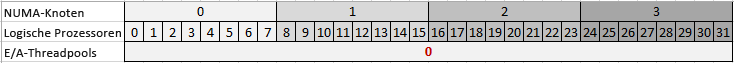
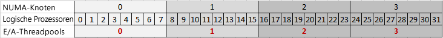
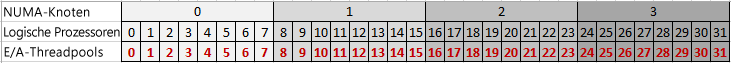

# Threadpooleigenschaften
[!INCLUDE[ssas-appliesto-sqlas](../../includes/ssas-appliesto-sqlas.md)][!INCLUDE[ssASnoversion](../../includes/ssasnoversion-md.md)] verwendet Multithreading für viele Vorgänge, die gesamtleistung des Servers verbessern, indem mehrere Aufträge parallel ausgeführt wird. Zur effizienteren Verwaltung von Threads verwendet [!INCLUDE[ssASnoversion](../../includes/ssasnoversion-md.md)] Threadpools, um Threads vorab zuzuordnen und die Threadverfügbarkeit für den nächsten Auftrag zu erleichtern.  
  
 Jede Instanz von [!INCLUDE[ssASnoversion](../../includes/ssasnoversion-md.md)] verwaltet einen eigenen Satz von Threadpools. Es gibt Unterschiede in Bezug darauf, wie Threadpools von tabellarischen und mehrdimensionalen Instanzen verwendet werden. So verwenden z.B. nur mehrdimensionale Instanzen den **IOProcess** -Threadpool. Daher ist die in diesem Thema beschriebene **PerNumaNode** -Eigenschaft für tabellarische Instanzen bedeutungslos. Im Abschnitt [Eigenschaftsreferenz](#bkmk_propref) unten werden für jede Eigenschaft die Modusanforderungen aufgeführt.
  
 Dieses Thema enthält folgende Abschnitte:  
  
-   [Threadverwaltung in Analysis Services](#bkmk_threadarch)  
  
-   [Referenz zu Threadpooleigenschaften](#bkmk_propref)  
  
-   [Festlegen von GroupAffinity, um Threads Prozessoren in einer Prozessorgruppe zuzuordnen](#bkmk_groupaffinity)  
  
-   [Festlegen von PerNumaNode, um Prozessoren in einem NUMA-Knoten IO-Threads zuzuordnen](#bkmk_pernumanode)  
  
-   [Ermitteln der aktuellen Threadpooleinstellungen](#bkmk_currentsettings)  
  
-   [Abhängige oder verwandte Eigenschaften](#bkmk_related)  
  
-   [Informationen zu MSMDSRV.INI](#bkmk_msmdrsrvini)  
  
> [!NOTE]  
>  Die tabellarische Bereitstellung für NUMA-Systeme geht über dieses Thema hinaus. Obwohl es möglich ist, tabellarische Lösungen erfolgreich in NUMA-Systemen bereitzustellen, können die Leistungsmerkmale der von tabellarischen Modellen verwendeten speicherinternen Datenbanktechnologie bei Architekturen mit hoher zentraler Skalierung nur begrenzte Vorteile aufweisen. Weitere Informationen finden Sie unter [An Analysis Services Case Study: Using Tabular Models in a Large-scale Commercial Solution](http://msdn.microsoft.com/library/dn751533.aspx) (Verwenden von tabellarischen Modellen in umfangreichen kommerziellen Lösungen) und [Hardware Sizing a Tabular Solution (SQL Server Analysis Services)](http://go.microsoft.com/fwlink/?LinkId=330359)(Hardwareanforderungen für eine tabellarische Lösung).  
  
##   Threadverwaltung in Analysis Services  
 [!INCLUDE[ssASnoversion](../../includes/ssasnoversion-md.md)] verwendet Multithreading, um die verfügbaren CPU-Ressourcen optimal zu nutzen, indem die Anzahl der parallel ausgeführten Tasks erhöht wird. Das Speichermodul basiert auf dem Multithreadprinzip. Zu den Beispielen für Multithreadaufträge, die im Speichermodul ausgeführt werden, zählt die parallele Verarbeitung von Objekten, die Behandlung diskreter Abfragen, die an das Speichermodul weitergegeben wurden, oder die Rückgabe von Datenwerten, die von einer Abfrage angefordert wurden. Das Formelmodul ist ein Singlethread-Formelmodul, da die ausgewerteten Berechnungen seriell sind. Jede Abfrage wird hauptsächlich in einem einzelnen Thread ausgeführt. Hierbei werden Daten angefordert, und es wird oft auf die Rückgabe dieser Daten vom Speichermodul gewartet. Die Ausführung von Abfragethreads dauert länger. Sie werden erst nach Abschluss der gesamten Abfrage freigegeben.  
  
 In den Versionen [!INCLUDE[ssSQL11](../../includes/sssql11-md.md)] und höher verwendet [!INCLUDE[ssASnoversion](../../includes/ssasnoversion-md.md)] standardmäßig alle verfügbaren logischen Prozessoren. Auf Systemen mit höheren Editionen von Windows und SQL Server kann die Anzahl bis zu 640 betragen. Beim Starten wird der Prozess „msmdsrv.exe“ einer bestimmten Prozessorgruppe zugewiesen, aber im Laufe der Zeit können Threads für jeden logischen Prozessor oder in jeder Prozessorgruppe geplant werden.  
  
 Ein Nebeneffekt der Verwendung vieler Prozessoren besteht darin, dass zeitweise Leistungsabfälle auftreten, wenn Abfrage- und Verarbeitungslasten über eine große Anzahl von Prozessoren verteilt sind und Konflikte um gemeinsam verwendete Datenstrukturen zunehmen. Dies kann insbesondere bei High-End-Systemen mit einer NUMA-Architektur, aber auch bei Systemen ohne NUMA auftreten, in denen mehrere datenintensive Anwendungen auf der gleichen Hardware laufen.  
  
 Um dieses Problem zu beheben, können Sie die Affinität zwischen Typen von [!INCLUDE[ssASnoversion](../../includes/ssasnoversion-md.md)] -Vorgängen und einem bestimmten Satz logischer Prozessoren festlegen. Mit der **GroupAffinity** -Eigenschaft können Sie benutzerdefinierte Affinitätsmasken erstellen, die angeben, welche Systemressource für jeden der von [!INCLUDE[ssASnoversion](../../includes/ssasnoversion-md.md)].
 
Wir empfehlen das kumulative Update 1 für SQL Server 2016 (CU1) oder höher für die Einstellung **GroupAffinity** in tabellarischen Instanzen. 
  
 **GroupAffinity** ist eine Eigenschaft, die für jeden der Threadpools festgelegt werden, die für verschiedene [!INCLUDE[ssASnoversion](../../includes/ssasnoversion-md.md)] -Arbeitsauslastungen verwendet werden:  
  
-   **Threadpool\Parsing\Short**  ist ein Analysepool für kurze Anforderungen. Anforderungen, die in eine einzelne Netzwerknachricht passen, gelten als kurz. 
  
-   **Threadpool\Parsing\Long**  ist ein Analysepool für alle anderen Anforderungen, die nicht in eine einzelne Netzwerknachricht passen. 
  
    > [!NOTE]  
    >  Ein Thread aus einem der beiden Analysepools kann zum Ausführen einer Abfrage verwendet werden. Abfragen mit schneller Ausführung wie eine schnelle Ermittlungs- oder Abbruchanforderung werden manchmal sofort ausgeführt und nicht in die Warteschlange des Abfragethreadpools gestellt. 
  
-   **Threadpool\Query** ist der Threadpool, der alle Anforderungen ausführt, die nicht vom Analysethreadpool behandelt werden. Threads in diesem Threadpool führen alle Vorgangstypen aus, z. B. Ermittlungen, MDX-, DAX-, DMX- und DDL-Befehle. Ein
  
-   **Threadpool\IOProcess** wird für E/A-Aufträge verwendet, die Speichermodulabfragen im mehrdimensionalen Modul zugeordnet sind. Die von diesen Threads verarbeiteten Aufgaben sollten erwartungsgemäß keine Abhängigkeiten von anderen Threads aufweisen. Diese Threads scannen in der Regel ein einzelnes Segment einer Partition und führen eine Filterung und Aggregation der Segmentdaten durch. **IOProcess** -Threads reagieren besonders empfindlich auf die NUMA-Hardwarekonfigurationen. Dieser Threadpool verfügt über die **PerNumaNode** -Konfigurationseigenschaft, die verwendet werden kann, um die Leistung bei Bedarf zu optimieren. 
  
-   **Threadpool\Process** wird für längere Speichermodulaufträge verwendet, darunter Aggregationen, Indizierungen und Commitvorgänge. Der ROLAP-Speichermodus verwendet ebenfalls Threads aus dem Verarbeitungsthreadpool.  

- **VertiPaq\ThreadPool** ist der Threadpool für die Ausführung von Tabellenscans in einem tabellarischen Modell.
  
 Um Anforderungen zu bearbeiten, kann [!INCLUDE[ssASnoversion](../../includes/ssasnoversion-md.md)] u. U. die maximale Threadpoolgrenze überschreiten und zusätzliche Threads anfordern, wenn diese für die Ausführung der Aufgabe erforderlich sind. Wenn jedoch ein Thread seine Aufgabe abgeschlossen hat und die aktuelle Threadanzahl höher als die maximale Grenze ist, wird der Thread einfach beendet und nicht an den Threadpool zurückgegeben.  
  
> [!NOTE]  
>  Die Überschreitung der maximalen Threadpoolanzahl ist eine Schutzmaßnahme, die greift, wenn bestimmte Deadlockbedingungen auftreten. Um zu verhindern, dass über den Höchstwert hinaus in unkontrollierter Weise Threads erstellt werden, erfolgt die Threaderstellung nach Erreichen des Grenzwerts schrittweise (mit einer kurzen Verzögerung). Ein Überschreiten der maximalen Threadanzahl kann eine Verlangsamung der Taskausführung bewirken. Wenn die Leistungsindikatoren zeigen, dass die Threadanzahl regelmäßig den Maximalwert für Threadpools übersteigt, kann dies ein Hinweis darauf sein, dass die Threadpools zu klein für die Anzahl der vom System angeforderten parallelen Vorgänge sind.  
  
 Die Threadpoolgröße wird standardmäßig von [!INCLUDE[ssASnoversion](../../includes/ssasnoversion-md.md)]bestimmt und beruht auf der Anzahl der Kerne. Sie können die ausgewählten Standardwerte beobachten, indem Sie die Datei „msmdsrv.log“ nach dem Serverstart überprüfen. Als Übung für die Leistungsoptimierung können Sie die Größe des Threadpools sowie anderer Eigenschaften erhöhen, um die Abfrage- oder Verarbeitungsleistung zu verbessern.  
  
##   Referenz zu Threadpooleigenschaften  
 In diesem Abschnitt werden die Threadpooleigenschaften beschrieben, die sich in der Datei „msmdsrv.ini“ der einzelnen [!INCLUDE[ssASnoversion](../../includes/ssasnoversion-md.md)] -Instanzen befinden. Eine Teilmenge dieser Eigenschaften ist auch in SQL Server Management Studio vorhanden.  
  
 Die Eigenschaften sind in alphabetischer Reihenfolge aufgeführt.  
  
|Name|Typ|Description|Standardwert|Anleitung|  
|----------|----------|-----------------|-------------|--------------|  
|**IOProcess** \ **Concurrency**|double|Ein Gleitkommawert mit doppelter Genauigkeit, der den Algorithmus zum Festlegen eines Ziels für die Anzahl der Threads bestimmt, die gleichzeitig in eine Warteschlange gestellt werden können.|2.0|Eine erweiterte Eigenschaft, die nur mithilfe der Schritte in [!INCLUDE[msCoName](../../includes/msconame-md.md)] geändert werden sollte.   Die Parallelität wird verwendet, um Threadpools zu initialisieren, die mithilfe von E/A-Abschlussports in Windows implementiert werden. Einzelheiten finden Sie unter [I/O Completion Ports](http://msdn.microsoft.com/library/windows/desktop/aa365198\(v=vs.85\).aspx) (E/A-Abschlussports).   Gilt nur für mehrdimensionale Modelle.|  
|**IOProcess** \ **GroupAffinity**|Zeichenfolge|Ein Array von Hexadezimalwerten, die Prozessorgruppen im System entsprechen. Wird verwendet, um die Affinität von Threads im IOProcess-Threadpool zu logischen Prozessoren in den einzelnen Prozessorgruppen festzulegen.|none|Mit dieser Eigenschaft können Sie benutzerdefinierte Affinitäten erstellen. Die Eigenschaft ist standardmäßig leer.   Details finden Sie unter [Festlegen von GroupAffinity, um Threads Prozessoren in einer Prozessorgruppe zuzuordnen](#bkmk_groupaffinity) .   Gilt nur für mehrdimensionale Modelle.|  
|**IOProcess** \ **MaxThreads**|ssNoversion|Eine ganze 32-Bit-Zahl mit Vorzeichen, die die maximale Anzahl von Threads angibt, die im Threadpool eingeschlossen werden sollen.|0|0 gibt an, dass der Server die Standardwerte bestimmt. Standardmäßig legt der Server diesen Wert entweder auf 64 fest oder multipliziert die Anzahl der logischen Prozessoren mit 10, je nachdem, welcher Wert größer ist. In einem System mit 4 Kernen und Hyperthreading beträgt der Maximalwert für Threadpools beispielsweise 80 Threads.   Wenn Sie diesen Wert auf einen negativen Wert festlegen, multipliziert der Server den Wert mit der Anzahl der logischen Prozessoren. Wenn der Wert auf einem Server, der über 32 logische Prozessoren verfügt, beispielsweise auf -10 festgelegt ist, beträgt der Höchstwert 320 Threads.   Der Höchstwert ist abhängig von den verfügbaren Prozessoren der benutzerdefinierten Affinitätsmasken, die Sie zuvor festgelegt haben. Wenn Sie für die Threadpoolaffinität z. B. bereits festgelegt haben, dass 8 von 32 Prozessoren verwendet werden, und Sie MaxThreads jetzt auf -10 festlegen, dann entspricht die obere Grenze für den Threadpool dem Ergebnis aus 10 x 8 (= 80 Threads).   Die für diese Threadpooleigenschaft tatsächlich verwendeten Werte werden beim Dienststart in die msmdsrv-Protokolldatei geschrieben.   Weitere Informationen zum Optimieren der Threadpooleinstellungen finden Sie im [Analysis Services-Verfahrenshandbuch](http://msdn.microsoft.com/library/hh226085.aspx).   Gilt nur für mehrdimensionale Modelle.|  
|**IOProcess** \ **MinThreads**|ssNoversion|Eine ganze 32-Bit-Zahl mit Vorzeichen, die die Mindestanzahl von Threads angibt, die für den Threadpool vorab zugeordnet werden sollen.|0|0 gibt an, dass der Server die Standardwerte bestimmt. Der Minimalwert ist standardmäßig 1.   Wenn Sie diesen Wert auf einen negativen Wert festlegen, multipliziert der Server den Wert mit der Anzahl der logischen Prozessoren.   Die für diese Threadpooleigenschaft tatsächlich verwendeten Werte werden beim Dienststart in die msmdsrv-Protokolldatei geschrieben.   Weitere Informationen zum Optimieren der Threadpooleinstellungen finden Sie im [Analysis Services-Verfahrenshandbuch](http://msdn.microsoft.com/library/hh226085.aspx).   Gilt nur für mehrdimensionale Modelle.|  
|**IOProcess** \ **PerNumaNode**|ssNoversion|Eine ganze 32-Bit-Zahl mit Vorzeichen, die die Anzahl von Threadpools bestimmt, die für den msmdsrv-Prozess erstellt werden können.|-1|Gültige Werte sind -1, 0, 1 und 2.   -1 = Der Server wählt basierend auf der Anzahl der NUMA-Knoten eine andere E/A-Threadpoolstrategie aus. Bei Systemen mit weniger als vier NUMA-Knoten entspricht das Serververhalten dem Verhalten bei 0 (für das System wird ein IOProcess-Threadpool erstellt). Bei Systemen mit vier oder mehr Knoten entspricht das Verhalten dem Verhalten bei 1 (für jeden Knoten werden IOProcess-Threadpools erstellt).   0 = Deaktiviert Threadpools pro NUMA-Knoten, sodass nur ein IOProcess-Threadpool vom Prozess msmdsrv.exe verwendet wird.   1 = Aktiviert einen IOProcess-Threadpool pro NUMA-Knoten.   2 = Ein IOProcess-Threadpool pro logischem Prozessor. Die Threads in jedem Threadpool werden dem NUMA-Knoten des logischen Prozessors zugeordnet, wobei der logische Prozessor als idealer Prozessor festgelegt ist.   Details finden Sie unter [Festlegen von PerNumaNode, um Prozessoren in einem NUMA-Knoten IO-Threads zuzuordnen](#bkmk_pernumanode) .   Gilt nur für mehrdimensionale Modelle.|  
|**IOProcess** \ **PriorityRatio**|ssNoversion|Eine ganze 32-Bit-Zahl mit Vorzeichen, mit der sichergestellt werden kann, dass Threads mit niedrigerer Priorität manchmal auch dann ausgeführt werden, wenn eine Warteschlange mit höherer Priorität nicht leer ist.|2|Eine erweiterte Eigenschaft, die nur mithilfe der Schritte in [!INCLUDE[msCoName](../../includes/msconame-md.md)] geändert werden sollte.   Gilt nur für mehrdimensionale Modelle.|  
|**IOProcess** \ **StackSizeKB**|ssNoversion|Eine ganze 32-Bit-Zahl mit Vorzeichen, mit der die Speicherbelegung während der Threadausführung angepasst werden kann.|0|Eine erweiterte Eigenschaft, die nur mithilfe der Schritte in [!INCLUDE[msCoName](../../includes/msconame-md.md)] geändert werden sollte.   Gilt nur für mehrdimensionale Modelle.|  
|**Parsing**  \ **Long** \ **Concurrency**|double|Ein Gleitkommawert mit doppelter Genauigkeit, der den Algorithmus zum Festlegen eines Ziels für die Anzahl der Threads bestimmt, die gleichzeitig in eine Warteschlange gestellt werden können.|2.0|Eine erweiterte Eigenschaft, die nur mithilfe der Schritte in [!INCLUDE[msCoName](../../includes/msconame-md.md)] geändert werden sollte.   Die Parallelität wird verwendet, um Threadpools zu initialisieren, die mithilfe von E/A-Abschlussports in Windows implementiert werden. Einzelheiten finden Sie unter [I/O Completion Ports](http://msdn.microsoft.com/library/windows/desktop/aa365198\(v=vs.85\).aspx) (E/A-Abschlussports).|  
|**Parsing**  \ **Long** \ **GroupAffinity**|Zeichenfolge|Ein Array von Hexadezimalwerten, die Prozessorgruppen im System entsprechen. Wird verwendet, um die Affinität von Analysethreads zu logischen Prozessoren in den einzelnen Prozessorgruppen festzulegen.|none|Mit dieser Eigenschaft können Sie benutzerdefinierte Affinitäten erstellen. Die Eigenschaft ist standardmäßig leer.   Details finden Sie unter [Festlegen von GroupAffinity, um Threads Prozessoren in einer Prozessorgruppe zuzuordnen](#bkmk_groupaffinity) .|  
|**Parsing**  \ **Long** \ **NumThreads**|ssNoversion|Eine ganze 32-Bit-Zahl mit Vorzeichen, die die Anzahl von Threads definiert, die für Langbefehle erstellt werden können.|0|0 gibt an, dass der Server die Standardwerte bestimmt. Das Standardverhalten besteht darin, **NumThreads** auf einen absoluten Wert von 4 bzw. die doppelte Anzahl logischer Prozessoren festzulegen, je nachdem, welcher Wert größer ist.   Wenn Sie diesen Wert auf einen negativen Wert festlegen, multipliziert der Server den Wert mit der Anzahl der logischen Prozessoren. Wenn der Wert auf einem Server, der über 32 logische Prozessoren verfügt, beispielsweise auf -10 festgelegt ist, beträgt der Höchstwert 320 Threads.   Der Höchstwert ist abhängig von den verfügbaren Prozessoren der benutzerdefinierten Affinitätsmasken, die Sie zuvor festgelegt haben. Wenn Sie für die Threadpoolaffinität z. B. bereits festgelegt haben, dass 8 von 32 Prozessoren verwendet werden, und Sie NumThreads jetzt auf -10 festlegen, dann entspricht die obere Grenze für den Threadpool dem Ergebnis aus 10 x 8 (= 80 Threads).   Die für diese Threadpooleigenschaft tatsächlich verwendeten Werte werden beim Dienststart in die msmdsrv-Protokolldatei geschrieben.|  
|**Parsing**  \ **Long** \ **PriorityRatio**|ssNoversion|Eine ganze 32-Bit-Zahl mit Vorzeichen, mit der sichergestellt werden kann, dass Threads mit niedrigerer Priorität manchmal auch dann ausgeführt werden, wenn eine Warteschlange mit höherer Priorität nicht leer ist.|0|Eine erweiterte Eigenschaft, die nur mithilfe der Schritte in [!INCLUDE[msCoName](../../includes/msconame-md.md)] geändert werden sollte.|  
|**Parsing**  \ **Long** \ **StackSizeKB**|ssNoversion|Eine ganze 32-Bit-Zahl mit Vorzeichen, mit der die Speicherbelegung während der Threadausführung angepasst werden kann.|0|Eine erweiterte Eigenschaft, die nur mithilfe der Schritte in [!INCLUDE[msCoName](../../includes/msconame-md.md)] geändert werden sollte.|  
|**Parsing**  \ **Short** \ **Concurrency**|double|Ein Gleitkommawert mit doppelter Genauigkeit, der den Algorithmus zum Festlegen eines Ziels für die Anzahl der Threads bestimmt, die gleichzeitig in eine Warteschlange gestellt werden können.|2.0|Eine erweiterte Eigenschaft, die nur mithilfe der Schritte in [!INCLUDE[msCoName](../../includes/msconame-md.md)] geändert werden sollte.   Die Parallelität wird verwendet, um Threadpools zu initialisieren, die mithilfe von E/A-Abschlussports in Windows implementiert werden. Einzelheiten finden Sie unter [I/O Completion Ports](http://msdn.microsoft.com/library/windows/desktop/aa365198\(v=vs.85\).aspx) (E/A-Abschlussports).|  
|**Parsing**  \ **Short** \ **GroupAffinity**|Zeichenfolge|Ein Array von Hexadezimalwerten, die Prozessorgruppen im System entsprechen. Wird verwendet, um die Affinität von Analysethreads zu logischen Prozessoren in den einzelnen Prozessorgruppen festzulegen.|none|Mit dieser Eigenschaft können Sie benutzerdefinierte Affinitäten erstellen. Die Eigenschaft ist standardmäßig leer.   Details finden Sie unter [Festlegen von GroupAffinity, um Threads Prozessoren in einer Prozessorgruppe zuzuordnen](#bkmk_groupaffinity) .|  
|**Parsing**  \ **Short** \ **NumThreads**|ssNoversion|Eine ganze 32-Bit-Zahl mit Vorzeichen, die die Anzahl von Threads definiert, die für Kurzbefehle erstellt werden können.|0|0 gibt an, dass der Server die Standardwerte bestimmt. Das Standardverhalten besteht darin, **NumThreads** auf einen absoluten Wert von 4 bzw. die doppelte Anzahl logischer Prozessoren festzulegen, je nachdem, welcher Wert größer ist.   Wenn Sie diesen Wert auf einen negativen Wert festlegen, multipliziert der Server den Wert mit der Anzahl der logischen Prozessoren. Wenn der Wert auf einem Server, der über 32 logische Prozessoren verfügt, beispielsweise auf -10 festgelegt ist, beträgt der Höchstwert 320 Threads.   Der Höchstwert ist abhängig von den verfügbaren Prozessoren der benutzerdefinierten Affinitätsmasken, die Sie zuvor festgelegt haben. Wenn Sie für die Threadpoolaffinität z. B. bereits festgelegt haben, dass 8 von 32 Prozessoren verwendet werden, und Sie NumThreads jetzt auf -10 festlegen, dann entspricht die obere Grenze für den Threadpool dem Ergebnis aus 10 x 8 (= 80 Threads).   Die für diese Threadpooleigenschaft tatsächlich verwendeten Werte werden beim Dienststart in die msmdsrv-Protokolldatei geschrieben.|  
|**Parsing**  \ **Short** \ **PriorityRatio**|ssNoversion|Eine ganze 32-Bit-Zahl mit Vorzeichen, mit der sichergestellt werden kann, dass Threads mit niedrigerer Priorität manchmal auch dann ausgeführt werden, wenn eine Warteschlange mit höherer Priorität nicht leer ist.|0|Eine erweiterte Eigenschaft, die nur mithilfe der Schritte in [!INCLUDE[msCoName](../../includes/msconame-md.md)] geändert werden sollte.|  
|**Parsing**  \ **Short** \ **StackSizeKB**|ssNoversion|Eine ganze 32-Bit-Zahl mit Vorzeichen, mit der die Speicherbelegung während der Threadausführung angepasst werden kann.|64 * logische Prozessoren|Eine erweiterte Eigenschaft, die nur mithilfe der Schritte in [!INCLUDE[msCoName](../../includes/msconame-md.md)] geändert werden sollte.|  
|**Process** \ **Concurrency**|double|Ein Gleitkommawert mit doppelter Genauigkeit, der den Algorithmus zum Festlegen eines Ziels für die Anzahl der Threads bestimmt, die gleichzeitig in eine Warteschlange gestellt werden können.|2.0|Eine erweiterte Eigenschaft, die nur mithilfe der Schritte in [!INCLUDE[msCoName](../../includes/msconame-md.md)] geändert werden sollte.   Die Parallelität wird verwendet, um Threadpools zu initialisieren, die mithilfe von E/A-Abschlussports in Windows implementiert werden. Einzelheiten finden Sie unter [I/O Completion Ports](http://msdn.microsoft.com/library/windows/desktop/aa365198\(v=vs.85\).aspx) (E/A-Abschlussports).|  
|**Process** \ **GroupAffinity**|Zeichenfolge|Ein Array von Hexadezimalwerten, die Prozessorgruppen im System entsprechen. Wird verwendet, um die Affinität von Verarbeitungsthreads zu logischen Prozessoren in den einzelnen Prozessorgruppen festzulegen.|none|Mit dieser Eigenschaft können Sie benutzerdefinierte Affinitäten erstellen. Die Eigenschaft ist standardmäßig leer.   Details finden Sie unter [Festlegen von GroupAffinity, um Threads Prozessoren in einer Prozessorgruppe zuzuordnen](#bkmk_groupaffinity) .|  
|**Process** \ **MaxThreads**|ssNoversion|Eine ganze 32-Bit-Zahl mit Vorzeichen, die die maximale Anzahl von Threads angibt, die im Threadpool eingeschlossen werden sollen.|0|0 gibt an, dass der Server die Standardwerte bestimmt. Standardmäßig legt der Server diesen Wert entweder auf einen absoluten Wert von 64 oder auf die Anzahl logischer Prozessoren fest, je nachdem, welcher Wert größer ist. In einem System mit 64 Kernen und aktiviertem Hyperthreading (= 128 logische Prozessoren) beträgt der Maximalwert für den Threadpool beispielsweise 128 Threads.   Wenn Sie diesen Wert auf einen negativen Wert festlegen, multipliziert der Server den Wert mit der Anzahl der logischen Prozessoren. Wenn der Wert auf einem Server, der über 32 logische Prozessoren verfügt, beispielsweise auf -10 festgelegt ist, beträgt der Höchstwert 320 Threads.   Der Höchstwert ist abhängig von den verfügbaren Prozessoren der benutzerdefinierten Affinitätsmasken, die Sie zuvor festgelegt haben. Wenn Sie für die Threadpoolaffinität z. B. bereits festgelegt haben, dass 8 von 32 Prozessoren verwendet werden, und Sie MaxThreads jetzt auf -10 festlegen, dann entspricht die obere Grenze für den Threadpool dem Ergebnis aus 10 x 8 (= 80 Threads).   Die für diese Threadpooleigenschaft tatsächlich verwendeten Werte werden beim Dienststart in die msmdsrv-Protokolldatei geschrieben.   Weitere Informationen zum Optimieren der Threadpooleinstellungen finden Sie im [Analysis Services-Verfahrenshandbuch](http://msdn.microsoft.com/library/hh226085.aspx).|  
|**Process** \ **MinThreads**|ssNoversion|Eine ganze 32-Bit-Zahl mit Vorzeichen, die die Mindestanzahl von Threads angibt, die für den Threadpool vorab zugeordnet werden sollen.|0|0 gibt an, dass der Server die Standardwerte bestimmt. Der Minimalwert ist standardmäßig 1.   Wenn Sie diesen Wert auf einen negativen Wert festlegen, multipliziert der Server den Wert mit der Anzahl der logischen Prozessoren.   Die für diese Threadpooleigenschaft tatsächlich verwendeten Werte werden beim Dienststart in die msmdsrv-Protokolldatei geschrieben.   Weitere Informationen zum Optimieren der Threadpooleinstellungen finden Sie im [Analysis Services-Verfahrenshandbuch](http://msdn.microsoft.com/library/hh226085.aspx).|  
|**Process** \ **PriorityRatio**|ssNoversion|Eine ganze 32-Bit-Zahl mit Vorzeichen, mit der sichergestellt werden kann, dass Threads mit niedrigerer Priorität manchmal auch dann ausgeführt werden, wenn eine Warteschlange mit höherer Priorität nicht leer ist.|2|Eine erweiterte Eigenschaft, die nur mithilfe der Schritte in [!INCLUDE[msCoName](../../includes/msconame-md.md)] geändert werden sollte.|  
|**Process** \ **StackSizeKB**|ssNoversion|Eine ganze 32-Bit-Zahl mit Vorzeichen, mit der die Speicherbelegung während der Threadausführung angepasst werden kann.|0|Eine erweiterte Eigenschaft, die nur mithilfe der Schritte in [!INCLUDE[msCoName](../../includes/msconame-md.md)] geändert werden sollte.|  
|**Query**  \ **Concurrency**|double|Ein Gleitkommawert mit doppelter Genauigkeit, der den Algorithmus zum Festlegen eines Ziels für die Anzahl der Threads bestimmt, die gleichzeitig in eine Warteschlange gestellt werden können.|2.0|Eine erweiterte Eigenschaft, die nur mithilfe der Schritte in [!INCLUDE[msCoName](../../includes/msconame-md.md)] geändert werden sollte.   Die Parallelität wird verwendet, um Threadpools zu initialisieren, die mithilfe von E/A-Abschlussports in Windows implementiert werden. Einzelheiten finden Sie unter [I/O Completion Ports](http://msdn.microsoft.com/library/windows/desktop/aa365198\(v=vs.85\).aspx) (E/A-Abschlussports).|  
|**Query** \ **GroupAffinity**|Zeichenfolge|Ein Array von Hexadezimalwerten, die Prozessorgruppen im System entsprechen. Wird verwendet, um die Affinität von Verarbeitungsthreads zu logischen Prozessoren in den einzelnen Prozessorgruppen festzulegen.|none|Mit dieser Eigenschaft können Sie benutzerdefinierte Affinitäten erstellen. Die Eigenschaft ist standardmäßig leer.   Details finden Sie unter [Festlegen von GroupAffinity, um Threads Prozessoren in einer Prozessorgruppe zuzuordnen](#bkmk_groupaffinity) .|  
|**Query**  \ **MaxThreads**|ssNoversion|Eine ganze 32-Bit-Zahl mit Vorzeichen, die die maximale Anzahl von Threads angibt, die im Threadpool eingeschlossen werden sollen.|0|0 gibt an, dass der Server die Standardwerte bestimmt. Standardmäßig legt der Server diesen Wert entweder auf einen absoluten Wert von 10 oder auf die doppelte Anzahl logischer Prozessoren fest, je nachdem, welcher Wert größer ist. In einem System mit 4 Kernen und Hyperthreading ist die Höchstzahl für Threads beispielsweise 16.   Wenn Sie diesen Wert auf einen negativen Wert festlegen, multipliziert der Server den Wert mit der Anzahl der logischen Prozessoren. Wenn der Wert auf einem Server, der über 32 logische Prozessoren verfügt, beispielsweise auf -10 festgelegt ist, beträgt der Höchstwert 320 Threads.   Der Höchstwert ist abhängig von den verfügbaren Prozessoren der benutzerdefinierten Affinitätsmasken, die Sie zuvor festgelegt haben. Wenn Sie für die Threadpoolaffinität z. B. bereits festgelegt haben, dass 8 von 32 Prozessoren verwendet werden, und Sie MaxThreads jetzt auf -10 festlegen, dann entspricht die obere Grenze für den Threadpool dem Ergebnis aus 10 x 8 (= 80 Threads).   Die für diese Threadpooleigenschaft tatsächlich verwendeten Werte werden beim Dienststart in die msmdsrv-Protokolldatei geschrieben.   Weitere Informationen zum Optimieren der Threadpooleinstellungen finden Sie im [Analysis Services-Verfahrenshandbuch](http://msdn.microsoft.com/library/hh226085.aspx).|  
|**Query** \ **MinThreads**|ssNoversion|Eine ganze 32-Bit-Zahl mit Vorzeichen, die die Mindestanzahl von Threads angibt, die für den Threadpool vorab zugeordnet werden sollen.|0|0 gibt an, dass der Server die Standardwerte bestimmt. Der Minimalwert ist standardmäßig 1.   Wenn Sie diesen Wert auf einen negativen Wert festlegen, multipliziert der Server den Wert mit der Anzahl der logischen Prozessoren.   Die für diese Threadpooleigenschaft tatsächlich verwendeten Werte werden beim Dienststart in die msmdsrv-Protokolldatei geschrieben.   Weitere Informationen zum Optimieren der Threadpooleinstellungen finden Sie im [Analysis Services-Verfahrenshandbuch](http://msdn.microsoft.com/library/hh226085.aspx).|  
|**Query** \ **PriorityRatio**|ssNoversion|Eine ganze 32-Bit-Zahl mit Vorzeichen, mit der sichergestellt werden kann, dass Threads mit niedrigerer Priorität manchmal auch dann ausgeführt werden, wenn eine Warteschlange mit höherer Priorität nicht leer ist.|2|Eine erweiterte Eigenschaft, die nur mithilfe der Schritte in [!INCLUDE[msCoName](../../includes/msconame-md.md)] geändert werden sollte.|  
|**Query**  \ **StackSizeKB**|ssNoversion|Eine ganze 32-Bit-Zahl mit Vorzeichen, mit der die Speicherbelegung während der Threadausführung angepasst werden kann.|0|Eine erweiterte Eigenschaft, die nur mithilfe der Schritte in [!INCLUDE[msCoName](../../includes/msconame-md.md)] geändert werden sollte.|  
|**VertiPaq** \ **CPUs**|ssNoversion|Eine 32-Bit-Ganzzahl mit Vorzeichen, die die maximale Anzahl von Prozessoren angibt, die für tabellarische Abfragen verwendet werden sollen.|0|0 gibt an, dass der Server die Standardwerte bestimmt. Standardmäßig legt der Server diesen Wert entweder auf einen absoluten Wert von 10 oder auf die doppelte Anzahl logischer Prozessoren fest, je nachdem, welcher Wert größer ist. In einem System mit 4 Kernen und Hyperthreading ist die Höchstzahl für Threads beispielsweise 16.   Wenn Sie diesen Wert auf einen negativen Wert festlegen, multipliziert der Server den Wert mit der Anzahl der logischen Prozessoren. Wenn der Wert auf einem Server, der über 32 logische Prozessoren verfügt, beispielsweise auf -10 festgelegt ist, beträgt der Höchstwert 320 Threads.   Der Höchstwert ist abhängig von den verfügbaren Prozessoren der benutzerdefinierten Affinitätsmasken, die Sie zuvor festgelegt haben. Wenn Sie für die Threadpoolaffinität z. B. bereits festgelegt haben, dass 8 von 32 Prozessoren verwendet werden, und Sie MaxThreads jetzt auf -10 festlegen, dann entspricht die obere Grenze für den Threadpool dem Ergebnis aus 10 x 8 (= 80 Threads).   Die für diese Threadpooleigenschaft tatsächlich verwendeten Werte werden beim Dienststart in die msmdsrv-Protokolldatei geschrieben.|  
  |**VertiPaq** \ **GroupAffinity**|Zeichenfolge|Ein Array von Hexadezimalwerten, die Prozessorgruppen im System entsprechen. Wird verwendet, um die Affinität von Verarbeitungsthreads zu logischen Prozessoren in den einzelnen Prozessorgruppen festzulegen.|none|Mit dieser Eigenschaft können Sie benutzerdefinierte Affinitäten erstellen. Die Eigenschaft ist standardmäßig leer.   Details finden Sie unter [Festlegen von GroupAffinity, um Threads Prozessoren in einer Prozessorgruppe zuzuordnen](#bkmk_groupaffinity) . Gilt nur für tabellarische Modelle.| 
    
##   Festlegen von GroupAffinity, um Threads Prozessoren in einer Prozessorgruppe zuzuordnen  
 **GroupAffinity** dient erweiterten Optimierungszwecken. Sie können die **GroupAffinity** -Eigenschaft verwenden, um die Affinität zwischen [!INCLUDE[ssASnoversion](../../includes/ssasnoversion-md.md)] -Threadpools und spezifischen Prozessoren festzulegen; bei den meisten Installationen zeigt [!INCLUDE[ssASnoversion](../../includes/ssasnoversion-md.md)] jedoch die beste Leistung, wenn alle verfügbaren logischen Prozessoren genutzt werden können. Dementsprechend ist für die Gruppenaffinität standardmäßig kein Wert angegeben.  
  
 Sollten Leistungstests ergeben, dass eine CPU-Optimierung erforderlich ist, können Sie einen allgemeineren Ansatz in Betracht ziehen. Beispielsweise können Sie den Windows Server-Ressourcen-Manager verwenden, um die Affinität zwischen logischen Prozessoren und einem Serverprozess festzulegen. Ein derartiger Ansatz ist u. U. leichter zu implementieren und zu verwalten, als benutzerdefinierte Affinitäten für einzelne Threadpools zu definieren.  
  
 Wenn dieser Ansatz nicht ausreicht, können Sie eine höhere Genauigkeit erreichen, indem Sie benutzerdefinierte Affinitäten für Threadpools definieren. Anpassungen der Affinitätseinstellungen werden eher für große Multikernsysteme (NUMA oder Nicht-NUMA) empfohlen, bei denen aufgrund der Verteilung der Threadpools auf zu viele Prozessoren Leistungsabfälle auftreten. Sie können **GroupAffinity** zwar für Systeme mit weniger als 64 logischen Prozessoren festlegen, doch die Vorteile sind zu vernachlässigen, und es kann sogar zu Leistungseinbußen kommen.  
  
> [!NOTE]  
>  **GroupAffinity** ist je nach Edition hinsichtlich der Anzahl der von [!INCLUDE[ssASnoversion](../../includes/ssasnoversion-md.md)]. Beim Start verwendet [!INCLUDE[ssASnoversion](../../includes/ssasnoversion-md.md)] Editionsinformationen und die **GroupAffinity** -Eigenschaften, um für jeden der von [!INCLUDE[ssASnoversion](../../includes/ssasnoversion-md.md)]verwalteten Threadpools Affinitätsmasken zu berechnen. Für die Standard Edition können maximal 24 Kerne verwendet werden. Wenn Sie die [!INCLUDE[ssASnoversion](../../includes/ssasnoversion-md.md)] Standard Edition auf einem großen Multikernsystem mit mehr als 24 Kernen installieren, verwendet [!INCLUDE[ssASnoversion](../../includes/ssasnoversion-md.md)] nur 24 von diesen. Weitere Informationen zu den Prozessorhöchstwerten finden Sie unter den feldübergreifenden Skalagrenzen in [Von den SQL Server 2016-Editionen unterstützte Funktionen](https://msdn.microsoft.com/library/cc645993.aspx).  
  
### Syntax  
 Der Wert ist für jede Prozessorgruppe hexadezimal, wobei der Hexadezimalwert die logischen Prozessoren darstellt, die [!INCLUDE[ssASnoversion](../../includes/ssasnoversion-md.md)] zuerst zu verwenden versucht, wenn Threads für einen bestimmten Threadpool zugeordnet werden.  
  
 **Bitmaske für logische Prozessoren**  
  
 Eine einzelne Prozessorgruppe kann bis zu 64 logische Prozessoren enthalten. Die Bitmaske ist 1 (oder 0) für jeden logischen Prozessor in der Gruppe, der von einem Threadpool verwendet (oder nicht verwendet) wird. Bei der Berechnung der Bitmaske berechnen Sie den Hexadezimalwert als Wert für **GroupAffinity**.  
  
 **Mehrere Prozessorgruppen**  
  
 Prozessorgruppen werden beim Systemstart bestimmt. **GroupAffinity** akzeptiert Hexadezimalwerte für jede Prozessorgruppe in einer durch Trennzeichen getrennten Liste. Bei mehreren Prozessorgruppen (bis zu 10 auf leistungsfähigeren High-End-Systemen) können Sie einzelne Gruppen umgehen, indem Sie 0x0 angeben. Auf einem System mit vier Prozessorgruppen (0, 1, 2, 3) können Sie z. B. die Gruppen 0 und 2 ausschließen, indem Sie 0x0 für den ersten und den dritten Wert eingeben.  
  
 `<GroupAffinity>0x0, 0xFF, 0x0, 0xFF</GroupAffinity>`  
  
### Schritte zum Berechnen der Prozessoraffinitätsmaske  
 Sie können **GroupAffinity** in „msmdsrv.ini“ oder in den Servereigenschaftenseiten in SQL Server Management Studio festlegen.  
  
1.  **Bestimmen der Anzahl von Prozessoren und Prozessorgruppen**  
  
     Sie können das [Coreinfo-Hilfsprogramm von winsysinternals](http://technet.microsoft.com/sysinternals/cc835722.aspx)herunterladen.  
  
     Führen Sie **coreinfo** aus, um diese Informationen aus dem Abschnitt "Zuordnung logischer Prozessoren zur Gruppe" abzurufen. Für jeden logischen Prozessor wird eine separate Zeile generiert.  
  
2.  Ordnen Sie die Prozessoren von rechts nach links an: `7654 3210`  
  
     Im Beispiel werden nur acht Prozessoren gezeigt (0 bis 7), eine Prozessorgruppe kann jedoch maximal 64 logische Prozessoren enthalten, und ein Windows-Server für Unternehmen kann bis zu 10 Prozessorgruppen aufweisen.  
  
3.  **Berechnen der Bitmaske für die zu verwendenden Prozessorgruppen**  
  
     `7654 3210`  
  
     Ersetzen Sie die Zahl durch 0 oder 1, je nachdem, ob Sie den logischen Prozessor ein- oder ausschließen möchten. Wenn Sie auf einem System mit acht Prozessoren die Prozessoren 7, 6, 5, 4 und 1 für Analysis Services verwenden möchten, kann die Berechnung wie folgt aussehen:  
  
     `1111 0010`  
  
4.  **Konvertieren der binären Zahl in einen Hexadezimalwert**  
  
     Konvertieren Sie die binäre Zahl mithilfe eines Rechners oder eines Konvertierungstools in die hexadezimale Entsprechung. Im Beispiel wird `1111 0010` in `0xF2`konvertiert.  
  
5.  **Eingeben des Hexadezimalwerts in der GroupAffinity-Eigenschaft**  
  
     Legen Sie **GroupAffinity** in „msmdsrv.ini“ oder in der Servereigenschaftenseite in Management Studio auf den in Schritt 4 berechneten Wert fest.  
  
> [!IMPORTANT]  
>  Das Festlegen von **GroupAffinity** ist eine manuelle Aufgabe, die mehrere Schritte umfasst. Überprüfen Sie Ihre Berechnungen für **GroupAffinity**sorgfältig. [!INCLUDE[ssASnoversion](../../includes/ssasnoversion-md.md)] gibt zwar einen Fehler zurück, wenn die gesamte Maske ungültig ist, aber eine Kombination aus gültigen und ungültigen Einstellungen führt dazu, dass [!INCLUDE[ssASnoversion](../../includes/ssasnoversion-md.md)] die Eigenschaft ignoriert. Wenn die Bitmaske zum Beispiel zusätzliche Werte enthält, ignoriert [!INCLUDE[ssASnoversion](../../includes/ssasnoversion-md.md)] die Einstellung und verwendet alle Prozessoren des Systems. Bei Auftreten dieser Aktion werden keine Warnung und kein Fehler angezeigt, der Datei „msmdsrv.log“ können Sie jedoch entnehmen, wie die Affinitäten tatsächlich festgelegt sind.  
  
##   Festlegen von PerNumaNode, um Prozessoren in einem NUMA-Knoten IO-Threads zuzuordnen  
 Bei mehrdimensionalen Analysis Services-Instanzen können Sie **PerNumaNode** für den **IOProcess** -Threadpool festlegen, um die Threadplanung und -ausführung weiter zu optimieren. Während **GroupAffinity** festlegt, welcher Satz logischer Prozessoren für einen bestimmten Threadpool verwendet werden soll, geht **PerNumaNode** einen Schritt weiter und gibt an, ob mehrere Threadpools erstellt werden sollen, die einer Teilmenge der zulässigen logischen Prozessoren zugeordnet werden.  
  
> [!NOTE]  
>  Verwenden Sie unter Windows Server 2012 den Task-Manager, um die Anzahl der NUMA-Knoten auf dem Computer anzuzeigen. Wählen Sie im Task-Manager auf der Registerkarte „Leistung“ die Option **CPU** aus, und klicken Sie mit der rechten Maustaste auf den Diagrammbereich, um die NUMA-Knoten anzuzeigen. Alternativ können Sie das Coreinfo-Hilfsprogramm von Windows Sysinternals [herunterladen](http://technet.microsoft.com/sysinternals/cc835722.aspx) und `coreinfo –n` ausführen, um NUMA-Knoten und die logischen Prozessoren in den einzelnen Knoten zurückzugeben.  
  
 Gültige Werte für **PerNumaNode** sind -1, 0, 1, 2, wie im Abschnitt [Referenz zu Threadpooleigenschaften](#bkmk_propref) in diesem Thema beschrieben.  
  
### Standard (empfohlen)  
 Für Systeme mit NUMA-Knoten wird empfohlen, die Standardeinstellung „PerNumaNode=-1“ zu verwenden, sodass [!INCLUDE[ssASnoversion](../../includes/ssasnoversion-md.md)] die Anzahl der Threadpools und deren Threadaffinität auf Grundlage der Knotenanzahl anpassen kann. Wenn das System über weniger als vier Knoten verfügt, implementiert [!INCLUDE[ssASnoversion](../../includes/ssasnoversion-md.md)] das von **PerNumaNode**=0 beschriebene Verhalten. **PerNumaNode**=1 wird dagegen für Systeme mit vier oder mehr Knoten verwendet.  
  
### Auswählen eines Werts  
 Sie können den Standardwert auch überschreiben, um einen anderen gültigen Wert zu verwenden.  
  
 **Festlegen von "PerNumaNode=0"**  
  
 NUMA-Knoten werden ignoriert. Es ist nur ein IOProcess-Threadpool vorhanden, und alle Threads in diesem Threadpool werden allen logischen Prozessoren zugeordnet. Dies ist (bei PerNumaNode=-1) die operative Standardeinstellung, wenn der Computer über weniger als vier NUMA-Knoten verfügt.  
  
   
  
 **Festlegen von "PerNumaNode=1"**  
  
 IOProcess-Threadpools werden für jeden NUMA-Knoten erstellt. Die Verwendung separater Threadpools verbessert den koordinierten Zugriff auf lokale Ressourcen wie den lokalen Cache für einen NUMA-Knoten.  
  
   
  
 **Festlegen von "PerNumaNode=2"**  
  
 Diese Einstellung ist für sehr leistungsfähige High-End-Systeme mit intensiven [!INCLUDE[ssASnoversion](../../includes/ssasnoversion-md.md)] -Arbeitsauslastungen vorgesehen. Diese Eigenschaft legt die IOProcess-Threadpoolaffinität auf das detaillierteste Niveau fest, sodass separate Threadpools auf Ebene der logischen Prozessoren erstellt und zugeordnet werden.  
  
 Wenn Sie wie im folgenden Beispiel über ein System mit vier NUMA-Knoten und 32 logischen Prozessoren verfügen und **PerNumaNode** auf 2 festlegen, ergibt dies 32 IOProcess-Threadpools. Die Threads in den ersten 8 Threadpools werden allen logischen Prozessoren im NUMA-Knoten 0 zugeordnet, wobei jedoch der ideale Prozessor auf 0, 1, 2 bis 7 festgelegt ist. Die nächsten acht Threadpools würden allen logischen Prozessoren im NUMA-Knoten 1 zugeordnet werden, wobei der ideale Prozessor auf 8,9, 10 bis zu 15 festgelegt wird, und so weiter.  
  
   
  
 Auf dieser Affinitätsebene versucht das Zeitplanungsmodul immer, zuerst den idealen logischen Prozessor im bevorzugten NUMA-Knoten zu verwenden. Wenn der logische Prozessor nicht verfügbar ist, wählt das Zeitplanungsmodul einen anderen Prozessor im selben Knoten oder in derselben Prozessorgruppe aus, wenn keine anderen Threads verfügbar sind. Weitere Informationen und Beispiele finden Sie unter [Analysis Services 2012 Configuration settings (Wordpress-Blog)](http://go.microsoft.com/fwlink/?LinkId=330387)(Analysis Services 2012-Konfigurationseinstellungen).  
  
###   Arbeitsverteilung unter IOProcess-Threads  
 Bei der Überlegung, ob Sie die **PerNumaNode** -Eigenschaft festlegen sollen oder nicht, hilft es zu wissen, wie **IOProcess** -Threads eingesetzt werden.  
  
 Bedenken Sie, dass **IOProcess** für E/A-Aufträge verwendet wird, die Speichermodulabfragen im mehrdimensionalen Modul zugeordnet sind.  
  
 Beim Scannen eines Segments identifiziert das Modul die Partition, der das Segment angehört, und versucht, den Segmentauftrag in die Warteschlange des von der Partition verwendeten Threadpools einzureihen. Generell reihen alle Segmente, die einer Partition angehören, ihre Tasks in die Warteschlange desselben Threadpools ein. Insbesondere bei NUMA-Systemen ist dieses Verhalten von Vorteil, da bei allen Partitionsscans der Arbeitsspeicher im Dateisystemcache verwendet wird, der diesem NUMA-Knoten lokal zugeordnet ist.  
  
 In den folgenden Szenarien werden Änderungen vorgeschlagen, durch die die Abfrageleistung bei NUMA-Systemen in manchen Fällen verbessert werden kann:  
  
-   Erhöhen Sie bei Measuregruppen, die unterpartitioniert sind (z. B. nur über eine Partition verfügen), die Anzahl der Partitionen. Die Verwendung nur einer Partition führt dazu, dass das Modul Tasks immer nur in die Warteschlange eines Threadpools (Threadpool 0) einreiht. Durch das Hinzufügen weiterer Partitionen kann das Modul zusätzliche Threadpools nutzen.  
  
     Wenn Sie keine zusätzlichen Partitionen erstellen können, versuchen Sie stattdessen, **PerNumaNode**=0 festzulegen, um die Anzahl der für Threadpool 0 verfügbaren Threads zu erhöhen.  
  
-   Bei Datenbanken, in denen Segmentscans gleichmäßig auf mehrere Partitionen verteilt sind, können Sie die Abfrageleistung verbessern, indem Sie **PerNumaNode** auf 1 oder 2 festlegen. Die Verbesserung ist darauf zurückzuführen, dass die vom System verwendete Gesamtanzahl von **IOProcess** -Threadpools erhöht wird.  
  
-   Versuchen Sie bei Lösungen, die über mehrere Partitionen verfügen, von denen nur eine intensiv gescannt wird, ob **PerNumaNode**=0 eine Leistungsverbesserung bringt.  
  
 Obwohl der **IOProcess** -Threadpool sowohl für Partitions- als auch für Dimensionsscans nutzbar ist, verwenden Dimensionsscans nur Threadpool 0. Dies kann zu einer etwas ungleichmäßigen Last für diesen Threadpool führen, wobei das Ungleichgewicht jedoch nur vorübergehend sein sollte, da Dimensionsscans tendenziell sehr schnell und selten auftreten.  
  
> [!NOTE]  
>  Bedenken Sie beim Ändern einer Servereigenschaft, dass die Konfigurationsoption für alle Datenbanken gilt, die unter der aktuellen Instanz ausgeführt werden. Wählen Sie Einstellungen, von denen die wichtigen Datenbanken oder die größte Anzahl von Datenbanken profitieren. Weder kann die Prozessoraffinität auf Datenbankebene festgelegt werden, noch können Sie die Affinität zwischen einzelnen Partitionen und spezifischen Prozessoren festlegen.  
  
 Weitere Informationen zur Auftragsarchitektur finden Sie in Abschnitt 2.2 unter [SQL Server 2008 – Leistungshandbuch für Analysis Services](http://www.microsoft.com/download/details.aspx?id=17303).  
  
##   Abhängige oder verwandte Eigenschaften  
 Wie in Abschnitt 2.4 im [Analysis Services Operations Guide](http://msdn.microsoft.com/library/hh226085.aspx)(Analysis Services-Verfahrenshandbuch) erläutert, sollten Sie beim Vergrößern des Verarbeitungsthreadpools sicherstellen, dass die **CoordinatorExecutionMode** -Einstellungen und die **CoordinatorQueryMaxThreads** -Einstellungen Werte aufweisen, die es Ihnen ermöglichen, den umfangreicheren Threadpool vollständig zu nutzen.  
  
 Analysis Services verwendet einen Koordinatorthread zum Erfassen der Daten, die zum Abschließen einer Verarbeitungs- oder Abfrageanforderung erforderlich sind. Der Koordinator stellt zunächst einen Auftrag für jede Partition in die Warteschlange, die verwendet werden muss. Jeder dieser Aufträge stellt dann weitere Aufträge in die Warteschlange. Dies hängt von der Gesamtzahl der Segmente ab, die in der Partition durchsucht werden müssen.  
  
 Der Standardwert für **CoordinatorExecutionMode** lautet -4. Das heißt, es gilt eine Begrenzung von vier parallelen Aufträgen pro Kern, wodurch die Gesamtzahl von Koordinatoraufträgen begrenzt wird, die parallel durch eine Teilcubeanforderung im Speichermodul ausgeführt werden können.  
  
 Der Standardwert für **CoordinatorQueryMaxThreads** lautet 16, wodurch die Anzahl der Segmentaufträge eingeschränkt wird, die für jede Partition parallel ausgeführt werden können.  
  
##   Ermitteln der aktuellen Threadpooleinstellungen  
 Bei jedem Dienstart gibt [!INCLUDE[ssASnoversion](../../includes/ssasnoversion-md.md)] die aktuellen Threadpooleinstellungen in der Datei „msmdsrv.log“ aus, einschließlich minimalen und maximalen Threads, Prozessoraffinitätsmaske und Parallelität.  
  
 Das folgende Beispiel ist ein Auszug aus der Protokolldatei, in dem die Standardeinstellungen für den Abfragethreadpool (MinThread=0, MaxThread=0, Concurrency=2) auf einem System mit 4 Kernen und aktiviertem Hyperthreading aufgeführt werden. Die Affinitätsmaske lautet 0xFF und gibt acht logische Prozessoren an. Beachten Sie, dass der Maske führende Nullen vorangestellt sind. Die führenden Nullen können Sie ignorieren.  
  
 `"10/28/2013 9:20:52 AM) Message: The Query thread pool now has 1 minimum threads, 16 maximum threads, and a concurrency of 16.  Its thread pool affinity mask is 0x00000000000000ff. (Source: \\?\C:\Program Files\Microsoft SQL Server\MSAS11.MSSQLSERVER\OLAP\Log\msmdsrv.log, Type: 1, Category: 289, Event ID: 0x4121000A)"`  
  
 Zur Erinnerung: Der Algorithmus für die Einstellungen **MinThread** und **MaxThread** schließt die Systemkonfiguration ein, insbesondere die Anzahl der Prozessoren. Der folgende Blogbeitrag erläutert, wie die Werte berechnet werden: [Analysis Services 2012 Configuration settings (Wordpress-Blog)](http://go.microsoft.com/fwlink/?LinkId=330387)(Analysis Services 2012-Konfigurationseinstellungen). Beachten Sie, dass diese Einstellungen und Verhaltensweisen in nachfolgenden Versionen geändert werden können.  
  
 Die folgende Liste enthält Beispiele für weitere Affinitätsmaskeneinstellungen, die für unterschiedliche Prozessorkombinationen gelten:  
  
-   Affinität für die Prozessoren 3-2-1-0 in einem System mit 8 Kernen führt zur Bitmaske 00001111 und dem Hexadezimalwert 0xF  
  
-   Affinität für die Prozessoren 7-6-5-4 in einem System mit 8 Kernen führt zur Bitmaske 11110000 und dem Hexadezimalwert 0xF0  
  
-   Affinität für die Prozessoren 5-4-3-2 in einem System mit 8 Kernen führt zur Bitmaske 00111100 und dem Hexadezimalwert 0x3C  
  
-   Affinität für die Prozessoren 7-6-1-0 in einem System mit 8 Kernen führt zur Bitmaske 11000011 und dem Hexadezimalwert 0xC3  
  
 Zur Erinnerung: Bei Systemen mit mehreren Prozessorgruppen wird für jede Gruppe eine separate Affinitätsmaske in einer durch Trennzeichen getrennten Liste generiert.  
  
##   Informationen zu MSMDSRV.INI  
 Die Datei „msmdsrv.ini“ enthält Konfigurationseinstellungen für eine [!INCLUDE[ssASnoversion](../../includes/ssasnoversion-md.md)] -Instanz, die sich auf alle unter dieser Instanz ausgeführten Datenbanken auswirken. Sie können die Serverkonfigurationseigenschaften nicht verwenden, um die Leistung nur einer Datenbank zu optimieren und alle anderen auszuschließen. Allerdings können Sie mehrere Instanzen von [!INCLUDE[ssASnoversion](../../includes/ssasnoversion-md.md)] installieren und jede Instanz so konfigurieren, dass sie Eigenschaften verwendet, von denen Datenbanken mit ähnlichen Merkmalen oder Arbeitsauslastungen profitieren.  
  
 Alle Serverkonfigurationseigenschaften sind in der Datei „msmdsrv.ini“ enthalten. Teilmengen von Eigenschaften, die mit höherer Wahrscheinlichkeit geändert werden, sind auch in den Administrationstools wie SSMS aufgeführt.  
  
 Der Inhalt von „msmdsrv.ini“ ist bei tabellarischen und mehrdimensionalen Instanzen von [!INCLUDE[ssASnoversion](../../includes/ssasnoversion-md.md)]identisch. Manche Einstellungen gelten jedoch nur für einen Modus. Verhaltensweisen, die je nach Servermodus variieren, werden in der Eigenschaftenreferenz aufgeführt.  
  
> [!NOTE]  
>  Anweisungen zum Festlegen von Eigenschaften finden Sie unter [Servereigenschaften in Analysis Services](../../analysis-services/server-properties/server-properties-in-analysis-services.md).  
  
## Weitere Informationen finden Sie unter  
 [Informationen zu Prozessen und Threads](http://msdn.microsoft.com/library/windows/desktop/ms681917\(v=vs.85\).aspx)   
 [Mehrere Prozessoren](http://msdn.microsoft.com/library/windows/desktop/ms684251\(v=vs.85\).aspx)   
 [Prozessorgruppen](http://msdn.microsoft.com/library/windows/desktop/dd405503\(v=vs.85\).aspx)   
 [Analysis Services-Threadpooländerungen in SQLServer 2012](http://blogs.msdn.com/b/psssql/archive/2012/01/31/analysis-services-thread-pool-changes-in-sql-server-2012.aspx)   
 [Analysis Services 2012-Konfigurationseinstellungen (Wordpress-Blog)](http://go.microsoft.com/fwlink/?LinkId=330387)   
 [Unterstützende Systeme, die mehr als 64 Prozessoren](http://msdn.microsoft.com/library/windows/hardware/gg463349.aspx)   
 [SQL Server Analysis Services-Vorgangshandbuch](http://go.microsoft.com/fwlink/?LinkID=225539)  
  
  
