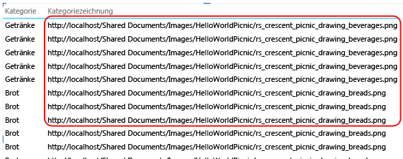
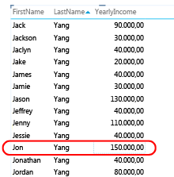
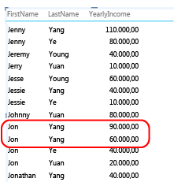
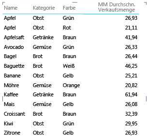
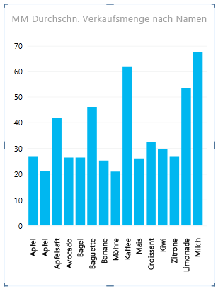

# Power View: Konfigurieren von Tabellenverhalten-Eigenschaften für Berichte
  Wenn Sie ein tabellarisches Modell als Datenmodell für [!INCLUDE[ssCrescent](../../includes/sscrescent-md.md)]verwenden, können Sie die Tabellenverhaltenseigenschaften festlegen, die Detailzeilen auf einer präziseren Ebene verfügbar machen. Das Festlegen von Tabellenverhaltenseigenschaften ändert das Gruppierungsverhalten von Detailzeilen und erzeugt eine bessere Standardplatzierung bei der Feststellung von Informationen (z. B. Namen, Foto-IDs oder Logobilder) in Kachel-, Karten- oder Diagrammlayouts.  
  
 [!INCLUDE[ssCrescent](../../includes/sscrescent-md.md)] unterscheidet sich von anderen Berichtsanwendungen darin, dass es Gruppenelemente automatisch während des Berichtsentwurfs gruppiert, indem die von Ihnen in der Berichtsfeldliste positionierten Spalten gegenüber dem von Ihnen verwendeten Präsentationsformat ausgewertet werden. In den meisten Fällen führt die Standardgruppierung zu einem optimalen Ergebnis. Für einige Tabellen, hauptsächlich solche, die Detaildaten enthalten, führt das Standardgruppierungsverhalten jedoch manchmal zur Gruppierung von Zeilen, bei denen dies nicht erwünscht ist. Für solche Tabellen können Sie Eigenschaften festlegen, die ändern, wie Gruppen ausgewertet werden.  
  
 Die Festlegung von Tabellenverhaltenseigenschaften wird für Tabellen empfohlen, in denen die einzelnen Zeilen von primärem Interesse sind, z. B. Mitarbeiter- oder Kundendatensätze. Im Gegensatz dazu gehören zu den Tabellen, für die sich diese Eigenschaften nicht eignen, solche, die als Nachschlagetabellen fungieren (z. B., eine Datumstabelle, eine Produktkategorietabelle oder eine Abteilungstabelle, bei denen die Tabelle aus einer relativ kleinen Anzahl von Zeilen und Spalten besteht), oder Zusammenfassungstabellen, die Zeilen enthalten, die nur zusammengefasst interessant sind (z. B., Volkszählungsdaten, für die ein Rollup nach Geschlecht, Alter oder Geografie ausgeführt wird). Für Nachschlage- und Zusammenfassungstabellen führt das Standardgruppierungsverhalten zum besten Ergebnis.  
  
> [!NOTE]  
>  Tabellenverhaltenseigenschaften wirken sich nur auf in [!INCLUDE[ssCrescent](../../includes/sscrescent-md.md)]als Datenmodelle verwendete tabellarische Modelle aus. Tabellenverhaltenseigenschaften werden in Excel-Pivotberichten nicht unterstützt.  
  
 Tabellenverhaltenseigenschaften schließen Folgendes ein:  
  
-   **Zeilen-ID** – gibt eine Spalte an, die nur eindeutige Werte enthält. Dadurch kann diese Spalte als interner Gruppierungsschlüssel verwendet werden.  
  
-   **Eindeutige Zeilen beibehalten** – gibt an, welche Spalten Werte enthalten, die als eindeutig behandelt werden sollen, auch wenn sie Duplikate sind (z.B. Mitarbeitervorname und Nachname betreffend; in jenen Fällen, bei denen zwei oder mehr Mitarbeiter den gleichen Namen haben).  
  
-   **Standardbeschriftung** – legt fest, welche Spalte einen Anzeigenamen angibt, um Zeilendaten (z.B. Mitarbeitername in einem Mitarbeiterdatensatz) darzustellen.  
  
-   **Standardbild** – gibt an, welche Spalte ein Bild bereitstellt, das die Zeilendaten (z.B. eine Foto-ID in einem Mitarbeiterdatensatz) darstellt.  
  
> [!NOTE]  
>  Im folgenden Abschnitt finden Sie weitere Informationen, um Layoutoptimierungen vom Standpunkt eines bestimmten Präsentationsformats aus anzugehen:  [Optimieren für bestimmte Layouts](#bkmk_optimizeforlayout).  
  
## Öffnen des Dialogfelds 'Tabellenverhalten'  
  
1.  Klicken Sie in [!INCLUDE[ssBIDevStudioFull](../../includes/ssbidevstudiofull-md.md)]auf die Tabelle (Registerkarte), für die Sie eine Standardfeldliste konfigurieren.  
  
2.  Klicken Sie im Fenster **Eigenschaften** bei der Eigenschaft **Tabellenverhalten** auf die Option **Zum Bearbeiten klicken**.  
  
3.  Legen Sie im Dialogfeld **Tabellenverhalten** den **Zeilenbezeichner**fest, und geben Sie dann weitere Eigenschaften in diesem Dialogfeld an.  
  
## Festlegen der Eigenschaft des Zeilenbezeichners  
 Innerhalb der Tabelle gibt der Zeilenbezeichner eine einzelne Spalte an, die nur eindeutige Werte und keine Leerzeichenwerte enthält. Die Eigenschaft "Row Identifier" wird verwendet, um die Gruppierung zu ändern, damit eine Gruppe nicht auf der Feldkomposition einer Zeile basiert, sondern auf einer festen Spalte, die verwendet wird, um eine Zeile eindeutig zu identifizieren, unabhängig von Feldern, die in einem bestimmten Berichtslayout verwendet werden.  
  
 Wenn Sie diese Eigenschaft festlegen, ändert sich das Standardgruppierungsverhalten von dynamischer Gruppierung (basierend auf den Spalten im Arbeitsbereich) zu einem festen Gruppierungsverhalten, bei dem anhand der Zeilen-ID zusammengefasst wird. Die Änderung des Standardgruppierungsverhaltens ist relevant für Berichtslayouts, z. B. eine Matrix, die andernfalls für jede Spalte in der Zeile eine Gruppierung durchführt (oder Teilergebnisse anzeigt).  
  
 In [!INCLUDE[ssCrescent](../../includes/sscrescent-md.md)]werden durch die Festlegung eines Zeilenbezeichners die folgenden zusätzlichen Eigenschaften aktiviert: die Eigenschaft zu **Eindeutige Zeilen beibehalten** , die Eigenschaft zur **Standardbeschriftung** und die Eigenschaft zum **Standardbild** .  
  
 Sie können auch **Zeilenbezeichner** für sich als eigenständige Eigenschaft verwenden, um Folgendes zu aktivieren:  
  
-   Verwendung von binären Bildern in einem Bericht. Indem die Mehrdeutigkeit von Zeilen entfernt wird, kann [!INCLUDE[ssCrescent](../../includes/sscrescent-md.md)] bestimmen, wie Standardbilder und Standardbezeichnungen für eine bestimmte Zeile zugewiesen werden.  
  
-   Entfernen unerwünschter Teilergebnisse aus einem Matrixbericht. Die Standardgruppierung auf Feldebene erstellt ein Teilergebnis für jedes Feld. Wenn Sie nur ein einzelnes Teilergebnis möchten, das auf Zeilenebene berechnet wird, führt die Festlegung der Zeilen-ID zu diesem Ergebnis.  
  
 Für Tabellen, die als Datumstabellen markiert sind, kann keine Zeilen-ID festgelegt werden. Für Datumstabellen wird die Zeilen-ID angegeben, wann Sie die Tabelle markieren. Weitere Informationen finden Sie unter [Dialogfeld "Als Datumstabelle markieren" &#40;SSAS&#41;](http://msdn.microsoft.com/library/698b5ef1-b79b-4d76-9847-39669b4f5bb9).  
  
## Festlegen der Eigenschaft Eindeutige Zeilen beibehalten  
 Mit dieser Eigenschaft können Sie angeben, welche Spalten Identitätsinformationen (z. B. ein Mitarbeitername oder ein Produktcode) auf eine Weise vermitteln, die eine Zeile von einer anderen unterscheidet. In Fällen, in denen Zeilen identisch zu sein scheinen (z. B. zwei Kunden mit dem gleichen Namen), wiederholen sich die Spalten, die Sie für diese Eigenschaft angeben, in der Berichtstabelle.  
  
 Abhängig davon, welche Spalten Sie einem Bericht hinzufügen, können Sie auf Zeilen stoßen, die als identische Zeilen behandelt werden, da die Werte in jeder Zeile gleich zu sein scheinen (z. B. zwei Kunden mit dem Namen Jon Yang). Dies könnte auftreten, weil andere Spalten, die die Daten differenzieren (z. B. ein zweiter Vorname, Adresse oder Geburtsdatum), nicht im Berichtszeichenbereich enthalten sind. In einem derartigen Szenario besteht das Standardverhalten darin, die offensichtlich identischen Zeilen in eine einzelne Zeile zu gruppieren und so alle berechneten Werte in einem einzelnen größeren Ergebnis aus den kombinierten Zeilen zusammenzufassen.  
  
 Durch die Einstellung der Eigenschaft **Eindeutige Zeilen beibehalten** können Sie eine oder mehrere Spalten festlegen, die immer wiederholt werden sollen, auch wenn doppelte Instanzen vorliegen. Dies soll jedes Mal der Fall sein, wenn Sie die entsprechende Spalte zu dem Berichtszeichenbereich hinzufügen. Berechnete und der Zeile zugeordnete Werte werden nun auf Grundlage jeder einzelnen Zeile zugeordnet, anstatt per Rollup in einer einzelnen Zeile gesammelt zu werden. Bei der Auswahl der Spalten für die Eigenschaft  **Eindeutige Zeilen beibehalten** müssen Sie diejenigen Spalten auswählen, die eindeutige oder beinahe eindeutige Werte enthalten.  
  
> [!NOTE]  
>  Da sich die Spalten, die der Endbenutzer auswählt, auf die Gruppierung auswirken und somit den Filterkontext für Ausdrucksberechnungen ändern können, müssen Modell-Designer darauf achten, dass Measures erstellt werden, die die richtigen Ergebnisse zurückgeben. Weitere Informationen finden Sie unter [Häufig gestellte Fragen](http://go.microsoft.com/fwlink/?LinkId=220674).  
  
## Festlegen einer Standardbezeichnung  
 Diese Eigenschaft gibt eine Bezeichnung an, die in der Navigationsleiste eines Kachelberichts angezeigt wird. Sollte sie mit einem Standardbild verwendet werden, wird die Standardbezeichnung unter dem Bild angezeigt. Ohne Bild wird die Standardbezeichnung allein angezeigt. Bei der Auswahl einer Standardbezeichnung wählen Sie die Spalte aus, die die umfangreichsten Informationen zur Zeile (z. B. Name) vermittelt.  
  
 In einem Kachellayout wird die Standardbezeichnung im Titelbereich unter einem Bild angezeigt, wie von der Eigenschaft zum Standardbild festgelegt. Wenn Sie z. B. eine Liste von Mitarbeitern haben, können Sie Mitarbeiterinformationen nebeneinander anordnen und die jeweilige Foto-ID als Standardbild und den Mitarbeiternamen als Standardbezeichnung verwenden. In einer Kachel wird die Standardbezeichnung unter dem Standardbild angezeigt. Diese Spalten werden immer in der Kachel angezeigt, auch wenn Sie sie nicht explizit in der Berichtsfeldliste auswählen.  
  
## Festlegen eines Standardbilds  
 Diese Eigenschaft gibt ein Bild an, das in der Navigationsleiste eines Kachelberichts oder im vorderen Bereich einer Karte angezeigt wird. Wenn Sie im Bericht die Spalte auswählen, die das Standardbild enthält, wird das Standardbild in der Navigationsleiste eines Kachelberichtslayouts oder im vorderen Bereich einer Karte angezeigt. Ein Standardbild soll visuellen Inhalt darstellen. Beispiele hierfür sind eine Foto-ID in der Mitarbeiter-Tabelle, ein Kundenlogo in einer Kundentabelle oder die Form eines Landes in einer geografischen Tabelle.  
  
> [!NOTE]  
>  Bilder können aus URL-Adressen in eine Bilddatei auf einem Webserver oder als in der Arbeitsmappe eingebettete Binärdaten übertragen werden. Wenn das Bild auf einer URL basiert, stellen Sie sicher, dass die Spalte auch als Bildtyp festgelegt wird, damit [!INCLUDE[ssCrescent](../../includes/sscrescent-md.md)] das Bild abruft, anstatt die URL als Textdaten im Bericht anzuzeigen.  
  
##   Optimieren für bestimmte Layouts  
 In diesem Abschnitt werden die Auswirkungen beschrieben, wenn Tabellenverhaltenseigenschaften vom Standpunkt eines bestimmten Präsentationsformats aus und anhand der Merkmale der Daten festgelegt werden. Wenn Sie für das Layout eines Matrixberichts eine Feinabstimmung durchzuführen versuchen, können Sie z. B. diese Informationen verwenden, um verstehen zu können, wie eine Matrixpräsentation mit Tabellenverhaltenseigenschaften im Modell verbessert werden kann.  
  
### Bilder fehlen  
 Die von Ihnen im Modell festgelegten Eigenschaften bestimmen, ob Bilder in einem Bericht visuell dargestellt oder als Textwerte im Bericht dargestellt werden.  
  
   
  
 Standardmäßig wird Text im Modell als Text im Bericht interpretiert. Wenn eine Textspalte eine URL-Adresse zu einem Berichtsbild darstellt, müssen Sie beachten, dass Sie die Eigenschaft **Bild-URL** festlegen, damit [!INCLUDE[ssCrescent](../../includes/sscrescent-md.md)] die Bilddatei abrufen kann. Bei binären Bildern müssen Sie die Eigenschaft **Zeilenbezeichner** festlegen.  
  
### In Tabellen fehlen eine oder mehrere Zeilen  
 Gelegentlich führt das Standardgruppierungsverhalten zu einem Ergebnis, welches das genaue Gegenteil davon ist, was Sie beabsichtigt haben. So werden etwa Detailzeilen, die im Modell vorhanden sind, nicht im Bericht angezeigt. Standardmäßig gruppiert [!INCLUDE[ssCrescent](../../includes/sscrescent-md.md)] die Spalten, die Sie dem Zeichenbereich hinzufügen. Wenn Sie einen **Ländernamen** zum Bericht hinzufügen, wird jedes Land einmal im Zeichenbereich angezeigt, obwohl die zugrunde liegende Tabelle Tausende von Zeilen enthalten kann, die mehrere Instanzen eines jeden Ländernamens umfassen. In diesem Fall führt das Standardgruppierungsverhalten zum richtigen Ergebnis.  
  
 Beachten Sie jedoch ein anderes Beispiel, bei dem Sie mehrere Instanzen einer Zeile anzeigen möchten, da die zugrunde liegenden Zeilen Daten zu anderen Entitäten enthalten. Gehen Sie in diesem Beispiel davon aus, dass Sie zwei Kunden namens **Jon Yang**haben. Mit dem Standardgruppierungsverhalten wird nur eine Instanz von **Jon Yang** im Bericht angezeigt. Da darüber hinaus nur eine Instanz in der Liste angezeigt wird, ist das Measure **Jährliches Einkommen** die Summe des entsprechenden Wertes für beide Kunden.  
  
   
  
 Um das Standardgruppierungsverhalten zu ändern, müssen Sie die Eigenschaften zum **Zeilenbezeichner** und zu **Eindeutige Zeilen beibehalten** festlegen. Wählen Sie bei **Eindeutige Zeilen beibehalten**die Spalte "Nachname" aus, damit dieser Wert für eine Zeile wiederholt wird, auch wenn er bereits in einer anderen Zeile angezeigt wird. Nachdem Sie die Eigenschaften geändert haben und die Arbeitsmappe erneut veröffentlichen, können Sie den gleichen Bericht erstellen. Allerdings können Sie nun beide Kunden namens **Jon Yang**zusammen mit dem jeweils ordnungsgemäß zugeordneten **jährlichen Einkommen** ansehen.  
  
   
  
### Matrixlayout ist überfüllt  
 Wenn Sie in einer Matrix eine Detailtabelle präsentieren, stellt die Standardgruppierung einen zusammengefassten Wert für jede Spalte bereit. Je nach Zielsetzungen können dies mehr Zusammenfassungen sein als Sie nutzen möchten. Um dieses Verhalten zu ändern, können Sie den **Zeilenbezeichner**festlegen. Sie müssen keine zusätzlichen Eigenschaften festlegen. Die Festlegung des Zeilenbezeichners ist ausreichend, um die Gruppierung zu ändern, damit Zusammenfassungen auf der Grundlage eines eindeutigen Zeilenbezeichners für jede Zeile berechnet werden können.  
  
 Vergleichen Sie die folgenden Abbildungen vorher und nachher, in denen die Auswirkung der Einstellung dieser Eigenschaft für ein Matrixlayout angezeigt wird.  
  
 **Vorher: Die Standardgruppierung auf der Grundlage von Feldern in der Matrix**  
  
   
  
 **Nachher: Gruppierung zum Zeilenbezeichner**  
  
   
  
### Das Diagramm zeigt zu viele Elemente und Ebenen auf der Achse an.  
 Die Diagrammberichte, die Detaildaten anzeigen, sollen den Zeilenbezeichner als Achse verwenden. Ohne Zeilenbezeichner ist die Achse unbestimmt, was zu einem Layout führt, das unter Umständen nicht sinnvoll ist. Um dieses Verhalten zu ändern, können Sie den **Zeilenbezeichner**festlegen. Sie müssen keine zusätzlichen Eigenschaften festlegen. Die Festlegung des Zeilenbezeichners ist ausreichend, um die Gruppierung zu ändern, damit Zusammenfassungen auf der Grundlage eines eindeutigen Zeilenbezeichners für jede Zeile berechnet werden können.  
  
 Vergleichen Sie die folgenden Abbildungen vorher und nachher, in denen die Auswirkung der Einstellung dieser Eigenschaft für ein Diagrammlayout angezeigt wird. Hierbei handelt es sich um den gleichen Bericht mit identischen Feldern und identischer Präsentation. Der einzige Unterschied besteht darin, dass in der untersten Abbildung ein Bericht angezeigt wird, nachdem der **Zeilenbezeichner** in der Elemententabelle festgelegt wurde.  
  
 **Vorher: Die Standardgruppierung auf der Grundlage von Feldern in einem Diagramm**  
  
   
  
 **Nachher: Gruppierung zu Zeilenbezeichner (Zeilenbezeichner wird zur Achse)**  
  
   
  
## Nächste Schritte  
 Nachdem Sie die Tabellen im Modell ausgewertet und die Tabellenverhaltenseigenschaften zu jenen Tabellen festgelegt haben, die Detailzeilen enthalten, welche stets als einzelne Elemente angezeigt werden sollen, können Sie das Modell durch zusätzliche Eigenschaften oder Einstellungen weiter optimieren.  
  
  

