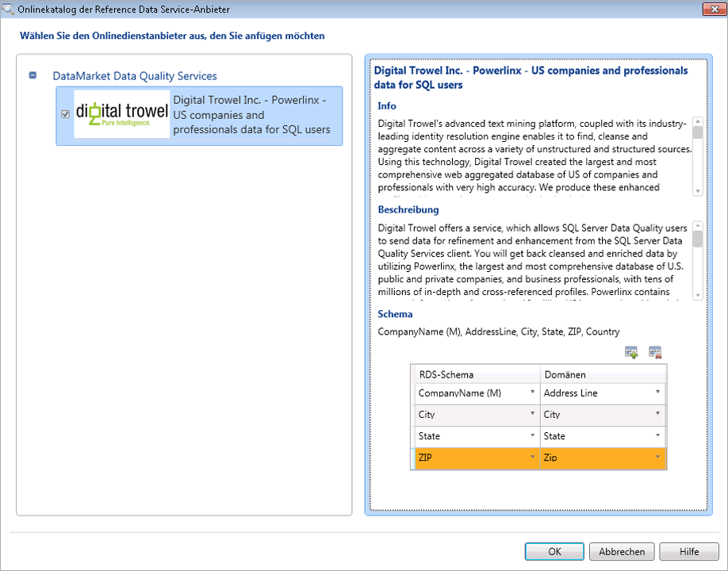

# Anfügen einer Domäne oder Verbunddomäne an Verweisdaten
  In diesem Thema wird beschrieben, wie Domänen/Verbunddomänen in einer Data Quality-Wissensdatenbank an einen Verweisdatendienst im Windows Azure Marketplace angefügt werden, um Wissen mithilfe der hochwertigen Verweisdaten zu generieren. Jeder Verweisdatendienst enthält ein Schema (Datenspalten). Nachdem eine Domäne oder eine Verbunddomäne an einen Verweisdatendienst angefügt wurde, müssen Sie die angefügte Domäne bzw. die einzelnen Domänen innerhalb der Verbunddomäne den entsprechenden Spalten im Schema des Verweisdatendiensts zuordnen. Indem eine Verbunddomäne an einen Verweisdatendienst angefügt wird, haben Sie die Möglichkeit, nur eine Domäne an einen Verweisdatendienst anzufügen. Daraufhin können Sie den entsprechenden Spalten im Schema des Verweisdatendiensts die einzelnen Domänen innerhalb der Verbunddomäne zuordnen.  
  
> [!WARNING]  
>  Die an einen Verweisdatendienst angefügte Verbunddomäne ist in der Domänen-Dropdownliste verfügbar, während Domänen den Spalten in Schema des Verweisdatendiensts zugeordnet werden. Ordnen Sie die Verbunddomäne keiner Spalte im Schema des Verweisdatendiensts zu; Sie dürfen den entsprechenden Spalten im Schema des Verweisdatendiensts nur einzelne Domänen innerhalb einer Verbunddomäne zuordnen. Andernfalls tritt ein Fehler auf.  
  
 Das Schema eines Verweisdatendiensts kann über eine erforderliche Spalte verfügen, die mit der entsprechenden Domäne zugeordnet werden muss, wenn Sie einen Verweisdatendienst verwenden möchten. Die erforderliche Spalte in einem Verweisdatenschema wird mit einem "(M)" im Spaltennamen gekennzeichnet. Beispielsweise ist **AddressLine** die erforderliche Schemaspalte in **Melissa Data (Adressdaten)** , und **CompanyName** ist die erforderliche Schemaspalte in **Digital Trowel Inc. (US-Unternehmen und professionelle Daten für SQL-Benutzer)**.  
  
 In diesem Thema erstellen wir vier Domänen: **Adresszeile**, **Ort**, **Bundesland**und **PLZ**unter der Verbunddomäne **Adressüberprüfung**, fügen die Verbunddomäne an den Verweisdatendienst **Melissa Data (Adresse)** an und ordnen die einzelnen Domänen innerhalb der Verbunddomäne dann den entsprechenden Spalten im Schema des Verweisdatendiensts zu.  
  
## Vorbereitungen  
  
###   Erforderliche Komponenten  
 Sie müssen [!INCLUDE[ssDQSnoversion](../includes/ssdqsnoversion-md.md)] (DQS) konfiguriert haben, um Verweisdatendienste zu verwenden. Siehe [Konfigurieren von DQS zum Verwenden von Verweisdaten](../data-quality-services/configure-dqs-to-use-reference-data.md).  
  
###   Sicherheit  
  
#### Berechtigungen  
 Sie müssen über die dqs_kb_editor-Rolle in der DQS_MAIN-Datenbank verfügen, um Domänen Verweisdaten zuzuordnen.  
  
##   Zuordnen von Domänen zu Verweisdaten aus Melissa Data  
  
1.  [!INCLUDE[ssDQSInitialStep](../includes/ssdqsinitialstep-md.md)] [Ausführen der Data Quality-Clientanwendung](../data-quality-services/run-the-data-quality-client-application.md).  
  
2.  Klicken Sie im [!INCLUDE[ssDQSClient](../includes/ssdqsclient-md.md)] -Startbildschirm unter **Wissensdatenbank-Verwaltung**auf **Neue Wissensdatenbank**.  
  
3.  Geben Sie im Bildschirm **Neue Wissensdatenbank** einen Namen für die neue Wissensdatenbank ein, klicken Sie auf die Aktivität **Domänenverwaltung** , und klicken Sie auf **Erstellen**.  
  
4.  Klicken Sie im Bildschirm **Domänenverwaltung** auf das Symbol **Domäne erstellen** , um eine Domäne zu erstellen. Erstellen Sie die folgenden vier Domänen: **Adresszeile**, **Ort**, **Bundesland**und **PLZ**.  
  
5.  Klicken Sie auf das Symbol **Verbunddomäne erstellen** , um eine Verbunddomäne zu erstellen. Geben Sie im Dialogfeld **Verbunddomäne erstellen** im Feld **Name der Verbunddomäne** den Text **Adressenüberprüfung** ein, und schließen Sie alle Domänen ein, die unter Schritt 3 in der Verbunddomäne erstellt wurden. Klicken Sie auf **OK**.  
  
6.  Wählen Sie im Bereich **Domäne** auf der linken Seite die Verbunddomäne aus, indem Sie auf **Adressenüberprüfung**klicken, und klicken Sie dann auf der rechten Seite auf die Registerkarte **Verweisdaten** .  
  
7.  Klicken Sie auf das Symbol **Durchsuchen** .  
  
8.  Im Dialogfeld **Onlinekatalog der Reference Data Service-Anbieter** :  
  
    1.  Aktivieren Sie unter **DataMarket Data Quality Services**das Kontrollkästchen **Melissa Data – Adresse** .  
  
    2.  Ordnen Sie die Spalten des Verweisdatendiensts Melissa Data (Adresse) den entsprechenden Domänen (Adresszeile, Ort, Bundesland und PLZ) zu. Sie ordnen die Spalten zu, indem Sie in der Spalte **RDS-Schema** eine Verweisdatendienst-Spalte auswählen und dann die entsprechende Domäne in der Spalte **Domäne** auswählen. Um mehr Zeilen in der Tabelle hinzuzufügen, klicken Sie auf das Symbol **Schemaeintrag hinzufügen** .  
  
    3.  Klicken Sie auf **OK** , um die Änderungen zu speichern, und schließen Sie das Dialogfeld **Onlinekatalog der Reference Data Service-Anbieter** .  
  
           
  
        > [!NOTE]  
        >  -   Im Dialogfeld **Onlinekatalog der Reference Data Service-Anbieter** werden unter dem Knoten **DataMarket Data Quality Services** alle Verweisdaten-Dienstanbieter angezeigt, die Sie in Windows Azure Marketplace abonniert haben. Wenn Sie in DQS direkte Drittanbieter von Online-Verweisdatendiensten konfiguriert haben, werden diese unter einem anderen Knoten mit der Bezeichnung **Direkte Drittanbieter-Onlineanbieter** angezeigt (zu diesem Zeitpunkt nicht verfügbar, da keine direkten Drittanbieter von Online-Verweisdatendiensten in DQS konfiguriert sind).  
  
9. Sie kehren zur Registerkarte **Verweisdaten** zurück. Ändern Sie im Bereich **Anbietereinstellungen** ggf. die Werte in den folgenden Feldern:  
  
    -   **Schwellenwert für Autokorrektur**: Korrekturen aus dem Verweisdatendienst mit einem Vertrauensgrad über den Schwellenwerten werden automatisch vorgenommen. Geben Sie einen Wert in der Dezimalnotation des entsprechenden Prozentwerts ein. Geben Sie beispielsweise 0,9 für 90 % ein.  
  
    -   **Vorgeschlagene Kandidaten**: Anzahl der vorgeschlagenen Kandidaten aus dem Verweisdatendienst, die angezeigt werden sollen.  
  
    -   **Minimaler Vertrauensgrad**: Vorschläge aus dem Verweisdatendienst mit einem Vertrauensgrad, der niedriger als dieser Wert ist, werden ignoriert. Geben Sie einen Wert in der Dezimalnotation des entsprechenden Prozentwerts ein. Geben Sie beispielsweise 0,6 für 60 % an.  
  
10. Klicken Sie auf **Fertig stellen** , um die Wissensdatenbank zu veröffentlichen. Eine Bestätigungsmeldung wird angezeigt, nachdem die Wissensdatenbank erfolgreich veröffentlicht wurde.  
  
 Sie können diese Wissensdatenbank jetzt für Bereinigungsaktivitäten in einem Data Quality-Projekt verwenden, um US-Adressen in den Quelldaten basierend auf dem Wissen zu standardisieren und zu bereinigen, das von Melissa Data über den Windows Azure Marketplace bereitgestellt wird.  
  
##   Nachverfolgung: Nach dem Zuordnen einer Domäne zu Verweisdaten  
 Erstellen Sie ein Data Quality-Projekt, und führen Sie die Bereinigungsaktivität für die Quelldaten aus, die US-Adressen enthalten, indem Sie diese mit der in diesem Thema erstellten Wissensdatenbank vergleichen. Siehe [Bereinigen von Daten mit Wissen über &#40;externe&#41; Verweisdaten](../data-quality-services/cleanse-data-using-reference-data-external-knowledge.md).  
  
## Siehe auch  
 [Reference Data Services in DQS](../data-quality-services/reference-data-services-in-dqs.md)   
 [Datenbereinigung](../data-quality-services/data-cleansing.md)  
  
  
