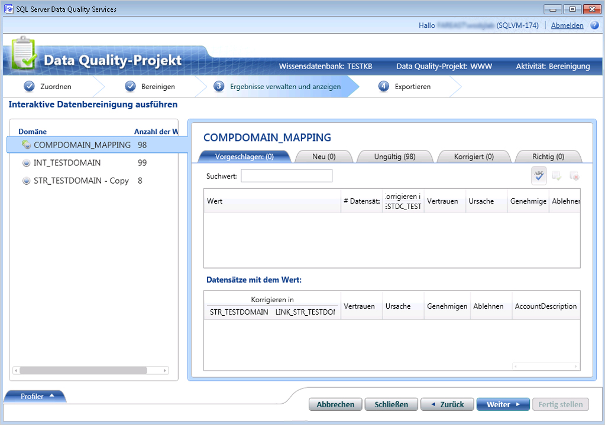

# Bereinigen von Daten mit (externem) Verweisdaten-Wissen
  In diesem Thema wird beschrieben, wie Daten mithilfe des Wissens von Verweisdatenanbietern bereinigt werden. Während alle Schritte zum Ausführen einer Bereinigungsaktivität dieselben für die Bereinigung Ihrer Daten mithilfe des Wissens der Anbieter von Verweisdaten bleiben, wie unter [Bereinigen von Daten mit &#40;internem&#41; DQS-Wissen](../data-quality-services/cleanse-data-using-dqs-internal-knowledge.md) erläutert, bietet dieses Thema Informationen, die für die Datenbereinigung mithilfe von Reference Data Service in [!INCLUDE[ssDQSnoversion](../includes/ssdqsnoversion-md.md)] (DQS) spezifisch sind.  
  
 Wenn Sie die Verweisdatendienstfunktion in DQS verwenden, um die Daten zu bereinigen, sendet der DQS-Bereinigungsprozess die zugeordneten Domänenwerte an den Verweisdaten-Dienstanbieter als Batchanforderung. Der Verweisdatendienst antwortet mit den folgenden Informationen:  
  
-   Vorgeschlagene Korrektur  
  
-   Vertrauen  
  
-   Zusätzliche Informationen über die zugeordnete Domäne. Verweisdaten können auch standardisieren, analysieren oder die Quelle mit weiteren Daten bereichern. Diese Informationen werden in weiteren Feldern in der Antwort bereitgestellt.  
  
 Folgendes geschieht in DQS nach Eingang der Antwort vom Verweisdatendienst während der Bereinigungsaktivität:  
  
-   Auf Grundlage der Werte **Schwellenwert für Autokorrektur** und **Minimaler Vertrauensgrad** , die während der Zuordnung der Domänen zur Verweisdaten-Dienstdomäne angegeben wurden, werden die Domänenwerte automatisch korrigiert oder auf Grundlage des Vertrauensgrads vorgeschlagen.  
  
    > [!NOTE]  
    >  Die Schwellenwerte, die Sie während der Zuordnung einer Domäne zu einem Verweisdatendienst festlegen, werden während des Bereinigens von Daten mithilfe des Wissens im Verweisdatendienst und nicht mithilfe der Werte, die auf der Registerkarte **Allgemeine Einstellungen** im Abschnitt **Konfiguration** festgelegt wurden, angewendet. Informationen zum Angeben von Schwellenwerten für die Verweisdatenbereinigung finden Sie in Schritt 9 in [Anfügen einer Domäne oder Verbunddomäne an Verweisdaten](../data-quality-services/attach-domain-or-composite-domain-to-reference-data.md).  
  
-   Domänenwerte werden folgendermaßen kategorisiert: **Vorgeschlagen**, **Neu**, **Ungültig**, **Korrigiert** und **Richtig**.  
  
-   Weitere Daten werden an die Quelle angefügt, und die Informationen stehen zusammen mit den bereinigten Daten zum Exportieren zur Verfügung.  
  
## Vorbereitungen  
  
###   Erforderliche Komponenten  
 Sie müssen dem entsprechenden Verweisdatendienst erforderliche Domänen in einer DQS-Wissensdatenbank zugeordnet haben. Darüber hinaus muss die Wissensdatenbank Wissen zum Typ von Daten enthalten, die Sie bereinigen möchten. Wenn Sie z. B. die Quelldaten bereinigen, die US-Adressen enthalten, müssen Sie die Domänen einem Verweisdaten-Dienstanbieter zuordnen, der hochwertige Daten für US-Adressen bereitstellt. Weitere Informationen finden Sie unter [Anfügen einer Domäne oder Verbunddomäne an Verweisdaten](../data-quality-services/attach-domain-or-composite-domain-to-reference-data.md).  
  
###   Sicherheit  
  
####   Berechtigungen  
 Sie müssen über die Rolle "dqs_kb_editor" oder "dqs_kb_operator" für die Datenbank DQS_MAIN verfügen, um eine Datenbereinigung auszuführen.  
  
##   Bereinigen der Daten mit Verweisdaten-Wissen  
 Wir fahren mit demselben Beispiel zur Verwendung der Domänen fort, die wir im vorherigen Thema, [Anfügen einer Domäne oder Verbunddomäne an Verweisdaten](../data-quality-services/attach-domain-or-composite-domain-to-reference-data.md), mit dem Melissa-Datendienst im Azure Marketplace zugeordnet haben. Jetzt verwenden wir die gleichen Domänen, um einige Beispiel-US-Adressen zu bereinigen. Die Schritte zum Bereinigen von Daten sind dieselben wie in [Bereinigen von Daten mit &#40;internem&#41; DQS-Wissen](../data-quality-services/cleanse-data-using-dqs-internal-knowledge.md) beschrieben. Wir lenken Ihre Aufmerksamkeit jedoch während des Prozesses an die nötigen Stellen.  
  
1.  Erstellen Sie ein Datenqualitätsprojekt, und wählen Sie die Aktivität **Bereinigung** aus. Siehe [Create a Data Quality Project](../data-quality-services/create-a-data-quality-project.md).  
  
2.  Ordnen Sie die folgenden 4 Domänen mit entsprechenden Spalten auf der Seite **Karte** in den Quelldaten zu: **Adresszeile**, **Ort**, **Bundesland**und **PLZ**. Klicken Sie auf **Weiter**.  
  
    > [!NOTE]  
    >  Nachdem Sie alle 4 Domänen innerhalb der Verbunddomäne **Adressüberprüfung** zugeordnet haben, wird die Datenbereinigung jetzt auf Verbunddomänenebene ausgeführt, und nicht auf einzelner Domänenebene.  
  
3.  Führen Sie auf der Seite **Bereinigen** den computer-gestützten Prozess durch Klicken auf **Start**aus. Nachdem der Bereinigungsprozess vorbei ist, klicken Sie auf **Weiter**.  
  
    > [!NOTE]  
    >  DQS zeigt auf der Seite **Bereinigen** die Informationen zu den Domänen an, die auf die folgenden zwei Weisen mit dem Verweisdatendienst verbunden sind:  
    >   
    >  -   Eine Meldung wird unter der Schaltfläche **Starten** angezeigt: „Domänen \<Domäne1>, \<Domäne2>,... \<Domänen> werden mithilfe von Reference Data Service-Anbietern bereinigt.“ In diesem Beispiel wird die folgende Meldung angezeigt: „Domänen-Adressüberprüfung wird mithilfe von Verweisdaten-Dienstanbietern gereinigt.“  
    > -   Ein Symbol, , wird im Bereich **Profiler** für die Domänen angezeigt, die mit dem Reference Data Service-Dienstanbieter verbunden sind. In diesem Beispiel wird das Symbol für die Verbunddomäne **Adressüberprüfung** angezeigt.  
  
4.  Prüfen Sie auf der Seite **Ergebnisse verwalten und anzeigen** Ihre Domänenwerte. Der Verweisdatendienst kann ggf. mehr als einen Vorschlag für einen Wert anzeigen, je nach der maximalen Anzahl von Vorschlägen, die im Feld **Vorgeschlagene Kandidaten** während der Zuordnung der Domäne zum Verweisdatendienst angegeben sind. Zwei Vorschläge werden z. B. für die folgende US-Adresse angezeigt:  
  
     **Ursprünglicher Wert:**  
  
    |Adresszeile|Ort|Bundesland|PLZ|  
    |------------------|----------|-----------|---------|  
    |1 msft way|Redmond||98052|  
  
     **Vorgeschlagene Werte:**  
  
    |Adresszeile|Ort|Bundesland|PLZ|  
    |------------------|----------|-----------|---------|  
    |1 Microsoft Way|Redmond|WA|98052|  
    |Postfach 1|Redmond|WA|98073|  
  
       
  
    > [!NOTE]  
    >  Für Verbunddomänen hebt DQS auch die einzelnen Domänen in einer anderen Farbe hervor, die während des computergestützten Bereinigungsprozesses korrigiert wurden. In diesem Fall wurden die Domänen **Adresszeile** und **Status** z. B. korrigiert und deshalb in Cyanblau hervorgehoben.  
  
5.  Nachdem Sie mit dem Überprüfen aller Domänenwerte fertig sind, klicken Sie auf **Weiter** , um die Daten zu exportieren.  
  
6.  Auf der Seite **Export** sehen Sie, dass abgesehen von den regulären Informationen über die Bereinigungsaktivität für jede Domäne (Quelle, Grund, Vertrauen und Status) weitere Informationen vom Melissa-Verweisdatendienst über Ihre Adressdaten bereitgestellt werden, z. B. Breite und Länge der Adresse, Landkreisname, Adresstyp (Hochhaus, Straße usw.).  
  
7.  Exportieren Sie die Daten in das erforderliche Ziel (SQL Server, CSV oder Excel), und klicken Sie auf **Fertig stellen** , um das Projekt zu schließen.  
  
    > [!IMPORTANT]  
    >  Wenn Sie die 64-Bit-Version von Excel verwenden, können Sie die bereinigten Daten nicht in eine Excel-Datei exportieren; Sie können sie nur in eine SQL Server-Datenbank oder eine CSV-Datei exportieren.  
  
  

