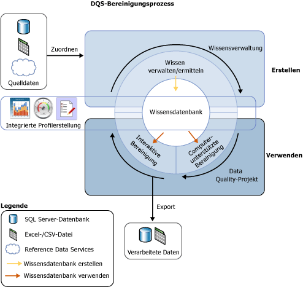
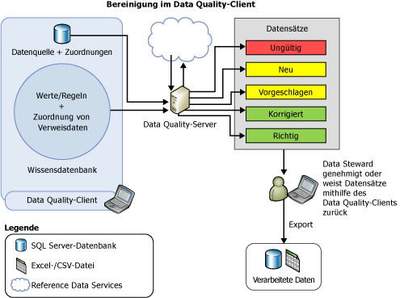

# Data Cleansing

[!INCLUDE[appliesto-ss-xxxx-xxxx-xxx-md-winonly](../includes/appliesto-ss-xxxx-xxxx-xxx-md-winonly.md)]

  Die Datenbereinigung ist der Prozess der Datenqualitätsanalyse in einer Datenquelle, wobei die Empfehlungen vom System manuell genehmigt/zurückgewiesen werden und dadurch Änderungen an den Daten vorgenommen werden. Datenbereinigung in [!INCLUDE[ssDQSnoversion](../includes/ssdqsnoversion-md.md)] (DQS) schließt einen computerunterstützten Prozess ein, der analysiert, wie Daten mit den Informationen in einer Wissensdatenbank übereinstimmen, sowie einen interaktiven Prozess, mit dem der Data Steward computerunterstützte Prozessergebnisse anzeigen und ändern kann, um sicherzustellen, dass die Datenbereinigung entsprechend ausgeführt wird.  
  
 Der Data Steward kann auch die Datenbereinigung im SQL Server Integration Services-Verpackungsprozess ausführen. In diesem Fall kann der Data Steward die [!INCLUDE[ssDQSCleansingLong](../includes/ssdqscleansinglong-md.md)] verwenden, die die Datenbereinigung mithilfe einer vorhandenen Wissensdatenbank automatisch ausführt. Weitere Informationen finden Sie unter [DQS-Bereinigungstransformation](../integration-services/data-flow/transformations/dqs-cleansing-transformation.md).  
  
 Die Funktion Datenbereinigung in DQS hat die folgenden Vorteile:  
  
-   Identifiziert unvollständige oder falsche Daten in der Datenquelle (Excel-Datei oder SQL Server-Datenbank) und korrigiert dann die ungültigen Daten oder sendet Ihnen eine Warnung darüber.  
  
-   Stellt einen aus zwei Schritten bestehenden Prozess zum Bereinigen der Daten bereit: *computerunterstützt* und *interaktiv*. Vom computergestützten Prozess werden die Informationen in einer DQS-Wissensdatenbank verwendet, um die Daten automatisch zu verarbeiten und um Ersetzungen bzw. Korrekturen vorzuschlagen. Der nächste Schritt ist interaktiv. Der Data Steward kann die vom DQS während des computerunterstützten Datenbereinigungsprozesses vorgeschlagenen Änderungen genehmigen, ablehnen oder ändern.  
  
-   Standardisiert und erweitert Kundendaten mit Domänenwerten, Domänenregeln und Verweisdaten. Beispielsweise können Sie die Ausdrucksverwendung standardisieren, indem Sie "St." in "Straße" ändern oder Daten durch Ausfüllen der fehlenden Elemente anreichern: "1 Microsoft way Redmond 98006" wird in "1 Microsoft Way, Redmond, WA 98006" geändert.  
  
-   Stellt dem Benutzer eine einfache, intuitive, und konsistente assistentenähnliche Oberfläche bereit, um damit in Daten zu navigieren und Fehler unter einem sehr umfangreichen Satz an Daten zu überprüfen.  
  
 Die folgende Abbildung zeigt an, wie die Datenbereinigung in DQS erfolgt:  
  
   
  
##   Computerunterstützte Bereinigung  
 Der DQS-Datenbereinigungsprozess führt die Bereinigung der Daten mithilfe der Wissensdatenbank aus und schlägt Änderungen an den Daten vor. Der Data Steward hat Zugriff auf alle vorgeschlagenen Änderungen, sodass er diese bewerten und korrigieren kann. So führt der Data Steward eine Datenbereinigung aus  
  
1.  Erstellen Sie ein Data Quality-Projekt, wählen Sie eine Wissensdatenbank aus, wofür Sie eine Analyse ausführen und Ihre Daten bereinigen möchten, und wählen Sie die Aktivität **Bereinigung** aus. Mehrere Data Quality-Projekte können die gleiche Wissensdatenbank verwenden.  
  
2.  Geben Sie die Datenbanktabelle/Sicht oder eine Excel-Datei an, die die Quelldaten enthält, die gereinigt werden sollen. Die Datenbank- oder die Excel-Datei kann der Datei entsprechen, die für die Wissensermittlung verwendet wurde, oder es kann sich um eine andere Datenbank- oder die Excel-Datei handeln.  
  
    > [!NOTE]  
    >  Wenn Sie die gleiche Datenquelle für die Wissensermittlung und die Bereinigungsaktivitäten auswählen, gibt es keine Änderung an den Daten. Es wird empfohlen, dass Sie die Wissensermittlung auf Beispieldaten ausführen und Ihre Quelldaten später mit den Informationen bereinigen, die während der Wissensdatenbankaktivität erstellt wurden.  
  
3.  Ordnen Sie die Datenfelder, die bereinigt werden sollen, den entsprechenden Domänen bzw. Verbunddomänen in der Wissensdatenbank zu. Wenn Sie einer Verbunddomäne ein Feld zuordnen, geschieht die Zuordnung zwischen dem Feld und der Verbunddomäne und nicht mit den einzelnen Domänen in der Verbunddomäne. Zudem wird die Datenbereinigung für das zugeordnete Feld auf Grundlage der Regeln für die Verbunddomäne ausgeführt und nicht für die einzelnen Domänen in der Verbunddomäne. Weitere Informationen über Verbunddomänen finden Sie unter [DQS Knowledge Bases and Domains](../data-quality-services/dqs-knowledge-bases-and-domains.md).  
  
4.  Führen Sie auf der Seite **Bereinigen** den computergestützten Prozess durch Klicken auf **Start** aus.  
  
 Der Datenbereinigungsprozess sucht nach der Dateninstanz, die mit bekannten Datendomänenwerten am besten übereinstimmt. Dieser Prozess wendet im Gegensatz zum Wissensermittlungsprozess, der für einen Prozentsatz der Beispieldaten ausgeführt wird, das auf die Datenqualität bezogene Wissen auf alle Quelldaten an.  
  
 Der computergestützte Prozess zeigt die Informationen bezüglich der Datenqualität im [!INCLUDE[ssDQSClient](../includes/ssdqsclient-md.md)] für den interaktiven Bereinigungsprozess an. Bei der Kategorisierung von Daten werden von DQS nicht nur die Syntaxfehlerregeln eingehalten, sondern auch Verweisdaten, erweiterte Algorithmen und ein *Vertrauensgrad*verwendet. Der Vertrauensgrad gibt die DQS-Sicherheitsstufe der Korrektur oder des Vorschlags an. Der Vertrauensgrad basiert auf den folgenden Schwellenwerten:  
  
-   *Schwellenwert für die automatische Korrektur* – oberhalb dieses Werts werden Änderungen von DQS vorgeschlagen und vorgenommen, außer wenn sie vom Data Steward abgelehnt werden Sie können den automatischen Korrekturschwellenwert auf der Registerkarte **Allgemeine Einstellungen** auf dem Bildschirm **Konfiguration** angeben. Weitere Informationen finden Sie unter [Konfigurieren der Schwellenwerte für Bereinigung und Abgleich](../data-quality-services/configure-threshold-values-for-cleansing-and-matching.md).  
  
-   *Schwellenwert für automatische Vorschläge* (unter dem Schwellenwert für die automatische Korrektur) – oberhalb dieses Werts werden Änderungen von DQS vorgeschlagen und vorgenommen, wenn sie vom Data Steward genehmigt werden. Sie können den automatischen Vorschlagsschwellenwert auf der Registerkarte **Allgemeine Einstellungen** auf dem Bildschirm **Konfiguration** angeben. Weitere Informationen finden Sie unter [Konfigurieren der Schwellenwerte für Bereinigung und Abgleich](../data-quality-services/configure-threshold-values-for-cleansing-and-matching.md).  
  
 Jeder Wert, der über einen Vertrauensgrad unter dem Schwellenwert für die automatischen Vorschläge verfügt, wird von DQS nicht verändert, außer wenn der Data Steward eine Änderung angibt.  
  
##   Interaktive Bereinigung  
 Auf Grundlage des computergestützten Bereinigungsprozesses stellt DQS dem Data Steward Informationen bereit, die dieser für die Bewertung von Datenänderungen benötigt. DQS kategorisiert die Daten auf den folgenden fünf Registerkarten:  
  
-   **Vorgeschlagen**: Werte, für die DQS Vorschläge gefunden hat, die einen Vertrauensgrad aufweisen, der höher als der *automatisch vorgeschlagene Schwellenwert* , aber niedriger als der *Schwellenwert für die automatische Korrektur* ist. Diese Werte sollten Sie überprüfen und genehmigen bzw. ablehnen.  
  
-   **Neu**: Gültige Werte, für die DQS nicht genug Informationen (Vorschläge) aufweist, und die daher keiner anderen Registerkarte zugeordnet werden können. Außerdem enthält diese Registerkarte auch Werte, die einen Vertrauensgrad aufweisen, der unterhalb des *automatisch vorgeschlagenen Schwellenwerts* liegt, aber hoch genug ist, um als gültig markiert zu werden.  
  
-   **Ungültig**: Werte, die in der Domäne in der Wissensdatenbank als ungültig markiert wurden, oder Werte, die eine Domänenregel oder Verweisdaten verletzt haben. Diese Registerkarte enthält zudem Werte, die während des interaktiven Bereinigungsprozesses vom Benutzer auf einer der anderen vier Registerkarten abgelehnt wurden.  
  
-   **Korrigiert**: Werte, die von DQS während des automatisierten Bereinigungsprozesses korrigiert wurden, da für den Wert eine Korrektur mit einem Vertrauensgrad oberhalb des *Schwellenwerts für die automatische Korrektur* gefunden wurde. Diese Registerkarte enthält auch Werte, für die der Benutzer während der interaktiven Bereinigung einen richtigen Wert in der Spalte **Korrigieren in** angegeben hat und dies dann genehmigt hat, indem er auf das Optionsfeld der Spalte **Genehmigen** in einer der anderen vier Registerkarten geklickt hat.  
  
-   **Richtig**: Werte, die richtig gefunden wurden. Beispielsweise stimmt der Wert mit dem Domänenwert überein. Sie können die DQS-Bereinigung bei Bedarf überschreiben, indem Sie Werte unter dieser Registerkarte ablehnen oder ein alternatives Wort in der Spalte **Korrigieren in** angeben und anschließenden auf das Optionsfeld der Spalte **Annehmen** klicken. Diese Registerkarte enthält auch Werte, die vom Benutzer während der interaktiven Bereinigung durch Klicken auf das Optionsfeld in der Spalte **Genehmigen** auf der Registerkarte **Neu** oder **Ungültig** genehmigt wurden.  
  
> [!NOTE]  
>  Auf den Registerkarten **Vorgeschlagen**, **Korrigiert**und **Richtig** zeigt DQS den führenden Wert für eine Domäne (falls anwendbar) in der Spalte **Korrigieren in** für den jeweiligen Domänenwert an.  
  
 Der Data Steward kann die von DQS vorgeschlagenen Änderungen mithilfe des [!INCLUDE[ssDQSClient](../includes/ssdqsclient-md.md)] s anzeigen, um zu entscheiden, ob die Änderungen implementiert werden sollen. Er kann überprüfen, ob die von DQS als richtig gekennzeichneten Werte tatsächlich richtig sind. Er kann überprüfen, ob Änderungen mit einem hohen Vertrauensgrad, die von DQS bereits implementiert wurden, tatsächlich vorgenommen werden sollten. Er kann entscheiden, ob automatisch vorgeschlagene Änderungen genehmigt werden sollen. Außerdem kann er Werte überprüfen, die nicht geändert wurden, und ggf. Änderungen vornehmen, die vom computergestützten Prozess nicht gefunden wurden.  
  
 DQS führt alle vom Data Steward vorgenommenen Änderungen mit den Ergebnissen der computergestützten Datenbereinigung zusammen. Diese Änderungen werden mit dem Projekt gespeichert. Sie werden jedoch nicht zur Wissensdatenbank hinzugefügt. Während der Datenbereinigung ist die verbundene Wissensdatenbank schreibgeschützt.  
  
 Wenn der Datenbereinigungsprozess abgeschlossen wurde, können Sie auswählen, ob die verarbeiteten Daten in eine neue Tabelle, in eine SQL Server-Datenbank, in eine CSV-Datei oder in eine Excel-Datei exportieren werden soll. Die Quelldaten, für die die Bereinigung ausgeführt wurde, bleiben im ursprünglichen Zustand erhalten. Der Data Steward kann die separaten bereinigten Daten verwenden, um die eigentlichen Quelldaten zu korrigieren.  
  
 Die folgende Abbildung zeigt, wie die Datenbereinigung mithilfe der [!INCLUDE[ssDQSClient](../includes/ssdqsclient-md.md)] -Anwendung erfolgt:  
  
   
  
##   Korrektur des führenden Werts  
 Die Korrektur des führenden Werts gilt für Domänenwerte, die über Synonyme verfügen, und der Benutzer möchte einen der Synonymwerte als führenden Wert anstelle von anderen für die konsistente Darstellung des Werts verwenden. Beispielsweise sind "New York", "NYC" und "Big Apple" Synonyme. Der Benutzer möchte jedoch "New York" als führenden Wert anstelle von "NYC" und "Big Apple" verwenden. DQS unterstützt während des Bereinigungsprozesses die Korrektur des führenden Werts, um Ihnen beim Standardisieren der Daten zu helfen. Die Korrektur des führenden Werts wird nur ausgeführt, wenn die Domäne für das Gleiche aktiviert wurde, als sie erstellt wurde. Standardmäßig ist bei allen Domänen die Korrektur des führenden Werts aktiviert, außer wenn Sie beim Erstellen einer Domäne das Kontrollkästchen **Führende Werte verwenden** deaktiviert haben. Weitere Informationen zu diesem Kontrollkästchen finden Sie unter [Set Domain Properties](../data-quality-services/set-domain-properties.md).  
  
##   Standardisieren bereinigter Daten  
 Sie können auswählen, ob Sie die bereinigten Daten im standardisierten Format auf Grundlage des für Domänen definierten Ausgabeformats ausgegeben möchten. Wählen beim Erstellen einer Domäne die Formatierung aus, die beim Ausgeben der Datenwerte in der Domäne angewendet wird. Weitere Informationen zum Angeben von Ausgabeformaten einer Domäne finden Sie in der Liste **Formatausgabe** in [Set Domain Properties](../data-quality-services/set-domain-properties.md).  
  
 Beim Exportieren der bereinigten Daten auf der Seite **Exportieren** im Assistenten für die Bereinigung von Data Quality-Projekten können Sie angeben, ob die bereinigten Daten im standardisierten Format exportiert werden sollen, indem Sie das Kontrollkästchen **Ausgabe standardisieren** aktivieren. Standardmäßig werden die gereinigten Daten im standardisierten Format exportiert, das heißt, das Kontrollkästchen ist aktiviert. Weitere Informationen zum Exportieren der bereinigten Daten finden Sie unter [Bereinigen von Daten mit &#40;internem&#41; DQS-Wissen](../data-quality-services/cleanse-data-using-dqs-internal-knowledge.md).  
  
##   Verwandte Aufgaben  
  
|Taskbeschreibung|Thema|  
|----------------------|-----------|  
|Beschreibt das Konfigurieren von Schwellenwerten für Bereinigungsaktivitäten.|[Configure Threshold Values for Cleansing and Matching](../data-quality-services/configure-threshold-values-for-cleansing-and-matching.md)|  
|Beschreibt, wie Daten mithilfe der Wissenserstellung in DQS bereinigt werden.|[Bereinigen von Daten mit &#40;internem&#41; DQS-Wissen](../data-quality-services/cleanse-data-using-dqs-internal-knowledge.md)|  
|Beschreibt, wie Daten mithilfe der Informationen des Verweisdatendiensts bereinigt werden.|[Bereinigen von Daten mit Wissen über &#40;externe&#41; Verweisdaten](../data-quality-services/cleanse-data-using-reference-data-external-knowledge.md)|  
|Beschreibt, wie eine Verbunddomäne gereinigt wird.|[Bereinigen von Daten in einer Verbunddomäne](../data-quality-services/cleanse-data-in-a-composite-domain.md)|  
  
## Weitere Informationen finden Sie unter  
 [Data Quality-Projekte &#40;DQS&#41;](../data-quality-services/data-quality-projects-dqs.md)   
 [Datenabgleich](../data-quality-services/data-matching.md)  
  
  
