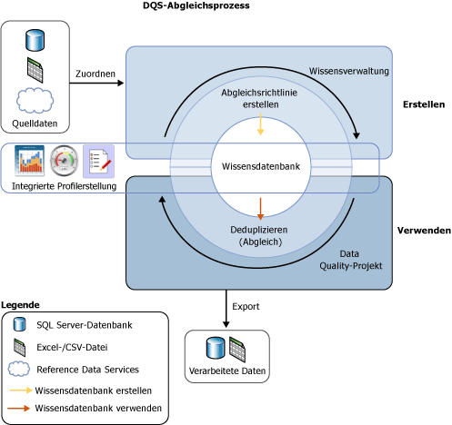

# Datenabgleich
  Der [!INCLUDE[ssDQSnoversion](../includes/ssdqsnoversion-md.md)] (DQS)-Datenabgleichsprozesse ermöglichen es Ihnen, Datenduplizierung zu reduzieren und Datengenauigkeit in einer Datenquelle zu verbessern. Der Abgleich analysiert den Grad der Duplizierung in allen Datensätzen einer einzelnen Datenquelle und gibt gewichtete Wahrscheinlichkeiten einer Übereinstimmung zwischen den einzelnen verglichenen Datensatzgruppen zurück. Sie können dann entscheiden, welche Datensätze Übereinstimmungen sind und die entsprechende Aktion für die Quelldaten ergreifen.  
  
 Der DQS-Abgleichsprozess hat die folgenden Vorteile:  
  
-   Der Abgleich ermöglicht es Ihnen, Unterschiede zwischen Datenwerten, die gleich sein sollten, auszuschließen, den richtigen Wert zu bestimmen und die Fehler, die Datenunterschiede verursachen können, zu reduzieren. Zum Beispiel sind Namen und Adressen oft die identifizierenden Daten für eine Datenquelle, insbesondere für Kundendaten, aber die Daten können sich mit der Zeit verschlechtern und verändern. Durch das Durchführen von Abgleichen zum Identifizieren und Korrigieren dieser Fehler kann die Datenverwendung und -verwaltung deutlich vereinfacht werden.  
  
-   Abgleiche ermöglichen es Ihnen, sicherzustellen, dass Werte, die äquivalent sind, aber in einem anderen Format eingegeben wurden, als einheitlich dargestellt werden.  
  
-   Abgleiche identifizieren genaue und ungefähre Übereinstimmungen, sodass Sie doppelte Daten beim Definieren entfernen können. Sie definieren den Punkt, an dem eine ungefähre Übereinstimmung in echte Übereinstimmung ist. Sie definieren, welche Felder für den Abgleich bewertet und welche ignoriert werden.  
  
-   DQS ermöglicht es Ihnen, eine Abgleichsrichtlinie mithilfe eines computerunterstützten Prozesses zu erstellen, sie interaktiv basierend auf Abgleichsergebnissen zu ändern und sie einer wiederverwendbaren Wissensdatenbank hinzuzufügen.  
  
-   Sie können Daten, die aus der Quelle in die Stagingtabelle kopiert wurden, neu indizieren oder je nach Status der Abgleichsrichtlinie und der Quelldaten nicht neu indizieren. Wenn Sie die Daten nicht neu indizieren, kann die Leistung verbessert werden.  
  
 Sie können den Abgleichsprozess zusammen mit anderen Datenbereinigungsprozessen ausführen, um die Gesamtdatenqualität zu verbessern. Sie können auch Datendeduplizierung mit in Master Data Services integrierter DQS-Funktionalität ausführen. Weitere Informationen finden Sie unter [Übersicht über Master Data Services &#40;MDS&#41;](../master-data-services/master-data-services-overview-mds.md).  
  
 Die folgende Abbildung zeigt an, wie der Datenabgleich in DQS erfolgt:  
  
   
  
##   So führen Sie den Datenabgleich aus  
 Wie bei anderen Data Quality-Prozessen in DQS führen Sie den Abgleich durch, indem Sie eine Wissensdatenbank erstellen und eine Abgleichsaktivität in einem Data Quality-Projekt mit den folgenden Schritten ausführen:  
  
1.  Erstellen einer Abgleichsrichtlinie in der Wissensdatenbank  
  
2.  Ausführen eines Deduplizierungsprozesses in einer Abgleichsaktivität, die Teil eines Data Quality-Projekts ist  
  
###   Erstellen einer Abgleichsrichtlinie  
 Sie bereiten die Wissensdatenbank auf das Durchführen des Abgleichs vor, indem Sie in der Wissensdatenbank eine Abgleichsrichtlinie erstellen, um zu definieren, wie DQS Abgleichswahrscheinlichkeiten zuweist. Eine Abgleichsrichtlinie besteht aus einer oder mehreren Abgleichsregeln, die identifizieren, welche Domänen verwendet werden, wenn DQS bewertet, inwieweit ein Datensatz einem anderen entspricht, und die Gewichtung angeben, die jeder Domänenwert in der Abgleichsbewertung aufweist. Sie geben in der Regel an, ob Domänenwerte genau übereinstimmen müssen oder auch ähnlich sein können. Außerdem geben Sie den Grad der Ähnlichkeit an. Sie geben auch an, ob eine Domänenübereinstimmung eine Voraussetzung ist.  
  
 Die Abgleichsrichtlinienaktivität im Wissensdatenbankverwaltungs-Assistenten analysiert Beispieldaten, indem jede Abgleichsregel angewendet wird, um zwei Datensätze gleichzeitig im gesamten Datensatzbereich zu vergleichen. Datensätze, deren Treffergenauigkeiten größer als ein angegebenes Minimum sind, werden in Clustern in den Abgleichsergebnissen gruppiert. Der Wissensdatenbank werden diese Abgleichsergebnisse nicht hinzugefügt; Sie optimieren damit die Abgleichsregeln. Das Erstellen einer Abgleichsrichtlinie kann ein iterativer Prozess sein, in dem Sie Abgleichsregeln auf Grundlage der Abgleichsergebnisse oder Profilerstellungsstatistiken ändern.  
  
 Sie können für eine Domäne angeben, dass Datenzeichenfolgen normalisiert werden, wenn Sie Daten aus der Datenquelle in die Domäne laden. Dieser Prozess besteht aus dem Ersetzen von Sonderzeichen durch eine Null oder ein Leerzeichen, was häufig den Unterschied zwischen zwei Zeichenfolgen entfernt. Auf diese Weise kann die Abgleichsgenauigkeit vergrößert werden, was oft dazu führt, dass ein Abgleichsergebnis den minimalen Abgleichsschwellenwert überschreitet, was ohne Normalisierung nicht möglich wäre.  
  
> [!NOTE]  
>  NULL-Werte in den entsprechenden Feldern von zwei Datensätzen werden als Übereinstimmung angesehen.  
  
 Die Abgleichsrichtlinie wird auf Domänen ausgeführt, die Beispieldaten zugeordnet sind. Sie können angeben, ob Daten aus der Datenquelle in die Stagingtabelle kopiert und neu indiziert werden sollen, wenn Sie die Abgleichsrichtlinie ausführen. Diese Möglichkeit haben Sie, wenn Sie die Wissensdatenbank erstellen und das Abgleichsprojekt ausführen. Wenn Sie die Daten nicht neu indizieren, kann die Leistung verbessert werden. Die Neuindizierung ist nicht notwendig, wenn Folgendes zutrifft: Die Abgleichsrichtlinie wurde nicht geändert, und Sie haben die Datenquelle nicht aktualisiert, die Richtlinie neu zugeordnet, eine neue Datenquelle ausgewählt oder mindestens eine neue Domäne zugeordnet.  
  
 Jede Abgleichsregel wird beim Erstellen in der Wissensdatenbank gespeichert. Eine Wissensdatenbank ist allerdings nur für die Verwendung in einem Data Quality-Projekt verfügbar, wenn sie veröffentlicht wird. Außerdem können die Abgleichsregeln erst dann von einem anderen Benutzer als die Person, die sie erstellt hat, geändert werden, wenn die Wissensdatenbank veröffentlicht wurde.  
  
###   Ausführen eines Abgleichsprojekts  
 DQS führt Datendeduplizierung durch Vergleichen jeder Zeile in den Quelldaten mit jeder anderen Zeile aus. Dabei wird die in der Wissensdatenbank definierte Abgleichsrichtlinie verwendet und eine Wahrscheinlichkeit für das Übereinstimmen der Zeilen erzeugt. Dies erfolgt in einem Data Quality-Projekt mit einem Abgleichstyp. Der Abgleich ist einer der Hauptschritte in einem Data Quality-Projekt. Am besten führen Sie ihn nach der Datenbereinigung aus, damit die abzugleichenden Daten fehlerfrei sind. Vor dem Ausführen eines Abgleichsprozesses können Sie die Ergebnisse des Bereinigungsprojekts in eine Datentabelle oder eine CSV-Datei exportieren und dann ein Abgleichsprojekt erstellen, in dem Sie Domänen im Abgleichsprojekt die Bereinigungsergebnisse zuordnen.  
  
 Ein Datenabgleichsprojekt besteht aus einem computerunterstützten Prozess und einem interaktiven Prozess. Das Abgleichsprojekt wendet die Abgleichsregeln in der Abgleichsrichtlinie auf die zu bewertende Datenquelle an. Dieser Prozess bewertet die Wahrscheinlichkeit, dass zwei beliebige Zeilen basierend auf einer Treffergenauigkeit übereinstimmen. Nur die Datensätze mit einer Wahrscheinlichkeit für eine Übereinstimmung, die größer als ein vom Data Steward in der Abgleichsrichtlinie festgelegter Wert ist, wird als Übereinstimmung angesehen.  
  
 Wenn DQS die Abgleichsanalyse ausführt, werden Cluster aus Datensätzen erstellt, die DQS als Übereinstimmungen ansieht. DQS identifiziert zufällig einen der Datensätze in jedem Cluster als Pivotdatensatz bzw. führenden Datensatz. Der Data Steward überprüft die Abgleichsergebnisse und lehnt jeden Datensatz ab, der keine entsprechende Übereinstimmung für einen Cluster aufweist. Der Data Steward wählt dann eine Survivorship-Regel aus, mit der DQS den Datensatz bestimmt, der den Abgleichsprozess überdauert und die übereinstimmenden Datensätze ersetzt. Die Survivorship-Regel kann „Pivotdatensatz“ (der Standard), „Vollständigster und längster Datensatz“, „Vollständigster Datensatz“ oder „Längster Datensatz“ sein. DQS bestimmt den (führenden) Survivor-Datensatz in jedem Cluster basierend darauf, welcher Datensatz den Kriterien bzw. dem Kriterium in der Survivorship-Regel am ehesten entspricht. Wenn mehrere Datensätze in einem angegebenen Cluster die Survivorship-Regel einhalten, wählt DQS zufällig einen dieser Datensätze aus. DQS ermöglicht es Ihnen, Cluster mit gemeinsamen Datensätzen als einzelnen Cluster anzuzeigen, indem Sie „Nicht überlappende Cluster anzeigen“ auswählen. Sie müssen den Abgleichsprozess ausführen, um die Ergebnisse gemäß dieser Einstellung anzuzeigen.  
  
 Sie können die Ergebnisse des Abgleichsprozesses in eine SQL Server-Tabelle oder eine CSV-Datei exportieren. Sie können Abgleichsergebnisse in zwei Formen exportieren: erstens die übereinstimmenden und die nicht übereinstimmenden Datensätze und zweitens Survivorship-Datensätze, die nur den Survivor-Datensatz für einen Cluster und die Ergebnisse ohne Übereinstimmung enthalten. Wenn in den Survivorship-Datensätzen der gleiche Datensatz als Survivor-Datensatz für mehrere Cluster identifiziert wird, wird dieser Datensatz nur einmal exportiert.  
  
## In diesem Abschnitt  
 Sie können die folgenden Aufgaben für Abgleiche in DQS ausführen:  
  
|||  
|-|-|  
|Erstellen und Testen von Abgleichsregeln in einer Abgleichsrichtlinie|[Erstellen einer Abgleichsrichtlinie](../data-quality-services/create-a-matching-policy.md)|  
|Ausführen von Abgleichen in einem Data Quality-Projekt|[Ausführen eines Abgleichsprojekts](../data-quality-services/run-a-matching-project.md)|  
  
  

