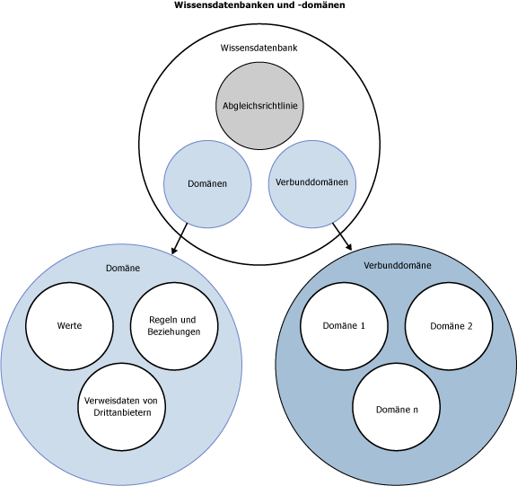

# DQS-Wissensdatenbanken und -Domänen
  In diesem Thema wird beschrieben, was eine Wissensdatenbank in [!INCLUDE[ssDQSnoversion](../includes/ssdqsnoversion-md.md)] (DQS) ist. Zum Bereinigen von Daten müssen Sie über Wissen zu den Daten verfügen. Um Informationen für ein Data Quality-Projekt vorzubereiten, müssen Sie eine Wissensdatenbank (Knowledge Base, KB) erstellen und verwalten, die von DQS verwendet werden kann, um falsche oder ungültige Daten zu identifizieren. Mit DQS können Sie sowohl computerunterstützte als auch interaktive Prozesse verwenden, um Ihre Wissensdatenbank zu erstellen, aufzubauen und zu aktualisieren. Informationen in einer Wissensdatenbank werden in Domänen verwalten, wobei jede für ein Datenfeld spezifisch ist. Die Wissensdatenbank ist ein Repository des Wissens zu den Daten. Sie ermöglicht es Ihnen, die Daten zu verstehen und ihre Integrität aufrechtzuerhalten.  
  
 DQS-Wissensdatenbanken bieten die folgenden Vorteile:  
  
-   Das Erstellen von Informationen über Daten ist ein detaillierter Prozess. Mit dem DQS-Prozess, bei dem Informationen über Daten automatisch aus Beispieldaten extrahiert werden, wird der Prozess wesentlich einfacher.  
  
-   Mit DQS können Sie die Analyse der Daten anzeigen und die Informationen in der Wissensdatenbank erweitern, indem Sie Regeln erstellen und die Datenwerte ändern. Sie können dies wiederholt vornehmen, um die Informationen im Laufe der Zeit zu verbessern.  
  
-   Sie können bereits vorhandenes Datenqualitätswissen nutzen, indem Sie eine Wissensdatenbank als Grundlage für ein vorhandene Wissensdatenbank verwenden, Domäneninformationen von Dateien in die Wissensdatenbank importieren, Informationen von einem Projekt in die Wissensdatenbank zurück importieren oder indem Sie die DQS-Daten der DQS-Standard-Wissensdatenbank verwenden.  
  
-   Sie können die Qualität der Daten sicherstellen, indem Sie sie mit den von einem Verweisdatenanbieter verwalteten Daten vergleichen.  
  
-   Es gibt eine klaren Unterschied zwischen dem Erstellen einer Wissensdatenbank und dem Anwenden von dieser auf einen Datenkorrekturprozess, wodurch Sie die Flexibilität in Bezug auf das Erstellen und Aktualisieren der Wissensdatenbank erhalten.  
  
 Der Data Steward verwendet die [!INCLUDE[ssDQSClient](../includes/ssdqsclient-md.md)] -Anwendung, um die computergestützten Schritte auszuführen und zu steuern sowie um die interaktiven Schritte auszuführen.  
  
 Die folgende Abbildung zeigt verschiedene Komponenten in einer Wissensdatenbank und einer Domäne in DQS an:  
  
   
  
##   Vorgehensweise: Erstellen und Aufbauen einer DQS-Wissensdatenbank  
 Das Aufbauen einer DQS-Wissensdatenbank schließt die folgenden Prozesse und Komponenten ein:  
  
 **Wissensermittlung**  
 Ein computerunterstützter Prozess, durch den Informationen durch das Verarbeiten von Beispieldaten in der Wissensdatenbank erstellt werden  
  
 **Domänenverwaltung**  
 Ein interaktiver Prozess, womit der Data Steward die Informationen überprüfen und ändern kann, die sich in den Wissensdatenbank-Domänen befinden, wovon jede mit einem Datenfeld verknüpft ist. Dies kann das Festlegen von feldweiten Eigenschaften, das Erstellen von Regeln, das Ändern bestimmter Werte, das Verwenden von Verweisdatendiensten oder das Einrichten von ausdrucksbasierten Beziehungen oder Beziehungen über mehrere Felder hinweg einschließen.  
  
 **Reference Data Services**  
 Ein Prozess zur Domänenverwaltung, mit dem Sie Ihre Daten mit den vom Verweisdatenanbieter gewarteten und garantierten Daten überprüfen können.  
  
 **Übereinstimmende Richtlinie**  
 Eine Richtlinie, die für einen computerunterstützten und interaktiven Prozess in die Wissensdatenbank integriert wurde, mit der definiert wird, wie DQS Datensätze verarbeitet, um potenzielle Duplikate und Nicht-Übereinstimmungen zu identifizieren.  
  
##   Wissensermittlung  
 Die Erstellung der Wissensdatenbank ist initial ein computergestützter Prozess. Die Wissensermittlungsaktivität baut die Wissensdatenbank durch das Analysieren eines Datenbeispiels gemäß den Kriterien auf, die für die Qualität der Daten gelten, indem eine Suche nach inkonsistenten Daten und Syntaxfehlern ausgeführt wird und Änderungen an den Daten vorgeschlagen werden. Diese Analyse basiert auf in DQS integrierten Algorithmen.  
  
 Der Data Steward bereitet den Prozess vor, indem er eine Wissensdatenbank mit einer SQL Server-Datenbanktabelle oder -sicht verknüpft, die Beispieldaten enthält, die den Daten ähneln, die mithilfe der Wissensdatenbank analysiert werden. Anschließend ordnet der Data Steward jeder Spalte mit zu analysierenden Beispieldaten eine Wissensdatenbank-Domäne zu. Eine Domäne kann entweder eine einzelne Domäne sein, die einem einzelnen Feld zugeordnet ist, oder sie kann eine Verbunddomäne sein, die aus mehreren einzelnen Domänen besteht, wovon jede einem Teil der Daten in einem einzelnen Feld zugeordnet ist (siehe unten "Verbunddomänen"). Bei der Durchführung der Wissensermittlung extrahiert DQS Informationen bezüglich der Datenqualität aus den Beispieldaten in die Domänen in der Wissensdatenbank. Wenn Sie die Wissensermittlungsanalyse ausgeführt haben, verfügen Sie über eine Wissensdatenbank, mit der Sie Datenkorrektur ausführen können.  
  
 Die DQS-Wissensdatenbank ist erweiterbar. Sie können in der Wissensdatenbank nach der computerunterstützten Wissensermittlungsanalyse der Wissensdatenbank interaktiv Informationen hinzufügen. Sie können Wertänderungen manuell hinzufügen, und Sie können Domänenwerte aus einer Excel-Datei importieren. Außerdem können Sie den Wissensermittlungsprozess zu einem späteren Zeitpunkt erneut ausführen, wenn sich die Daten im Beispiel geändert haben. Sie können mehr Informationen aus der Domänenverwaltungsaktivität und der Datenabgleichsaktivität anwenden (siehe unten).  
  
 Für die Daten, für die eine Datenkorrektur durchgeführt wird, muss kein Wissensermittlungsprozess ausgeführt werden. DQS ermöglicht es, Wissen aus einem Satz von Datenbankfeldern zu erstellen und dieses Wissen auf einen zweiten Satz mit verknüpften Daten, die bereinigt werden müssen, anzuwenden. Der Data Steward kann eine neue Wissensdatenbank von Grund auf neu oder basierend auf einer vorhandenen Wissensdatenbank erstellen oder eine Wissensdatenbank aus einer Datendatei importieren. Sie können die Wissensermittlung auch auf einer vorhandenen Wissensdatenbank erneut ausführen. Sie können mehrere Wissensdatenbanken auf einem einzelnen [!INCLUDE[ssDQSServer](../includes/ssdqsserver-md.md)]verwalten. Sie können auch mehrere Instanzen einer Anwendung mit der gleichen Wissensdatenbank verbinden. DQS verhindert Parallelitätskonflikte, indem die Wissensdatenbank für einen Benutzer gesperrt wird, der sie in einer Wissensverwaltungssitzung öffnet.  
  
### Nichtunterscheidung nach Groß-/Kleinbuchstaben in DQS  
 Bei Werten in DQS muss die Groß-/Kleinschreibung nicht beachtet werden. Wenn DQS die Wissensermittlung, die Domänenverwaltung oder den Abgleich ausführt, werden Werte nicht nach Groß-/Kleinschreibung unterschieden. Wenn Sie einen Wert in der Werteverwaltung hinzufügen, der sich von einem anderen Wert nur durch die Groß-/Kleinschreibung unterscheidet, werden die Werte als gleich und nicht als Synonyme angesehen. Wenn zwei Werte, die sich nur durch die Groß-/Kleinschreibung voneinander unterscheiden, in einem Abgleichsprozess verglichen werden, werden sie als genaue Übereinstimmung angesehen.  
  
 Sie können jedoch die Groß-/Kleinschreibung der Werte steuern, die Sie in Bereinigungsergebnissen exportieren. Dies ist möglich, indem Sie die Domäneneigenschaft **Formatausgabe** (siehe [Festlegen von Domäneneigenschaften](../data-quality-services/set-domain-properties.md)) festlegen und das Kontrollkästchen **Ausgabe standardisieren** aktivieren, wenn Sie Bereinigungsergebnisse exportieren (siehe [Bereinigen von Daten mit &#40;internem&#41; DQS-Wissen](../data-quality-services/cleanse-data-using-dqs-internal-knowledge.md)).  
  
##   Domänenverwaltung  
 Die Domänenverwaltung ermöglicht es dem Data Steward, die Metadaten interaktiv zu ändern und zu verbessern, die von der computergestützten Wissensermittlungsaktivität generiert wurden. Jede von Ihnen vorgenommene Änderung ist für eine Wissensdatenbankdomäne. In der Domänenverwaltungsaktivität ist Folgendes möglich:  
  
-   Erstellen Sie eine neue Domäne. Die neue Domäne kann mit einer vorhandenen Domäne verknüpft werden oder aus dieser kopiert werden.  
  
-   Legen Sie Domäneneigenschaften fest, die in der Domäne für jeden Ausdruck gelten.  
  
-   Wenden Sie Domänenregeln an, die die Überprüfung oder Standardisierung für den von Ihnen definierten Bereich an Werten ausführen.  
  
-   Wenden Sie Änderungen interaktiv für jeden bestimmten Datenwert in der Domäne an.  
  
-   Überprüfen Sie die Syntax, Rechtschreibung und Satzstruktur von Zeichenfolgenwerten mithilfe der DQS-Rechtschreibprüfung.  
  
-   Importieren Sie eine Domäne aus einer DQS-Datendatei oder von Domänenwerten aus einer Microsoft Excel-Datei.  
  
-   Importieren Sie Werte, die vom Bereinigungsprozess in einem Data Quality-Projekt gefunden wurden, zurück in die Wissensdatenbank.  
  
-   Fügen Sie eine Domäne an die von einem Verweisdatenanbieter verwalteten Verweisdaten an, damit die Domänenwerte mit den Verweisdaten verglichen werden, um ihre Integrität und Korrektheit zu bestimmen. Sie können auch Datenanbietereinstellungen festlegen.  
  
-   Wenden Sie ausdrucksbasierte Beziehungen für eine einzelne Domäne an.  
  
 Wenn die Domänenverwaltungsaktivität abgeschlossen ist, können Sie die Wissensdatenbank zur Verwendung in einem Datenprojekt veröffentlichen.  
  
### Festlegen von Domäneneigenschaften  
 Domäneneigenschaften definieren und steuern die Verarbeitung, die für die zugeordneten Werte angewendet wird. Sie können den Datentyp und die Sprache der Werte festlegen, angeben, dass die Quelldaten mit dem führenden Wert bereinigt werden (wenn diese Option deaktiviert ist, werden die Quelldaten mit der richtigen Benennung, jedoch nicht mit dem führenden Wert bereinigt), eine Datenstandardisierung sicherstellen, indem Sie die Formatierung konfigurieren, die angewendet wird, wenn die Datenwerte in der Domäne ausgegeben werden, und definieren, welche Algorithmen (Syntaxfehler, Rechtschreibprüfung und Zeichenfolgennormalisierung) angewendet werden.  
  
### Reference Data Services  
 Im Domänenverwaltungsprozess können Sie Onlineverweisdaten an eine Domäne anfügen. So können Sie die Daten in Ihrer Domäne mit den von einem Verweisdatenanbieter verwalteten Daten vergleichen. Sie müssen zuerst den Verweisdatenanbieter durch die DQS-Konfigurationsfunktionen im Abschnitt **Verwaltung** der Anwendung [!INCLUDE[ssDQSClient](../includes/ssdqsclient-md.md)] konfigurieren. Weitere Informationen finden Sie unter [Reference Data Services in DQS](../data-quality-services/reference-data-services-in-dqs.md).  
  
### Anwenden von Domänenregeln  
 Sie können Domänenregeln für die Datenvalidierung erstellen. Eine Domänenregel stellt die Genauigkeit der Daten sicher. Dies reicht von einer Basisbeschränkung wie möglichen Ausdrücken, die ein Zeichenfolgenwert sein können, bis hin zu komplexeren regulären Ausdrücken wie die gültigen Formate einer E-Mail-Adresse.  
  
 Für eine Verbunddomäne können Sie eine CD-Regel erstellen, die eine Beziehung zwischen einem Wert in einer einzelner Domäne und einem Wert in einer anderen einzelnen Domäne angibt, die jeweils beide Teile der Verbunddomäne sind.  
  
### Festlegen von Domänenwerten  
 Nachdem Sie eine Wissensdatenbank erstellt haben, können Sie Datenwerte in jeder Domäne der Wissensdatenbank auffüllen und anzeigen. Nach der Wissensermittlung zeigt DQS an, wie oft jeder Ausdruck angezeigt wird, wie der Status jedes Ausdrucks lautet sowie alle vorgeschlagenen Korrekturen. Sie können diese Informationen wie folgt verwalten:  
  
-   Den Status eines Werts ändern (in korrekt, fehlerhaft oder ungültig)  
  
-   Der Wissensdatenbank einen bestimmen Wert hinzufügen oder einen bestimmten Wert aus der Wissensdatenbank löschen  
  
-   Die Beziehung eines Werts zu einem anderen ändern, einschließlich der Ersetzung eines Ausdrucks, der fehlerhaft oder ungültig ist  
  
-   Fügen Sie Informationen hinzu, die der Domäne zugeordnet sind oder entfernen oder ändern Sie die Informationen.  
  
 Werte können speziell durch den Benutzer oder als Teil der Datenermittlung oder Importierfunktionen erstellt werden. Dadurch können Sie die Domäne an Ihr Geschäft anpassen und sie leicht erweitern.  
  
 Sie können Domänenwerte entweder in der Domänenverwaltungsaktivität oder im Schritt für die Verwaltung der Domänenwerte am Ende der Wissensermittlungsaktivität festlegen. Die Domänenwert-Funktionalität ist in beiden Aktivitäten gleich.  
  
### Festlegen von Ausdrucksbeziehungen  
 In der Domänenverwaltung können Sie für eine einzelne Domäne eine begriffsbasierten Ausdruck angeben und eine Änderung an einem einzelnen Wert angeben.  
  
### Verbunddomänen  
 Eine Verbunddomäne ist eine Struktur, die aus zwei oder mehr einzelnen Domänen besteht, von denen jede Informationen über allgemeine Daten enthält. Zu den Beispielen für Daten, die von Verbunddomänen adressiert werden können, zählen der Vorname, ein weiterer Vorname und Familienamen in einem Namensfeld sowie die Hausnummer, Straße, Stadt, das Bundesland, die Postleitzahl und das Land im Adressenfeld. Wenn Sie einer Verbunddomäne ein einzelnes Feld zuordnen, teilt DQS die Daten von dem einen Feld in mehrere Domänen, die den Verbund bilden.  
  
 Manchmal stellt eine einzelne Domäne die Felddaten nicht vollständig dar. Durch das Gruppieren von mindestens zwei Domänen in einer Verbunddomäne können Sie die Daten effizient darstellen. Im Folgenden finden Sie Vorteile hinsichtlich der Verwendung von Verbunddomänen:  
  
-   Das Analysieren der unterschiedlichen einzelnen Domänen, die eine Verbunddomäne bilden, kann beim Bewerten der Datenqualität ein effizienterer Weg sein.  
  
-   Wenn Sie eine Verbunddomäne verwenden, können Sie auch domänenübergreifende Regeln erstellen, mit denen Sie überprüfen können, ob die Beziehung zwischen Daten in mehreren Domänen ordnungsgemäß ist. Sie können z. B. überprüfen, ob die Zeichenfolge "Berlin" in einer Ortsdomäne der Zeichenfolge "Deutschland" in einer Landdomäne entspricht. Beachten Sie, dass domänenübergreifende Regeln nach Domänenregeln berücksichtigt werden.  
  
-   Daten in Verbunddomänen können an eine Verweisdaten-Quelle angefügt werden. In diesem Fall wird die Verbunddomäne an den Verweisdatenanbieter gesendet. Dies wird oft mit Adressdaten vorgenommen.  
  
 Wie die durch eine Verbunddomäne dargestellten Daten analysiert werden, wird von den Verbunddomäneneigenschaften bestimmt. Die Daten können von einem Trennzeichen, anhand der Reihenfolge der Domänen oder auf Grundlage des Wissens in den an die Verbunddomäne angefügten Domänen analysiert werden (durch Auswählen der Eigenschaft **Analyse der Wissensdatenbank verwenden** in der Verbunddomäne). Weitere Informationen finden Sie unter [Set Composite Domain Properties](../data-quality-services/create-a-composite-domain.md#CompositeDomainProperties).  
  
 Verbunddomänen werden anders verwaltet als einzelne Domänen. Sie müssen keine Werte in einer Verbunddomäne verwalten. Demgegenüber müssen Sie Werte für die einzelnen Domänen verwalten, aus der sich die Verbunddomäne zusammensetzt. In der Domänenliste der Domänenverwaltungsaktivität können Sie jedoch die Beziehungen zwischen den anderen Werten in einer Verbunddomäne und die Statistiken, die für sie gelten, sehen. Sie können beispielsweise anzeigen, wie viele Instanzen einer einzelnen Adresse vorhanden sind, die aus den gleichen fünf Zeichenfolgenwerten bestehen. Im Ermittlungsschritt der Wissensdatenbankaktivität wird die Profilerstellung auf die einzelnen Domänen innerhalb einer Verbunddomäne angewendet und nicht auf die Verbunddomäne selbst. Bei der interaktiven Bereinigung bereinigen Sie die Daten jedoch in der Verbunddomäne und nicht in den einzelnen Domänen.  
  
 Der Abgleich kann auf den einzelnen Domänen ausgeführt werden, aus der sich die Verbunddomäne zusammensetzt, jedoch nicht auf der Verbunddomäne selbst.  
  
##   Datenabgleich  
 Zusätzlich zu den manuellen Änderungen an einer Wissensdatenbank, die mit der Domänenverwaltung vorgenommen werden können, können Sie der Wissensdatenbank Abgleichswissen hinzufügen. Um DQS auf den Datendeduplizierungsprozess vorzubereiten, müssen Sie eine Abgleichsrichtlinie erstellen, mit der DQS die Wahrscheinlichkeit einer Übereinstimmung berechnet. Die Richtlinie schließt eine oder mehrere Abgleichsregeln ein, die der Data Steward erstellt, um zu identifizieren, wie DQS Zeilen der Daten vergleichen sollte. Der Data Steward bestimmt, welche Datenfelder in der Zeile verglichen werden sollten und über welche Gewichtung jedes Feld beim Abgleich verfügen sollte. Der Data Steward bestimmt auch, wie hoch die Wahrscheinlichkeit sein sollte, um einen Treffer als Übereinstimmung anzusehen. DQS fügt der Wissensdatenbank Abgleichsregeln für die Verwendung beim Ausführen einer Abgleichsaktivität in einem Data Quality-Projekt hinzu.  
  
 Weitere Informationen zur Wissensdatenbank finden Sie unter [Datenabgleich](../data-quality-services/data-matching.md)verwalten.  
  
## In diesem Abschnitt  
 Sie können die folgenden Vorgänge auf einer Wissensdatenbank und deren Domänen ausführen:  
  
|||  
|-|-|  
|Eine Wissensdatenbank erstellen, öffnen, ihr Informationen hinzufügen und auf ihr die Wissensermittlung ausführen|[Aufbau einer Wissensdatenbank](../data-quality-services/building-a-knowledge-base.md)|  
|Import- und Exportvorgänge auf Domänen und Wissensdatenbanken ausführen|[Importieren und Exportieren von Wissen](../data-quality-services/importing-and-exporting-knowledge.md)|  
|Einzelne Domänen, eine Domänenregel, ausdrucksbasierte Beziehungen erstellen und Domänenwerte ändern|[Verwalten einer Domäne](../data-quality-services/managing-a-domain.md)|  
|Eine Verbunddomäne, eine domänenübergreifende Regel erstellen und Wertbeziehungen verwenden|[Verwalten einer Verbunddomäne](../data-quality-services/managing-a-composite-domain.md)|  
|Die in DQS integrierte DQS-Wissensdatenbank verwenden|[Verwenden der DQS-Standard-Wissensdatenbank](../data-quality-services/using-the-dqs-default-knowledge-base.md)|  
  
  

