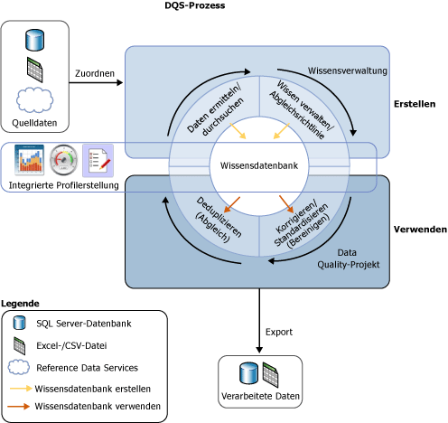

# Einführung in Data Quality Services
  Die von [!INCLUDE[ssDQSnoversion](../includes/ssdqsnoversion-md.md)] (DQS) bereitgestellte Data Quality-Lösung ermöglicht es einem Data Steward oder einem IT-Spezialisten, die Qualität ihrer Daten aufrechtzuerhalten. Dadurch wird sichergestellt, dass die Daten für die Geschäftsverwendung geeignet sind. DQS ist eine wissensorientierte Lösung, die computergestützte und interaktive Möglichkeiten bietet, um die Integrität und Qualität der Datenquellen zu verwalten. Mit DQS können Sie Informationen über Ihre Daten erkunden, erstellen und verwalten. Sie können diese Informationen dann verwenden, um Datenbereinigung, -übereinstimmung und -profilerstellung auszuführen. Sie können auch die Cloud-basierten Dienste von Verweisdatenanbietern in einem DQS-Data Quality-Projekt nutzen.  
  
##   Geschäftsanforderung nach DQS  
 Falsche Daten können die Folge von Eingabefehlern, Übertragungsfehlern bzw. Beschädigungen beim Speichern, von nicht übereinstimmenden Definitionen in Datenwörterbüchern und anderen Data Quality- und Verarbeitungsproblemen sein. Das Aggregieren von Daten aus unterschiedlichen Quellen, die verschiedene Datenstandards verwenden, kann zu inkonsistenten Daten führen, wie dies auch beim Anwenden einer arbiträren Regel oder beim Überschreiben historischer Daten der Fall sein kann. Falsche Daten haben Auswirkungen auf die Geschäftsabläufe in einem Unternehmen und auf die Bereitstellung von Diensten für die Kunden. Sie können zu einem Verlust von Glaubwürdigkeit, Umsatz und zu Kundenunzufriedenheit und Kompatibilitätsproblemen führen. Automatisierte Systeme können falsche Daten oft nicht verwenden, und in manuellen Prozessen verursachen falsche Daten einen höheren Zeit- und Arbeitsaufwand. Falsche Daten können verheerenden Schaden bei der Datenanalyse, der Berichterstellung, beim Data Mining und Warehousing anrichten.  
  
 Die Effizienz von Unternehmen und Institutionen ist von hochwertigen Daten abhängig. Eine Organisation beliebiger Größe kann den Informationswert seiner Daten mithilfe von DQS verbessern und kann die Daten für seine vorsehen Verwendung geeigneter machen. Eine Data Quality-Lösung kann Daten zuverlässiger, zugreifbar, und wiederverwendbar machen. Dadurch können die Vollständigkeit, Genauigkeit, Konformität und Konsistenz Ihrer Daten verbessert werden. Zudem können dadurch Probleme gelöst werden, die von falschen Daten in Business Intelligence- oder Data Warehouse-Arbeitslasten sowie in funktionstüchtigen OLTP-Systemen hervorgerufen wurden.  
  
 Mithilfe von DQS können sowohl Benutzer im geschäftlichen Bereich als auch IT-Mitarbeiter oder IT-Spezialisten, die weder Datenbankexperten noch Programmierer sind, bei minimalem Zeitaufwand für die Einrichtung und Vorbereitung Data Quality-Vorgänge Ihrer Organisationen erstellen, verwalten und ausführen.  
  
##   Beantworten dieser Anforderung mit DQS  
 Data-Quality wird nicht in absoluten Ausdrücken definiert. Es hängt davon ab, ob die Daten dem gewünschten Zweck entsprechen. DQS identifiziert potenziell falsche Daten, und Sie erhalten eine Bewertung der Wahrscheinlichkeit, in der Sie ablesen können, ob die Daten tatsächlich falsch sind. DQS stellt Ihnen ein semantisches Verständnis der Daten zur Verfügung, damit Sie entscheiden können, ob sie angemessen sind. DQS ermöglicht es Ihnen, Probleme wie Unvollständigkeit, Mangel an Gleichförmigkeit, mangelnder Übereinstimmung, Ungenauigkeit, Unzulässigkeit und Datenduplizierung zu beheben.  
  
 DQS stellt die folgenden Funktionen bereit, um Data Quality-Probleme zu beheben.  
  
-   **Datenbereinigung:** die Änderung, Entfernung oder Erweiterung von Daten, die falsch oder unvollständig sind, und zwar sowohl mit computerunterstützten als auch interaktiven Prozessen. Weitere Informationen finden Sie unter [Data Cleansing](../data-quality-services/data-cleansing.md).  
  
-   **Abgleich:** die Identifikation semantischer Duplikate in einem regelbasierten Prozess, der Ihnen ermöglicht zu bestimmen, was eine Übereinstimmung bildet und eine Deduplizierung ausführt. Weitere Informationen finden Sie unter [Data Matching](../data-quality-services/data-matching.md).  
  
-   **Reference Data Services:** Überprüfen der Datenqualität unter Verwendung des Diensts eines Verweisdatenanbieters. Sie können mithilfe von Reference Data Services von [Microsoft Azure Marketplace](http://azure.microsoft.com/marketplace/) Daten bereinigen, überprüfen, abgleichen und erweitern. Weitere Informationen finden Sie unter [Reference Data Services in DQS](../data-quality-services/reference-data-services-in-dqs.md).  
  
-   **Profilerstellung:** die Analyse einer Datenquelle, um auf jeder Ebene bei der Wissensermittlung, bei der Domänenverwaltung, beim Abgleich und beim Datenbereinigungsprozess einen Einblick in die Qualität der Daten bereitzustellen. Die Profilerstellung ist ein leistungsstarkes Tool in einer DQS-Data Quality-Lösung. Sie können eine Data Quality-Lösung erstellen, in der die Profilerstellung so wichtig wie die Wissensverwaltung, der Abgleich oder die Datenbereinigung ist. Weitere Informationen finden Sie unter [Data Profiling and Notifications in DQS](../data-quality-services/data-profiling-and-notifications-in-dqs.md).  
  
-   **Überwachen:** die Nachverfolgung und Feststellung des Status von Data Quality-Aktivitäten. Mit der Überwachungsfunktion können Sie sicherstellen, dass Ihre Data Quality-Lösung sich entsprechend verhält. Weitere Informationen finden Sie unter [DQS Administration](../data-quality-services/dqs-administration.md).  
  
-   **Wissensdatenbank:** Data Quality Services ist eine wissensorientierte Lösung, die Daten anhand von Informationen analysiert, die Sie mit DQS erstellt haben. Dies ermöglicht es Ihnen, Data Quality-Prozesse zu erstellen, wodurch die Informationen über Ihre Daten kontinuierlich erweitert werden und somit die Qualität Ihrer Daten verbessert wird.  
  
 Die folgende Abbildung veranschaulicht den DQS-Prozess.  
  
   
  
##   Eine wissensorientierte Lösung  
 Eine DQS-Wissensdatenbank ist ein Repository, die drei Typen an Informationen darstellt: Standardinformationen, vom [!INCLUDE[ssDQSServer](../includes/ssdqsserver-md.md)]generierte Informationen und vom Benutzer generierte Informationen. DQS ermöglicht es Ihnen, Informationen zu den Daten in der Wissensdatenbank zu speichern, Geschäftsregeln hinzuzufügen und die Informationen nach Bedarf zu ändern. Außerdem können Sie damit die Integrität und Richtigkeit der Daten testen. Nachdem Sie die Wissensdatenbank erstellt haben, können Sie sie kontinuierlich verbessern und sie in mehreren Data Quality-Verbesserungsvorgängen erneut verwenden.  
  
 Mit den Informationen in einer Wissensdatenbank können potenziell falsche Daten gefunden und Datenänderungen empfohlen werden. Damit wird es möglich, Datenübereinstimmungen zu suchen, und dadurch können Sie eine Datendeduplizierung ausführen. Es kann Quelldaten mit Cloud-basierten Verweisdaten vergleichen, die von Data Quality-Anbietern gewartet und garantiert werden. Sowohl der Data Steward als auch der IT-Spezialist müssen die Informationen in der Wissensdatenbank und die vorzunehmenden Änderungen an den Daten überprüfen und die Bereinigung, Deduplizierung und Verweisdatendienste ausführen.  
  
 Eine Wissensdatenbank speichert sämtliche auf einen bestimmten Typ der Datenquelle bezogene Informationen. Sie könnten z. B. eine Wissensdatenbank für eine Kundendatenbank und eine andere Wissensdatenbank für eine Mitarbeiterdatenbank beibehalten. Informationen sind in mindestens einer Datendomäne enthalten, wobei jede eine semantische Darstellung eines Datentyps in einem Datenfeld ist. Eine Wissensdatenbank für eine Kundendatenbank hat möglicherweise Domänen für Unternehmensnamen, Adressen, Kontakte, Kontaktinformationen usw. Eine Domäne enthält eine Liste von vertrauenswürdigen Werten, ungültigen Werten und falschen Daten. Domänenwissen schließt Synonymzuordnungen ein, Ausdrucksbeziehungen, Überprüfungs- und Geschäftsregeln und Abgleichsrichtlinien ein. Dieses Wissen ermöglicht es dem Data Steward, eine fundierte Entscheidung darüber zu treffen, ob bestimmte Instanzen der Werte in einer Domäne korrigiert werden sollen.  
  
 DQS ermöglicht es Ihnen, Import- und Exportvorgänge mit einer Wissensdatenbank auszuführen. Sie können Domänen oder Wissensdatenbanken mit einer DQS-Datei importieren oder exportieren. Sie können Werte oder Domänen aus einer Excel-Datei importieren. Sie können auch Werte erneut in die Domäne importieren, die von einem Bereinigungsprozess auf Grundlage der Wissensdatenbank gefunden wurden. Mit diesen Vorgängen können Sie eine Wissensdatenbank kontinuierlich verbessern und sicherstellen, dass das durch Entscheidungen und Ermittlungen erworbene Wissen in die Wissensdatenbank zurückgeleitet wird.  
  
 Die wissensorientierte DQS-Lösung führt zwei grundlegende Schritte aus, um die Daten zu bereinigen:  
  
-   Im **Wissensverwaltungsprozess** wird die Wissensdatenbank erstellt.  
  
-   Im **Data Quality-Projekt** werden Änderungen an den Quelldaten vorgeschlagen, die auf dem Wissen in der Wissensdatenbank basieren.  
  
 Weitere Informationen finden Sie unter [DQS-Wissensdatenbanken und -Domänen](../data-quality-services/dqs-knowledge-bases-and-domains.md) und [Data Quality-Projekte &#40;DQS&#41;](../data-quality-services/data-quality-projects-dqs.md).  
  
##   DQS-Komponenten  
 Data Quality Services besteht aus [!INCLUDE[ssDQSServer](../includes/ssdqsserver-md.md)] und [!INCLUDE[ssDQSClient](../includes/ssdqsclient-md.md)]. Diese Komponenten ermöglichen es Ihnen, Data Quality-Dienste von anderen SQL Server-Vorgängen getrennt auszuführen. Beide Komponenten werden im SQL Server-Setupprogramm installiert.  
  
 [!INCLUDE[ssDQSServer](../includes/ssdqsserver-md.md)] wird in Form von drei SQL Server-Katalogen implementiert, die Sie verwalten können und im SQL Server Management Studio (DQS_MAIN, DQS_PROJECTS, und DQS_STAGING_DATA) überwachen können. DQS_MAIN enthält gespeicherte DQS-Prozeduren, das DQS-Modul und veröffentlichte Wissensdatenbanken. DQS_PROJECTS enthält Daten, die für die Verwaltung einer Wissensdatenbank und für DQS-Projektaktivitäten erforderlich sind. DQS_STAGING_DATA bietet eine Zwischenstagingdatenbank, in den Sie die Quelldaten zum Ausführen von DQS-Vorgängen kopieren können, um die verarbeiteten Daten anschließend zu exportieren.  
  
 [!INCLUDE[ssDQSClient](../includes/ssdqsclient-md.md)] ist eine eigenständige Anwendung, die Ihnen ermöglicht, die Wissensverwaltung, Data Quality-Projekte und die Verwaltung in einer Benutzeroberfläche auszuführen. Die Anwendung eignet sich für Data Stewards und DQS-Administratoren. Es handelt sich um eine eigenständige ausführbare Datei, die die Wissensermittlung, die Domänenverwaltung, die Abgleichsrichtlinienerstellung, die Datenbereinigung, den Abgleich, die Profilerstellung, die Überwachung und die Serververwaltung ausführt. Der[!INCLUDE[ssDQSClient](../includes/ssdqsclient-md.md)] kann auf dem gleichen Computer wie der [!INCLUDE[ssDQSServer](../includes/ssdqsserver-md.md)] oder remote auf einem separaten Computer installiert und ausgeführt werden. Zur Verbesserung der Benutzerfreundlichkeit werden viele Vorgänge im [!INCLUDE[ssDQSClient](../includes/ssdqsclient-md.md)] über einen Assistenten ausgeführt.  
  
##   Data Quality-Funktionen in Integration Services und Master Data Services  
 Die von Data Quality Services bereitgestellte Data Quality-Funktionalität ist in eine Komponente von SQL Server Integration Services (SSIS) und in Funktionen von Master Data Services (MDS) integriert, damit Sie mit diesen Diensten Data Quality-Prozesse ausführen können.  
  
 **[!INCLUDE[ssDQSCleansingLong](../includes/ssdqscleansinglong-md.md)]**  
  
 Der [!INCLUDE[ssDQSCleansingLong](../includes/ssdqscleansinglong-md.md)] ermöglicht es Ihnen, Datenbereinigung als Teil eines Integration Services-Pakets auszuführen. Wenn das Paket ausgeführt wird, wird die Datenbereinigung als Batchdatei ausgeführt. Dies ist eine Alternative zum Ausführen eines Bereinigungsprojekts in der Anwendung [!INCLUDE[ssDQSClient](../includes/ssdqsclient-md.md)] . Sie können die Qualität der Daten automatisch sicherstellen. Sie müssen die interaktiven Schritte eines Datenbereinigungsprojekts innerhalb der Anwendung [!INCLUDE[ssDQSClient](../includes/ssdqsclient-md.md)] nicht ausführen. Sie können den Datenbereinigungsprozess innerhalb eines Datenflusses einschließen, der andere Integration Services-Komponenten enthält. Weitere Informationen finden Sie unter [DQS-Bereinigungstransformation](../integration-services/data-flow/transformations/dqs-cleansing-transformation.md).  
  
 **Data Quality-Prozesse in Master Data Services**  
  
 Die Data Quality Services-Funktionalität wurde in Master Data Services (MDS) integriert, damit Sie die Deduplizierung für Quelldaten und Masterdaten innerhalb des Microsoft SQL Server 2014 Master Data Services-Add-Ins für Microsoft Excel ausführen können. Laden Sie zum Durchführen des Abgleichs von MDS verwaltete Daten in ein Excel-Arbeitsblatt, kombinieren Sie sie mit nicht von MDS verwalteten Daten, und führen Sie dann den Abgleich in Excel durch. Die [!INCLUDE[ssDQSServer](../includes/ssdqsserver-md.md)] -Komponenten müssen mit MDS installiert werden. Weitere Informationen finden Sie unter  [Data Quality-Abgleich im MDS-Add-In für Excel](../master-data-services/microsoft-excel-add-in/data-quality-matching-in-the-mds-add-in-for-excel.md).  
  
  

