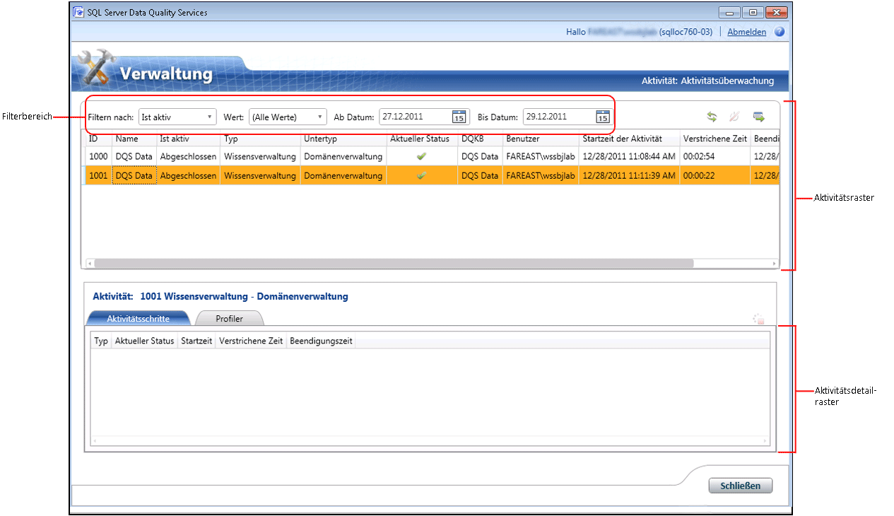

# Überwachen der DQS-Aktivitäten

[!INCLUDE[appliesto-ss-xxxx-xxxx-xxx-md-winonly](../includes/appliesto-ss-xxxx-xxxx-xxx-md-winonly.md)]

  In diesem Thema wird beschrieben, wie die folgenden Aktivitäten in [!INCLUDE[ssDQSnoversion](../includes/ssdqsnoversion-md.md)] (DQS) zentral überwacht werden: Wissensermittlung, Domänenverwaltung, Abgleichsrichtlinie, Datenbereinigung, Datenabgleich und SSIS-Bereinigung.  
  
##   Vorbereitungsmaßnahmen  
  
###   Einschränkungen  
 Nur Benutzer mit der dqs_administrator-Rolle in der Datenbank DQS_Main können eine Aktivität oder einen Prozess innerhalb einer Aktivität beenden.  
  
###   Sicherheit  
  
####   Berechtigungen  
  
-   Sie müssen über die dqs_kb_editor- oder dqs_kb_operator-Rolle in der Datenbank DQS_MAIN verfügen, um die DQS-Aktivitäten anzuzeigen.  
  
-   Sie müssen über die dqs_administrator-Rolle in der Datenbank DQS_MAIN verfügen, um die DQS-Aktivitäten anzuzeigen und außerdem eine Aktivität oder einen Prozess innerhalb einer Aktivität zu beenden.  
  
##   Anzeigen von DQS-Aktivitäten  
  
1.  [!INCLUDE[ssDQSInitialStep](../includes/ssdqsinitialstep-md.md)] [Ausführen der Data Quality-Clientanwendung](../data-quality-services/run-the-data-quality-client-application.md).  
  
2.  Klicken Sie auf dem [!INCLUDE[ssDQSClient](../includes/ssdqsclient-md.md)] -Startbildschirm auf **Aktivitätsüberwachung**. Der Bildschirm Aktivitätsüberwachung wird geöffnet.  
  
       
  
3.  Auf dem Bildschirm Aktivitätsüberwachung werden Informationen zu jeder Aktivität in einem Aktivitätsraster angezeigt. Das Aktivitätsraster zeigt die folgenden Informationen zu jeder DQS-Aktivität an:  
  
     **ID**: Ein ganzzahliger Wert. Eindeutige Aktivitätsnummer, die das System für die Aktivitätsüberwachung generiert.  
  
     **Name**: Der Name der Wissensdatenbank oder des Data Quality-Projekts, die bzw. das für diese Aktivität verwendet wird.  
  
     **Aktiv**: Gibt an, ob die Aktivität derzeit aktiv ist. Die folgenden Werte sind möglich:  
  
    -   **Aktiv**: Aktivität wird gerade ausgeführt.  
  
    -   **Abgeschlossen**: Die Aktivität wurde beendet.  
  
    -   **Beendet**: Die Aktivität wurde vom DQS-Administrator im Bildschirm Aktivitätsüberwachung beendet oder während der Ausführung im entsprechenden Funktionsbereich in [!INCLUDE[ssDQSClient](../includes/ssdqsclient-md.md)]vom Benutzer abgebrochen.  
  
     **Typ**: Gibt den Typ der Aktivität an. **Untertyp** gibt den jeweiligen Workflow an, der für einen Aktivitätstyp ausgeführt wird. Die folgenden Aktivitätstypen werden überwacht:  
  
    -   Untertypen der**Wissensverwaltung** :  
  
        -   **Wissensermittlung**  
  
        -   **Domänenverwaltung**  
  
        -   **Übereinstimmende Richtlinie**  
  
    -   Untertypen von**DQ-Projekt** :  
  
        -   **Bereinigung**  
  
        -   **Abgleich**  
  
    -   Untertypen von**SSIS-Bereinigung** :  
  
        -   **Bereinigung**  
  
     **Aktueller Status**: Zeigt den aktuellen Status einer Aktivität an. Der Aktivitätsstatus wird durch den zuletzt durchgeführten Berechnungsprozess bestimmt. So wie der Ermittlungsprozess (im Rahmen der Wissensermittlungsaktivität) kann auch der Berechnungsprozess für eine Aktivität mehrmals ausgeführt werden. Aus diesem Grund kann sich der Status während der Lebensdauer einer Aktivität mehrere Male ändern.  
  
     **Aktueller Status** kann die folgenden Werte annehmen:  
  
    -   **Wird ausgeführt**: Der Berechnungsprozess wird ausgeführt.  
  
    -   **Erfolgreich**: Status vor Ausführung eines Berechnungsprozesses sowie nach dem erfolgreichen Abschluss eines Berechnungsprozesses.  
  
    -   **Fehler**: Im Berechnungsprozess ist ein Fehler aufgetreten.  
  
    -   **Beendet**: Der Berechnungsprozess wurde beendet.  
  
     **DQKB**: Name der Wissensdatenbank, die für die Aktivität verwendet wird.  
  
     **Benutzer**: Der Name des Benutzers, der die Aktivität initiiert hat, oder der letzte Benutzer, der die Aktivität verwendet hat (falls es sich dabei nicht um denselben Benutzer handelt).  
  
     **Startzeit der Aktivität**: Datum und Uhrzeit beim Start der Aktivität.  
  
     **Verstrichene Zeit**: Die verstrichene Zeit seit dem Start der Aktivität. Dies wird in der Schreibweise HH:MM:SS angezeigt.  
  
     **Endzeit der Aktivität**: Datum und Uhrzeit bei der Beendigung der Aktivität.  
  
##   Filtern von DQS-Aktivitätsinformationen  
 Sie können im Filterbereich des Bildschirms Aktivitätsüberwachung (**Filtern nach**, **Wert**, **Ab Datum**und **Bis Datum**) die erforderlichen Aktivitäten nach bestimmten Kriterien filtern und anzeigen. So filtern Sie Aktivitätsdatensätze:  
  
1.  Legen Sie das Filterkriterium fest: Sie können die Aktivitätsdatensätze basierend auf einem Wert in einer der Spalten im Aktivitätsraster (wertbasiert) und/oder basierend auf einem Datumsbereich filtern.  
  
    1.  **Wertbasierter Filter**: Wählen Sie ein Filterkriterium in der Liste **Filtern nach** aus, und legen Sie den Wert, nach dem gefiltert werden soll, in der Liste **Wert** fest. Wenn Sie in der Liste **Filtern nach** eine Option ausgewählt haben, wird die Liste **Wert** mit den möglichen Werten aktualisiert. Sie können in den Aktivitätsdatensätzen nach den folgenden Feldern filtern: **Ist aktiv**, **Typ**, **Untertyp**, **Aktueller Status**und **DQKB**und **Benutzer**.  
  
    2.  **Datumsbereichbasierter Filter**: Wählen Sie die gewünschten Daten in den Datumssteuerelementen **Ab Datum** und **Bis Datum** aus. Standardmäßig liegt das im Feld **Ab Datum** angezeigte Datum zwei Tage vor dem aktuellen Datum, und in **Bis Datum** ist das aktuelle Datum angegeben. Die Filterung erfolgt nicht basierend auf den *Ab* - und *Bis* -Daten, sondern basierend auf dem Datumsbereich. Dies bedeutet, dass jede Aktivität, die während des ausgewählten Datumsbereichs ausgeführt wurde, angezeigt wird.  
  
2.  Klicken Sie auf das Symbol **Aktivitätsliste aktualisieren** , um den Filter anzuwenden, und zeigen Sie nur die gefilterten DQS-Aktivitäten an.  
  
##   Anzeigen von DQS-Aktivitätsdetails  
 Sie können ausführliche Informationen zu einer DQS-Aktivität, z. B. Aktivitätsschritte und Profiler-Informationen im Bildschirm Aktivitätsüberwachung anzeigen. Gehen Sie folgendermaßen vor:  
  
1.  Wählen Sie eine DQS-Aktivität im Aktivitätsraster (im oberen Bereich) aus.  
  
2.  Im unteren Bereich werden die Aktivitätsdetails der ausgewählten Aktivität auf den beiden folgenden Registerkarten angezeigt:  
  
    -   **Aktivitätsschritte**: Zeigt ein Raster mit den Berechnungsprozessen (Aktivitätsschritten) an, die der ausgewählten Aktivität zugeordnet sind. Auf dieser Registerkarte können mehrere Aktivitätsschritte für eine Aktivität angezeigt werden. Dies ist dann der Fall, wenn der gleiche Aktivitätsschritt innerhalb der Aktivität mehrere Male vom Benutzer ausgeführt wurde. Beispielsweise kann der Aktivitätsschritt beendet und wieder gestartet worden sein. Das Raster auf dieser Registerkarte zeigt die folgenden Informationen für jeden Aktivitätsschritt an, der dieser Aktivität zugeordnet ist: **Typ**, **Aktueller Status**, **Startzeit**, **Verstrichene Zeit**und **Beendigungszeit**.  
  
    -   **Profiler**: Zeigt die Informationen für die Profilerstellung für aktuelle und vergangene Aktivitäten an. Für aktuelle Aktivitäten werden die Informationen teilweise, jedoch konsistent, angezeigt. Die Profilerstellungsdaten einer Aktivität werden in eine Excel-Datei exportiert, wenn Sie die entsprechenden Aktivitätsdetails in eine Excel-Datei exportieren. Die Informationen sind in der exportierten Excel-Datei in den Arbeitsblättern **Profiler – Quelle** und **Profiler – Felder** verfügbar.  
  
##   Exportieren von DQS-Aktivitätsdetails  
 Sie können die Aktivitätseigenschaften, Aktivitätsprozesse und Profilerstellungsdaten einer Aktivität im Überwachungsbildschirm in eine Excel-Datei exportieren. Gehen Sie folgendermaßen vor:  
  
1.  Wählen Sie eine Aktivität im Aktivitätsraster (im oberen Bereich) aus.  
  
2.  Klicken Sie auf das Symbol **Ausgewählte Aktivität nach Excel exportieren** . Klicken Sie alternativ mit der rechten Maustaste auf eine Aktivität im Aktivitätsraster, und klicken Sie anschließend im Kontextmenü auf **Aktivität exportieren** .  
  
3.  Sie werden aufgefordert, einen Namen und einen Speicherort für die zu speichernde Excel-Datei anzugeben. Die exportierte Excel-Datei enthält folgende Arbeitsblätter:  
  
    |Blattname|Description|  
    |----------------|-----------------|  
    |Aktivität|Enthält Informationen (Spalten) zur Aktivität wie das Aktivitätsraster.|  
    |Prozesse|Enthält Informationen (Spalten) zu den Prozessen in der Aktivität wie die Registerkarte **Aktivitätsschritte** .|  
    |Profiler – Quelle|Für den Untertyp **Bereinigung** sind die folgenden Informationen zur Aktivität enthalten: Datensätze, Richtige Datensätze, Korrigierte Datensätze und Ungültige Datensätze.   Für die Untertypen **Wissensermittlung**, **Domänenverwaltung**, **Abgleichsrichtlinie**und **Abgleich** sind die folgenden Informationen zur Aktivität enthalten: Datensätze, Gesamtwerte, Neue Werte, Eindeutige Werte und Neue eindeutige Werte.|  
    |Profiler – Felder|Für die Untertypen **Bereinigung** und **SSIS-Bereinigung** sind die folgenden Informationen zur Aktivität enthalten: Feld, Domäne, Korrigierte Werte, Vorgeschlagene Werte, Vollständigkeit und Genauigkeit.   Für die Untertypen **Wissensermittlung**, **Domänenverwaltung**, **Abgleichsrichtlinie**und **Abgleich** sind die folgenden Informationen zur Aktivität enthalten: Feld, Domäne, Neu, Eindeutig, In Domäne gültig und Vollständigkeit.|  
  
##   Beenden einer DQS-Aktivität  
 DQS-Administratoren (dqs_administrator-Rolle) können eine ausgeführte (aktive) Aktivität beenden, die nicht vom Typ **SSIS-Bereinigung**ist. Wenn eine Aktivität beendet wird, werden alle ausgeführten Prozesse in der Aktivität beendet und alle mit der Aktivität verbundenen Elemente entfernt. Dieser Vorgang kann nicht rückgängig gemacht werden. Das Beenden einer Aktivität im Bildschirm Aktivitätsüberwachung ist damit vergleichbar, die entsprechende Aktivität abzubrechen, indem Sie auf **Abbrechen** klicken, während die Aktivität im Funktionsbereich in [!INCLUDE[ssDQSClient](../includes/ssdqsclient-md.md)]ausgeführt wird. So beenden Sie eine Aktivität:  
  
1.  Wählen Sie eine Aktivität, die ausgeführt wird, im Aktivitätsraster (im oberen Bereich) aus.  
  
2.  Klicken Sie auf das Symbol **Ausgewählte Aktivität beenden** . Klicken Sie alternativ mit der rechten Maustaste auf die Aktivität im Aktivitätsraster, und klicken Sie anschließend im Kontextmenü auf **Aktivität beenden** .  
  
3.  Eine Meldung wird angezeigt, um die Aktion zu bestätigen. Klicken Sie auf **Ja**.  
  
##   Beenden eines Prozesses in einer DQS-Aktivität  
 DQS-Administratoren (dqs_administrator-Rolle) können einen ausgeführten (aktiven) Prozess in einer Aktivität beenden, die nicht vom Typ **SSIS-Bereinigung**ist. Das Beenden eines Prozesses im Bildschirm Aktivitätsüberwachung ist damit vergleichbar, den Prozess innerhalb der entsprechenden Aktivität im Funktionsbereich in [!INCLUDE[ssDQSClient](../includes/ssdqsclient-md.md)]zu beenden. Beispiele: das Beenden des computergestützten Bereinigungsprozesses innerhalb einer Bereinigungsaktivität oder das Beenden des Abgleichsprozesses innerhalb einer Abgleichsaktivität. Ein beendeter Prozess kann nicht im Bildschirm Aktivitätsüberwachung neu gestartet werden. Sie müssen den Prozess im entsprechenden Funktionsbereich im [!INCLUDE[ssDQSClient](../includes/ssdqsclient-md.md)]neu starten. In dem Fall wird auf der Registerkarte **Aktivitätsschritte** eine zusätzliche Zeile zum Prozessraster hinzugefügt. Der Status des beendeten Prozesses wird weiterhin als **Beendet** angezeigt. So beenden Sie einen Prozess:  
  
1.  Wählen Sie einen Prozess, der ausgeführt wird, im Raster Aktivitätsdetails (im unteren Bereich) aus.  
  
2.  Klicken Sie auf das Symbol **Ausgewählten Prozess beenden** . Klicken Sie alternativ mit der rechten Maustaste auf den Prozess im Raster Aktivitätsdetails, und klicken Sie anschließend im Kontextmenü auf **Prozess beenden** .  
  
3.  Eine Meldung wird angezeigt, um die Aktion zu bestätigen. Klicken Sie auf **Ja**.  
  
  
