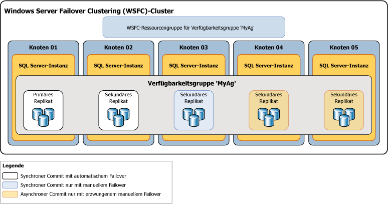

# Verfügbarkeitsmodi (Always On-Verfügbarkeitsgruppen)
[!INCLUDE[appliesto-ss-xxxx-xxxx-xxx-md](../../../includes/appliesto-ss-xxxx-xxxx-xxx-md.md)]

  In [!INCLUDE[ssHADR](../../../includes/sshadr-md.md)]ist der *Verfügbarkeitsmodus* eine Replikateigenschaft, die bestimmt, ob ein angegebenes Verfügbarkeitsreplikat im Modus für synchrone Commits ausgeführt werden kann. Für jedes Verfügbarkeitsreplikat muss für den Verfügbarkeitsmodus entweder der synchrone Commit-, der asynchroner Commit- oder der reine Konfigurationsmodus konfiguriert werden.  Wenn das primäre Replikat für den *Modus für asynchrone Commits*konfiguriert wird, wartet es nicht, bis ein sekundäres Replikat eingehende Transaktionsprotokoll-Datensätze auf den Datenträger geschrieben hat ( *Protokoll festschreiben*). Wenn ein bestimmtes sekundäres Replikat für den Modus für asynchrone Commits konfiguriert ist, wartet das primäre Replikat nicht, bis das betreffende sekundäre Replikat das Protokoll festgeschrieben hat. Wenn sowohl das primäre Replikat als auch ein angegebenes sekundäres Replikat für den *Modus für synchrone Commits*konfiguriert sind, wartet das primäre Replikat, bis das sekundäre Replikat bestätigt, dass es das Protokoll festgeschrieben hat (es sei denn, das sekundäre Replikat konnte innerhalb des *Sitzungstimeouts*für das primäre Replikat keinen Ping-Befehl an dieses senden). 
  

> [!NOTE]  
>  Wenn das Sitzungstimeout des primären Replikats von einem sekundären Replikat überschritten wird, wechselt das primäre Replikat für das betreffende sekundäre Replikat vorübergehend in den Modus für asynchrone Commits. Wenn das sekundäre Replikat erneut eine Verbindung mit dem primären Replikat herstellt, wird der Modus für synchrone Commits wieder aufgenommen.  
  
 **In diesem Thema:**  
  
-   [Unterstützte Verfügbarkeitsmodi](#SupportedAvModes)  
  
-   [Asynchronous-Commit Availability Mode](#AsyncCommitAvMode)  
  
-   [Synchronous-Commit Availability Mode](#SyncCommitAvMode)  
  
-   [Verwandte Aufgaben](#RelatedTasks)  
  
-   [Verwandte Inhalte](#RelatedContent)  
  
##   Unterstützte Verfügbarkeitsmodi  
 [!INCLUDE[ssHADR](../../../includes/sshadr-md.md)] unterstützt drei Verfügbarkeitsmodi (Modus für asynchrone und synchrone Commits sowie reine Konfiguration) wie folgt:  
  
-   *Der Modus für asynchrone Commits* ist eine Wiederherstellungslösung für Notfälle, die gut funktioniert, wenn die Verfügbarkeitsreplikate über weite Entfernungen verteilt sind. Wenn jedes sekundäre Replikat im Modus für asynchrone Commits ausgeführt wird, wartet das primäre Replikat nicht, bis ein sekundäres Replikat das Protokoll festschreibt. Stattdessen sendet das primäre Replikat die Transaktionsbestätigung, unmittelbar nachdem es einen Protokolldatensatz in die lokale Protokolldatei geschrieben hat, an den Client. Das primäre Replikat wird mit minimaler Transaktionswartezeit bezogen auf ein sekundäres Replikat ausgeführt, das für den Modus für asynchrone Commits konfiguriert wurde.  Wenn das aktuelle primäre Replikat für den Verfügbarkeitsmodus "Asynchroner Commit" konfiguriert ist, führt es für alle sekundären Replikate, unabhängig von deren Verfügbarkeitsmoduseinstellungen, asynchron ein Commit für Transaktionen aus.  
  
     Weitere Informationen finden Sie weiter unten in diesem Thema unter [Verfügbarkeitsmodus "Asynchroner Commit"](#AsyncCommitAvMode).  
  
-   Im*Modus für synchrone Commits* hat Hochverfügbarkeit Vorrang vor Leistung, und dies hat eine größere Transaktionswartezeit zur Folge. Im Modus für synchrone Commits wird mit dem Senden der Transaktionsbestätigung an den Client gewartet, bis das sekundäre Replikat das Protokoll auf dem Datenträger festgeschrieben hat. Wenn die Datensynchronisierung für eine sekundäre Datenbank beginnt, fängt das sekundäre Replikat an, eingehende Protokolldatensätze von der entsprechenden primären Datenbank zu übernehmen. Sobald alle Protokolldatensätze festgeschrieben wurden, wechselt die sekundäre Datenbank in den Status SYNCHRONIZED. Anschließend wird jede neue Transaktion vom sekundären Replikat festgeschrieben, bevor der Protokolleintrag in die lokale Protokolldatei geschrieben wird. Wenn alle sekundären Datenbanken eines gegebenen sekundären Replikats synchronisiert worden sind, unterstützt der Modus für synchrone Commits manuelles Failover und optional automatisches Failover.  
  
     Weitere Informationen finden Sie weiter unten in diesem Thema unter [Verfügbarkeitsmodus "Synchroner Commit"](#SyncCommitAvMode).  

-   Der *reine Konfigurationsmodus* ist für Verfügbarkeitsgruppen verfügbar, die sich nicht in einem Windows Server-Failovercluster befinden. Ein Replikat im reinen Konfigurationsmodus enthält keine Benutzerdaten. In diesem Modus speichert die Masterdatenbank des Replikats Konfigurationsmetadaten von Verfügbarkeitsgruppen. Weitere Informationen finden Sie unter [Verfügbarkeitsgruppe mit dem reinen Konfigurationsreplikat](../../../linux/sql-server-linux-availability-group-ha.md).
  
 In der folgenden Abbildung wird eine Verfügbarkeitsgruppe mit fünf Verfügbarkeitsreplikaten angezeigt. Das primäre Replikat und ein sekundäres Replikat sind für den Modus für synchrone Commits mit automatischem Failover konfiguriert. Ein weiteres sekundäres Replikat ist für den Modus für synchrone Commits ausschließlich mit geplantem manuellen Failover konfiguriert, und zwei sekundäre Replikate sind für den Modus für asynchrone Commits konfiguriert, der nur erzwungene manuelle Failover (normalerweise als *erzwungene Failover*bezeichnet) unterstützt.  
  
   
  
 Das Synchronisierungs- und Failoververhalten zwischen zwei Verfügbarkeitsreplikaten hängt vom Verfügbarkeitsmodus beider Replikate ab. Beispiel: Damit ein synchroner Commit ausgeführt werden kann, muss sowohl das aktuelle primäre Replikat als auch das entsprechende sekundäre Replikat für synchrone Commits konfiguriert sein. Das Gleiche gilt für automatische Failover, weil beide Replikate in diesem Fall für automatische Failover konfiguriert sein müssen. Das Verhalten des oben beschriebenen Bereitstellungsszenarios ist in der folgenden Tabelle zusammengefasst, die das Verhalten je nach verwendetem primären Replikat aufschlüsselt:  
  
|Aktuelles primäres Replikat|Automatische Failoverziele|Modus für synchrone Commits bei|Modus für asynchrone Commits bei|Automatisches Failover möglich|  
|-----------------------------|--------------------------------|--------------------------------------------|---------------------------------------------|---------------------------------|  
|01|02|02 und 03|04|ja|  
|02|01|01 und 03|04|ja|  
|03||01 und 02|04|nein|  
|04|||01, 02 und 03|nein|  
  
 Normalerweise wird Knoten 04 als Replikat mit asynchronem Commit an einem Standort für die Notfallwiederherstellung bereitgestellt. Die Tatsache, dass die Knoten 01, 02 und 03 nach einem Failover auf Knoten 04 im Modus für asynchrone Commits verbleiben, hilft, einen Leistungsabfall in der Verfügbarkeitsgruppe zu vermeiden, der infolge einer hohen Netzwerklatenz zwischen den beiden Standorten auftritt.  
  
##   Asynchronous-Commit Availability Mode  
 Im *Modus für asynchrone Commits*wird das sekundäre Replikat nie mit dem primären Replikat synchronisiert. Obwohl eine gegebene sekundäre Datenbank den gleichen Datenbestand wie eine entsprechende primäre Datenbank aufweisen kann, kann der Datenbestand jeder sekundären Datenbank jederzeit älter sein. Der Modus für asynchrone Commits kann in einem Notfallwiederherstellungsszenario nützlich sein, in dem das primäre Replikat und das sekundäre Replikat räumlich weit voneinander getrennt sind und in dem sich kleine Fehler nicht auf das primäre Replikat auswirken sollen, oder in Situationen, in denen die Leistung wichtiger als der Schutz der synchronisierten Daten ist. Zudem ist vorteilhaft, dass sich Probleme mit dem sekundären Replikat nie auf das primäre Replikat auswirken, weil das primäre Replikat nicht auf die Bestätigungen des sekundären Replikats wartet.  
  
 Das sekundäre Replikat im Modus für asynchrone Commits versucht, mit den vom primären Replikat empfangenen Protokolldatensätzen Schritt zu halten. Im Modus für asynchrone Commits bleiben sekundäre Datenbanken jedoch stets unsynchronisiert und weisen meist einen älteren Datenbestand als die zugehörigen primären Datenbanken auf. In der Regel ist die Lücke zwischen einer sekundären Datenbank mit asynchronem Commit und der entsprechenden primären Datenbank klein. Doch kann sich die Lücke erheblich vergrößern, wenn der Server, der das sekundäre Replikat hostet, überlastet oder das Netzwerk langsam ist.  
  
 Im Modus für asynchrone Commits wird lediglich ein erzwungenes manuelles Failover (mit möglichem Datenverlust) unterstützt. Das erzwungene Failover ist lediglich als letztes Mittel für Situationen vorgesehen, in denen das aktuelle primäre Replikat über einen längeren Zeitraum nicht verfügbar ist und die sofortige Verfügbarkeit der primären Datenbanken wichtiger ist als das Risiko eines möglichen Datenverlusts. Das Failoverziel muss ein Replikat sein, dessen Rolle im SECONDARY oder RESOLVING-Status ist. Das Failoverziel wechselt in die primäre Rolle, und seine Datenbankkopien werden zur primären Datenbank. Sämtliche verbleibenden sekundären Datenbanken werden zusammen mit den bisherigen primären Datenbanken, sobald diese verfügbar werden, angehalten, bis Sie sie einzeln manuell fortsetzen. Unter dem Modus für asynchrone Commits gehen alle Transaktionsprotokolle verloren, die das ursprüngliche primäre Replikat noch nicht an das frühere sekundäre Replikat gesendet hatte. Dies bedeutet, dass in den neuen primären Datenbanken möglicherweise einige oder alle Transaktion fehlen, für die kürzlich ein Commit ausgeführt wurde. Weitere Informationen zur Funktionsweise des erzwungenen Failovers und bewährte Methoden zu dessen Verwendung finden Sie unter [Failover und Failovermodi &#40;Always On-Verfügbarkeitsgruppen&#41;](../../../database-engine/availability-groups/windows/failover-and-failover-modes-always-on-availability-groups.md).  
  
##   Synchronous-Commit Availability Mode  
 Im Verfügbarkeitsmodus mit synchronem Commit (*Modus für synchrone Commits*) wird jede sekundäre Datenbank, sobald sie einer Verfügbarkeitsgruppe zugeordnet wurde, so schnell wie möglich auf den Stand der entsprechenden primären Datenbank gebracht und wechselt in den Status SYNCHRONIZED. Die sekundäre Datenbank verbleibt so lange im Status SYNCHRONIZED, bis die Datensynchronisierung fortgesetzt wird. Damit wird sichergestellt, dass für jede Transaktion, für die auf einer bestimmten primären Datenbank ein Commit ausgeführt wird, auch auf der neuen sekundären Datenbank ein Commit ausgeführt wurde. Wenn jede sekundäre Datenbank für ein bestimmtes sekundäres Replikat synchronisiert wurde, wird der Synchronisierungsstatus des sekundären Replikats insgesamt auf den Status HEALTHY festgelegt.  
  
 **In diesem Abschnitt:**  
  
-   [Faktoren, die die Datensynchronisierung stören](#DisruptSync)  
  
-   [Wie die Synchronisierung bei einem sekundären Replikat funktioniert](#HowSyncWorks)  
  
-   [Modus für synchrone Commits ausschließlich mit manuellem Failover](#SyncCommitWithManual)  
  
-   [Modus für synchrone Commits mit automatischem Failover](#SyncCommitWithAuto)  
  
###   Faktoren, die die Datensynchronisierung stören  
 Nachdem alle Datenbanken synchronisiert wurden, wechselt ein sekundäres Replikat in den Status HEALTHY. Das synchronisierte sekundäre Replikat verbleibt so lange im Status HEALTHY, bis eine der folgenden Situationen eintritt:  
  
-   Eine Verzögerung oder eine Störung im Netzwerk oder auf dem Computer führt dazu, dass für die Sitzung zwischen dem sekundären und dem primären Replikat ein Timeout auftritt.  
  
    > [!NOTE]  
    >  Informationen über die Sitzungstimeout-Eigenschaft von Verfügbarkeitskeplikaten finden Sie unter [Übersicht über Always On-Verfügbarkeitsgruppen &#40;SQL Server&#41;](../../../database-engine/availability-groups/windows/overview-of-always-on-availability-groups-sql-server.md).  
  
-   Eine sekundäre Datenbank auf dem sekundären Replikat wird angehalten. Das sekundäre Replikat wird nicht mehr synchronisiert, und der Synchronisierungsstatus wird als NOT_HEALTHY angegeben. Das sekundäre Replikat kann erst dann wieder fehlerfrei werden, wenn die angehaltene sekundäre Datenbank entweder fortgesetzt und erneut synchronisiert bzw. aus der Verfügbarkeitsgruppe entfernt wurde.  
  
-   Sie fügen der Verfügbarkeitsgruppe eine primäre Datenbank hinzu. Zuvor synchronisierte sekundäre Replikate wechseln in den Synchronisierungsstatus NOT_HEALTHY. Dieser Status gibt an, dass sich mindestens eine Datenbank im Synchronisierungsstatus NOT SYNCHRONIZING befindet. Ein bestimmtes sekundäres Replikat kann erst dann wieder in den Status HEALTHY wechseln, nachdem eine entsprechende sekundäre Datenbank für das Replikat vorbereitet, mit der Verfügbarkeitsgruppe verknüpft und mit der neuen primären Datenbank synchronisiert wurde.  
  
-   Sie ändern das primäre Replikat oder das sekundäre Replikat in den Verfügbarkeitsmodus mit asynchronem Commit. Nachdem der Modus für asynchrone Commits aktiviert wurde, verbleibt das sekundäre Replikat so lange im Synchronisierungsstatus HEALTHY, bis die Datensynchronisierung fortgesetzt wird. Wenn jedoch nur das primäre Replikat in den Modus für asynchrone Commits geändert wird, wechselt das sekundäre Replikat mit synchronem Commit in den Synchronisierungsstatus PARTIALLY_HEALTHY. Dieser Status zeigt an, dass sich mindestens eine Datenbank im Synchronisierungsstatus SYNCHRONIZING, jedoch keine der Datenbanken im Status NOT SYNCHRONIZING befindet.  
  
-   Sie ändern alle sekundäre Replikate, indem Sie sie in den Verfügbarkeitsmodus mit synchronem Commit versetzen. Dies bewirkt, dass das sekundäre Replikat mit dem Synchronisierungsstatus PARTIALLY_HEALTHY gekennzeichnet wird. bis sich alle zugehörigen Datenbanken im Synchronisierungsstatus SYNCHRONIZED befinden.  
  
> [!TIP]  
>  Fragen Sie die **synchronization_health** - oder **synchronization_health_desc** -Spalte von [sys.dm_hadr_availability_group_states](../../../relational-databases/system-dynamic-management-views/sys-dm-hadr-availability-group-states-transact-sql.md), [sys.dm_hadr_availability_replica_states](../../../relational-databases/system-dynamic-management-views/sys-dm-hadr-availability-replica-states-transact-sql.md)oder [sys.dm_hadr_database_replica_states](../../../relational-databases/system-dynamic-management-views/sys-dm-hadr-database-replica-states-transact-sql.md)ab, um den Synchronisierungsstatus einer Verfügbarkeitsgruppe, eines Verfügbarkeitsreplikats oder einer Verfügbarkeitsdatenbank anzuzeigen.  
  
###   Wie die Synchronisierung bei einem sekundären Replikat funktioniert  
 Nachdem im Modus für synchrone Commits ein sekundäres Replikat mit der Verfügbarkeitsgruppe verknüpft und eine Sitzung mit dem primären Replikat eingerichtet wurde, schreibt das sekundäre Replikat eingehende Protokolldatensätze auf den Datenträger (*schreibt das Protokoll fest*) und sendet eine Bestätigungsmeldung an das primäre Replikat. Sobald das festgeschriebene Protokoll auf der sekundären Datenbank das Ende des Protokolls auf der primären Datenbank erreicht hat, wird der Status der sekundären Datenbank auf SYNCHRONIZED festgelegt. Wie viel Zeit für die Synchronisierung benötigt wird, hängt in hohem Maße davon ab, wie weit die sekundäre Datenbank zu Beginn der Sitzung gegenüber der primären Datenbank zurücklag (gemessen an der Anzahl der Protokolldatensätze, die anfänglich vom primären Replikat empfangen wurden), sowie von der Arbeitslast der primären Datenbank und der Geschwindigkeit des Computers der Serverinstanz, die als Host für das sekundäre Replikat fungiert.  
  
 Die synchrone Operation wird wie folgt beibehalten:  
  
1.  Sobald eine Transaktion von einem Client empfangen wird, wird der Protokolleintrag für die Transaktion vom primären Replikat in das Transaktionsprotokoll geschrieben und der Protokolldatensatz gleichzeitig an die sekundären Replikate gesendet.  
  
2.  Sobald ein Protokolldatensatz in das Transaktionsprotokoll der primären Datenbank geschrieben wird, kann die Transaktion nur rückgängig gemacht werden, wenn zu diesem Zeitpunkt ein Failover für die sekundäre Datenbank ausgeführt wird, von der das Protokoll nicht empfangen wurde. Das primäre Replikat wartet auf die Bestätigung des sekundären Replikats mit synchronem Commit.  
  
3.  Das sekundäre Replikat schreibt das Protokoll auf den Datenträger und gibt eine Bestätigung an das primäre Replikat zurück.  
  
4.  Sobald das primäre Replikat die Bestätigung vom sekundären Replikat empfängt, beendet es die Commitverarbeitung und sendet eine Bestätigungsmeldung an den Client.  
  
    > [!NOTE]  
    >  Wenn ein Timeout für ein sekundäres Replikat mit synchronem Commit auftritt, ohne dass das Festschreiben des Protokolls bestätigt wird, kennzeichnet das primäre Replikat dieses sekundäre Replikat als fehlerhaft. Der Verbindungsstatus des sekundären Replikats ändert sich in DISCONNECTED, und das primäre Replikat wartet nicht mehr auf die Bestätigung des sekundären Replikats. Durch dieses Verhalten wird sichergestellt, dass das Festschreiben des Transaktionsprotokolls auf dem primären Replikat nicht vom sekundären Replikat mit fehlgeschlagenem synchronen Commit verhindert wird.  
  
 Im Modus für synchrone Commits werden die Daten dadurch geschützt, dass die an zwei Stellen vorhandenen Daten synchronisiert werden müssen. Dies hat allerdings eine etwas höhere Wartezeit für die Transaktion zur Folge.  
  
###  Modus für synchrone Commits ausschließlich mit manuellem Failover  
 Wenn diese Replikate verbunden sind und die Datenbank synchronisiert ist, wird das manuelle Failover unterstützt. Ein Ausfall des sekundären Replikats wirkt sich nicht auf das primäre Replikat aus. Das primäre Replikat wird ungeschützt ausgeführt, wenn keine Replikate mit dem Status SYNCHRONIZED vorhanden sind (das heißt, ohne Daten an ein sekundäres Replikat zu senden). Wenn das primäre Replikat verloren geht, wechseln die sekundären Replikate in den Status RESOLVING, aber der Datenbankbesitzer kann ein Failover zum sekundären Replikat (mit möglichem Datenverlust) erzwingen. Weitere Informationen finden Sie weiter unten in diesem Thema unter [Failover und Failovermodi &#40;Always On-Verfügbarkeitsgruppen&#41;](../../../database-engine/availability-groups/windows/failover-and-failover-modes-always-on-availability-groups.md).  
  
###   Modus für synchrone Commits mit automatischem Failover  
 Das automatische Failover bietet eine hohe Verfügbarkeit, indem sichergestellt wird, dass die Datenbank nach dem Ausfall des primären Replikats schnell wieder verfügbar gemacht wird. Um eine Verfügbarkeitsgruppe für ein automatisches Failover zu konfigurieren, müssen Sie sowohl das aktuelle primäre Replikat als auch mindestens ein sekundäres Replikat für den Modus für synchrone Commits mit automatischem Failover festlegen. Sie können bis zu drei Replikate für automatisches Failover haben.  
  
 Damit ein automatisches Failover innerhalb einer bestimmten Zeit ausgeführt werden kann, muss dieses sekundäre Replikat darüber hinaus mit dem primären Replikat synchronisiert werden (Synchronisierung aller sekundären Datenbanken), und der WSFC (Windows Server Failover Clustering)-Cluster muss über ein Quorum verfügen. Wenn das primäre Replikat unter diesen Bedingungen ausfällt, findet ein automatisches Failover statt. Das sekundäre Replikat wechselt in die Rolle des primären Replikats und bietet seine Datenbank als primäre Datenbank an. Weitere Informationen finden Sie im Abschnitt „Automatisches Failover“ des Themas [Failover und Failovermodi &#40;Always On-Verfügbarkeitsgruppen&#41;](../../../database-engine/availability-groups/windows/failover-and-failover-modes-always-on-availability-groups.md).  
  
> [!NOTE]  
>  Informationen zu WSFC-Quorum und [!INCLUDE[ssHADR](../../../includes/sshadr-md.md)] finden Sie unter [WSFC-Quorummodi und Abstimmungskonfiguration &#40;SQL Server&#41;](../../../sql-server/failover-clusters/windows/wsfc-quorum-modes-and-voting-configuration-sql-server.md).  
  
##   Verwandte Aufgaben  
 **So ändern Sie den Verfügbarkeitsmodus und Failovermodus**  
  
-   [Ändern des Verfügbarkeitsmodus eines Verfügbarkeitsreplikats &#40;SQL Server&#41;](../../../database-engine/availability-groups/windows/change-the-availability-mode-of-an-availability-replica-sql-server.md)  
  
-   [Ändern des Failovermodus eines Verfügbarkeitsreplikats &#40;SQL Server&#41;](../../../database-engine/availability-groups/windows/change-the-failover-mode-of-an-availability-replica-sql-server.md)  
  
 **So passen Sie Quorumsstimmen an**  
  
-   [Anzeigen von Cluster-Quorum-NodeWeight-Einstellungen](../../../sql-server/failover-clusters/windows/view-cluster-quorum-nodeweight-settings.md)  
  
-   [Konfigurieren von Cluster-Quorum-NodeWeight-Einstellungen](../../../sql-server/failover-clusters/windows/configure-cluster-quorum-nodeweight-settings.md)  
  
-   [Erzwingen des Starts eines Clusters ohne Quorum](../../../sql-server/failover-clusters/windows/force-a-wsfc-cluster-to-start-without-a-quorum.md)  
  
 **So führen Sie ein manuelles Failover aus**  
  
-   [Ausführen eines geplanten manuellen Failovers einer Verfügbarkeitsgruppe &#40;SQL Server&#41;](../../../database-engine/availability-groups/windows/perform-a-planned-manual-failover-of-an-availability-group-sql-server.md)  
  
-   [Ausführen eines erzwungenen manuellen Failovers einer Verfügbarkeitsgruppe &#40;SQL Server&#41;](../../../database-engine/availability-groups/windows/perform-a-forced-manual-failover-of-an-availability-group-sql-server.md)  
  
-   [Verwenden des Assistenten für Failover-Verfügbarkeitsgruppen &#40;SQL Server Management Studio&#41;](../../../database-engine/availability-groups/windows/use-the-fail-over-availability-group-wizard-sql-server-management-studio.md)  
  
 **So zeigen Sie Verfügbarkeitsgruppe, Verfügbarkeitsreplikat und Datenbankstatus an**  
  
-   [sys.dm_hadr_availability_group_states &#40;Transact-SQL&#41;](../../../relational-databases/system-dynamic-management-views/sys-dm-hadr-availability-group-states-transact-sql.md)  
  
-   [sys.dm_hadr_availability_replica_states &#40;Transact-SQL&#41;](../../../relational-databases/system-dynamic-management-views/sys-dm-hadr-availability-replica-states-transact-sql.md)  
  
-   [sys.dm_hadr_database_replica_states &#40;Transact-SQL&#41;](../../../relational-databases/system-dynamic-management-views/sys-dm-hadr-database-replica-states-transact-sql.md)  
  
##   Verwandte Inhalte  
  
-   [Microsoft SQL Server Always On Solutions Guide for High Availability and Disaster Recovery (Microsoft SQL Server Always On-Lösungshandbuch zu hoher Verfügbarkeit und Notfallwiederherstellung)](http://go.microsoft.com/fwlink/?LinkId=227600)  
  
-   [SQL Server Always On-Teamblog: Der offizielle SQL Server Always On-Teamblog](https://blogs.msdn.microsoft.com/sqlalwayson/)  
  
## Weitere Informationen finden Sie unter  
 [Übersicht über AlwaysOn-Verfügbarkeitsgruppen &#40;SQL Server&#41;](../../../database-engine/availability-groups/windows/overview-of-always-on-availability-groups-sql-server.md)   
 [Failover und Failovermodi (Always On-Verfügbarkeitsgruppen)](../../../database-engine/availability-groups/windows/failover-and-failover-modes-always-on-availability-groups.md)   
 [Windows Server-Failoverclustering &#40;WSFC&#41; mit SQL Server](../../../sql-server/failover-clusters/windows/windows-server-failover-clustering-wsfc-with-sql-server.md)  
  
  
