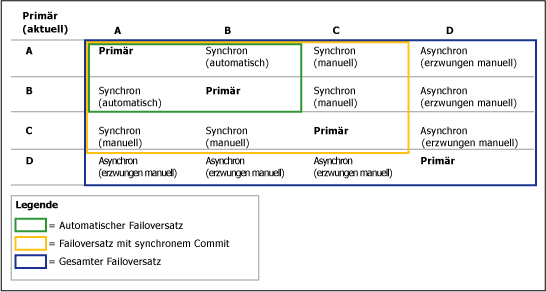
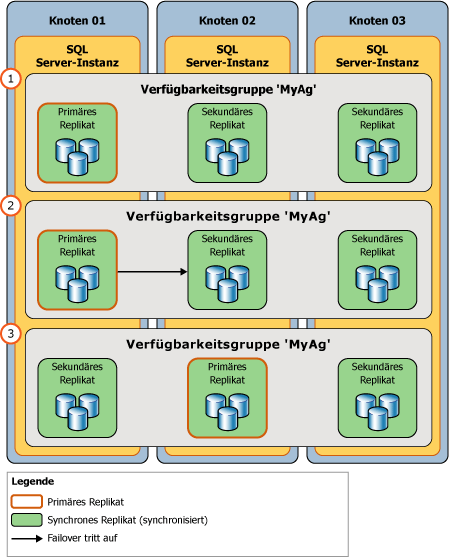

# Failover und Failovermodi (Always On-Verfügbarkeitsgruppen)
[!INCLUDE[tsql-appliesto-ss2016-xxxx-xxxx-xxx_md](../../../includes/tsql-appliesto-ss2016-xxxx-xxxx-xxx-md.md)]

  Im Kontext einer Verfügbarkeitsgruppe können die primäre und die sekundäre Rolle von Verfügbarkeitsreplikaten normalerweise im Rahmen des so genannten *Failovers*ausgetauscht werden. Failover können in drei Formen auftreten: automatisches Failover (ohne Datenverlust), geplantes manuelles Failover (ohne Datenverlust) und erzwungenes manuelles Failover (mit möglichem Datenverlust), welches in der Regel *erzwungenes Failover*genannt wird. Beim automatischen und geplanten manuellen Failover bleiben alle Daten erhalten. Eine Verfügbarkeitsgruppe führt ein Failover auf der Ebene des Verfügbarkeitsreplikats aus. Das heißt, eine Verfügbarkeitsgruppe führt ein Failover auf eines ihrer sekundären Replikate (das aktuelle *Failoverziel*) aus.  
  
> [!NOTE]  
>  Probleme auf Datenbankebene, z. B. wenn eine Datenbank aufgrund des Verlusts einer Datendatei fehlerverdächtig wird, eine Datenbank gelöscht oder ein Transaktionsprotokoll beschädigt wird, führen nicht zum Failover einer Verfügbarkeitsgruppe.  
  
 Während des Failovers übernimmt das Failoverziel die primäre Rolle, stellt die zugehörigen Datenbanken wieder her und schaltet sie als neue primäre Datenbanken online. Das frühere primäre Replikat (falls verfügbar) wechselt zur sekundären Rolle, und seine Datenbanken werden zu sekundären Datenbanken. Diese Rollen können in Reaktion auf wiederholte Fehler oder zu Verwaltungszwecken hin und her (bzw. zu einem anderen Failoverziel) gewechselt werden.  
  
 Die von den einzelnen Verfügbarkeitsreplikaten unterstützten Failoverformen werden von der Eigenschaft *Failovermodus* angegeben. Die für die einzelnen Verfügbarkeitsreplikate möglichen Failovermodi hängen wie folgt vom [Verfügbarkeitsmodus](../../../database-engine/availability-groups/windows/availability-modes-always-on-availability-groups.md) des Replikats ab:  
  
-   **Replikate mit synchronem Commit** unterstützen zwei Einstellungen – automatisch oder manuell. Die "automatische" Einstellung unterstützt sowohl automatisches Failover als auch manuelles Failover. Um Datenverluste zu vermeiden, muss das Failoverziel beim automatischen und geplanten Failover ein sekundäres Replikat mit synchronem Commit und fehlerfreiem Synchronisierungsstatus sein (was darauf hinweist, dass jede sekundäre Datenbank auf dem Failoverziel mit der entsprechenden primären Datenbank synchronisiert ist). Wenn ein sekundäres Replikat keine dieser Bedingungen erfüllt, unterstützt es stets nur ein erzwungenes Failover. Beachten Sie, dass erzwungene Failover auch von Replikaten unterstützt werden, deren Rolle sich im RESOLVING-Status befindet.  
  
-   **Replikate mit asynchronem Commit** unterstützen nur den manuellen Failovermodus. Da sie nie synchronisiert werden, unterstützen sie nur erzwungene Failover.  
  
> [!NOTE]  
>  Nach einem Failover müssen Clientanwendungen, die auf die primären Datenbanken zugreifen müssen, eine Verbindung mit dem neuen primären Replikat herstellen. Außerdem können schreibgeschützte Clientanwendungen, wenn das neue sekundäre Replikat für den schreibgeschützten Zugriff konfiguriert ist, eine Verbindung mit dem Replikat herstellen. Weitere Informationen dazu, wie Clients eine Verbindung zu Verfügbarkeitsgruppen herstellen, finden Sie unter [Verfügbarkeitsgruppenlistener, Clientkonnektivität und Anwendungsfailover &#40;SQL Server&#41;](../../../database-engine/availability-groups/windows/listeners-client-connectivity-application-failover.md).  
  
 **Abschnitte in diesem Thema:**  
  
-   [Begriffe und Definitionen](#TermsAndDefinitions)  
  
-   [Übersicht über Failover](#Overview)  
  
-   [Automatisches Failover](#AutomaticFailover)  
  
-   [Geplantes manuelles Failover (ohne Datenverlust)](#ManualFailover)  
  
-   [Erzwungenes Failover (mit möglichem Datenverlust)](#ForcedFailover)  
  
-   [Verwandte Aufgaben](#RelatedTasks)  
  
-   [Verwandte Inhalte](#RelatedContent)  
  
##   Begriffe und Definitionen  
 Automatisches Failover  
 Beim Verlust des primären Replikats tritt automatisch ein Failover statt. Automatisches Failover wird nur unterstützt, wenn das aktuelle primäre Replikat und ein sekundäres Replikat so konfiguriert sind, dass der Failovermodus auf AUTOMATIC festgelegt ist und das sekundäre Replikat derzeit synchronisiert wird.  Wenn der Failovermodus entweder des primären oder des sekundären Replikats MANUAL ist, kann kein automatisches Failover auftreten.  
  
 Geplantes manuelles Failover (ohne Datenverlust)  
 Ein geplantes manuelles Failover oder *manuelles Failover*ist ein Failover, das in der Regel von einem Datenbankadministrator zu administrativen Zwecken initiiert wird. Ein geplantes manuelles Failover wird nur unterstützt, wenn sowohl das primäre Replikat als auch das sekundäre Replikat für den Modus mit synchronem Commit konfiguriert sind und das sekundäre Replikat derzeit synchronisiert wird (im Status SYNCHRONIZED). Wenn das sekundäre Zielreplikat synchronisiert ist, ist ein manuelles Failover (ohne Datenverlust) selbst bei einem Absturz des primären Replikats möglich, da die sekundären Datenbanken für ein Failover bereit sind. Ein Datenbankadministrator initiiert manuell ein manuelles Failover.  
  
 Erzwungenes Failover (mit möglichem Datenverlust)  
 Ein Failover, das von einem Datenbankadministrator initiiert werden kann, wenn kein sekundäres Replikat mit dem primären Replikat SYNCHRONISIERT ist oder das primäre Replikat nicht ausgeführt wird und kein sekundäres Replikat für ein Failover bereit ist. Ein erzwungenes Failover birgt das Risiko möglicher Datenverluste und sollte nur für die Notfallwiederherstellung verwendet werden. Erzwungenes Failover ist auch als erzwungenes manuelles Failover bekannt, da es nur manuell initiiert werden kann. Dies ist der einzige Failovertyp, der im Verfügbarkeitsmodus für asynchrone Commits unterstützt wird.  
  
 [!INCLUDE[ssFosAutoC](../../../includes/ssfosautoc-md.md)]  
 Ein Paar von Verfügbarkeitsreplikaten (einschließlich des aktuellen primären Replikats) in einer Verfügbarkeitsgruppe, die für den synchronem Commitmodus mit automatischem Failover konfiguriert sind (sofern zutreffend). Ein[!INCLUDE[ssFosAuto](../../../includes/ssfosauto-md.md)]ist nur wirksam, wenn das sekundäre Replikat derzeit mit dem primären Replikat SYNCHRONISIERT wird.  
  
 [!INCLUDE[ssFosSyncC](../../../includes/ssfossyncc-md.md)]  
 Ein Satz von zwei oder drei Verfügbarkeitsreplikaten (einschließlich des aktuellen primären Replikats) in einer Verfügbarkeitsgruppe, die für den synchronen Commitmodus (falls zutreffend) konfiguriert sind. Ein [!INCLUDE[ssFosSync](../../../includes/ssfossync-md.md)]wird nur wirksam, wenn die sekundären Replikate für den manuellen Failovermodus konfiguriert sind und mindestens ein sekundäres Replikat derzeit mit dem primären Replikat SYNCHRONISIERT ist.  
  
 [!INCLUDE[ssFosEntireC](../../../includes/ssfosentirec-md.md)]  
 Innerhalb einer angegebenen Verfügbarkeitsgruppe der Satz aller Verfügbarkeitsreplikate, deren Betriebszustand gerade ONLINE ist, unabhängig vom Verfügbarkeitsmodus und Failovermodus. Der [!INCLUDE[ssFosEntire](../../../includes/ssfosentire-md.md)]wird relevant, wenn gerade kein sekundäres Replikat mit dem primären Replikat SYNCHRONISIERT wird.  
  
##   Übersicht über Failover  
 In der folgenden Tabelle ist zusammengefasst, welche Failovertypen unter unterschiedlichen Verfügbarkeits- und Failovermodi unterstützt werden. Für jede Paarung ergibt sich der effektive Verfügbarkeitsmodus und Failovermodus aus der Schnittmenge der Modi des primären Replikats sowie der Modi eines oder mehrerer sekundärer Replikate.  
  
||Asynchroner Commit-Modus|Synchroner Commit-Modus mit manuellem Failovermodus|Synchroner Commit-Modus mit automatischem Failovermodus|  
|-|-------------------------------|---------------------------------------------------------|------------------------------------------------------------|  
|Automatisches Failover|Nein|Nein|ja|  
|Geplantes manuelles Failover|Nein|Ja|ja|  
|erzwungenes Failover|ja|ja|Ja**\***|  
  
 **\***Wenn Sie einen Befehl für ein erzwungenes Failover für ein synchronisiertes sekundäres Replikat ausgeben, verhält sich das sekundäre Replikat genauso wie bei einem manuellen Failover.  
  
 Die Zeitdauer, für die Datenbank während eines Failovers nicht verfügbar ist, hängt vom Failovertyp und seiner Ursache ab.  
  
> [!IMPORTANT]  
>  Um Clientverbindungen außer für eigenständige Datenbanken nach dem Failover zu unterstützen, müssen auf einer früheren primären Datenbank definierte Anmeldungen und Aufträge für die neue primäre Datenbank manuell neu erstellt werden. Weitere Informationen finden Sie unter [Verwaltung von Anmeldungen und Aufträgen für die Datenbanken einer Verfügbarkeitsgruppe &#40;SQL Server&#41;](../../../database-engine/availability-groups/windows/logins-and-jobs-for-availability-group-databases.md)ausgetauscht werden.  
  
### Failoversätze  
 Welche Failoverarten für eine bestimmte Verfügbarkeitsgruppe möglich sind, richtet sich nach dem jeweiligen Failoversatz. Ein Failoversatz besteht aus dem primären Replikat und den sekundären Replikaten, die eine bestimmte, im Folgenden beschriebene Failoverart unterstützen:  
  
-   **[!INCLUDE[ssFosAutoC](../../../includes/ssfosautoc-md.md)] (optional):**  Ein Paar von Verfügbarkeitsreplikaten (einschließlich des aktuellen primären Replikats) in einer Verfügbarkeitsgruppe, die für den synchronen Commitmodus mit automatischem Failover (falls zutreffend) konfiguriert sind. Ein automatisches Failover ist nur wirksam, wenn das sekundäre Replikat derzeit mit dem primären Replikat synchronisiert wird.  
  
-   **[!INCLUDE[ssFosSyncC](../../../includes/ssfossyncc-md.md)] (optional):**  Ein Satz von zwei oder drei Verfügbarkeitsreplikaten (einschließlich des aktuellen primären Replikats) in einer Verfügbarkeitsgruppe, die für den synchronen Commitmodus (falls zutreffend) konfiguriert sind. Ein Failover mit synchronem Commit ist nur wirksam, wenn die sekundären Replikate für den manuellen Failovermodus konfiguriert sind und mindestens ein sekundäres Replikat derzeit mit dem primären Replikat synchronisiert wird.  
  
-   **[!INCLUDE[ssFosEntireC](../../../includes/ssfosentirec-md.md)] :**  Der Satz aller Verfügbarkeitsreplikate in einer Verfügbarkeitsgruppe, deren Betriebszustand derzeit ONLINE lautet, unabhängig vom Verfügbarkeitsmodus und Failovermodus. Der Satz für gesamtes Failover wird relevant, wenn derzeit kein sekundäres Replikat mit dem primären Replikat synchronisiert wird.  
  
 Wenn Sie ein Verfügbarkeitsreplikat für synchrone Commits mit automatischem Failover konfigurieren, wird das Verfügbarkeitsreplikat Teil von [!INCLUDE[ssFosAuto](../../../includes/ssfosauto-md.md)]. Ob jedoch der Satz wirksam wird, hängt vom aktuellen primären Element ab. Die Failovertypen, die tatsächlich zu einem bestimmten Zeitpunkt möglich sind, hängen davon ab, welche Failoversätze aktuell wirksam sind.  
  
 Betrachten Sie z. B. eine Verfügbarkeitsgruppe mit vier Verfügbarkeitsreplikaten:  
  
|Replikat|Verfügbarkeitsmodus- und Failovermodus-Einstellungen|  
|-------------|--------------------------------------------------|  
|Ein|Synchroner Commit mit automatischem Failover|  
|B|Synchroner Commit mit automatischem Failover|  
|C|Synchroner Commit nur mit geplantem manuellem Failover|  
|D|Asynchroner Commit (nur mit erzwungenem Failover)|  
  
 Das Failoververhalten für jedes sekundäre Replikat hängt davon ab, welches Verfügbarkeitsreplikat gerade das primäre Replikat ist. Grundsätzlich ist für ein bestimmtes sekundäres Replikat das Failoververhalten der schlimmste Fall angesichts des aktuellen primären Replikats. In der folgenden Abbildung wird veranschaulicht, wie das Failoververhalten des sekundären Replikats in Abhängigkeit des aktuellen primären Replikats variiert und ob es für den asynchronen (nur mit erzwungenem Failover) oder den synchronen Commit-Modus (mit oder ohne manuellem Failover) konfiguriert ist.  
  
   
  
##   Automatic Failover  
 Ein automatisches Failover verursacht den automatischen Übergang eines qualifizierten sekundären Replikats zur primären Rolle, nachdem das primäre Replikat nicht mehr zur Verfügung steht. Ein automatisches Failover ist am besten geeignet, wenn der WSFC-Knoten, der das primäre Replikat hostet, lokal zum Knoten ist, der das sekundäre Replikat hostet. Das liegt daran, dass die Datensynchronisierung am besten bei niedrigen Nachrichtenlatenzzeiten zwischen Computern funktioniert und weil Clientverbindungen lokal hergestellt werden können.  
  
 **In diesem Abschnitt:**  
  
-   [Für ein automatisches Failover erforderliche Bedingungen](#RequiredConditions)  
  
-   [So funktioniert ein automatisches Failover](#HowAutoFoWorks)  
  
-   [So aktivieren Sie ein automatisches Failover](#EnableAutoFo)  
  
###   Für ein automatisches Failover erforderliche Bedingungen  
 Ein automatisches Failover tritt nur unter den folgenden Bedingungen auf:  
  
-   Ein Satz für automatische Failover ist vorhanden. Dieser Satz besteht aus einem primären und einem sekundären Replikat (dem *Ziel des automatischen Failovers*), die beide für den synchronen Commitmodus konfiguriert sind und auf ein automatisches Failover (AUTOMATIC) festgelegt sind. Wenn das primäre Replikat auf manuelle Failover (MANUAL) festgelegt ist, kann selbst dann kein automatisches Failover ausgeführt werden, wenn ein sekundäres Replikat auf ein automatisches Failover (AUTOMATIC) festgelegt ist.  
  
     Weitere Informationen finden Sie unter [Verfügbarkeitsmodi &#40;Always On-Verfügbarkeitsgruppen&#41;](../../../database-engine/availability-groups/windows/availability-modes-always-on-availability-groups.md)ausgetauscht werden.  
  
-   Das Ziel des automatischen Failovers weist einen fehlerfreien Synchronisierungsstatus auf (das heißt, dass jede sekundäre Datenbank im Failoverziel mit ihrer entsprechenden primären Datenbank synchronisiert wird).  
  
    > [!TIP]  
    >  Durch Always On-Verfügbarkeitsgruppen wird die Integrität beider Replikate in einem Satz für automatische Failover überwacht. Wenn eines der Replikate fehlerhaft ist, wird der Zustand der Verfügbarkeitsgruppe auf CRITICAL festgelegt. Wenn das sekundäre Replikat fehlerhaft ist, kann kein automatisches Failover ausgeführt werden, da das Ziel für das automatische Failover nicht verfügbar ist. Wenn das primäre Replikat fehlerhaft ist, wird für die Verfügbarkeitsgruppe ein Failover auf das sekundäre Replikat ausgeführt. Für das automatische Failover ist erst wieder ein Ziel verfügbar, nachdem das vorherige primäre Replikat online geschaltet wurde. Um für den unwahrscheinlichen Fall, dass ein Folgefehler auftritt, in beiden Situationen Verfügbarkeit zu gewährleisten, wird empfohlen, ein anderes sekundäres Replikat als Ziel für das automatische Failover zu konfigurieren.  
    >   
    >  Weitere Informationen finden Sie unter [Verwenden von Always On-Richtlinien zum Anzeigen des Zustands einer Verfügbarkeitsgruppe (SQL Server)](../../../database-engine/availability-groups/windows/use-always-on-policies-to-view-the-health-of-an-availability-group-sql-server.md) und [Ändern des Failovermodus eines Verfügbarkeitsreplikats (SQL Server)](../../../database-engine/availability-groups/windows/change-the-failover-mode-of-an-availability-replica-sql-server.md).  
  
-   Der WSFC-Cluster (Windows Server Failover Clustering) verfügt über ein Quorum. Weitere Informationen finden Sie unter [WSFC-Quorummodi und Abstimmungskonfiguration &#40;SQL Server&#41;](../../../sql-server/failover-clusters/windows/wsfc-quorum-modes-and-voting-configuration-sql-server.md).  
  
-   Das primäre Replikat steht nicht mehr zur Verfügung, und die durch die flexible Failoverrichtlinie definierten Failover-Bedingungsebenen wurden erfüllt. Informationen zu Failover-Bedingungsebenen finden Sie unter [Flexible Failoverrichtlinie für automatisches Failover einer Verfügbarkeitsgruppe &#40;SQL Server&#41;](../../../database-engine/availability-groups/windows/flexible-automatic-failover-policy-availability-group.md)ausgetauscht werden.  
  
###   So funktioniert ein automatisches Failover  
 Durch ein automatisches Failover wird die folgende Aktionskette ausgelöst:  
  
1.  Wenn die Serverinstanz, die das aktuelle primäre Replikat hostet, immer noch ausgeführt wird, ändert sie den Status der primären Datenbanken in DISCONNECTED und trennt alle Clientverbindungen.  
  
2.  Wenn Protokolldatensätze in Wiederherstellungswarteschlangen auf dem sekundären Zielreplikat warten, wendet das sekundäre Replikat die verbleibenden Protokolldatensätze an, um das Rollforward der sekundären Datenbanken fertig zu stellen.  
  
    > [!NOTE]  
    >  Die zum Anwenden des Protokolls auf eine bestimmte Datenbank erforderliche Zeit hängt von der Systemgeschwindigkeit, der aktuellen Arbeitsauslastung und der Menge an Protokollen in der Wiederherstellungswarteschlange ab.  
  
3.  Das frühere sekundäre Replikat geht in die primäre Rolle über. Seine Datenbanken werden die primären Datenbanken. Das neue primäre Replikat führt so schnell wie möglich ein Rollback für alle Transaktionen aus, für die kein Commit ausgeführt wurde (die Rollbackphase der Wiederherstellung). Diese Transaktionen, für die kein Commit ausgeführt wurde, werden durch Sperren isoliert und ermöglichen ein Rollback im Hintergrund, während Clients die Datenbank verwenden. Für Transaktionen, für die ein Commit ausgeführt wurde, wird dabei kein Rollback durchgeführt.  
  
     Bis eine angegebene sekundäre Datenbank verbunden wird, ist sie kurzfristig als NOT_SYNCHRONIZED markiert. Bevor die Rollbackwiederherstellung gestartet wird, können sekundäre Datenbanken eine Verbindung mit den neuen primären Datenbanken herstellen und schnell in den Status SYNCHRONIZED übergehen. Der Idealfall für ein drittes Replikat mit synchronem Commit besteht normalerweise darin, dass das Replikat nach dem Failover in der sekundären Rolle verbleibt.  
  
4.  Später, wenn die Serverinstanz, die das frühere primäre Replikat hostet, neu gestartet wird, erkennt sie, dass jetzt ein anderes Verfügbarkeitsreplikat die primäre Rolle besitzt. Das frühere primäre Replikat geht in die sekundäre Rolle über, und seine Datenbanken werden sekundäre Datenbanken. Das neue sekundäre Replikat stellt eine Verbindung mit dem aktuellen primären Replikat her und fängt seine Datenbank so schnell wie möglich bis zu den aktuellen primären Datenbanken ab. Sobald das neue sekundäre Replikat seine Datenbanken erneut synchronisiert hat, ist ein neues Failover in umgekehrter Richtung möglich.  
  
###   So konfigurieren Sie ein automatisches Failover  
 Ein Verfügbarkeitsreplikat kann konfiguriert werden, um ein automatisches Failover jederzeit zu unterstützen.  
  
 **To configure automatic failover**  
  
1.  Stellen Sie sicher, dass das sekundäre Replikat konfiguriert ist, um den Verfügbarkeitsmodus mit synchronem Commit zu verwenden. Weitere Informationen finden Sie unter [Ändern des Verfügbarkeitsmodus eines Verfügbarkeitsreplikats &#40;SQL Server&#41;](../../../database-engine/availability-groups/windows/change-the-availability-mode-of-an-availability-replica-sql-server.md)ausgetauscht werden.  
  
2.  Legen Sie den Failovermodus auf automatisch fest. Weitere Informationen finden Sie unter [Ändern des Failovermodus eines Verfügbarkeitsreplikats &#40;SQL Server&#41;](../../../database-engine/availability-groups/windows/change-the-failover-mode-of-an-availability-replica-sql-server.md)ausgetauscht werden.  
  
3.  Ändern Sie optional die flexible Failoverrichtlinie der Verfügbarkeitsgruppe, und geben Sie die Fehlerarten an, durch die ein automatisches Failover verursacht werden kann. Weitere Informationen finden Sie unter [Konfigurieren der flexiblen Failoverrichtlinie zum Steuern der Bedingungen für ein automatisches Failover &#40;Always On-Verfügbarkeitsgruppen&#41;](../../../database-engine/availability-groups/windows/configure-flexible-automatic-failover-policy.md) und [Failoverrichtlinie für Failoverclusterinstanzen](../../../sql-server/failover-clusters/windows/failover-policy-for-failover-cluster-instances.md)ausgetauscht werden.  
  
##   Geplantes manuelles Failover (ohne Datenverlust)  
 Bei einem manuellen Failover geht ein synchronisiertes sekundäres Replikat zur primären Rolle über, nachdem ein Datenbankadministrator einen Befehl für ein manuelles Failover auf der Serverinstanz ausgibt, die das sekundäre Zielreplikat hostet. Zur Unterstützung eines manuellen Failovers müssen das sekundäre Replikat und das aktuelle primäre Replikat für den synchronen Commitmodus (falls zutreffend) konfiguriert sein. Jede sekundäre Datenbank auf dem Verfügbarkeitsreplikat muss mit der Verfügbarkeitsgruppe verknüpft und mit der entsprechenden primären Datenbank synchronisiert werden (d. h., das sekundäre Replikat muss synchronisiert werden). Damit wird sichergestellt, dass ein Commit für jede Transaktion, für die ein Commit auf einer früheren primären Datenbank ausgeführt wurde, auch auf der neuen primären Datenbank ausgeführt wurde. Daher sind die neuen primären Datenbanken mit den alten primären Datenbanken identisch.  
  
 In der folgenden Abbildung werden die Phasen eines geplanten Failovers veranschaulicht:  
  
1.  Vor dem Failover wird das primäre Replikat von der Serverinstanz auf `Node01`gehostet.  
  
2.  Ein Datenbankadministrator initiiert ein geplantes Failover. Das Failoverziel ist das von der Serverinstanz auf `Node02`gehostete Verfügbarkeitsreplikat.  
  
3.  Das Failoverziel (auf `Node02`) wird zum neuen primären Replikat. Da dies ein geplantes Failover ist, wechselt das frühere primäre Replikat während des Failovers zur sekundären Rolle und schaltet die zugehörigen Datenbanken unmittelbar als sekundäre Datenbanken online.  
  
   
  
 **In diesem Abschnitt:**  
  
-   [Für ein manuelles Failover erforderliche Bedingungen](#ManualFailoverConditions)  
  
-   [So funktioniert ein manuelles Failover](#ManualFailoverHowWorks)  
  
-   [Aufrechterhalten der Verfügbarkeit während Upgrades](#ManualFailoverDuringUpgrades)  
  
###   Für ein manuelles Failover erforderliche Bedingungen  
 Um ein manuelles Failover zu unterstützen, muss das aktuelle primäre Replikat auf den Modus mit synchronem Commit festgelegt werden, und ein sekundäres Replikat muss folgende Bedingungen erfüllen:  
  
-   Konfiguriert für den Modus mit synchronem Commit.  
  
-   Derzeit mit dem primären Replikat synchronisiert.  
  
 Um ein Failover einer Verfügbarkeitsgruppe manuell auszuführen, müssen Sie mit dem sekundären Replikat verbunden sein, das das neue primäre Replikat wird.  
  
###   Funktionsweise eines geplanten manuellen Failovers  
 Ein geplantes manuelles Failover, das auf dem sekundären Zielreplikat initiiert werden muss, initiiert die folgende Aktionskette:  
  
1.  Um sicherzustellen, dass keine neuen Benutzertransaktionen auf den ursprünglichen primären Datenbanken auftreten, sendet der WSFC-Cluster eine Anforderung an das primäre Replikat, in den Offlinemodus zu wechseln.  
  
2.  Wenn ein Protokoll in die Wiederherstellungswarteschlange einer sekundären Datenbank wartet, stellt das sekundäre Replikat das Rollforward dieser sekundären Datenbank fertig. Die erforderliche Zeit hängt von der Systemgeschwindigkeit, der aktuellen Arbeitsauslastung und der Menge der Protokolle in der Wiederherstellungswarteschlange ab. Um die aktuelle Größe der Wiederherstellungswarteschlange festzustellen, verwenden Sie den Leistungsindikator **Recovery Queue** . Weitere Informationen finden Sie unter [SQL Server, Datenbankreplikat](../../../relational-databases/performance-monitor/sql-server-database-replica.md).  
  
    > [!NOTE]  
    >  Die Failoverzeit kann durch die Begrenzung der Größe der Wiederherstellungswarteschlange reguliert werden. Das führt allerdings möglicherweise zu einem langsameren primären Replikat, damit vom sekundären Replikat die Geschwindigkeit gehalten werden kann.  
  
3.  Das sekundäre Replikat wird das neue primäre Replikat, und das frühere primäre Replikat wird das neue sekundäre Replikat.  
  
4.  Das neue primäre Replikat führt für alle Transaktionen, für die noch kein Commit ausgeführt wurde, ein Rollback aus und schaltet seine Datenbanken als primären Datenbanken online. Alle sekundäre Datenbanken werden kurz als NICHT SYNCHRONISIERT markiert, bis sie eine Verbindung mit den neuen primären Datenbanken herstellen und damit synchronisiert werden können. Für Transaktionen, für die ein Commit ausgeführt wurde, wird dabei kein Rollback durchgeführt.  
  
5.  Wenn das frühere primäre Replikat wieder online geschaltet wird, nimmt es die sekundäre Rolle an, und die frühere primäre Datenbank wird zur sekundären Datenbank. Das neue sekundäre Replikat synchronisiert schnell die neuen sekundären Datenbanken erneut mit den entsprechenden primären Datenbanken.  
  
    > [!NOTE]  
    >  Sobald das neue sekundäre Replikat die Datenbanken erneut synchronisiert hat, ist ein neues Failover möglich, allerdings in umgekehrter Richtung.  
  
 Nach dem Failover müssen von Clients erneut Verbindungen mit der aktuellen primären Datenbank hergestellt werden. Weitere Informationen finden Sie unter [Verfügbarkeitsgruppenlistener, Clientkonnektivität und Anwendungsfailover &#40;SQL Server&#41;](../../../database-engine/availability-groups/windows/listeners-client-connectivity-application-failover.md)wichtig sind.  
  
###   Aufrechterhalten der Verfügbarkeit während Upgrades  
 Der Datenbankadministrator für die Verfügbarkeitsgruppen kann die Datenbankverfügbarkeit mithilfe von manuellen Failovers aufrechterhalten, wenn Sie Hardware oder Software aktualisieren. Um eine Verfügbarkeitsgruppe für Softwareupgrades zu verwenden, muss die Serverinstanz und/oder der Computerknoten, der das sekundäre Zielreplikat hostet, die Upgrades bereits empfangen haben. Weitere Informationen finden Sie unter [Upgraden von Always On-Verfügbarkeitsgruppen-Replikatsinstanzen](../../../database-engine/availability-groups/windows/upgrading-always-on-availability-group-replica-instances.md).  
  
##   Erzwungenes Failover (mit möglichem Datenverlust)  
 Das Erzwingen eines Failovers einer Verfügbarkeitsgruppe (mit möglichem Datenverlust) ist eine Notfallwiederherstellungsmethode, mit der Sie ein sekundäres Replikat als betriebsbereiten Standbyserver verwenden können. Da das Erzwingen eines Failovers zu möglichem Datenverlust führen kann, sollte diese Methode unter Vorbehalt und selten verwendet werden. Es wird empfohlen, das Failover nur dann zu erzwingen, wenn Sie den Dienst für die Verfügbarkeitsdatenbanken sofort wiederherstellen müssen und bereit sind, das Risiko des Datenverlustes in Kauf zu nehmen. Weitere Informationen zu den Voraussetzungen und Empfehlungen zum Erzwingen eines Failovers sowie ein Beispielszenario, in dem zur Wiederherstellung nach einem schwerwiegenden Fehler ein erzwungenes Failover verwendet wird, finden Sie unter [Ausführen eines erzwungenen manuellen Failovers einer Verfügbarkeitsgruppe &#40;SQL Server&#41;](../../../database-engine/availability-groups/windows/perform-a-forced-manual-failover-of-an-availability-group-sql-server.md)ausgetauscht werden.  
  
> [!WARNING]  
>  Für das Erzwingen eines Failovers muss der WSFC-Cluster über Quorum verfügen. Informationen zum Konfigurieren und das Erzwingen des Quorums finden Sie unter [Windows Server-Failoverclustering &#40;WSFC&#41; mit SQL Server](../../../sql-server/failover-clusters/windows/windows-server-failover-clustering-wsfc-with-sql-server.md)ausgetauscht werden.  
  
 **In diesem Abschnitt:**  
  
-   [So funktioniert ein erzwungenes Failover](#ForcedFailoverHowWorks)  
  
-   [Risiken beim Erzwingen des Failovers](#ForcedFailoverRisks)  
  
-   [Warum nach Erzwingen des Quorums ein erzwungenes Failover erforderlich ist](#WhyFFoPostForcedQuorum)  
  
-   [Möglichen Datenverlust nachverfolgen](#TrackPotentialDataLoss)  
  
-   [Umgang mit potenziellem Datenverlust](#ForcedFailoverManagingDataLoss)  
  
###   So funktioniert ein erzwungenes Failover  
 Durch ein erzwungenes Failover wird der Wechsel der primären Rolle zu einem Zielreplikat initiiert, dessen Rolle sich im SECONDARY- oder RESOLVING-Status befindet. Das Failoverziel wird zum neuen primären Replikat und stellt seine Datenbankkopien sofort den Clients zur Verfügung. Wenn das frühere primäre Replikat verfügbar wird, geht es in die sekundäre Rolle über, und seine Datenbanken werden sekundäre Datenbanken.  
  
 Alle sekundären Datenbanken (einschließlich der früheren primären Datenbanken, wenn sie verfügbar werden) haben den Status SUSPENDED. In Abhängigkeit früherer Datensynchronisierungsstatus einer angehaltenen sekundären Datenbank empfiehlt es sich möglicherweise, fehlende übergebene Daten für die primäre Datenbank zu retten. Auf einem sekundären Replikat, das für schreibgeschützten Zugriff konfiguriert ist, können Sie die sekundären Datenbanken abfragen, um fehlende Daten manuell zu ermitteln. Danach können Sie [!INCLUDE[tsql](../../../includes/tsql-md.md)] -Anweisungen ausgeben, um alle notwendigen Änderungen für die neuen primären Datenbanken vorzunehmen.  
  
###   Risiken beim Erzwingen des Failovers  
 Sie sollten unbedingt bedenken, dass durch das Erzwingen des Failovers Daten verloren gehen können. Zu einem Datenverlust kann es kommen, weil das Zielreplikat nicht mit dem primären Replikat kommunizieren und somit nicht sicherstellen kann, dass die Datenbanken synchronisiert sind. Durch das Erzwingen des Failovers wird eine neue Wiederherstellungsverzweigung gestartet. Da sich die ursprünglichen primären Datenbanken und sekundären Datenbanken auf verschiedenen Wiederherstellungsverzweigungen befinden, enthält jede Datenbank nun Daten, die in der jeweils anderen Datenbank nicht vorhanden sind: Jede ursprüngliche primäre Datenbank enthält die Änderungen, die noch nicht aus der Sendewarteschlange an die frühere sekundäre Datenbank gesendet wurden (die nicht gesendeten Protokolle). Die früheren sekundären Datenbanken enthalten die Änderungen, die nach dem Erzwingen des Failovers vorgenommen wurden.  
  
 Wird das Failover aufgrund eines Fehlers des primären Replikats erzwungen, hängt der potenzielle Datenverlust davon ab, ob Transaktionsprotokolle vorhanden sind, die vor dem Fehler nicht an das sekundäre Replikat gesendet wurden. Im asynchronen Commit-Modus besteht immer die Möglichkeit, dass sich nicht gesendete Protokolle ansammeln. Im synchronen Commit-Modus ist dies nur bis zum Synchronisieren der sekundären Datenbanken möglich.  
  
 In der folgenden Tabelle werden die Möglichkeiten eines Datenverlusts für eine bestimmte Datenbank auf dem Replikat, wofür Sie ein Failover ausführen, zusammengefasst.  
  
|Verfügbarkeitsmodus des sekundären Replikats|Ist die Datenbank synchronisiert?|Besteht die Möglichkeit eines Datenverlusts?|  
|--------------------------------------------|-------------------------------|----------------------------|  
|Synchroner Commit|ja|Nein|  
|Synchroner Commit|Nein|ja|  
|Asynchroner Commit|Nein|ja|  
  
 Sekundäre Datenbanken verfolgen nur zwei Wiederherstellungsverzweigungen nach. Wenn Sie also mehrere erzwungene Failover ausführen, kann eine sekundäre Datenbank, für die die Datensynchronisierung mit dem vorherigen erzwungenen Failover gestartet wurde, u. U. nicht fortgesetzt werden. In diesem Fall müssen alle sekundären Datenbanken, die nicht fortgesetzt werden können, aus der Verfügbarkeitsgruppe entfernt und der Verfügbarkeitsgruppe wieder hinzugefügt werden, nachdem sie bis zum richtigen Zeitpunkt wiederhergestellt wurden. Da eine Wiederherstellung nicht über mehrere Wiederherstellungsverzweigungen ausgeführt werden kann, sollten Sie unbedingt eine Protokollsicherung erstellen, nachdem Sie mehr als ein erzwungenes Failover ausgeführt haben.  
  
###   Warum nach Erzwingen des Quorums ein erzwungenes Failover erforderlich ist  
 Nachdem Sie das Quorum (*erzwungenes Quorum*) im WSFC-Cluster erzwungen haben, müssen Sie für jede Verfügbarkeitsgruppe ein Failover erzwingen (mit möglichem Datenverlust). Das Erzwingen eines Failovers ist erforderlich, da der wirkliche Status der WSFC-Clusterwerte verloren gegangen sein könnte. Normale Failover müssen nach einem erzwungenen Quorum verhindert werden, da ein nicht synchronisiertes sekundäres Replikat andernfalls im neu konfigurierten WSFC-Cluster als synchronisiert angezeigt werden könnte.  
  
 Beispiel: Ein WSFC-Cluster, das eine Verfügbarkeitsgruppe auf drei Knoten hostet: Knoten A hostet das primäre Replikat. Knoten B und Knoten C hosten jeweils ein sekundäres Replikat. Knoten C wird vom WSFC-Cluster getrennt, während das lokale sekundäre Replikat SYNCHRONISIERT wird.  Die Knoten A und B weisen weiterhin ein fehlerfreies Quorum auf. Die Verfügbarkeitsgruppe bleibt online. Auf Knoten A akzeptiert das primäre Replikat weiterhin Updates. Auf Knoten B wird das sekundäre Replikat weiterhin mit dem primären Replikat synchronisiert. Das sekundäre Replikat auf Knoten C wird nicht mehr synchronisiert und fällt zunehmend hinter das primäre Replikat zurück. Da Knoten C getrennt wurde, bleibt das Replikat jedoch fälschlicherweise im Status SYNCHRONIZED.  
  
 Wenn das Quorum verloren geht und dann auf Knoten A erzwungen wird, sollte der Synchronisierungsstatus der Verfügbarkeitsgruppe im WSFC-Cluster richtig sein. Das sekundäre Replikat auf Knoten C sollte den Status UNSYNCHRONIZED aufweisen. Wenn jedoch ein Quorum auf Knoten C erzwungen wird, ist die Synchronisierung der Verfügbarkeitsgruppe falsch. Der Synchronisierungsstatus im Cluster entspricht dem Status, als Knoten C getrennt wurde. Das sekundäre Replikat auf Knoten C weist *fälschlicherweise* den Status SYNCHRONIZED auf. Da geplante manuelle Failover die Sicherheit der Daten gewährleisten, darf eine Verfügbarkeitsgruppe nach dem Erzwingen eines Quorums nicht wieder online geschaltet werden.  
  
###   Möglichen Datenverlust nachverfolgen  
 Wenn der WSFC-Cluster ein fehlerfreies Quorum aufweist, können Sie das aktuelle Datenverlustrisiko fürDatenbanken einschätzen. Für ein gegebenes sekundäres Replikat hängt das aktuelle Datenverlustrisiko davon ab, wie groß die Verzögerung der lokalen sekundären Datenbanken gegenüber den entsprechenden primären Datenbanken ist. Da die Verzögerung im Verlauf der Zeit variiert, wird empfohlen, den potenziellen Datenverlust für Ihre nicht synchronisierten sekundären Datenbanken regelmäßig nachzuverfolgen. Eine Nachverfolgung der Verzögerung umfasst den Vergleich der LSN des letzten Commits mit der Zeit des letzten Commits für jede primäre Datenbank und ihre sekundären Datenbanken wie folgt:  
  
1.  Stellen Sie eine Verbindung mit dem primären Replikat her.  
  
2.  Führen Sie eine Abfrage der Spalten **last_commit_lsn** (LSN der letzten Transaktion, für die ein Commit ausgeführt wurde) und **last_commit_time** (Zeitpunkt des letzten Commits) der dynamischen Verwaltungssicht [sys.dm_hadr_database_replica_states](../../../relational-databases/system-dynamic-management-views/sys-dm-hadr-database-replica-states-transact-sql.md) durch.  
  
3.  Vergleichen Sie die Werte, die für jede primäre Datenbank und ihre sekundären Datenbanken zurückgegeben werden. Der Unterschied zwischen den LSNs des letzten Commits gibt die Verzögerung an.  
  
4.  Sie können eine Warnung ausgeben, wenn die Verzögerung für eine Datenbank oder einen Satz Datenbanken die gewünschte maximale Verzögerung für einen bestimmten Zeitraum überschreitet. Beispielsweise kann die Abfrage durch einen Auftrag ausgeführt werden, der einmal pro Minute für jede primäre Datenbank ausgeführt wird. Wenn der Unterschied zwischen dem Zeitpunkt des letzten Commits ( **last_commit_time** ) für eine primäre Datenbank und dem für eine ihrer sekundären Datenbanken das Recovery Point Objective (RPO) (z.B. 5 Minuten) seit der letzten Ausführung des Auftrags überschreitet, kann der Auftrag eine Warnung ausgeben.  
  
> [!IMPORTANT]  
>  Wenn der WSFC-Cluster kein Quorum aufweist oder das Quorum erzwungen wurde, sind **last_commit_lsn** und **last_commit_time** NULL. Weitere Informationen dazu, wie Sie nach der Erzwingung des Quorums Datenverluste vermeiden können, finden Sie unter „Möglichkeiten zum Vermeiden von Datenverlust nach dem Erzwingen eines Quorums“ in [Ausführen eines erzwungenen manuellen Failovers einer Verfügbarkeitsgruppe &#40;SQL Server&#41;](../../../database-engine/availability-groups/windows/perform-a-forced-manual-failover-of-an-availability-group-sql-server.md)ausgetauscht werden.  
  
###   Umgang mit potenziellem Datenverlust  
 Nach einem erzwungenen Failover werden alle sekundären Datenbanken angehalten. Dies schließt die früheren primären Datenbanken ein, nachdem das frühere primäre Replikat wieder online geschaltet wurde und ermittelt, dass es jetzt ein sekundäres Replikat ist. Sie müssen jede angehaltene Datenbank einzeln auf jedem sekundären Replikat manuell fortsetzen.  
  
 Sobald das frühere primäre Replikat verfügbar ist, können Sie versuchen, den potenziellen Datenverlust zu verwalten, falls die Datenbanken unbeschädigt sind. Der jeweilige Ansatz für die Verwaltung des potenziellen Datenverlusts hängt davon ab, ob das ursprüngliche primäre Replikat eine Verbindung mit dem neuen primären Replikat hergestellt hat. Vorausgesetzt, dass das ursprüngliche primäre Replikat auf die neue primäre Instanz zugreifen kann, wird die Verbindung automatisch und transparent wiederhergestellt.  
  
#### Das ursprüngliche primäre Replikat hat eine Verbindung wiederhergestellt  
 Normalerweise stellt das ursprüngliche primäre Replikat nach einem Fehler beim Neustarten rasch die Verbindung zu seinem Partner wieder her. Beim Wiederherstellen der Verbindung wird das ursprüngliche primäre Replikat zum sekundären Replikat. Seine Datenbanken werden die sekundären Datenbanken und erhalten den Status SUSPENDED. Es wird nur dann ein Rollback der neuen sekundären Datenbanken ausgeführt, wenn Sie sie fortsetzen.  
  
 Der Zugriff auf die angehaltenen Datenbanken ist jedoch nicht möglich; deshalb können Sie sie nicht überprüfen, um festzustellen, welche Daten beim Fortsetzen einer bestimmten Datenbank verloren gehen würden. Die Entscheidung, ob eine sekundäre Datenbank fortgesetzt oder entfernt werden soll, hängt somit wie folgt davon ab, ob Sie bereit sind, Datenverluste in Kauf zu nehmen:  
  
-   Wenn der Verlust von Daten inakzeptabel ist, sollten Sie die Datenbanken aus der Verfügbarkeitsgruppe entfernen, um die Daten zu retten.  
  
     Der Datenbankadministrator kann jetzt die früheren primären Datenbanken wiederherstellen und versuchen, die Daten wiederherzustellen, die verloren gegangen wären. Wenn eine frühere primäre Datenbank jedoch online geschaltet wird, weicht sie von der aktuellen primären Datenbank ab. Daher muss der Datenbankadministrator entweder die entfernte Datenbank oder die aktuelle primäre Datenbank für Clients sperren, um weitere Abweichungen der Datenbanken sowie Clientfailoverprobleme zu vermeiden.  
  
-   Wenn der Verlust von Daten für Ihre Geschäftsziele akzeptabel ist, können Sie die sekundären Datenbanken fortsetzen.  
  
     Beim Fortsetzen einer neuen sekundären Datenbank wird ein Rollback der Datenbank als erster Schritt zum Synchronisieren ausgeführt. Waren zum Zeitpunkt des Fehlers Protokolldatensätze in der Sendewarteschlange enthalten, gehen die entsprechenden Transaktionen verloren, selbst wenn ein Commit für sie ausgeführt wurde.  
  
#### Das ursprüngliche primäre Replikat hat keine Verbindung wiederhergestellt  
 Wenn Sie zeitweise verhindern können, dass das ursprüngliche primäre Replikat wieder eine Verbindung über das Netzwerk mit dem primären Replikat herstellt, können Sie die ursprünglichen primären Datenbanken überprüfen und so feststellen, welche Daten im Falle einer Fortsetzung verloren gehen würden.  
  
-   Der potenzielle Datenverlust ist akzeptabel  
  
     Lassen Sie zu, dass das ursprüngliche primäre Replikat erneut eine Verbindung mit dem neuen primären Replikat herstellt. Durch das erneute Verbinden werden die neuen sekundären Datenbanken angehalten. Zum Starten der Datensynchronisierung in einer Datenbank setzen Sie deren Ausführung einfach fort. Das neue sekundäre Replikat löscht die ursprüngliche Wiederherstellungsverzweigung für diese Datenbank, wobei alle Transaktionen verloren gehen, die nie an das frühere sekundäre Replikat gesendet wurden bzw. von ihm empfangen wurden.  
  
-   Ist der Datenverlust nicht akzeptabel, gehen Sie folgendermaßen vor:  
  
     Wenn die ursprüngliche primäre Datenbank wichtige Daten enthält, die verloren gehen würden, wenn Sie die angehaltene Datenbank fortsetzen, können Sie Daten auf der ursprünglichen primären Datenbank durch Entfernen der Datenbank aus der Verfügbarkeitsgruppe beibehalten. Dies bewirkt, dass die Datenbank den Status RESTORING erhält. Sie sollten in diesem Fall versuchen, das Protokollfragment der entfernten Datenbank zu sichern. Sie können dann die aktuelle primäre (die frühere sekundäre Datenbank) durch Exportieren der in der ursprünglichen primären Datenbank zu erhaltenden Daten und Importieren der Daten in die aktuelle primäre Datenbank aktualisieren. Es wird empfohlen, so schnell wie möglich eine vollständige Datenbanksicherung der aktualisierten primären Datenbank zu erstellen.  
  
     Sie können dann auf der Serverinstanz, die das neue sekundäre Replikat hostet, die angehaltene sekundäre Datenbank löschen und eine neue sekundäre Datenbank durch das Wiederherstellen dieser Sicherung (und mindestens einer nachfolgenden Protokollsicherung) mit RESTORE WITH NORECOVERY erstellen. Es wird empfohlen, zusätzliche Protokollsicherungen der aktuellen primären Datenbanken bis zum Fortsetzen der entsprechenden sekundären Datenbanken hinauszuzögern.  
  
> [!WARNING]  
>  Die Transaktionsprotokollkürzung in einer primären Datenbank wird verzögert, solange eine ihrer sekundären Datenbanken angehalten ist. Der Synchronisierungszustand eines sekundären Replikats mit synchronem Commit kann auch keinen Übergang zu HEALTHY durchführen, solange alle lokalen Datenbanküberreste angehalten sind.  
  
##   Verwandte Aufgaben  
 **So konfigurieren Sie das Failoververhalten**  
  
-   [Ändern des Verfügbarkeitsmodus eines Verfügbarkeitsreplikats &#40;SQL Server&#41;](../../../database-engine/availability-groups/windows/change-the-availability-mode-of-an-availability-replica-sql-server.md)  
  
-   [Ändern des Failovermodus eines Verfügbarkeitsreplikats &#40;SQL Server&#41;](../../../database-engine/availability-groups/windows/change-the-failover-mode-of-an-availability-replica-sql-server.md)  
  
-   [Konfigurieren der flexiblen Failoverrichtlinie zum Steuern der Bedingungen für ein automatisches Failover &#40;Always On-Verfügbarkeitsgruppen&#41;](../../../database-engine/availability-groups/windows/configure-flexible-automatic-failover-policy.md)  
  
 **So führen Sie ein manuelles Failover aus**  
  
-   [Ausführen eines geplanten manuellen Failovers einer Verfügbarkeitsgruppe &#40;SQL Server&#41;](../../../database-engine/availability-groups/windows/perform-a-planned-manual-failover-of-an-availability-group-sql-server.md)  
  
-   [Ausführen eines erzwungenen manuellen Failovers einer Verfügbarkeitsgruppe &#40;SQL Server&#41;](../../../database-engine/availability-groups/windows/perform-a-forced-manual-failover-of-an-availability-group-sql-server.md)  
  
-   [Verwenden des Assistenten für Failover-Verfügbarkeitsgruppen &#40;SQL Server Management Studio&#41;](../../../database-engine/availability-groups/windows/use-the-fail-over-availability-group-wizard-sql-server-management-studio.md)  
  
-   [Verwaltung von Anmeldungen und Aufträgen für die Datenbanken einer Verfügbarkeitsgruppe &#40;SQL Server&#41;](../../../database-engine/availability-groups/windows/logins-and-jobs-for-availability-group-databases.md)  
  
 **So konfigurieren Sie die WSFC-Quorumkonfiguration**  
  
-   [Konfigurieren von Cluster-Quorum-NodeWeight-Einstellungen](../../../sql-server/failover-clusters/windows/configure-cluster-quorum-nodeweight-settings.md)  
  
-   [Anzeigen von Cluster-Quorum-NodeWeight-Einstellungen](../../../sql-server/failover-clusters/windows/view-cluster-quorum-nodeweight-settings.md)  
  
-   [Erzwingen des Starts eines Clusters ohne Quorum](../../../sql-server/failover-clusters/windows/force-a-wsfc-cluster-to-start-without-a-quorum.md)  
  
##   Verwandte Inhalte  
  
-   [Microsoft SQL Server Always On Solutions Guide for High Availability and Disaster Recovery (Microsoft SQL Server Always On-Lösungshandbuch zu hoher Verfügbarkeit und Notfallwiederherstellung)](http://go.microsoft.com/fwlink/?LinkId=227600)  
  
-   [SQL Server Always On-Teamblog: Der offizielle SQL Server Always On-Teamblog](https://blogs.msdn.microsoft.com/sqlalwayson/)  
  
## Siehe auch  
 [Übersicht über AlwaysOn-Verfügbarkeitsgruppen &#40;SQL Server&#41;](../../../database-engine/availability-groups/windows/overview-of-always-on-availability-groups-sql-server.md)   
 [Verfügbarkeitsmodi &#40;Always On-Verfügbarkeitsgruppen&#41;](../../../database-engine/availability-groups/windows/availability-modes-always-on-availability-groups.md)   
 [Windows Server-Failoverclustering &#40;WSFC&#41; mit SQL Server](../../../sql-server/failover-clusters/windows/windows-server-failover-clustering-wsfc-with-sql-server.md)   
 [Datenbankübergreifende Transaktionen und verteilte Transaktionen für Always On-Verfügbarkeitsgruppen und Datenbankspiegelung (SQL Server)](../../../database-engine/availability-groups/windows/transactions-always-on-availability-and-database-mirroring.md)   
 [Failover Policy for Failover Cluster Instances](../../../sql-server/failover-clusters/windows/failover-policy-for-failover-cluster-instances.md)   
 [Flexible Failoverrichtlinie für automatisches Failover einer Verfügbarkeitsgruppe (SQL Server)](../../../database-engine/availability-groups/windows/flexible-automatic-failover-policy-availability-group.md)  
  
  

