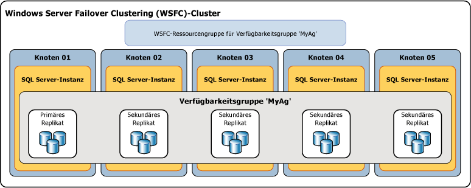

# Übersicht über Always On-Verfügbarkeitsgruppen (SQL Server)
[!INCLUDE[appliesto-ss-xxxx-xxxx-xxx-md](../../../includes/appliesto-ss-xxxx-xxxx-xxx-md.md)]

 > Informationen zu Inhalten, die sich auf frühere Versionen von SQL Server beziehen, finden Sie unter [Overview of Always On Availability Groups (SQL Server) (Übersicht über Always On-Verfügbarkeitsgruppen (SQL Server))](https://msdn.microsoft.com/en-US/library/ff877884(SQL.120).aspx).

 In diesem Thema werden die [!INCLUDE[ssHADR](../../../includes/sshadr-md.md)] -Konzepte eingeführt, die zum Konfigurieren und Verwalten von einer oder mehr Verfügbarkeitsgruppen in [!INCLUDE[ssCurrent](../../../includes/sscurrent-md.md)]wichtig sind. Eine Zusammenfassung der Vorteile von Verfügbarkeitsgruppen und eine Übersicht über die [!INCLUDE[ssHADR](../../../includes/sshadr-md.md)]-Terminologie finden Sie unter [Always On-Verfügbarkeitsgruppen &#40;SQL Server&#41;](../../../database-engine/availability-groups/windows/always-on-availability-groups-sql-server.md).  
  
 Eine *Verfügbarkeitsgruppe* unterstützt eine replizierte Umgebung für einen diskreten Satz von Benutzerdatenbanken (als *Verfügbarkeitsdatenbanken*bezeichnet). Sie können eine Verfügbarkeitsgruppe zur Hochverfügbarkeit (HA) oder Leseskalierung einrichten. Eine HA-Verfügbarkeitsgruppe ist eine Gruppe von Datenbanken, die zusammen ein Failover ausführen. Eine Verfügbarkeitsgruppe zur Leseskalierung ist eine Gruppe von Datenbanken, die für eine schreibgeschützte Arbeitsauslastung auf andere Instanzen von SQL Server kopiert werden. Eine Verfügbarkeitsgruppe unterstützt einen Satz primärer Datenbanken und einen bis acht Sätze entsprechender sekundärer Datenbanken. Sekundäre Datenbanken stellen *keine* Sicherungen dar. Die Datenbanken und deren Transaktionsprotokolle sollten weiterhin regelmäßig gesichert werden.  
  
> [!TIP]  
>  Von einer primären Datenbank können beliebige Sicherungstypen erstellt werden. Alternativ können Sie Protokollsicherungen und vollständige Kopiesicherungen von sekundären Datenbanken erstellen. Weitere Informationen finden Sie unter [Aktive sekundäre Replikate: Sicherung auf sekundären Replikaten &#40;Always On-Verfügbarkeitsgruppen&#41;](../../../database-engine/availability-groups/windows/active-secondaries-backup-on-secondary-replicas-always-on-availability-groups.md)wichtig sind.   

 Jeder Satz von Verfügbarkeitsdatenbanken wird von einem *Verfügbarkeitsreplikat*gehostet. Es gibt zwei Typen von Verfügbarkeitsreplikaten: ein einzelnes *primäres Replikat*, das die primären Datenbanken hostet, und ein bis acht *sekundäre Replikate*, die jeweils einen Satz sekundärer Datenbanken hosten und als mögliche Failoverziele für die Verfügbarkeitsgruppe dienen. Eine Verfügbarkeitsgruppe führt auf der Ebene eines Verfügbarkeitsreplikats ein Failover aus. Ein Verfügbarkeitsreplikat gewährleistet nur Redundanz auf Datenbankebene, und zwar für den in einer Verfügbarkeitsgruppe enthaltenen Satz von Datenbanken. Failover werden nicht durch Datenbankprobleme verursacht, z. B. wenn eine Datenbank aufgrund eines Verlusts einer Datendatei oder der Beschädigung eines Transaktionsprotokolls fehlerverdächtig wird.  
  
 Das primäre Replikat stellt die primären Datenbanken für Lese-/Schreibverbindungen von Clients bereit. Vom primären Replikat werden Transaktionsprotokoll-Datensätze jeder primären Datenbank an jede sekundäre Datenbank gesendet. Dieser auch als *Datensynchronisierung* bezeichnete Prozess findet auf Datenbankebene statt. Die Transaktionsprotokoll-Datensätze werden von jedem sekundären Replikat zwischengespeichert (das Protokoll wird*festgeschrieben* ) und anschließend auf die entsprechende sekundäre Datenbank angewendet. Die Datensynchronisierung erfolgt zwischen der primären Datenbank und jeder verbundenen sekundären Datenbank unabhängig von den anderen Datenbanken. Daher kann eine sekundäre Datenbank angehalten werden oder einen Fehler verursachen, ohne andere sekundäre Datenbanken zu beeinträchtigen, und eine primäre Datenbank kann angehalten werden oder einen Fehler verursachen, ohne andere primäre Datenbanken zu beeinträchtigen.  
  
 Optional können Sie mindestens ein sekundäres Replikat konfigurieren, um schreibgeschützten Zugriff auf sekundäre Datenbanken zu unterstützen, und ein beliebiges sekundäres Replikat konfigurieren, um Sicherungen auf sekundären Datenbanken zuzulassen.  

 SQL Server-2017 führt zwei verschiedene Architekturen für Verfügbarkeitsgruppen ein. *Always On-Verfügbarkeitsgruppen* bieten Hochverfügbarkeit, Notfallwiederherstellung und Lastenausgleich für die Leseskalierung. Diese Verfügbarkeitsgruppen erfordern einen Cluster-Manager. Unter Windows wird der Cluster-Manager vom Failoverclustering bereitgestellt. Unter Linux können Sie Pacemaker verwenden. Die andere Architektur ist eine *Verfügbarkeitsgruppe zur Leseskalierung*. Eine Verfügbarkeitsgruppe zur Leseskalierung stellt Replikate für die schreibgeschützte Arbeitsauslastung bereit, jedoch nicht für die Hochverfügbarkeit. In einer Verfügbarkeitsgruppe zur Leseskalierung gibt es keinen Cluster-Manager. 
 
 Für die Bereitstellung von [!INCLUDE[ssHADR](../../../includes/sshadr-md.md)] für HA unter Windows ist ein WSFC-Cluster (Windows Server-Failoverclustering) erforderlich. Jedes Verfügbarkeitsreplikat einer bestimmten Verfügbarkeitsgruppe muss sich in einem anderen Knoten desselben WSFC befinden. Die einzige Ausnahme besteht darin, dass sich eine Verfügbarkeitsgruppe während der Migration zu einem anderen WSFC-Cluster vorübergehend auf zwei Cluster erstrecken kann. 

 >[!NOTE]
 >Informationen zu Verfügbarkeitsgruppen unter Linux finden Sie unter [Always On availability group for SQL Server on Linux (Always On-Verfügbarkeitsgruppen für SQL Server unter Linux)](../../../linux/sql-server-linux-availability-group-overview.md). 

 In einer HA-Konfiguration wird eine Clusterrolle für jede Verfügbarkeitsgruppe erstellt. Der WSFC-Cluster überwacht diese Rolle, um den Zustand des primären Replikats auszuwerten. Das Quorum für [!INCLUDE[ssHADR](../../../includes/sshadr-md.md)] basiert unabhängig davon, ob ein bestimmter Clusterknoten Verfügbarkeitsreplikate hostet, auf allen Knoten des WSFC-Clusters. Im Gegensatz zur Datenbankspiegelung ist in [!INCLUDE[ssHADR](../../../includes/sshadr-md.md)] keine Zeugenrolle verfügbar.  
  
> [!NOTE]  
>  Informationen zur Beziehung zwischen SQL Server Always On-Komponenten und dem WSFC-Cluster finden Sie unter [Windows Server-Failoverclustering &#40;WSFC&#41; mit SQL Server](../../../sql-server/failover-clusters/windows/windows-server-failover-clustering-wsfc-with-sql-server.md).  
  
 In der folgenden Abbildung ist eine Verfügbarkeitsgruppe dargestellt, die ein primäres Replikat und vier sekundäre Replikate enthält. Es werden bis zu acht sekundäre Replikate unterstützt, einschließlich eines primären Replikats und zwei sekundärer Replikate mit synchronem Commit.  
  
   
  
##   Availability Databases  
 Zum Hinzufügen einer Datenbank zu einer Verfügbarkeitsgruppe muss die Datenbank eine Onlinedatenbank mit Lese-/Schreibzugriff auf der Serverinstanz sein, die das primäre Replikat hostet. Wenn Sie eine Datenbank hinzufügen, wird sie als primäre Datenbank mit der Verfügbarkeitsgruppe verknüpft, wobei sie für Clients verfügbar bleibt. Es ist keine entsprechende sekundäre Datenbank vorhanden, bis Sicherungen der neuen primären Datenbank mithilfe von RESTORE WITH NORECOVERY auf der Serverinstanz wiederhergestellt werden, die das sekundäre Replikat hostet. Die neue sekundäre Datenbank befindet sich im Status RESTORING, bis sie der Verfügbarkeitsgruppe hinzugefügt wird. Weitere Informationen finden Sie unter [Starten der Datenverschiebung auf einer sekundären Always On-Datenbank &#40;SQL Server&#41;](../../../database-engine/availability-groups/windows/start-data-movement-on-an-always-on-secondary-database-sql-server.md).  
  
 Durch das Hinzufügen wechselt die sekundäre Datenbank in den Status ONLINE und initiiert die Datensynchronisierung mit der entsprechenden primären Datenbank. Die*Datensynchronisierung* ist der Prozess, durch den Änderungen an einer primären Datenbank auf einer sekundären Datenbank reproduziert werden. Bei der Datensynchronisierung sendet die primäre Datenbank Transaktionsprotokoll-Datensätze an die sekundäre Datenbank.  
  
> [!IMPORTANT]  
>  Eine Verfügbarkeitsdatenbank wird manchmal als *Datenbankreplikat* in [!INCLUDE[tsql](../../../includes/tsql-md.md)]-, PowerShell- und SQL Server Management Objects-Namen (SMO) bezeichnet. Der Begriff „Datenbankreplikat“ wird z.B. in den Namen der dynamischen Always On-Verwaltungssichten verwendet, die Informationen zu Verfügbarkeitsdatenbanken zurückgeben:  **sys.dm_hadr_database_replica_states** und **sys.dm_hadr_database_replica_cluster_states**. In der SQL Server-Onlinedokumentation bezieht sich der Begriff "Replikat" jedoch in der Regel auf Verfügbarkeitsreplikate. Zum Beispiel sind mit "primäres Replikat" und "sekundäres Replikat" stets Verfügbarkeitsreplikate gemeint.  
  
##   Verfügbarkeitsreplikate  
 Jede Verfügbarkeitsgruppe definiert einen Satz von zwei oder mehr Failoverpartnern, bekannt als Verfügbarkeitsreplikate. *Verfügbarkeitsreplikate* sind Komponenten der Verfügbarkeitsgruppe. Jedes Verfügbarkeitsreplikat hostet eine Kopie der Verfügbarkeitsdatenbanken in der Verfügbarkeitsgruppe. Die Verfügbarkeitsreplikate der jeweiligen Verfügbarkeitsgruppe müssen von getrennten [!INCLUDE[ssNoVersion](../../../includes/ssnoversion-md.md)] -Instanzen gehostet werden, die sich in unterschiedlichen Knoten eines WSFC-Clusters befinden. Jede der Serverinstanzen muss für Always On aktiviert sein.  
  
 Eine Instanz kann nur ein Verfügbarkeitsreplikat pro Verfügbarkeitsgruppe hosten. Allerdings kann jede Instanz für zahlreiche Verfügbarkeitsgruppen verwendet werden. Eine Instanz kann entweder eine eigenständige Instanz oder eine [!INCLUDE[ssNoVersion](../../../includes/ssnoversion-md.md)] -Failoverclusterinstanz (FCI) sein. Falls Sie Redundanz auf Serverebene benötigen, verwenden Sie Failoverclusterinstanzen.  
  
 Allen Verfügbarkeitsreplikaten wird eine Anfangsrolle zugewiesen: entweder die *primäre Rolle* oder die *sekundäre Rolle*, die von den Verfügbarkeitsdatenbanken dieses Replikats geerbt wird. Die Rolle eines bestimmten Replikats legt fest, ob Datenbanken mit Lese-/Schreibzugriff oder schreibgeschützte Datenbanken gehostet werden. Einem als *primäres Replikat*bezeichneten Replikat wird die primäre Rolle zugewiesen. Es hostet Datenbanken mit Lese-/Schreibzugriff, die als *primäre Datenbanken*bezeichnet werden. Mindestens einem anderen Replikat, das als *sekundäres Replikat*bezeichnet wird, wird die sekundäre Rolle zugewiesen. Ein sekundäres Replikat hostet schreibgeschützte Datenbanken, sogenannte sekundäre Datenbanken.  
  
> [!NOTE]  
>  Wenn die Rolle eines Verfügbarkeitsreplikats unbestimmt ist, z. B. während eines Failovers, befinden sich seine Datenbanken vorübergehend im NOT SYNCHRONIZING-Status. Ihre Rolle wird auf RESOLVING festgelegt, bis die Rolle des Verfügbarkeitsreplikats aufgelöst wurde. Wird ein Verfügbarkeitsreplikat zur primären Rolle aufgelöst, werden seine Datenbanken zu primären Datenbanken. Wird ein Verfügbarkeitsreplikat zur sekundären Rolle aufgelöst, werden seine Datenbanken sekundäre Datenbanken.  
  
##   Verfügbarkeitsmodi  
 Der Verfügbarkeitsmodus ist eine Eigenschaft jedes Verfügbarkeitsreplikats. Der Verfügbarkeitsmodus legt fest, ob das primäre Replikat mit dem Commit der Transaktionen für eine Datenbank wartet, bis ein bestimmtes sekundäres Replikat die Transaktionsprotokoll-Datensätze auf den Datenträger geschrieben hat. [!INCLUDE[ssHADR](../../../includes/sshadr-md.md)] unterstützt zwei Verfügbarkeitsmodi:*asynchroner Commit-Modus* und *synchroner Commit-Modus*.  
  
-   **Asynchronous-commit mode**  
  
     Ein Verfügbarkeitsreplikat, das diesen Verfügbarkeitsmodus verwendet, wird als*Replikat mit asynchronem Commit*bezeichnet. Im Modus für asynchrone Commits führt das primäre Replikat einen Commit für Transaktionen aus, ohne auf die Bestätigung zu warten, dass ein sekundäres Replikat mit asynchronem Commit das Protokoll geschrieben hat. Im Modus für asynchrone Commits wird die Transaktionswartezeit auf den sekundären Datenbanken minimiert. Dabei liegen sie jedoch möglicherweise hinter den primären Datenbanken zurück, was Datenverluste zur Folge haben kann.  
  
-   **Synchronous-commit mode**  
  
     Ein Verfügbarkeitsreplikat, das diesen Verfügbarkeitsmodus verwendet, wird als *Replikat mit synchronem Commit*bezeichnet. Im Modus für synchrone Commits wartet ein primäres Replikat mit synchronen Commits vor dem Commit für Transaktionen auf ein sekundäres Replikat mit synchronen Commits, um zu bestätigen, dass das Schreiben des Protokolls abgeschlossen wurde. Im Modus für synchrone Commits wird sichergestellt, dass Transaktionen, für die ein Commit ausgeführt wird, vollständig geschützt sind, sobald eine angegebene sekundäre Datenbank mit der primären Datenbank synchronisiert wird. Dieser Schutz führt jedoch zu einer erhöhten Transaktionswartezeit.  
  
 Weitere Informationen finden Sie unter [Verfügbarkeitsmodi &#40;Always On-Verfügbarkeitsgruppen&#41;](../../../database-engine/availability-groups/windows/availability-modes-always-on-availability-groups.md)wichtig sind.  
  
##   Failovertypen  
 Im Kontext einer Sitzung zwischen dem primären Replikat und einem sekundären Replikat sind die primären und sekundären Rollen in einem als *Failover*bezeichneten Prozess potenziell austauschbar. Während eines Failovers geht das sekundäre Zielreplikat in die primäre Rolle über und wird dadurch zum neuen primären Replikat. Das neue primäre Replikat schaltet seine Datenbanken als primäre Datenbanken online. Clientanwendungen können eine Verbindung mit ihnen herstellen. Wenn das zuvor primäre Replikat verfügbar ist, geht es in die sekundäre Rolle über und wird dadurch zu einem sekundären Replikat. Die zuvor primären Datenbanken werden sekundäre Datenbanken, und die Datensynchronisierung wird fortgesetzt.  
  
 Man unterscheidet drei Failovertypen: automatisches Failover, manuelles Failover und erzwungenes Failover (mit möglichem Datenverlust). Die von einem bestimmten sekundären Replikat unterstützten Failovertypen hängen von seinem Verfügbarkeitsmodus und beim Modus für synchrone Commits vom Failovermodus für das primäre Replikat und das sekundäre Zielreplikat ab:  
  
-   Der Modus für synchrone Commits unterstützt zwei Failovertypen:*geplantes manuelles Failover* und *automatisches Failover*, wenn das sekundäre Zielreplikat derzeit mit „avt1“ synchronisiert wird. Die Unterstützung für diese Formen des Failovers hängt von der Einstellung der *Failovermoduseigenschaft* der Failoverpartner ab. Ist der Failovermodus für das primäre oder sekundäre Replikat auf "manuell" festgelegt, wird nur ein manuelles Failover für dieses sekundäre Replikat unterstützt. Ist der Failovermodus für das primäre und sekundäre Replikat auf "automatisch" festgelegt, wird sowohl das automatische als auch das manuelle Failover auf diesem sekundären Replikat unterstützt.  
  
    -   **Geplantes manuelles Failover** (ohne Datenverlust)  
  
         Ein manuelles Failover erfolgt nach der Ausgabe eines Failoverbefehls durch einen Datenbankadministrator. Es verursacht den Übergang eines synchronisierten sekundären Replikats in die primäre Rolle (mit garantiertem Datenschutz) und den Übergang des primären Replikats in die sekundäre Rolle. Ein manuelles Failover erfordert, dass sowohl das primäre Replikat als auch das sekundäre Zielreplikat im Modus für synchrone Commits ausgeführt wird, und dass das sekundäre Replikat bereits synchronisiert wurde.  
  
    -   **Automatisches Failover** (ohne Datenverlust)  
  
         Ein automatisches Failover tritt als Reaktion auf einen Fehler auf, der den Übergang eines synchronisierten Replikats in eine primäre Rolle (mit garantiertem Datenschutz) verursacht. Wenn das frühere primäre Replikat verfügbar wird, geht es in die sekundäre Rolle über. Für das automatische Failover ist erforderlich, dass sowohl das primäre Replikat als auch das sekundäre Zielreplikat im Modus für synchrone Commits mit einem auf "Automatisch" festgelegten Failovermodus ausgeführt werden. Darüber hinaus muss das sekundäre Replikat bereits synchronisiert sein, über ein WSFC-Quorum verfügen und die in der [flexiblen Failoverrichtlinie](../../../database-engine/availability-groups/windows/flexible-automatic-failover-policy-availability-group.md)der Verfügbarkeitsgruppe angegebenen Bedingungen erfüllen.  
  
        > [!IMPORTANT]  
        >  SQL Server-Failoverclusterinstanzen (FCIs) unterstützen kein automatisches Failover durch Verfügbarkeitsgruppen. Daher können die Verfügbarkeitsreplikate, die von einer FCI gehostet werden, nur für manuelles Failover konfiguriert werden.  
  
    > [!NOTE]  
    >  Beachten Sie Folgendes: Wenn Sie einen Befehl für ein erzwungenes Failover für ein synchronisiertes sekundäres Replikat ausgeben, verhält sich das sekundäre Replikat genauso wie bei einem geplanten manuellen Failover.  
  
-   Im Modus für asynchrone Commits ist die einzige Form des Failovers ein erzwungenes manuelles Failover (mit möglichem Datenverlust), das in der Regel als *erzwungenes Failover*bezeichnet wird. Erzwungenes Failover wird als eine Art manuelles Failover angesehen, da es nur manuell initiiert werden kann. Erzwungenes Failover ist eine Option zur Notfallwiederherstellung. Es ist auch der einzig mögliche Failovertyp, wenn das sekundäre Zielreplikat nicht mit dem primären Replikat synchronisiert ist.  
  
 Weitere Informationen finden Sie unter [Failover und Failovermodi &#40;Always On-Verfügbarkeitsgruppen&#41;](../../../database-engine/availability-groups/windows/failover-and-failover-modes-always-on-availability-groups.md)wichtig sind.  
  
##   Clientverbindungen  
 Sie können Clientkonnektivität für das primäre Replikat einer angegebenen Verfügbarkeitsgruppe bereitstellen, indem Sie einen Verfügbarkeitsgruppenlistener erstellen. Ein *Verfügbarkeitsgruppenlistener* stellt einen Satz von Ressourcen bereit, der an eine bestimmte Verfügbarkeitsgruppe angefügt wird, um Clientverbindungen an das entsprechende Verfügbarkeitsreplikat umzuleiten.  
  
 Ein Verfügbarkeitsgruppenlistener ist einem eindeutigen DNS-Namen, der als virtueller Netzwerkname (VNN) dient, mindestens einer virtuellen IP-Adresse (VIPs) und einer TCP-Portnummer zugeordnet. Weitere Informationen finden Sie unter [Verfügbarkeitsgruppenlistener, Clientkonnektivität und Anwendungsfailover &#40;SQL Server&#41;](../../../database-engine/availability-groups/windows/listeners-client-connectivity-application-failover.md)wichtig sind.  
  
> [!TIP]  
>  Wenn eine Verfügbarkeitsgruppe nur zwei Verfügbarkeitsreplikate besitzt und nicht für den Lesezugriff auf das sekundäre Replikat konfiguriert wird, können Clients mithilfe einer [Verbindungszeichenfolge für die Datenbankspiegelung](../../../database-engine/database-mirroring/connect-clients-to-a-database-mirroring-session-sql-server.md)eine Verbindung mit dem primären Verfügbarkeitsreplikat herstellen. Dieser Ansatz kann nach dem Migrieren einer Datenbank von der Datenbankspiegelung zu [!INCLUDE[ssHADR](../../../includes/sshadr-md.md)]vorübergehend nützlich sein. Bevor Sie zusätzliche sekundäre Replikate hinzufügen, müssen Sie einen Verfügbarkeitsgruppenlistener für die Verfügbarkeitsgruppe erstellen und die Anwendungen aktualisieren, damit der Netzwerkname des Listeners verwendet wird.  
  
##   Aktive sekundäre Replikate  
 [!INCLUDE[ssHADR](../../../includes/sshadr-md.md)] unterstützt aktive sekundäre Replikate. Die Funktionen für aktive sekundäre Replikate umfassen auch die Unterstützung für Folgendes:  
  
-   **Ausführen von Sicherungsvorgängen auf sekundären Replikaten**  
  
     Die sekundären Replikate unterstützen das Ausführen von Protokollsicherungen und [Kopiesicherungen](../../../database-engine/availability-groups/windows/active-secondaries-backup-on-secondary-replicas-always-on-availability-groups.md) einer vollständigen Datenbank, Datei oder Dateigruppe. Sie können die Verfügbarkeitsgruppe konfigurieren, um eine Einstellung dafür anzugeben, wo Sicherungen ausgeführt werden sollen. Die Einstellung wird nicht von SQL Server erzwungen und weist deshalb keine Auswirkungen auf Ad-hoc-Sicherungen auf. Die Interpretation dieser Einstellung hängt von der Logik ab, die Sie ggf. per Skript in Sicherungsaufträge für alle Datenbanken in einer angegebenen Verfügbarkeitsgruppe integriert haben. Für einzelne Verfügbarkeitsreplikate können Sie die Priorität für die Ausführung von Sicherungen auf diesem Replikat in Relation zu den anderen Replikaten in derselben Verfügbarkeitsgruppe angeben. Weitere Informationen finden Sie unter [Aktive sekundäre Replikate: Sicherung auf sekundären Replikaten &#40;Always On-Verfügbarkeitsgruppen&#41;](../../../database-engine/availability-groups/windows/active-secondaries-backup-on-secondary-replicas-always-on-availability-groups.md)wichtig sind.  
  
-   **Schreibgeschützter Zugriff auf ein oder mehrere sekundäre Replikate (lesbare sekundäre Replikate)**  
  
     In der sekundären Rolle kann jedes Verfügbarkeitsreplikat für den schreibgeschützten Zugriff auf die zugehörige lokale Datenbank konfiguriert werden, jedoch werden dabei einige Vorgänge nicht vollständig unterstützt. Wenn Sie verhindern möchten, dass schreibgeschützte Arbeitslasten auf dem primären Replikat ausgeführt werden, können Sie zudem die Replikate bei Ausführung in der primären Rolle für den ausschließlichen Lese-/Schreib-Zugriff konfigurieren. Weitere Informationen finden Sie unter [Aktive sekundäre Replikate: Lesbare sekundäre Replikate &#40;Always On-Verfügbarkeitsgruppen&#41;](../../../database-engine/availability-groups/windows/active-secondaries-readable-secondary-replicas-always-on-availability-groups.md)wichtig sind.  
  
     Wenn eine Verfügbarkeitsgruppe derzeit einen Verfügbarkeitsgruppenlistener und mindestens ein lesbares sekundäres Replikat besitzt, können Verbindungsanforderungen für beabsichtigte Lesevorgänge von [!INCLUDE[ssNoVersion](../../../includes/ssnoversion-md.md)] an eines dieser Replikate weitergeleitet werden (*schreibgeschütztes Routing*). Weitere Informationen finden Sie unter [Verfügbarkeitsgruppenlistener, Clientkonnektivität und Anwendungsfailover &#40;SQL Server&#41;](../../../database-engine/availability-groups/windows/listeners-client-connectivity-application-failover.md)wichtig sind.  
  
##   Sitzungstimeout  
 Das Sitzungstimeout ist eine Eigenschaft von Verfügbarkeitsreplikaten, die bestimmt, wie lange eine Verbindung mit einem anderen Verfügbarkeitsreplikat inaktiv sein darf, bevor die Verbindung geschlossen wird. Die primären und sekundären Replikate signalisieren einander mithilfe von Pingbefehlen, dass sie noch aktiv sind. Durch den Empfang eines Pings von einem anderen Replikat innerhalb des Timeoutzeitraums wird angegeben, dass die Verbindung weiterhin geöffnet ist und dass die Serverinstanzen miteinander kommunizieren. Beim Empfang eines Pings setzt ein Verfügbarkeitsreplikat seinen Sitzungstimeoutzähler für diese Verbindung zurück.  
  
 Das Sitzungstimeout verhindert, dass Replikate unbegrenzt auf ein Ping vom anderen Replikat warten. Wenn innerhalb des Zeitraums für das Sitzungstimeout kein Ping vom anderen Replikat empfangen wird, tritt für das Replikat ein Timeout ein. Die Verbindung wird geschlossen, und der Status des Replikats mit dem Timeout ändert sich in DISCONNECTED. Auch wenn ein nicht verbundenes Replikat für den Modus für synchrone Commits konfiguriert ist, warten Transaktionen nicht darauf, dass dieses Replikat erneut verbunden und synchronisiert wird.  
  
 Das Standardsitzungstimeout für alle Verfügbarkeitsreplikate liegt bei 10 Sekunden. Dieser Wert kann vom Benutzer konfiguriert werden, muss aber mindestens 5 Sekunden betragen. Im Allgemeinen wird empfohlen, einen Timeoutzeitraum von 10 Sekunden oder mehr zu wählen. Wenn Sie diesen Wert auf weniger als 10 Sekunden festlegen, kann ein stark ausgelastetes System einen falschen Fehler melden.  
  
> [!NOTE]  
>  In der Rolle RESOLVING ist das Sitzungstimeout nicht gültig, da keine Pings ausgeführt werden.  
  
##   Automatische Seitenreparatur  
 Jedes Verfügbarkeitsreplikat versucht, durch das Auflösen bestimmter Fehlertypen, die das Lesen einer Datenseite verhindern, beschädigte Seiten auf einer lokalen Datenbank automatisch wiederherzustellen. Wenn von einem sekundären Replikat eine Seite nicht gelesen werden kann, wird vom Replikat eine neue Kopie der Seite vom primären Replikat angefordert. Wenn das primäre Replikat eine Seite nicht lesen kann, überträgt das Replikat eine Anforderung für eine neue Kopie an alle sekundären Replikate und ruft die Seite von dem Replikat ab, das zuerst antwortet. Ist diese Anforderung erfolgreich, wird die nicht lesbare Seite durch die Kopie ersetzt. Dadurch kann der Fehler normalerweise behoben werden.  
  
 Weitere Informationen finden Sie weiter unten in diesem Thema unter [Automatic Page Repair &#40;Availability Groups: Database Mirroring&#41;](../../../sql-server/failover-clusters/automatic-page-repair-availability-groups-database-mirroring.md).  
  
##   Verwandte Aufgaben  
  
-   [Erste Schritte mit Always On-Verfügbarkeitsgruppen &#40;SQL Server&#41;](../../../database-engine/availability-groups/windows/getting-started-with-always-on-availability-groups-sql-server.md)  
  
##   Verwandte Inhalte  
  
-   **Blogs:**  
  
     [Always On - HADRON Learning Series: Worker Pool Usage for HADRON Enabled Databases (Always On - HADRON-Lernreihe: Nutzung des Arbeitsthreadpools für HADRON-fähige Datenbanken)](http://blogs.msdn.com/b/psssql/archive/2012/05/17/Always%20On-hadron-learning-series-worker-pool-usage-for-hadron-enabled-databases.aspx)  
  
     [SQL Server Always On Team Blogs: The official SQL Server Always On Team Blog (SQL Server Always On-Teamblogs: Der offizielle SQL Server Always On-Teamblog)](https://blogs.msdn.microsoft.com/sqlalwayson/)  
  
     [CSS SQL Server-Technikblogs](http://blogs.msdn.com/b/psssql/)  
  
-   **Videos:**  
  
     [Microsoft SQL Server Codename „Denali“ Always On-Reihe, Teil 1:Introducing the Next Generation High Availability Solution (Einführung in die nächste Generation von Lösungen mit hoher Verfügbarkeit)](http://channel9.msdn.com/Events/TechEd/NorthAmerica/2011/DBI302)  
  
     [Microsoft SQL Server Codename „Denali“ Always On-Reihe, Teil 2: Building a Mission-Critical High Availability Solution Using Always On (Erstellen einer unternehmenswichtigen Lösung für hohe Verfügbarkeit mit Always On)](http://channel9.msdn.com/Events/TechEd/NorthAmerica/2011/DBI404)  
  
-   **Whitepaper:**  
  
     [Microsoft SQL Server AlwaysOn-Lösungshandbuch zu hoher Verfügbarkeit und Notfallwiederherstellung](http://go.microsoft.com/fwlink/?LinkId=227600)  
  
     [Microsoft-Whitepapers für SQL Server 2012](http://msdn.microsoft.com/library/hh403491.aspx)  
  
     [Whitepapers des SQL Server-Kundenberatungsteams](http://sqlcat.com/)  
  
## Siehe auch  
 [Verfügbarkeitsmodi &#40;Always On-Verfügbarkeitsgruppen&#41;](../../../database-engine/availability-groups/windows/availability-modes-always-on-availability-groups.md)   
 [Failover und Failovermodi (Always On-Verfügbarkeitsgruppen)](../../../database-engine/availability-groups/windows/failover-and-failover-modes-always-on-availability-groups.md)   
 [Übersicht über Transact-SQL-Anweisungen für Always On-Verfügbarkeitsgruppen (SQL Server)](../../../database-engine/availability-groups/windows/transact-sql-statements-for-always-on-availability-groups.md)   
 [Übersicht über PowerShell-Cmdlets für Always On-Verfügbarkeitsgruppen (SQL Server)](../../../database-engine/availability-groups/windows/overview-of-powershell-cmdlets-for-always-on-availability-groups-sql-server.md)   
 [Unterstützung für Hochverfügbarkeit für In-Memory OLTP-Datenbanken](../../../relational-databases/in-memory-oltp/high-availability-support-for-in-memory-oltp-databases.md)   
 [Voraussetzungen, Einschränkungen und Empfehlungen für Always On-Verfügbarkeitsgruppen &#40;SQL Server&#41;](../../../database-engine/availability-groups/windows/prereqs-restrictions-recommendations-always-on-availability.md)   
 [Erstellung und Konfiguration von Verfügbarkeitsgruppen &#40;SQL Server&#41;](../../../database-engine/availability-groups/windows/creation-and-configuration-of-availability-groups-sql-server.md)   
 [Aktive sekundäre Replikate: Lesbare sekundäre Replikate (Always On-Verfügbarkeitsgruppen)](../../../database-engine/availability-groups/windows/active-secondaries-readable-secondary-replicas-always-on-availability-groups.md)   
 [Aktive sekundäre Replikate: Sicherung auf sekundären Replikaten (Always On-Verfügbarkeitsgruppen)](../../../database-engine/availability-groups/windows/active-secondaries-backup-on-secondary-replicas-always-on-availability-groups.md)   
 [Verfügbarkeitsgruppenlistener, Clientkonnektivität und Anwendungsfailover (SQL Server)](../../../database-engine/availability-groups/windows/listeners-client-connectivity-application-failover.md)  
  
   
