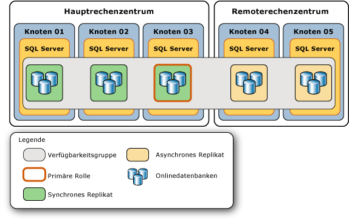
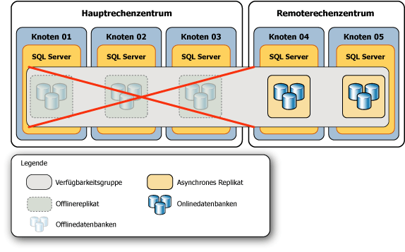
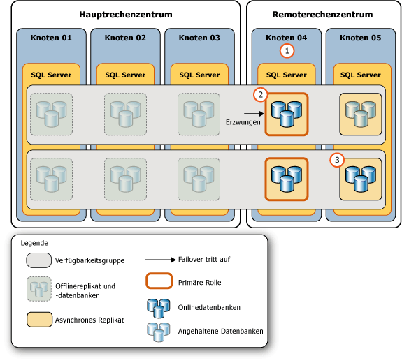
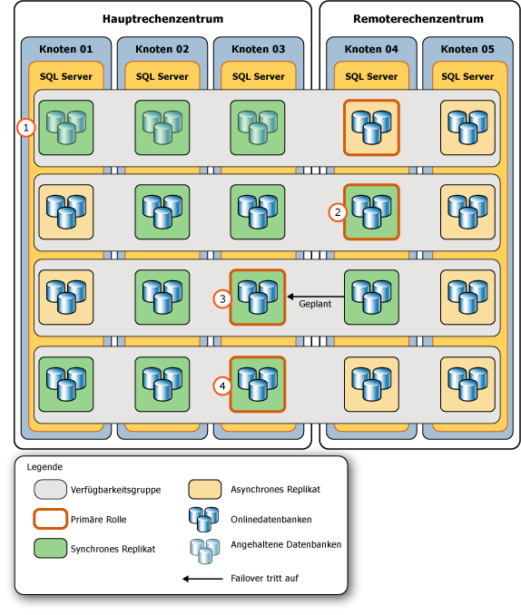

# <a name="perform-a-forced-manual-failover-of-an-availability-group-sql-server"></a>Ausführen eines erzwungenen manuellen Failovers einer Verfügbarkeitsgruppe (SQL Server)
[!INCLUDE[appliesto-ss-xxxx-xxxx-xxx-md](../../../includes/appliesto-ss-xxxx-xxxx-xxx-md.md)] In diesem Thema wird beschrieben, wie ein erzwungenes Failover (mit möglichem Datenverlust) in einer AlwaysOn-Verfügbarkeitsgruppe mit [!INCLUDE[ssManStudioFull](../../../includes/ssmanstudiofull-md.md)], [!INCLUDE[tsql](../../../includes/tsql-md.md)] oder PowerShell in [!INCLUDE[ssCurrent](../../../includes/sscurrent-md.md)] ausgeführt wird. Ein erzwungenes Failover ist eine Art manuelles Failover, das strikt für die Notfallwiederherstellung bestimmt ist, wenn ein [geplantes manuelles Failover](../../../database-engine/availability-groups/windows/perform-a-planned-manual-failover-of-an-availability-group-sql-server.md) nicht möglich ist. Wenn Sie ein Failover auf ein nicht synchronisiertes sekundäres Replikat erzwingen, ist Datenverlust möglich. Daher empfehlen wir dringend, dass Sie nur dann ein Failover erzwingen, wenn Sie den Dienst für die Verfügbarkeitsgruppe sofort wiederherstellen müssen und Datenverluste riskieren möchten.  
  
 Nach einem erzwungenen Failover wird das Failoverziel, auf das ein Failover der Verfügbarkeitsgruppe ausgeführt wurde, zum neuen primären Replikat. Die sekundären Datenbanken in den verbleibenden sekundären Replikaten werden angehalten, und deren Ausführung muss manuell fortgesetzt werden. Wenn das frühere primäre Replikat verfügbar wird, geht es in die sekundäre Rolle über, sodass die früheren primären Datenbanken zu sekundären Datenbanken werden und in den Status SUSPENDED übergehen. Bevor Sie die Ausführung einer angegebenen sekundären Datenbank fortsetzen, können Sie möglicherweise verlorene Daten wiederherstellen. Beachten Sie jedoch, dass die Transaktionsprotokollkürzung in einer angegebenen primären Datenbank verzögert wird, solange eine ihrer sekundären Datenbanken angehalten ist.  
  
> [!IMPORTANT]  
>  Die Daten werden erst mit der primären Datenbank synchronisiert, wenn die Ausführung der sekundären Datenbank fortgesetzt wird. Informationen zum Fortsetzen der Ausführung einer sekundären Datenbank finden Sie unter [Nachverfolgung: Wichtige Aufgaben nach einem erzwungenen Failover](#FollowUp) weiter unten in diesem Artikel.  
  
 Ein erzwungenes Failover ist in den folgenden Notfallsituationen notwendig:  
  
-   Nachdem Sie dem WSFC-Cluster das Quorum (*erzwungenes Quorum*) aufgezwungen haben, müssen Sie für jede Verfügbarkeitsgruppe ein Failover erzwingen (mit möglichem Datenverlust). Das Erzwingen eines Failovers ist erforderlich, da der wirkliche Status der WSFC-Clusterwerte verloren gegangen sein könnte. Sie können jedoch Datenverluste vermeiden, wenn Sie in der Lage sind, ein Failover auf die Serverinstanz zu erzwingen, die das Replikat gehostet hat, das vor dem Erzwingen des Quorums das primäre Replikat war, oder auf ein sekundäres Replikat, das vor dem Erzwingen des Quorums synchronisiert wurde. Weitere Informationen finden Sie unter [Möglichkeiten zum Vermeiden von Datenverlust nach dem Erzwingen eines Quorums](#WaysToAvoidDataLoss)weiter unten in diesem Thema.  
  
    > [!IMPORTANT]  
    >  Wenn das Quorum auf natürlichem Wege wiedererlangt und nicht erzwungen wird, durchlaufen die Verfügbarkeitsreplikate die normale Wiederherstellung. Wenn das primäre Replikat nach dem Wiedererlangen des Quorums immer noch nicht verfügbar ist, können Sie ein geplantes manuelles Failover auf ein synchronisiertes sekundäres Replikat ausführen.  
  
     Informationen zur Erzwingung des Quorums finden Sie unter [WSFC-Notfallwiederherstellung durch erzwungenes Quorum &#40;SQL Server&#41;](../../../sql-server/failover-clusters/windows/wsfc-disaster-recovery-through-forced-quorum-sql-server.md)ausgeführt wird. Informationen dazu, warum nach dem Erzwingen des Quorums das Erzwingen eines Failovers erforderlich ist, finden Sie unter [Failover und Failovermodi &#40;AlwaysOn-Verfügbarkeitsgruppen&#41;](../../../database-engine/availability-groups/windows/failover-and-failover-modes-always-on-availability-groups.md)ausgeführt wird.  
  
-   Wenn das primäre Replikat nicht mehr verfügbar ist, während der WSFC-Cluster ein fehlerfreies Quorum aufweist, können Sie ein Failover auf ein beliebiges Replikat erzwingen, dessen Rolle den Status SECONDARY oder RESOLVING aufweist (mit möglichem Datenverlust). Erzwingen Sie, wenn möglich, ein Failover auf ein sekundäres Replikat mit synchronem Commit, das synchronisiert wurde, als das primäre Replikat verloren ging.  
  
    > [!TIP]  
    >  Wenn der WSFC-Cluster ein fehlerfreies Quorum aufweist und Sie auf einem synchronisierten sekundären Replikat einen Befehl zum Erzwingen eines Failovers ausgeben, führt das Replikat tatsächlich ein geplantes manuelles Failover aus.  
  
> [!NOTE]  
>  Weitere Informationen zu den Voraussetzungen und Empfehlungen zum Erzwingen des Failovers sowie ein Beispielszenario, in dem zur Wiederherstellung nach einem schwerwiegenden Fehler ein erzwungenes Failover verwendet wird, finden Sie unter [Beispielszenario: Wiederherstellen nach einem schwerwiegenden Fehler mithilfe eines erzwungenen Failovers](../../../database-engine/availability-groups/windows/perform-a-forced-manual-failover-of-an-availability-group-sql-server.md#ExampleRecoveryFromCatastrophy)weiter unten in diesem Thema.  
  
-   **Vorbereitungen:**  
  
     [Einschränkungen](#Restrictions)  
  
     [Erforderliche Komponenten](#Prerequisites)  
  
     [Empfehlungen](#Recommendations)  
  
     [Möglichkeiten zum Vermeiden von Datenverlust nach dem Erzwingen eines Quorums](#WaysToAvoidDataLoss)  
  
     [Security](#Security)  
  
-   **Erzwingen eines Failovers (mit möglichem Datenverlust) mit:**  
  
     [SQL Server Management Studio](#SSMSProcedure)  
  
     [Transact-SQL](#TsqlProcedure)  
  
     [PowerShell](#PowerShellProcedure)  
  
-   **Nachverfolgung:** [Wichtige Aufgaben nach einem erzwungenen Failover](#FollowUp)  
  
-   **Beispielszenario:** [Wiederherstellen nach einem schwerwiegenden Fehler mithilfe eines erzwungenen Failovers](#ExampleRecoveryFromCatastrophy)  
  
-   [Verwandte Aufgaben](#RelatedTasks)  
  
-   [Verwandte Inhalte](#RelatedContent)  
  
##  <a name="BeforeYouBegin"></a> Vorbereitungsmaßnahmen  
  
###  <a name="Restrictions"></a> Einschränkungen  
  
-   Sie können nur dann kein erzwungenes Failover ausführen, wenn der WSFC-Cluster über kein Quorum verfügt.  
  
-   Während des erzwungenen Failovers einer Verfügbarkeitsgruppe können Datenverluste auftreten. Außerdem können, wenn das primäre Replikat beim Initiieren eines erzwungenen Failovers ausgeführt wird, Clients immer noch mit früheren primären Datenbanken verbunden sein. Daher empfehlen wir dringend, dass Sie nur dann ein Failover erzwingen, wenn das primäre Replikat nicht mehr ausgeführt wird und Sie bereitwillig Datenverluste riskieren, um den Zugriff auf Datenbanken in der Verfügbarkeitsgruppe wiederherzustellen.  
  
-   Wenn eine sekundäre Datenbank den Status REVERTING oder INITIALIZING aufweist, würde das Erzwingen eines Failovers dazu führen, dass die Datenbank nicht als primäre Datenbank gestartet wird. Befindet sich die Datenbank im Status INITIALIZING, müssen Sie die fehlenden Protokolldatensätze von einer Datenbanksicherung anwenden oder die Datenbank von Grund auf neu vollständig wiederherstellen. Wenn die Datenbank den Status REVERTING aufweist, müssen Sie die Datenbank vollständig aus Sicherungen wiederherstellen.  
  
-   Ein Failoverbefehl gibt einen Wert zurück, sobald das Failoverziel den Befehl akzeptiert hat. Die Datenbankwiederherstellung tritt jedoch asynchron auf, nachdem die Verfügbarkeitsgruppe aufgehört hat, ein Failover auszuführen.  
  
-   Datenbankübergreifende Konsistenz zwischen Datenbanken innerhalb der Verfügbarkeitsgruppe wird beim Failover möglicherweise nicht beibehalten.  
  
    > [!NOTE]  
    >  Die Unterstützung für datenbankübergreifende und verteilte Transaktionen unterscheidet sich je nach verwendeter SQL Server- und Betriebssystemversion. Weitere Informationen finden Sie unter [Datenbankübergreifende Transaktionen und verteilte Transaktionen für Always On-Verfügbarkeitsgruppen oder Datenbankspiegelung &#40;SQL Server&#41;](../../../database-engine/availability-groups/windows/transactions-always-on-availability-and-database-mirroring.md).  
  
###  <a name="Prerequisites"></a> Erforderliche Komponenten  
  
-   Der WSFC-Cluster verfügt über ein Quorum. Wenn der Cluster über kein Quorum verfügt, siehe [WSFC-Notfallwiederherstellung durch erzwungenes Quorum &#40;SQL Server&#41;](../../../sql-server/failover-clusters/windows/wsfc-disaster-recovery-through-forced-quorum-sql-server.md)ausgeführt wird.  
  
-   Sie müssen eine Verbindung mit einer Serverinstanz herstellen können, die ein Replikat hostet, dessen Rolle den Status SECONDARY oder RESOLVING aufweist.  
  
###  <a name="Recommendations"></a> Empfehlungen  
  
-   Erzwingen Sie kein Failover, wenn das primäre Replikat noch ausgeführt wird.  
  
-   Sie sollten nach Möglichkeit ein Failover nur auf ein Failoverziel erzwingen, dessen sekundäre Datenbanken über den Status NOT SYNCHRONIZED, SYNCHRONIZED oder SYNCHRONIZING verfügen. Informationen über die Auswirkungen beim Erzwingen eines Failovers, wenn sich eine sekundäre Datenbank im Status INITIALIZING oder REVERTING befindet, finden Sie oben im Thema [Einschränkungen](#Restrictions).  
  
-   In der Regel sollte die Latenz einer bestimmten sekundären Datenbank im Verhältnis zur primären Datenbank auf verschiedenen sekundären Replikaten mit asynchronem Commit ähnlich sein. Wenn jedoch ein Failover erzwungen wird, kann Datenverlust eine wichtige Überlegung sein. Nehmen Sie sich daher entsprechend Zeit, um die relative Latenz der Kopien der Datenbanken auf unterschiedlichen sekundären Replikaten zu bestimmen. Um zu bestimmen, welche Kopie einer bestimmten sekundären Datenbank die niedrigste Latenz aufweist, vergleichen Sie deren Protokollende-LSNs. Eine höhere Protokollende-LSN deutet auf eine geringere Latenz hin.  
  
    > [!TIP]  
    >  Um Protokollende-LSNs zu vergleichen, stellen Sie jeweils eine Verbindung zu einem sekundären Onlinereplikat her, und fragen Sie [sys.dm_hadr_database_replica_states](../../../relational-databases/system-dynamic-management-views/sys-dm-hadr-database-replica-states-transact-sql.md) nach dem **end_of_log_lsn** -Wert jeder lokalen sekundären Datenbank ab. Vergleichen Sie dann die Protokollende-LSNs der verschiedenen Kopien jeder Datenbank. Beachten Sie, dass sich die höchsten LSNs unterschiedlicher Datenbanken auf unterschiedlichen sekundären Replikaten befinden können. In diesem Fall hängt das am besten geeignete Failoverziel von der relativen Bedeutung ab, die Sie den Daten in den verschiedenen Datenbanken beimessen. Das heißt, für welche dieser Datenbanken möchten Sie mögliche Datenverluste möglichst gering halten?  
  
-   Wenn Clients eine Verbindung zum ursprünglichen primären Replikat herstellen können, bringt ein erzwungenes Failover ein gewisses Split-Brain-Risiko mit sich. Daher wird nachdrücklich empfohlen, vor dem Erzwingen des Failovers zu verhindern, dass Clients auf das ursprüngliche primäre Replikat zugreifen. Andernfalls ist es nach dem Erzwingen des Failovers möglich, dass die ursprünglichen primären Datenbanken und die aktuellen primären Datenbanken unabhängig voneinander aktualisiert werden.  
  
###  <a name="WaysToAvoidDataLoss"></a> Möglichkeiten zum Vermeiden von Datenverlust nach dem Erzwingen eines Quorums  
 Bei einigen Fehlerbedingungen nach dem Verlust des Quorums können Sie einen Datenverlust wie folgt verhindern:  
  
-   **Wenn das ursprüngliche primäre Replikat online geschaltet wird**  
  
     Wenn das Quorum verloren gegangen ist und durch das Erzwingen des WSFC-Quorums der Clusterknoten wiederhergestellt wird, der das primäre Replikat einer Verfügbarkeitsgruppe hostet, können Sie Datenverluste für diese Verfügbarkeitsgruppe verhindern. Stellen Sie eine Verbindung mit dem primären Replikat her und führen Sie ein erzwungenes Failover (FAILOVER_ALLOW_DATA_LOSS) aus. Dadurch wird das primäre Replikat wieder online geschaltet. Da Sie das erzwungene Failover auf das ursprüngliche primäre Replikat ausführen, tritt kein Datenverlust auf.  
  
-   **Wenn ein synchronisiertes sekundäres Replikat mit synchronem Commit online geschaltet wird**  
  
     Wenn das Quorum verloren gegangen ist und durch das Erzwingen des WSFC-Quorums ein Clusterknoten wiederhergestellt wird, der ein synchronisiertes sekundäres Replikat für eine Verfügbarkeitsgruppe hostet, sollten Sie Datenverluste für diese Verfügbarkeitsgruppe verhindern können. Wenn der wiederhergestellte Knoten zum Zeitpunkt des Quorumsverlusts online war, können Sie bestimmen, ob ein Datenverlust in einer bestimmten Datenbank aufgetreten ist, indem Sie die Spalte **is_failover_ready** der dynamischen Verwaltungssicht [sys.dm_hadr_database_replica_cluster_states](../../../relational-databases/system-dynamic-management-views/sys-dm-hadr-database-replica-cluster-states-transact-sql.md) abfragen. Geben Sie z. B. für eine Serverinstanz mit dem Namen `sql108w2k8r22`die folgende Abfrage aus:  
  
    ```  
    SELECT * FROM sys.dm_hadr_database_replica_cluster_states  
       WHERE replica_id=(SELECT replica_id FROM sys.availability_replicas   
          WHERE replica_server_name ='sql108w2k8r22')  
    ```  
  
    > [!CAUTION]  
    >  Wenn der wiederhergestellte Knoten zum Zeitpunkt des Quorumsverlusts nicht online war, gibt **is_failover_ready** möglicherweise nicht den Ist-Zustand des Clusters zu dem Zeitpunkt wieder, zu dem das primäre Replikat offline geschaltet wurde. Daher ist der **is_failover_ready** -Wert nur dann hilfreich, wenn der Hostknoten zum Zeitpunkt des Fehlers online war. Weitere Informationen finden Sie im Abschnitt „Warum nach Erzwingen des Quorums ein erzwungenes Failover erforderlich ist“ unter [Failover und Failovermodi &#40;AlwaysOn-Verfügbarkeitsgruppen&#41;](../../../database-engine/availability-groups/windows/failover-and-failover-modes-always-on-availability-groups.md)ausgeführt wird.  
  
     Ist **is_failover_ready** = 1, wird die Datenbank im Cluster als synchronisiert gekennzeichnet und steht für ein Failover zur Verfügung. Ist **is_failover_ready** in jeder Datenbank auf einem bestimmten sekundären Replikat auf 1 festgelegt, können Sie auf diesem sekundären Replikat ein erzwungenes Failover (FORCE_FAILOVER_ALLOW_DATA_LOSS) ohne Datenverlust ausführen. Das synchronisierte sekundäre Replikat wird in der primären Rolle online geschaltet, das heißt, als neues primäres Replikat, wobei alle Daten intakt sind.  
  
     Ist **is_failover_ready** = 0, wird die Datenbank im Cluster nicht als synchronisiert gekennzeichnet und ist *nicht* zu einem geplanten manuellen Failover bereit. Wenn Sie ein Failover auf das sekundäre Hostreplikat erzwingen, gehen Daten in dieser Datenbank verloren.  
  
    > [!NOTE]  
    >  Wenn Sie ein Failover auf ein sekundäres Replikat erzwingen, hängt der Umfang des Datenverlusts davon ab, wie weit das Failoverziel hinter dem primären Replikat zurückliegt. Wenn der WSFC-Cluster über kein Quorum verfügt oder ein Quorum erzwungen wurde, können Sie den Umfang des potenziellen Datenverlusts nicht einschätzen. Beachten Sie jedoch, dass Sie mit dem Nachverfolgen des potenziellen Datenverlusts beginnen können, sobald der WSFC-Cluster wieder ein fehlerfreies Quorum aufweist. Weitere Informationen finden Sie im Abschnitt „Nachverfolgen des potenziellen Datenverlusts“ unter [Failover und Failovermodi &#40;AlwaysOn-Verfügbarkeitsgruppen&#41;](../../../database-engine/availability-groups/windows/failover-and-failover-modes-always-on-availability-groups.md)ausgeführt wird.  
  
###  <a name="Security"></a> Sicherheit  
  
####  <a name="Permissions"></a> Berechtigungen  
 Erfordert die ALTER AVAILABILITY GROUP-Berechtigung für die Verfügbarkeitsgruppe, die CONTROL AVAILABILITY GROUP-Berechtigung, die ALTER ANY AVAILABILITY GROUP-Berechtigung oder die CONTROL SERVER-Berechtigung.  
  
##  <a name="SSMSProcedure"></a> Verwenden von SQL Server Management Studio  
 **So erzwingen Sie ein Failover (mit möglichem Datenverlust)**  
  
1.  Stellen Sie im Objekt-Explorer eine Verbindung zu einer Serverinstanz her, die ein Replikat hostet, dessen Rolle in der Verfügbarkeitsgruppe, für die ein Failover ausgeführt werden muss, den Status SECONDARY oder RESOLVING aufweist, und erweitern Sie die Serverstruktur.  
  
2.  Erweitern Sie die Knoten **Hohe Verfügbarkeit mit AlwaysOn** und **Verfügbarkeitsgruppen** .  
  
3.  Klicken Sie mit der rechten Maustaste auf die Verfügbarkeitsgruppe, für die ein Failover ausgeführt werden soll, und wählen Sie den Befehl **Failover** aus.  
  
4.  Dadurch wird der Assistent für das Failover von Verfügbarkeitsgruppen gestartet. Weitere Informationen finden Sie unter [Verwenden des Assistenten für Failover-Verfügbarkeitsgruppen &#40;SQL Server Management Studio&#41;](../../../database-engine/availability-groups/windows/use-the-fail-over-availability-group-wizard-sql-server-management-studio.md)ausgeführt wird.  
  
5.  Führen Sie nach dem Erzwingen des Failovers für eine Verfügbarkeitsgruppe die notwendigen Nachverfolgungsschritte aus. Weitere Informationen finden Sie weiter unten in diesem Thema unter [Nachverfolgung: Wichtige Aufgaben nach einem erzwungenen Failover](#FollowUp).  
  
##  <a name="TsqlProcedure"></a> Verwenden von Transact-SQL  
 **So erzwingen Sie ein Failover (mit möglichem Datenverlust)**  
  
1.  Stellen Sie eine Verbindung zu einer Serverinstanz her, die ein Replikat hostet, dessen Rolle in der Verfügbarkeitsgruppe, für die ein Failover ausgeführt werden muss, den Status SECONDARY oder RESOLVING aufweist.  
  
2.  Verwenden Sie die [ALTER AVAILABILITY GROUP](../../../t-sql/statements/alter-availability-group-transact-sql.md) -Anweisung wie folgt:  
  
     ALTER AVAILABILITY GROUP *group_name* FORCE_FAILOVER_ALLOW_DATA_LOSS  
  
     Dabei ist *group_name* der Name der Verfügbarkeitsgruppe.  
  
     Im folgenden Beispiel wird ein Failover der `AccountsAG` -Verfügbarkeitsgruppe auf das lokale sekundäre Replikat erzwungen.  
  
    ```  
    ALTER AVAILABILITY GROUP AccountsAG FORCE_FAILOVER_ALLOW_DATA_LOSS;  
    ```  
  
3.  Führen Sie nach dem Erzwingen des Failovers für eine Verfügbarkeitsgruppe die notwendigen Nachverfolgungsschritte aus. Weitere Informationen finden Sie weiter unten in diesem Thema unter [Nachverfolgung: Wichtige Aufgaben nach einem erzwungenen Failover](#FollowUp).  
  
##  <a name="PowerShellProcedure"></a> PowerShell  
 **So erzwingen Sie ein Failover (mit möglichem Datenverlust)**  
  
1.  Wechseln Sie mit**cd**in das Verzeichnis einer Serverinstanz, die ein Replikat hostet, dessen Rolle in der Verfügbarkeitsgruppe, für die ein Failover ausgeführt werden muss, den Status SECONDARY oder RESOLVING aufweist.  
  
2.  Verwenden Sie das Cmdlet **Switch-SqlAvailabilityGroup** mit dem Parameter **AllowDataLoss** in einer der folgenden Formen:  
  
    -   **-AllowDataLoss**  
  
         Durch den Parameter **-AllowDataLoss** wird **Switch-SqlAvailabilityGroup** standardmäßig angewiesen, Sie daran zu erinnern, dass das Erzwingen eines Failovers zum Verlust von Transaktionen führen kann, für die kein Commit ausgeführt wurde, und eine Bestätigung anzufordern. Geben Sie **Y**ein, um den Vorgang fortzusetzen. Geben Sie **N**ein, um den Vorgang abzubrechen.  
  
         Im folgenden Beispiel wird ein erzwungenes Failover (mit möglichem Datenverlust) der Verfügbarkeitsgruppe `MyAg` auf das sekundäre Replikat auf der Serverinstanz `SecondaryServer\InstanceName`durchgeführt. Sie werden aufgefordert, diesen Vorgang zu bestätigen.  
  
        ```  
        Switch-SqlAvailabilityGroup `  
           -Path SQLSERVER:\Sql\SecondaryServer\InstanceName\AvailabilityGroups\MyAg `  
           -AllowDataLoss  
        ```  
  
    -   **-AllowDataLoss-Force**  
  
         Um ein erzwungenes Failover ohne Bestätigung zu initiieren, geben Sie die Parameter **-AllowDataLoss** und **-Force** an. Dies ist nützlich, wenn Sie den Befehl in ein Skript einschließen und dieses ohne Benutzerinteraktion ausführen möchten.  Verwenden Sie die Option **-Force** mit Vorsicht, da ein erzwungenes Failover zum Datenverlust in Datenbanken führen kann, die an der Verfügbarkeitsgruppe teilnehmen.  
  
         Im folgenden Beispiel wird ein erzwungenes Failover (mit möglichem Datenverlust) der Verfügbarkeitsgruppe `MyAg` auf die Serverinstanz `SecondaryServer\InstanceName`durchgeführt. Durch die Option **-Force** wird die Bestätigung für diesen Vorgang unterdrückt.  
  
        ```  
        Switch-SqlAvailabilityGroup `  
           -Path SQLSERVER:\Sql\SecondaryServer\InstanceName\AvailabilityGroups\MyAg `  
           -AllowDataLoss -Force  
        ```  
  
    > [!NOTE]  
    >  Um die Syntax eines Cmdlets anzuzeigen, verwenden Sie das **Get-Help** -Cmdlet in der [!INCLUDE[ssNoVersion](../../../includes/ssnoversion-md.md)] PowerShell-Umgebung. Weitere Informationen finden Sie unter [Get Help SQL Server PowerShell](../../../relational-databases/scripting/get-help-sql-server-powershell.md).  
  
3.  Führen Sie nach dem Erzwingen des Failovers für eine Verfügbarkeitsgruppe die notwendigen Nachverfolgungsschritte aus. Weitere Informationen finden Sie weiter unten in diesem Thema unter [Nachverfolgung: Wichtige Aufgaben nach einem erzwungenen Failover](#FollowUp).  
  
 **Einrichten und Verwenden des SQL Server PowerShell-Anbieters**  
  
-   [SQL Server PowerShell-Anbieter](../../../relational-databases/scripting/sql-server-powershell-provider.md)  
  
##  <a name="FollowUp"></a> Nachverfolgung: Wichtige Aufgaben nach einem erzwungenen Failover  
  
1.  Nach einem erzwungenen Failover wird das sekundäre Replikat, auf das ein Failover ausgeführt wurde, das neue primäre Replikat. Damit Clients auf dieses Verfügbarkeitsreplikat zugreifen können, müssen Sie das WSFC-Quorum jedoch u. U. neu konfigurieren oder den konfigurierten Verfügbarkeitsmodus der Verfügbarkeitsgruppe wie folgt anpassen:  
  
    -   **Wenn Sie ein Failover außerhalb des [!INCLUDE[ssFosAuto](../../../includes/ssfosauto-md.md)] ausgeführt haben:** Passen Sie die Quorumsstimmen der WSFC-Knoten an die neue Konfiguration der Verfügbarkeitsgruppe an. Wenn der WSFC-Knoten, der das sekundäre Zielreplikat hostet, nicht über eine WSFC-Quorumsstimme verfügt, müssen Sie u. U. ein WSFC-Quorum erzwingen.  
  
        > [!NOTE]  
        >  Ein [!INCLUDE[ssFosAuto](../../../includes/ssfosauto-md.md)] ist nur vorhanden, wenn zwei Verfügbarkeitsreplikate (einschließlich des vorherigen primären Replikats) für den Modus für synchrone Commits mit automatischem Failover konfiguriert sind.  
  
         **So passen Sie Quorumsstimmen an**  
  
        -   [Anzeigen von Cluster-Quorum-NodeWeight-Einstellungen](../../../sql-server/failover-clusters/windows/view-cluster-quorum-nodeweight-settings.md)  
  
        -   [Konfigurieren von Cluster-Quorum-NodeWeight-Einstellungen](../../../sql-server/failover-clusters/windows/configure-cluster-quorum-nodeweight-settings.md)  
  
        -   [Erzwingen des Starts eines Clusters ohne Quorum](../../../sql-server/failover-clusters/windows/force-a-wsfc-cluster-to-start-without-a-quorum.md)  
  
    -   **Wenn Sie ein Failover außerhalb des [!INCLUDE[ssFosSync](../../../includes/ssfossync-md.md)] ausgeführt haben:** Es wird empfohlen, den Verfügbarkeitsmodus und Failovermodus auf dem neuen primären Replikat und auf den übrigen sekundären Replikaten an die gewünschte Konfiguration für Failover mit synchronem Commit und automatische Failover anzupassen.  
  
        > [!NOTE]  
        >  Ein [!INCLUDE[ssFosSync](../../../includes/ssfossync-md.md)] ist nur vorhanden, wenn das aktuelle primäre Replikat für den Modus für synchrone Commits konfiguriert ist.  
  
         **So ändern Sie den Verfügbarkeitsmodus und Failovermodus**  
  
        -   [Ändern des Verfügbarkeitsmodus eines Verfügbarkeitsreplikats &#40;SQL Server&#41;](../../../database-engine/availability-groups/windows/change-the-availability-mode-of-an-availability-replica-sql-server.md)  
  
        -   [Ändern des Failovermodus eines Verfügbarkeitsreplikats &#40;SQL Server&#41;](../../../database-engine/availability-groups/windows/change-the-failover-mode-of-an-availability-replica-sql-server.md)  
  
2.  Nach einem erzwungenen Failover werden alle sekundären Datenbanken angehalten. Dies schließt die früheren primären Datenbanken ein, nachdem das frühere primäre Replikat wieder online geschaltet wurde und ermittelt, dass es jetzt ein sekundäres Replikat ist. Sie müssen jede angehaltene Datenbank einzeln auf jedem sekundären Replikat manuell fortsetzen.  
  
     Beim Fortsetzen initiiert eine sekundäre Datenbank die Datensynchronisierung mit der entsprechenden primären Datenbank. Die sekundäre Datenbank führt ein Rollback für alle Protokolldatensätze aus, für die nie ein Commit in der neuen primären Datenbank ausgeführt wurde. Wenn Sie daher Bedenken bezüglich eines möglichen Datenverlusts in den primären Datenbanken nach dem Failover haben, sollten Sie versuchen, von einer der sekundären Datenbanken mit synchronem Commit eine Datenbank-Momentaufnahme für die angehaltenen Datenbanken zu erstellen.  
  
    > [!IMPORTANT]  
    >  Die Transaktionsprotokollkürzung wird auf einer primären Datenbank verzögert, solange eine ihrer sekundären Datenbanken angehalten ist. Der Synchronisierungszustand eines sekundären Replikats mit synchronem Commit kann auch keinen Übergang zu HEALTHY durchführen, solange alle lokalen Datenbanküberreste angehalten sind.  
  
     **So erstellen Sie eine Datenbankmomentaufnahme**  
  
    -   [Erstellen einer Datenbankmomentaufnahme &#40;Transact-SQL&#41;](../../../relational-databases/databases/create-a-database-snapshot-transact-sql.md)  
  
     **So setzen Sie die Ausführung einer Verfügbarkeitsdatenbank fort**  
  
    -   [Fortsetzen einer Verfügbarkeitsdatenbank &#40;SQL Server&#41;](../../../database-engine/availability-groups/windows/resume-an-availability-database-sql-server.md)  
  
    > [!CAUTION]  
    >  Nachdem die Ausführung aller sekundären Datenbanken fortgesetzt wurde, kann für die Gruppe erst wieder ein Failover ausgeführt werden, wenn jede sekundäre Datenbank auf dem nächsten Failoverziel den Status SYNCHRONIZING aufweist. Falls eine Datenbank noch nicht den Status SYNCHRONIZING aufweist, wird verhindert, dass diese Datenbank als primäre Datenbank online geschaltet wird, sodass die Wiederherstellung der Datensynchronisierung für die Datenbank u. U. erfordert, dass Transaktionsprotokolle und eine vollständigen Datenbanksicherung wiederhergestellt werden oder ein Failover zurück auf das vorherige primäre Replikat ausgeführt wird.  
  
3.  Wenn ein fehlerhaftes Verfügbarkeitsreplikat nicht an die Verfügbarkeitsgruppe oder zu spät zurückgegeben wird, um Kürzungen von Transaktionsprotokollen in der neuen primären Datenbank zu verzögern, sollten Sie das fehlerhafte Replikat aus der Verfügbarkeitsgruppe entfernen, um zu verhindern, dass der Speicherplatz für die Protokolldateien knapp wird.  
  
     **So entfernen Sie ein sekundäres Replikat**  
  
    -   [Entfernen einer sekundären Replikats aus einer Verfügbarkeitsgruppe &#40;SQL Server&#41;](../../../database-engine/availability-groups/windows/remove-a-secondary-replica-from-an-availability-group-sql-server.md)  
  
4.  Wenn auf ein erzwungenes Failover eines oder mehrere zusätzliche erzwungene Failover folgen, führen Sie nach jedem zusätzlichen erzwungenen Failover in der Reihe eine Protokollsicherung aus. Weitere Informationen zur Ursache finden Sie unter „Risiken beim Erzwingen des Failovers“ im Abschnitt „Erzwungenes manuelles Failover (mit möglichem Datenverlust)“ von [Failover und Failovermodi &#40;AlwaysOn-Verfügbarkeitsgruppen&#41;](../../../database-engine/availability-groups/windows/failover-and-failover-modes-always-on-availability-groups.md)ausgeführt wird.  
  
     **So führen Sie eine Protokollsicherung aus**  
  
    -   [Sichern eines Transaktionsprotokolls &#40;SQL Server&#41;](../../../relational-databases/backup-restore/back-up-a-transaction-log-sql-server.md)  
  
##  <a name="ExampleRecoveryFromCatastrophy"></a> Beispielszenario: Wiederherstellen nach einem schwerwiegenden Fehler mithilfe eines erzwungenen Failovers  
 Wenn das primäre Replikat ausfällt und kein synchronisiertes sekundäres Replikat verfügbar ist, kann das Erzwingen eines Failovers für die Verfügbarkeitsgruppe u. U. angemessen sein. Ob das Erzwingen eines Failovers angebracht ist, ist von folgenden Faktoren abhängig: (1) Ob Sie davon ausgehen, dass das primäre Replikat für einen längeren Zeitraum offline ist als die Vereinbarung zum Servicelevel (SLA) vorsieht, und (2) ob Sie bereit sind, einen möglichen Datenverlust zu riskieren, um primäre Datenbanken schnell verfügbar zu machen. Wenn Sie entscheiden, dass ein Failover für eine Verfügbarkeitsgruppe erzwungen werden muss, ist das tatsächliche erzwungene Failover lediglich ein Schritt von vielen.  
  
 Um die Schritte zu erläutern, die für ein erzwungenes Failover zur Wiederherstellung nach einem schwerwiegenden Fehler erforderlich sind, enthält dieses Thema ein mögliches Szenario für die Wiederherstellung im Notfall. Das Beispielszenario umfasst eine Verfügbarkeitsgruppe, deren ursprüngliche Topologie aus einem Hauptrechenzentrum besteht, das drei Verfügbarkeitsreplikate mit synchronem Commit hostet, einschließlich des primären Replikats, und aus einem Remoterechenzentrum, das zwei sekundäre Replikate mit asynchronem Commit hostet. Die folgende Abbildung veranschaulicht die ursprüngliche Topologie dieser beispielhaften Verfügbarkeitsgruppe. Die Verfügbarkeitsgruppe wird von einem Multisubnetz-WSFC-Cluster mit drei Knoten im Hauptrechenzentrum (**Knoten 01**, **Knoten 02**und **Knoten 03**) und zwei Knoten in einem Remoterechenzentrum (**Knoten 04** und **Knoten 05**) gehostet.  
  
   
  
 Das Hauptrechenzentrum wird unerwartet heruntergefahren. Seine drei Verfügbarkeitsreplikate werden offline geschaltet, und die Datenbanken sind nicht mehr verfügbar. Die folgende Abbildung veranschaulicht die Auswirkungen dieses Ausfalls auf die Topologie der Verfügbarkeitsgruppe.  
  
   
  
 Der Datenbankadministrator bestimmt, dass die beste Maßnahme ein erzwungener Failover der Verfügbarkeitsgruppe auf eines der sekundären Replikate mit asynchronem Commit am Remotestandort ist. In diesem Beispiel werden die typischen Schritte eines erzwungenen Failovers der Verfügbarkeitsgruppe auf ein Remotereplikat und das Zurückführen der Verfügbarkeitsgruppe in deren ursprüngliche Topologie veranschaulicht.  
  
 Die hier beschriebene Reaktion auf den Ausfall besteht aus den folgenden zwei Phasen:  
  
-   [Reagieren auf den schwerwiegenden Fehler im Hauptrechenzentrum](#FailureResponse)  
  
-   [Zurückführen der Verfügbarkeitsgruppe in deren ursprüngliche Topologie](#ReturnToOrigTopology)  
  
###  <a name="FailureResponse"></a> Responding to the Catastrophic Failure of the Main Data Center  
 Die folgende Abbildung veranschaulicht die Abfolge von Aktionen, die in Reaktion auf einen schwerwiegenden Fehler im Hauptrechenzentrum im Remoterechenzentrum ausgeführt werden.  
  
   
  
 In dieser Abbildung sind die folgenden Schritte angegeben:  
  
|Schritt|Aktion|Links|  
|----------|------------|-----------|  
|**1.**|Der Datenbankadministrator oder der Netzwerkadministrator stellt sicher, dass der WSFC-Cluster ein fehlerfreies Quorum aufweist. In diesem Beispiel muss das Quorum erzwungen werden.|[WSFC-Quorummodi und Abstimmungskonfiguration &#40;SQL Server&#41;](../../../sql-server/failover-clusters/windows/wsfc-quorum-modes-and-voting-configuration-sql-server.md)<br /><br /> [WSFC-Notfallwiederherstellung durch erzwungenes Quorum &#40;SQL Server&#41;](../../../sql-server/failover-clusters/windows/wsfc-disaster-recovery-through-forced-quorum-sql-server.md)|  
|**2.**|Der Datenbankadministrator stellt eine Verbindung mit der Serverinstanz mit der niedrigsten Latenz (auf **Knoten 04**) her und führt ein erzwungenes manuelles Failover aus. Durch das erzwungene Failover wechselt dieses sekundäre Replikat in die primäre Rolle und hält die sekundären Datenbanken auf dem verbleibenden sekundären Replikat (auf **Knoten 05**) an.|[sys.dm_hadr_database_replica_states &#40;Transact-SQL&#41;](../../../relational-databases/system-dynamic-management-views/sys-dm-hadr-database-replica-states-transact-sql.md) (Abfrage der **end_of_log_lsn** -Spalte. Weitere Informationen finden Sie weiter oben in diesem Thema unter [Empfehlungen](#Recommendations).)|  
|**3.**|Der Datenbankadministrator setzt die Ausführung aller sekundären Datenbanken auf dem verbleibenden sekundären Replikat manuell fort.|[Fortsetzen einer Verfügbarkeitsdatenbank &#40;SQL Server&#41;](../../../database-engine/availability-groups/windows/resume-an-availability-database-sql-server.md)|  
  
###  <a name="ReturnToOrigTopology"></a> Zurückführen der Verfügbarkeitsgruppe in deren ursprüngliche Topologie  
 Die folgende Abbildung veranschaulicht die Abfolge von Aktionen, durch die die Verfügbarkeitsgruppe in ihre ursprüngliche Topologie zurückgeführt wird, nachdem das Hauptrechenzentrum wieder online ist und die WSFC-Knoten die Kommunikation mit dem WSFC-Cluster wieder hergestellt haben.  
  
> [!IMPORTANT]  
>  Wenn das WSFC-Clusterquorum erzwungen wurde, könnte beim Neustart der Offlineknoten ein neues Quorum gebildet werden, wenn die folgenden Bedingungen erfüllt sind: (a) Es bestehen keine Netzwerkverbindungen zwischen den Knoten im erzwungenen Quorumssatz, und (b) die neu gestarteten Knoten stellen die Mehrheit der Clusterknoten dar. Dies würde zu einer so genannten "Split-Brain"-Bedingung führen, in der die Verfügbarkeitsgruppe über zwei unabhängige primäre Replikate verfügen würde, und zwar über eines in jedem Rechenzentrum. Bevor Sie ein Quorum erzwingen, durch das ein Minderheitsquorum entsteht, sollten Sie sich unter [WSFC-Notfallwiederherstellung durch erzwungenes Quorum &#40;SQL Server&#41;](../../../sql-server/failover-clusters/windows/wsfc-disaster-recovery-through-forced-quorum-sql-server.md)ausgeführt wird.  
  
   
  
 In dieser Abbildung sind die folgenden Schritte angegeben:  
  
||Schritt|Links|  
|-|----------|-----------|  
|**1.**|Die Knoten im Hauptrechenzentrum werden wieder online geschaltet und stellen die Kommunikation mit dem WSFC-Cluster wieder her. Die Verfügbarkeitsreplikate werden als sekundäre Replikate mit angehaltenen Datenbanken online geschaltet, und der Datenbankadministrator muss die Ausführung jeder Datenbank möglichst bald manuell fortsetzen.|[Fortsetzen einer Verfügbarkeitsdatenbank &#40;SQL Server&#41;](../../../database-engine/availability-groups/windows/resume-an-availability-database-sql-server.md)<br /><br /> Tipp: Wenn Sie Bedenken bezüglich eines möglichen Datenverlusts in den primären Datenbanken nach dem Failover haben, sollten Sie versuchen, von einer der sekundären Datenbanken mit synchronem Commit eine Datenbank-Momentaufnahme für die angehaltenen Datenbanken zu erstellen. Bedenken Sie, dass die Transaktionsprotokollkürzung in einer primären Datenbank verzögert wird, solange eine ihrer sekundären Datenbanken angehalten ist. Der Synchronisierungsstatus des sekundären Replikats mit synchronem Commit kann auch nicht in HEALTHY übergehen, solange eine der lokalen Datenbanken angehalten ist.|  
|**2.**|Sobald die Ausführung der Datenbanken fortgesetzt wird, ändert der Datenbankadministrator das neue primäre Replikat vorübergehend in den Modus für synchrone Commits. Dies umfasst zwei Schritte:<br /><br /> 1) Ändern eines Offlineverfügbarkeitsreplikats in den Modus für asynchrone Commits<br /><br /> 2) Ändern des neuen primären Replikats in den Modus für synchrone Commits Hinweis: Durch diesen Schritt können sekundäre Datenbanken mit synchronem Commit, deren Ausführung fortgesetzt wurde, den Status SYNCHRONIZED annehmen.|[Ändern des Verfügbarkeitsmodus eines Verfügbarkeitsreplikats &#40;SQL Server&#41;](../../../database-engine/availability-groups/windows/change-the-availability-mode-of-an-availability-replica-sql-server.md)|  
|**3.**|Nachdem das sekundäre Replikat mit synchronem Commit auf **Knoten 03** (das ursprüngliche primäre Replikat) den Synchronisierungsstatus HEALTHY annimmt, führt der Datenbankadministrator ein geplantes manuelles Failover auf dieses Replikat aus, damit es wieder zum primären Replikat wird. Das Replikat auf **Knoten 04** wird wieder zu einem sekundären Replikat.|[sys.dm_hadr_database_replica_states &#40;Transact-SQL&#41;](../../../relational-databases/system-dynamic-management-views/sys-dm-hadr-database-replica-states-transact-sql.md)<br /><br /> [Verwenden von AlwaysOn-Richtlinien zum Anzeigen des Zustands einer Verfügbarkeitsgruppe &#40;SQL Server&#41;](../../../database-engine/availability-groups/windows/use-always-on-policies-to-view-the-health-of-an-availability-group-sql-server.md)<br /><br /> [Ausführen eines geplanten manuellen Failovers einer Verfügbarkeitsgruppe &#40;SQL Server&#41;](../../../database-engine/availability-groups/windows/perform-a-planned-manual-failover-of-an-availability-group-sql-server.md)|  
|**4.**|Der Datenbankadministrator stellt eine Verbindung mit dem neuen primären Replikat her und:<br /><br /> 1) Ändert das frühere primäre Replikat (im Remoterechenzentrum) zurück in den Modus für asynchrone Commits.<br /><br /> 2) Ändert das sekundäre Replikat mit asynchronem Commit im Hauptrechenzentrum zurück in den Modus für synchrone Commits.|[Ändern des Verfügbarkeitsmodus eines Verfügbarkeitsreplikats &#40;SQL Server&#41;](../../../database-engine/availability-groups/windows/change-the-availability-mode-of-an-availability-replica-sql-server.md)|  
  
##  <a name="RelatedTasks"></a> Verwandte Aufgaben  
 **So passen Sie Quorumsstimmen an**  
  
-   [Anzeigen von Cluster-Quorum-NodeWeight-Einstellungen](../../../sql-server/failover-clusters/windows/view-cluster-quorum-nodeweight-settings.md)  
  
-   [Konfigurieren von Cluster-Quorum-NodeWeight-Einstellungen](../../../sql-server/failover-clusters/windows/configure-cluster-quorum-nodeweight-settings.md)  
  
-   [Erzwingen des Starts eines Clusters ohne Quorum](../../../sql-server/failover-clusters/windows/force-a-wsfc-cluster-to-start-without-a-quorum.md)  
  
 **Geplantes manuelles Failover:**  
  
-   [Ausführen eines geplanten manuellen Failovers einer Verfügbarkeitsgruppe &#40;SQL Server&#41;](../../../database-engine/availability-groups/windows/perform-a-planned-manual-failover-of-an-availability-group-sql-server.md)  
  
-   [Verwenden des Assistenten für Failover-Verfügbarkeitsgruppen &#40;SQL Server Management Studio&#41;](../../../database-engine/availability-groups/windows/use-the-fail-over-availability-group-wizard-sql-server-management-studio.md)  
  
 **Problembehandlung:**  
  
-   [Problembehandlung für die AlwaysOn-Verfügbarkeitsgruppenkonfiguration &#40;SQL Server&#41;](../../../database-engine/availability-groups/windows/troubleshoot-always-on-availability-groups-configuration-sql-server.md)  
  
-   [Problembehandlung bei einem fehlgeschlagenen Vorgang zum Hinzufügen einer Datei &#40;AlwaysOn-Verfügbarkeitsgruppen&#41;](../../../database-engine/availability-groups/windows/troubleshoot-a-failed-add-file-operation-always-on-availability-groups.md)  
  
##  <a name="RelatedContent"></a> Verwandte Inhalte  
  
-   **Blogs:**  
  
     [SQL Server Always On Team Blogs: The official SQL Server Always On Team Blog (SQL Server Always On-Teamblogs: Der offizielle SQL Server Always On-Teamblog)](https://blogs.msdn.microsoft.com/sqlalwayson/)  
  
     [CSS SQL Server-Technikblogs](http://blogs.msdn.com/b/psssql/)  
  
-   **Whitepaper:**  
  
     [Microsoft SQL Server AlwaysOn-Lösungshandbuch zu hoher Verfügbarkeit und Notfallwiederherstellung](http://go.microsoft.com/fwlink/?LinkId=227600)  
  
     [Microsoft-Whitepapers für SQL Server 2012](http://msdn.microsoft.com/library/hh403491.aspx)  
  
     [Whitepapers des SQL Server-Kundenberatungsteams](http://sqlcat.com/)  
  
## <a name="see-also"></a>Weitere Informationen finden Sie unter  
 [Übersicht über AlwaysOn-Verfügbarkeitsgruppen &#40;SQL Server&#41;](../../../database-engine/availability-groups/windows/overview-of-always-on-availability-groups-sql-server.md)   
 [Verfügbarkeitsmodi &#40;Always On-Verfügbarkeitsgruppen&#41;](../../../database-engine/availability-groups/windows/availability-modes-always-on-availability-groups.md)   
 [Failover und Failovermodi (Always On-Verfügbarkeitsgruppen)](../../../database-engine/availability-groups/windows/failover-and-failover-modes-always-on-availability-groups.md)   
 [Informationen zum Clientverbindungszugriff auf Verfügbarkeitsreplikate &#40;SQL Server&#41;](../../../database-engine/availability-groups/windows/about-client-connection-access-to-availability-replicas-sql-server.md)   
 [Überwachen von Verfügbarkeitsgruppen (SQL Server)](../../../database-engine/availability-groups/windows/monitoring-of-availability-groups-sql-server.md)   
 [Windows Server-Failoverclustering &#40;WSFC&#41; mit SQL Server](../../../sql-server/failover-clusters/windows/windows-server-failover-clustering-wsfc-with-sql-server.md)  
  
  
