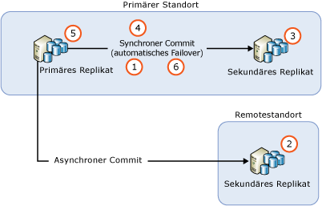
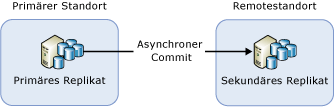
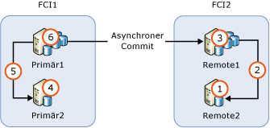

# <a name="upgrading-always-on-availability-group-replica-instances"></a>Upgraden von Always On-Verfügbarkeitsgruppen-Replikatsinstanzen
[!INCLUDE[appliesto-ss-xxxx-xxxx-xxx-md](../../../includes/appliesto-ss-xxxx-xxxx-xxx-md.md)]

Wenn eine [!INCLUDE[ssNoVersion](../../../includes/ssnoversion-md.md)]-Instanz, die eine Always On-Verfügbarkeitsgruppe (AG) hostet, auf eine neue [!INCLUDE[ssCurrent](../../../includes/sscurrent-md.md)]-Version, ein neues [!INCLUDE[ssNoVersion](../../../includes/ssnoversion-md.md)]-Service Pack oder ein kumulatives Update upgegradet wird, oder wenn Sie ein neues Windows Service Pack oder ein kumulatives Update installieren, können Sie die Downtime des primären Replikats auf ein einziges manuelles Failover reduzieren, indem Sie ein paralleles Upgrade (oder zwei manuelle Failovers, falls Sie ein Failback auf das ursprüngliche primäre Replikat durchführen) durchführen. Während des Upgradevorgangs steht ein sekundäres Replikat weder für ein Failover noch für schreibgeschützte Vorgänge zur Verfügung. Nach dem Upgrade kann es etwas dauern, bis das sekundäre Replikat auf dem gleichen Stand wie der primäre Replikatknoten ist. Dies ist vom Ausmaß der Aktivität auf dem primären Replikatknoten abhängig und kann zu einer hohen Netzwerkauslastung führen. Beachten Sie außerdem, dass die Datenbanken in dieser Verfügbarkeitsgruppe nach dem ersten Failover auf ein sekundäres Replikat, auf dem eine neuere Version von SQL Server ausgeführt wird, einen Upgradeprozess durchlaufen, um sie auf die neueste Version zu aktualisieren. Währenddessen gibt es keine Lesereplikate für diese Datenbanken. Die Downtime nach dem ersten Failover hängt von der Anzahl von Datenbanken in der Verfügbarkeitsgruppe ab. Wenn Sie ein Failback auf das ursprüngliche Replikat durchführen möchten, wird dieser Schritt beim Failback nicht wiederholt.
  
>[!NOTE]  
>In diesem Artikel wird nur das Upgraden von SQL Server behandelt. Das Upgraden des Betriebssystems, das den WSFC-Cluster (Windows Server Failover Clustering) beinhaltet, wird nicht behandelt. Das Upgraden des Windows-Betriebssystems, das den Failovercluster hostet, wird für ältere Betriebssysteme als Windows Server 2012 R2 nicht unterstützt. Weitere Informationen über das Upgraden eines Clusterknotens, der auf Windows Server 2012 R2 ausgeführt wird, finden Sie unter [Cluster Operating System Rolling Upgrade](http://docs.microsoft.com/windows-server/failover-clustering/cluster-operating-system-rolling-upgrade)(Paralleles Upgraden für Clusterbetriebssysteme).  
  
## <a name="prerequisites"></a>Voraussetzungen  
Lesen Sie die folgenden wichtigen Informationen, bevor Sie beginnen:  
  
- [Unterstützte Versions- und Editionsupgrades:](../../../database-engine/install-windows/supported-version-and-edition-upgrades.md) Überprüfen Sie, ob Sie von Ihrer Version des Windows-Betriebssystems und Ihrer Version von SQL Server auf SQL Server 2016 upgraden können. Sie können beispielsweise nicht direkt von einer SQL Server 2005-Instanz auf [!INCLUDE[ssCurrent](../../../includes/sscurrent-md.md)]upgraden.  
  
- [Auswählen einer Methode zum Upgraden der Datenbank-Engine:](../../../database-engine/install-windows/choose-a-database-engine-upgrade-method.md) Wählen Sie die passende Upgrademethode und die passenden Schritte aus, die auf Ihrer Überprüfung der unterstützten Versions- und Editionsupgrades sowie auf den anderen Komponenten basieren, die in Ihrer Umgebung installiert sind, um das Upgrade in der richtigen Reihenfolge durchzuführen.  
  
- [Planen und Testen des Upgradeplans für die Datenbank-Engine:](../../../database-engine/install-windows/plan-and-test-the-database-engine-upgrade-plan.md) Überprüfen Sie die Anmerkungen zu dieser Version, die bekannten Upgradeprobleme und die Prüfliste vor dem Upgrade. Entwickeln und testen Sie dann den Upgradeplan.  
  
- [Hardware- und Softwareanforderungen für die Installation von SQL Server:](../../../sql-server/install/hardware-and-software-requirements-for-installing-sql-server.md) Überprüfen Sie die Softwareanforderungen für die Installation von [!INCLUDE[ssCurrent](../../../includes/sscurrent-md.md)]. Falls zusätzliche Software erforderlich ist, installieren Sie diese auf jedem Knoten, bevor Sie mit dem Upgradevorgang beginnen, um die Downtime zu minimieren.  

- [Überprüfen, ob Change Data Capture oder die Replikation für Datenbanken in Verfügbarkeitsgruppen verwendet wird:](#special-steps-for-change-data-capture-or-replication) Wenn Datenbanken in der Verfügbarkeitsgruppe für Change Data Capture aktiviert sind, befolgen Sie diese [Anweisungen](#special-steps-for-change-data-capture-or-replication).

>[!NOTE]  
>Das Kombinieren verschiedener Versionen von SQL Server-Instanzen in derselben Verfügbarkeitsgruppe wird nur bei einem parallelen Upgrade unterstützt, das ein Upgrade für die vorhandenen Replikate durchführt. Eine höhere Version einer SQL Server-Instanz kann also nicht als neues Replikat zu einer bestehenden Verfügbarkeitsgruppe hinzugefügt werden. Ein SQL Server 2017-Replikat kann beispielsweise nicht zu einer bestehenden SQL Server 2016-Verfügbarkeitsgruppe hinzugefügt werden. Die einzige unterstützte Methode zum Migrieren einer neuen Version der SQL Server-Instanz mithilfe von Verfügbarkeitsgruppen besteht im Verwenden einer verteilten Verfügbarkeitsgruppe in SQL Server 2016 Enterprise Edition oder höher.

## <a name="rolling-upgrade-basics-for-always-on-ags"></a>Grundlegendes zu parallelen Upgrades für Verfügbarkeitsgruppen  
Beachten Sie folgende Richtlinien, wenn Sie Serverupgrades oder -updates durchführen, um die Downtime und den Datenverlust Ihrer Verfügbarkeitsgruppen zu minimieren:  
  
- Vor dem Start des parallelen Upgrades:  
  
    - Führen Sie zu Übungszwecken ein manuelles Failover für mindestens eine der Replikatinstanzen mit synchronem Commit aus.  
  
    - Schützen Sie Ihre Daten, indem Sie eine vollständige Datenbanksicherung für jede Verfügbarkeitsdatenbank ausführen.  
  
    - Führen Sie DBCC CHECKDB für jede Verfügbarkeitsdatenbank aus.  
  
-   Führen Sie das Upgrade zuerst immer für die sekundären Remotereplikatinstanzen und dann für die lokalen sekundären Replikatinstanzen und zuletzt für die primäre Replikatinstanz durch.  
  
-   Von einer Datenbank, für die gerade ein Upgrade ausgeführt wird, kann keine Sicherung erstellt werden.  Vor dem Aktualisieren der sekundären Replikate konfigurieren Sie die Voreinstellung für die automatisierte Sicherung, um Sicherungen nur auf dem primären Replikat auszuführen.  Während eines Versionsupgrades sind Replikate nicht lesbar oder für Sicherungen verfügbar. Während eines Upgrades ohne Versionswechsel können Sie automatische Sicherungen konfigurieren, die auf den sekundären Replikaten ausgeführt werden, bevor das primäre Replikat upgegradet wird.  
  
-   Während eines Versionsupgrades können lesbare sekundäre Replikate zwischenzeitlich nicht gelesen werden. Dieser Zeitraum der Nicht-Lesbarkeit beginnt, nachdem das Upgrade auf das sekundäre Replikat durchgeführt wurde, und hält an, bis für das primäre Replikat ein Failover an ein upgegradetes sekundäres Replikat durchgeführt wurde oder das primäre Replikat selbst upgegradet wurde.  
  
-   Damit für die Verfügbarkeitsgruppe während des Upgrades kein unbeabsichtigtes Failover ausgeführt wird, entfernen Sie das Verfügbarkeitsfailover zunächst von allen Replikaten mit synchronem Commit.  
  
-   Führen Sie für die primäre Replikatinstanz kein Upgrade aus, bevor Sie für die Verfügbarkeitsgruppe ein Failover auf eine upgegradete Instanz mit einem sekundären Replikat ausgeführt haben. Andernfalls kann sich die Downtime von Clientanwendungen während des Upgrades auf der primären Replikatinstanz verlängern.  
  
-   Führen Sie für die Verfügbarkeitsgruppe immer ein Failover auf eine sekundäre Replikatinstanz mit synchronem Commit aus. Falls Sie ein Failover auf eine sekundäre Replikatinstanz mit asynchronem Commit ausführen, werden die Datenbanken anfällig für Datenverluste, und die Datenverschiebung wird automatisch so lange angehalten, bis Sie den Vorgang manuell fortsetzen.  
  
-   Führen Sie für die primäre Replikatinstanz kein Upgrade durch, bevor Sie nicht eine der anderen sekundären Replikatinstanzen upgegradet oder aktualisiert haben. Ein primäres Replikat, für das ein Upgrade ausgeführt wurde, kann keine Protokolle mehr an sekundäre Replikate versenden, deren [!INCLUDE[ssCurrent](../../../includes/sscurrent-md.md)] -Instanz noch nicht auf die gleiche Version aktualisiert wurde. Wenn eine Datenverschiebung zu einem sekundären Replikat angehalten wurde, kann für dieses Replikat kein automatisches Failover ausgeführt werden, und die Verfügbarkeitsdatenbanken sind anfällig für Datenverluste.  
  
-   Bevor Sie ein Failover für eine Verfügbarkeitsgruppe ausführen, sollten Sie überprüfen, ob der Synchronisierungsstatus des Failoverziels SYNCHRONIZED lautet.  
  
## <a name="rolling-upgrade-process"></a>Prozess des parallelen Upgrades  
 Die genauen Schritte hängen von Faktoren wie der Bereitstellungstopologie Ihrer Verfügbarkeitsgruppen und dem Commitmodus der einzelnen Replikate ab. Im einfachsten Szenario ist ein paralleles Upgrade jedoch ein mehrstufiger Prozess, der in seiner einfachsten Form aus den folgenden Schritten besteht:  
  
   
  
1.  Deaktivieren des automatischen Failovers für alle Replikate mit synchronem Commit  
  
2.  Upgraden aller sekundären Remotereplikatinstanzen, auf denen sekundäre Replikate mit asynchronem Commit ausgeführt werden  
  
3.  Upgraden für alle lokalen sekundären Replikatinstanzen, auf denen das primäre Replikat derzeit nicht ausgeführt wird  
  
4.  Ausführen eines manuellen Failovers der Verfügbarkeitsgruppe auf ein lokales sekundäres Replikat mit synchronem Commit  
  
5.  Upgraden oder Aktualisieren der lokalen Replikatinstanz, von der das primäre Replikat zuvor gehostet wurde  
  
6.  Konfigurieren automatischer Failoverpartner nach Bedarf  
  
 Bei Bedarf können Sie ein zusätzliches manuelles Failover ausführen, um die ursprüngliche Konfiguration der Verfügbarkeitsgruppe wiederherzustellen.  
  
## <a name="ag-with-one-remote-secondary-replica"></a>Verfügbarkeitsgruppe mit einem sekundären Remotereplikat  
 Wenn Sie eine Verfügbarkeitsgruppe ausschließlich zur Notfallwiederherstellung bereitgestellt haben, müssen Sie für die Verfügbarkeitsgruppe möglicherweise ein Failover auf ein sekundäres Replikat mit asynchronem Commit ausführen. Diese Konfiguration wird in der folgenden Abbildung dargestellt:  
  
   
  
 In diesem Fall müssen Sie für die Verfügbarkeitsgruppe während des parallelen Upgrades ein Failover auf das sekundäre Replikat mit asynchronem Commit ausführen. Ändern Sie den Commitmodus zur Vermeidung von Datenverlusten in den synchronen Commitmodus, und warten Sie mit dem Failover der Verfügbarkeitsgruppe, bis das sekundäre Replikat synchronisiert ist. Der Prozess zum Durchführen eines parallelen Upgrades kann somit folgendermaßen aussehen:  
  
1.  Upgraden der sekundären Replikatinstanz am Remotestandort  
  
2.  Ändern des Commitmodus in den synchronen Commitmodus  
  
3.  Warten, bis der Synchronisierungsstatus SYNCHRONIZED lautet  
  
4.  Ausführen eines Failovers der Verfügbarkeitsgruppe an ein sekundäres Replikat am Remotestandort  
  
5.  Upgraden oder Aktualisieren der lokalen (am primären Standort) Replikatinstanz  
  
6.  Ausführen eines Failovers der Verfügbarkeitsgruppe zurück auf den primären Standort  
  
7.  Ändern des Commitmodus in den asynchronen Commitmodus  
  
 Der synchrone Commitmodus ist für die Datensynchronisierung mit einem Remotestandort nicht zu empfehlen. Nachdem die Einstellung geändert wurde, verzeichnen die Clientanwendungen möglicherweise einen sofortigen Anstieg der Datenbanklatenz. Darüber hinaus führt ein Failover dazu, dass alle unbestätigten Protokollmeldungen verworfen werden. Die Anzahl der verworfenen Protokollmeldungen kann aufgrund hoher Netzwerklatenz zwischen den beiden Standorten deutlich erhöht sein, was auf den Clients zu einer hohen Rate von Transaktionsfehlern führt. Sie können die Auswirkungen auf die Clientanwendungen mithilfe der folgenden Maßnahmen minimieren:  
  
-   Festlegen des Wartungsfensters auf Zeiten mit geringem Clientdatenverkehr  
  
-   Ändern Sie den Verfügbarkeitsmodus während des Upgradens oder Aktualisierens von [!INCLUDE[ssCurrent](../../../includes/sscurrent-md.md)] am primären Standort zurück in den asynchronen Commitmodus, und kehren Sie zu synchronen Commits zurück, wenn Sie wieder bereit für ein Failover auf den primären Standort sind.  
  
## <a name="ag-with-failover-cluster-instance-nodes"></a>Verfügbarkeitsgruppe mit Failoverclusterinstanz-Knoten  
 Falls eine Verfügbarkeitsgruppe Failoverclusterinstanz-Knoten (Failover Cluster Instance, FCI) enthält, sollten Sie die inaktiven Knoten vor den aktiven Knoten upgraden. In der folgenden Abbildung ist ein gängiges Szenario für Verfügbarkeitsgruppen mit FCIs dargestellt. Es basiert auf FCIs, die auf lokale Hochverfügbarkeit und asynchrone Commits zur Remotenotfallwiederherstellung ausgelegt sind, und veranschaulicht die Schritte zum Ausführen des Upgrades.  
  
   
  
1.  Upgraden oder Aktualisieren von REMOTE2 (Remote2)  
  
2.  Failover von FCI2 auf REMOTE2  
  
3.  Upgraden oder Aktualisieren von REMOTE1 (Remote1)  
  
4.  Upgraden oder Aktualisieren von PRIMARY2 (Primär2)  
  
5.  Failover von FCI1 auf PRIMARY2  
  
6.  Upgraden oder Aktualisieren von PRIMARY1 (Primär1)  
  
## <a name="upgrade-update-sql-server-instances-with-multiple-ags"></a>Upgraden oder Aktualisieren von SQL Server-Instanzen mit mehreren Verfügbarkeitsgruppen  
 Falls Sie mehrere Verfügbarkeitsgruppen mit primären Replikaten auf verschiedenen Serverknoten ausführen (eine Aktiv/Aktiv-Konfiguration), umfasst der Upgradepfad zusätzliche Failoverschritte, um die Hochverfügbarkeit während des Vorgangs sicherzustellen. Es wird angenommen, dass Sie wie in der folgenden Tabelle dargestellt drei Verfügbarkeitsgruppen auf drei Serverknoten ausführen, bei denen sich alle Replikate im synchronen Commitmodus befinden:  
  
|Verfügbarkeitsgruppe|Knoten1|Knoten2|Knoten3|  
|------------------------|-----------|-----------|-----------|  
|VG1|Primär|||  
|VG2||Primär||  
|VG3|||Primär|  
  
 In diesem Fall kann es von Vorteil sein, ein paralleles Upgrade mit Lastenausgleich in der folgenden Reihenfolge durchzuführen:  
  
1.  Failover von VG2 auf Knoten3 (um Knoten2 freizugeben)  
  
2.  Upgraden oder Aktualisieren von Knoten2  
  
3.  Failover von VG1 auf Knoten2 (um Knoten1 freizugeben)  
  
4.  Upgraden oder Aktualisieren von Knoten1  
  
5.  Failover sowohl von VG2 als auch von VG3 auf Knoten1 (um Knoten3 freizugeben)  
  
6.  Upgraden oder Aktualisieren von Knoten3  
  
7.  Failover von VG3 auf Knoten3  
  
 Bei dieser Art von Upgrade beträgt die durchschnittliche Downtime weniger als zwei Failovers pro Verfügbarkeitsgruppe. Die daraus resultierende Konfiguration ist in der folgenden Tabelle dargestellt.  
  
|Verfügbarkeitsgruppe|Knoten1|Knoten2|Knoten3|  
|------------------------|-----------|-----------|-----------|  
|VG1||Primär||  
|VG2|Primär|||  
|VG3|||Primär|  
  
 Je nach Ihrer spezifischen Implementierung kann der Upgradepfad abweichen. Das Gleiche gilt für die Downtime der Clientanwendungen.  
  
> [!NOTE]  
>  In vielen Fällen wird nach Fertigstellung des parallelen Upgrades ein Failback auf das primäre Replikat durchgeführt. 

## <a name="special-steps-for-change-data-capture-or-replication"></a>Spezielle Schritte für Change Data Capture oder die Replikation

Abhängig vom angewendeten Update können zusätzliche Schritte für Replikatdatenbanken von Verfügbarkeitsgruppen erforderlich sein, die für Change Data Capture oder die Replikation aktiviert sind. Lesen Sie die Anmerkungen zu dieser Version des Updates, um zu bestimmen, ob folgende Schritte erforderlich sind:

1. Upgraden Sie jedes sekundäre Replikat.

1. Führen Sie ein Failover der Verfügbarkeitsgruppe auf eine upgegradete Instanz durch, nachdem alle sekundären Replikate upgegradet wurden. 

1. Führen Sie folgenden Transact-SQL-Befehl auf der Instanz aus, die das primäre Replikat hostet:

   ```sql
   EXECUTE [master].[sys].[sp_vupgrade_replication];
   ```

   >[!NOTE]
   >Die Ausführung dieses Befehls kann einige Minuten in Anspruch nehmen. 

1. Führen Sie ein Upgrade für die Instanz aus, bei der es sich um das ursprüngliche primäre Replikat handelt.

Weitere Informationen finden Sie unter [CDC functionality may break after upgrading to the latest CU (Die CDC-Funktion funktioniert nach dem Upgrade auf das aktuelle kumulative Update nicht mehr)](http://blogs.msdn.microsoft.com/sql_server_team/cdc-functionality-may-break-after-upgrading-to-the-latest-cu-for-sql-server-2012-2014-and-2016/).

  
## <a name="see-also"></a>Weitere Informationen finden Sie unter  
 [Aktualisieren auf SQL Server 2016 mithilfe des Installations-Assistenten &#40;Setup&#41;](../../../database-engine/install-windows/upgrade-sql-server-using-the-installation-wizard-setup.md)   

 [Installieren von SQL Server 2016 von der Eingabeaufforderung](../../../database-engine/install-windows/install-sql-server-2016-from-the-command-prompt.md)  
  
  
