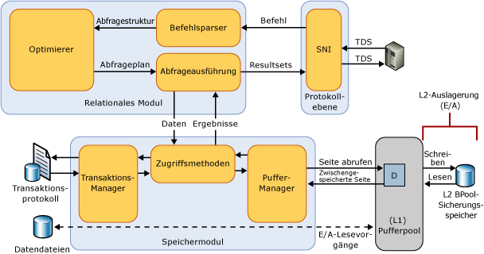

# Pufferpoolerweiterung
[!INCLUDE[appliesto-ss-xxxx-xxxx-xxx-md](../../includes/appliesto-ss-xxxx-xxxx-xxx-md.md)]
  Seit [!INCLUDE[ssSQL14](../../includes/sssql14-md.md)]ermöglicht die Pufferpoolerweiterung die nahtlose Integration einer NVRAM (Non-Volatile Random Access Memory)-Erweiterung, d. h. Solid State Drive, in den [!INCLUDE[ssDE](../../includes/ssde-md.md)] -Pufferpool, um den E/A-Durchsatz deutlich zu verbessern. Die Pufferpoolerweiterung ist nicht in jeder [!INCLUDE[ssNoVersion](../../includes/ssnoversion-md.md)] -Edition verfügbar. Weitere Informationen finden Sie unter [Von den SQL Server 2016-Editionen unterstützte Funktionen](~/sql-server/editions-and-supported-features-for-sql-server-2016.md).  
  
## Vorteile der Pufferpoolerweiterung  
 Der Hauptzweck einer [!INCLUDE[ssNoVersion](../../includes/ssnoversion-md.md)] -Datenbank ist das Speichern und Abrufen von Daten. Daher stellt eine hohe Ein-/Ausgabe auf dem Datenträger ein Hauptmerkmal des Datenbankmoduls dar. Datenträger-E/A-Vorgänge beanspruchen ggf. viele Ressourcen und benötigen relativ viel Zeit für die Ausführung. Daher ist [!INCLUDE[ssNoVersion](../../includes/ssnoversion-md.md)] so konzipiert, dass E/A-Vorgänge möglichst effizient gestaltet werden. Der Pufferpool ist eine primäre Speicherbelegungsquelle von [!INCLUDE[ssNoVersion](../../includes/ssnoversion-md.md)]. Die Pufferverwaltung ist eine zentrale Komponente zum Erreichen dieser Effizienz. Die Pufferverwaltungskomponente weist zwei Mechanismen auf: den Puffer-Manager, mit dem auf Datenbankseiten zugegriffen wird und mit dem sie aktualisiert werden, und den Pufferpool, mit dem Datenbankdatei-E/A-Vorgänge reduziert werden.  
  
 Daten- und Indexseiten werden vom Datenträger in den Pufferpool gelesen und geänderte Seiten (auch bekannt als modifizierte Seiten) werden zurück auf den Datenträger geschrieben. Ungenügender Arbeitsspeicher auf den Server- und Datenbankprüfpunkten bewirkt heiße (aktive) modifizierte Seiten im Puffercache, die aus dem Cache entfernt und auf mechanische Datenträger geschrieben und dann wieder in den Cache gelesen werden. Diese E/A-Vorgänge sind in der Regel kleine zufällige Lese- und Schreibvorgänge in der Größenordnung von 4 bis 16 KB Daten. Kleine zufällige E/A-Muster verursachen häufige Suchen, die um den mechanischen Datenträgerarm konkurrieren, die E/A-Latenzzeit erhöhen und den aggregierten E/A-Durchsatz des Systems verringern.  
  
 Der normale Ansatz zum Beheben dieser E/A-Engpässe besteht darin, mehr DRAM hinzuzufügen oder leistungsstarke SAS-Spindeln hinzuzufügen. Auch wenn diese Optionen hilfreich sind, haben sie erhebliche Nachteile: DRAM ist teurer als Datenspeicherungslaufwerke und das Hinzufügen von Spindeln erhöht den Investitionsaufwand bei der Hardwareanschaffung und die Betriebskosten durch erhöhte Leistungsaufnahme und erhöhte Wahrscheinlichkeit von Komponentenfehlern.  
  
 Die Pufferpoolerweiterungsfunktion erweitert den Pufferpoolcache um nicht flüchtigen Speicher (üblicherweise SSD). Aufgrund der Erweiterung kann der Pufferpool ein größeres Datenbankworkingset aufnehmen, das die Auslagerung von E/A-Vorgängen zwischen RAM und SSDs erzwingt. Dies verlagert effektiv kleine zufällige E/A-Vorgänge von den mechanischen Datenträgern auf SSDs. Aufgrund der niedrigeren Latenzzeit und besser verteilten zufälligen E/A-Zugriffen von SSDs verbessert die Pufferpoolerweiterung erheblich den E/A-Durchsatz.  
  
 Die folgende Liste beschreibt die Vorteile der Pufferpoolerweiterungsfunktion.  
  
-   Verbesserter Durchsatz bei zufällig verteilten E/A-Zugriffen  
  
-   Reduzierte E/A-Latenzzeit  
  
-   Verbesserter Transaktionsdurchsatz  
  
-   Verbesserte Leseleistung mit einem größeren hybriden Pufferpool  
  
-   Eine Cachingarchitektur, die aktuelle und zukünftige kostengünstige Speicherlaufwerke nutzen kann  
  
### Konzepte  
 Die folgenden Begriffe sind auf die Pufferpoolerweiterungsfunktion anwendbar.  
  
 Solid State Drive (SSD)  
 Solid State Drives speichern Daten im Arbeitsspeicher (RAM) in einer persistenten Weise. Weitere Informationen finden Sie unter [dieser Definition](http://en.wikipedia.org/wiki/Solid-state_drive).  
  
 Puffer  
 In [!INCLUDE[ssNoVersion](../../includes/ssnoversion-md.md)]ist ein Puffer eine 8-KB-Seite im Arbeitsspeicher. Dies entspricht der Größe einer Datenseite oder Indexseite. Der Puffercache ist ebenfalls in Seiten von je 8 KB unterteilt. Eine Seite verbleibt im Puffercache, bis der Pufferbereich vom Puffer-Manager zum Laden weiterer Daten benötigt wird. Daten werden nur dann zurück auf den Datenträger geschrieben, wenn sie geändert wurden. Diese geänderten Seiten im Arbeitsspeicher werden als modifizierte Seiten bezeichnet. Eine Seite gilt als nicht modifiziert, wenn sie ihrem Datenbankbild auf dem Datenträger entspricht. Daten im Puffercache können mehrfach geändert werden, bevor sie zurück auf den Datenträger geschrieben werden.  
  
 Pufferpool  
 Auch als Puffercache bezeichnet. Der Pufferpool ist eine globale Ressource, die von allen Datenbanken für ihre zwischengespeicherten Datenseiten verwendet wird. Die maximale und minimale Größe des Pufferpoolcaches wird während des Startvorgangs bestimmt oder wenn die Instanz von SQL Server mithilfe von sp_configure dynamisch neu konfiguriert wird. Diese Größe bestimmt die maximale Anzahl der Seiten, die jederzeit im Pufferpool in der aktuellen Instanz zwischengespeichert werden können.  
  
 Der maximale Arbeitsspeicher, für den von der Pufferpoolerweiterung ein Commit ausgeführt werden kann, kann von den anderen Clientanwendungen eingeschränkt werden, die auf dem Computer ausgeführt werden, sofern diese Arbeitsspeicher erheblich beanspruchen.  
  
 Prüfpunkt  
 Ein Prüfpunkt erstellt einen bekannten fehlerfreien Punkt, von dem aus das [!INCLUDE[ssDE](../../includes/ssde-md.md)] Änderungen übernehmen kann, die im Transaktionsprotokoll während der Wiederherstellung nach einem unerwarteten Herunterfahren oder einem Absturz enthalten sind. Ein Prüfpunkt schreibt die modifizierten Seiten und Transaktionsprotokollinformationen vom Arbeitsspeicher auf den Datenträger und erfasst auch Informationen zum Transaktionsprotokoll. Weitere Informationen finden Sie unter [Datenbankprüfpunkte &#40;SQL Server&#41;](../../relational-databases/logs/database-checkpoints-sql-server.md).  
  
## Details der Pufferpoolerweiterung  
 SSD-Speicher wird als Erweiterung des Arbeitsspeichersubsystems statt des Festplattenspeichersubsystems verwendet. Somit ermöglicht die Pufferpoolerweiterungsdatei dem Pufferpool-Manager, DRAM und NAND-Flasharbeitsspeicher zu verwenden, um einen wesentlich größeren Pufferpool von "lauwarmen" Seiten im nicht flüchtigen Speicher beizubehalten, der durch SSDs unterstützt wird. Hierdurch wird eine mehrstufige Zwischenspeicherhierarchie mit Ebene 1 (L1) als DRAM und Ebene 2 (L2) als Pufferpoolerweiterungsdatei auf SSD erstellt. Nur nicht modifizierte Seiten werden in den L2-Cache geschrieben, um mehr Datensicherheit zu gewährleisten. Der Puffer-Manager ist für die Verschiebung der nicht modifizierten Seiten zwischen dem L1- und L2-Cache zuständig.  
  
 Die folgende Abbildung zeigt eine allgemeine Architekturübersicht des Pufferpools im Vergleich zu anderen [!INCLUDE[ssNoVersion](../../includes/ssnoversion-md.md)] -Komponenten.  
  
   
  
 Wenn sie aktiviert ist, gibt die Pufferpoolerweiterung die Größe und den Dateipfad der Pufferpoolzwischenspeicherdatei auf dem SSD an. Diese Datei ist ein zusammenhängender Speicherbereich auf dem SSD und wird beim Starten der Instanz von [!INCLUDE[ssNoVersion](../../includes/ssnoversion-md.md)]statisch konfiguriert. Änderungen an den Dateikonfigurationsparametern können nur ausgeführt werden, wenn die Pufferpoolerweiterungsfunktion deaktiviert ist. Wenn die Pufferpoolerweiterung deaktiviert wird, werden alle zugehörigen Konfigurationseinstellungen aus der Registrierung entfernt. Die Pufferpoolerweiterungsdatei wird nach dem Herunterfahren der SQL Server-Instanz gelöscht.  
  
## Bewährte Methoden  
 Es wird empfohlen, nach den folgenden bewährten Methoden vorzugehen.  
  
-   Nach dem ersten Aktivieren der Pufferpoolerweiterung empfiehlt es sich, die SQL Server-Instanz neu zu starten, um die maximalen Leistungsvorteile zu erhalten.  
  
-   Die Pufferpoolerweiterungsgröße kann maximal das 32fache des max_server_memory-Werts betragen.  Es wird empfohlen, ein Verhältnis von 1:16 oder kleiner zwischen der Größe des physischen Arbeitsspeichers (max_server_memory) und der Größe der Pufferpoolerweiterung beizubehalten. Ein niedrigeres Verhältnis im Bereich von 1:4 bis 1:8 kann optimal sein. Informationen zum Einrichten der max_server_memory-Option finden Sie unter [Serverkonfigurationsoptionen für den Serverarbeitsspeicher](../../database-engine/configure-windows/server-memory-server-configuration-options.md).  
  
-   Testen Sie die Pufferpoolerweiterung gründlich, bevor Sie sie in einer Produktionsumgebung implementieren. Vermeiden Sie in der Produktionsumgebung, Konfigurationsänderungen an der Datei vorzunehmen oder die Funktion zu deaktivieren. Diese Aktivitäten können negative Auswirkungen auf die Serverleistung haben, da die Größe des Pufferpools erheblich reduziert wird, wenn die Funktion deaktiviert ist. Wenn sie deaktiviert ist, wird der zur Unterstützung der Funktion verwendete Arbeitsspeicher erst wieder freigegeben, wenn die Instanz von SQL Server neu gestartet wird. Beim erneuten Aktivieren der Funktion wird der Arbeitsspeicher jedoch sofort wiederverwendet, ohne dass ein Neustart der Instanz erforderlich ist.  
  
## Rückgabeinformationen zur Pufferpoolerweiterung  
 Sie können die folgenden dynamischen Verwaltungssichten verwenden, um die Konfiguration der Pufferpoolerweiterung anzuzeigen und Informationen über die Datenseiten in der Erweiterung zurückzugeben.  
  
-   [sys.dm_os_buffer_pool_extension_configuration &#40;Transact-SQL&#41;](../../relational-databases/system-dynamic-management-views/sys-dm-os-buffer-pool-extension-configuration-transact-sql.md)  
  
-   [sys.dm_os_buffer_descriptors &#40;Transact-SQL&#41;](../../relational-databases/system-dynamic-management-views/sys-dm-os-buffer-descriptors-transact-sql.md)  
  
 Im Puffer-Manager-Objekt von SQL Server sind Leistungsindikatoren verfügbar, um die Datenseiten in der Pufferpoolerweiterungsdatei nachzuverfolgen. Weitere Informationen finden Sie unter [Leistungsindikatoren für die Pufferpoolerweiterung](../../relational-databases/performance-monitor/sql-server-buffer-manager-object.md).  
  
 Die folgenden XEvents sind verfügbar.  
  
|XEvent|Description|Parameter|  
|------------|-----------------|----------------|  
|sqlserver.buffer_pool_extension_pages_written|Wird ausgelöst, wenn eine Seite oder eine Gruppe von Seiten aus dem Pufferpool in die Pufferpoolerweiterungsdatei geschrieben werden.|*number_page*   *first_page_id*   *first_page_offset*   *initiator_numa_node_id*|  
|sqlserver.buffer_pool_extension_pages_read|Wird ausgelöst, wenn eine Seite aus der Pufferpoolerweiterungsdatei in den Pufferpool gelesen wird.|*number_page*   *first_page_id*   *first_page_offset*   *initiator_numa_node_id*|  
|sqlserver.buffer_pool_extension_pages_evicted|Wird ausgelöst, wenn eine Seite aus der Pufferpoolerweiterungsdatei entfernt wird.|*number_page*   *first_page_id*   *first_page_offset*   *initiator_numa_node_id*|  
|sqlserver.buffer_pool_eviction_thresholds_recalculated|Wird ausgelöst, wenn der Entfernungsschwellenwert berechnet wird.|*warm_threshold*   *cold_threshold*   *pages_bypassed_eviction*   *eviction_bypass_reason*   *eviction_bypass_reason_description*|  
  
## Related Tasks  
  
|||  
|-|-|  
|**Taskbeschreibung**|**Thema**|  
|Aktivieren und Konfigurieren der Pufferpoolerweiterung.|[ALTER SERVER CONFIGURATION &#40;Transact-SQL&#41;](../../t-sql/statements/alter-server-configuration-transact-sql.md)|  
|Ändern der Konfiguration der Pufferpoolerweiterung|[ALTER SERVER CONFIGURATION &#40;Transact-SQL&#41;](../../t-sql/statements/alter-server-configuration-transact-sql.md)|  
|Anzeigen der Konfiguration der Pufferpoolerweiterung|[sys.dm_os_buffer_pool_extension_configuration &#40;Transact-SQL&#41;](../../relational-databases/system-dynamic-management-views/sys-dm-os-buffer-pool-extension-configuration-transact-sql.md)|  
|Überwachen der Pufferpoolerweiterung|[sys.dm_os_buffer_descriptors &#40;Transact-SQL&#41;](../../relational-databases/system-dynamic-management-views/sys-dm-os-buffer-descriptors-transact-sql.md)   [Leistungsindikatoren](../../relational-databases/performance-monitor/sql-server-buffer-manager-object.md)|  
  
  
