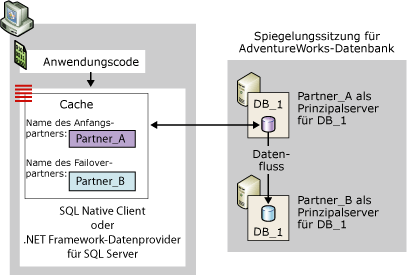
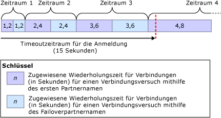
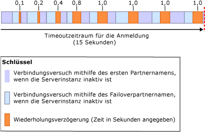

# <a name="connect-clients-to-a-database-mirroring-session-sql-server"></a>Verbinden von Clients mit einer Datenbank-Spiegelungssitzung (SQL Server)
  Zum Herstellen einer Verbindung mit einer Datenbank-Spiegelungssitzung kann ein Client entweder [!INCLUDE[ssNoVersion](../../includes/ssnoversion-md.md)] Native Client oder .NET Framework-Datenanbieter für [!INCLUDE[ssNoVersion](../../includes/ssnoversion-md.md)]verwenden. Wenn sie für eine [!INCLUDE[ssCurrent](../../includes/sscurrent-md.md)] -Datenbank konfiguriert sind, unterstützen beide Datenzugriffsanbieter die Datenbankspiegelung. Informationen zu Programmierüberlegungen in Bezug auf das Verwenden einer gespiegelten Datenbank finden Sie unter [Verwenden der Datenbankspiegelung](../../relational-databases/native-client/features/using-database-mirroring.md). Zusätzlich muss die aktuelle Prinzipalserverinstanz verfügbar sein, und der Anmeldename des Clients muss auf der Serverinstanz erstellt worden sein. Weitere Informationen finden Sie unter [Problembehandlung bei verwaisten Benutzern &#40;SQL Server&#41;](../../sql-server/failover-clusters/troubleshoot-orphaned-users-sql-server.md). Sofern eine Zeugenserverinstanz vorhanden ist, werden Clientverbindungen mit einer Datenbank-Spiegelungssitzung ohne Beteiligung dieser Instanz hergestellt.  
  
  
##  <a name="InitialConnection"></a> Herstellen der Anfangsverbindung mit einer Datenbank-Spiegelungssitzung  
 Für die Anfangsverbindung mit einer gespiegelten Datenbank muss ein Client eine Verbindungszeichenfolge bereitstellen, die zumindest den Namen einer Serverinstanz nennt. Dieser erforderliche Servername sollte die aktuelle Prinzipalserverinstanz identifizieren und wird auch als *erster Partnername*bezeichnet.  
  
 Optional kann in der Verbindungszeichenfolge auch der Name einer anderen Serverinstanz bereitgestellt werden, um die aktuelle Spiegelserverinstanz zu identifizieren, die dann verwendet wird, wenn der erste Partner während des ersten Verbindungsversuchs nicht verfügbar ist. Der zweite Name wird auch als *Failoverpartnername*bezeichnet.  
  
 In der Verbindungszeichenfolge muss darüber hinaus ein Datenbankname bereitgestellt werden. Dies ist notwendig, um Failoverversuche des Datenzugriffsanbieters zu ermöglichen.  
  
 Beim Erhalt einer Verbindungszeichenfolge speichert der Datenzugriffsanbieter den Namen des ersten Partners sowie ggf. des Failoverpartners in einem Cache im flüchtigen Speicher des Clients (bei verwaltetem Code ist der Cache auf die Anwendungsdomäne begrenzt). Anschließend wird der Name des ersten Partnernamens vom Datenzugriffsanbieter nie mehr aktualisiert. Wenn der Client den Failoverpartnernamen bereitstellt, speichert der Datenzugriffsanbieter auch diesen Namen zeitweise, falls der Anbieter keine Verbindung über den Namen des ersten Partners herstellen kann.  
  
 Eine Datenbank-Spiegelungssitzung schützt nicht vor clientspezifischen Serverzugriffsproblemen, z. B. wenn ein Clientcomputer Probleme mit der Kommunikation mit dem Netzwerk hat. Ein Verbindungsversuch mit einer gespiegelten Datenbank kann aus den verschiedensten Gründen fehlschlagen, die nicht mit dem Datenzugriffsanbieter zusammenhängen. So kann beispielsweise ein Verbindungsversuch fehlschlagen, weil die Prinzipalserverinstanz inaktiv ist (was bei einem Failover der Datenbank der Fall ist) oder ein Netzwerkfehler aufgetreten ist.  
  
 Bei einem Verbindungsversuch verwendet der Datenzugriffsanbieter zunächst den Namen des ersten Partners. Steht die angegebene Serverinstanz zur Verfügung und bildet die aktuelle Prinzipalserverinstanz, ist der Verbindungsversuch in der Regel erfolgreich.  
  
> [!NOTE]  
>  Wird die Spiegelungssitzung angehalten, stellt der Client normalerweise eine Verbindung mit dem Prinzipalserver her und lädt den Namen des Partners herunter. Die Datenbank steht dem Client jedoch erst nach dem Fortsetzen der Spiegelung wieder zur Verfügung.  
  
 Wenn dieser Versuch nicht erfolgreich ist, verwendet der Datenzugriffsanbieter beim nächsten Verbindungsversuch den Namen des Failoverpartners (sofern vorhanden). Identifiziert einer der Partnernamen den aktuellen Prinzipalserver richtig, kann der Datenzugriffsanbieter die Anfangsverbindung normalerweise erfolgreich herstellen. Beim Abschließen der Verbindung lädt der Datenzugriffsanbieter den Serverinstanznamen des aktuellen Spiegelservers herunter. Dieser Name wird als Failoverpartnername im Cache gespeichert und überschreibt die vom Client bereitgestellten Failoverpartnernamen (sofern vorhanden). Der Failoverpartnername wird danach vom .NET Framework-Datenanbieter für [!INCLUDE[ssNoVersion](../../includes/ssnoversion-md.md)] nicht mehr aktualisiert. Im Gegensatz hierzu wird der Cache von [!INCLUDE[ssNoVersion](../../includes/ssnoversion-md.md)] Native Client immer aktualisiert, wenn eine nachfolgende Verbindung oder das Zurücksetzen einer Verbindung einen anderen Partnernamen zurückgibt.  
  
 In der folgenden Abbildung wird eine Clientverbindung mit dem ersten Partner, **Partner_A**, für eine gespiegelte Datenbank namens **Db_1**dargestellt. Die Abbildung stellt einen Fall dar, in dem der vom Client bereitgestellte Name des ersten Partners den aktuellen Prinzipalserver, **Partner_A**, korrekt identifiziert. Der Anfangsverbindungsversuch ist erfolgreich, und der Datenzugriffsanbieter speichert den Namen des Spiegelservers (derzeit **Partner_B**) als Failoverpartnername im lokalen Cache. Schließlicht stellt der Client die Verbindung mit der Prinzipalkopie der **Db_1** -Datenbank her.  
  
   
  
 Der Anfangsverbindungsversuch kann beispielsweise aufgrund eines Netzwerkfehlers oder einer inaktiven Serverinstanz fehlschlagen. Da der erste Partner nicht verfügbar ist, muss für den Client ein Failoverpartnername in der Verbindungszeichenfolge angegeben sein, damit der Datenzugriffsanbieter versucht, die Verbindung mit dem Failoverpartner herzustellen.  
  
 Steht der Failoverpartnername in diesem Fall nicht zur Verfügung, wird der ursprüngliche Verbindungsversuch so lange fortgesetzt, bis das Netzwerkverbindungstimeout erreicht ist oder ein Fehler zurückgegeben wird (wie bei einer nicht gespiegelten Datenbank).  
  
 Wird der Failoverpartnername in der Verbindungszeichenfolge bereitgestellt, hängt das Verhalten des Datenzugriffsanbieters wie folgt vom Netzwerkprotokoll und Betriebssystem des Clients ab:  
  
-   Für TCP/IP werden die Verbindungsversuche durch einem speziellen Verbindungswiederholungsalgorithmus für Datenbankspiegelungen geregelt. Der *Algorithmus für zu wiederholende Verbindungsversuche* gibt die maximale Zeitdauer (die *Wiederholungszeit*) an, die zum Öffnen einer Verbindung in einem bestimmten Verbindungsversuch zugeteilt wurde.  
  
-   Für andere Netzwerkprotokolle  
  
     Tritt ein Fehler auf oder ist der erste Partner nicht verfügbar, wartet der Anfangsverbindungsversuch, bis das Netzwerkverbindungstimeout oder das Anmeldungstimeout für den Datenzugriffsanbieter abgelaufen ist. Die Wartedauer liegt in der Regel zwischen 20 und 30 Sekunden. Ohne Timeout des Datenzugriffsanbieters versucht dieser, eine Verbindung mit dem Failoverpartner herzustellen. Läuft das Verbindungstimeout vor dem erfolgreichen Herstellen der Verbindung ab oder der Failoverpartner ist nicht verfügbar, schlägt der Verbindungsversuch fehl. Steht der Failoverpartner innerhalb des Anmeldungstimeouts zur Verfügung und stellt nun den Prinzipalserver dar, verläuft der Verbindungsversuch in der Regel erfolgreich.  
  
  
### <a name="connection-strings-for-a-mirrored-database"></a>Verbindungszeichenfolgen für eine gespiegelte Datenbank  
 Die vom Client bereitgestellte Verbindungszeichenfolge enthält Informationen, die der Datenzugriffsanbieter zum Herstellen der Verbindung mit der Datenbank verwendet. In diesem Abschnitt werden die Schlüsselwörter erläutert, die speziell zum Herstellen einer Verbindung mit einer gespiegelten Datenbank mithilfe einer ODBC-Treiberverbindung für [!INCLUDE[ssNoVersion](../../includes/ssnoversion-md.md)] Native Client relevant sind.  
  
#### <a name="network-attribute"></a>Network-Attribut  
 Die Verbindungszeichenfolge sollte das Attribut **Network** zur Angabe des Netzwerkprotokolls enthalten. So wird sichergestellt, dass das angegebene Netzwerkprotokoll zwischen Verbindungen mit verschiedenen Partnern dauerhaft gespeichert wird. TCP/IP ist das Protokoll, das sich am besten zum Herstellen einer Verbindung mit einer gespiegelten Datenbank eignet. Damit der Client TCP/IP für jede Verbindung mit den Partnern anfordert, stellt eine Verbindungszeichenfolge das folgende Attribut bereit:  
  
```  
Network=dbmssocn;   
```  
  
> [!IMPORTANT]  
>  Es wird empfohlen, TCP/IP an oberster Stelle der Protokollliste eines Clients zu belassen. Wenn die Verbindungszeichenfolge jedoch das Attribut **Network** angibt, wird die Reihenfolge der Liste dadurch überschrieben.  
  
 Um alternativ sicherzustellen, dass der Client Named Pipes für jede Verbindung mit den Partnern anfordert, stellt eine Verbindungszeichenfolge das folgende Attribut bereit:  
  
```  
Network=dbnmpntw;   
```  
  
> [!IMPORTANT]  
>  Da Named Pipes den TCP/IP-Wiederholungsalgorithmus nicht verwenden, erreicht ein Verbindungsversuch mit Named Pipes häufig zuerst ein Timeout, ehe eine Verbindung mit einer gespiegelten Datenbank hergestellt wird.  
  
#### <a name="server-attribute"></a>Server-Attribut  
 Die Verbindungszeichenfolge muss ein **Server**-Attribut enthalten, das den Namen des ersten Partners bereitstellt, der die aktuelle Prinzipalserverinstanz identifizieren sollte.  
  
 Die einfachste Art, die Serverinstanz zu identifizieren, besteht darin, ihren Namen (*<Servername>*[**\\***<SQL_Server_Instanzname>*]) anzugeben. Beispiel:  
  
 `Server=Partner_A;`  
  
 oder  
  
 `Server=Partner_A\Instance_2;`  
  
 Wenn jedoch der Systemname verwendet wird, muss der Client ein DNS-Lookup ausführen, um die IP-Adresse des Servers zu erhalten, und eine SQL Server-Browser-Abfrage, um die Portnummer des Servers abzurufen, auf dem sich der Partner befindet. Diese Lookups und Abfragen können durch Angabe der IP-Adresse und Portnummer des Partners im Attribut **Server** anstelle des Servernamens umgangen werden. Diese Vorgehensweise wird empfohlen, um die Möglichkeit externer Verzögerungen beim Verbinden mit diesem Partner zu minimieren.  
  
> [!NOTE]  
>  Eine SQL Server-Browser-Abfrage ist erforderlich, wenn in der Verbindungszeichenfolge der benannte Instanzname und nicht der Port angegeben ist.  
  
 Zum Angeben der IP-Adresse und des Ports nimmt das **Server**-Attribut die Form `Server=`*<ip_address>*`,`*\<Port>* an, wie z.B. in:  
  
```  
Server=123.34.45.56,4724;   
```  
  
> [!NOTE]  
>  Die IP-Adresse kann im IPv4-Format (IP Version 4) oder im IPv6-Format (IP Version) vorliegen.  
  
#### <a name="database-attribute"></a>Database-Attribut  
 Zusätzlich muss die Verbindungszeichenfolge das **Database** -Attribut angeben, um den Namen der gespiegelten Datenbank bereitzustellen. Wenn die Datenbank beim Verbindungsversuch des Clients nicht verfügbar ist, wird eine Ausnahme ausgelöst.  
  
 Um beispielsweise eine Verbindung mit der **AdventureWorks** -Datenbank auf dem Prinzipalserver Partner_A herzustellen, verwendet der Client die folgende Verbindungszeichenfolge:  
  
 `" Server=Partner_A; Database=AdventureWorks "`  
  
> [!NOTE]  
>  Die Authentifizierungsinformationen fehlen in dieser Zeichenfolge.  
  
> [!IMPORTANT]  
>  Die Bündelung des Protokollpräfix mit dem **Server**-Attribut (`Server=tcp:`*\<Servername>*) ist inkompatibel mit dem **Network**-Attribut; die Angabe des Protokolls an beiden Stellen führt wahrscheinlich zu einem Fehler. Deshalb wird empfohlen, dass eine Verbindungszeichenfolge das Protokoll mithilfe des **Network**-Attributs angibt und nur der Servername im **Server**-Attribut (`"Network=dbmssocn; Server=`*\<Servername>*`"`) angegeben wird.  
  
#### <a name="failover-partner-attribute"></a>Failover Partner-Attribut  
 Neben dem Namen des ersten Partners kann der Client auch den Namen des Failoverpartners angeben, der die aktuelle Spiegelserverinstanz identifizieren sollte. Der Failoverpartner wird durch eines der Schlüsselwörter des Failover Partner-Attributs angegeben. Das Schlüsselwort für dieses Attribut hängt von der verwendeten API ab. In der folgenden Tabelle werden diese Schlüsselwörter aufgeführt:  
  
|API|Schlüsselwort für das Failover Partner-Attribut|  
|---------|--------------------------------------------|  
|OLE DB-Anbieter|**FailoverPartner**|  
|ODBC-Treiber|**Failover_Partner**|  
|ActiveX-Datenobjekte (ADO)|**Failoverpartner**|  
  
 Die einfachste Art, die Serverinstanz zu identifizieren, ist über ihren Systemnamen, *<Servername>*[**\\***<SQL_Server_Instanzname>*].  
  
 Alternativ können die IP-Adresse und die Portnummer im Attribut **Failover Partner** bereitgestellt werden. Wenn der Anfangsverbindungsversuch während der ersten Verbindung mit der Datenbank fehlschlägt, wird beim Versuch, eine Verbindung mit dem Failoverpartner herzustellen, auf das Zurückgreifen auf DNS und SQL Server-Browser verzichtet. Wenn eine Verbindung hergestellt wurde, wird der Failoverpartnername durch den Failoverpartnernamen überschrieben; bei einem Failover benötigen die umgeleiteten Verbindung somit DNS- und SQL Server-Browser.  
  
> [!NOTE]  
>  Wenn nur der erste Partnername angegeben wird, müssen Anwendungsentwickler weder zusätzliche Schritte ergreifen noch zusätzlichen Code schreiben, außer um wieder eine Verbindung herzustellen.  
  
> [!NOTE]  
>  Entwickler von Anwendungen mit verwaltetem Code geben den Namen des Failoverpartners im Parameter **ConnectionString** des **SqlConnection** -Objekts an. Informationen zum Verwenden dieser Verbindungszeichenfolge finden Sie in der zum [!INCLUDE[msCoName](../../includes/msconame-md.md)] .NET Framework SDK gehörigen Dokumentation zu ADO.NET im Kapitel zur Unterstützung der Datenbankspiegelung im .NET Framework-Datenanbieter für SQL Server.  
  
#### <a name="example-connection-string"></a>Beispiel für eine Verbindungszeichenfolge  
 Um beispielsweise eine Verbindung mithilfe von TCP/IP mit der **AdventureWorks** -Datenbank auf Partner_A oder Partner_B herzustellen, kann durch eine Clientanwendung, die den ODBC-Treiber verwendet, die folgende Verbindungszeichenfolge bereitgestellt werden:  
  
```  
"Server=Partner_A; Failover_Partner=Partner_B; Database=AdventureWorks; Network=dbmssocn"  
```  
  
 Alternativ könnte der Client die IP-Adresse und Portnummer zum Identifizieren des ersten Partners, Partner_A, verwenden; wenn die IP-Adresse beispielsweise 250.65.43.21 und die Portnummer 4734 lautet, sieht die Verbindungszeichenfolge wie folgt aus:  
  
```  
"Server=250.65.43.21,4734; Failover_Partner=Partner_B; Database=AdventureWorks; Network=dbmssocn"  
```  
  
##  <a name="RetryAlgorithm"></a> Algorithmus für zu wiederholende Verbindungsversuche (für TCP/IP-Verbindungen)  
 Wenn beide Partnernamen im Cache vorhanden sind, hält der Datenzugriffsanbieter für eine TCP/IP-Verbindung an einem Verbindungswiederholungsalgorithmus fest. Dies gilt sowohl beim Herstellen der ersten Verbindung mit der Sitzung als auch beim erneuten Herstellen der Verbindung, nachdem eine bereits hergestellte Verbindung verloren ging. Sobald eine Verbindung geöffnet wurde, wird zum Ausführen der vor der Anmeldung und während der Anmeldung erforderlichen Schritte zusätzliche Zeit benötigt.  
  
> [!NOTE]  
>  Der zum Öffnen einer Verbindung erforderliche Zeitaufwand kann aufgrund von externen Faktoren, wie z. B. langsame DNS-Lookups, langsamer Domänencontroller oder langsames Kerberos-Schlüsselverteilungscenter (KDC), Zeitaufwand für die Kontaktherstellung mit dem SQL Server-Browser, Netzwerküberlastung usw., höher als die Wiederholungszeit sein. Solche externen Faktoren können verhindern, dass ein Client eine Verbindung mit einer gespiegelten Datenbank herstellen kann. Aufgrund externer Faktoren kann es auch vorkommen, dass eine Verbindung nicht innerhalb der zugeteilten Wiederholungszeit geöffnet werden kann. Informationen zum Umgehen des DNS- und SQL Server-Browsers bei Verbindungsversuchen mit dem ersten Partner finden Sie unter [Herstellen der Anfangsverbindung mit einer Datenbank-Spiegelungssitzung](#InitialConnection)weiter oben in diesem Thema.  
  
 Wenn ein Verbindungsversuch fehlschlägt oder die Wiederholungszeit abläuft, bevor eine Verbindung hergestellt werden kann, versucht der Datenzugriffsanbieter, eine Verbindung zu dem anderen Partner herzustellen. Wenn bis zu diesem Punkt noch keine Verbindung geöffnet wurde, versucht der Anbieter abwechselnd mit den Namen des ersten Partners und dem Namen des Failoverpartners eine Verbindung herzustellen, solange bis dies gelingt oder bis ein Anmeldungstimeout auftritt. Der Standardtimeoutwert für den Anmeldungszeitraum beträgt 15 Sekunden. Es wird empfohlen, den Anmeldungstimeout auf mindestens fünf Sekunden festzulegen. Bei einem kürzeren Timeoutwert können Verbindungen u. U. nicht mehr erfolgreich hergestellt werden.  
  
 Die Wiederholungszeit ist ein Prozentsatz des Anmeldungszeitraums. Die Wiederholungszeit für einen Verbindungsversuch verlängert sich mit jeder Folgerunde. In der ersten Runde beträgt die Wiederholungszeit für jeden der zwei Versuche acht Prozent des gesamten Anmeldungszeitraums. In jeder Folgerunde erhöht der Wiederholungsalgorithmus die maximale Wiederholungszeit um denselben Faktor. Die Wiederholungszeiten für die ersten acht Verbindungsversuche bemessen sich daher wie folgt:  
  
 8%, 8%, 16%, 16%, 24%, 24%, 32%, 32%  
  
 Die Wiederholungszeit wird mit der folgenden Formel berechnet:  
  
 *Wiederholungszeit* **=** *Vorhergehende Wiederholungszeit* **+(** 0,08 **\****Anmeldungstimeout***)**  
  
 Hierbei gilt für *Vorhergehende Wiederholungszeit* ein Anfangswert von 0.  
  
 Bei Verwendung des Standardwerts für den Anmeldungstimeout von 15 Sekunden gilt *Anmeldungstimeout* *= 15*. In diesem Fall berechnen sich die Wiederholungszeiten in den ersten drei Runden wie folgt:  
  
|Round|Berechnung der*Wiederholungszeit* |Wiederholungszeit pro Versuch|  
|-----------|-----------------------------|----------------------------|  
|1|0 **+(**0.08 **\*** 15**)**|1,2 Sekunden|  
|2|1.2 **+(**0.08 **\*** 15**)**|2,4 Sekunden|  
|3|2.4 **+(**0.08 **\*** 15**)**|3,6 Sekunden|  
|4|3.6 **+(**0.08 **\*** 15**)**|4,8 Sekunden|  
  
 In der folgenden Abbildung werden diese Wiederholungszeiten für aufeinander folgende Wiederholungsversuche, für die jeweils ein Timeout erfolgt, veranschaulicht.  
  
   
  
 Bei Verwendung des Standardtimeoutwerts für den Anmeldungszeitraum werden für die ersten drei Runden von Verbindungsversuchen maximal 14,4 Sekunden zugeteilt. Würde bei jedem Versuch die gesamte dafür zugeteilte Zeit aufgebraucht, wären nur noch 0,6 Sekunden übrig, bevor der Anmeldungszeitraum abläuft. In diesem Fall würde die vierte Runde zeitlich beschnitten, sodass für die Verbindungsherstellung unter Verwendung des ersten Partnernamens nur noch ein letzter, kurzer Versuch möglich wäre. Ein Verbindungsversuch kann aber, besonders in nachfolgenden Runden, auch schon vor Ablauf der jeweils zugeteilten Wiederholungszeit fehlschlagen. So würde z. B. bei einem Netzwerkfehler ein Versuch schon vorzeitig, also vor Ablauf der Wiederholungszeit, beendet werden. Wenn frühere Versuche aufgrund eines Netzwerkfehlers fehlschlagen, dann wäre für die vierte Runde und möglicherweise auch noch für weitere Runden zusätzlich Zeit vorhanden.  
  
 Eine weitere Ursache für einen fehlgeschlagenen Versuch ist eine nicht aktive Serverinstanz. Dies ist z. B. der Fall, wenn für die Datenbank einer Serverinstanz gerade ein Failover ausgeführt wird. In diesem Fall tritt eine Wiederholungsverzögerung ein, um zu verhindern, dass Clients die Partner mit einer raschen Folge von Verbindungsversuchen überlasten.  
  
> [!NOTE]  
>  Wenn beide Partnernamen verfügbar sind und für den Anmeldungszeitraum keine Zeitbegrenzung festgelegt ist, versucht der Client unbegrenzt lange, eine Verbindung zu den Servern herzustellen, wobei abwechselnd der Name des ersten Partners und der Name des Failoverpartners verwendet wird.  
  
  
### <a name="retry-delays-during-failover"></a>Wiederholungsverzögerungen während eines Failovers  
 Versucht ein Client, eine Verbindung mit einem Partner herzustellen, für den gerade ein Failover ausgeführt wird, antwortet der Partner sofort, dass er nicht aktiv ist. In diesem Fall ist jede Runde von Verbindungsversuchen viel kürzer als die dafür zugeteilte Wiederholungszeit. Dies bedeutet, dass viele Verbindungsversuchsrunden stattfinden können, bevor ein Timeout des Anmeldungszeitraums eintritt. Damit die Partner während eines Failovers nicht durch eine Serie von schnell aufeinander folgenden Verbindungsversuchen überlastet werden, fügt der Datenzugriffsanbieter nach jedem Wiederholungszyklus eine kurze Wiederholungsverzögerung hinzu. Die Länge dieser Wiederholungsverzögerung wird vom Wiederholungsverzögerungsalgorithmus bestimmt. Nach der ersten Runde beträgt die Verzögerung 100 Millisekunden. Nach jeder der nächsten drei Runden verdoppelt sich die Wiederholungsverzögerung – auf 200, 400 und 800. Für alle späteren Runden beträgt die Wiederholungsverzögerung 1 Sekunde, bis der Verbindungsversuch erfolgreich ist oder das Timeout erreicht wird.  
  
> [!NOTE]  
>  Wenn die Serverinstanz beendet wird, wird die Verbindungsanforderung sofort abgebrochen.  
  
 Die folgende Abbildung veranschaulicht, wie sich die Verbindungsverzögerung während eines manuellen Failovers, in dem die Partner ihre Rollen tauschen, auf Verbindungsversuche auswirkt. Der Timeoutwert für den Anmeldungszeitraum beträgt 15 Sekunden.  
  
   
  
##  <a name="Reconnecting"></a> Erneutes Herstellen einer Verbindung mit einer Datenbank-Spiegelungssitzung  
 Wenn eine bereits bestehende Verbindung mit einer Datenbank-Spiegelungssitzung aus irgendeinem Grund ausfällt, z. B. wegen eines Datenbank-Spiegelungsfailovers, und die Anwendung versucht, erneut eine Verbindung mit dem ersten Server herzustellen, kann der Datenzugriffsanbieter versuchen, die Verbindung mit dem im Clientcache enthaltenen Namen des Failoverpartners herzustellen. Die Verbindung wird jedoch nicht automatisch wiederhergestellt. Die Anwendung muss über den Fehler informiert werden. Anschließend muss die Anwendung die fehlgeschlagene Verbindung schließen und eine neue Verbindung mit den gleichen Attributen für die Verbindungszeichenfolge öffnen. An diesem Punkt leitet der Datenzugriffsanbieter die Verbindung an den Failoverpartner um. Wenn die durch diesen Namen identifizierte Serverinstanz aktuell als Prinzipalserver fungiert, ist der Verbindungsversuch im Allgemeinen erfolgreich. Wenn unklar ist, ob für eine Transaktion ein Commit oder ein Rollback ausgeführt wurde, muss die Anwendung wie bei einer erneuten Verbindung zu einer eigenständigen Serverinstanz den Status der Transaktion überprüfen.  
  
 Das erneute Herstellen einer Verbindung ähnelt der ursprünglichen Verbindung, für die in der Verbindungszeichenfolge der Name eines Failoverpartners angegeben wurde. Wenn der erste Verbindungsversuch nicht gelingt, werden abwechselnd mit dem Namen des ersten Partners und mit dem Namen des Failoverpartners weitere Verbindungsversuche unternommen, bis der Client entweder eine Verbindung mit dem Prinzipalserver herstellt oder beim Datenzugriffsanbieter ein Timeout auftritt.  
  
> [!NOTE]  
>  [!INCLUDE[ssNoVersion](../../includes/ssnoversion-md.md)] Native Client überprüft zwar, ob die Verbindung zu einer Prinzipalserverinstanz hergestellt wird, aber nicht, ob diese Instanz der Partner der Serverinstanz ist, die im ersten Partnernamen der Verbindungszeichenfolge angegeben war.  
  
 Wenn die Verbindungen TCP/IP verwenden, wird durch den Algorithmus für zu wiederholende Verbindungsversuche bestimmt, wie viel Zeit für die Verbindungsversuche in jeder Runde zur Verfügung steht.  
  
> [!IMPORTANT]  
>  Wenn die Verbindung des Clients zur Datenbank getrennt wird, versucht der Datenzugriffsanbieter nicht, die Verbindung wiederherzustellen. Der Client muss eine neue Verbindungsanforderung ausgeben. Außerdem verliert eine Anwendung, falls sie nach dem Verlust der Verbindung herunterfährt, die im Cache enthaltenen Partnernamen. Wurde die Verbindung getrennt, weil der Prinzipalserver nicht mehr verfügbar war, kann die Anwendung die Verbindung zum Spiegelserver nur noch herstellen, wenn in ihrer Verbindungszeichenfolge der Name des Failoverpartners angegeben wird.  
  
  
### <a name="impact-of-redirection-on-a-client-application"></a>Auswirkungen einer Umleitung auf eine Clientanwendung  
 Nach einem Failover leitet der Datenzugriffsanbieter die Verbindung an die aktuelle Prinzipalserverinstanz um. Die Umleitung ist für die Clients jedoch transparent. Für einen Client stellt sich eine umgeleitete Verbindung wie eine Verbindung mit der durch den ersten Partnernamen identifizierten Serverinstanz dar. Wenn der erste Partner zu diesem Zeitpunkt gerade als Spiegelserver fungiert, kann es so aussehen, als wäre der Client mit dem Spiegelserver verbunden und würde die Spiegeldatenbank aktualisieren. Tatsächlich wurde der Client jedoch an den Failoverpartner umgeleitet, bei dem es sich um die aktuelle Prinzipaldatenbank handelt, und der Client aktualisiert die neue Prinzipaldatenbank.  
  
 Nach der Umleitung an den Failoverpartner erhält ein Client möglicherweise unerwartete Ergebnisse, wenn er mithilfe einer [!INCLUDE[tsql](../../includes/tsql-md.md)] USE-Anweisung eine andere Datenbank verwendet. Dies kann der Fall sein, wenn die aktuelle Prinzipalserverinstanz (der Failoverpartner) über einen anderen Satz Datenbanken verfügt als der ursprüngliche Prinzipalserver (der erste Partner).  
  
##  <a name="Benefits"></a>   
  
##  <a name="StalePartnerName"></a> Auswirkungen eines veralteten Failoverpartnernamens  
 Der Failoverpartner kann vom Datenbankadministrator jederzeit geändert werden. Deshalb kann es vorkommen, dass ein vom Client bereitgestellter Failoverpartnername nicht mehr auf dem neuesten Stand ist oder als *veraltet*betrachtet werden kann. Angenommen, ein Failoverpartner namens Partner_B wird durch eine andere Serverinstanz, Partner_C, ersetzt. Stellt nun ein Client Partner_B als Failoverpartnernamen bereit, gilt dieser Name als veraltet. Bei Bereitstellung eines veralteten Failoverpartnernamens durch den Client verhält sich der Datenzugriffsanbieter genau so, als wäre durch den Client überhaupt kein Failoverpartnername bereitgestellt worden.  
  
 Im folgenden Beispiel verwendet ein Client eine Verbindungszeichenfolge für vier aufeinander folgende Verbindungsversuche. Dabei wird in der Verbindungszeichenfolge als erster Partnername Partner_A und als Failoverpartnername Partner_B angegeben:  
  
```  
"Server=Partner_A; Failover Partner=Partner_B; Database=AdventureWorks"  
```  
  
 In der folgenden Tabelle sind vier Partnerkonfigurationen aufgelistet, für die angegeben wird, ob die Verbindungszeichenfolge beim ersten Verbindungsaufbau des Clients funktionsfähig ist.  
  
> [!NOTE]  
>  Eine Anwendung kann Konfigurationsänderungen nachverfolgen und die Verbindungszeichenfolge entsprechend ändern. Dafür ist zusätzlicher Code erforderlich, doch sinkt der Verwaltungsaufwand.  
  
|Konfiguration|Prinzipalserver|Spiegelserver|Verhalten beim Versuch, eine Verbindung unter Angabe von Partner_A und Partner_B herzustellen|  
|-------------------|----------------------|-------------------|------------------------------------------------------------------------------|  
|Ursprüngliche Spiegelungskonfiguration.|Partner_A|Partner_B|Partner_A wird im Cache als erster Partnername zwischengespeichert. Der Client hat damit erfolgreich eine Verbindung mit Partner_A hergestellt. Der Name des Spiegelservers Partner_B wird vom Client heruntergeladen und zwischengespeichert, d. h. der vom Client bereitgestellte Failoverpartnername wird ignoriert.|  
|Bei Partner_A kommt es aufgrund eines Hardwarefehlers zu einem Failover (Clientverbindungen werden getrennt).|Partner_B|none|Partner_A ist weiterhin als erster Partnername zwischengespeichert. Da vom Client jedoch Partner_B als Failoverpartnername bereitgestellt wird, kann der Client die Verbindung zum aktuellen Prinzipalserver herstellen.|  
|Der Datenbankadministrator beendet die Spiegelung (Trennen der Clientverbindungen), ersetzt Partner_A durch Partner_C und startet die Spiegelung dann erneut.|Partner_B|Partner_C|Der Versuch des Clients, eine Verbindung mit Partner_A herzustellen, schlägt fehl. Der daraufhin unternommene Verbindungsversuch des Clients mit Partner_B (dem aktuellen Prinzipalserver) verläuft jedoch erfolgreich. Der Name des aktuellen Spiegelservers, Partner_C, wird vom Datenzugriffsanbieter heruntergeladen und als aktueller Failoverpartnername zwischengespeichert.|  
|Für den Dienst wird ein manuelles Failover zu Partner_C ausgeführt (Trennung der Clientverbindungen).|Partner_C|Partner_B|Client versucht, anfänglich eine Verbindung mit Partner_A herzustellen und dann mit Partner_B. Beide Namen schlagen fehl, und schließlich wird das Timeout der Verbindungsanforderung erreicht, und die Anforderung schlägt fehl.|  
  
  
## <a name="see-also"></a>Siehe auch  
 [Datenbankspiegelung &#40;SQL Server&#41;](../../database-engine/database-mirroring/database-mirroring-sql-server.md)   
 [Mögliche Fehler während der Datenbankspiegelung](../../database-engine/database-mirroring/possible-failures-during-database-mirroring.md)  
  
  
