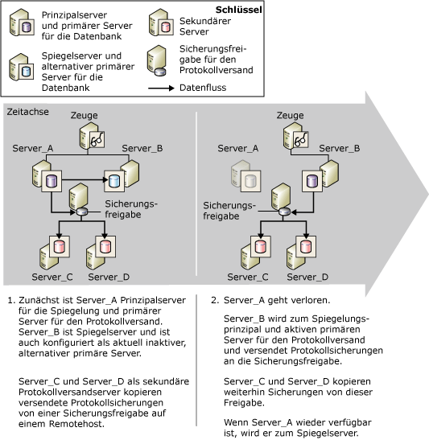

# Datenbankspiegelung und Protokollversand (SQL Server)
[!INCLUDE[appliesto-ss-xxxx-xxxx-xxx-md](../../includes/appliesto-ss-xxxx-xxxx-xxx-md.md)] Für eine Datenbank kann eine Datenbankspiegelung oder ein Protokollversand ausgeführt werden. Datenbankspiegelung und Protokollversand können auch gleichzeitig ausgeführt werden. Bei der Entscheidung für eine Methode sollten Sie Folgendes berücksichtigen:  
  
-   Wie viele Zielserver benötigen Sie?  
  
     Falls Sie nur eine einzige Zieldatenbank benötigen, ist die Datenbankspiegelung die empfohlene Lösung.  
  
     Falls Sie mehrere Zieldatenbanken benötigen, müssen Sie den Protokollversand verwenden, und zwar entweder alleine oder zusammen mit der Datenbankspiegelung. Durch die Kombination dieser Vorgehensweise profitieren Sie von den Vorteilen der Datenbankspiegelung sowie der Unterstützung mehrerer Ziele mithilfe des Protokollversands.  
  
-   Falls Sie das Wiederherstellen von Protokollen für die Zieldatenbank verzögern müssen (um in der Regel Schutz vor logischen Fehlern zu bieten), verwenden Sie den Protokollversand, und zwar entweder alleine oder zusammen mit der Datenbankspiegelung.  
  
 In diesem Thema werden Aspekte für das Kombinieren des Protokollversands und der Datenbankspiegelung behandelt.  
  
> [!NOTE]  
>  Einführungen zu diesen Technologien finden Sie unter [Datenbankspiegelung &#40;SQL Server&#41;](../../database-engine/database-mirroring/database-mirroring-sql-server.md) und [Informationen zum Protokollversand &#40;SQL Server&#41;](../../database-engine/log-shipping/about-log-shipping-sql-server.md).  
  
## Kombinieren von Protokollversand und Datenbankspiegelung  
 Die Prinzipaldatenbank in einer Spiegelungssitzung kann auch als primäre Datenbank bei der Protokollversandkonfiguration dienen, oder umgekehrt, da die Sicherungsfreigabe für den Protokollversand intakt ist. Die Datenbank-Spiegelungssitzung wird in einem beliebigen Betriebsmodus ausgeführt, egal ob synchron (mit der Transaktionssicherheit festgelegt auf FULL) oder asynchron (mit der Transaktionssicherheit festgelegt auf OFF).  
  
> [!NOTE]  
>  Um die Datenbankspiegelung auf einer Datenbank zu verwenden, ist immer das vollständige Wiederherstellungsmodell erforderlich.  
  
 Wenn der Protokollversand und die Datenbankspiegelung kombiniert wird, wird in der Regel die Spiegelungssitzung vor dem Protokollversand eingerichtet, obwohl dies nicht erforderlich ist. Anschließend wird die aktuelle Prinzipaldatenbank als primäre Datenbank für den Protokollversand konfiguriert (die *Prinzipaldatenbank oder primäre Datenbank*), zusammen mit mindestens einer sekundären Remotedatenbank. Außerdem muss die Spiegeldatenbank als primäre Datenbank für den Protokollversand konfiguriert werden (die *Spiegeldatenbank oder primäre Datenbank*). Die sekundären Datenbanken für den Protokollversand sollten auf anderen Serverinstanzen als der Prinzipalserver bzw. der primäre Server oder der Spiegelserver bzw. der primäre Server gespeichert sein.  
  
> [!NOTE]  
>  Die Einstellungen für die Unterscheidung nach Groß-/Kleinschreibung der am Protokollversand beteiligten Server sollten übereinstimmen.  
  
 Während einer Protokollversandsitzung erstellen Sicherungsaufträge in der primären Datenbank Protokollsicherungen in einem Sicherungsordner. Von dort werden die Sicherungen von den Kopieraufträgen der sekundären Server kopiert. Damit die Sicherungs- und Kopieraufträge erfolgreich ausgeführt werden, benötigen sie Zugriff auf den Sicherungsordner des Protokollversands. Zur Optimierung der Verfügbarkeit des primären Servers empfiehlt es sich, den Sicherungsordner in einem freigegebenen Sicherungsspeicherort auf einem separaten Hostcomputer anzulegen. Stellen Sie sicher, dass alle Protokollversandserver, einschließlich des Spiegelservers bzw. des primären Servers, Zugriff auf den freigegebenen Sicherungsspeicherort haben (wird als *Sicherungsfreigabe*bezeichnet).  
  
 Damit der Protokollversand nach einem Failover der Datenbankspiegelung fortgesetzt wird, müssen Sie auch den Spiegelserver als primären Server konfigurieren. Verwenden Sie dabei die gleiche Konfiguration wie für den primären Server in der Prinzipaldatenbank. Die Spiegeldatenbank befindet sich im Wiederherstellungsstatus, wodurch die Sicherungsaufträge am Wiederherstellen des Protokolls in der Spiegeldatenbank gehindert werden. Dadurch wird sichergestellt, dass die Spiegeldatenbank bzw. primäre Datenbank die Prinzipaldatenbank bzw. primäre Datenbank nicht beeinträchtigt, deren Protokollsicherungen aktuell von sekundären Servern kopiert werden. Nach der Ausführung des Sicherungsauftrags für die Spiegeldatenbank bzw. primäre Datenbank protokolliert der Sicherungsauftrag eine Meldung in der**log_shipping_monitor_history_detail** -Tabelle, und der Agentauftrag gibt einen Erfolgsstatus zurück. Dadurch sollen unbegründete Warnungen vermieden werden.  
  
 Die Spiegeldatenbank bzw. primäre Datenbank ist in der Protokollversandsitzung inaktiv. Bei einem Failover der Spiegelung wird die ehemalige Spiegeldatenbank als Prinzipaldatenbank online geschaltet. Nun wird diese Datenbank auch als primäre Datenbank für den Protokollversand aktiviert. Die Sicherungsaufträge für den Protokollversand, die zuvor keinen Protokollversand für diese Datenbank ausführen konnten, starten den Protokollversand. Dagegen wird durch ein Failover die ehemalige Prinzipaldatenbank bzw. die primäre Datenbank zur neuen Spiegeldatenbank bzw. primären Datenbank und sie erhalten den Wiederherstellungsstatus. Für Sicherungsaufträge in dieser Datenbank wird dann keine Protokollsicherung mehr ausgeführt.  
  
> [!NOTE]  
>  Bei einem automatischen Failover erfolgt der Wechsel zur Spiegelrolle, wenn die ehemalige Prinzipaldatenbank bzw. primäre Datenbank wieder an der Spiegelungssitzung teilnimmt.  
  
 Zur Ausführung in einem Modus für hohe Sicherheit mit automatischem Failover wird die Datenbankspiegelungssitzung mit einer zusätzlichen Serverinstanz konfiguriert, die als *Zeuge*bezeichnet wird. Falls die Prinzipaldatenbank aus irgendeinem Grund verloren geht, nachdem die Datenbank synchronisiert wurde, und falls der Spiegelserver und der Zeuge noch miteinander kommunizieren können, wird ein automatisches Failover ausgeführt. Durch ein automatisches Failover übernimmt der Spiegelserver die Prinzipalrolle und die Datenbank wird als Prinzipaldatenbank online geschaltet. Falls der Sicherungsspeicherort für den Protokollversand für den neuen Prinzipalserver bzw. primären Server zugänglich ist, werden von dessen Sicherungsaufträgen Protokollsicherungen an diesen Speicherort gesendet. Mit dem synchronen Modus der Datenbankspiegelung wird sichergestellt, dass die Protokollkette nicht von einem Spiegelungsfailover betroffen ist und dass nur ein gültiges Protokoll wiederhergestellt wird. Die sekundären Server kopieren weiterhin Protokollsicherung, ohne zu wissen, dass eine andere Serverinstanz nun der primäre Server ist.  
  
 Wenn Sie eine lokale Protokollversandüberwachung verwenden, müssen für dieses Szenario keine besonderen Aspekte beachtet werden. Informationen zum Verwenden einer Remoteüberwachungsinstanz für dieses Szenario finden Sie weiter unten im Abschnitt "Auswirkungen der Datenbankspiegelung auf eine Remoteüberwachungsinstanz".  
  
## Failover von der Prinzipaldatenbank zur Spiegeldatenbank  
 Die folgende Abbildung veranschaulicht die Interaktion von Protokollversand und Datenbankspiegelung, wenn die Spiegelung im Modus für hohe Sicherheit mit automatischem Failover ausgeführt wird. Zunächst ist **Server_A** sowohl der Prinzipalserver für die Spiegelung als auch der primäre Server für den Protokollversand. **Server_B** ist der Spiegelserver und ist auch als primärer Server konfiguriert, der derzeit inaktiv ist. **Server_C** und **Server_D** sind sekundäre Protokollversandserver. Zur Optimierung der Verfügbarkeit der Protokollversandsitzung befindet sich der Sicherungsspeicherort in einem Freigabeverzeichnis auf einem separaten Hostcomputer.  
  
   
  
 Nach einem Spiegelungsfailover ist der auf dem sekundären Server definierte Name des primären Servers unverändert. .  
  
## Auswirkungen der Datenbankspiegelung auf eine Remoteüberwachungsinstanz  
 Wenn der Protokollversand mit einer Remoteüberwachungsinstanz verwendet wird, hat das Kombinieren der Protokollversandsitzung und der Datenbankspiegelung Auswirkungen auf die Informationen in den Überwachungstabellen. Die Informationen zum primären Server sind eine Kombination der Informationen, die auf dem Prinzipalserver bzw. primären Server konfiguriert sind, und der auf jedem sekundären Server konfigurierten Überwachung.  
  
 Für eine möglichst nahtlose Überwachung sollten Sie bei Verwendung der Remoteüberwachung den ursprünglichen primären Namen angeben, wenn Sie den primären Server auf dem sekundären Server konfigurieren. Diese Vorgehensweise erleichtert außerdem das Ändern der Protokollversandkonfiguration des Microsoft [!INCLUDE[ssNoVersion](../../includes/ssnoversion-md.md)]-Agents. Weitere Informationen zur Überwachung finden Sie unter [Überwachen des Protokollversands &#40;Transact-SQL&#41;](../../database-engine/log-shipping/monitor-log-shipping-transact-sql.md).  
  
## Einrichten der Kombination aus Spiegelung und Protokollversand  
 Um die Datenbankspiegelung und den Protokollversand gemeinsam einzurichten, sind die folgenden Schritte erforderlich:  
  
1.  Stellen Sie Sicherungen der Prinzipaldatenbank bzw. primären Datenbank mit der Option NORECOVERY auf einer anderen Serverinstanz wieder her, die dann später von der Datenbankspiegelung als Spiegeldatenbank für die Prinzipaldatenbank bzw. primäre Datenbank verwendet wird. Weitere Informationen finden Sie unter [Vorbereiten einer Spiegeldatenbank auf die Spiegelung &#40;SQL Server&#41;](../../database-engine/database-mirroring/prepare-a-mirror-database-for-mirroring-sql-server.md).  
  
2.  Einrichten der Datenbankspiegelung Weitere Informationen finden Sie unter [Einrichten einer Datenbank-Spiegelungssitzung mithilfe der Windows-Authentifizierung &#40;SQL Server Management Studio&#41;](../../database-engine/database-mirroring/establish-database-mirroring-session-windows-authentication.md) oder [Einrichten der Datenbankspiegelung &#40;SQL Server&#41;](../../database-engine/database-mirroring/setting-up-database-mirroring-sql-server.md).  
  
3.  Stellen Sie Sicherungen der Prinzipaldatenbank bzw. primären Datenbank auf anderen Serverinstanzen wieder her, die dann später als sekundäre Datenbanken für den Protokollversand für die primäre Datenbank verwendet werden.  
  
4.  Richten Sie den Protokollversand auf der Prinzipaldatenbank als primäre Datenbank für mindestens eine sekundäre Datenbank ein.  
  
     Sie sollten eine einzige Freigabe als Sicherungsverzeichnis (Sicherungsfreigabe) einrichten. Dadurch ist sichergestellt, dass nach dem Rollenwechsel zwischen dem Prinzipalserver und dem Spiegelserver Sicherungsaufträge weiterhin in dasselbe Verzeichnis wie zuvor schreiben. Eine bewährte Methode besteht darin, sicherzustellen, dass sich diese Freigabe auf einem anderen physischen Server befindet als die Server, auf denen die Datenbanken für die Spiegelung und den Protokollversand bereitgestellt werden.  
  
     Weitere Informationen finden Sie unter [Konfigurieren des Protokollversands &#40;SQL Server&#41;](../../database-engine/log-shipping/configure-log-shipping-sql-server.md).  
  
5.  Manuelles Failover vom Prinzipal zum Spiegel.  
  
     So führen Sie ein manuelles Failover aus:  
  
    -   [Manueller Failover für eine Datenbank-Spiegelungssitzung &#40;SQL Server Management Studio&#41;](../../database-engine/database-mirroring/manually-fail-over-a-database-mirroring-session-sql-server-management-studio.md)  
  
    -   [Ausführen des manuellen Failovers einer Datenbank-Spiegelungssitzung &#40;Transact-SQL&#41;](../../database-engine/database-mirroring/manually-fail-over-a-database-mirroring-session-transact-sql.md)  
  
6.  Richten Sie den Protokollversand für den neuen Prinzipal (zuvor die Spiegelung) als primäre Datenbank ein.  
  
    > [!IMPORTANT]  
    >  Führen Sie kein Setup von einer sekundären Datenbank aus.  
  
     Sie müssen die gleiche Sicherungsfreigabe verwenden, die Sie in Schritt 4 verwendet haben.  
  
     Die Schnittstelle für den **Transaktionsprotokollversand** in [!INCLUDE[ssManStudioFull](../../includes/ssmanstudiofull-md.md)] unterstützt nur eine einzige primäre Datenbank pro Protokollversandkonfiguration. Deshalb müssen Sie gespeicherte Prozeduren zum Einrichten des neuen Prinzipals als primären Server verwenden.  
  
7.  Führen Sie ein weiteres manuelles Failover durch, um zum ursprünglichen Prinzipal zurückzukehren.  
  
  
