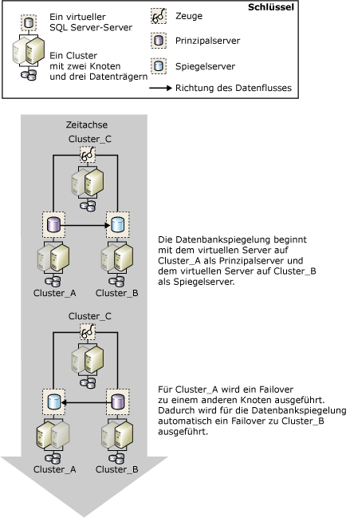

# Datenbankspiegelung und SQL Server-Failoverclusterinstanzen
  Ein Failovercluster ist eine Kombination eines oder mehrerer physischer Datenträger in einer Clustergruppe der [!INCLUDE[msCoName](../../includes/msconame-md.md)]-Clusterdienste (MSCS, Microsoft Cluster Service), auch als Ressourcengruppe bezeichnet, die teilnehmende Knoten des Clusters sind. Die Ressourcengruppe ist als Failoverclusterinstanz konfiguriert, die eine Instanz von [!INCLUDE[ssNoVersion](../../includes/ssnoversion-md.md)] hostet. Eine [!INCLUDE[ssNoVersion](../../includes/ssnoversion-md.md)] -Failoverclusterinstanz wird im Netzwerk wie ein einzelner Computer angezeigt, besitzt jedoch Funktionalität, die ein Failover von einem Knoten zu einem anderen ermöglicht, falls ein Knoten nicht mehr verfügbar ist. Weitere Informationen finden Sie unter [Always On-Failoverclusterinstanzen &#40;SQL Server&#41;](../../sql-server/failover-clusters/windows/always-on-failover-cluster-instances-sql-server.md).  
  
 Failovercluster stellen Unterstützung für hohe Verfügbarkeit für eine gesamte [!INCLUDE[msCoName](../../includes/msconame-md.md)] [!INCLUDE[ssNoVersion](../../includes/ssnoversion-md.md)]-Instanz bereit, während die Datenbankspiegelung Unterstützung für hohe Verfügbarkeit für eine einzelne Datenbank bereitstellt. Datenbankspiegelung kann zwischen Failoverclustern, aber auch zwischen einem Failovercluster und einem nicht zu einem Cluster gehörenden Host ausgeführt werden.  
  
> [!NOTE]  
>  Eine Einführung in die Datenbankspiegelung finden Sie unter [Datenbankspiegelung &#40;SQL Server&#41;](../../database-engine/database-mirroring/database-mirroring-sql-server.md).  
  
## Spiegelung und Clusterunterstützung  
 Wenn die Spiegelung zusammen mit Clustern verwendet wird, befinden sich sowohl der Prinzipalserver als auch der Spiegelserver auf Clustern, wobei der Prinzipalserver auf der Failoverclusterinstanz eines Clusters und der Spiegelserver auf der Failoverclusterinstanz eines anderen Clusters ausgeführt wird. Sie können aber auch eine Spiegelungssitzung einrichten, in der sich ein Partner auf der Failoverclusterinstanz eines Clusters und der andere Partner auf einem separaten, nicht zu einem Cluster gehörenden Computer befindet.  
  
 Wenn durch ein Clusterfailover ein Prinzipalserver vorübergehend nicht verfügbar wird, werden Clientverbindungen mit der Datenbank getrennt. Nach Abschluss des Clusterfailovers können die Clients abhängig vom [Betriebsmodus](../../database-engine/database-mirroring/database-mirroring-operating-modes.md)die Verbindung mit dem Prinzipalserver auf demselben Cluster oder auf einem anderen Cluster bzw. auf einem nicht zu einem Cluster gehörenden Computer wiederherstellen. Wenn Sie entscheiden, wie die Datenbankspiegelung in einer Clusterumgebung konfiguriert werden soll, ist der Betriebsmodus, den Sie für die Spiegelung verwenden, daher von besonderer Bedeutung.  
  
### Hoher Sicherheitsmodus in einer Sitzung mit einem automatischen Failover  
 Wenn Sie beabsichtigen, eine Datenbank in einem hohen Sicherheitsmodus mit einem automatischen Failover zu spiegeln, wird eine Konfiguration mit zwei Clustern für die Partner empfohlen. Diese Konfiguration stellt maximale Verfügbarkeit bereit. Der Zeuge kann sich entweder auf einem dritten Cluster oder auf einem nicht zu einem Cluster gehörenden Computer befinden.  
  
 Wenn der Knoten ausfällt, auf dem der aktuelle Prinzipalserver ausgeführt wird, beginnt innerhalb weniger Sekunden ein automatisches Failover der Datenbank, während für den Cluster noch immer ein Failover zu einem anderen Knoten ausgeführt wird. Für die Datenbank-Spiegelungssitzung wird ein Failover zum Spiegelserver auf dem anderen Cluster bzw. auf einem nicht zu einem Cluster gehörenden Computer ausgeführt, und der ehemalige Spiegelserver wird zum Prinzipalserver. Der neue Prinzipalserver führt so schnell wie möglich ein Rollforward für seine Kopie der Datenbank aus und schaltet sie als Prinzipaldatenbank online. Nach Abschluss des Clusterfailovers, was normalerweise einige Minuten in Anspruch nimmt, wird die Failoverclusterinstanz, die zuvor Prinzipalserver war, zum Spiegelserver.  
  
 In der folgenden Abbildung wird ein automatisches Failover zwischen Clustern in einer Spiegelungssitzung dargestellt, die im Hochsicherheitsmodus mit einem Zeugen (der ein automatisches Failover unterstützt) ausgeführt wird.  
  
   
  
 Die drei Serverinstanzen in der Spiegelungssitzung befinden sich auf drei verschiedenen Clustern: **Cluster_A**, **Cluster_B** und **Cluster_C**. Auf jedem Cluster wird eine Standardinstanz von [!INCLUDE[ssNoVersion](../../includes/ssnoversion-md.md)] als [!INCLUDE[ssNoVersion](../../includes/ssnoversion-md.md)] -Failoverclusterinstanz ausgeführt. Wenn die Spiegelungssitzung beginnt, ist die Failoverclusterinstanz auf **Cluster_A** der Prinzipalserver, die Failoverclusterinstanz auf **Cluster_B** ist der Spiegelserver, und die Failoverclusterinstanz auf **Cluster_C** ist der Zeuge in der Spiegelungssitzung. Schließlich fällt der aktive Knoten auf **Cluster_A** aus, sodass der Prinzipalserver nicht mehr verfügbar ist.  
  
 Bevor der Cluster ein Failover ausführen kann, erkennt der Spiegelserver mithilfe des Zeugen den Ausfall des Prinzipalservers. Der Spiegelserver führt ein Rollforward für seine Datenbank aus und schaltet sie so schnell wie möglich als neue Prinzipaldatenbank online. Wenn das Failover für **Cluster_A** beendet ist, ist der ehemalige Prinzipalserver nun der Spiegelserver und synchronisiert seine Datenbank mit der aktuellen Prinzipaldatenbank auf **Cluster_B**.  
  
### Hoher Sicherheitsmodus in einer Sitzung ohne ein automatisches Failover  
 Wenn Sie eine Datenbank in einem hohen Sicherheitsmodus ohne ein automatisches Failover spiegeln, dient ein anderer Knoten in dem Cluster als Prinzipalserver, wenn der ausgeführte Knoten des aktuellen Prinzipalservers fehlerhaft ist. Beachten Sie, dass die Datenbank nicht verfügbar ist, während der Cluster nicht verfügbar ist.  
  
### Sitzung im Hochleistungsmodus  
 Wenn Sie beabsichtigen, eine Datenbank im Hochleistungsmodus zu spiegeln, sollten Sie den Prinzipalserver auf der Failoverclusterinstanz eines Clusters und den Spiegelserver auf einem nicht zu einem Cluster gehörenden Server an einem Remotestandort ausführen. Wenn für den Cluster ein Failover zu einem anderen Knoten ausgeführt wird, bleibt die Failoverclusterinstanz weiterhin Prinzipalserver in der Spiegelungssitzung. Falls Probleme auftreten, die den gesamten Cluster betreffen, können Sie den Dienst auf dem Spiegelserver erzwingen.  
  
 **So richten Sie einen neuen SQL Server-Failovercluster ein**  
  
-   [Erstellen eines neuen SQL Server-Failoverclusters &#40;Setup&#41;](../../sql-server/failover-clusters/install/create-a-new-sql-server-failover-cluster-setup.md)  
  
 **So richten Sie die Datenbankspiegelung ein**  
  
-   [Einrichten der Datenbankspiegelung &#40;SQL Server&#41;](../../database-engine/database-mirroring/setting-up-database-mirroring-sql-server.md)  
  
-   [Einrichten einer Datenbank-Spiegelungssitzung mithilfe der Windows-Authentifizierung &#40;SQL Server Management Studio&#41;](../../database-engine/database-mirroring/establish database mirroring session - windows authentication.md)  
  
## Siehe auch  
 [Datenbankspiegelung &#40;SQL Server&#41;](../../database-engine/database-mirroring/database-mirroring-sql-server.md)   
 [Betriebsmodi der Datenbankspiegelung](../../database-engine/database-mirroring/database-mirroring-operating-modes.md)   
 [Always On-Failoverclusterinstanzen &#40;SQL Server&#41;](../../sql-server/failover-clusters/windows/always-on-failover-cluster-instances-sql-server.md)  
  
  