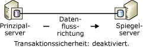
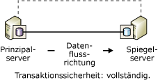

# Betriebsmodi der Datenbankspiegelung
  In diesem Thema werden die synchronen und asynchronen Betriebsmodi für Datenbank-Spiegelungssitzungen beschrieben.  
  
> [!NOTE]  
>  Eine Einführung in die Datenbankspiegelung finden Sie unter [Datenbankspiegelung &#40;SQL Server&#41;](../../database-engine/database-mirroring/database-mirroring-sql-server.md).  
  
 **In diesem Thema:**  
  
-   [Begriffe und Definitionen](#TermsAndDefinitions)  
  
-   [Asynchrone Datenbankspiegelung (Modus für hohe Leistung)](#async)  
  
-   [Synchrone Datenbankspiegelung (Modus für hohe Sicherheit)](#Sync)  
  
-   [Transact-SQL-Einstellungen und Betriebsmodi für die Datenbankspiegelung](#TsqlSettingsAndOpModes)  
  
-   [Verwandte Aufgaben](#RelatedTasks)  
  
##  <a name="TermsAndDefinitions"></a> Begriffe und Definitionen  
 In diesem Abschnitt werden einige Begriffe eingeführt, die für dieses Thema wichtig sind.  
  
 Modus mit hoher Leistung  
 Die Sitzung für die Datenbankspiegelung erfolgt asynchron und verwendet nur den Prinzipalserver und Spiegelserver. Die einzige Art des Rollenwechsels ist der erzwungene Dienst (mit möglichem Datenverlust).  
  
 Modus für hohe Sicherheit  
 Die Sitzung für die Datenbankspiegelung erfolgt synchron und verwendet optional einen Zeugen sowie den Prinzipalserver und Spiegelserver.  
  
 Transaktionssicherheit  
 Entspricht einer spiegelungsspezifischen Datenbankeigenschaft, die bestimmt, ob eine Datenbank-Spiegelungssitzung synchron oder asynchron ausgeführt wird. Es gibt zwei Sicherheitsstufen: FULL und OFF.  
  
 Zeuge  
 Ist nur für den Modus mit hoher Sicherheit bestimmt und entspricht einer optionalen SQL Server-Instanz, durch die der Spiegelserver erkennen kann, ob die Initiierung eines automatischen Failovers auszulösen ist. Im Gegensatz zu den zwei Failoverpartnern bedient der Zeuge nicht die Datenbank. Die Unterstützung des automatischen Failovers ist die einzige Aufgabe des Zeugen.  
  
## Asynchrone Datenbankspiegelung (Modus für hohe Leistung)  
 In diesem Abschnitt werden die Funktionsweise der asynchronen Datenbankspiegelung, die geeignete Verwendung des Modus für hohe Leistung sowie die entsprechende Reaktion auf den Fehlschlag des Prinzipalservers beschrieben.  
  
> [!NOTE]  
>  Die meisten Editionen von [!INCLUDE[ssCurrent](../../includes/sscurrent-md.md)] unterstützen nur die synchrone Datenbankspiegelung (nur SAFETY FULL). Weitere Informationen zu Editionen, die die Datenbankspiegelung vollständig unterstützen, finden Sie unter „Hohe Verfügbarkeit (Always On)“ in [Von den SQL Server 2016-Editionen unterstützte Funktionen](../Topic/Features%20Supported%20by%20the%20Editions%20of%20SQL%20Server%202016.md).  
  
 Wenn die Transaktionssicherheit auf OFF festgelegt ist, wird die Datenbank-Spiegelungssitzung asynchron ausgeführt. Im asynchronen Betrieb wird nur ein Betriebsmodus unterstützt, nämlich der Modus für hohe Leistung. Dieser Modus verbessert die Leistung auf Kosten der hohen Verfügbarkeit. Im Modus für hohe Leistung werden nur der Prinzipalserver und der Spiegelserver verwendet. Probleme auf dem Spiegelserver haben nie Auswirkungen auf den Prinzipalserver. Bei einem Ausfall des Prinzipalservers wird die Spiegeldatenbank als DISCONNECTED gekennzeichnet, steht jedoch als betriebsbereit zur Verfügung.  
  
 Im Modus für hohe Leistung wird nur eine Form des Rollenwechsels unterstützt: erzwungener Dienst (mit möglichem Datenverlust), der den Spiegelserver als betriebsbereiten Standbyserver verwendet. Der erzwungene Dienst ist eine der möglichen Antworten auf einen Fehler des Prinzipalservers. Da Datenverlust möglich ist, sollten Sie andere Alternativen in Betracht ziehen, bevor Sie den erzwungenen Dienst für den Spiegelserver verwenden. Weitere Informationen finden Sie im Abschnitt zu [Antworten auf Fehler des Prinzipalservers](#WhenPrincipalFails)weiter unten in diesem Thema.  
  
 Die folgende Abbildung veranschaulicht die Konfiguration einer Sitzung im Modus für hohe Leistung.  
  
   
  
 Sobald im Modus für hohe Leistung der Prinzipalserver das Protokoll für eine Transaktion an den Spiegelserver sendet, wird vom Prinzipalserver eine Bestätigung an den Client gesendet, ohne auf eine Bestätigung vom Spiegelserver zu warten. Für Transaktionen wird ein Commit ausgeführt, ohne darauf zu warten, dass der Spiegelserver das Protokoll auf dem Datenträger speichert. Im asynchronen Betrieb kann der Prinzipalserver mit minimaler Transaktionslatenzzeit ausgeführt werden.  
  
 Der Spiegelserver versucht mit den Protokolldatensätzen Schritt zu halten, die vom Prinzipalserver gesendet werden. Die Spiegeldatenbank kann sich jedoch in einem gewissen zeitlichen Abstand zur Prinzipaldatenbank befinden, wobei der Abstand zwischen den Datenbanken normalerweise gering ist. Diese Differenz kann jedoch umfangreich werden, wenn der Prinzipalserver stark ausgelastet ist oder wenn der Spiegelserver überlastet ist.  
  
 **In diesem Abschnitt:**  
  
-   [Wann eignet sich der Modus für hohe Leistung?](#WhenUseHighPerf)  
  
-   [Auswirkung eines Zeugen im Modus für hohe Leistung](#WitnessImpactOnHighPerf)  
  
-   [Antworten auf Fehler des Prinzipalservers](#WhenPrincipalFails)  
  
###  <a name="WhenUseHighPerf"></a> Wann eignet sich der Modus für hohe Leistung?  
 Der Modus für hohe Leistung kann bei der Wiederherstellung im Notfall hilfreich sein, wenn der Prinzipalserver und der Spiegelserver durch eine beträchtliche Distanz voneinander getrennt sind und wenn kleine Fehler den Prinzipalserver nicht beeinträchtigen sollen.  
  
> [!NOTE]  
>  Protokollversand kann eine Ergänzung zur Datenbankspiegelung darstellen und ist eine empfehlenswerte Alternative zur asynchronen Datenbankspiegelung. Informationen zu den Vorteilen des Protokollversands finden Sie unter [Lösungen mit hoher Verfügbarkeit &#40;SQL Server&#41;](../../sql-server/failover-clusters/high-availability-solutions-sql-server.md). Informationen zum Verwenden des Protokollversands mit Datenbankspiegelung finden Sie unter [Datenbankspiegelung und Protokollversand &#40;SQL Server&#41;](../../database-engine/database-mirroring/database-mirroring-and-log-shipping-sql-server.md).  
  
###  <a name="WitnessImpactOnHighPerf"></a> Auswirkung eines Zeugen im Modus für hohe Leistung  
 Wenn Sie Transact-SQL zum Konfigurieren des Modus für hohe Leistung verwenden und die SAFETY-Eigenschaft auf OFF festgelegt ist, sollte unbedingt auch für die WITNESS-Eigenschaft OFF festgelegt sein. Ein Zeuge kann im Modus für hohe Leistung vorhanden sein, er stellt jedoch keinen Vorteil, sondern ein Risiko dar.  
  
 Wenn der Zeuge von der Sitzung getrennt wird und einer der Partner ausfällt, ist die Datenbank nicht mehr verfügbar. Dies ist darauf zurückzuführen, dass die Sitzung ein aus mindestens zwei Serverinstanzen bestehendes Quorum benötigt, wenn ein Zeuge festgelegt ist, obwohl der Modus für hohe Leistung keinen Zeugen erfordert. Wenn die Sitzung das Quorum verliert, kann sie die Datenbank nicht bedienen.  
  
 Wenn ein Zeuge in einer Sitzung im Modus für hohe Leistung festgelegt ist, hat das Erzwingen eines Quorums folgende Auswirkungen:  
  
-   Wenn der Spiegelserver ausfällt, muss der Prinzipalserver mit dem Zeugen verbunden sein. Andernfalls schaltet der Prinzipalserver die Datenbank so lange offline, bis entweder der Zeuge oder der Spiegelserver wieder mit der Sitzung verbunden ist.  
  
-   Wenn der Prinzipalserver ausfällt, wird für das Erzwingen des Diensts auf dem Spiegelserver eine Verbindung des Spiegelservers mit dem Zeugen benötigt.  
  
> [!NOTE]  
>  Weitere Informationen zu den Quorumtypen finden Sie unter [Quorum: Auswirkungen eines Zeugen auf die Datenbankverfügbarkeit &#40;Datenbankspiegelung&#41;](../../database-engine/database-mirroring/quorum-how-a-witness-affects-database-availability-database-mirroring.md).  
  
###  <a name="WhenPrincipalFails"></a> Antworten auf Fehler des Prinzipalservers  
 Bei einem Fehler des Prinzipalservers hat der Datenbankbesitzer folgende Möglichkeiten:  
  
-   Die Datenbank nicht verfügbar belassen, bis der Prinzipalserver wieder verfügbar ist.  
  
     Falls die Prinzipaldatenbank und das zugehörige Transaktionsprotokoll intakt sind, werden mit dieser Methode alle Transaktionen, für die ein Commit ausgeführt wurde, auf Kosten der Verfügbarkeit beibehalten.  
  
-   Beenden der Datenbank-Spiegelungssitzung, manuelles Aktualisieren der Datenbank und dann Starten einer neuen Datenbank-Spiegelungssitzung.  
  
     Falls die Prinzipaldatenbank verloren gegangen ist, aber der Prinzipalserver noch ausgeführt wird, versuchen Sie sofort das Protokollfragment in der Prinzipaldatenbank zu sichern. Falls die Sicherung des Protokollfragments erfolgreich ist, ist das Entfernen der Spiegelung vermutlich die beste Alternative. Nachdem Sie die Spiegelung entfernt haben, können Sie das Protokoll in der ehemaligen Spiegeldatenbank wiederherstellen, wodurch alle Daten erhalten bleiben.  
  
    > [!NOTE]  
    >  Falls bei der Sicherung des Protokollfragments ein Fehler auftrat und Sie nicht auf die Wiederherstellung des Prinzipalservers warten können, sollten Sie den Dienst erzwingen. Dies hat den Vorteil, dass der Sitzungsstatus erhalten bleibt.  
  
-   Erzwingen des Dienstes (mit möglichem Datenverlust) auf dem Spiegelserver.  
  
     Das Erzwingen des Dienstes ist ausschließlich eine Maßnahme im Rahmen der Wiederherstellung im Notfall und sollte nur selten verwendet werden. Das Erzwingen des Dienstes ist nur möglich, wenn der Prinzipalserver heruntergefahren ist, es sich um eine asynchrone Sitzung handelt (die Transaktionssicherheit ist auf OFF festgelegt) und die Sitzung keinen Zeugen aufweist (WITNESS ist auf OFF festgelegt) oder der Zeuge mit dem Spiegelserver verbunden ist (er also ein Quorum besitzt).  
  
     Durch das Erzwingen des Dienstes nimmt der Spiegelserver die Rolle des Prinzipalservers an und bietet die Datenbankkopie den Clients an. Wenn der Dienst erzwungen wird, gehen alle Transaktionsprotokolle verloren, die der Prinzipalserver noch nicht an den Spiegelserver gesendet hat. Deshalb sollten Sie das Erzwingen des Dienstes für Situationen vorbehalten, in denen ein möglicher Datenverlust akzeptabel ist und die sofortige Verfügbarkeit der Datenbank von entscheidender Bedeutung ist. Informationen zur Funktionsweise des erzwungenen Diensts und zu bewährten Methoden für dessen Verwendung finden Sie unter [Rollenwechsel während einer Datenbank-Spiegelungssitzung &#40;SQL Server&#41;](../../database-engine/database-mirroring/role-switching-during-a-database-mirroring-session-sql-server.md).  
  
##  <a name="Sync"></a> Synchrone Datenbankspiegelung (Modus für hohe Sicherheit)  
 In diesem Abschnitt wird die Funktionsweise der synchronen Datenbankspiegelung beschrieben, einschließlich der alternativen Modi für hohe Sicherheit (mit automatischem Failover und ohne automatischem Failover). Außerdem enthält der Abschnitt Informationen zur Rolle des Zeugen beim automatischen Failover.  
  
 Wenn die Transaktionssicherheit auf FULL festgelegt ist, wird die Datenbank-Spiegelungssitzung im Modus für hohe Sicherheit und – nach einer Synchronisierungsphase zu Beginn – synchron ausgeführt. In diesem Abschnitt werden die Details der Datenbank-Spiegelungssitzungen beschrieben, die für den synchronen Vorgang konfiguriert werden.  
  
 Um einen synchronen Vorgang für eine Sitzung zu erreichen, muss der Spiegelserver die Spiegeldatenbank mit der Prinzipaldatenbank synchronisieren. Wenn die Sitzung startet, beginnt der Prinzipalserver damit, sein aktives Protokoll an den Spiegelserver zu senden. Der Spiegelserver schreibt so schnell wie möglich alle eingehenden Protokolldatensätze auf den Datenträger. Sobald alle empfangenen Protokolldatensätze auf den Datenträger geschrieben wurden, werden die Datenbanken synchronisiert. Solange die Partner kommunizieren, verbleiben die Datenbanken synchronisiert.  
  
> [!NOTE]  
>  Verwenden Sie zum Überwachen von Statusänderungen in einer Datenbank-Spiegelungssitzung die **Database Mirroring State Change** -Ereignisklasse. Weitere Informationen finden Sie unter [Database Mirroring State Change Event Class](../../relational-databases/event-classes/database-mirroring-state-change-event-class.md).  
  
 Nach Abschluss der Synchronisierung wird für jede Transaktion, für die auf der Prinzipaldatenbank ein Commit ausgeführt wurde, auch auf dem Spiegelserver ein Commit ausgeführt, um den Schutz der Daten sicherzustellen. Dies wird erreicht, indem erst dann ein Commit für eine Transaktion auf der Prinzipaldatenbank ausgeführt wird, wenn der Prinzipalserver eine Meldung vom Spiegelserver empfängt, die besagt, dass das Protokoll der Transaktion auf den Datenträger geschrieben wurde. Beachten Sie, dass die Latenzzeit für diese Meldung die Latenzzeit für die Transaktion verlängert.  
  
 Die für die Synchronisierung benötigte Zeit hängt in hohem Maße davon ab, wie weit die Spiegeldatenbank zu Beginn der Sitzung gegenüber der Prinzipaldatenbank zurücklag (gemessen an der Anzahl der Protokolldatensätze, die anfänglich vom Prinzipalserver empfangen wurden), sowie von der Arbeitsauslastung auf der Prinzipaldatenbank und der Geschwindigkeit des Spiegelsystems. Nachdem eine Sitzung synchronisiert wurde, verbleibt das festgeschriebene Protokoll, das noch auf der Spiegeldatenbank wiederholt werden muss, in der Wiederholungswarteschlange.  
  
 Sobald die Spiegeldatenbank synchronisiert ist, wird der Status beider Kopien der Datenbank in SYNCHRONIZED geändert.  
  
 Die synchrone Operation wird wie folgt beibehalten:  
  
1.  Der Prinzipalserver schreibt das Protokoll für die Transaktion in das Transaktionsprotokoll, sobald er eine Transaktion von einem Client erhält.  
  
2.  Der Prinzipalserver schreibt die Transaktion in die Datenbank und sendet gleichzeitig den Protokolldatensatz an den Spiegelserver. Der Prinzipalserver wartet auf eine Bestätigung vom Spiegelserver, bevor er dem Client eine der folgenden Aktionen bestätigt: einen Transaktionscommit oder ein Rollback.  
  
3.  Der Spiegelserver schreibt das Protokoll auf den Datenträger und gibt eine Bestätigung an den Prinzipalserver zurück.  
  
4.  Sobald er die Bestätigung vom Spiegelserver erhält, sendet der Prinzipalserver eine Bestätigungsmeldung an den Client.  
  
 Im Modus für hohe Sicherheit werden Ihre Daten dadurch geschützt, dass die an zwei Stellen vorhandenen Daten synchronisiert werden müssen. Es ist sichergestellt, dass alle Transaktionen, für die ein Commit ausgeführt wurde, auf dem Spiegelserver auf den Datenträger geschrieben werden.  
  
 **In diesem Abschnitt:**  
  
-   [Modus für hohe Sicherheit ohne automatisches Failover](#HighSafetyWithOutAutoFailover)  
  
-   [Modus für hohe Sicherheit mit automatischem Failover](#HighSafetyWithAutoFailover)  
  
###  <a name="HighSafetyWithOutAutoFailover"></a> Modus für hohe Sicherheit ohne automatisches Failover  
 Die folgende Abbildung veranschaulicht die Konfiguration des Modus für hohe Sicherheit ohne automatisches Failover. Die Konfiguration besteht nur aus den zwei Partnern.  
  
   
  
 Wenn die Partner verbunden sind und die Datenbank bereits synchronisiert ist, wird das manuelle Failover unterstützt. Wenn die Spiegelserverinstanz ausfällt, bleibt die Prinzipalserverinstanz in Betrieb und wird ungeschützt ausgeführt (d. h., ohne die Spiegelung der Daten). Wenn der Prinzipalserver ausfällt, wird die Spiegelung unterbrochen, der Dienst kann aber auf dem Spiegelserver erzwungen werden (mit möglichem Datenverlust). Weitere Informationen finden Sie unter [Rollenwechsel während einer Datenbank-Spiegelungssitzung &#40;SQL Server&#41;](../../database-engine/database-mirroring/role-switching-during-a-database-mirroring-session-sql-server.md).  
  
###  <a name="HighSafetyWithAutoFailover"></a> Modus für hohe Sicherheit mit automatischem Failover  
 Automatisches Failover bietet eine hohe Verfügbarkeit, indem sichergestellt wird, dass die Datenbank trotz Ausfall eines Servers weiterhin bedient wird. Zur Unterstützung eines automatischen Failovers muss die Sitzung eine dritte Serverinstanz besitzen, den *Zeugen*, der sich idealerweise auf einem dritten Computer befindet. Die folgende Abbildung veranschaulicht die Konfiguration einer Sitzung im Modus für hohe Sicherheit mit automatischem Failover.  
  
   
  
 Im Gegensatz zu den beiden Partnern stellt der Zeuge die Datenbank nicht bereit. Der Zeuge unterstützt das automatische Failover einfach dadurch, dass er prüft, ob der Prinzipalserver aktiv und funktionsfähig ist. Der Spiegelserver initiiert das automatische Failover nur, wenn der Spiegel und der Zeuge miteinander verbunden bleiben, nachdem beide vom Prinzipalserver getrennt wurden.  
  
 Wenn ein Zeuge festgelegt ist, benötigt die Sitzung das *Quorum*– eine Beziehung zwischen mindestens zwei Serverinstanzen, damit die Datenbank verfügbar gemacht werden kann. Weitere Informationen finden Sie unter [Datenbank-Spiegelungszeuge](../../database-engine/database-mirroring/database-mirroring-witness.md) und [Quorum: Auswirkungen eines Zeugen auf die Datenbankverfügbarkeit &#40;Datenbankspiegelung&#41;](../../database-engine/database-mirroring/quorum-how-a-witness-affects-database-availability-database-mirroring.md).  
  
 Für automatisches Failover müssen folgende Bedingungen erfüllt sein:  
  
-   Die Datenbank ist bereits synchronisiert.  
  
-   Der Fehler tritt auf, während alle drei Serverinstanzen verbunden sind und der Zeugenserver und der Spiegelserver verbunden bleiben.  
  
 Der Verlust eines Partners hat folgenden Effekt:  
  
-   Wenn der Prinzipalserver unter den oben aufgeführten Bedingungen ausfällt, findet ein automatisches Failover statt. Der Spiegelserver wechselt in die Rolle des Prinzipals und bietet seine Datenbank als Prinzipaldatenbank an.  
  
-   Wenn der Prinzipalserver ausfällt, da diese Bedingungen nicht erfüllt sind, kann die Ausführung des Diensts (mit möglichem Datenverlust) gegebenenfalls erzwungen werden. Weitere Informationen finden Sie unter [Rollenwechsel während einer Datenbank-Spiegelungssitzung &#40;SQL Server&#41;](../../database-engine/database-mirroring/role-switching-during-a-database-mirroring-session-sql-server.md).  
  
-   Wenn nur der Spiegelserver nicht mehr verfügbar ist, setzen der Prinzipal und der Zeuge ihren Betrieb fort.  
  
 Wenn die Sitzung ihren Zeugen verliert, sind für das Quorum beide Partner erforderlich. Wenn einer der Partner das Quorum verliert, verlieren beide Partner das Quorum, und die Datenbank ist erst dann wieder verfügbar, wenn das Quorum erneut hergestellt worden ist. Durch diese Quorumanforderung wird sichergestellt, dass die Datenbank in Abwesenheit eines Zeugen niemals *ungeschützt*(d. h., ohne gespiegelt zu werden) ausgeführt wird.  
  
> [!NOTE]  
>  Wenn zu erwarten ist, dass der Zeuge für einen signifikanten Zeitraum getrennt bleiben wird, sollten Sie den Zeugen vorübergehend aus der Sitzung entfernen, bis er wieder verfügbar ist.  
  
##  <a name="TsqlSettingsAndOpModes"></a> Transact-SQL-Einstellungen und Betriebsmodi für die Datenbankspiegelung  
 In diesem Abschnitt wird eine Datenbank-Spiegelungssitzung im Hinblick auf die ALTER DATABASE-Einstellungen und die Status der gespiegelten Datenbank und des Zeugen (sofern vorhanden) beschrieben. Der Abschnitt ist für Benutzer bestimmt, die Datenbankspiegelungen primär oder ausschließlich mit [!INCLUDE[tsql](../../includes/tsql-md.md)]anstelle von [!INCLUDE[ssManStudioFull](../../includes/ssmanstudiofull-md.md)]verwalten.  
  
> [!TIP]  
>  Als Alternative zu [!INCLUDE[tsql](../../includes/tsql-md.md)]können Sie den Betriebsmodus einer Sitzung im Objekt-Explorer mithilfe der Seite **Spiegelung** des Dialogfelds **Datenbankeigenschaften** steuern. Weitere Informationen finden Sie unter [Einrichten einer Datenbank-Spiegelungssitzung mithilfe der Windows-Authentifizierung &#40;SQL Server Management Studio&#41;](../../database-engine/database-mirroring/establish database mirroring session - windows authentication.md).  
  
 **In diesem Abschnitt:**  
  
-   [Auswirkungen der Transaktionssicherheit und des Zeugenstatus auf den Betriebsmodus](#TxnSafetyAndWitness)  
  
-   [Anzeigen der Sicherheitseinstellung und des Status des Zeugen](#ViewWitness)  
  
-   [Faktoren, die sich auf das Verhalten beim Verlust des Prinzipalservers auswirken](#FactorsOnLossOfPrincipal)  
  
###  <a name="TxnSafetyAndWitness"></a> Auswirkungen der Transaktionssicherheit und des Zeugenstatus auf den Betriebsmodus  
 Der Betriebsmodus einer Sitzung wird durch die Kombination ihrer Transaktionssicherheitseinstellungen und dem Status des Zeugen bestimmt. Der Datenbankbesitzer kann jederzeit die Transaktionssicherheitsstufe ändern und den Zeugen hinzufügen oder entfernen.  
  
 **In diesem Abschnitt:**  
  
-   [Transaktionssicherheit](#TxnSafety)  
  
-   [Zeugenstatus](#WitnessState)  
  
####  <a name="TxnSafety"></a> Transaktionssicherheit  
 Bei der Transaktionssicherheit handelt es sich um eine spiegelungsspezifische Datenbankeigenschaft, die bestimmt, ob eine Datenbank-Spiegelungssitzung synchron oder asynchron betrieben wird. Es gibt zwei Sicherheitsstufen: FULL und OFF.  
  
-   SAFETY FULL  
  
     Durch die vollständige Transaktionssicherheit wird die Sitzung synchron im Modus mit hoher Leistung ausgeführt. Wenn ein Zeuge vorhanden ist, unterstützt die Sitzung ein automatisches Failover.  
  
     Wenn Sie mithilfe von ALTER DATABASE-Anweisungen eine Sitzung einrichten, wird die Sitzung mit der SAFETY-Einstellung FULL begonnen. Die Sitzung startet also im Modus mit hoher Sicherheit. Nachdem die Sitzung begonnen hat, können Sie einen Zeugen hinzufügen.  
  
     Weitere Informationen finden Sie unter [Synchrone Datenbankspiegelung (Modus für hohe Sicherheit)](#Sync) (zuvor in diesem Thema beschrieben).  
  
-   SAFETY OFF  
  
     Durch das Deaktivieren der Transaktionssicherheit wird die Sitzung asynchron im Modus mit hoher Leistung betrieben. Wenn die SAFETY-Eigenschaft auf OFF festgelegt ist, sollte die WITNESS-Eigenschaft ebenfalls auf OFF festgelegt werden (Standardeinstellung). Informationen zur Auswirkung der Zeugenoption im Modus für hohe Leistung finden Sie im Abschnitt [Der Zeugenstatus](#WitnessState) weiter unten in diesem Thema. Weitere Informationen zum Ausführen mit deaktivierter Transaktionssicherheit finden Sie unter [Asynchrone Datenbankspiegelung (Modus für hohe Leistung)](#async) (zuvor in diesem Thema beschrieben).  
  
 Die Transaktionssicherheitseinstellung der Datenbank wird auf jedem Partner in der **sys.database_mirroring**-Katalogsicht in der **mirroring_safety_level**-Spalte und der **mirroring_safety_level_desc**-Spalte aufgezeichnet. Weitere Informationen finden Sie unter [sys.database_mirroring &#40;Transact-SQL&#41;](../../relational-databases/system-catalog-views/sys-database-mirroring-transact-sql.md).  
  
 Der Datenbankbesitzer kann die Transaktionssicherheitsstufe jederzeit ändern.  
  
####  <a name="WitnessState"></a> Der Zeugenstatus  
 Wenn ein Zeuge festgelegt wurde, ist ein Quorum erforderlich, sodass der Zeugenstatus stets wichtig ist.  
  
 Falls er vorhanden ist, weist der Zeuge einen von zwei Status auf:  
  
-   Wenn der Zeuge über eine Verbindung zu einem Partner verfügt, ist der Zeuge relativ zu diesem Partner im Status CONNECTED und verfügt über ein Quorum mit diesem Partner. In diesem Fall kann die Datenbank verfügbar gemacht werden, auch wenn einer der Partner nicht verfügbar ist.  
  
-   Wenn der Zeuge vorhanden ist, aber über keine Verbindung zu einem Partner verfügt, ist der Zeuge relativ zu diesem Partner im Status UNKOWN oder DISCONNECTED. In diesem Fall verfügt der Zeuge über kein Quorum in Bezug auf diesen Partner, und wenn die Partner nicht miteinander verbunden sind, ist die Datenbank nicht mehr verfügbar.  
  
 Weitere Informationen zum Quorum finden Sie unter [Quorum: Auswirkungen eines Zeugen auf die Datenbankverfügbarkeit &#40;Datenbankspiegelung&#41;](../../database-engine/database-mirroring/quorum-how-a-witness-affects-database-availability-database-mirroring.md).  
  
 Der Status jedes Zeugen auf einer Serverinstanz wird in der **sys.database_mirroring**-Katalogsicht in den Spalten **mirroring_witness_state** und **mirroring_witness_state_desc** aufgezeichnet. Weitere Informationen finden Sie unter [sys.database_mirroring &#40;Transact-SQL&#41;](../../relational-databases/system-catalog-views/sys-database-mirroring-transact-sql.md).  
  
 Die folgende Tabelle bietet eine Übersicht darüber, wie der Betriebsmodus einer Sitzung von ihren Transaktionssicherheitseinstellungen und dem Zeugenstatus abhängt.  
  
|Betriebsmodus|Transaktionssicherheit|Zeugenstatus|  
|--------------------|------------------------|-------------------|  
|Modus mit hoher Leistung|OFF|NULL (kein Zeuge)**|  
|Der Modus mit hoher Sicherheit ohne automatisches Failover|FULL|NULL (kein Zeuge)|  
|Modus für hohe Sicherheit mit automatischem Failover*|FULL|CONNECTED|  
  
 *Wenn der Zeuge getrennt wird, sollten Sie WITNESS auf OFF festlegen, bis die Serverinstanz des Zeugen wieder verfügbar ist.  
  
 **Wenn ein Zeuge im Modus für hohe Leistung vorhanden ist, nimmt er nicht an der Sitzung teil. Um die Datenbank verfügbar zu machen, müssen jedoch eine Verbindung mit mindestens zwei Serverinstanzen bestehen bleiben. Daher wird empfohlen, die WITNESS-Eigenschaft in Sitzungen im Modus für hohe Leistung auf OFF festgelegt zu lassen. Weitere Informationen finden Sie unter [Quorum: Auswirkungen eines Zeugen auf die Datenbankverfügbarkeit &#40;Datenbankspiegelung&#41;](../../database-engine/database-mirroring/quorum-how-a-witness-affects-database-availability-database-mirroring.md).  
  
###  <a name="ViewWitness"></a> Anzeigen der Sicherheitseinstellung und des Status des Zeugen  
 Verwenden Sie zum Anzeigen der Sicherheitseinstellung und des Status des Zeugen für eine Datenbank die **sys.database_mirroring**-Katalogsicht. Die wichtigen Spalten sind die folgenden:  
  
|Faktor|Spalten|Beschreibung|  
|------------|-------------|-----------------|  
|Transaktionssicherheit|**mirroring_safety_level** oder **mirroring_safety_level_desc**|Transaktionssicherheitseinstellung für Updates der Spiegeldatenbank:<br /><br /> UNKNOWN<br /><br /> OFF<br /><br /> FULL<br /><br /> NULL= Datenbank ist nicht online.|  
|Ist ein Zeuge vorhanden?|**mirroring_witness_name**|Servername des Datenbankspiegelungszeugen oder NULL. Damit wird angegeben, das kein Zeuge vorhanden ist.|  
|Zeugenstatus|**mirroring_witness_state** oder **mirroring_witness_state_desc**|Zeugenstatus in der Datenbank auf einem gegebenen Partner:<br /><br /> UNKNOWN<br /><br /> CONNECTED<br /><br /> DISCONNECTED<br /><br /> NULL = Es ist kein Zeuge vorhanden, oder die Datenbank ist nicht online.|  
  
 Geben Sie beispielsweise auf dem Prinzipal- oder Spiegelserver Folgendes ein:  
  
```  
SELECT mirroring_safety_level_desc, mirroring_witness_name, mirroring_witness_state_desc FROM sys.database_mirroring  
```  
  
 Weitere Informationen zu dieser Katalogsicht finden Sie unter [sys.database_mirroring &#40;Transact-SQL&#41;](../../relational-databases/system-catalog-views/sys-database-mirroring-transact-sql.md).  
  
###  <a name="FactorsOnLossOfPrincipal"></a> Faktoren, die sich auf das Verhalten beim Verlust des Prinzipalservers auswirken  
 Die folgende Tabelle bietet eine Übersicht über die kombinierten Auswirkungen der Transaktionssicherheitseinstellung, des Status der Datenbank sowie des Zeugenstatus auf das Verhalten einer Spiegelungssitzung beim Verlust des Prinzipalservers.  
  
|Transaktionssicherheit|Gespiegelter Status der gespiegelten Datenbank|Zeugenstatus|Verhalten beim Verlust des Prinzipals|  
|------------------------|----------------------------------------|-------------------|-------------------------------------|  
|FULL|SYNCHRONIZED|CONNECTED|Automatisches Failover tritt auf.|  
|FULL|SYNCHRONIZED|DISCONNECTED|Der Spiegelserver wird beendet, Failover ist nicht möglich, und die Datenbank kann nicht zur Verfügung gestellt werden.|  
|OFF|SUSPENDED oder DISCONNECTED|NULL (kein Zeuge)|Die Ausführung des Diensts wird auf dem Spiegelserver erzwungen (mit möglichem Datenverlust).|  
|FULL|SYNCHRONIZING oder SUSPENDED|NULL (kein Zeuge)|Die Ausführung des Diensts wird auf dem Spiegelserver erzwungen (mit möglichem Datenverlust).|  
  
##  <a name="RelatedTasks"></a> Verwandte Aufgaben  
  
-   [Hinzufügen oder Ersetzen eines Datenbank-Spiegelungszeugen &#40;SQL Server Management Studio&#41;](../../database-engine/database-mirroring/add-or-replace-a-database-mirroring-witness-sql-server-management-studio.md)  
  
-   [Einrichten einer Datenbank-Spiegelungssitzung mithilfe der Windows-Authentifizierung &#40;SQL Server Management Studio&#41;](../../database-engine/database-mirroring/establish database mirroring session - windows authentication.md)  
  
-   [Hinzufügen eines Zeugen für die Datenbankspiegelung mithilfe der Windows-Authentifizierung &#40;Transact-SQL&#41;](../../database-engine/database-mirroring/add-a-database-mirroring-witness-using-windows-authentication-transact-sql.md)  
  
-   [Entfernen des Zeugen aus einer Datenbank-Spiegelungssitzung &#40;SQL Server&#41;](../../database-engine/database-mirroring/remove-the-witness-from-a-database-mirroring-session-sql-server.md)  
  
-   [Ändern der Transaktionssicherheit in einer Datenbank-Spiegelungssitzung &#40;Transact-SQL&#41;](../../database-engine/database-mirroring/change-transaction-safety-in-a-database-mirroring-session-transact-sql.md)  
  
## Siehe auch  
 [Überwachen der Datenbankspiegelung &#40;SQL Server&#41;](../../database-engine/database-mirroring/monitoring-database-mirroring-sql-server.md)   
 [Datenbank-Spiegelungszeuge](../../database-engine/database-mirroring/database-mirroring-witness.md)  
  
  