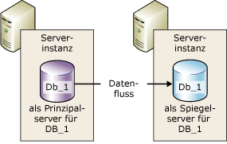
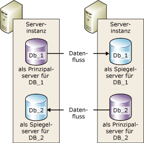

# Datenbankspiegelung (SQL Server)
[!INCLUDE[appliesto-ss-xxxx-xxxx-xxx-md](../../includes/appliesto-ss-xxxx-xxxx-xxx-md.md)]
    
> [!NOTE]  
>  [!INCLUDE[ssNoteDepFutureAvoid](../../includes/ssnotedepfutureavoid-md.md)] Verwenden Sie stattdessen [!INCLUDE[ssHADR](../../includes/sshadr-md.md)].  
  
 Die*Datenbankspiegelung* ist eine Lösung zum Verbessern der Verfügbarkeit einer [!INCLUDE[ssNoVersion](../../includes/ssnoversion-md.md)] -Datenbank. Die Datenbankspiegelung wird auf Datenbankbasis implementiert und ist nur für Datenbanken mit dem vollständigen Wiederherstellungsmodell geeignet.  
  
> [!IMPORTANT]  
>  Informationen zur Unterstützung der Datenbankspiegelung, zu Einschränkungen, zu Voraussetzungen und zu Empfehlungen für die Konfiguration von Partnerservern sowie für die Bereitstellung der Datenbankspiegelung finden Sie unter [Voraussetzungen, Einschränkungen und Empfehlungen für die Datenbankspiegelung](../../database-engine/database-mirroring/prerequisites-restrictions-and-recommendations-for-database-mirroring.md).  
  
  
##   Vorteile der Datenbankspiegelung  
 Die Datenbankspiegelung ist eine einfache Strategie, die folgende Vorteile bietet:  
  
-   Erhöht die Verfügbarkeit einer Datenbank.  
  
     Im Falle eines unvorhersehbaren Zwischenfalls wird beim Modus für hohe Sicherheit mit automatischem Failover die Standbykopie der Datenbank (ohne Datenverlust) rasch online gebracht. In den anderen Betriebsmodi hat der Datenbankadministrator die Möglichkeit, den Dienst (mit möglichem Datenverlust) für die Standbykopie der Datenbank zu erzwingen. Weitere Informationen finden Sie weiter unten in diesem Thema unter [Rollenwechsel](#RoleSwitching).  
  
-   Erhöht den Datenschutz.  
  
     Die Datenbankspiegelung bietet eine vollständige oder nahezu vollständige Datenredundanz, abhängig davon, ob es sich beim Betriebsmodus um den Modus für hohe Sicherheit oder den Modus für hohe Leistung handelt. Weitere Informationen finden Sie später in diesem Thema unter [Betriebsmodi](#OperatingModes).  
  
     Ein Datenbank-Spiegelungspartner, der unter [!INCLUDE[ssEnterpriseEd10](../../includes/ssenterpriseed10-md.md)] oder einer höheren Version ausgeführt wird, versucht automatisch, bestimmte Fehlertypen zu beheben, die das Lesen einer Datenseite verhindern. Der Partner, der eine Seite nicht lesen kann, fordert vom anderen Partner eine neue Kopie an. Ist diese Anforderung erfolgreich, wird die nicht lesbare Seite durch die Kopie ersetzt. Dadurch kann der Fehler normalerweise behoben werden. Weitere Informationen finden Sie weiter unten in diesem Thema unter [Automatische Seitenreparatur &#40;Verfügbarkeitsgruppen: Datenbankspiegelung&#41;](../../sql-server/failover-clusters/automatic-page-repair-availability-groups-database-mirroring.md).  
  
-   Verbessert die Verfügbarkeit der Produktionsdatenbank bei Upgrades.  
  
     Um Ausfallzeiten für eine gespiegelte Datenbank zu minimieren, können Sie sequenziell die [!INCLUDE[ssNoVersion](../../includes/ssnoversion-md.md)] -Instanzen aktualisieren, die die Failoverpartner hosten. Auf diese Weise kommt es nur bei einem Failover zu einer Ausfallzeit. Diese Art des Upgrades wird als *paralleles Upgrade*bezeichnet. Weitere Informationen finden Sie unter [Upgrading Mirrored Instances](../../database-engine/database-mirroring/upgrading-mirrored-instances.md).  
  
  
##   Begriffe und Definitionen zur Datenbankspiegelung  
 Automatisches Failover  
 Entspricht dem Prozess, bei dem im Fall eines Ausfalls des Prinzipalservers der Spiegelserver die Rolle des Prinzipalservers übernimmt und die zugehörige Kopie der Datenbank als Prinzipaldatenbank online zur Verfügung gestellt wird.  
  
 Failoverpartner  
 Entspricht den zwei Serverinstanzen (Prinzipalserver bzw. Spiegelserver), die als Rollenwechselpartner für eine gespiegelte Datenbank fungieren.  
  
 Erzwungener Dienst  
 Entspricht einem Failover, der vom Datenbankinhaber initiiert wird. Dies erfolgt im Fall eines Fehlers des Prinzipalservers, bei dem Dienste an die Spiegeldatenbank übertragen werden, während sie sich in einem unbekannten Status befindet.  
  
 Modus mit hoher Leistung  
 Die Sitzung für die Datenbankspiegelung erfolgt asynchron und verwendet nur den Prinzipalserver und Spiegelserver. Die einzige Art des Rollenwechsels ist der erzwungene Dienst (mit möglichem Datenverlust).  
  
 Modus für hohe Sicherheit  
 Die Sitzung für die Datenbankspiegelung erfolgt synchron und verwendet optional einen Zeugen sowie den Prinzipalserver und Spiegelserver.  
  
 Manuelles Failover  
 Entspricht einem Failover, das vom Datenbankbesitzer initiiert wird, während der Prinzipalserver weiter ausgeführt wird, und das Dienste von der Prinzipaldatenbank an die Spiegeldatenbank überträgt, während die beiden Datenbanken in synchronisiertem Zustand sind.  
  
 Spiegeldatenbank  
 Steht für die Kopie der Datenbank, die in der Regel vollständig mit der Prinzipaldatenbank synchronisiert wird.  
  
 Spiegelserver  
 Entspricht in einer Datenbank-Spiegelungskonfiguration der Serverinstanz, auf der sich die Spiegeldatenbank befindet.  
  
 Prinzipaldatenbank  
 Steht im Fall der Datenbankspiegelung für eine Datenbank mit Lese-/Schreibzugriff, deren Transaktionsprotokoll-Datensätze für eine schreibgeschützte Datenbankkopie (eine Spiegeldatenbank) übernommen werden.  
  
 Prinzipalserver  
 Bei der Datenbankspiegelung der Partner, dessen Datenbank derzeit die Prinzipaldatenbank ist.  
  
 Wiederholungswarteschlange  
 Steht für empfangene Transaktionsprotokoll-Datensätze, die auf dem Datenträger eines Spiegelservers warten.  
  
 Rolle (role)  
 Der Prinzipalserver und Spiegelserver führen komplementäre Prinzipal- und Spiegelungsrollen aus. Von einer dritten Serverinstanz wird optional die Rolle des Zeugen übernommen.  
  
 Rollenwechsel  
 Entspricht der Übernahme der Prinzipalrolle durch den Spiegelserver.  
  
 Sendewarteschlange  
 Entspricht nicht gesendeten Transaktionsprotokoll-Datensätzen, die auf dem Protokolldatenträger des Prinzipalservers gesammelt wurden.  
  
 Sitzung  
 Entspricht der Beziehung, die bei der Datenbankspiegelung zwischen dem Prinzipalserver, Spiegelserver und ggf. dem Zeugenserver (sofern vorhanden) auftritt.  
  
 Entspricht nach dem Start oder Fortsetzen einer Spiegelungssitzung dem Prozess, durch den Protokolldatensätze der Prinzipaldatenbank, die sich auf dem Prinzipalserver angesammelt haben, an den Spiegelserver gesendet werden. Der Spiegelserver schreibt diese Protokolldatensätze so schnell wie möglich auf den Datenträger, um wieder auf den Stand des Prinzipalservers zu kommen.  
  
 Transaktionssicherheit  
 Entspricht einer spiegelungsspezifischen Datenbankeigenschaft, die bestimmt, ob eine Datenbank-Spiegelungssitzung synchron oder asynchron ausgeführt wird. Es gibt zwei Sicherheitsstufen: FULL und OFF.  
  
 Zeuge  
 Ist nur für den Modus mit hoher Sicherheit bestimmt und entspricht einer optionalen SQL Server-Instanz, durch die der Spiegelserver den Zeitpunkt für die Initiierung eines automatischen Failovers erkennen kann. Im Gegensatz zu den zwei Failoverpartnern bedient der Zeuge nicht die Datenbank. Die Unterstützung des automatischen Failovers ist die einzige Aufgabe des Zeugen.  
  
  
##   Übersicht über die Datenbankspiegelung  
 Die Datenbankspiegelung verwaltet zwei Kopien einer Datenbank, die sich auf verschiedenen Serverinstanzen von [!INCLUDE[ssDEnoversion](../../includes/ssdenoversion-md.md)]befinden müssen. In der Regel befinden sich diese Serverinstanzen auf Computern an verschiedenen Standorten. Durch das Starten einer Datenbankspiegelung auf einer Datenbank wird eine Beziehung zwischen den beiden Serverinstanzen initiiert, die als *Datenbank-Spiegelungssitzung*bekannt ist.  
  
 Eine Serverinstanz liefert die Daten der Datenbank an Clients. Dies ist der *Prinzipalserver*. Die andere Instanz fungiert je nach Konfiguration und Status der Spiegelungssitzung als (unmittelbar) betriebsbereiter Standbyserver ( *Spiegelserver*). Wird eine Datenbankspiegelungssitzung synchronisiert, stellt die Datenbankspiegelung einen unmittelbar betriebsbereiten Standbyserver bereit, der schnelle Failover unterstützt, ohne dass Daten aus Transaktionen, für die ein Commit ausgeführt wurde, verloren gehen. Wird die Sitzung nicht synchronisiert, steht der Spiegelserver in der Regel als betriebsbereiter Standbyserver zur Verfügung (bei möglichem Datenverlust).  
  
 Der Prinzipal- und der Spiegelserver kommunizieren und kooperieren als *Partner* in einer *Datenbank-Spiegelungssitzung*. Die beiden Partner führen sich ergänzende Rollen für die Sitzung aus: die *Prinzipalrolle* und die *Spiegelrolle*. Ein Partner übernimmt jeweils die Prinzipalrolle und ein anderer Partner die Spiegelrolle. Jeder Partner wird als *Besitzer* seiner aktuellen Rolle beschrieben. Der Partner, der Besitzer der Prinzipalrolle ist, wird als *Prinzipalserver*bezeichnet, und die Kopie der Datenbank ist die aktuelle Prinzipaldatenbank. Der Partner, der Besitzer der Spiegelrolle ist, wird als *Spiegelserver*bezeichnet, und die Kopie der Datenbank ist die aktuelle Spiegeldatenbank. Wird die Datenbankspiegelung in einer Produktionsumgebung bereitgestellt, ist die Prinzipaldatenbank die *Produktionsdatenbank*.  
  
 Bei der Datenbankspiegelung wird jeder Einfüge-, Update- und Löschvorgang, der für die Prinzipaldatenbank ausgeführt wird, so schnell wie möglich in der Spiegeldatenbank *wiederholt* . Diese Wiederholung erfolgt, indem ein Datenstrom von aktiven Transaktionsprotokoll-Datensätzen an den Spiegelserver gesendet wird, der die Protokolldatensätze der Reihe nach und so schnell wie möglich auf die Spiegeldatenbank anwendet. Im Gegensatz zur Replikation, die auf der logischen Ebene erfolgt, erfolgt die Datenbankspiegelung auf der Ebene des physischen Protokolldatensatzes. Ab [!INCLUDE[ssKatmai](../../includes/sskatmai-md.md)]komprimiert der Prinzipalserver den Datenstrom von Transaktionsprotokoll-Datensätzen vor dem Senden des Datenstroms an den Spiegelserver. Diese Protokollkomprimierung erfolgt in allen Spiegelungssitzungen.  
  
> [!NOTE]  
>  Eine Serverinstanz kann an mehreren gleichzeitigen Datenbank-Spiegelungssitzungen mit den gleichen oder anderen Partnern teilnehmen. Eine Serverinstanz kann bei manchen Sitzungen als Partner und bei anderen Sitzungen als Zeuge dienen. Die Spiegelserverinstanz muss die gleiche Edition von [!INCLUDE[ssNoVersion](../../includes/ssnoversion-md.md)]ausführen.  
  
 **In diesem Abschnitt:**  
  
-   [Betriebsmodi](#OperatingModes)  
  
-   [Rollenwechsel](#RoleSwitching)  
  
-   [Gleichzeitige Sitzungen](#ConcurrentSessions)  
  
-   [Clientverbindungen](#ClientConnections)  
  
-   [Auswirkungen des Anhaltens einer Sitzung auf das Prinzipaltransaktionsprotokoll](#ImpactOfPausing)  
  
  
###   Betriebsmodi  
 Eine Datenbank-Spiegelungssitzung wird entweder im synchron oder asynchron ausgeführt. Im asynchronen Betrieb wird für die Transaktionen ein Commit ausgeführt, ohne darauf zu warten, dass der Spiegelserver das Protokoll auf den Datenträger schreibt, wodurch die Leistung maximiert wird. Im synchronen Betrieb wird für eine Transaktion auf beiden Partnern ein Commit ausgeführt, jedoch mit dem Risiko einer erhöhten Transaktionslatenzzeit.  
  
 Es existieren zwei Betriebsmodi für die Datenbankspiegelung. Einer der Modi, der *Modus für hohe Sicherheit* unterstützt synchrone Vorgänge. Zu Beginn einer Sitzung im Modus für hohe Sicherheit synchronisiert der neue Spiegelserver die neue Spiegeldatenbank so schnell wie möglich mit der Prinzipaldatenbank. Sobald die Datenbanken synchronisiert wurden, wird für eine Transaktion auf beiden Partnern ein Commit ausgeführt, jedoch mit dem Risiko einer erhöhten Transaktionslatenzzeit.  
  
 Der zweite Betriebsmodus, der *Modus für hohe Leistung*, wird asynchron ausgeführt. Der Spiegelserver versucht, mit den Protokolldatensätzen, die vom Prinzipalserver gesendet werden, Schritt zu halten. Die Spiegeldatenbank hinkt eventuell hinter der Prinzipaldatenbank hinterher. Der Abstand zwischen den beiden Datenbanken ist jedoch im Allgemeinen sehr klein. Er kann jedoch erheblich größer werden, wenn der Prinzipalserver stark ausgelastet ist oder wenn das System des Spiegelservers überlastet ist.  
  
 Sobald der Prinzipalserver im Modus für hohe Leistung einen Protokolldatensatz an den Spiegelserver sendet, wird vom Prinzipalserver eine Bestätigung an den Client gesendet. Der Prinzipalserver wartet dabei nicht auf eine Bestätigung des Spiegelservers. Dies bedeutet, dass für die Transaktionen ein Commit ausgeführt wird, ohne darauf zu warten, dass der Spiegelserver das Protokoll auf den Datenträger schreibt. Dieser asynchrone Betrieb bewirkt, dass der Prinzipalserver mit minimaler Transaktionslatenzzeit ausgeführt werden kann, wobei jedoch das Risiko eines möglichen Datenverlustes besteht.  
  
 Alle Datenbank-Spiegelungssitzungen unterstützen nur einen Prinzipalserver und einen Spiegelserver. Diese Konfiguration wird in der folgenden Abbildung dargestellt.  
  
   
  
 Der Modus für hohe Sicherheit mit automatischem Failover erfordert eine dritte Serverinstanz, die als *Zeuge*bezeichnet wird. Im Gegensatz zu den beiden Partnern stellt der Zeuge die Datenbank nicht bereit. Der Zeuge unterstützt das automatische Failover dadurch, dass er überprüft, ob der Prinzipalserver aktiv und funktionsfähig ist. Der Spiegelserver initiiert das automatische Failover nur, wenn der Spiegel und der Zeuge miteinander verbunden bleiben, nachdem beide vom Prinzipalserver getrennt wurden.  
  
 Die folgende Abbildung zeigt eine Konfiguration mit einem Zeugen.  
  
   
  
 Weitere Informationen finden Sie weiter unten in diesem Thema unter [Rollenwechsel](#RoleSwitching).  
  
> [!NOTE]  
>  Damit eine neue Spiegelungssitzung eingerichtet bzw. einer bestehenden Spiegelungskonfiguration ein Zeuge hinzugefügt werden kann, muss auf allen beteiligten Serverinstanzen dieselbe Version von [!INCLUDE[ssNoVersion](../../includes/ssnoversion-md.md)]ausgeführt werden. Nach dem Upgrade auf [!INCLUDE[ssKatmai](../../includes/sskatmai-md.md)] oder eine spätere Version können sich die Versionen der beteiligten Instanzen jedoch unterscheiden. Weitere Informationen finden Sie unter [Upgrading Mirrored Instances](../../database-engine/database-mirroring/upgrading-mirrored-instances.md).  
  
  
####   Transaktionssicherheit und Betriebsmodi  
 Ob ein Betriebsmodus asynchron oder synchron ist, hängt von der Transaktionssicherheitseinstellung ab. Wenn Sie ausschließlich [!INCLUDE[ssManStudioFull](../../includes/ssmanstudiofull-md.md)] zum Konfigurieren der Datenbankspiegelung verwenden, werden die Transaktionssicherheitseinstellungen automatisch konfiguriert, wenn Sie den Betriebsmodus auswählen.  
  
 Wenn Sie die Datenbankspiegelung mit [!INCLUDE[tsql](../../includes/tsql-md.md)] konfigurieren, müssen Sie wissen, wie die Transaktionssicherheit eingestellt wird. Die Transaktionssicherheit wird durch die SAFETY-Eigenschaft der ALTER DATABASE-Anweisung gesteuert. Für eine Datenbank, die gespiegelt wird, ist SAFETY auf FULL oder OFF festgelegt.  
  
-   Wurde die Option SAFETY auf FULL festgelegt, erfolgt die Datenbankspiegelung nach der anfänglichen Synchronisierungsphase im synchronen Betrieb. Wird ein Zeuge im Modus für hohe Sicherheit eingerichtet, unterstützt die Sitzung automatisches Failover.  
  
-   Wurde die Option SAFETY auf OFF festgelegt, erfolgt die Datenbankspiegelung im asynchronen Betrieb. Die Sitzung wird im Modus für hohe Leistung ausgeführt, und die Option WITNESS sollte ebenfalls auf OFF festgelegt sein.  
  
 Weitere Informationen finden Sie unter [Database Mirroring Operating Modes](../../database-engine/database-mirroring/database-mirroring-operating-modes.md).  
  
  
###   Rollenwechsel  
 Im Kontext einer Datenbank-Spiegelungssitzung können die Prinzipal- und Spiegelrollen normalerweise im Rahmen des so genannten *Rollenwechsels*ausgetauscht werden. Beim Rollenwechsel wird die Prinzipalrolle auf den Spiegelserver übertragen. Der Spiegelserver dient beim Rollenwechsel als *Failoverpartner* für den Prinzipalserver. Wenn ein Rollenwechsel stattfindet, übernimmt der Spiegelserver die Prinzipalrolle und schaltet seine Kopie der Datenbank als neue Prinzipaldatenbank online. Der ehemalige Prinzipalserver übernimmt, falls er verfügbar ist, die Spiegelrolle, und die zugehörige Datenbank wird zur neuen Spiegeldatenbank. Potenziell können die Rollen wiederholt hin- und hergewechselt werden.  
  
 Es stehen die folgenden drei Arten des Rollenwechsels zur Verfügung:  
  
-   *Automatic failover*  
  
     Voraussetzung dafür sind der Modus für hohe Sicherheit und die Präsenz des Spiegelservers und eines Zeugen. Die Datenbank muss bereits synchronisiert worden sein, und der Zeuge muss mit dem Spiegelserver verbunden sein.  
  
     Aufgabe des Zeugen ist es, zu überprüfen, ob ein bestimmter Partnerserver betriebsbereit ist und funktioniert. Wenn der Spiegelserver die Verbindung zum Prinzipalserver verliert, der Zeuge jedoch weiterhin mit dem Prinzipalserver verbunden ist, initiiert der Spiegelserver kein Failover. Weitere Informationen finden Sie unter [Datenbank-Spiegelungszeuge](../../database-engine/database-mirroring/database-mirroring-witness.md).  
  
-   *Manual failover*  
  
     Voraussetzung ist der Modus für hohe Sicherheit. Die Partner müssen miteinander verbunden sein, und die Datenbank muss bereits synchronisiert worden sein.  
  
-   *Erzwungener Dienst* (mit möglichem Datenverlust)  
  
     Das Erzwingen des Diensts ist im Modus für hohe Leistung und im Modus für hohe Sicherheit mit automatischem Failover möglich, wenn ein Ausfall des Prinzipalserver aufgetreten ist und der Spiegelserver zur Verfügung steht.  
  
    > [!IMPORTANT]  
    >  Der Modus für hohe Leistung wurde so konzipiert, dass er ohne einen Zeugen ausgeführt werden kann. Ist jedoch ein Zeuge vorhanden, muss dieser mit dem Spiegelserver verbunden sein, damit der Dienst erzwungen werden kann.  
  
 In einem Rollenwechselszenario können die Clientanwendungen schnell wiederhergestellt werden, nachdem die neue Prinzipaldatenbank online geschaltet wurde, indem erneut eine Verbindung mit der Datenbank hergestellt wird.  
  
  
###   Gleichzeitige Sitzungen  
 Eine Serverinstanz kann an mehreren gleichzeitigen Datenbank-Spiegelungssitzungen (eine pro gespiegelter Datenbank) mit denselben oder mit anderen Serverinstanzen teilnehmen. Häufig dient eine Serverinstanz ausschließlich als Partner oder als Zeuge in allen Datenbank-Spiegelungssitzungen. Da jedoch jede Sitzung von den anderen Sitzungen unabhängig ist, kann eine Serverinstanz in einigen Sitzungen als Partner und in anderen Sitzungen als Zeuge fungieren. Betrachten Sie beispielsweise die folgenden vier Sitzungen zwischen drei Serverinstanzen (`SSInstance_1`, `SSInstance_2`und `SSInstance_3`). Jede Serverinstanz dient in manchen Sitzungen als Partner und in anderen Sitzungen wiederum als Zeuge.  
  
|Serverinstanz|Sitzung für Datenbank A|Sitzung für Datenbank B|Sitzung für Datenbank C|Sitzung für Datenbank D|  
|---------------------|----------------------------|----------------------------|----------------------------|----------------------------|  
|`SSInstance_1`|Zeuge|Partner|Partner|Partner|  
|`SSInstance_2`|Partner|Zeuge|Partner|Partner|  
|`SSInstance_3`|Partner|Partner|Zeuge|Zeuge|  
  
 Die folgende Abbildung veranschaulicht zwei Serverinstanzen, die zusammen als Partner an zwei Spiegelungssitzungen teilnehmen. Eine Sitzung wird für eine Datenbank namens **Db_1**und die andere für eine Datenbank namens **Db_2**ausgeführt.  
  
   
  
 Jede der Datenbanken ist unabhängig von den anderen. Beispielsweise könnte eine Serverinstanz zunächst der Spiegelserver für zwei Datenbanken sein. Wenn eine dieser Datenbanken ein Failover ausführt, wird die Serverinstanz zum Prinzipalserver für die Datenbank, die das Failover ausgeführt hat, während sie der Spiegelserver für die andere Datenbank bleibt.  
  
 Betrachten Sie als weiteres Beispiel eine Serverinstanz, die der Prinzipalserver für zwei oder mehr Datenbanken ist, die im Modus für hohe Sicherheit mit automatischem Failover ausgeführt werden. Wenn in der Serverinstanz ein Fehler auftritt, wird für alle Datenbanken automatisch ein Failover zu ihren jeweiligen Spiegeldatenbanken ausgeführt.  
  
 Stellen Sie beim Einrichten einer Serverinstanz für den Betrieb sowohl als Partner als auch als Zeuge sicher, dass der Endpunkt der Datenbankspiegelung beide Rollen unterstützt (weitere Informationen finden Sie unter [Der Datenbankspiegelungs-Endpunkt &#40;SQL Server&#41;](../../database-engine/database-mirroring/the-database-mirroring-endpoint-sql-server.md). Stellen Sie außerdem sicher, dass das System über genügend Ressourcen verfügt, um Ressourcenkonflikte zu reduzieren.  
  
> [!NOTE]  
>  Da gespiegelte Datenbanken voneinander unabhängig sind, ist für die Datenbanken kein Failover als Gruppe möglich.  
  
###   Clientverbindungen  
 Unterstützung für Clientverbindungen wird vom [!INCLUDE[msCoName](../../includes/msconame-md.md)] .NET-Datenanbieter für [!INCLUDE[ssNoVersion](../../includes/ssnoversion-md.md)]bereitgestellt. Weitere Informationen finden Sie weiter unten in diesem Thema unter [Verbinden von Clients mit einer Datenbank-Spiegelungssitzung &#40;SQL Server&#41;](../../database-engine/database-mirroring/connect-clients-to-a-database-mirroring-session-sql-server.md).  
  
  
###   Auswirkungen des Anhaltens einer Sitzung auf das Prinzipaltransaktionsprotokoll  
 Der Datenbankbesitzer kann eine Sitzung jederzeit anhalten. Durch Anhalten bleibt der Sitzungsstatus erhalten, während die Spiegelung entfernt wird. Wenn eine Sitzung angehalten wird, sendet der Prinzipalserver keine neuen Protokolldatensätze an den Spiegelserver. Alle diese Datensätze bleiben aktiv und werden im Transaktionsprotokoll der Prinzipaldatenbank gesammelt. Während eine Datenbank-Spiegelungssitzung angehalten wird, kann das Transaktionsprotokoll nicht abgeschnitten werden. Wird die Datenbank-Spiegelungssitzung zu lange angehalten, kann es somit sein, dass das Protokoll vollständig aufgefüllt wird.  
  
 Weitere Informationen finden Sie weiter unten in diesem Thema unter [Anhalten und Fortsetzen der Datenbankspiegelung &#40;SQL Server&#41;](../../database-engine/database-mirroring/pausing-and-resuming-database-mirroring-sql-server.md).  
  
##   Einrichten einer Sitzung für die Datenbankspiegelung  
 Vor dem Beginn einer Spiegelungssitzung muss der Datenbankbesitzer oder Systemadministrator die Spiegeldatenbank erstellen, Endpunkte und Anmeldungen einrichten und in einigen Fällen Zertifikate erstellen und einrichten. Weitere Informationen finden Sie weiter unten in diesem Thema unter [Einrichten der Datenbankspiegelung &#40;SQL Server&#41;](../../database-engine/database-mirroring/setting-up-database-mirroring-sql-server.md).  
  
##   Interoperabilität und Koexistenz mit anderen Datenbankmodul-Funktionen  
 Die Datenbankspiegelung kann mit den folgenden Funktionen oder Komponenten von [!INCLUDE[ssNoVersion](../../includes/ssnoversion-md.md)]verwendet werden:  
  
-   [Protokollversand](../../database-engine/database-mirroring/database-mirroring-and-log-shipping-sql-server.md)  
  
-   [Volltextkataloge](../../database-engine/database-mirroring/database-mirroring-and-full-text-catalogs-sql-server.md)  
  
-   [Datenbank-Momentaufnahmen](../../database-engine/database-mirroring/database-mirroring-and-database-snapshots-sql-server.md)  
  
-   [Replikation](../../database-engine/database-mirroring/database-mirroring-and-replication-sql-server.md)  
  
##   In diesem Abschnitt  
 [Voraussetzungen, Einschränkungen und Empfehlungen für die Datenbankspiegelung](../../database-engine/database-mirroring/prerequisites-restrictions-and-recommendations-for-database-mirroring.md)  
 Beschreibt die Voraussetzungen und Empfehlungen zum Einrichten der Datenbankspiegelung.  
  
 [Database Mirroring Operating Modes](../../database-engine/database-mirroring/database-mirroring-operating-modes.md)  
 Enthält Informationen zu den synchronen und asynchronen Betriebsmodi für Datenbank-Spiegelungssitzungen sowie zum Wechseln von Partnerrollen während einer Datenbank-Spiegelungssitzung.  
  
 [Datenbank-Spiegelungszeuge](../../database-engine/database-mirroring/database-mirroring-witness.md)  
 Beschreibt die Rolle eines Zeugen in der Datenbankspiegelung, die Verwendung eines einzelnen Zeugen in mehreren Spiegelungssitzungen, Software- und Hardwareempfehlungen für Zeugen sowie die Rolle des Zeugen bei einem automatischen Failover. Zudem sind auch Informationen zum Hinzufügen oder Entfernen eines Zeugen enthalten.  
  
 [Rollenwechsel während einer Datenbank-Spiegelungssitzung &#40;SQL Server&#41;](../../database-engine/database-mirroring/role-switching-during-a-database-mirroring-session-sql-server.md)  
 Enthält Informationen zum Wechseln von Partnerrollen während einer Datenbank-Spiegelungssitzung, darunter automatisches Failover, manuelles Failover sowie erzwungener Dienst (mit möglichem Datenverlust). Außerdem sind Informationen zur Einschätzung der Dienstunterbrechung beim Rollenwechsel enthalten.  
  
 [Mögliche Fehler während der Datenbankspiegelung](../../database-engine/database-mirroring/possible-failures-during-database-mirroring.md)  
 Erläutert physische, betriebssystembezogene sowie [!INCLUDE[ssNoVersion](../../includes/ssnoversion-md.md)] -spezifische Probleme, einschließlich schwerwiegender Fehler und Softwarefehler, die einen Fehler in einer Datenbank-Spiegelungssitzung verursachen können. Erläutert, wie der Spiegelungstimeoutmechanismus auf Softwarefehler reagiert.  
  
 [Der Datenbankspiegelungs-Endpunkt &#40;SQL Server&#41;](../../database-engine/database-mirroring/the-database-mirroring-endpoint-sql-server.md)  
 Erläutert die Funktionsweise von Datenbank-Spiegelungsendpunkten.  
  
 [Einrichten der Datenbankspiegelung &#40;SQL Server&#41;](../../database-engine/database-mirroring/setting-up-database-mirroring-sql-server.md)  
 Enthält Themen zu den Voraussetzungen, Empfehlungen und Schritten zum Einrichten der Datenbankspiegelung.  
  
 [Verbinden von Clients mit einer Datenbank-Spiegelungssitzung &#40;SQL Server&#41;](../../database-engine/database-mirroring/connect-clients-to-a-database-mirroring-session-sql-server.md)  
 Enthält Themen zu Attributen von Clientverbindungszeichenfolgen und den Algorithmen für die Verbindung bzw. die Wiederherstellung der Verbindung eines Clients mit einer gespiegelten Datenbank.  
  
 [Anhalten und Fortsetzen der Datenbankspiegelung &#40;SQL Server&#41;](../../database-engine/database-mirroring/pausing-and-resuming-database-mirroring-sql-server.md)  
 Erläutert die Vorgänge im Fall einer angehaltenen Datenbankspiegelung, einschließlich der Auswirkungen auf Kürzungen von Transaktionsprotokollen. Zudem sind Beschreibungen zum Anhalten und Fortsetzen der Datenbankspiegelung enthalten.  
  
 [Entfernen der Datenbankspiegelung &#40;SQL Server&#41;](../../database-engine/database-mirroring/removing-database-mirroring-sql-server.md)  
 Erläutert die Auswirkungen des Entfernens einer Spiegelung und enthält Beschreibungen zum Beenden einer Sitzung.  
  
 [Überwachen der Datenbankspiegelung &#40;SQL Server&#41;](../../database-engine/database-mirroring/monitoring-database-mirroring-sql-server.md)  
 Enthält Informationen zum Verwenden des Datenbankspiegelungs-Monitors bzw. der gespeicherten Prozeduren von **dbmmonitor** zum Überwachen der Datenbankspiegelung bzw. von Datenbank-Spiegelungssitzungen.  
  
  
##   Verwandte Aufgaben  
  
### Konfigurationstasks  
 **Verwendung von SQL Server Management Studio**  
  
-   [Starten des Assistenten zum Konfigurieren der Sicherheit für die Datenbankspiegelung &#40;SQL Server Management Studio&#41;](../../database-engine/database-mirroring/start-the-configuring-database-mirroring-security-wizard.md)  
  
-   [Einrichten einer Datenbank-Spiegelungssitzung mithilfe der Windows-Authentifizierung &#40;SQL Server Management Studio&#41;](../../database-engine/database-mirroring/establish-database-mirroring-session-windows-authentication.md)  
  
 **Verwenden von Transact-SQL**  
  
-   [Zulassen des Netzwerkzugriffs auf einen Datenbank-Spiegelungsendpunkt mithilfe der Windows-Authentifizierung &#40;SQL Server&#41;](../../database-engine/database-mirroring/database-mirroring-allow-network-access-windows-authentication.md)  
  
-   [Ermöglichen des Verwendens von Zertifikaten für ausgehende Verbindungen für einen Datenbankspiegelungs-Endpunkt &#40;Transact-SQL&#41;](../../database-engine/database-mirroring/database-mirroring-use-certificates-for-outbound-connections.md)  
  
-   [Ermöglichen des Verwendens von Zertifikaten für eingehende Verbindungen für einen Datenbankspiegelungs-Endpunkt &#40;Transact-SQL&#41;](../../database-engine/database-mirroring/database-mirroring-use-certificates-for-inbound-connections.md)  
  
-   [Erstellen eines Endpunkts der Datenbankspiegelung für Windows-Authentifizierung &#40;Transact-SQL&#41;](../../database-engine/database-mirroring/create-a-database-mirroring-endpoint-for-windows-authentication-transact-sql.md)  
  
-   [Einrichten einer Datenbank-Spiegelungssitzung mithilfe der Windows-Authentifizierung &#40;Transact-SQL&#41;](../../database-engine/database-mirroring/database-mirroring-establish-session-windows-authentication.md)  
  
-   [Hinzufügen eines Zeugen für die Datenbankspiegelung mithilfe der Windows-Authentifizierung &#40;Transact-SQL&#41;](../../database-engine/database-mirroring/add-a-database-mirroring-witness-using-windows-authentication-transact-sql.md)  
  
-   [Einrichten der TRUSTWORTHY-Eigenschaft für eine Spiegeldatenbank &#40;Transact-SQL&#41;](../../database-engine/database-mirroring/set-up-a-mirror-database-to-use-the-trustworthy-property-transact-sql.md)  
  
 **Verwenden von Transact-SQL oder SQL Server Management Studio**  
  
-   [Upgrading Mirrored Instances](../../database-engine/database-mirroring/upgrading-mirrored-instances.md)  
  
-   [Vorbereiten einer Spiegeldatenbank auf die Spiegelung &#40;SQL Server&#41;](../../database-engine/database-mirroring/prepare-a-mirror-database-for-mirroring-sql-server.md)  
  
  
### Administrative Tasks  
 **Transact-SQL**  
  
-   [Ändern der Transaktionssicherheit in einer Datenbank-Spiegelungssitzung &#40;Transact-SQL&#41;](../../database-engine/database-mirroring/change-transaction-safety-in-a-database-mirroring-session-transact-sql.md)  
  
-   [Ausführen des manuellen Failovers einer Datenbank-Spiegelungssitzung &#40;Transact-SQL&#41;](../../database-engine/database-mirroring/manually-fail-over-a-database-mirroring-session-transact-sql.md)  
  
-   [Erzwingen des Diensts in einer Datenbank-Spiegelungssitzung &#40;Transact-SQL&#41;](../../database-engine/database-mirroring/force-service-in-a-database-mirroring-session-transact-sql.md)  
  
-   [Anhalten oder Fortsetzen einer Datenbank-Spiegelungssitzung &#40;SQL Server&#41;](../../database-engine/database-mirroring/pause-or-resume-a-database-mirroring-session-sql-server.md)  
  
-   [Entfernen des Zeugen aus einer Datenbank-Spiegelungssitzung &#40;SQL Server&#41;](../../database-engine/database-mirroring/remove-the-witness-from-a-database-mirroring-session-sql-server.md)  
  
-   [Entfernen der Datenbankspiegelung &#40;SQL Server&#41;](../../database-engine/database-mirroring/remove-database-mirroring-sql-server.md)  
  
 **SQL Server Management Studio**  
  
-   [Hinzufügen oder Ersetzen eines Datenbank-Spiegelungszeugen &#40;SQL Server Management Studio&#41;](../../database-engine/database-mirroring/add-or-replace-a-database-mirroring-witness-sql-server-management-studio.md)  
  
-   [Manuelles Failover für eine Datenbank-Spiegelungssitzung &#40;SQL Server Management Studio&#41;](../../database-engine/database-mirroring/manually-fail-over-a-database-mirroring-session-sql-server-management-studio.md)  
  
-   [Anhalten oder Fortsetzen einer Datenbank-Spiegelungssitzung &#40;SQL Server&#41;](../../database-engine/database-mirroring/pause-or-resume-a-database-mirroring-session-sql-server.md)  
  
-   [Entfernen des Zeugen aus einer Datenbank-Spiegelungssitzung &#40;SQL Server&#41;](../../database-engine/database-mirroring/remove-the-witness-from-a-database-mirroring-session-sql-server.md)  
  
-   [Entfernen der Datenbankspiegelung &#40;SQL Server&#41;](../../database-engine/database-mirroring/remove-database-mirroring-sql-server.md)  
  
  
## Weitere Informationen finden Sie unter  
 [Der Datenbankspiegelungs-Endpunkt &#40;SQL Server&#41;](../../database-engine/database-mirroring/the-database-mirroring-endpoint-sql-server.md)   
 [Automatische Seitenreparatur (Verfügbarkeitsgruppen: Datenbankspiegelung)](../../sql-server/failover-clusters/automatic-page-repair-availability-groups-database-mirroring.md)   
 [Problembehandlung für die Datenbankspiegelungskonfiguration (SQL Server)](../../database-engine/database-mirroring/troubleshoot-database-mirroring-configuration-sql-server.md)   
 [Datenbankspiegelung: Interoperabilität und Koexistenz &#40;SQL Server&#41;](../../database-engine/database-mirroring/database-mirroring-interoperability-and-coexistence-sql-server.md)   
 [Voraussetzungen, Einschränkungen und Empfehlungen für die Datenbankspiegelung](../../database-engine/database-mirroring/prerequisites-restrictions-and-recommendations-for-database-mirroring.md)   
 [Übersicht über AlwaysOn-Verfügbarkeitsgruppen &#40;SQL Server&#41;](../../database-engine/availability-groups/windows/overview-of-always-on-availability-groups-sql-server.md)   
 [Informationen zum Protokollversand &#40;SQL Server&#41;](../../database-engine/log-shipping/about-log-shipping-sql-server.md)  
  
  
