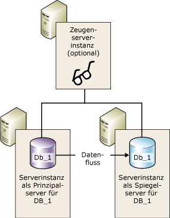
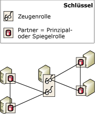

# Datenbank-Spiegelungszeuge
  Zur Unterstützung eines automatischen Failovers muss eine Datenbank-Spiegelungssitzung im Modus für hohe Sicherheit konfiguriert sein und außerdem eine dritte Serverinstanz besitzen, die als *Zeuge*bezeichnet wird. Der Zeuge ist eine optionale Instanz von [!INCLUDE[ssNoVersion](../../includes/ssnoversion-md.md)] , die es dem Spiegelserver in einer Sitzung mit dem Modus für hohe Sicherheit ermöglicht, zu erkennen, ob ein automatisches Failover initiiert werden soll. Im Gegensatz zu den beiden Partnern stellt der Zeuge die Datenbank nicht bereit. Die Unterstützung des automatischen Failovers ist die einzige Aufgabe des Zeugen.  
  
> [!NOTE]  
>  Im Modus für hohe Leistung kann sich der Zeuge negativ auf die Verfügbarkeit auswirken. Wenn ein Zeuge für eine Datenbank-Spiegelungssitzung konfiguriert ist, muss der Prinzipalserver mindestens mit einer der anderen Serverinstanzen verbunden sein, also mit dem Spiegelserver oder dem Zeugen oder mit beiden. Andernfalls ist die Datenbank nicht mehr verfügbar und das Erzwingen des Diensts (mit möglichem Datenverlust) ist nicht möglich. Daher wird beim Modus für hohe Leistung dringend empfohlen, die Zeugeneinstellung immer auf OFF zu belassen. Informationen zu den Auswirkungen eines Zeugen auf den Hochleistungsmodus finden Sie unter [Betriebsmodi der Datenbankspiegelung](../../database-engine/database-mirroring/database-mirroring-operating-modes.md).  
  
 In der folgende Abbildung wird eine Sitzung im Modus für hohe Sicherheit mit einem Zeugen dargestellt.  
  
   
  
 **In diesem Thema:**  
  
-   [Verwenden eines Zeugen in mehreren Sitzungen](#InMultipleSessions)  
  
-   [Software- und Hardwareempfehlungen](#SwHwRecommendations)  
  
-   [Rolle des Zeugen beim automatischen Failover](#InAutoFo)  
  
-   [So fügen Sie einen Zeugen hinzu oder entfernen ihn](#AddRemoveWitness)  
  
##   Verwenden eines Zeugen in mehreren Sitzungen  
 Eine bestimmte Serverinstanz kann als Zeuge in gleichzeitigen Datenbank-Spiegelungssitzungen agieren – jeweils für eine unterschiedliche Datenbank. Verschiedene Sitzungen können dabei mit unterschiedlichen Partnern ablaufen. In der folgenden Abbildung ist eine Serverinstanz dargestellt, die Zeuge zweier Datenbank-Spiegelungssitzungen mit unterschiedlichen Partnern ist.  
  
   
  
 Eine einzelne Serverinstanz kann auch gleichzeitig in bestimmten Sitzungen als Zeuge und in anderen als Partner eingesetzt werden. In der Praxis fungiert eine Serverinstanz jedoch in der Regel entweder als Zeuge oder als Partner. Das ist darauf zurückzuführen, dass als Partner nur leistungsfähige Computer mit entsprechender Hardware zur Unterstützung einer Produktionsdatenbank verwendet werden können, während der Zeuge unter jedem verfügbaren Windows-System ausgeführt werden kann, das Unterstützung für [!INCLUDE[ssCurrent](../../includes/sscurrent-md.md)]bietet.  
  
##   Software- und Hardwareempfehlungen  
 Sie sollten den Zeugen unbedingt auf einem von den Partnern separaten Computer platzieren. Datenbank-Spiegelungspartner werden nur von [!INCLUDE[ssNoVersion](../../includes/ssnoversion-md.md)] Standard Edition und von [!INCLUDE[ssNoVersion](../../includes/ssnoversion-md.md)] Enterprise Edition unterstützt. Zeugen hingegen werden auch von [!INCLUDE[ssNoVersion](../../includes/ssnoversion-md.md)] Workgroup und [!INCLUDE[ssNoVersion](../../includes/ssnoversion-md.md)] Express unterstützt. Außer während eines Upgrades von einer früheren Version von [!INCLUDE[ssNoVersion](../../includes/ssnoversion-md.md)]muss in einer Spiegelungssitzung auf allen Serverinstanzen dieselbe Version von [!INCLUDE[ssNoVersion](../../includes/ssnoversion-md.md)]ausgeführt werden. Ein [!INCLUDE[ssKatmai](../../includes/sskatmai-md.md)] -Zeuge wird beispielsweise unterstützt, wenn Sie von einer Spiegelungskonfiguration der Version [!INCLUDE[ssKatmai](../../includes/sskatmai-md.md)] aktualisieren, er kann jedoch nicht einer vorhandenen oder neuen Spiegelungskonfiguration der Version [!INCLUDE[ssKilimanjaro](../../includes/sskilimanjaro-md.md)] oder höher hinzugefügt werden.  
  
 Ein Zeuge kann auf jedem zuverlässigen Computersystem ausgeführt werden kann, das eine der Editionen von [!INCLUDE[ssNoVersion](../../includes/ssnoversion-md.md)]unterstützt. Es wird jedoch empfohlen, dass jede als Zeuge verwendete Serverinstanz der Mindestkonfiguration entspricht, die für die ausgeführte Version von [!INCLUDE[ssNoVersion](../../includes/ssnoversion-md.md)] Standard Edition erforderlich ist. Weitere Informationen zu diesen Anforderungen finden Sie unter [Hardware and Software Requirements for Installing SQL Server 2016](../../sql-server/install/hardware-and-software-requirements-for-installing-sql-server.md).  
  
##   Rolle des Zeugen beim automatischen Failover  
 Während der gesamten Dauer einer Datenbank-Spiegelungssitzung überwachen alle Serverinstanzen ihren Verbindungsstatus. Werden die Partner voneinander getrennt, können Sie nur anhand des Zeugen sicherstellen, dass nur einer von ihnen aktuell die Datenbank bedient. Wenn ein synchronisierter Spiegelserver seine Verbindung mit dem Prinzipalserver verliert, jedoch weiterhin mit dem Zeugen verbunden bleibt, kontaktiert der Spiegelserver den Zeugen, um zu ermitteln, ob der Zeuge seine Verbindung mit dem Prinzipalserver verloren hat:  
  
-   Wenn der Prinzipalserver weiterhin mit dem Zeugen verbunden ist, erfolgt kein automatisches Failover. Stattdessen bedient der Prinzipalserver weiterhin die Datenbank und sammelt Protokolldatensätze, die zum Spiegelserver gesendet werden, wenn die Verbindung zwischen den Partnern erneut hergestellt wird.  
  
-   Wenn auch die Verbindung zwischen dem Zeugen und dem Prinzipalserver getrennt ist, weiß der Spiegelserver, dass die Prinzipaldatenbank nicht mehr verfügbar ist. In diesem Fall initiiert der Spiegelserver sofort ein automatisches Failover.  
  
-   Wenn die Verbindung zwischen dem Spiegelserver und dem Zeugen und auch die Verbindung zwischen dem Spiegelserver und dem Prinzipalserver getrennt ist, ist unabhängig vom Status des Prinzipalservers kein automatisches Failover möglich.  
  
 Die Anforderung, dass mindestens zwei der Serverinstanzen verbunden sein müssen, wird als *Quorum*bezeichnet. Durch das Quorum wird sichergestellt, dass die Datenbank jeweils immer nur von einem Partner bedient werden kann. Informationen zur Funktionsweise des Quorums und die Auswirkungen auf eine Sitzung finden Sie unter [Quorum: Auswirkungen eines Zeugen auf die Datenbankverfügbarkeit &#40;Datenbankspiegelung&#41;](../../database-engine/database-mirroring/quorum-how-a-witness-affects-database-availability-database-mirroring.md)bezeichnet wird.  
  
##   So fügen Sie einen Zeugen hinzu oder entfernen ihn  
 **So fügen Sie einen Zeugen hinzu**  
  
-   [Hinzufügen oder Ersetzen eines Datenbank-Spiegelungszeugen &#40;SQL Server Management Studio&#41;](../../database-engine/database-mirroring/add-or-replace-a-database-mirroring-witness-sql-server-management-studio.md)  
  
-   [Hinzufügen eines Zeugen für die Datenbankspiegelung mithilfe der Windows-Authentifizierung &#40;Transact-SQL&#41;](../../database-engine/database-mirroring/add-a-database-mirroring-witness-using-windows-authentication-transact-sql.md)  
  
 **So entfernen Sie den Zeugen**  
  
-   [Entfernen des Zeugen aus einer Datenbank-Spiegelungssitzung &#40;SQL Server&#41;](../../database-engine/database-mirroring/remove-the-witness-from-a-database-mirroring-session-sql-server.md)  
  
## Siehe auch  
 [Rollenwechsel während einer Datenbank-Spiegelungssitzung &#40;SQL Server&#41;](../../database-engine/database-mirroring/role-switching-during-a-database-mirroring-session-sql-server.md)   
 [Betriebsmodi der Datenbankspiegelung](../../database-engine/database-mirroring/database-mirroring-operating-modes.md)   
 [Quorum: Auswirkungen eines Zeugen auf die Datenbankverfügbarkeit (Datenbankspiegelung)](../../database-engine/database-mirroring/quorum-how-a-witness-affects-database-availability-database-mirroring.md)   
 [Mögliche Fehler während der Datenbankspiegelung](../../database-engine/database-mirroring/possible-failures-during-database-mirroring.md)   
 [Spiegelungsstatus &#40;SQL Server&#41;](../../database-engine/database-mirroring/mirroring-states-sql-server.md)  
  
  

