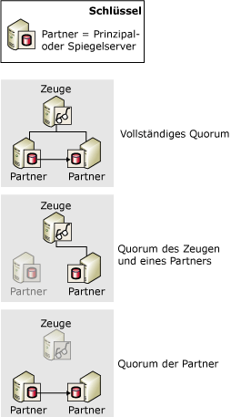
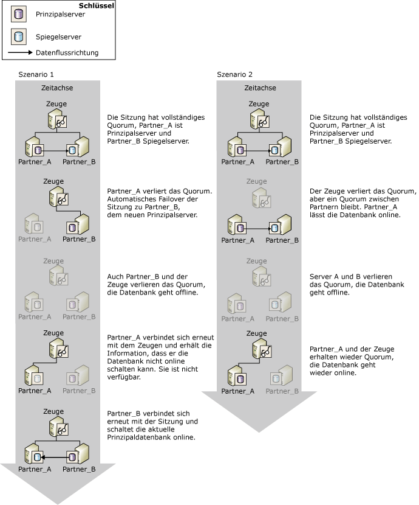

# Quorum: Auswirkungen eines Zeugen auf die Datenbankverfügbarkeit (Datenbankspiegelung)
  Wenn ein Zeuge für eine Datenbank-Spiegelungssitzung festgelegt wird, ist ein *Quorum* erforderlich. Das Quorum ist eine Beziehung, die vorhanden ist, wenn zwei oder mehr Serverinstanzen in einer Datenbank-Spiegelungssitzung miteinander verbunden sind. Typischerweise sind am Quorum drei miteinander verbundene Serverinstanzen beteiligt. Wird ein Zeuge festgelegt, ist ein Quorum erforderlich, damit die Datenbank verfügbar wird. Das Quorum wurde für den Modus für hohe Sicherheit mit automatischem Failover konzipiert und stellt sicher, dass eine Datenbank zu einem bestimmten Zeitpunkt im Besitz nur jeweils eines Partners ist.  
  
 Wenn die Verbindung einer bestimmten Serverinstanz mit der Spiegelungssitzung getrennt wird, verliert diese Instanz das Quorum. Sind keine Serverinstanzen verbunden, verliert die Sitzung das Quorum, und die Datenbank ist nicht mehr verfügbar. Drei Quorumtypen sind möglich:  
  
-   Ein *vollständiges Quorum* enthält beide Partner und den Zeugen.  
  
-   Ein *Quorum zwischen Zeuge und Partner* besteht aus dem Zeugen und einem der beiden Partner.  
  
-   Ein *Quorum zwischen Partnern* besteht aus den beiden Partnern.  
  
 In der folgenden Abbildung sind diese drei Quorumtypen veranschaulicht.  
  
   
  
 Solange der aktuelle Prinzipalserver über das Quorum verfügt, besitzt dieser Server die Rolle des Prinzipals und bedient die Datenbank weiterhin, es sei denn, der Datenbankbesitzer führt ein manuelles Failover aus. Verliert der Prinzipalserver das Quorum, beendet er das Anbieten der Datenbank. Ein automatisches Failover kann nur auftreten, wenn die Prinzipaldatenbank das Quorum verloren hat; dadurch wird sichergestellt, dass es die Datenbank nicht mehr anbietet.  
  
 Eine Serverinstanz, deren Verbindung getrennt wurde, speichert ihre aktuelle Rolle in der Sitzung. In der Regel stellt eine Serverinstanz, deren Verbindung getrennt wurde, erneut eine Verbindung mit der Sitzung her, wenn sie das Quorum neu startet und zurückerlangt.  
  
> [!IMPORTANT]  
>  Der Zeuge sollte nur dann festgelegt werden, wenn Sie beabsichtigen, den Modus für hohe Sicherheit mit automatischem Failover zu verwenden. Im Modus für hohe Leistung, für den nie ein Zeuge erforderlich ist, empfiehlt es sich, die WITNESS-Eigenschaft auf OFF festzulegen. Informationen zu den Auswirkungen eines Zeugen auf den Hochleistungsmodus finden Sie unter [Betriebsmodi der Datenbankspiegelung](../../database-engine/database-mirroring/database-mirroring-operating-modes.md).  
  
## Quorum in Sitzungen im Modus für hohe Sicherheit  
 Im Modus für hohe Sicherheit ermöglicht das Quorum automatisches Failover, indem es einen Kontext bereitstellt, in dem die Serverinstanzen, die über das Quorum verfügen, bestimmen, welcher Partner die Rolle des Prinzipals besitzt. Der Prinzipalserver bedient die Datenbank, wenn er über das Quorum verfügt. Wenn der Prinzipalserver das Quorum verliert, wenn der synchronisierte Spiegelserver und der Zeuge das Quorum behalten, tritt ein automatisches Failover auf.  
  
 Die Quorumszenarien im Modus für hohe Sicherheit sehen wie folgt aus:  
  
-   Ein *vollständiges Quorum* , das aus beiden Partnern und dem Zeugen besteht.  
  
     Normalerweise nehmen alle drei Serverinstanzen an einem Dreiwegequorum teil, das als *vollständiges Quorum*bezeichnet wird. Bei einem vollständigen Quorum führen der Prinzipal- und der Spiegelserver weiterhin ihre jeweiligen Rollen aus (es sei denn, ein manuelles Failover tritt auf).  
  
-   Ein *Quorum zwischen Zeuge und Partner* besteht aus dem Zeugen und einem der beiden Partner.  
  
     Geht die Netzwerkverbindung zwischen den Partnern verloren, weil einer der Partner ausgefallen ist, sind die beiden folgenden Fälle möglich:  
  
    -   Der Spiegelserver fällt aus. Prinzipalserver und Zeuge behalten das Quorum.  
  
         In diesem Fall legt der Prinzipal seine Datenbank auf den Status DISCONNECTED fest und wird ausgeführt, während sich die Spiegelung im Status SUSPENDED befindet. (Dies wird als *ungeschützte Ausführung* bezeichnet, da die Datenbank derzeit nicht gespiegelt wird.) Wenn der Spiegelserver der Sitzung erneut beitritt, erlangt er das Quorum als Spiegel zurück und beginnt, seine Kopie der Datenbank erneut zu synchronisieren.  
  
    -   Der Prinzipalserver fällt aus. Zeuge und Spiegelserver behalten das Quorum.  
  
         In diesem Fall tritt ein automatisches Failover auf. Weitere Informationen finden Sie unter [Database Mirroring Operating Modes](../../database-engine/database-mirroring/database-mirroring-operating-modes.md).  
  
    -   Alle Serverinstanzen verlieren das Quorum, aber Spiegel- und Zeugenserver werden wieder miteinander verbunden. Die Datenbank wird in diesem Fall nicht bedient.  
  
     In seltenen Fällen geht die Netzwerkverbindung zwischen zwei Failoverpartnern verloren, während beide Partner mit dem Zeugen verbunden bleiben. In diesem Fall sind zwei separate Quoren zwischen Zeuge und Partner vorhanden, wobei der Zeuge als Verbindung dient. Der Zeuge informiert den Spiegelserver, dass der Prinzipalserver noch immer verbunden ist. Deshalb findet kein automatisches Failover statt. Stattdessen bleibt der Spiegelserver in der Rolle des Spiegels und wartet darauf, erneut eine Verbindung mit dem Prinzipal herzustellen. Wenn die Wiederholungswarteschlange zu diesem Zeitpunkt Protokolldatensätze enthält, setzt der Spiegelserver den Rollforward der Spiegeldatenbank fort. Beim Wiederherstellen der Verbindung synchronisiert der Spiegelserver die Spiegeldatenbank erneut.  
  
-   Ein *Quorum zwischen Partnern* besteht aus den beiden Partnern.  
  
     Solange die Partner das Quorum beibehalten, befindet sich die Datenbank weiterhin im Status SYNCHRONIZED, und ein manuelles Failover ist weiterhin möglich. Ohne den Zeugen ist das automatische Failover nicht möglich; wenn jedoch der Zeuge das Quorum wiedererlangt, setzt die Sitzung die normalen Vorgänge fort, und das automatische Failover wird wieder unterstützt.  
  
-   Die Sitzung verliert das Quorum.  
  
     Wenn alle Serverinstanzen voneinander getrennt werden, hat die Sitzung das *Quorum verloren*. Wenn die Serverinstanzen erneut die Verbindung miteinander herstellen, erhalten sie wieder das Quorum miteinander.  
  
    -   Wenn der Prinzipalserver wieder die Verbindung mit einer der anderen Serverinstanzen herstellt, wird die Datenbank verfügbar.  
  
    -   Wenn der Prinzipalserver getrennt bleibt, der Spiegel und der Zeuge jedoch wieder die Verbindung untereinander herstellen, kann kein automatisches Failover auftreten, da es sonst zu Datenverlust kommen könnte. Deshalb bleibt die Datenbank nicht verfügbar, bis der Prinzipalserver wieder der Sitzung beitritt.  
  
    -   Wenn alle drei Serverinstanzen die Verbindung wiederhergestellt haben, ist wieder das vollständige Quorum erlangt, und die Sitzung nimmt die regulären Vorgänge wieder auf.  
  
> [!IMPORTANT]  
>  Wenn eine Sitzung jedoch nur über ein Quorum zwischen Partnern verfügt, verliert die Sitzung das Quorum, wenn einer der Partner sein Quorum verliert. Wenn zu erwarten ist, dass der Zeuge für einen längeren Zeitraum getrennt sein wird, sollten Sie deshalb den Zeugen vorübergehend aus der Sitzung entfernen. Durch das Entfernen des Zeugen entfällt die Notwendigkeit des Quorums. Wenn dann der Spiegelserver getrennt wird, kann der Prinzipalserver weiterhin die Datenbank bedienen. Informationen zum Hinzufügen oder Entfernen eines Zeugen finden Sie unter [Database Mirroring Witness](../../database-engine/database-mirroring/database-mirroring-witness.md).  
  
### Auswirkungen des Quorums auf die Datenbankverfügbarkeit  
 In der folgenden Abbildung wird veranschaulicht, wie Zeuge und Partner gemeinsam sicherstellen, dass jeweils nur ein Partner die Rolle des Prinzipalservers besitzt und nur der aktuelle Prinzipalserver seine Datenbank online schalten kann. Beide Szenarien beginnen mit dem vollständigen Quorum, wobei sich **Partner_A** in der Rolle des Prinzipalservers und **Partner_B** in der Rolle des Spiegelservers befindet.  
  
   
  
 In Szenario 1 wird veranschaulicht, wie Zeuge und Spiegel nach einem Fehler am ursprünglichen Prinzipalserver (**Partner_A**) übereinstimmend erkennen, dass **Partner_A**nicht mehr verfügbar ist und ein Quorum bilden. Der Spiegelserver, **Partner_B** , übernimmt daraufhin die Rolle des Prinzipalservers. Ein automatisches Failover erfolgt, und **Partner_B**schaltet seine Kopie der Datenbank online. Anschließend wird **Partner_B** heruntergefahren, und die Datenbank wird offline geschaltet. Später stellt der vorherige Prinzipalserver, **Partner_A**, die Verbindung mit dem Zeugen wieder her und erhält wieder das Quorum. Im Rahmen der Kommunikation mit dem Zeugen erkennt **Partner_A** jedoch, dass die eigene Datenbankkopie nicht online geschaltet werden kann, da jetzt **Partner_B** die Rolle des Prinzipalservers besitzt. Sobald **Partner_B** wieder an der Sitzung teilnimmt, wird auch die Datenbank wieder online geschaltet.  
  
 In Szenario 2 verliert der Zeuge sein Quorum, während die Partner **Partner_A** und **Partner_B**das Quorum gemeinsam behalten; die Datenbank bleibt online. Dann verlieren auch die Partner ihr Quorum, und die Datenbank wird offline geschaltet. Später stellt der Prinzipalserver ( **Partner_A**) die Verbindung mit dem Zeugen wieder her und erhält dadurch das Quorum. Der Zeuge bestätigt, dass **Partner_A** noch immer im Besitz der Prinzipalrolle ist, und **Partner_A** schaltet die Datenbank wieder online.  
  
## Siehe auch  
 [Betriebsmodi der Datenbankspiegelung](../../database-engine/database-mirroring/database-mirroring-operating-modes.md)   
 [Rollenwechsel während einer Datenbank-Spiegelungssitzung &#40;SQL Server&#41;](../../database-engine/database-mirroring/role-switching-during-a-database-mirroring-session-sql-server.md)   
 [Datenbank-Spiegelungszeuge](../../database-engine/database-mirroring/database-mirroring-witness.md)   
 [Mögliche Fehler während der Datenbankspiegelung](../../database-engine/database-mirroring/possible-failures-during-database-mirroring.md)   
 [Spiegelungsstatus &#40;SQL Server&#41;](../../database-engine/database-mirroring/mirroring-states-sql-server.md)  
  
  

