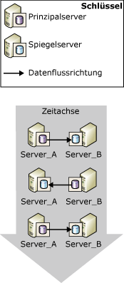
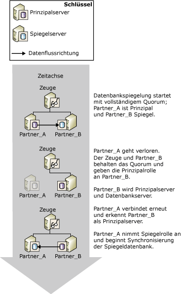
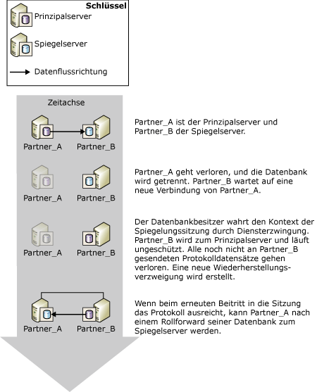

# Rollenwechsel während einer Datenbank-Spiegelungssitzung (SQL Server)
[!INCLUDE[appliesto-ss-xxxx-xxxx-xxx-md](../../includes/appliesto-ss-xxxx-xxxx-xxx-md.md)]
  Im Kontext einer Datenbank-Spiegelungssitzung können die Prinzipal- und Spiegelrollen normalerweise im Rahmen des so genannten *Rollenwechsels*ausgetauscht werden. Beim Rollenwechsel dient der Spiegelserver als *Failoverpartner* für den Prinzipalserver. Er übernimmt die Prinzipalrolle, stellt dessen Kopie der Datenbank wieder her und schaltet sie als neue Prinzipaldatenbank online. Der ehemalige Prinzipalserver übernimmt, soweit verfügbar, die Spiegelrolle, und die zugehörige Datenbank wird zur neuen Spiegeldatenbank. Potenziell können die Rollen hin- und hergewechselt werden, entweder als Antwort auf auftretende Fehler oder zu Verwaltungszwecken.  
  
> [!NOTE]  
>  Dieses Thema setzt voraus, dass Sie mit den Betriebsmodi der Datenbankspiegelung vertraut sind. Weitere Informationen finden Sie unter [Database Mirroring Operating Modes](../../database-engine/database-mirroring/database-mirroring-operating-modes.md).  
  
 Die folgende Abbildung zeigt die Spiegelungspartner **Partner_A** und **Partner_B**, die die Prinzipal- und Spiegelrollen bei einer Reihe automatischer oder manueller Failover wechseln.  
  
   
  
> [!IMPORTANT]  
>  Nach einem Rollenwechsel müssen Aufträge, die für die ehemalige Prinzipaldatenbank ausgeführt wurden, auf dem neuen Prinzipalserver erneut erstellt werden, damit sie dort ausgeführt werden können. Weitere Informationen finden Sie unter [Verwaltung von Anmeldenamen und Aufträgen nach einem Rollenwechsel &#40;SQL Server&#41;](../../sql-server/failover-clusters/management-of-logins-and-jobs-after-role-switching-sql-server.md).  
  
 Es werden drei Typen des Rollenwechsels unterschieden: automatisches Failover, manuelles Failover und erzwungener Dienst (mit möglichem Datenverlust). Die Unterstützung der einzelnen Arten hängt vom Betriebsmodus der Sitzung ab.  
  
> [!NOTE]  
>  Falls Sie mit den Betriebsmodi nicht vertraut sind, finden Sie weitere Informationen unter [Betriebsmodi der Datenbankspiegelung](../../database-engine/database-mirroring/database-mirroring-operating-modes.md).  
  
-   **Manuelles Failover**  
  
     Der Modus für hohe Sicherheit unterstützt automatisches Failover. Wenn die Datenbank synchronisiert wird, kann der Datenbankbesitzer ein manuelles Failover starten.  
  
     Das manuelle Failover dient zu Verwaltungszwecken. Weitere Informationen hierzu finden Sie weiter unten in diesem Thema unter [Manuelles Failover](#ManualFailover).  
  
-   **Automatisches Failover**  
  
     Wenn ein Zeuge vorhanden ist, wird im Modus für hohe Sicherheit automatisches Failover unterstützt. Das automatische Failover erfolgt nur beim Ausfall des Prinzipalservers, falls der Zeuge und der Spiegelserver noch miteinander verbunden sind und die Datenbank bereits synchronisiert ist. Weitere Informationen hierzu finden Sie weiter unten in diesem Thema unter [Automatisches Failover](#AutomaticFailover).  
  
-   **Erzwungener Dienst (mit möglichem Datenverlust)**  
  
     Das Erzwingen des Dienstes wird im Modus für hohe Leistung und im Modus für hohe Sicherheit, sofern kein Zeuge festgelegt wurde, unterstützt. Bei einem Ausfall des Prinzipalservers kann der Datenbankbesitzer die Datenbank verfügbar machen, indem der Dienst des Spiegelservers erzwungen wird (mit möglichem Datenverlust).  
  
    > [!NOTE]  
    >  Es wird empfohlen, die WITNESS-Eigenschaft im Modus für hohe Leistung auf OFF festzulegen. Andernfalls muss der Spiegelserver mit dem Zeugen verbunden sein, um die Datenbank online zu bringen.  
  
     Weitere Informationen hierzu finden Sie weiter unten in diesem Thema unter [Erzwungener Dienst (mit möglichem Datenverlust)](#ForcedService).  
  
 In der folgenden Tabelle ist zusammengefasst, welche Arten des Failovers von den verschiedenen Betriebsmodi unterstützt werden.  
  
||Hohe Leistung|Modus für hohe Sicherheit ohne einen Zeugen|Modus für hohe Sicherheit mit einem Zeugen|  
|-|----------------------|-----------------------------------------|--------------------------------------|  
|Automatisches Failover|nein|nein|ja|  
|Manuelles Failover|nein|ja|ja|  
|Erzwungener Dienst|ja|ja|nein|  
  
 Nach einem Rollenwechsel müssen bestimmte Metadaten auf beiden Partnern vorhanden sein, um sicherzustellen, dass alle Datenbankbenutzer auf die neue Prinzipaldatenbank zugreifen können. Darüber hinaus müssen Sicherungsaufträge auf dem neuen Prinzipalserver erstellt werden, damit die Datenbank weiterhin in regelmäßigen Abständen gesichert wird. Weitere Informationen finden Sie unter [Verwaltung von Anmeldenamen und Aufträgen nach einem Rollenwechsel &#40;SQL Server&#41;](../../sql-server/failover-clusters/management-of-logins-and-jobs-after-role-switching-sql-server.md).  
  
 Wie lange die Datenbankspiegelung während eines Rollenwechsels nicht durchgeführt werden kann, hängt vom Typ des Rollenwechsels und von der Ursache ab. Weitere Informationen finden Sie unter [Einschätzen der Unterbrechung des Diensts während des Rollenwechsels &#40;Datenbankspiegelung&#41;](../../database-engine/database-mirroring/estimate-the-interruption-of-service-during-role-switching-database-mirroring.md)ausgetauscht werden.  
  
##   Manual Failover  
 Durch das manuelle Failover werden die Clients von der Datenbank getrennt und die Rollen der Partner umgekehrt. Nur der Modus mit hoher Sicherheit unterstützt ein manuelles Failover.  
  
 **In diesem Abschnitt:**  
  
-   [Aufrechterhalten der Verfügbarkeit während Upgrades](#AvailabilityDuringUpgrades)  
  
-   [Für ein manuelles Failover erforderliche Bedingungen](#ConditionsForManualFo)  
  
-   [So funktioniert ein manuelles Failover](#HowManualFoWorks)  
  
###   Aufrechterhalten der Verfügbarkeit während Upgrades  
 Vom Datenbankadministrator kann das manuelle Failover zum Aktualisieren der Hardware oder Software ohne Einbußen bei der Verfügbarkeit verwendet werden. Um die Datenbankspiegelung für Softwareupgrades zu verwenden, müssen die Upgrades bereits auf dem Spiegelserver und/oder dem System vorhanden sein.  
  
> [!NOTE]  
>  Die Datenbankspiegelung sollte in der Lage sein, ein paralleles Upgrade auszuführen. Dies wird jedoch nicht garantiert, da zukünftige Änderungen unbekannt sind. Weitere Informationen finden Sie unter [Upgrading Mirrored Instances](../../database-engine/database-mirroring/upgrading-mirrored-instances.md).  
  
 Die folgende Abbildung veranschaulicht ein manuelles Failover, bei dem während des Upgrades einer Datenbankserverinstanz die Datenbank verfügbar bleibt. Nach dem Abschluss des Upgrades kann vom Administrator optional ein Failover zurück zur Originalserverinstanz durchgeführt werden. Dies ist nützlich, wenn der Administrator die Spiegelungssitzung beenden und den Spiegelserver anderweitig verwenden möchte. Auf diese Weise kann eine einzelne Serverinstanz wiederholt beim Aktualisieren einer Reihe von Datenbankserverinstanzen verwendet werden.  
  
   
  
###   Für ein manuelles Failover erforderliche Bedingungen  
 Für das manuelle Failover ist die Transaktionssicherheitseinstellung FULL erforderlich (d. h., der Modus für hohe Sicherheit). Wenn die Partner verbunden sind und die Datenbank bereits synchronisiert ist, wird das manuelle Failover unterstützt.  
  
###   So funktioniert ein manuelles Failover  
 Durch ein manuelles Failover wird die folgende Aktionskette ausgelöst:  
  
1.  Vom Prinzipalserver werden Clients von der Prinzipaldatenbank getrennt. Das Ende des Protokolls wird an den Spiegelserver gesendet, und in Vorbereitung auf den Wechsel der Spiegelrolle wird der Status der Prinzipaldatenbank auf SYNCHRONIZING festgelegt.  
  
2.  Vom Spiegelserver wird die Protokollsequenznummer (LSN, Log Sequence Number) des letzten vom Prinzipal empfangenen Protokolldatensatzes als Failover-LSN aufgezeichnet.  
  
    > [!NOTE]  
    >  Um die LSN anzuzeigen, wählen Sie die **mirroring_failover_lsn**-Spalte von [sys.database_mirroring &#40;Transact-SQL&#41;](../../relational-databases/system-catalog-views/sys-database-mirroring-transact-sql.md) aus.  
  
3.  Wartet ein Protokoll in der Wiederholungswarteschlange, schließt der Spiegelserver den Rollforward der Spiegeldatenbank ab. Die erforderliche Zeit hängt von der Systemgeschwindigkeit, der aktuellen Arbeitsauslastung und der Menge der Protokolle in der Wiederholungswarteschlange ab. Für den synchronen Betriebsmodus kann die Failoverzeit durch die Begrenzung der Wiederholungswarteschlangengröße reguliert werden. Das führt allerdings möglicherweise zu einem langsameren Prinzipalserver, damit vom Spiegelserver die Geschwindigkeit gehalten werden kann.  
  
    > [!NOTE]  
    >  Zur Feststellung der aktuellen Größe der Wiederholungswarteschlange verwenden Sie den Leistungsindikator **Wiederholungswarteschlange** im Datenbankspiegelungs-Leistungsobjekt. Weitere Informationen finden Sie unter [Überwachen der Datenbankspiegelung &#40;SQL Server&#41;](../../database-engine/database-mirroring/monitoring-database-mirroring-sql-server.md).  
  
4.  Der Spiegelserver wird zum neuen Prinzipalserver, und der vorherige Prinzipalserver wird zum neuen Spiegelserver.  
  
5.  Vom neuen Prinzipalserver wird für alle Transaktionen, für die kein Commit ausgeführt worden ist, ein Rollback ausgeführt und die Kopie der Datenbank als Prinzipaldatenbank online gestellt.  
  
6.  Der vorherige Prinzipal übernimmt die Spiegelrolle, und die vorherige Prinzipaldatenbank wird zur Spiegeldatenbank. Vom neuen Spiegelserver wird die neue Spiegeldatenbank schnell mit der neuen Prinzipaldatenbank erneut synchronisiert.  
  
    > [!NOTE]  
    >  Sobald der neue Spiegelserver die Datenbanken synchronisiert hat, ist ein Failover wieder möglich, jedoch in umgekehrter Richtung.  
  
 Nach dem Failover müssen die Clients erneut eine Verbindung zur aktuellen Prinzipaldatenbank herstellen. Weitere Informationen finden Sie unter [Verbinden von Clients mit einer Datenbank-Spiegelungssitzung &#40;SQL Server&#41;](../../database-engine/database-mirroring/connect-clients-to-a-database-mirroring-session-sql-server.md)ausgetauscht werden.  
  
 **So initiieren Sie ein manuelles Failover**  
  
-   [Manueller Failover für eine Datenbank-Spiegelungssitzung &#40;SQL Server Management Studio&#41;](../../database-engine/database-mirroring/manually-fail-over-a-database-mirroring-session-sql-server-management-studio.md)  
  
-   [Manuelles Failover für eine Datenbank-Spiegelungssitzung &#40;Transact-SQL&#41;](../../database-engine/database-mirroring/manually-fail-over-a-database-mirroring-session-transact-sql.md).  
  
##   Automatic Failover  
 Automatisches Failover wird nur in Datenbank-Spiegelungssitzungen unterstützt, die mit einem Zeugen im Modus für hohe Sicherheit ausgeführt werden (*Modus für hohe Sicherheit mit automatischem Failover*). Im Modus für hohe Sicherheit mit automatischem Failover wird nach dem Synchronisieren der Datenbank ein automatisches Failover ausgeführt, wenn die Prinzipaldatenbank ausfällt. Bei einem automatischen Failover übernimmt der Spiegelserver die Rolle des Prinzipalservers und schaltet die eigene Datenbankkopie als Prinzipaldatenbank online. Aufgrund der Voraussetzung, dass die Datenbank synchronisiert sein muss, werden Datenverluste während des Failovers verhindert, da für jede Transaktion, für die auf der Prinizipaldatenbank ein Commit ausgeführt wird, auch ein Commit auf der Spiegeldatenbank ausgeführt wird.  
  
> [!IMPORTANT]  
>  Damit das automatische Failover eine Verbesserung der Verfügbarkeit bedeutet, müssen sich Spiegel- und Prinzipaldatenbank auf verschiedenen Computern befinden.  
  
 **In diesem Abschnitt:**  
  
-   [Für ein automatisches Failover erforderliche Bedingungen](#ConditionsForAutoFo)  
  
-   [So funktioniert ein automatisches Failover](#HowAutoFoWorks)  
  
-   [So deaktivieren Sie das automatische Failover (SQL Server Management Studio)](#DisableAutoSSMS)  
  
-   [So deaktivieren Sie das automatische Failover (mithilfe von Transact-SQL)](#DisableAutoTsql)  
  
###   Für ein automatisches Failover erforderliche Bedingungen  
 Für automatisches Failover müssen folgende Bedingungen erfüllt sein:  
  
-   Die Datenbank-Spiegelungssitzung muss im Modus für hohe Sicherheit ausgeführt werden und einen Zeugen besitzen. Weitere Informationen finden Sie unter [Database Mirroring Operating Modes](../../database-engine/database-mirroring/database-mirroring-operating-modes.md).  
  
-   Die Spiegeldatenbank muss bereits synchronisiert sein. Dadurch wird sichergestellt, dass sämtliche an den Spiegelserver gesendeten Protokolleinträge auf den Datenträger geschrieben wurden.  
  
-   Die Kommunikation des Prinzipalservers mit dem Rest der Datenbankspiegelungskonfiguration wurde unterbrochen, während der Spiegelserver und der Zeugenserver das Quorum behalten. Wenn jedoch alle Serverinstanzen die Kommunikation verlieren und der Zeugenserver und der Spiegelserver später die Kommunikation wieder aufnehmen, erfolgt kein automatisches Failover.  
  
    > [!NOTE]  
    >  Weitere Informationen finden Sie unter [Quorum: Auswirkungen eines Zeugen auf die Datenbankverfügbarkeit &#40;Datenbankspiegelung&#41;](../../database-engine/database-mirroring/quorum-how-a-witness-affects-database-availability-database-mirroring.md).  
  
-   Der Spiegelserver hat den Verlust des Prinzipalservers erkannt.  
  
     Wie der Spiegelserver einen Ausfall des Prinzipalservers erkennt, hängt davon ab, ob es sich um einen Hardware- oder Softwarefehler handelt. Weitere Informationen finden Sie unter [Possible Failures During Database Mirroring](../../database-engine/database-mirroring/possible-failures-during-database-mirroring.md).  
  
###   So funktioniert ein automatisches Failover  
 Unter den oben genannten Bedingungen wird beim automatischen Failover die folgende Aktionsfolge initiiert:  
  
1.  Wird der Prinzipalserver noch immer ausgeführt, ändert er den Status der Prinzipaldatenbank in DISCONNECTED und trennt alle Clientverbindungen zur Prinzipaldatenbank.  
  
2.  Der Zeugen- und der Spiegelserver registrieren, dass der Prinzipalserver nicht verfügbar ist.  
  
3.  Wartet ein Protokoll in der Wiederholungswarteschlange, schließt der Spiegelserver den Rollforward der Spiegeldatenbank ab.  
  
    > [!NOTE]  
    >  Die zum Anwenden des Protokolls erforderliche Zeit hängt von der Systemgeschwindigkeit, der aktuellen Arbeitsauslastung und der Menge an Protokollen in der Wiederholungswarteschlange ab.  
  
4.  Die frühere Spiegeldatenbank wird als neue Prinzipaldatenbank online geschaltet. Bei der Wiederherstellung werden alle Transaktionen, für die kein Commit ausgeführt wurde, möglichst schnell durch ein Rollback dieser Transaktionen bereinigt. Diese Transaktionen werden durch Sperren isoliert.  
  
5.  Wenn sich der frühere Prinzipalserver der Sitzung wieder anschließt, erkennt er, dass sein Failoverpartner jetzt die Prinzipalrolle besitzt. Der frühere Prinzipalserver übernimmt die Rolle des Spiegels und macht seine Datenbank zur Spiegeldatenbank. Der neue Spiegelserver synchronisiert die neue Spiegeldatenbank so schnell wie möglich mit der Prinzipaldatenbank. Sobald der neue Spiegelserver die Datenbanken synchronisiert hat, ist ein Failover wieder möglich, jedoch in umgekehrter Richtung.  
  
 In der folgenden Abbildung wird eine einzelne Instanz von automatischem Failover veranschaulicht.  
  
   
  
 Anfänglich besitzen alle drei Server eine Verbindung (die Sitzung verfügt über ein vollständiges Quorum). **Partner_A** ist der Prinzipalserver und **Partner_B** ist der Spiegelserver. **Partner_A** (oder die Prinzipaldatenbank auf **Partner_A**) steht nicht länger zur Verfügung. Der Zeuge und **Partner_B** erkennen, dass der Prinzipalserver nicht mehr verfügbar ist, die Sitzung behält jedoch das Quorum. **Partner_B** wird zum Prinzipalserver und macht seine Kopie der Datenbank als neue Prinzipaldatenbank verfügbar. Schließlich stellt **Partner_A** wieder eine Verbindung mit der Sitzung her und erkennt, dass **Partner_B** jetzt die Prinzipalrolle besitzt. **Partner_A** übernimmt dann die Spiegelrolle.  
  
 Nach dem Failover müssen die Clients erneut eine Verbindung zur aktuellen Prinzipaldatenbank herstellen. Weitere Informationen finden Sie unter [Verbinden von Clients mit einer Datenbank-Spiegelungssitzung &#40;SQL Server&#41;](../../database-engine/database-mirroring/connect-clients-to-a-database-mirroring-session-sql-server.md)ausgetauscht werden.  
  
> [!NOTE]  
>  Transaktionen, die mit dem [!INCLUDE[msCoName](../../includes/msconame-md.md)] Distributed Transaction Coordinator vorbereitet wurden, für die beim Auftreten eines Failovers jedoch noch kein Commit ausgeführt wurde, werden nach dem Failover der Datenbank als abgebrochen betrachtet.  
  
###   So deaktivieren Sie das automatische Failover (SQL Server Management Studio)  
 Öffnen Sie die Seite **Datenbankeigenschaften – Spiegelung** , und ändern Sie den Betriebsmodus durch Auswählen einer der folgenden Optionen:  
  
-   **Hohe Sicherheit ohne automatisches Failover (synchron)**  
  
     In diesem Modus wird die Datenbank weiterhin synchronisiert, und manuelles Failover ist weiterhin möglich.  
  
-   **Hohe Leistung (asynchron)**  
  
     In diesem Modus kann es vorkommen, dass die Spiegeldatenbank leicht hinter die Prinzipaldatenbank zurückfällt; manuelles Failover ist nicht mehr möglich.  
  
###   So deaktivieren Sie das automatische Failover (mithilfe von Transact-SQL)  
 Der Datenbankbesitzer kann jederzeit in einer Datenbank-Spiegelungssitzung das automatische Failover deaktivieren, indem er den Zeugen deaktiviert.  
  
 **So deaktivieren Sie den Zeugen**  
  
-   [Entfernen des Zeugen aus einer Datenbank-Spiegelungssitzung &#40;SQL Server&#41;](../../database-engine/database-mirroring/remove-the-witness-from-a-database-mirroring-session-sql-server.md)  
  
    > [!NOTE]  
    >  Wenn der Zeuge deaktiviert wird, während die Transaktionssicherheitsstufe FULL beibehalten wird, wird die Sitzung in den Modus für hohe Sicherheit mit automatischem Failover versetzt.  
  
##   Forced Service (with Possible Data Loss)  
 Im Rahmen der Datenbankspiegelung wird das Erzwingen des Dienstes (bei möglichem Datenverlust) als eine Methode der Notfallwiederherstellung bereitgestellt, bei der Ihnen die Verwendung eines Spiegelservers als betriebsbereiter Standbyserver ermöglicht wird. Das Erzwingen des Dienstes ist nur möglich, wenn keine Verbindung in einer Spiegelungssitzung zwischen Prinzipalserver und Spiegelserver besteht. Da es beim Erzwingen des Dienstes zu Datenverlusten kommen kann, sollte diese Methode unter Vorbehalt und selten angewendet werden.  
  
 Die Unterstützung des erzwungenen Dienstes hängt wie folgt vom Betriebsmodus und dem Status der Sitzung ab:  
  
-   In der Regel unterstützt der Modus für hohe Leistung das Erzwingen des Dienstes, wenn keine Verbindung mit dem Prinzipalserver besteht. Obwohl nicht erforderlich, kann jedoch ein Zeuge für eine Sitzung im Modus für hohe Leistung eingerichtet werden. In diesem Fall ist zum Erzwingen des Dienstes erforderlich, dass der Spiegelserver und der Zeuge miteinander verbunden sind.  
  
-   Der Modus für hohe Sicherheit mit automatischem Failover unterstützt das Erzwingen des Dienstes, wenn keine Verbindung mit dem Prinzipalserver besteht.  
  
-   Der Modus für hohe Sicherheit mit automatischem Failover unterstützt das Erzwingen des Dienstes, wenn eine Verbindung zwischen Spiegelserver und Zeuge besteht und keiner der beiden mit dem Prinzipalserver verbunden ist (solange der Spiegelserver gerade kein Rollback der Spiegeldatenbank ausgeführt hat, als zuletzt eine Verbindung mit dem Prinzipalserver bestand).  
  
 Es wird empfohlen, den Dienst nur dann zu erzwingen, wenn Sie den Dienst für die Datenbank sofort wiederherstellen müssen und bereit sind, das Risiko des Datenverlustes in Kauf zu nehmen. Die Auswirkungen aus dem Erzwingen des Dienstes sind vergleichbar mit dem Entfernen der Spiegelung, außer dass durch das Erzwingen des Dienstes das erneute Synchronisieren der Datenbanken (bei möglichem Datenverlust) vereinfacht wird, wenn die Spiegelung fortgesetzt wird. Durch das Erzwingen des Dienstes wird ein sanfter Übergang von der Prinzipalrolle zur Spiegeldatenbank gestartet. Der Spiegelserver nimmt die Rolle des Prinzipalservers an und bietet seine Datenbankkopie den Clients sofort an. Die neue Prinzipaldatenbank wird ohne einen Spiegel ausgeführt (sie wird also ungeschützt ausgeführt).  
  
> [!IMPORTANT]  
>  Wurde der Prinzipalserver nur von der Datenbank-Spiegelungssitzung getrennt, wird jedoch weiter ausgeführt, greifen einige Clients möglicherweise weiterhin auf die ursprüngliche Prinzipaldatenbank zu. Vor dem Erzwingen des Dienstes müssen Sie verhindern, dass Clients weiterhin auf den ursprünglichen Prinzipalserver zugreifen. Andernfalls ist es nach dem Erzwingen des Dienstes möglich, dass die ursprüngliche Prinzipaldatenbank und die aktuelle Prinzipaldatenbank unabhängig voneinander aktualisiert werden.  
  
 **In diesem Abschnitt:**  
  
-   [Typischer Fall eines erzwungenen Dienstes](#TypicalCaseFS)  
  
-   [Risiken beim Erzwingen des Dienstes](#FSrisks)  
  
-   [Umgang mit potenziellem Datenverlust](#ManageDataLoss)  
  
-   [Verwandte Aufgaben zum Verwalten eines erzwungenen Failovers](#RelatedTasksForFS)  
  
###   Typischer Fall eines erzwungenen Dienstes  
 Die folgende Abbildung veranschaulicht einen typischen Fall eines erzwungenen Dienstes (mit möglichem Datenverlust).  
  
   
  
 In der Abbildung fällt der ursprüngliche Prinzipalserver ( **Partner_A**) aus und steht dem Spiegelserver ( **Partner_B**) nicht mehr zur Verfügung, wodurch die Spiegeldatenbank getrennt wird. Nachdem sichergestellt wurde, dass **Partner_A** Clients nicht zur Verfügung steht, erzwingt der Datenbankadministrator den Dienst, mit möglichem Datenverlust, auf **Partner_B**. **Partner_B** wird zum Prinzipalserver, und die Datenbank wird *ungeschützt* (d.h. ungespiegelt) ausgeführt. An diesem Punkt können Clients die Verbindung mit **Partner_B**wieder herstellen.  
  
 Wenn **Partner_A** wieder zur Verfügung steht, stellt er die Verbindung mit dem neuen Prinzipalserver her, tritt der Sitzung wieder bei und übernimmt die Rolle des Spiegelservers. Die Spiegelungssitzung wird sofort angehalten, ohne dass die neue Spiegeldatenbank synchronisiert wird. Durch das Anhalten der Sitzung kann der Datenbankadministrator entscheiden, ob die Sitzung fortgesetzt, oder in Extremfällen, die Spiegelung entfernt und der Versuch unternommen werden soll, Daten aus der früheren Prinzipaldatenbank zu retten. In diesem Fall entscheidet sich der Datenbankadministrator für das Fortsetzen der Spiegelung. An dieser Stelle übernimmt **Partner_A** die Rolle des Spiegelservers und führt einen Rollback der früheren Prinzipaldatenbank auf den Zeitpunkt der letzten erfolgreich synchronisierten Transaktion aus. Wenn Transaktionen, für die ein Commit ausgeführt wurde, vor dem Erzwingen des Diensts nicht auf den Datenträger des Spiegelservers geschrieben wurden, gehen sie verloren. **Partner_A** führt dann einen Rollforward der neuen Spiegeldatenbank aus, indem alle Änderungen angewendet werden, die an der neuen Prinzipaldatenbank vorgenommen wurden, seit der vorherige Spiegelserver die Rolle des neuen Prinzipalservers übernommen hat.  
  
> [!NOTE]  
>  Wurde im Modus für hohe Leistung ein Zeuge konfiguriert (dies ist nicht notwendig), ist das Erzwingen des Dienstes nur möglich, wenn der Zeuge derzeit mit dem Spiegelserver verbunden ist.  
  
###   Risiken beim Erzwingen des Dienstes  
 Sie sollten unbedingt bedenken, dass durch das Erzwingen des Dienstes Daten verloren gehen können. Zu einem Datenverlust kann es kommen, weil der Spiegelserver nicht mit dem Prinzipalserver kommunizieren und somit nicht sicherstellen kann, dass beide Datenbanken synchronisiert sind. Durch das Erzwingen des Dienstes wird ein neuer Wiederherstellungs-Verzweigungspunkt gestartet. Da sich die ursprüngliche Prinzipaldatenbank und die Spiegeldatenbank auf verschiedenen Wiederherstellungsverzweigungen befinden, enthält jede Datenbank nun Daten, die in der jeweils anderen Datenbank nicht vorhanden sind: Die ursprüngliche Prinzipaldatenbank enthält die Änderungen, die noch nicht aus der Sendewarteschlange an die frühere Spiegeldatenbank gesendet wurden (die nicht gesendeten Protokolle). Die frühere Spiegeldatenbank enthält die Änderungen, die nach dem Erzwingen des Dienstes vorgenommen wurden.  
  
 Wird der Dienst aufgrund eines Fehlers des Prinzipalservers erzwungen, hängt der potenzielle Datenverlust davon ab, ob Transaktionsprotokolle vorhanden sind, die vor dem Fehler nicht an den Spiegelserver gesendet wurden. Im Modus für hohe Sicherheit ist dies nur bis zum Synchronisieren der Spiegeldatenbank möglich. Im Modus für hohe Leistung besteht immer die Möglichkeit, dass sich nicht gesendete Protokolle ansammeln.  
  
 Die Auswirkungen aus dem Erzwingen des Dienstes hängen teilweise davon ab, ob die Sitzung über einen Zeugen verfügt.  
  
-   Ohne einen Zeugen kann der Dienst erzwungen werden, wenn die Verbindung der Partner beispielsweise aufgrund einer unterbrochenen Netzwerkverbindung getrennt wird. Wird der ursprüngliche Prinzipalserver weiterhin ausgeführt, haben beide Partner die Rolle des Prinzipals inne. Clients, die eine Verbindung mit dem neuen Prinzipalserver herstellen, greifen auf die aktuelle Datenbankversion zu, während Clients, die eine Verbindung mit dem ursprünglichen Prinzipalserver herstellen, auf die ursprüngliche Prinzipaldatenbank zugreifen. In dieser Situation steigt die Wahrscheinlichkeit eines Datenverlusts. Wenn es den Partnern möglich ist, die Verbindung wiederherzustellen, nimmt der ursprüngliche Server die Rolle des Spiegelservers an und ändert den Status seiner Datenbank zu "Wird wiederhergestellt", ehe die Spiegelung angehalten wird. Wenn die Sitzung fortgesetzt wird, gehen Transaktionen in der ursprünglichen Datenbank, deren Protokolle sich zum Zeitpunkt der letzten Verbindungsunterbrechung in der Sendewarteschlange befanden, verloren. Außerdem gehen alle Transaktionen verloren, die nach dem Erzwingen des Dienstes stattfanden.  
  
-   Ist ein Zeuge vorhanden und der Spiegelserver wird sowohl vom Prinzipalserver als auch vom Zeugen getrennt, wird der Prinzipalserver ungeschützt ausgeführt, solange die Verbindung zwischen Prinzipalserver und Zeuge weiter besteht. Wird die Verbindung des Prinzipalservers mit dem Zeugen dann getrennt, stellt er die Datenbank nicht länger bereit. Wenn der Spiegelserver die Verbindung mit dem Zeugen wiederherstellt, ist es danach möglich, den Dienst zu erzwingen. Wird der Dienst erzwungen, gehen alle Änderungen verloren, die während des ungeschützten Ausführens des ursprünglichen Prinzipalservers vorgenommen wurden, sobald der ursprüngliche Prinzipalserver die Verbindung wiederherstellt.  
  
 Weitere Informationen finden Sie weiter unten in diesem Thema unter [Umgang mit potenziellem Datenverlust](#ManageDataLoss).  
  
###   Umgang mit potenziellem Datenverlust  
 Sobald der frühere Prinzipalserver verfügbar ist, können Sie nach dem Erzwingen des Dienstes versuchen, den potenziellen Datenverlust zu verwalten, vorausgesetzt die Datenbank ist unbeschädigt. Der jeweilige Ansatz für die Verwaltung des potenziellen Datenverlusts hängt davon ab, ob der ursprüngliche Prinzipalserver die Verbindung zu seinem Partner wiederhergestellt hat und wieder an der Spiegelungssitzung teilnimmt. Vorausgesetzt, dass der ursprüngliche Prinzipalserver auf die neue Prinzipalinstanz zugreifen kann, wird die Verbindung automatisch und transparent wiederhergestellt.  
  
#### Der ursprüngliche Prinzipalserver hat die Verbindung wiederhergestellt  
 Normalerweise stellt der ursprüngliche Prinzipalserver nach einem Fehler beim Neustarten rasch die Verbindung zu seinem Partner wieder her. Beim Wiederherstellen der Verbindung wird der ursprüngliche Prinzipalserver zum Spiegelserver. Seine Datenbank wird zur Spiegeldatenbank und nimmt vor dem Anhalten der Sitzung des Status "Wird wiederhergestellt" an. Es wird nur dann ein Rollback der Spiegeldatenbank ausgeführt, wenn Sie die Spiegelung fortsetzen.  
  
 Der Zugriff auf die Datenbank, die wiederhergestellt wird, ist jedoch nicht möglich; deshalb können Sie sie nicht überprüfen, um festzustellen, welche Daten im Falle der fortgesetzten Spiegelung verloren gehen würden. Die Entscheidung, ob die Spiegelung fortgesetzt oder entfernt werden soll, hängt somit davon ab, ob Sie bereit sind, Datenverluste grundsätzlich in Kauf zu nehmen.  
  
-   Wenn der Verlust von Daten inakzeptabel ist, sollten Sie die Spiegelung entfernen, um die Daten zu retten.  
  
     Durch das Entfernen der Spiegelung kann der Datenbankadministrator die ursprüngliche Prinzipaldatenbank wiederherstellen und den Versuch unternehmen, die Daten wiederherzustellen. Wird die frühere Spiegeldatenbank jedoch online geschaltet, stellen die früheren Partner unterschiedliche Datenbanken unter demselben Namen bereit. Der Datenbankadministrator muss dafür sorgen, dass Clients auf eine der Datenbanken nicht zugreifen können, um weitere Abweichungen der Datenbanken sowie Clientfailoverprobleme zu vermeiden.  
  
-   Wenn der Verlust von Daten akzeptabel ist, können Sie die Spiegelung fortsetzen.  
  
     Beim Fortsetzen der Spiegelung wird in einem ersten Schritt ein Rollback der neuen Spiegeldatenbank ausgeführt, um die Datenbank zu synchronisieren. Waren zum Zeitpunkt des Fehlers Protokolldatensätze in der Sendewarteschlange enthalten, gehen die entsprechenden Transaktionen verloren, selbst wenn ein Commit für sie ausgeführt wurde.  
  
#### Der ursprüngliche Prinzipalserver hat die Verbindung nicht wiederhergestellt  
 Wenn Sie zeitweise verhindern können, dass der ursprüngliche Prinzipalserver wieder eine Verbindung über das Netzwerk mit dem neuen Prinzipalserver herstellt, können Sie die ursprüngliche Prinzipaldatenbank überprüfen und so feststellen, welche Daten im Falle einer fortgesetzten Spiegelung verloren gehen würden.  
  
-   Der potenzielle Datenverlust ist akzeptabel  
  
     Ermöglichen Sie es dem ursprünglichen Prinzipalserver, die Verbindung mit seinem Partner wiederherzustellen. Durch das Wiederherstellen der Verbindung wird die Spiegelung angehalten. Wenn Sie mit der Spiegelung fortfahren möchten, setzen Sie die Sitzung einfach fort. Der frühere Prinzipalserver übernimmt die Rolle des Spiegelservers. Der neue Spiegelserver löscht den ursprünglichen Wiederherstellungs-Verzweigungspunkt, wobei alle Transaktionen verloren gehen, die nie an den früheren Spiegelserver gesendet wurden bzw. von ihm empfangen wurden.  
  
-   Ist der Datenverlust nicht akzeptabel, gehen Sie folgendermaßen vor:  
  
     Wenn die ursprüngliche Prinzipaldatenbank wichtige Daten enthält, die verloren gehen würden, wenn Sie die Sitzung fortsetzen, können Sie Daten auf dem ursprünglichen Prinzipalserver durch Entfernen der Spiegelung beibehalten. Sie sollten in diesem Fall versuchen, das Protokollfragment des Prinzipals zu sichern. Sie können dann den aktuellen Prinzipalserver (die frühere Spiegeldatenbank) durch Exportieren der in der ursprünglichen Prinzipaldatenbank zu erhaltenden Daten und Importieren der Daten in die aktuelle Prinzipaldatenbank aktualisieren. Es wird empfohlen, so schnell wie möglich eine vollständige Datenbanksicherung der aktualisierten Datenbank zu erstellen.  
  
     Wenn Sie die Spiegelung mit der aktualisierten Datenbank als erste Prinzipaldatenbank wieder aufnehmen möchten, verwenden Sie diese Sicherung (und mindestens eine nachfolgende Protokollsicherung), um eine neue Spiegeldatenbank zu erstellen. Jede Protokollsicherung, die nach dem Entfernen der Spiegelung erstellt wurde, muss angewendet werden. Deshalb wird empfohlen, zusätzliche Protokollsicherungen der Prinzipaldatenbank bis zum Starten der neuen Spiegelungssitzung hinauszuzögern.  
  
###   Verwandte Aufgaben zum Verwalten eines erzwungenen Failovers  
 **So erzwingen Sie einen Dienst**  
  
-   [Erzwingen des Diensts in einer Datenbank-Spiegelungssitzung &#40;Transact-SQL&#41;](../../database-engine/database-mirroring/force-service-in-a-database-mirroring-session-transact-sql.md).  
  
 **So setzen Sie die Datenbankspiegelung fort**  
  
-   [Anhalten oder Fortsetzen einer Datenbank-Spiegelungssitzung &#40;SQL Server&#41;](../../database-engine/database-mirroring/pause-or-resume-a-database-mirroring-session-sql-server.md)  
  
 **So erstellen Sie eine neue Spiegeldatenbank**  
  
 [Vorbereiten einer Spiegeldatenbank auf die Spiegelung &#40;SQL Server&#41;](../../database-engine/database-mirroring/prepare-a-mirror-database-for-mirroring-sql-server.md)  
  
 **So starten Sie die Datenbankspiegelung**  
  
-   [Einrichten der Datenbankspiegelung &#40;SQL Server&#41;](../../database-engine/database-mirroring/setting-up-database-mirroring-sql-server.md)  
  
-   [Einrichten einer Datenbank-Spiegelungssitzung mithilfe der Windows-Authentifizierung &#40;SQL Server Management Studio&#41;](../../database-engine/database-mirroring/establish-database-mirroring-session-windows-authentication.md)  
  
## Weitere Informationen finden Sie unter  
 [Einschätzen der Unterbrechung des Diensts während des Rollenwechsels &#40;Datenbankspiegelung&#41;](../../database-engine/database-mirroring/estimate-the-interruption-of-service-during-role-switching-database-mirroring.md)   
 [Mögliche Fehler während der Datenbankspiegelung](../../database-engine/database-mirroring/possible-failures-during-database-mirroring.md)   
 [Verbinden von Clients mit einer Datenbank-Spiegelungssitzung (SQL Server)](../../database-engine/database-mirroring/connect-clients-to-a-database-mirroring-session-sql-server.md)   
 [Datenbank-Spiegelungszeuge](../../database-engine/database-mirroring/database-mirroring-witness.md)   
 [Vollständige Datenbankwiederherstellungen &#40;vollständiges Wiederherstellungsmodell&#41;](../../relational-databases/backup-restore/complete-database-restores-full-recovery-model.md)   
 [Betriebsmodi der Datenbankspiegelung](../../database-engine/database-mirroring/database-mirroring-operating-modes.md)   
 [Spiegelungsstatus &#40;SQL Server&#41;](../../database-engine/database-mirroring/mirroring-states-sql-server.md)  
  
  
