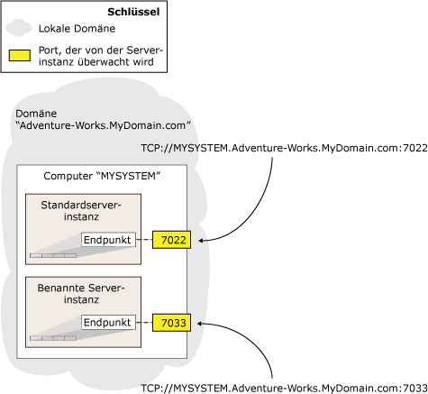

# Der Datenbankspiegelungs-Endpunkt (SQL Server)
  Um in [!INCLUDE[ssHADR](../../includes/sshadr-md.md)] oder an der Datenbankspiegelung teilzunehmen, benötigt eine Serverinstanz ihren eigenen *Datenbank-Spiegelungsendpunkt*. Dieser Endpunkt ist ein auf einen bestimmten Zweck ausgerichteter Endpunkt, der ausschließlich dafür verwendet wird, diese Verbindungen von anderen Serverinstanzen zu empfangen. Auf einer angegebenen Serverinstanz verwendet jeder [!INCLUDE[ssHADR](../../includes/sshadr-md.md)] oder jede Datenbankspiegelungsverbindung zu einer beliebigen anderen Serverinstanz einen einzelnen Datenbankspiegelungs-Endpunkt.  
  
 Datenbank-Spiegelungsendpunkte senden und empfangen Meldungen zwischen den Serverinstanzen beim Teilnehmen an Datenbankspiegelungssitzungen über TCP (Transmission Control Protocol) oder beim Hosten verfügbarer Replikate. Der Datenbank-Spiegelungsendpunkt lauscht an einer eindeutigen TCP-Portnummer.  
  
> [!NOTE]  
>  Clientverbindungen mit einem Prinzipalserver oder einem primären Replikate verwenden keinen Datenbank-Spiegelungsendpunkt.  
  
> [!NOTE]  
>  Die Datenbankspiegelungsfunktion wird in zukünftigen Versionen von Microsoft SQL Server nicht mehr bereitgestellt. Verwenden Sie diese Funktion beim Entwickeln neuer Anwendungen nicht, und planen Sie das Ändern von Anwendungen, die derzeit Datenbankspiegelung verwenden. Verwenden Sie stattdessen [!INCLUDE[ssHADR](../../includes/sshadr-md.md)].  
  
  
##   Server-Netzwerkadressen  
 Die Netzwerkadresse einer Serverinstanz (die *Server-Netzwerkadresse* oder *Endpunkt-URL*) enthält die Portnummer des zugehörigen Endpunkts sowie den System- und Domänennamen des entsprechenden Hostcomputers. Die Portnummer identifiziert eindeutig eine bestimmte Serverinstanz.  
  
 In der folgenden Abbildung wird veranschaulicht, wie zwei Serverinstanzen auf demselben Server eindeutig identifiziert werden. Die Server-Netzwerkadressen beider Serverinstanzen enthalten denselben Systemnamen, `MYSYSTEM`, und Domänennamen, `Adventure-Works.MyDomain.com`. Damit das System Verbindungen an eine Serverinstanz routen kann, enthält eine Server-Netzwerkadresse die dem Spiegelungsendpunkt einer bestimmten Serverinstanz zugeordnete Portnummer.  
  
   
  
 Standardmäßig enthält eine Instanz von [!INCLUDE[ssNoVersion](../../includes/ssnoversion-md.md)] keinen Datenbank-Spiegelungsendpunkt. Diese müssen manuell als Teil des Einrichtungsprozesses einer Datenbankspiegelungssitzung erstellt werden. Der Systemadministrator muss einen separaten Endpunkt in jeder Serverinstanz erstellen, die an der Datenbankspiegelung teilnehmen soll. Hinweis: Wenn mehr als eine Serverinstanz auf einem angegebenen Computer einen Datenbank-Spiegelungsendpunkt erfordert, müssen Sie für jeden Endpunkt eine andere Portnummer angeben.  
  
> [!IMPORTANT]  
>  Falls der Computer, auf dem [!INCLUDE[ssNoVersion](../../includes/ssnoversion-md.md)] ausgeführt wird, über eine Firewall verfügt, muss die Firewall so konfiguriert sein, dass für den im Endpunkt angegebenen Port eingehende und ausgehende Verbindungen zugelassen werden.  
  
 Für die Datenbankspiegelung und  [!INCLUDE[ssHADR](../../includes/sshadr-md.md)] werden Authentifizierung und Verschlüsselung am Endpunkt konfiguriert. Weitere Informationen finden Sie unter [Transportsicherheit für Datenbankspiegelung und Always On-Verfügbarkeitsgruppen (SQL Server)](../../database-engine/database-mirroring/transport security - database mirroring - always on availability.md).  
  
> [!IMPORTANT]  
>  Ein bereits verwendeter Datenbankspiegelungs-Endpunkt darf nicht neu konfiguriert werden. Die Serverinstanzen verwenden die Endpunkte der anderen Instanzen, um sich einen Überblick über die Status der anderen Systeme zu verschaffen. Wird der Endpunkt neu konfiguriert, ist ein erneutes Starten möglich, was von den anderen Serverinstanzen als Fehler aufgefasst werden könnte. Dies ist vor allem im Modus für den automatischen Failovermodus wichtig, bei dem das Neukonfigurieren des Endpunkts auf einem Partner zur Ausführung eines Failovers führen könnte.  
  
  
##   Bestimmen des Authentifizierungstyps für einen Datenbankspiegelungs-Endpunkt  
 Es ist wichtig zu wissen, dass durch die [!INCLUDE[ssNoVersion](../../includes/ssnoversion-md.md)] -Dienstkonten der Serverinstanzen bestimmt wird, welchen Typ von Authentifizierung Sie für die Datenbankspiegelungs-Endpunkte verwenden können:  
  
-   Wenn jede Serverinstanz unter einem Domänendienstkonto ausgeführt wird, können Sie die Windows-Authentifizierung für Ihre Datenbankspiegelungs-Endpunkte verwenden. Falls alle Serverinstanzen unter demselben Domänenbenutzerkonto ausgeführt werden, sind die richtigen Benutzeranmeldenamen automatisch in beiden **master** -Datenbanken vorhanden. Dadurch wird die Sicherheitskonfiguration für die Verfügbarkeitsdatenbanken vereinfacht und wird somit empfohlen.  
  
     Wenn Serverinstanzen, die die Verfügbarkeitsreplikate für eine Verfügbarkeitsgruppe hosten, als unterschiedliche Konten ausgeführt werden, muss die Anmeldung für die Konten in der **master** -Datenbank auf der anderen Remoteserverinstanz erstellt werden. Dieser Anmeldung müssen CONNECT-Berechtigungen gewährt werden, damit eine Verbindung mit dem Datenbankspiegelungs-Endpunkt dieser Serverinstanz hergestellt werden kann. Weitere Informationen finden Sie unter [Einrichten von Anmeldekonten für die Datenbankspiegelung oder Always On-Verfügbarkeitsgruppen (SQL Server)](../../database-engine/database-mirroring/set up login accounts - database mirroring always on availability.md).  
  
     Wenn die Serverinstanzen die Windows-Authentifizierung verwenden, können Sie Datenbankspiegelungs-Endpunkte mit [!INCLUDE[tsql](../../includes/tsql-md.md)], PowerShell oder dem Assistenten für neue Verfügbarkeitsgruppen erstellen.  
  
    > [!NOTE]  
    >  Wenn eine Serverinstanz, die Sie zum Hosten eines Verfügbarkeitsreplikats auswählen, noch keinen Datenbankspiegelungs-Endpunkt aufweist, kann der Assistent für neue Verfügbarkeitsgruppen automatisch einen Datenbankspiegelungs-Endpunkt erstellen, der die Windows-Authentifizierung verwendet. Weitere Informationen finden Sie unter [Verwenden des Assistenten zum Hinzufügen von Datenbanken zu Verfügbarkeitsgruppen (SQL Server)](../../database-engine/availability-groups/windows/use-the-availability-group-wizard-sql-server-management-studio.md).  
  
-   Wenn eine Serverinstanz unter einem integrierten Konto, z. B. lokales System, lokaler Dienst oder Netzwerkdienst, oder unter einem Nicht-Domänenkonto ausgeführt wird, müssen Sie Zertifikate zur Endpunktauthentifizierung verwenden. Wenn Sie Zertifikate für die Datenbankspiegelungs-Endpunkte verwenden, muss der Systemadministrator jede Serverinstanz so konfigurieren, dass Zertifikate sowohl für ausgehende als auch für eingehende Verbindungen verwendet werden.  
  
     Es gibt keine automatische Methode zum Konfigurieren der Datenbankspiegelungssicherheit mithilfe von Zertifikaten. Sie müssen entweder die CREATE ENDPOINT [!INCLUDE[tsql](../../includes/tsql-md.md)]-Anweisung oder das PowerShell-Cmdlet **New-SqlHadrEndpoint** verwenden. Weitere Informationen finden Sie unter [CREATE ENDPOINT (Transact-SQL)](../../t-sql/statements/create-endpoint-transact-sql.md). Informationen zum Aktivieren der Zertifikatauthentifizierung auf einer Serverinstanz finden Sie unter [Verwenden von Zertifikaten für einen Datenbankspiegelungs-Endpunkt (Transact-SQL)](../../database-engine/database-mirroring/use-certificates-for-a-database-mirroring-endpoint-transact-sql.md).  
  
  
##   Verwandte Aufgaben  
 **So konfigurieren Sie einen Datenbankspiegelungs-Endpunkt**  
  
-   [Erstellen eines Endpunkts der Datenbankspiegelung für Windows-Authentifizierung (Transact-SQL)](../../database-engine/database-mirroring/create-a-database-mirroring-endpoint-for-windows-authentication-transact-sql.md)  
  
-   [Verwenden von Zertifikaten für einen Datenbankspiegelungs-Endpunkt (Transact-SQL)](../../database-engine/database-mirroring/use-certificates-for-a-database-mirroring-endpoint-transact-sql.md)  
  
    -   [Ermöglichen des Verwendens von Zertifikaten für ausgehende Verbindungen für einen Datenbankspiegelungs-Endpunkt (Transact-SQL)](../../database-engine/database-mirroring/database mirroring - use certificates for outbound connections.md)  
  
    -   [Ermöglichen des Verwendens von Zertifikaten für eingehende Verbindungen für einen Datenbankspiegelungs-Endpunkt (Transact-SQL)](../../database-engine/database-mirroring/database mirroring - use certificates for inbound connections.md)  
  
-   [Angeben einer Servernetzwerkadresse (Datenbankspiegelung)](../../database-engine/database-mirroring/specify-a-server-network-address-database-mirroring.md)  
  
-   [Angeben der Endpunkt-URL beim Hinzufügen oder Ändern eines Verfügbarkeitsreplikats (SQL Server)](../../database-engine/availability-groups/windows/specify endpoint url - adding or modifying availability replica.md)  
  
-   [Verwenden des Assistenten für Verfügbarkeitsgruppen (SQL Server Management Studio)](../../database-engine/availability-groups/windows/use-the-availability-group-wizard-sql-server-management-studio.md)  
  
 **So zeigen Sie Informationen zum Datenbankspiegelungs-Endpunkt an**  
  
-   [sys.database_mirroring_endpoints (Transact-SQL)](../../relational-databases/system-catalog-views/sys-database-mirroring-endpoints-transact-sql.md)  
  
  
## Siehe auch  
 [Transportsicherheit für Datenbankspiegelung und Always On-Verfügbarkeitsgruppen (SQL Server)](../../database-engine/database-mirroring/transport security - database mirroring - always on availability.md)   
 [Problembehandlung für die Datenbankspiegelungskonfiguration (SQL Server)](../../database-engine/database-mirroring/troubleshoot-database-mirroring-configuration-sql-server.md)   
 [sys.dm_hadr_availability_replica_states (Transact-SQL)](../../relational-databases/system-dynamic-management-views/sys-dm-hadr-availability-replica-states-transact-sql.md)   
 [sys.dm_db_mirroring_connections (Transact-SQL)](../Topic/sys.dm_db_mirroring_connections%20\(Transact-SQL\).md)  
  
  