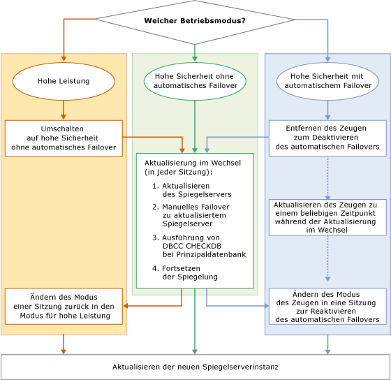

# Upgrade von gespiegelten Instanzen
[!INCLUDE[appliesto-ss-xxxx-xxxx-xxx-md](../../includes/appliesto-ss-xxxx-xxxx-xxx-md.md)] Wenn eine [!INCLUDE[ssNoVersion](../../includes/ssnoversion-md.md)]-gespiegelte Instanz auf eine neue [!INCLUDE[ssCurrent](../../includes/sscurrent-md.md)]-Version, ein neues [!INCLUDE[ssNoVersion](../../includes/ssnoversion-md.md)]-Service Pack oder ein kumulatives Update upgegradet wird, können Sie die Downtime für jede gespiegelte Datenbank auf ein einziges manuelles Failover reduzieren, indem Sie ein paralleles Upgrade ausführen (oder zwei manuelle Failover, falls Sie ein Failback auf das ursprüngliche primäre Replikat ausführen). Ein paralleles Upgrade bildet einen mehrstufigen Vorgang, bei dem im einfachsten Fall die gegenwärtig als Spiegelserver in einer Spiegelungssitzung verwendete [!INCLUDE[ssCurrent](../../includes/sscurrent-md.md)] -Instanz aktualisiert, anschließend ein manuelles Failover auf die gespiegelte Datenbank ausgeführt, die vorherige prinzipale [!INCLUDE[ssCurrent](../../includes/sscurrent-md.md)] -Instanz aktualisiert und die Spiegelung wiederaufgenommen wird. In der Praxis hängt der genaue Vorgang vom Betriebsmodus und der Anzahl sowie dem Layout der Spiegelungssitzung auf den zu aktualisierenden [!INCLUDE[ssCurrent](../../includes/sscurrent-md.md)] -Instanzen ab.  
  
> [!NOTE]  
>  Für Informationen zur Verwendung von Datenbankspiegelung mit Protokollversand während der Migration verwenden, laden Sie dieses [Whitepaper zur Datenbankspiegelung und zum Protokollversand](https://t.co/RmO6ruCT4J)herunter.  
  
## Voraussetzungen  
 Lesen Sie die folgenden wichtigen Informationen, bevor Sie beginnen:  
  
-   [Supported Version and Edition Upgrades](../../database-engine/install-windows/supported-version-and-edition-upgrades.md): Prüfen Sie, dass Sie von Ihrer Version des Windows-Betriebssystems und Ihrer Version des SQL Servers auf SQL Server 2016 upgraden können. Sie können beispielsweise nicht direkt von einer SQL Server 2005-Instanz auf [!INCLUDE[ssCurrent](../../includes/sscurrent-md.md)]upgraden.  
  
-   [Choose a Database Engine Upgrade Method](../../database-engine/install-windows/choose-a-database-engine-upgrade-method.md): Wählen Sie die passende Upgrademethode und die Schritte aus, die sowohl auf Ihrer Betrachtung der unterstützten Version und Editionsupgrades als auch auf den anderen in Ihrer Umgebung installierten Komponenten basieren, um die Komponenten in der richtigen Reihenfolge upzugraden.  
  
-   [Planen und Testen des Upgradeplans für das Datenbankmodul](../../database-engine/install-windows/plan-and-test-the-database-engine-upgrade-plan.md): Überprüfen Sie die Anmerkungen zu dieser Version, die bekannten Upgradeprobleme und die Prüfliste vor dem Upgrade. Entwickeln und testen Sie den Upgradeplan.  
  
-   [Hardware- und Softwareanforderungen für die Installation von SQL Server 2016](../../sql-server/install/hardware-and-software-requirements-for-installing-sql-server.md): Überprüfen Sie die Softwareanforderungen für die Installation von [!INCLUDE[ssCurrent](../../includes/sscurrent-md.md)]. Falls zusätzliche Software erforderlich ist, installieren Sie diese auf jedem Knoten, bevor Sie mit dem Upgradevorgang beginnen, um die Downtime zu minimieren.  
  
## Empfehlungen zur Vorbereitung (bewährte Methoden)  
 Vor dem Start eines parallelen Upgrades sollten Sie Folgendes ausführen:  
  
1.  Führen Sie zu Übungszwecken ein manuelles Failover für mindestens eine der Spiegelungssitzungen aus:  
  
    -   [Manueller Failover für eine Datenbank-Spiegelungssitzung &#40;SQL Server Management Studio&#41;](../../database-engine/database-mirroring/manually-fail-over-a-database-mirroring-session-sql-server-management-studio.md)  
  
    -   [Manuelles Failover für eine Datenbank-Spiegelungssitzung &#40;Transact-SQL&#41;](../../database-engine/database-mirroring/manually-fail-over-a-database-mirroring-session-transact-sql.md).  
  
    > [!NOTE]  
    >  Informationen zum Verwalten des potenziellen Datenverlusts finden Sie unter [Rollenwechsel während einer Datenbank-Spiegelungssitzung &#40;SQL Server&#41;](../../database-engine/database-mirroring/role-switching-during-a-database-mirroring-session-sql-server.md).  
  
2.  Schützen Sie Ihre Daten:  
  
    1.  Führen Sie für jede Prinzipaldatenbank eine vollständige Datenbanksicherung aus:  
  
         [Erstellen einer vollständigen Datenbanksicherung &#40;SQL Server&#41;](../../relational-databases/backup-restore/create-a-full-database-backup-sql-server.md).  
  
    2.  Führen Sie den [DBCC CHECKDB](../../t-sql/database-console-commands/dbcc-checkdb-transact-sql.md)-Befehl für jede Prinzipaldatenbank aus.  
  
## Phasen eines parallelen Upgrades  
 Die einzelnen Schritte bei einem parallelen Upgrade hängen vom Betriebsmodus der Spiegelungskonfiguration ab. Die grundlegenden Phasen sind jedoch identisch.  
  
> [!NOTE]  
>  Weitere Informationen zu den Betriebsmodi finden Sie unter [Betriebsmodi der Datenbankspiegelung](../../database-engine/database-mirroring/database-mirroring-operating-modes.md).  
  
 Die folgende Abbildung zeigt ein Flussdiagramm mit den Grundstufen eines parallelen Upgrades für jeden Betriebsmodus. Die entsprechenden Prozeduren finden Sie nach der Abbildung.  
  
   
  
> [!IMPORTANT]  
>  Eine Serverinstanz kann bei gleichzeitigen Spiegelungssitzungen verschiedene Spiegelungsrollen (Prinzipalserver, Spiegelserver oder Zeuge) ausführen. In diesem Fall müssen Sie den grundlegenden Prozess für das parallele Upgrade entsprechend anpassen. Weitere Informationen finden Sie unter [Rollenwechsel während einer Datenbank-Spiegelungssitzung &#40;SQL Server&#41;](../../database-engine/database-mirroring/role-switching-during-a-database-mirroring-session-sql-server.md)herunter.  
  
> [!NOTE]  
>  In vielen Fällen wird nach Fertigstellung des parallelen Upgrades ein Failback auf den ursprünglichen Prinzipalserver durchgeführt.  
  
### So ändern Sie den Modus einer Sitzung vom Modus für hohe Leistung in den Modus für hohe Sicherheit  
  
1.  Ändern Sie den Betriebsmodus in den Modus für hohe Sicherheit ohne automatisches Failover, wenn sich eine Spiegelungssitzung vor der Ausführung eines parallelen Upgrades im Modus für hohe Leistung befindet.  
  
    > [!IMPORTANT]  
    >  Wenn der Spiegelserver vom Prinzipalserver geografisch entfernt ist, ist ein paralleles Upgrade möglicherweise nicht geeignet.  
  
    -   In [!INCLUDE[ssManStudioFull](../../includes/ssmanstudiofull-md.md)]: Ändern Sie im Dialogfeld **Datenbankeigenschaften** auf der Seite **Spiegelung** die Option [Betriebsmodus](../../relational-databases/databases/database-properties-mirroring-page.md) in **Hohe Sicherheit ohne automatisches Failover (synchron)** . Informationen über den Zugriff auf diese Seite finden Sie unter [Starten des Assistenten zum Konfigurieren der Sicherheit für die Datenbankspiegelung &#40;SQL Server Management Studio&#41;](../../database-engine/database-mirroring/start-the-configuring-database-mirroring-security-wizard.md).  
  
    -   In [!INCLUDE[tsql](../../includes/tsql-md.md)]: Legen Sie die Transaktionssicherheit auf FULL fest. Weitere Informationen finden Sie unter [Ändern der Transaktionssicherheit in einer Datenbank-Spiegelungssitzung &#40;Transact-SQL&#41;](../../database-engine/database-mirroring/change-transaction-safety-in-a-database-mirroring-session-transact-sql.md).  
  
### So entfernen Sie einen Zeugen aus einer Sitzung  
  
1.  Wenn ein Zeuge an einer Spiegelungssitzung beteiligt ist, sollte der Zeuge vor der Ausführung eines parallelen Upgrades entfernt werden. Andernfalls hängt die Datenbankverfügbarkeit beim Upgrade der Spiegelserverinstanz von dem Zeugen ab, der weiterhin mit der Prinzipalserverinstanz verbunden bleibt. Nachdem Sie den Zeugen entfernt haben, ist ein Upgrade jederzeit während des parallelen Upgrades ohne Gefahr eines Datenbankausfalls möglich.  
  
    > [!NOTE]  
    >  Weitere Informationen finden Sie unter [Quorum: Auswirkungen eines Zeugen auf die Datenbankverfügbarkeit &#40;Datenbankspiegelung&#41;](../../database-engine/database-mirroring/quorum-how-a-witness-affects-database-availability-database-mirroring.md).  
  
    -   [Entfernen des Zeugen aus einer Datenbank-Spiegelungssitzung &#40;SQL Server&#41;](../../database-engine/database-mirroring/remove-the-witness-from-a-database-mirroring-session-sql-server.md)  
  
### So führen Sie das parallele Upgrade aus  
  
1.  Zur Minimierung der Ausfallzeit wird Folgendes empfohlen: Starten Sie das parallele Upgrade mit dem Aktualisieren aller Spiegelungspartner, die aktuell als Spiegelserver in allen Spiegelungssitzungen fungieren. Möglicherweise müssen an dieser Stelle mehrere Serverinstanzen aktualisiert werden.  
  
    > [!NOTE]  
    >  Ein Zeuge kann jederzeit während der Ausführung des parallelen Upgrades aktualisiert werden. Wenn beispielsweise eine Serverinstanz in Sitzung 1 als Spiegelserver und in Sitzung 2 als Zeuge fungiert, können Sie die Serverinstanz nun aktualisieren.  
  
     Welche Serverinstanz zuerst aktualisiert wird, hängt von der aktuellen Konfiguration der Spiegelungssitzungen ab, und zwar wie folgt:  
  
    -   Wenn eine Serverinstanz bereits als Spiegelserver in allen Spiegelungssitzungen fungiert, aktualisieren Sie die Serverinstanz auf die neue Version.  
  
    -   Wenn alle Serverinstanzen aktuell als Prinzipalserver in allen Spiegelungssitzungen fungieren, wählen Sie eine Serverinstanz aus, die zuerst aktualisiert werden soll. Führen Sie dann ein manuelles Failover für alle Prinzipaldatenbanken aus, und aktualisieren Sie die Serverinstanz.  
  
     Nach dem Upgrade schließt sich eine Serverinstanz automatisch wieder den zugehörigen Spiegelungssitzungen an.  
  
2.  Warten Sie bei jeder Spiegelungssitzung, deren Serverinstanz gerade aktualisiert wurde, ab, bis die Sitzung synchronisiert ist. Stellen Sie dann eine Verbindung mit der Prinzipalserverinstanz her, und führen Sie manuell ein Failover zur Sitzung aus. Beim Failover wird die aktualisierte Serverinstanz zum Prinzipalserver dieser Sitzung, und der frühere Prinzipalserver wird zum Spiegelserver.  
  
     Ziel dieses Schritts ist es, dass eine andere Serverinstanz zum Spiegelserver in jeder Spiegelungssitzung wird, an der sie als Partner beteiligt ist.  
  
     **Einschränkungen nach einem Failover zu einer aktualisierten Serverinstanz**  
  
     Nach dem Ausführen eines Failovers von einer früheren zu einer [!INCLUDE[ssCurrent](../../includes/sscurrent-md.md)] -Serverinstanz wird die Datenbanksitzung angehalten. Sie kann erst dann fortgesetzt werden, wenn der andere Partner aktualisiert wurde. Der Prinzipalserver nimmt jedoch nach wie vor Verbindungen an und lässt den Datenzugriff auf die und Änderungen an der Prinzipaldatenbank zu.  
  
    > [!NOTE]  
    >  Damit eine neue Spiegelungssitzung eingerichtet werden kann, muss auf allen Serverinstanzen dieselbe Version von [!INCLUDE[ssNoVersion](../../includes/ssnoversion-md.md)]ausgeführt werden.  
  
3.  Nach dem Failover sollten Sie den [DBCC CHECKDB](../../t-sql/database-console-commands/dbcc-checkdb-transact-sql.md) -Befehl für die Prinzipaldatenbank ausführen.  
  
4.  Aktualisieren Sie alle Serverinstanzen, die nun als Spiegelserver in allen Spiegelungssitzungen fungieren, in denen sie als Partner beteiligt sind. Möglicherweise müssen an dieser Stelle mehrere Server aktualisiert werden.  
  
    > [!IMPORTANT]  
    >  Es ist möglich, dass in einer komplexen Spiegelungskonfiguration manche Serverinstanz nach wie vor der ursprüngliche Prinzipalserver in mindestens einer Spiegelungssitzung ist. Wiederholen Sie die Schritte 2 bis 4 für diese Serverinstanzen, bis alle beteiligten Instanzen aktualisiert sind.  
  
5.  Setzen Sie die Spiegelungssitzung fort.  
  
    > [!NOTE]  
    >  Ein automatisches Failover ist erst möglich, wenn der Zeuge aktualisiert und der Spiegelungssitzung erneut hinzugefügt wurde.  
  
6.  Aktualisieren Sie die verbleibenden Serverinstanzen, die als Zeuge in allen zugehörigen Spiegelungssitzungen fungieren. Nachdem sich ein aktualisierter Zeuge wieder einer Spiegelungssitzung angeschlossen hat, ist das Ausführen eines automatischen Failovers wieder möglich. Möglicherweise müssen an dieser Stelle mehrere Server aktualisiert werden.  
  
### So ändern Sie den Modus einer Sitzung wieder in den Modus für hohe Leistung  
  
1.  Sie haben die folgenden Möglichkeiten, um den Modus einer Sitzung wieder in den Modus für hohe Leistung zu ändern:  
  
    -   In [!INCLUDE[ssManStudioFull](../../includes/ssmanstudiofull-md.md)]: Ändern Sie im Dialogfeld **Datenbankeigenschaften** auf der Seite **Spiegelung** die Option [Betriebsmodus](../../relational-databases/databases/database-properties-mirroring-page.md) in **Hohe Leistung (asynchron)** .  
  
    -   In [!INCLUDE[tsql](../../includes/tsql-md.md)]: Verwenden Sie [ALTER DATABASE](../../t-sql/statements/alter-database-transact-sql-database-mirroring.md), um die Transaktionssicherheit auf OFF festzulegen.  
  
### So fügen Sie einen Zeugen einer Spiegelungssitzung erneut hinzu  
  
1.  Im Modus für hohe Sicherheit können Sie den Zeugen in jeder Spiegelungssitzung wiederherstellen.  
  
     **So fügen Sie einen Zeugen wieder hinzu**  
  
    -   [Hinzufügen oder Ersetzen eines Datenbank-Spiegelungszeugen &#40;SQL Server Management Studio&#41;](../../database-engine/database-mirroring/add-or-replace-a-database-mirroring-witness-sql-server-management-studio.md)  
  
    -   [Hinzufügen eines Zeugen für die Datenbankspiegelung mithilfe der Windows-Authentifizierung &#40;Transact-SQL&#41;](../../database-engine/database-mirroring/add-a-database-mirroring-witness-using-windows-authentication-transact-sql.md)  
  
## Weitere Informationen finden Sie unter  
 [Aktualisieren auf SQL Server 2016 mithilfe des Installations-Assistenten &#40;Setup&#41;](../../database-engine/install-windows/upgrade-sql-server-using-the-installation-wizard-setup.md)   
 [Installieren von SQL Server 2016 von der Eingabeaufforderung](../../database-engine/install-windows/install-sql-server-2016-from-the-command-prompt.md)   
 [ALTER DATABASE-Datenbankspiegelung &#40;Transact-SQL&#41;](../../t-sql/statements/alter-database-transact-sql-database-mirroring.md)   
 [BACKUP &#40;Transact-SQL&#41;](../../t-sql/statements/backup-transact-sql.md)   
 [Anzeigen des Status einer gespiegelten Datenbank (SQL Server Management Studio)](../../database-engine/database-mirroring/view-the-state-of-a-mirrored-database-sql-server-management-studio.md)   
 [Datenbankspiegelung &#40;SQL Server&#41;](../../database-engine/database-mirroring/database-mirroring-sql-server.md)   
 [Rollenwechsel während einer Datenbank-Spiegelungssitzung &#40;SQL Server&#41;](../../database-engine/database-mirroring/role-switching-during-a-database-mirroring-session-sql-server.md)   
 [Erzwingen des Diensts in einer Datenbank-Spiegelungssitzung (Transact-SQL)](../../database-engine/database-mirroring/force-service-in-a-database-mirroring-session-transact-sql.md)   
 [Starten des Datenbankspiegelungs-Monitors &#40;SQL Server Management Studio&#41;](../../database-engine/database-mirroring/start-database-mirroring-monitor-sql-server-management-studio.md)   
 [Database Mirroring Operating Modes](../../database-engine/database-mirroring/database-mirroring-operating-modes.md)  
  
  
