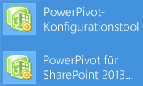

# <a name="upgrade-power-pivot-for-sharepoint"></a>Upgraden von PowerPivot für SharePoint
  In diesem Thema sind die Schritte zusammengefasst, die erforderlich sind, um eine Bereitstellung von [!INCLUDE[ssGeminiShort](../../includes/ssgeminishort-md.md)] auf [!INCLUDE[ssGeminiLong](../../includes/ssgeminilong-md.md)]zu aktualisieren. Die jeweiligen Schritte hängen von der SharePoint-Version ab, unter der die Umgebung gerade ausgeführt wird, und umfassen das [!INCLUDE[ssGemini](../../includes/ssgemini-md.md)] für SharePoint-Add-In (**spPowerPivot.msi**).  
  
 **[!INCLUDE[applies](../../includes/applies-md.md)]**  SharePoint 2010 | SharePoint 2013  
  
 Versionsanmerkungen finden Sie unter [SQL Server 2016 Release Notes](http://go.microsoft.com/fwlink/?LinkID=398124)(Versionsanmerkungen zu SQL Server 2016).  
  
 **In diesem Thema:**  
  
 [Erforderliche Komponenten](#bkmk_prereq)  
  
 [Aktualisieren einer vorhandenen SharePoint 2013-Farm](#bkmk_uprgade_sharepoint2013)  
  
 [Aktualisieren einer vorhandenen SharePoint 2010-Farm](#bkmk_uprgade_sharepoint2010)  
  
 [Arbeitsmappen](#bkmk_workbooks)  
  
 [Datenaktualisierung](#bkmk_datarefresh)  
  
 [Überprüfen der Versionen von PowerPivot-Komponenten und -Diensten](#bkmk_verify_versions)  
  
 [Upgraden von mehreren PowerPivot für SharePoint-Servern in einer SharePoint-Farm](#geminifarm)  
  
 [Anwenden eines QFEs auf eine PowerPivot-Instanz in der Farm](#qfe)  
  
 [Überprüfungstasks nach dem Upgrade](#verify)  
  
## <a name="background"></a>Hintergrund  
  
-   Wenn Sie eine SharePoint 2010-Multiserverfarm aktualisieren, die zwei oder mehrere [!INCLUDE[ssGeminiShort](../../includes/ssgeminishort-md.md)] -Instanzen aufweist, müssen Sie jeden Server vollständig aktualisieren, **bevor** Sie mit dem nächsten Server fortfahren. Bei einem vollständigen Upgrade muss zunächst das SQL Server-Setup ausgeführt werden, um [!INCLUDE[ssGeminiShort](../../includes/ssgeminishort-md.md)] -Programmdateien zu aktualisieren. Anschließend müssen die aktualisierten Dienste mit SharePoint-Upgradeaktionen konfiguriert werden. Die Serververfügbarkeit ist beschränkt, bis Sie Upgradeaktionen im entsprechenden [!INCLUDE[ssGemini](../../includes/ssgemini-md.md)] -Konfigurationstool oder Windows PowerShell ausführen.  
  
-   Alle [!INCLUDE[ssGemini](../../includes/ssgemini-md.md)] -Systemdienst- und Analysis Services-Instanzen in einer SharePoint 2010-Farm müssen die gleiche Version aufweisen. Weitere Informationen zum Überprüfen der Version finden Sie in diesem Thema im Abschnitt [Überprüfen der Versionen von Power Pivot-Komponenten und -Diensten](#bkmk_verify_versions) .  
  
-   Die [!INCLUDE[ssGemini](../../includes/ssgemini-md.md)] -Konfigurationstools gehören zu den freigegebenen Funktionen von SQL Server. Alle freigegebenen Funktionen führen gleichzeitig ein Upgrade durch. Wenn Sie während eines Upgradevorgangs andere SQL Server-Instanzen oder -Funktionen auswählen, die ein Upgrade für freigegebene Funktionen erfordern, wird für das [!INCLUDE[ssGemini](../../includes/ssgemini-md.md)] -Konfigurationstool ebenfalls ein Upgrade durchgeführt. Wenn für das [!INCLUDE[ssGemini](../../includes/ssgemini-md.md)] -Konfigurationstool ein Upgrade durchgeführt wird, für die [!INCLUDE[ssGemini](../../includes/ssgemini-md.md)] -Instanz jedoch nicht, können Probleme auftreten. Weitere Informationen zu gemeinsamen Features von SQL Server finden Sie unter [Aktualisieren auf SQL Server 2016 mithilfe des Installations-Assistenten &#40;Setup&#41;](../../database-engine/install-windows/upgrade-sql-server-using-the-installation-wizard-setup.md).  
  
-   Das [!INCLUDE[ssGemini](../../includes/ssgemini-md.md)] für SharePoint-Add-In (**spPowerPivot.msi**) wird parallel zu den Vorgängerversionen installiert. Das [!INCLUDE[ssCurrent](../../includes/sscurrent-md.md)] -Add-In wird z.B. im Ordner `c:\Program Files\Microsoft SQL Server\130\Tools\PowerPivotTools`installiert.  
  
##  <a name="bkmk_prereq"></a> Erforderliche Komponenten  
 **Berechtigungen**  
  
-   Sie müssen Farmadministrator sein, um für eine [!INCLUDE[ssGemini](../../includes/ssgemini-md.md)] für SharePoint-Installation ein Upgrade durchzuführen. Sie müssen lokaler Administrator sein, um SQL Server-Setup auszuführen.  
  
-   Sie müssen über **db_owner** -Berechtigungen für die Farmkonfigurationsdatenbank verfügen.  
  
 **SQL Server:**  
  
-   Wenn die vorhandene [!INCLUDE[ssGemini](../../includes/ssgemini-md.md)] -Installation [!INCLUDE[ssKilimanjaro](../../includes/sskilimanjaro-md.md)]ist, benötigen Sie [!INCLUDE[ssKilimanjaro](../../includes/sskilimanjaro-md.md)] Service Pack 2 (SP2) für ein Upgrade auf [!INCLUDE[ssCurrent](../../includes/sscurrent-md.md)] [!INCLUDE[ssGeminiShort](../../includes/ssgeminishort-md.md)].  
  
-   Wenn die vorhandene [!INCLUDE[ssGemini](../../includes/ssgemini-md.md)] -Installation [!INCLUDE[ssSQL11](../../includes/sssql11-md.md)]ist, benötigen Sie [!INCLUDE[ssSQL11](../../includes/sssql11-md.md)] Service Pack 1 (SP1) für ein Upgrade auf [!INCLUDE[ssCurrent](../../includes/sscurrent-md.md)] [!INCLUDE[ssGeminiShort](../../includes/ssgeminishort-md.md)].  
  
 **SharePoint 2010:**  
  
-   Wenn in der vorhandenen Installation SharePoint 2010 ausgeführt wird, installieren Sie SharePoint 2010 Service Pack 2, bevor Sie ein Upgrade auf [!INCLUDE[ssCurrent](../../includes/sscurrent-md.md)][!INCLUDE[ssGeminiShort](../../includes/ssgeminishort-md.md)]. Weitere Informationen finden Sie unter [Service Pack 2 für Microsoft SharePoint 2010](http://www.microsoft.com/download/details.aspx?id=39672). Verwenden Sie den PowerShell-Befehl `(Get-SPfarm).BuildVersion.ToString()` , um die Version zu überprüfen. Eine Zuordnung von Buildversion und Freigabedatum finden Sie unter [SharePoint 2010-Buildnummern](http://www.toddklindt.com/blog/Lists/Posts/Post.aspx?ID=224).  
  
##  <a name="bkmk_uprgade_sharepoint2013"></a> Aktualisieren einer vorhandenen SharePoint 2013-Farm  
 Gehen Sie wie folgt vor, um ein Upgrade für eine [!INCLUDE[ssGeminiShort](../../includes/ssgeminishort-md.md)] -Bereitstellung in SharePoint 2013 auszuführen:  
  
   
  
1.  Führen Sie [!INCLUDE[ssCurrent](../../includes/sscurrent-md.md)] -Setup auf Back-End-Servern aus, auf denen [!INCLUDE[ssASnoversion](../../includes/ssasnoversion-md.md)] im SharePoint-Modus ausgeführt wird. Wenn der Server mehrere Instanzen von [!INCLUDE[ssASnoversion](../../includes/ssasnoversion-md.md)]hostet, führen Sie mindestens für die **POWERPIVOT** -Instanz ein Upgrade aus. In der folgenden Liste sind die Schritte des Setup-Assistenten zusammengefasst, die bei einem [!INCLUDE[ssGemini](../../includes/ssgemini-md.md)] -Upgrade ausgeführt werden:  
  
    1.  Klicken Sie im [!INCLUDE[ssNoVersion](../../includes/ssnoversion-md.md)] -Setup-Assistenten auf **Installation**.  
  
    2.  Klicken Sie auf **Aktualisieren von SQL Server**.  
  
    3.  Wählen Sie auf der Seite **Instanz auswählen** den Instanznamen **POWERPIVOT** aus, und klicken Sie auf **Weiter**.  
  
    4.  Weitere Informationen finden Sie unter [Aktualisieren auf SQL Server 2016 mithilfe des Installations-Assistenten &#40;Setup&#41;](../../database-engine/install-windows/upgrade-sql-server-using-the-installation-wizard-setup.md).  
  
2.  Starten Sie den Server neu.  
  
3.  Führen Sie das [!INCLUDE[ssGemini](../../includes/ssgemini-md.md)] für SharePoint-Add-In (**spPowerPivot.msi**) auf jedem Server in der SharePoint 2013-Farm aus, um die Datenanbieter zu installieren. Eine Ausnahme bilden Server, auf denen der SQL Server-Setup-Assistent ausgeführt wurde, da die Datenanbieter dadurch ebenfalls aktualisiert werden. Weitere Informationen finden Sie unter [Herunterladen von Microsoft SQL Server 2014 Power Pivot für Microsoft SharePoint 2013](https://www.microsoft.com/en-us/download/details.aspx?id=42300) und [Installieren oder Deinstallieren von Power Pivot für SharePoint-Add-Ins (SharePoint 2013)](../../analysis-services/instances/install-windows/install-or-uninstall-the-power-pivot-for-sharepoint-add-in-sharepoint-2013.md).  
  
4.  **Führen Sie das [!INCLUDE[ssGemini](../../includes/ssgemini-md.md)] für SharePoint 2013“** für einen der SharePoint-Anwendungsserver aus, um die SharePoint-Farm mit den aktualisierten Lösungsdateien zu konfigurieren, die vom Add-In installiert werden. Die SharePoint-Zentraladministration kann für diesen Schritt nicht verwendet werden. Weitere Informationen finden Sie unter den folgenden Links:  
  
    1.  Geben Sie im Windows-Startbildschirm **[!INCLUDE[ssGemini](../../includes/ssgemini-md.md)]** ein, und klicken Sie in den Suchergebnissen auf **[!INCLUDE[ssGemini](../../includes/ssgemini-md.md)] für SharePoint 2013**. Beachten Sie, dass bei der Suche beide Versionen des Konfigurationstools zurückgegeben werden können.  
  
           
  
         oder  
  
         Zeigen Sie im **Startmenü** auf **Alle Programme**, und klicken Sie dann auf [!INCLUDE[ssCurrentUI](../../includes/sscurrentui-md.md)], **Konfigurationstools**und auf das **[!INCLUDE[ssGemini](../../includes/ssgemini-md.md)] für SharePoint 2013“**. Beachten Sie, dass dieses Tool nur aufgeführt ist, wenn [!INCLUDE[ssGeminiShort](../../includes/ssgeminishort-md.md)] auf dem lokalen Server installiert ist.  
  
    2.  Beim Starten überprüft das Konfigurationstool den Upgradestatus der [!INCLUDE[ssGemini](../../includes/ssgemini-md.md)] -Farmlösung und der [!INCLUDE[ssGemini](../../includes/ssgemini-md.md)] -Webanwendungslösungen. Wenn frühere Versionen dieser Lösungen erkannt werden, wird folgende Meldung angezeigt: „**Neuere Versionen der [!INCLUDE[ssGemini](../../includes/ssgemini-md.md)]-Lösungsdateien wurden erkannt. Wählen Sie die Option zum Durchführen eines Upgrades für Ihre Farm**.“ Klicken Sie auf **OK** , um die Systemüberprüfungsmeldung zu schließen.  
  
    3.  Klicken Sie auf **Funktionen, Dienste, Anwendungen und Lösungen aktualisieren**und dann auf **OK**.  
  
    4.  Überprüfen Sie die Aktionen in der linken Taskliste, und schließen Sie alle aus, die nicht vom Tool ausgeführt werden sollen. Alle Aktionen sind standardmäßig eingeschlossen. Um eine Aktion zu entfernen, wählen Sie sie in der linken Taskliste aus, und deaktivieren Sie dann auf der Seite **Parameter** das Kontrollkästchen **Diese Aktion in Taskliste einschließen** .  
  
    5.  Überprüfen Sie optional ausführliche Informationen auf der Registerkarte **Skript** oder **Ausgabe** .  
  
         Die Registerkarte "Ausgabe" ist eine Zusammenfassung der Aktionen, die vom Tool ausgeführt werden. Diese Informationen werden unter folgendem Protokolldateipfad gespeichert: `C:\Program Files\Microsoft SQL Server\130\Tools\PowerPivotTools\SPAddinConfiguration\Log`.  
  
         Die Registerkarte "Skript" enthält die PowerShell-Cmdlets oder verweist auf die PowerShell-Skriptdateien, die vom Tool ausgeführt werden.  
  
    6.  Klicken Sie auf **Überprüfen** , um zu überprüfen, ob jede Aktion gültig ist. Wenn **Überprüfen** nicht verfügbar ist, bedeutet das, dass alle Aktionen für das System gültig sind. Wenn **Überprüfen** verfügbar ist, haben Sie möglicherweise einen Eingabewert (z. B. den Excel-Dienstanwendungsnamen) geändert, oder das Tool hat ermittelt, dass eine bestimmte Aktion nicht ausgeführt werden kann. Wenn eine Aktion nicht ausgeführt werden kann, müssen Sie sie ausschließen oder die zugrunde liegenden Bedingungen korrigieren, aufgrund derer die Aktion als ungültig gekennzeichnet wird.  
  
        > [!IMPORTANT]  
        >  Die erste Aktion, **Farmlösung aktualisieren**, muss immer zuerst verarbeitet werden. Sie registriert die PowerShell-Cmdlets, die zur Serverkonfiguration verwendet werden. Wenn Sie für diese Aktion einen Fehler erhalten, fahren Sie nicht fort. Verwenden Sie stattdessen die vom Fehler zurückgegebenen Informationen, um das Problem vor dem Verarbeiten weiterer Aktionen in der Taskliste zu diagnostizieren und zu lösen.  
  
    7.  Klicken Sie auf **Ausführen** , um alle Aktionen auszuführen, die für diesen Task gültig sind. **Ausführen** ist nur verfügbar, nachdem die Überprüfung erfolgreich war. Wenn Sie auf **Ausführen** klicken, wird die folgende Warnung angezeigt und erinnert Sie, dass Aktionen im Batchmodus verarbeitet werden: „**Alle im Tool als gültig gekennzeichneten Konfigurationseinstellungen werden auf die SharePoint-Farm angewendet. Möchten Sie den Vorgang fortsetzen?**“.  
  
    8.  Klicken Sie zum Fortsetzen des Vorgangs auf **Ja** .  
  
    9. Die Aktualisierung von Lösungen und Funktionen in der Farm kann mehrere Minuten dauern. Während dieser Zeit treten bei Verbindungsanforderungen für [!INCLUDE[ssGemini](../../includes/ssgemini-md.md)]-Daten mit folgenden Meldungen vergleichbare **Fehler** auf: „**Die Daten konnten nicht aktualisiert werden**“ oder „**Fehler bei dem Versuch, die angeforderte Aktion auszuführen. Wiederholen Sie den Vorgang**.“ Nach dem Upgrade ist der Server verfügbar, und diese Fehler treten nicht mehr auf.  
  
     Weitere Informationen finden Sie unter den folgenden Links:  
  
    -   [Power Pivot-Konfigurationstools](../../analysis-services/power-pivot-sharepoint/power-pivot-configuration-tools.md)  
  
    -   [Konfigurieren oder Reparieren von Power Pivot für SharePoint 2013 &#40;Power Pivot-Konfigurationstool&#41;](../../analysis-services/power-pivot-sharepoint/configure-or-repair-power-pivot-for-sharepoint-2013.md)  
  
    -   [PowerPivot-Konfiguration mit Windows PowerShell](../../analysis-services/power-pivot-sharepoint/power-pivot-configuration-using-windows-powershell.md)  
  
    -   [PowerShell-Referenz für PowerPivot für SharePoint](../../analysis-services/powershell/powershell-reference-for-power-pivot-for-sharepoint.md)  
  
5.  Überprüfen Sie, ob das Upgrade erfolgreich ausgeführt wurde, indem Sie die Schritte nach dem Upgrade durchführen und die Version der [!INCLUDE[ssGemini](../../includes/ssgemini-md.md)] -Server in der Farm überprüfen. Weitere Informationen finden Sie unter [Überprüfungstasks nach dem Upgrade](#verify) in diesem Thema und im folgenden Abschnitt.  
  
##  <a name="bkmk_uprgade_sharepoint2010"></a> Aktualisieren einer vorhandenen SharePoint 2010-Farm  
 Um ein Upgrade für eine [!INCLUDE[ssGeminiShort](../../includes/ssgeminishort-md.md)] -Bereitstellung in SharePoint 2010 auszuführen, gehen Sie wie folgt vor:  
  
   
  
1.  Laden Sie [Service Pack 2 für Microsoft SharePoint 2010](http://www.microsoft.com/download/details.aspx?id=39672) herunter, und wenden Sie es auf alle Server in der Farm an. Überprüfen Sie, ob die Installation von Share Point SP2 erfolgreich abgeschlossen wurde. Öffnen Sie in der Zentraladministration auf der Seite Upgrade und Migration die Seite Produkt- und Patchinstallationsstatus überprüfen, um Statusmeldungen zu SP2 anzuzeigen.  
  
2.  Überprüfen Sie, ob der SharePoint 2010-Verwaltungsdienst von Windows ausgeführt wird.  
  
    ```  
    Get-Service | where {$_.displayname -like "*SharePoint*"}  
    ```  
  
3.  Überprüfen Sie, ob die **SharePoint**-Dienste **SQL Server Analysis Services** und **SQL Server [!INCLUDE[ssGemini](../../includes/ssgemini-md.md)]-Systemdienst** in der SharePoint-Zentraladministration gestartet wurden, oder verwenden Sie den folgenden PowerShell-Befehl:  
  
    ```  
    get-SPserviceinstance | where {$_.typename -like "*sql*"}  
    ```  
  
4.  Überprüfen Sie, ob der **Windows**-Dienst **SQL Server Analysis Services ([!INCLUDE[ssGemini](../../includes/ssgemini-md.md)])** ausgeführt wird.  
  
    ```  
    Get-Service | where {$_.displayname -like "*powerpivot*"}  
    ```  
  
5.  **Führen Sie [!INCLUDE[ssCurrent](../../includes/sscurrent-md.md)]-Setup** für den ersten SharePoint-Anwendungsserver aus, auf dem der Windows-Dienst **SQL Server Analysis Services ([!INCLUDE[ssGemini](../../includes/ssgemini-md.md)])** ausgeführt wird, um für die POWERPIVOT-Instanz ein Upgrade durchzuführen. Wählen Sie auf der Seite Installation des SQL Server-Setup-Assistenten die Upgradeoption aus. Weitere Informationen finden Sie unter [Aktualisieren auf SQL Server 2016 mithilfe des Installations-Assistenten &#40;Setup&#41;](../../database-engine/install-windows/upgrade-sql-server-using-the-installation-wizard-setup.md).  
  
6.  **Starten Sie den Server neu** , bevor Sie das Konfigurationstool ausführen. Mit diesem Schritt wird sichergestellt, dass vom SQL Server-Setup installierte Updates oder erforderliche Komponenten vollständig im System konfiguriert werden.  
  
7.  **Führen Sie das [!INCLUDE[ssGemini](../../includes/ssgemini-md.md)] -Konfigurationstool** auf dem ersten SharePoint-Anwendungsserver aus, auf dem der SQL Server Analysis Services-Dienst ([!INCLUDE[ssGemini](../../includes/ssgemini-md.md)]) ausgeführt wird, um ein Upgrade für die Lösungen und Webdienste in SharePoint durchzuführen. Die Zentraladministration kann für diesen Schritt nicht verwendet werden.  
  
    1.  Zeigen Sie im **Startmenü** auf **Alle Programme**, klicken Sie auf [!INCLUDE[ssCurrentUI](../../includes/sscurrentui-md.md)]und **Konfigurationstools**, und klicken Sie dann auf **[!INCLUDE[ssGemini](../../includes/ssgemini-md.md)] -Konfigurationstool**. Beachten Sie, dass dieses Tool nur aufgeführt ist, wenn [!INCLUDE[ssGeminiShort](../../includes/ssgeminishort-md.md)] auf dem lokalen Server installiert ist.  
  
    2.  Beim Starten überprüft das Konfigurationstool den Upgradestatus der [!INCLUDE[ssGemini](../../includes/ssgemini-md.md)] -Farmlösung und der [!INCLUDE[ssGemini](../../includes/ssgemini-md.md)] -Webanwendungslösungen. Wenn frühere Versionen dieser Lösungen erkannt werden, wird folgende Meldung angezeigt: „Neuere Versionen der [!INCLUDE[ssGemini](../../includes/ssgemini-md.md)] -Lösungsdateien wurden erkannt. Wählen Sie die Upgradeoption, um ein Upgrade für die Farm durchzuführen.“ Klicken Sie auf **OK** , um die Meldung zu schließen.  
  
    3.  Klicken Sie auf **Funktionen, Dienste, Anwendungen und Lösungen aktualisieren**, und klicken Sie dann auf **OK** , um fortzufahren.  
  
    4.  Die folgende Warnung wird angezeigt: "Arbeitsmappen im [!INCLUDE[ssGemini](../../includes/ssgemini-md.md)] -Management-Dashboard werden in Kürze auf die neueste Version aktualisiert. Alle an vorhandenen Arbeitsmappen vorgenommenen Anpassungen gehen verloren. Möchten Sie den Vorgang fortsetzen?"  
  
         Diese Warnung bezieht sich auf Arbeitsmappen im [!INCLUDE[ssGemini](../../includes/ssgemini-md.md)] -Management-Dashboard, die Berichte zu Datenaktualisierungsaktivitäten enthalten. Wenn Sie diese Arbeitsmappen angepasst haben, gehen alle an diesen Arbeitsmappen vorgenommenen Änderungen verloren, wenn vorhandene Dateien durch neuere Versionen ersetzt werden.  
  
         Klicken Sie auf **Ja** , um die Arbeitsmappen mit neueren Versionen zu überschreiben. Klicken Sie andernfalls auf **Nein** , um auf die Startseite zurückzukehren. Speichern Sie die Arbeitsmappen an einem anderen Speicherort, damit Sie eine Kopie haben, und kehren Sie dann zu diesem Schritt zurück, wenn Sie fortfahren möchten.  
  
         Weitere Informationen zum Anpassen von im Dashboard verwendeten Arbeitsmappen finden Sie unter [Anpassen des PowerPivot-Management-Dashboards](http://go.microsoft.com/fwlink/?linkID=229639).  
  
    5.  Überprüfen Sie die Aktionen in der Taskliste, und schließen Sie alle aus, die nicht vom Tool ausgeführt werden sollen. Alle Aktionen sind standardmäßig eingeschlossen. Wählen Sie zum Entfernen einer Aktion diese in der Taskliste aus, und deaktivieren Sie dann auf der Seite mit den Parametern das Kontrollkästchen **Diese Aktion in Taskliste einschließen** .  
  
    6.  Überprüfen Sie optional ausführliche Informationen auf der Registerkarte **Ausgabe** oder auf der Registerkarte **Skript** .  
  
         Die Registerkarte "Ausgabe" ist eine Zusammenfassung der Aktionen, die vom Tool ausgeführt werden. Diese Informationen werden unter folgendem Protokolldateipfad gespeichert: `c:\Program Files\Microsoft SQL Server\130\Tools\PowerPivotTools\ConfigurationTool\Log`.  
  
         Die Registerkarte "Skript" enthält die PowerShell-Cmdlets oder verweist auf die PowerShell-Skriptdateien, die vom Tool ausgeführt werden.  
  
    7.  Klicken Sie auf **Überprüfen** , um zu überprüfen, ob jede Aktion gültig ist. Wenn **Überprüfen** nicht verfügbar ist, bedeutet das, dass alle Aktionen für das System gültig sind. Wenn **Überprüfen** verfügbar ist, haben Sie möglicherweise einen Eingabewert (z. B. den Excel-Dienstanwendungsnamen) geändert, oder das Tool hat ermittelt, dass eine bestimmte Aktion nicht ausgeführt werden kann. Wenn eine Aktion nicht ausgeführt werden kann, müssen Sie sie ausschließen oder die zugrunde liegenden Bedingungen korrigieren, aufgrund derer die Aktion als ungültig gekennzeichnet wird.  
  
        > [!IMPORTANT]  
        >  Die erste Aktion, **Farmlösung aktualisieren**, muss immer zuerst verarbeitet werden. Sie registriert die PowerShell-Cmdlets, die zur Serverkonfiguration verwendet werden. Wenn Sie für diese Aktion einen Fehler erhalten, fahren Sie nicht fort. Verwenden Sie stattdessen die vom Fehler zurückgegebenen Informationen, um das Problem vor dem Verarbeiten weiterer Aktionen in der Taskliste zu diagnostizieren und zu lösen.  
  
    8.  Klicken Sie auf **Ausführen** , um alle Aktionen auszuführen, die für diesen Task gültig sind. **Ausführen** ist nur verfügbar, nachdem die Überprüfung erfolgreich war. Wenn Sie auf **Ausführen**klicken, wird die folgende Warnung angezeigt und erinnert Sie, dass Aktionen im Batchmodus verarbeitet werden: "Alle im Tool als gültig gekennzeichneten Konfigurationseinstellungen werden auf die SharePoint-Farm angewendet. Möchten Sie den Vorgang fortsetzen?"  
  
    9. Klicken Sie zum Fortsetzen des Vorgangs auf **Ja** .  
  
    10. Die Aktualisierung von Lösungen und Funktionen in der Farm kann mehrere Minuten dauern. Während dieser Zeit treten bei Verbindungsanforderungen für [!INCLUDE[ssGemini](../../includes/ssgemini-md.md)] -Daten z.B. folgende Fehler auf: „Die Daten konnten nicht aktualisiert werden.“ oder „Fehler bei dem Versuch, die angeforderte Aktion auszuführen. Wiederholen Sie den Vorgang.“ Nach dem Upgrade ist der Server verfügbar, und diese Fehler treten nicht mehr auf.  
  
8.  **Wiederholen Sie den Vorgang** für jeden SQL Server Analysis Services-Dienst ([!INCLUDE[ssGemini](../../includes/ssgemini-md.md)]) in der Farm: 1) Führen Sie SQL Server-Setup aus, 2) Führen Sie das [!INCLUDE[ssGemini](../../includes/ssgemini-md.md)] -Konfigurationstool aus.  
  
9. Überprüfen Sie, ob das Upgrade erfolgreich ausgeführt wurde, indem Sie die Schritte nach dem Upgrade durchführen und die Version der [!INCLUDE[ssGemini](../../includes/ssgemini-md.md)] -Server in der Farm überprüfen. Weitere Informationen finden Sie unter [Überprüfungstasks nach dem Upgrade](#verify) in diesem Thema und im folgenden Abschnitt.  
  
10. **Beheben von Fehlern**  
  
     Sie können Fehlerinformationen für jede Aktion im Bereich "Parameter" anzeigen.  
  
     Überprüfen Sie bei auf das Bereitstellen oder Zurückziehen der Lösung bezogenen Problemen, ob der SharePoint 2010-Administratordienst gestartet wird. Dieser Dienst führt die Zeitgeberaufträge aus, die Konfigurationsänderungen in einer Farm auslösen. Wird der Dienst nicht ausgeführt, tritt beim Bereitstellen oder Zurückziehen der Lösung ein Fehler auf. Persistente Fehler weisen darauf hin, dass sich bereits ein Auftrag zum Bereitstellen oder Zurückziehen in der Warteschlange befindet und weitere Aktionen des Konfigurationstools blockiert.  
  
    1.  Starten Sie die SharePoint 2010-Verwaltungsshell als Administrator, und führen Sie dann den folgenden Befehl aus, um Aufträge in der Warteschlange anzuzeigen:  
  
        ```  
        Stsadm –o enumdeployments  
        ```  
  
    2.  Überprüfen Sie vorhandene Bereitstellungen auf die folgenden Informationen: **Typ** ist "Zurückziehung" oder "Bereitstellung", **Datei** ist "powerpivotwebapp.wsp" oder "powerpivotfarm.wsp".  
  
    3.  Kopieren Sie bei Bereitstellungen oder Zurückziehungen von [!INCLUDE[ssGemini](../../includes/ssgemini-md.md)] -Lösungen den GUID-Wert für **JobId** , und fügen Sie ihn in den folgenden Befehl ein (verwenden Sie zum Kopieren der GUID die Befehle zum Markieren, Kopieren und Einfügen im Bearbeitungsmenü der Shell):  
  
        ```  
        Stsadm –o canceldeployment –id “<GUID>”  
        ```  
  
    4.  Wiederholen Sie den Task im Konfigurationstool, indem Sie auf **Überprüfen** und **Ausführen**klicken.  
  
     Überprüfen Sie bei allen anderen Fehlern die ULS-Protokolle. Weitere Informationen finden Sie unter [Konfigurieren und Anzeigen der SharePoint-Protokolldateien und -Diagnoseprotokollierung &#40;Power Pivot für SharePoint&#41;](~/analysis-services/power-pivot-sharepoint/configure-and-view-sharepoint-and-diagnostic-logging.md).  
  
##  <a name="bkmk_workbooks"></a> Arbeitsmappen  
 Beim Upgrade eines Servers werden die auf ihm laufenden [!INCLUDE[ssGemini](../../includes/ssgemini-md.md)] -Arbeitsmappen nicht unbedingt upgegradet. Ältere Arbeitsmappen, die in der vorherigen Version von [!INCLUDE[ssGemini](../../includes/ssgemini-md.md)] für Excel erstellt worden sind, können auch weiterhin unter Verwendung der im diesem vorherigen Release verfügbaren Funktionen verwendet werden. Arbeitsmappen bleiben funktionsbereit, da ein aktualisierter Server die Version vom OLE DB-Anbieter für Analysis Services besitzt, die ein Teil der vorherigen Installation war.  
  
##  <a name="bkmk_datarefresh"></a> Datenaktualisierung  
 Das Upgrade wirkt sich auf Datenaktualisierungsvorgänge aus. Die geplante Datenaktualisierung ist auf dem Server nur für Arbeitsmappen mit derselben Serverversion verfügbar. Wenn Sie Arbeitsmappen der früheren Version hosten, funktioniert die Datenaktualisierung ggf. nicht mehr für diese Arbeitsmappen. Um die Datenaktualisierung erneut zu aktivieren, müssen Sie die Arbeitsmappen aktualisieren. Sie können jede Arbeitsmappe manuell in [!INCLUDE[ssGemini](../../includes/ssgemini-md.md)] für Excel upgraden oder das automatische Upgrade für die Datenaktualisierungsfunktion in SharePoint 2010 aktivieren. Das automatische Upgrade aktualisiert eine Arbeitsmappe vor dem Ausführen der Datenaktualisierung auf die aktuelle Version, was dazu führt, dass der Zeitplan für Datenaktualisierungsvorgänge eingehalten wird.  
  
##  <a name="bkmk_verify_versions"></a> Überprüfen der Versionen von PowerPivot-Komponenten und -Diensten  
 Alle [!INCLUDE[ssGemini](../../includes/ssgemini-md.md)] -Systemdienst- und Analysis Services-Instanzen müssen die gleiche Version aufweisen. Um sicherzustellen, dass alle Serverkomponenten über die gleiche Version verfügen, überprüfen Sie die Versionsinformationen auf folgende Punkte:  
  
### <a name="verify-the-version-of-power-pivot-solutions-and-the-power-pivot-system-service"></a>Überprüfen der Version von PowerPivot-Lösungen und des PowerPivot-Systemdiensts  
 Führen Sie den folgenden PowerShell-Befehl aus:  
  
```  
Get-PowerPivotSystemService  
```  
  
 Überprüfen Sie **CurrentSolutionVersion**. [!INCLUDE[ssCurrent](../../includes/sscurrent-md.md)] entspricht der Version 13.0.\<Hauptversion>.\<Nebenversion>  
  
### <a name="verify-the-version-of-the-analysis-services-windows-service"></a>Überprüfen der Version des Analysis Services-Windows-Diensts  
 Wenn Sie nur einige [!INCLUDE[ssGeminiShort](../../includes/ssgeminishort-md.md)] -Server in einer SharePoint 2010-Farm aktualisiert haben, ist die Instanz von [!INCLUDE[ssASnoversion](../../includes/ssasnoversion-md.md)] auf nicht aktualisierten Servern älter als die in der Farm erwartete Version. Sie müssen alle Server auf die gleiche Version aktualisieren, um sie verwenden zu können. Verwenden Sie eine der folgenden Methoden, um die Version des SQL Server Analysis Services-Windows-Diensts ([!INCLUDE[ssGemini](../../includes/ssgemini-md.md)]) auf den einzelnen Computern zu überprüfen.  
  
 **Windows-Datei-Explorer**:  
  
1.  Navigieren Sie zum Ordner **Bin** der [!INCLUDE[ssGemini](../../includes/ssgemini-md.md)] -Instanz. Beispiel: `C:\Program Files\Microsoft SQL Server\MSAS13.POWERPIVOT\OLAP\bin`.  
  
2.  Klicken Sie mit der rechten Maustaste auf `msmdsrv.exe`, und wählen Sie **Eigenschaften**aus.  
  
3.  Klicken Sie auf **Details**.  
  
4.  [!INCLUDE[ssCurrent](../../includes/sscurrent-md.md)]-Dateiversion sollte 13.00.\<Hauptversion.>\<Nebenversion> lauten.  
  
5.  Stellen Sie sicher, dass diese Zahl mit der Version der [!INCLUDE[ssGemini](../../includes/ssgemini-md.md)] -Lösung und des Systemdiensts übereinstimmt.  
  
 **Informationen beim Starten des Diensts:**  
  
 Beim Starten des [!INCLUDE[ssGemini](../../includes/ssgemini-md.md)] -Diensts werden Versionsinformationen in das Windows-Ereignisprotokoll geschrieben.  
  
1.  Ausführen von Windows `eventvwr`  
  
2.  Erstellen Sie einen Filter für `MSOLAP$POWERPIVOT`der Quelle.  
  
3.  Suchen Sie ein mit folgendem Beispiel vergleichbares Informationsereignis.  
  
     Der  -Dienst wurde gestartet. Microsoft SQL Server Analysis Services 64-Bit Evaluation (x64) RTM **13.0.2000.8**.  
  
 **Überprüfen Sie die Dateiversion anhand von PowerShell.**  
  
 Sie können die Produktversion mit PowerShell überprüfen. PowerShell ist eine gute Wahl, wenn Sie die Versionsüberprüfung per Skript oder automatisch vornehmen möchten.  
  
```  
(get-childitem "C:\Program Files\Microsoft SQL Server\MSAS13.POWERPIVOT2000\OLAP\bin\msmdsrv.exe").VersionInfo  
```  
  
 Durch den vorangehenden PowerShell-Befehl werden in etwa folgende Informationen zurückgegeben:  
  
 ProductVersion   FileVersion           FileName  
  
 **13.0.2000.8** 2016.0130.200    C:\Programme\Microsoft SQL Server\MSAS13.POWERPIVOT2000\OLAP\bin\msmdsrv.exe  
  
### <a name="verify-the-msolap-data-provider-version-on-sharepoint"></a>Überprüfen der MSOLAP-Datenanbieterversion für SharePoint  
 Überprüfen Sie mithilfe der folgenden Anweisungen, welche Versionen des Analysis Services OLE DB-Anbieters von Excel Services als vertrauenswürdig eingestuft werden. Sie müssen Farm- oder Dienstanwendungsadministrator sein, um die Einstellungen für den vertrauenswürdigen Datenanbieter in Excel Services überprüfen zu können.  
  
1.  Klicken Sie in der Zentraladministration unter Anwendungsverwaltung auf **Dienstanwendungen verwalten**.  
  
2.  Klicken Sie auf den Namen der Excel Services-Dienstanwendung, z. B. **ExcelServiceApp1**.  
  
3.  Klicken Sie auf **Vertrauenswürdige Dienstanbieter**. Daraufhin sollte MSOLAP.5 (Microsoft OLE DB-Anbieter für OLAP Services 11.0) angezeigt werden. Wenn Sie die [!INCLUDE[ssGeminiShort](../../includes/ssgeminishort-md.md)] -Installation aktualisiert haben, wird außerdem MSOLAP.4 der Vorgängerversion angezeigt.  
  
4.  Weitere Informationen finden Sie unter [Add MSOLAP.5 as a Trusted Data Provider in Excel Services](../../analysis-services/power-pivot-sharepoint/add-msolap-5-as-a-trusted-data-provider-in-excel-services.md).  
  
 MSOLAP.4 wird als Microsoft OLE DB-Anbieter für OLAP-Dienste 10.0 bezeichnet. Bei dieser Version handelt es sich möglicherweise um die mit Excel Services installierte Standardversion von [!INCLUDE[ssKatmai](../../includes/sskatmai-md.md)] , oder es handelt sich um die [!INCLUDE[ssKilimanjaro](../../includes/sskilimanjaro-md.md)] -Version. Die von SharePoint installierte Standardversion unterstützt keinen [!INCLUDE[ssGemini](../../includes/ssgemini-md.md)] -Datenzugriff. Sie müssen die Version [!INCLUDE[ssKilimanjaro](../../includes/sskilimanjaro-md.md)] oder höher besitzen, um eine Verbindung mit [!INCLUDE[ssGemini](../../includes/ssgemini-md.md)] -Arbeitsmappen auf SharePoint herzustellen. Um sicherzustellen, dass Sie die [!INCLUDE[ssKilimanjaro](../../includes/sskilimanjaro-md.md)] -Version installiert haben, befolgen Sie die im vorherigen Abschnitt beschriebenen Anweisungen. In diesen Anweisungen wird die Vorgehensweise zum Überprüfen der Version durch Anzeigen der Dateieigenschaften erläutert.  
  
### <a name="verify-the-adomdnet-data-provider-version"></a>Überprüfen der ADOMD.NET-Datenanbieterversion  
 Überprüfen Sie anhand der folgenden Anweisungen, welche Version von ADOMD.NET installiert ist. Sie müssen Farm- oder Dienstanwendungsadministrator sein, um die Einstellungen für den vertrauenswürdigen Datenanbieter in Excel Services überprüfen zu können.  
  
1.  Navigieren Sie auf dem SharePoint-Anwendungsserver zu `c:\Windows\Assembly`.  
  
2.  Sortieren Sie nach Assemblynamen, und suchen Sie **Microsoft.Analysis Services.Adomd.Client**.  
  
3.  Überprüfen Sie, ob Sie über die Version 13.0.\<Buildnummer> verfügen.  
  
##  <a name="geminifarm"></a> Upgraden von mehreren PowerPivot für SharePoint-Servern in einer SharePoint-Farm  
 In einer Topologie mit mehreren Servern, in der sich mehr als ein [!INCLUDE[ssGeminiShort](../../includes/ssgeminishort-md.md)] -Server befindet, müssen alle Serverinstanzen und -komponenten der gleichen Version entsprechen. Der Server, auf dem die neueste Version der Software ausgeführt wird, bestimmt die Ebene aller Server in der Farm. Wenn Sie nur einige der Server aktualisieren, sind die Server, auf denen frühere Versionen der Software ausgeführt werden, nicht mehr verfügbar, bis sie ebenfalls aktualisiert werden.  
  
 Nachdem Sie den ersten Server aktualisiert haben, sind zusätzliche Server, die noch nicht aktualisiert worden sind, **nicht mehr verfügbar**. Verfügbarkeit wird wiederhergestellt, wenn alle Server auf der gleichen Ebene laufen.  
  
 SQL Server-Setup upgradet die [!INCLUDE[ssGemini](../../includes/ssgemini-md.md)] -Lösungsdateien auf dem physischen Computer. Um jedoch die in der Farm verwendeten Lösungen upzugraden, müssen Sie das in einem vorherigen Abschnitt dieses Themas beschriebene [!INCLUDE[ssGemini](../../includes/ssgemini-md.md)] -Konfigurationstool verwenden.  
  
##  <a name="qfe"></a> Anwenden eines QFEs auf eine PowerPivot-Instanz in der Farm  
 Durch das Patchen eines [!INCLUDE[ssGemini](../../includes/ssgemini-md.md)] für SharePoint-Server werden vorhandene Programmdateien auf eine neuere Version aktualisiert, die eine Lösung für ein bestimmtes Problem enthält. Wenn ein QFE für eine Topologie mit mehreren Servern übernommen wird, gibt es keinen primären Server, mit dem Sie beginnen müssen. Sie können mit jedem beliebigen Server beginnen, sofern das gleiche QFE auch für alle anderen [!INCLUDE[ssGemini](../../includes/ssgemini-md.md)] -Server in der Farm übernommen wird.  
  
 Beim Anwenden des QFEs müssen Sie auch einen Konfigurationsschritt ausführen, durch den die Serverversionsinformationen in der Konfigurationsdatenbank der Farm aktualisiert werden. Die Version des gepatchten Servers wird zur neuen erwarteten Version für die Farm. Solange das QFE nicht angewendet und für alle Computer konfiguriert wurde, können die [!INCLUDE[ssGemini](../../includes/ssgemini-md.md)] für SharePoint-Instanzen, die nicht über das QFE verfügen, keine Anforderungen für [!INCLUDE[ssGemini](../../includes/ssgemini-md.md)] -Daten verarbeiten.  
  
 Um das QFE anzuwenden und ordnungsgemäß zu konfigurieren, führen Sie die folgenden Schritte aus:  
  
1.  Installieren Sie den Patch mithilfe der Anweisungen, die mit dem QFE bereitgestellt werden.  
  
2.  Starten Sie das [!INCLUDE[ssGemini](../../includes/ssgemini-md.md)] -Konfigurationstool.  
  
3.  Klicken Sie auf **Funktionen, Dienste, Anwendungen und Lösungen aktualisieren**und dann auf **OK**.  
  
4.  Überprüfen Sie die im Upgradetask enthaltenen Maßnahmen, und klicken Sie dann auf **Überprüfen**.  
  
5.  Klicken Sie auf **Ausführen** , um die Aktionen anzuwenden.  
  
6.  Wiederholen Sie die Schritte für weitere [!INCLUDE[ssGemini](../../includes/ssgemini-md.md)] für SharePoint-Instanzen in der Farm.  
  
    > [!IMPORTANT]  
    >  Stellen Sie in einer aus mehreren Servern bestehenden Bereitstellung sicher, dass jede Instanz gepatcht und konfiguriert wird, bevor Sie zum nächsten Computer übergehen. Bevor Sie zur nächsten Instanz übergehen, muss die Upgradeaufgabe für die aktuelle Instanz vom [!INCLUDE[ssGemini](../../includes/ssgemini-md.md)] -Konfigurationstool abgeschlossen werden.  
  
 In der Zentraladministration können Sie auf der Seite **Produkt- und Patchinstallationsstatus überprüfen** im Abschnitt Update- und Patchverwaltung die Versionsinformationen für Dienste in der Farm überprüfen.  
  
##  <a name="verify"></a> Überprüfungstasks nach dem Upgrade  
 Führen Sie nach dem Abschließen des Upgrades die folgenden Schritte durch, um zu prüfen, ob der Server funktionstüchtig ist.  
  
|Task|Link|  
|----------|----------|  
|Überprüfen Sie, ob der Dienst auf allen Computern mit [!INCLUDE[ssGemini](../../includes/ssgemini-md.md)] für SharePoint ausgeführt wird.|[Starten oder Beenden eines Power Pivot für SharePoint-Servers](../../analysis-services/power-pivot-sharepoint/start-or-stop-a-power-pivot-for-sharepoint-server.md)|  
|Überprüfen Sie die Funktionsaktivierung auf der Website-Sammlungsebene.|[Aktivieren der PowerPivot-Funktionsintegration für Websitesammlungen in der Zentraladministration](../../analysis-services/power-pivot-sharepoint/activate-power-pivot-integration-for-site-collections-in-ca.md)|  
|Überprüfen Sie, ob einzelne [!INCLUDE[ssGemini](../../includes/ssgemini-md.md)] -Arbeitsmappen ordnungsgemäß geladen werden, indem Sie eine Arbeitsmappe öffnen und auf Filter und Slicer klicken, um eine Abfrage einzuleiten.|Überprüfen Sie, ob sich zwischengespeicherte Dateien auf der Festplatte befinden. Wenn es zwischengespeicherte Dateien gibt, wurden Datendateien auf dem physischen Server geladen. Suchen Sie im Ordner „\Programme\Microsoft SQL Server\MSAS13.POWERPIVOT\OLAP\Backup“ nach Cachedateien.|  
|Testdaten werden auf ausgewählten Arbeitsmappen aktualisiert, die für Datenaktualisierung konfiguriert werden.|Die einfachste Möglichkeit zum Testen der Datenaktualisierung ist die Bearbeitung des Datenaktualisierungsplans, indem Sie **Führen Sie zudem sobald wie möglich eine Aktualisierung durch.** aktivieren, sodass die Datenaktualisierung unmittelbar ausgeführt wird. Dieser Schritt bestimmt, ob die Datenaktualisierung für die aktuelle Arbeitsmappe erfolgreich ist. Wiederholen Sie diese Schritte für andere häufig verwendete Arbeitsmappen, um sicherzustellen, dass die Datenaktualisierung funktional erfolgt. Weitere Informationen zum Planen der Datenaktualisierung finden Sie unter [Planen einer Datenaktualisierung (Power Pivot für SharePoint)](http://msdn.microsoft.com/en-us/8571208f-6aae-4058-83c6-9f916f5e2f9b).|  
|Überwachen Sie die Datenaktualisierungsberichte im [!INCLUDE[ssGemini](../../includes/ssgemini-md.md)] -Management-Dashboard von Zeit zu Zeit, um sicherzustellen, dass bei der Datenaktualisierung keine Fehler aufgetreten sind.|[PowerPivot-Management-Dashboard und Verwendungsdaten](../../analysis-services/power-pivot-sharepoint/power-pivot-management-dashboard-and-usage-data.md)|  
  
 Weitere Informationen zum Konfigurieren von Einstellungen und Features für [!INCLUDE[ssGemini](../../includes/ssgemini-md.md)] finden Sie unter [Power Pivot-Serververwaltung und -konfiguration in der Zentraladministration](../../analysis-services/power-pivot-sharepoint/power-pivot-server-administration-and-configuration-in-central-administration.md).  
  
 Schrittweise Anweisungen für alle Konfigurationsaufgaben nach der Installation finden Sie unter [Anfängliche Konfiguration (Power Pivot für SharePoint)](http://msdn.microsoft.com/en-us/3a0ec2eb-017a-40db-b8d4-8aa8f4cdc146).  
  
## <a name="see-also"></a>Siehe auch  
 [Editionen und unterstützten Funktionen von SQL Server 2016](../../sql-server/editions-and-supported-features-for-sql-server-2016.md)   
 [Installation von PowerPivot für SharePoint 2010](http://msdn.microsoft.com/en-us/8d47dde7-c941-4280-a934-e2fe3f9a938f)  
  
  
