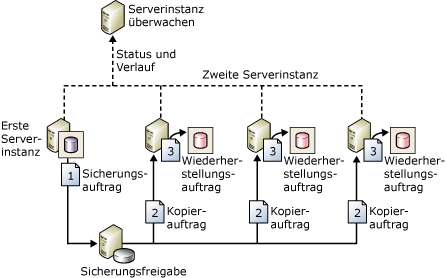

# Informationen zum Protokollversand (SQL Server)
[!INCLUDE[appliesto-ss-xxxx-xxxx-xxx-md](../../includes/appliesto-ss-xxxx-xxxx-xxx-md.md)] Mit [!INCLUDE[ssNoVersion](../../includes/ssnoversion-md.md)]-Protokollversand können Sie automatisch Transaktionsprotokollsicherungen von einer *primären Datenbank* auf einer Instanz eines *primären Servers* an eine oder mehrere *sekundäre Datenbanken* auf separaten Instanzen eines *sekundären Servers* senden. Die Transaktionsprotokollsicherungen werden einzeln auf jede der sekundären Datenbanken angewendet. Eine optionale dritte Serverinstanz, die als *Überwachungsserver*bezeichnet wird, zeichnet den Verlauf und den Status von Sicherungs- und Wiederherstellungsvorgängen auf und löst optional Warnungen aus, falls diese Vorgänge nicht wie geplant ausgeführt werden können.  
  
 **In diesem Thema:**  
  
-   [Vorteile](#Benefits)  
  
-   [Begriffe und Definitionen](#TermsAndDefinitions)  
  
-   [Übersicht über den Protokollversand](#ComponentsAndConcepts)  
  
-   [Interoperabilität](#Interoperability)  
  
-   [Verwandte Aufgaben](#RelatedTasks)  
  
##   Vorteile  
  
-   Stellt eine Lösung für die Wiederherstellung im Notfall für eine einzelne primäre Datenbank und eine oder mehrere sekundäre Datenbanken bereit, jede auf einer separaten Instanz von [!INCLUDE[ssNoVersion](../../includes/ssnoversion-md.md)].  
  
-   Unterstützt beschränkten schreibgeschützten Zugriff auf sekundäre Datenbanken (während des Intervalls zwischen Wiederherstellungsaufträgen).  
  
-   Ermöglicht eine vom Benutzer angegebene Verzögerung zwischen dem Zeitpunkt, zu dem der primäre Server das Protokoll der primären Datenbank sichert, und dem Zeitpunkt, zu dem die sekundären Server die Protokollsicherung wiederherstellen (anwenden) müssen. Eine längere Verzögerung kann nützlich sein, wenn z. B. versehentlich Daten in der primären Datenbank geändert werden. Wenn die versehentliche Änderung schnell bemerkt wird, kann eine Verzögerung es Ihnen ermöglichen, die noch unveränderten Daten von einer sekundären Datenbank abzurufen, bevor die Änderung dort widergespiegelt wird.  
  
##   Begriffe und Definitionen  
 primären Servers  
 Die Instanz von [!INCLUDE[ssNoVersion](../../includes/ssnoversion-md.md)] , die der Produktionsserver ist.  
  
 primären Datenbank  
 Die Datenbank auf dem primären Server, die Sie auf einem anderen Server sichern möchten. Die gesamte Verwaltung der Protokollversandkonfiguration über [!INCLUDE[ssManStudioFull](../../includes/ssmanstudiofull-md.md)] erfolgt von der primären Datenbank aus.  
  
 sekundären Servers  
 Die Instanz von [!INCLUDE[ssNoVersion](../../includes/ssnoversion-md.md)] , auf der Sie eine betriebsbereite Standby-Kopie der primären Datenbank bereithalten möchten.  
  
 Sekundäre Datenbank  
 Die betriebsbereite Standby-Kopie der primären Datenbank. Sie sekundäre Datenbank kann sich im Status RECOVERING oder STANDBY befinden, in dem die Datenbank für den eingeschränkten schreibgeschützten Zugriff verfügbar ist.  
  
 Überwachungsserver  
 Eine optionale Instanz von [!INCLUDE[ssNoVersion](../../includes/ssnoversion-md.md)] , die alle Informationen zum Protokollversand nachverfolgt:  
  
-   Wann das Transaktionsprotokoll in der primären Datenbank zuletzt gesichert wurde.  
  
-   Wann die Sicherungsdateien zuletzt von den sekundären Servern kopiert und wiederhergestellt wurden.  
  
-   Informationen zu Sicherungsfehlerwarnungen.  
  
> [!IMPORTANT]  
>  Nach dem Konfigurieren des Überwachungsservers kann dieser nicht ohne vorhergehendes Entfernen des Protokollversands geändert werden.  
  
 Sicherungsauftrag  
 Ein [!INCLUDE[ssNoVersion](../../includes/ssnoversion-md.md)] -Agent-Auftrag, der den Sicherungsvorgang ausführt, den Verlauf auf dem lokalen Server und dem Überwachungsserver protokolliert und veraltete Sicherungsdateien und Verlaufsinformationen löscht. Wenn der Protokollversand aktiviert ist, wird die Auftragskategorie "Protokollversandsicherung" in der primären Serverinstanz erstellt.  
  
 Kopierauftrag  
 Ein [!INCLUDE[ssNoVersion](../../includes/ssnoversion-md.md)] -Agent-Auftrag, der die Sicherungsdateien vom primären Server in ein konfigurierbares Ziel auf dem sekundären Server kopiert und den Verlauf auf dem sekundären Server und dem Überwachungsserver protokolliert. Wenn der Protokollversand auf einer Datenbank aktiviert ist, wird die Auftragskategorie "Protokollversandkopie" in jeder sekundären Serverinstanz in einer Protokollversandkonfiguration erstellt.  
  
 Wiederherstellungsauftrag  
 Ein [!INCLUDE[ssNoVersion](../../includes/ssnoversion-md.md)] -Agent-Auftrag, der die kopierten Sicherungsdateien in den sekundären Datenbanken wiederherstellt. Er protokolliert den Verlauf auf dem lokalen Server und dem Überwachungsserver und löscht veraltete Dateien und Verlaufsinformationen. Wenn der Protokollversand in einer Datenbank aktiviert ist, wird die Auftragskategorie "Protokollversandwiederherstellung" in der sekundären Serverinstanz erstellt.  
  
 Warnungsauftrag  
 Ein [!INCLUDE[ssNoVersion](../../includes/ssnoversion-md.md)] -Agent-Auftrag, der Warnungen für primäre und sekundäre Datenbanken auslöst, wenn ein Sicherungs- oder ein Wiederherstellungsvorgang nicht erfolgreich innerhalb eines angegebenen Schwellenwerts abgeschlossen wird. Wenn der Protokollversand in einer Datenbank aktiviert ist, wird die Auftragskategorie "Protokollversandwarnung"in der Überwachungsserverinstanz erstellt.  
  
> [!TIP]  
>  Für jede Warnung müssen Sie eine Warnungsnummer angeben. Stellen Sie sicher auch sicher, dass die Warnung zum Benachrichtigen eines Bedieners konfiguriert ist, wenn eine Warnung ausgelöst wird.  
  
##   Übersicht über den Protokollversand  
 Der Protokollversand besteht aus drei Vorgängen:  
  
1.  Sichern des Transaktionsprotokolls auf der primären Serverinstanz.  
  
2.  Kopieren der Transaktionsprotokolldatei auf die sekundäre Serverinstanz.  
  
3.  Wiederherstellen der Protokollsicherung auf der sekundären Serverinstanz.  
  
 Das Protokoll kann an mehrere sekundäre Serverinstanzen versendet werden. In diesen Fällen werden die Schritte 2 und 3 für jede sekundäre Serverinstanz dupliziert.  
  
 Für eine Protokollversandkonfiguration wird nicht automatisch ein Failover vom primären Server zum sekundären Server ausgeführt. Falls die primäre Datenbank nicht mehr verfügbar ist, kann eine der sekundären Datenbanken manuell online geschaltet werden.  
  
 Sie können eine sekundäre Datenbank für Berichtszwecke verwenden.  
  
 Darüber hinaus können Sie Warnungen für die Protokollversandkonfiguration konfigurieren.  
  
### A Typische Protokollversandkonfiguration  
 In der folgenden Abbildung wird eine Protokollversandkonfiguration mit der primären Serverinstanz, drei sekundären Serverinstanzen und einer Überwachungsserverinstanz dargestellt. In der Abbildung werden die Schritte, die vom Sicherungs-, Kopier- und Wiederherstellungsauftrag ausgeführt werden, folgendermaßen veranschaulicht:  
  
1.  Die primäre Serverinstanz führt den Sicherungsauftrag aus, um das Transaktionsprotokoll in der primären Datenbank zu sichern. Diese Serverinstanz speichert die Protokollsicherung dann in einer primären Protokollsicherungsdatei, die an den Sicherungsordner gesendet wird.  In dieser Abbildung befindet sich der Sicherungsordner in einem freigegebenen Verzeichnis, der *Sicherungsfreigabe*.  
  
2.  Jede der drei sekundären Serverinstanzen führt einen eigenen Kopierauftrag aus, um die primäre Protokollsicherungsdatei in ihren eigenen lokalen Zielordner zu kopieren.  
  
3.  Jede sekundäre Serverinstanz führt einen eigenen Wiederherstellungsauftrag aus, um die Protokollsicherung aus dem lokalen Zielordner in der lokalen sekundären Datenbank wiederherzustellen.  
  
 Die primäre Serverinstanz und die sekundäre Serverinstanz senden ihre eigenen Verlaufs- und Statusinformationen an die Überwachungsserverinstanz.  
  
   
  
##   Interoperabilität  
 Der Protokollversand kann mit den folgenden Funktionen oder Komponenten von [!INCLUDE[ssNoVersion](../../includes/ssnoversion-md.md)]verwendet werden:  
  
-   [Voraussetzungen für das Migrieren vom Protokollversand zu Always On-Verfügbarkeitsgruppen &#40;SQL Server&#41;](../../database-engine/availability-groups/windows/prereqs-migrating-log-shipping-to-always-on-availability-groups.md)  
  
-   [Datenbankspiegelung und Protokollversand &#40;SQL Server&#41;](../../database-engine/database-mirroring/database-mirroring-and-log-shipping-sql-server.md)  
  
-   [Protokollversand und Replikation &#40;SQL Server&#41;](../../database-engine/log-shipping/log-shipping-and-replication-sql-server.md)  
  
> [!NOTE]  
>  [!INCLUDE[ssHADR](../../includes/sshadr-md.md)] und Datenbankspiegelung schließen sich gegenseitig aus. Eine Datenbank, die für eine dieser Funktionen konfiguriert ist, kann nicht für die andere konfiguriert werden.  
  
##   Verwandte Aufgaben  
  
-   [Aktualisieren des Protokollversands auf SQL Server 2016 &#40;Transact-SQL&#41;](../../database-engine/log-shipping/upgrading-log-shipping-to-sql-server-2016-transact-sql.md)  
  
-   [Konfigurieren des Protokollversands &#40;SQL Server&#41;](../../database-engine/log-shipping/configure-log-shipping-sql-server.md)  
  
-   [Hinzufügen einer sekundären Datenbank zu einer Protokollversandkonfiguration &#40;SQL Server&#41;](../../database-engine/log-shipping/add-a-secondary-database-to-a-log-shipping-configuration-sql-server.md)  
  
-   [Entfernen einer sekundären Datenbank aus einer Protokollversandkonfiguration &#40;SQL Server&#41;](../../database-engine/log-shipping/remove-a-secondary-database-from-a-log-shipping-configuration-sql-server.md)  
  
-   [Entfernen des Protokollversands &#40;SQL Server&#41;](../../database-engine/log-shipping/remove-log-shipping-sql-server.md)  
  
-   [Anzeigen des Protokollversandberichts &#40;SQL Server Management Studio&#41;](../../database-engine/log-shipping/view-the-log-shipping-report-sql-server-management-studio.md)  
  
-   [Überwachen des Protokollversands &#40;Transact-SQL&#41;](../../database-engine/log-shipping/monitor-log-shipping-transact-sql.md)  
  
-   [Failover zu einer sekundären Datenbank für den Protokollversand &#40;SQL Server&#41;](../../database-engine/log-shipping/fail-over-to-a-log-shipping-secondary-sql-server.md)  
  
-   [Failover zu einer sekundären Datenbank für den Protokollversand &#40;SQL Server&#41;](../../database-engine/log-shipping/fail-over-to-a-log-shipping-secondary-sql-server.md)  
  
-   [Verwaltung von Anmeldenamen und Aufträgen nach einem Rollenwechsel &#40;SQL Server&#41;](../../sql-server/failover-clusters/management-of-logins-and-jobs-after-role-switching-sql-server.md)  
  
## Siehe auch  
 [Übersicht über AlwaysOn-Verfügbarkeitsgruppen &#40;SQL Server&#41;](../../database-engine/availability-groups/windows/overview-of-always-on-availability-groups-sql-server.md)  
  
  
