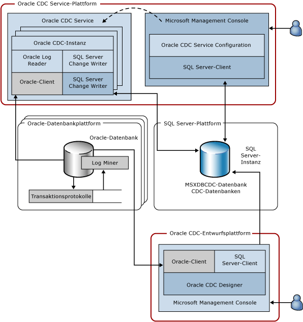

# Change Data Capture Service für Oracle von Attunity System Architecture
  Der CDC Service for Oracle zeichnet Änderungen, die an ausgewählten Tabellen in einer oder mehreren Oracle-Quelldatenbanken vorgenommen werden, in [!INCLUDE[ssNoVersion](../../includes/ssnoversion-md.md)] CDC-Datenbanken auf einer [!INCLUDE[ssNoVersion](../../includes/ssnoversion-md.md)] -Instanz auf. Im folgenden Diagramm sind die Komponenten dargestellt, aus denen der CDC Service for Oracle besteht.  
  
   
  
 Die Abbildung veranschaulicht die vier verwendeten Plattformen. In vielen Fällen können sich diese Plattformen überschneiden, aber dieses Diagramm zeigt einen standardmäßigen Anwendungsfall. Es ist z. B. sinnvoll, dass die Oracle- und [!INCLUDE[ssNoVersion](../../includes/ssnoversion-md.md)] -Datenbank jeweils auf einem separaten Computer ausgeführt werden und nicht gemeinsam mit der Oracle CDC Service-Plattform oder der Plattform genutzt werden, über die der CDC Service entworfen wird. In der Abbildung sind die folgenden Plattformen dargestellt:  
  
-   Oracle CDC Service: Hierbei kann es sich um einen beliebigen unterstützten Windows-Computer handeln, auf dem der Oracle CDC Service installiert ist und ausgeführt wird. Diese Plattform kann auch einen Clusterknoten in einem Microsoft-Failovercluster darstellen (Konfigurationen für Hochverfügbarkeit werden weiter unten in diesem Dokument behandelt).  
  
-   Oracle-Datenbank: Hierbei kann es sich um einen beliebigen Computer handeln, auf dem eine unterstützte Version der Oracle-Datenbank ausgeführt wird. Dies gilt auch für Computer, auf denen Windows, Linux oder ein beliebiges anderes Betriebssystem ausgeführt wird, das von der installierten Version der Oracle-Datenbank unterstützt wird. Beachten Sie, dass diese Plattform im Diagramm im Plural angegeben ist, da ein einzelner Oracle CDC Service die Änderungen von mehreren Oracle-Quelldatenbanken aufzeichnen kann.  
  
-   [!INCLUDE[ssNoVersion](../../includes/ssnoversion-md.md)]: Dies kann ein beliebiger Computer sein, auf dem die [!INCLUDE[ssNoVersion](../../includes/ssnoversion-md.md)] -Zieldatenbank (unterstützte SKU von [!INCLUDE[ssCurrent](../../includes/sscurrent-md.md)]) ausgeführt wird. Ein Oracle CDC Service unterstützt ein [!INCLUDE[ssNoVersion](../../includes/ssnoversion-md.md)] -Ziel, auf dem dieser Änderungstabellen und die Dienstkonfiguration speichert. Die [!INCLUDE[ssNoVersion](../../includes/ssnoversion-md.md)] -Plattform kann auch eine gruppierte Instanz von [!INCLUDE[ssCurrent](../../includes/sscurrent-md.md)] oder eine gespiegelte Instanz von [!INCLUDE[ssCurrent](../../includes/sscurrent-md.md)] darstellen (mithilfe der **Always On** -Funktion).  
  
-   Oracle CDC Designer: Hierbei kann es sich um einen beliebigen unterstützten Windows-Computer handeln, der auf die Oracle-Quelldatenbank und die [!INCLUDE[ssNoVersion](../../includes/ssnoversion-md.md)] -Zieldatenbank zugreifen kann.  
  
 In der folgenden Tabelle werden die Komponenten beschrieben, die auf den vier oben beschriebenen Plattformen ausgeführt werden.  
  
|Komponente/Beschreibung|Komponente besteht aus:|  
|----------------------------|----------------------------|  
|Oracle CDC Service: Dies ist ein Windows-Dienst, über den die Change Data Capture-Aktivität abgewickelt wird.|Oracle CDC-Instanz: Ein Unterprozess des Oracle CDC Service, der die Change Data Capture-Aktivität für eine einzelne Oracle-Quelldatenbank verarbeitet (es ist eine Oracle CDC-Instanz pro Oracle-Quelldatenbank vorhanden).|  
||Oracle Log Reader: Liest Oracle-Transaktionsprotokolle mithilfe des Oracle-Clients.|  
||Oracle-Client: Der für die Kommunikation mit Oracle verwendete Oracle Instant Client. Dies ist eine erforderliche Komponente von Oracle, die vor dem Installieren des Oracle CDC Service vorhanden sein muss.|  
||[!INCLUDE[ssNoVersion](../../includes/ssnoversion-md.md)] Change Writer: Schreibt per Commit ausgeführte Änderungen, die an der aufgezeichneten Oracle-Tabelle vorgenommen werden, in die [!INCLUDE[ssNoVersion](../../includes/ssnoversion-md.md)]-Änderungstabellen. Diese Komponente behält diesen Aufzeichnungsstatus auch innerhalb der [!INCLUDE[ssNoVersion](../../includes/ssnoversion-md.md)] -Zieldatenbank bei.|  
||[!INCLUDE[ssNoVersion](../../includes/ssnoversion-md.md)]ODBC-Client: Der Microsoft Native Client für [!INCLUDE[ssCurrent](../../includes/sscurrent-md.md)]. Dies ist eine erforderliche Komponente von Microsoft, die vor dem Installieren des Oracle CDC Service vorhanden sein muss.|  
|Oracle CDC Service Configuration: Dies ist ein Microsoft Management Console-Snap-In, das den Windows-Dienst erstellt und seine Konfiguration festlegt.|[!INCLUDE[ssNoVersion](../../includes/ssnoversion-md.md)] -Client: Der SQL ADO.NET-Client, der in Version 4 von .NET Framework enthalten ist.|  
|Oracle-Datenbank: Eine Oracle-Quelldatenbank, aus der Änderungen an ausgewählten Tabellen aufgezeichnet werden.|Log Miner: Eine Oracle-Komponente, über die die Oracle-Transaktionsprotokolle gelesen werden.|  
||Transaktionsprotokolle: Das Onlineversionen und archivierten Versionen der Oracle Redo Logs, mit deren Hilfe Oracle sicherstellt, dass die Datenbank ein Rollback für Transaktionen ausführen und Fehler beheben kann (in diesem Fall muss die Oracle-Datenbank im Archivprotokollmodus ausgeführt werden).|  
|[!INCLUDE[ssNoVersion](../../includes/ssnoversion-md.md)] -Instanz: Eine [!INCLUDE[ssNoVersion](../../includes/ssnoversion-md.md)] -Instanz, auf der die CDC-Datenbanken gehostet werden. Hierbei kann es sich um eine gruppierte [!INCLUDE[ssNoVersion](../../includes/ssnoversion-md.md)] -Instanz (Failovercluster) oder eine gespiegelte Datenbank (Always On) handeln.|MSXDBCDC-Datenbank: Eine Datenbank, in der Informationen zu den CDC-Diensten vorgehalten werden, die mit dieser [!INCLUDE[ssNoVersion](../../includes/ssnoversion-md.md)] -Instanz zusammenarbeiten. Darin sind auch Informationen zu den Oracle CDC-Instanzen enthalten, die von den einzelnen CDC Services behandelt werden. Diese Datenbank wird als Teil des CDC Service-Erstellungsprozesses angelegt.|  
||CDC-Datenbanken: [!INCLUDE[ssNoVersion](../../includes/ssnoversion-md.md)] -Datenbanken, in denen die in einer der Oracle-Quelldatenbanken vorgenommenen Änderungen gespeichert werden. Die CDC-Datenbanken sind für [!INCLUDE[ssNoVersion](../../includes/ssnoversion-md.md)] CDC aktiviert, damit sie über die [!INCLUDE[ssNoVersion](../../includes/ssnoversion-md.md)] CDC-Tabellen und -Funktionen verfügen und von Oracle stammende Änderungen auf einfache Weise verarbeiten können.|  
|Oracle CDC Designer: Ein Microsoft Management Console-Snap-In zum Erstellen von Oracle CDC-Instanzen. Verwenden Sie es zum Auswählen der Tabellen und Spalten, die aufgezeichnet werden sollen, zum Bereitstellen von Oracle-Verbindungsinformationen und zum Verwalten des Lebenszyklus von CDC-Instanzen.|[!INCLUDE[ssNoVersion](../../includes/ssnoversion-md.md)] -Client: Der SQL ADO.NET-Client, der in Version 4 von .NET Framework enthalten ist.|  
||Oracle-Client: Der für die Kommunikation mit Oracle verwendete Oracle Instant Client. Dies ist eine erforderliche Komponente von Oracle, die vor dem Installieren des Oracle CDC Service vorhanden sein muss.|  
  
 Der Oracle CDC Service und seine untergeordneten Oracle CDC-Instanzen können nur mit den Oracle-Quelldatenbanken und der [!INCLUDE[ssNoVersion](../../includes/ssnoversion-md.md)] -Zielinstanz als Clients kommunizieren. Damit werden nicht aktiv Netzwerke und andere Protokolle überwacht. Der Oracle CDC Service überwacht die CDC-Datenbanken auf Konfigurationsänderungen und passt seine Abläufe basierend auf der aktualisierten Konfiguration an.  
  
  
