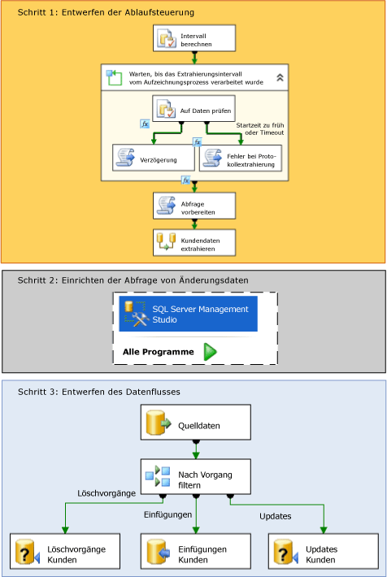

# Change Data Capture (SSIS)
  In [!INCLUDE[ssNoVersion](../../includes/ssnoversion-md.md)]bietet Change Data Capture eine effektive Lösung für die Herausforderung, inkrementelles Laden aus Quelltabellen in Data Marts und Data Warehouses effizient auszuführen.  
  
## Was ist Change Data Capture?  
 Quelltabellen ändern sich im Verlauf der Zeit. Ein Data Mart oder Data Warehouse, das auf diesen Tabellen basiert, muss diese Änderungen widerspiegeln. Ein Prozess, bei dem in regelmäßigen Abständen eine Momentaufnahme der gesamten Quelle gemacht wird, beansprucht jedoch zu viel Zeit und Ressourcen. Alternative Vorgehensweisen mit Timestampspalten, Triggern oder komplexen Abfragen beeinträchtigen oft die Leistung und erhöhen die Komplexität. Benötigt wird ein zuverlässiger Änderungsdatenstrom, der so strukturiert ist, dass er von Consumern problemlos auf Darstellungen der Daten in einer Zielumgebung angewendet werden kann. Change Data Capture in [!INCLUDE[ssNoVersion](../../includes/ssnoversion-md.md)] stellt diese Lösung bereit.  
  
 Die Change Data Capture-Funktion von [!INCLUDE[ssDE](../../includes/ssde-md.md)] erfasst Einfüge-, Update- und Löschvorgänge, die auf [!INCLUDE[ssNoVersion](../../includes/ssnoversion-md.md)] -Tabellen angewendet werden, und stellt die einzelnen Änderungen in einem leicht verwendbaren relationalen Format zur Verfügung. Die von Change Data Capture verwendeten Änderungstabellen enthalten Spalten, die die Spaltenstruktur der nachverfolgten Quelltabellen widerspiegeln, sowie die Metadaten, die zum Verständnis der zeilenweise vorgenommenen Änderungen erforderlich sind.  
  
> [!NOTE]  
>  Change Data Capture ist nicht in jeder Edition von [!INCLUDE[msCoName](../../includes/msconame-md.md)][!INCLUDE[ssNoVersion](../../includes/ssnoversion-md.md)]. Eine Liste der Funktionen, die von den [!INCLUDE[ssNoVersion](../../includes/ssnoversion-md.md)]-Editionen unterstützt werden, finden Sie unter [Von den SQL Server 2016-Editionen unterstützte Funktionen](~/sql-server/editions-and-supported-features-for-sql-server-2016.md).  
  
## Funktionsweise von Change Data Capture in Integration Services  
 Von einem [!INCLUDE[ssISnoversion](../../includes/ssisnoversion-md.md)] -Paket können auf einfache Weise die Änderungsdaten in der [!INCLUDE[ssNoVersion](../../includes/ssnoversion-md.md)] -Datenbank gesammelt werden, um ein effizientes inkrementelles Laden in ein Data Warehouse auszuführen. Bevor Sie jedoch mit [!INCLUDE[ssISnoversion](../../includes/ssisnoversion-md.md)] Änderungsdaten laden können, muss Change Data Capture von einem Administrator in der Datenbank und den Tabellen aktiviert werden, von denen Sie Änderungen erfassen möchten. Weitere Informationen zum Konfigurieren von Change Data Capture in einer Datenbank finden Sie unter [Aktivieren und Deaktivieren von Change Data Capture &#40;SQL Server&#41;](../../relational-databases/track-changes/enable-and-disable-change-data-capture-sql-server.md).  
  
 Sobald Change Data Capture von einem Administrator in der Datenbank aktiviert wurde, können Sie ein Paket erstellen, das ein inkrementelles Laden der Änderungsdaten ausführt. Das folgende Diagramm zeigt die Schritte für das Erstellen eines solchen Pakets, das ein inkrementelles Laden von einer einzelnen Tabelle ausführt:  
  
   
  
 Wie im vorherigen Diagramm gezeigt wurde, umfasst das Erstellen eines Pakets, das ein inkrementelles Laden von Änderungsdaten ausführt, die folgenden Schritte:  
  
 **Schritt 1: Entwerfen der Ablaufsteuerung**  
 In der Ablaufsteuerung vom Paket müssen die folgenden Tasks definiert werden:  
  
-   Berechnen Sie die **datetime** -Werte für den Anfang und das Ende des Intervalls der Änderungen an den Quelldaten, die Sie abrufen möchten.  
  
     Verwenden Sie einen Task „SQL ausführen“ oder [!INCLUDE[ssISnoversion](../../includes/ssisnoversion-md.md)] -Ausdrücke mit **datetime** -Funktionen, um diese Werte zu berechnen. Speichern Sie dann diese Endpunkte in Paketvariablen für die spätere Verwendung im Paket.  
  
     **Weitere Informationen:** [Angeben eines Intervalls von Änderungsdaten](../../integration-services/change-data-capture/specify-an-interval-of-change-data.md)  
  
-   Bestimmen Sie, ob die Änderungsdaten für das ausgewählte Intervall bereit sind. Dieser Schritt ist notwendig, da der asynchrone Aufzeichnungsprozess möglicherweise noch nicht den ausgewählten Endpunkt erreicht hat.  
  
     Wenn Sie bestimmen möchten, ob die Daten bereit sind, beginnen Sie mit einem For-Schleifencontainer, um die Ausführung bei Bedarf so lange zu verzögern, bis die Änderungsdaten für das ausgewählte Intervall bereit sind. Verwenden Sie innerhalb des Schleifencontainers einen Task "SQL ausführen", um die Time-Mapping-Tabellen abzufragen, die von Change Data Capture verwaltet werden. Verwenden Sie dann einen Skripttask, der die **Thread.Sleep** -Methode aufruft oder einen weiteren Task "SQL ausführen" mit einer **WAITFOR** -Anweisung, um die Ausführung des Pakets bei Bedarf vorübergehend zu verzögern. Verwenden Sie optional einen weiteren Skripttask, um eine Fehlerbedingung oder ein Timeout zu protokollieren.  
  
     **Weitere Informationen:** [Bestimmen, ob die Änderungsdaten bereit sind](../../integration-services/change-data-capture/determine-whether-the-change-data-is-ready.md)  
  
-   Bereiten Sie die Abfragezeichenfolge vor, mit der die Änderungsdaten abgefragt werden.  
  
     Verwenden Sie einen Skripttask oder einen Task "SQL ausführen", um die SQL-Anweisung zusammenzustellen, mit der Änderungen abgefragt werden.  
  
     **Weitere Informationen:** [Vorbereiten zur Abfrage der Änderungsdaten](../../integration-services/change-data-capture/prepare-to-query-for-the-change-data.md)  
  
 **Schritt 2: Einrichten der Abfrage von Änderungsdaten**  
 Erstellen Sie die Tabellenwertfunktion, die die Daten abfragt.  
  
 Verwenden Sie [!INCLUDE[ssManStudioFull](../../includes/ssmanstudiofull-md.md)] , um die Abfrage zu entwickeln und zu speichern.  
  
 **Weitere Informationen:** [Abrufen und Verstehen der Änderungsdaten](../../integration-services/change-data-capture/retrieve-and-understand-the-change-data.md)  
  
 **Schritt 3: Entwerfen des Datenflusses**  
 Im Datenfluss des Pakets müssen die folgenden Tasks definiert werden:  
  
-   Rufen Sie die Änderungsdaten von den Änderungstabellen ab.  
  
     Verwenden Sie eine Quellkomponente, um die Änderungstabellen nach den Änderungen abzufragen, die innerhalb des ausgewählten Intervalls liegen, um die Daten abzurufen. Die Quelle ruft eine Transact-SQL-Tabellenwertfunktion auf, die Sie zuvor erstellt haben müssen.  
  
     **Weitere Informationen:** [Abrufen und Verstehen der Änderungsdaten](../../integration-services/change-data-capture/retrieve-and-understand-the-change-data.md)  
  
-   Teilen Sie die Änderungen zur Verarbeitung in Einfügungen, Updates und Löschungen auf.  
  
     Wenn Sie die Änderungen aufteilen möchten, verwenden Sie eine Transformation für bedingtes Teilen, um Einfügungen, Updates und Löschungen an verschiedene Ausgaben zur entsprechenden Verarbeitung weiterzuleiten.  
  
     **Weitere Informationen:** [Verarbeiten von Einfügungen, Updates und Löschungen](../../integration-services/change-data-capture/process-inserts-updates-and-deletes.md)  
  
-   Wenden Sie die Einfügungen, Löschungen und Updates auf das Ziel an.  
  
     Wenn Sie die Änderungen auf das Ziel anwenden möchten, verwenden Sie eine Zielkomponente, um die Einfügungen auf das Ziel anzuwenden. Verwenden Sie außerdem Transformationen für OLE DB-Befehl mit parametrisierten UPDATE- und DELETE-Anweisungen, um Updates und Löschungen auf das Ziel anzuwenden. Sie können Updates und Löschungen auch anwenden, indem Sie Zielkomponenten verwenden, um die Zeilen in temporäre Tabellen zu speichern. Verwenden Sie dann Tasks "SQL ausführen", um Massenupdates und Massenlöschungen auf dem Ziel von den temporären Tabellen auszuführen.  
  
     **Weitere Informationen:** [Anwenden der Änderungen auf das Ziel](../../integration-services/change-data-capture/apply-the-changes-to-the-destination.md)  
  
### Ändern von Daten von mehreren Tabellen  
 Der im vorherigen Diagramm und den Schritten beschriebene Prozess umfasst ein inkrementelles Laden aus einer einzelnen Tabelle. Wenn Sie ein inkrementelles Laden aus mehreren Tabellen ausführen müssen, ist der Gesamtprozess identisch. Der Entwurf des Pakets muss jedoch geändert werden, damit die Verarbeitung von mehreren Tabellen unterstützt wird. Weitere Informationen zum Erstellen eines Pakets, das ein inkrementelles Laden aus mehreren Tabellen ausführt, finden Sie unter [Ausführen eines inkrementellen Ladens von mehreren Tabellen](../../integration-services/change-data-capture/perform-an-incremental-load-of-multiple-tables.md).  
  
## Beispiele für Change Data Capture-Pakete  
 [!INCLUDE[ssISnoversion](../../includes/ssisnoversion-md.md)] stellt zwei Beispiele bereit, in denen veranschaulicht wird, wie Change Data Capture in Paketen verwendet wird. Weitere Informationen finden Sie in folgenden Themen:  
  
-   [Readme_Change Data Capture-Paketbeispiel für angegebenes Intervall](http://go.microsoft.com/fwlink/?LinkId=133507)  
  
-   [Readme_Change Data Capture since Last Request (Paketbeispiel)](http://go.microsoft.com/fwlink/?LinkId=133508)  
  
## Related Tasks  
  
-   [Angeben eines Intervalls von Änderungsdaten](../../integration-services/change-data-capture/specify-an-interval-of-change-data.md)  
  
-   [Bestimmen, ob die Änderungsdaten bereit sind](../../integration-services/change-data-capture/determine-whether-the-change-data-is-ready.md)  
  
-   [Vorbereiten zur Abfrage der Änderungsdaten](../../integration-services/change-data-capture/prepare-to-query-for-the-change-data.md)  
  
-   [Erstellen der Funktion zum Abrufen der Änderungsdaten](../../integration-services/change-data-capture/create-the-function-to-retrieve-the-change-data.md)  
  
-   [Abrufen und Verstehen der Änderungsdaten](../../integration-services/change-data-capture/retrieve-and-understand-the-change-data.md)  
  
-   [Verarbeiten von Einfügungen, Updates und Löschungen](../../integration-services/change-data-capture/process-inserts-updates-and-deletes.md)  
  
-   [Anwenden der Änderungen auf das Ziel](../../integration-services/change-data-capture/apply-the-changes-to-the-destination.md)  
  
-   [Ausführen eines inkrementellen Ladens von mehreren Tabellen](../../integration-services/change-data-capture/perform-an-incremental-load-of-multiple-tables.md)  
  
## Verwandte Inhalte  
 Blogeintrag zu [SSIS-Entwurfsmuster – Inkrementelles Laden](http://go.microsoft.com/fwlink/?LinkId=217679)auf sqlblog.com  
  
  
