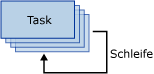

# For-Schleifencontainer
  Der For-Schleifencontainer definiert die Wiederholung einer Ablaufsteuerung in einem Paket. Die Schleifenimplementierung ist mit der **For** -Schleifenstruktur in Programmiersprachen zu vergleichen. Bei jeder Wiederholung der Schleife wertet der For-Schleifencontainer einen Ausdruck aus und wiederholt dessen Workflow, bis der Ausdruck zu **False**ausgewertet wird.  
  
 Der For-Schleifencontainer verwendet die folgenden Elemente zum Definieren der Schleife:  
  
-   Einen optionalen Initialisierungsausdruck, der den Schleifenzählern Werte zuweist.  
  
-   Einen Auswertungsausdruck, der den Ausdruck enthält, um zu testen, ob die Schleife beendet oder fortgesetzt werden soll.  
  
-   Einen optionalen Iterationsausdruck, der den Schleifenzähler inkrementiert oder reduziert.  
  
 Das folgende Diagramm zeigt einen For-Schleifencontainer mit einem Task Mail senden. Falls der Initialisierungsausdruck `@Counter = 0`ist, lautet der Auswertungsausdruck `@Counter < 4`. Falls der Iterationsausdruck `@Counter = @Counter + 1`ist, wird die Schleife viermal wiederholt, und es werden vier E-Mail-Nachrichten gesendet.  
  
   
  
 Die Ausdrücke müssen für [!INCLUDE[ssNoVersion](../../includes/ssnoversion-md.md)] [!INCLUDE[ssISnoversion](../../includes/ssisnoversion-md.md)] gültig sein.  
  
 Zum Erstellen der Initialisierungs- und Zuweisungsausdrücke können Sie den Zuweisungsoperator (=) verwenden. Dieser Operator wird ansonsten nicht von der SQL Server Integration Services-Ausdrucksgrammatik unterstützt und kann nur von Initialisierungs- und Zuweisungsausdrücken im For-Schleifencontainer verwendet werden. Jeder Ausdruck, der den Zuweisungsoperator verwendet, erfordert die Syntax `@Var = <expression>`. Hierbei ist **Var** eine Laufzeitvariable, und \<expression> ist ein Ausdruck, der den Regeln der [!INCLUDE[ssIS](../../includes/ssis-md.md)]-Ausdruckssyntax entspricht. Für diesen Ausdruck sind die Variablen, Literale sowie Operatoren und Funktionen zulässig, die von der SSIS-Ausdrucksgrammatik unterstützt werden. Der Ausdruck muss zu einem Datentyp ausgewertet werden, der in den Datentyp der Variablen umgewandelt werden kann.  
  
 Für einen For-Schleifencontainer ist nur ein Auswertungsausdruck zulässig. Dies bedeutet, dass der For-Schleifencontainer alle Ablaufsteuerungselemente mit der gleichen Häufigkeit ausführt. Der For-Schleifencontainer kann andere For-Schleifencontainer enthalten, sodass Sie geschachtelte Schleifen erstellen und komplexe Schleifen in Pakete implementieren können.  
  
 Sie können eine Transaktionseigenschaft für den For-Schleifencontainer festlegen, um eine Transaktion für eine Teilmenge der Paketablaufsteuerung zu definieren. Auf diese Weise können Sie Transaktionen mit feinerer Granularität verwalten. Angenommen, ein For-Schleifencontainer wiederholt eine Ablaufsteuerung, die Daten in einer Tabelle mehrmals aktualisiert. In diesem Fall können Sie für die For-Schleife und deren Ablaufsteuerung die Verwendung einer Transaktion konfigurieren, um sicherzustellen, dass entweder alle oder überhaupt keine Daten aktualisiert werden. Weitere Informationen finden Sie unter [Integration Services-Transaktionen](../../integration-services/integration-services-transactions.md).  
  
## Hinzufügen einer Iteration zu einer Ablaufsteuerung mit einem For-Schleifencontainer
  [!INCLUDE[ssISnoversion](../../includes/ssisnoversion-md.md)] schließt den For-Schleifencontainer ein. Dabei handelt es sich um ein Ablaufsteuerungselement, mit dem Sie auf einfache Weise Schleifen einschließen können, mit denen eine Ablaufsteuerung in einem Paket wiederholt wird. Weitere Informationen finden Sie unter [For-Schleifencontainer](../../integration-services/control-flow/for-loop-container.md)ausgewertet wird.  
  
 Der For-Schleifencontainer wertet eine Bedingung für jede Iteration der Schleife aus und wird beendet, wenn die Bedingung zu False ausgewertet wird. Der For-Schleifencontainer enthält Ausdrücke zum Initialisieren der Schleife, zum Angeben der Auswertungsbedingung, mit der die Wiederholung der Ablaufsteuerung beendet wird, und zum Zuweisen eines Wertes zu einem Ausdruck, mit dem die Auswertungsbedingung verglichen wird. Sie müssen eine Auswertungsbedingung angeben, Initialisierungs- und Zuweisungsausdrücke sind dagegen optional.  
  
 Der For-Schleifencontainer stellt keine Funktionalität bereit. Er stellt lediglich die Struktur bereit, in der Sie die wiederholbare Ablaufsteuerung erstellen. Sie müssen mindestens einen Task in den For-Schleifencontainer einschließen, um Containerfunktionalität bereitzustellen. Weitere Informationen finden Sie unter [Integration Services Tasks](../../integration-services/control-flow/integration-services-tasks.md).  
  
 Der For-Schleifencontainer kann eine Ablaufsteuerung mit mehreren Tasks und anderen Containern enthalten. Das Hinzufügen von Tasks und Containern zu einem For-Schleifencontainer ist mit dem Hinzufügen von Tasks und Containern zu einem Paket vergleichbar, außer dass Sie die Tasks und Container nicht in das Paket, sondern in den For-Schleifencontainer ziehen. Falls der For-Schleifencontainer mehrere Tasks oder Container einschließt, können Sie diese wie bei einem Paket mithilfe von Rangfolgeneinschränkungen verbinden. Weitere Informationen finden Sie unter [Rangfolgeneinschränkungen](../../integration-services/control-flow/precedence-constraints.md).  
  
## Implementieren eines For-Schleifencontainers in einer Ablaufsteuerung  
  
1.  Fügen Sie dem Paket den For-Schleifencontainer hinzu. Weitere Informationen finden Sie unter [Hinzufügen oder Löschen eines Tasks oder Containers in einer Ablaufsteuerung](../../integration-services/control-flow/add-or-delete-a-task-or-a-container-in-a-control-flow.md).  
  
2.  Fügen Sie dem For-Schleifencontainer Tasks und Container hinzu. Weitere Informationen finden Sie unter [Hinzufügen oder Löschen eines Tasks oder Containers in einer Ablaufsteuerung](../../integration-services/control-flow/add-or-delete-a-task-or-a-container-in-a-control-flow.md).  
  
3.  Verbinden Sie Tasks und Container im For-Schleifencontainer mithilfe von Rangfolgeneinschränkungen. Weitere Informationen finden Sie unter [Verbinden von Tasks und Containern mithilfe einer Standardrangfolgeneinschränkung](http://msdn.microsoft.com/library/8f31f15f-98ff-4c35-b41f-8b8cfd148d75).  
  
4.  Konfigurieren Sie den For-Schleifencontainer. Weitere Informationen finden Sie unter [Konfigurieren eines For-Schleifencontainers](http://msdn.microsoft.com/library/b9cd7ea7-b198-4a35-8b16-6acf09611ca5)ausgewertet wird.  

##  Konfigurieren des For-Schleifencontainers
In diesem Verfahren wird beschrieben, wie Sie einen For-Schleifencontainer mithilfe des Dialogfelds **For-Schleifen-Editor** konfigurieren.  
  
 Ein Beispiel für den For-Schleifencontainer finden Sie unter [Nicht fehleranfällige SSIS-Schleifen](http://go.microsoft.com/fwlink/?LinkId=240295) auf bimonkey.com.  
  
1.  Doppelklicken Sie in [!INCLUDE[ssBIDevStudioFull](../../includes/ssbidevstudiofull-md.md)]auf den For-Schleifencontainer, um den **For-Schleifen-Editor**zu öffnen.  
  
2.  Ändern Sie optional den Namen und die Beschreibung des For-Schleifencontainers.  
  
3.  Geben Sie optional einen Initialisierungsausdruck in das Textfeld **InitExpression** ein.  
  
4.  Geben Sie einen Auswertungsausdruck in das Textfeld **EvalExpression** ein.  
  
    > [!NOTE]  
    >  Der Ausdruck muss zu einem booleschen Wert ausgewertet werden. Wenn der Ausdruck zu **false**ausgewertet wird, wird die Ausführung der Schleife beendet.  
  
5.  Geben Sie optional einen Zuweisungsausdruck in das Textfeld **AssignExpression** ein.  
  
6.  Klicken Sie optional auf **Ausdrücke** , und erstellen Sie auf der Seite **Ausdrücke** Eigenschaftsausdrücke für die Eigenschaften des For-Schleifencontainers. Weitere Informationen finden Sie unter [Hinzufügen oder Ändern eines Eigenschaftsausdrucks](../../integration-services/expressions/add-or-change-a-property-expression.md).  
  
7.  Klicken Sie auf **OK** , um den **For-Schleifen-Editor**zu schließen.  

## For-Schleifen-Editor (Dialogfeld)
Mithilfe der Seite **For-Schleife** des Dialogfelds **For-Schleifen-Editor** können Sie eine Schleife konfigurieren, durch die ein Workflow wiederholt wird, bis eine bestimmte Bedingung mit False ausgewertet wird.  
  
 Weitere Informationen zum For-Schleifencontainer und zu dessen Verwendung in Paketen finden Sie unter [For Loop Container](../../integration-services/control-flow/for-loop-container.md).  
  
### Tastatur  
 **InitExpression**  
 Gibt optional einen Ausdruck zum Initialisieren von Werten an, die durch die Schleife verwendet werden.  
  
 **EvalExpression**  
 Geben Sie einen Ausdruck an, mit dem ausgewertet wird, ob die Schleife beendet oder fortgesetzt werden soll.  
  
 **AssignExpression**  
 Geben Sie optional einen Ausdruck an, durch den bei jeder Wiederholung der Schleife eine Bedingung geändert wird.  
  
 **Name**  
 Geben Sie einen eindeutigen Namen für den For-Schleifencontainer an. Dieser Name wird im Tasksymbol als Bezeichnung verwendet.  
  
> [!NOTE]  
>  Objektnamen müssen innerhalb eines Pakets eindeutig sein.  
  
 **Beschreibung**  
 Geben Sie eine Beschreibung des For-Schleifencontainers an.  
 
## Verwenden von Ausdrücken mit dem For-Schleifencontainer  
 Wenn Sie den For-Schleifencontainer konfigurieren, indem Sie eine Auswertungsbedingung, einen Initialisierungswert oder einen Zuweisungswert angeben, können Sie Literale oder Ausdrücke verwenden.  
  
 Die Ausdrücke können Variablen einschließen. Die Verwendung von Variablen bietet den Vorteil, dass sie zur Laufzeit aktualisiert werden können, wodurch die Pakete flexibler und einfacher zu verwalten sind. Die maximale Länge eines Ausdrucks beträgt 4000 Zeichen.  
  
 Wenn Sie eine Variable in einem Ausdruck angeben, müssen Sie dem Variablennamen ein @-Zeichen voranstellen. Geben Sie z.B. für eine Variable mit dem Namen **Counter** @Counter in den Ausdruck ein, den der For-Schleifencontainer verwendet. Falls Sie die Namespaceeigenschaft für die Variable angeben, müssen Sie die Variable und den Namespace in eckige Klammern einschließen. Geben Sie z.B. für eine **Counter**-Variable im **MyNamespace**-Namespace [@MyNamespace::Counter] ein.  
  
 Die Variablen, die der For-Schleifencontainer verwendet, müssen im Bereich des For-Schleifencontainers oder im Bereich eines beliebigen Containers, der in der Paketcontainerhierarchie höher angeordnet ist, definiert sein. Beispielsweise kann ein For-Schleifencontainer Variablen verwenden, die in seinem Bereich definiert sind, sowie Variablen, die im Paketbereich definiert sind. Weitere Informationen finden Sie unter [Integration Services-Variablen &#40;SSIS&#41;](../../integration-services/integration-services-ssis-variables.md) und [Verwenden von Variablen in Paketen](http://msdn.microsoft.com/library/7742e92d-46c5-4cc4-b9a3-45b688ddb787).  
  
 Die Ausdrucksgrammatik von [!INCLUDE[ssIS](../../includes/ssis-md.md)] stellt umfangreiche Operatoren und Funktionen zum Implementieren komplexer Ausdrücke bereit, die zum Auswerten, Initialisieren oder Zuweisen verwendet werden. Weitere Informationen finden Sie unter [Integration Services-Ausdrücke &#40;SSIS&#41;](../../integration-services/expressions/integration-services-ssis-expressions.md)ausgewertet wird.  
  
  
## Weitere Informationen finden Sie unter  
 [Ablaufsteuerung](../../integration-services/control-flow/control-flow.md)   
 [Integration Services-Ausdrücke &#40;SSIS&#41;](../../integration-services/expressions/integration-services-ssis-expressions.md)  
  
  
