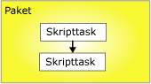
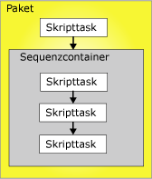

# Rangfolgeneinschr&#228;nkungen
  Rangfolgeneinschränkungen verknüpfen ausführbare Dateien, Container und Tasks in Paketen in einer Ablaufsteuerung und geben Bedingungen an, die bestimmen, ob ausführbare Dateien ausgeführt werden. Bei einer ausführbaren Datei kann es sich um einen For-Schleifencontainer, einen Foreach-Schleifencontainer, einen Task oder einen Ereignishandler handeln. Ereignishandler verwenden Rangfolgeneinschränkungen zum Verlinken der ausführbaren Dateien zu einer Ablaufsteuerung.  
  
 Eine Rangfolgeneinschränkung verlinkt zwei ausführbare Dateien: die ausführbare Datei der Rangfolge und die eingeschränkte ausführbare Datei. Die ausführbare Datei der Rangfolge wird vor der eingeschränkten ausführbaren Datei ausgeführt, und das Ausführungsergebnis der ausführbaren Datei der Rangfolge kann bestimmen, ob die eingeschränkte ausführbare Datei ausgeführt wird. Im folgenden Diagramm werden zwei ausführbare Dateien dargestellt, die durch eine Rangfolgeneinschränkung verlinkt sind.  
  
   
  
 Bei einer linearen Ablaufsteuerung, also einer Ablaufsteuerung ohne Verzweigungen, bestimmen Rangfolgeneinschränkungen alleine die Reihenfolge, in der Tasks ausgeführt werden. Falls sich eine Ablaufsteuerung verzweigt, bestimmt das [!INCLUDE[ssISnoversion](../../includes/ssisnoversion-md.md)]-Laufzeitmodul die Ausführungsreihenfolge für die Tasks und Container, die unmittelbar auf die Verzweigung folgen. Das Laufzeitmodul bestimmt außerdem die Ausführungsreihenfolge für nicht verbundene Workflows in einer Ablaufsteuerung.  
  
 Die geschachtelte Containerarchitektur von [!INCLUDE[ssISnoversion](../../includes/ssisnoversion-md.md)] ermöglicht allen Containern (mit Ausnahme des Taskhostcontainers, der nur einen einzelnen Task kapselt), andere Container mit jeweils eigener Ablaufsteuerung einzuschließen. Der For-Schleifencontainer, der Foreach-Schleifencontainer und der Sequenzcontainer können mehrere Tasks und andere Container, die wiederum mehrere Tasks und Container enthalten können, einschließen. Angenommen, ein Paket mit einem Skripttask und einem Sequenzcontainer weist eine Rangfolgeneinschränkung auf, die den Skripttask und den Sequenzcontainer verlinkt. Der Sequenzcontainer schließt drei Skripttasks ein, und die Rangfolgeneinschränkungen verlinken die drei Skripttasks zu einer Ablaufsteuerung. Im folgenden Diagramm werden die Rangfolgeneinschränkungen in einem Paket mit zwei Schachtelungsebenen dargestellt.  
  
   
  
 Das Paket befindet sich ganz oben in der [!INCLUDE[ssIS](../../includes/ssis-md.md)] -Containerhierarchie. Deshalb können mehrere Pakete nicht durch Rangfolgeneinschränkungen verlinkt werden. Sie können jedoch einem Paket einen Task Paket ausführen hinzufügen und indirekt ein anderes Paket mit der Ablaufsteuerung verlinken.  
  
 Es gibt folgende Möglichkeiten, um Rangfolgeneinschränkungen zu konfigurieren:  
  
-   Geben Sie einen Auswertungsvorgang an. Die Rangfolgeneinschränkung verwendet einen Einschränkungswert und/oder einen Ausdruck, um zu bestimmen, ob die eingeschränkte ausführbare Datei ausgeführt wird.  
  
-   Falls die Rangfolgeneinschränkung ein Ausführungsergebnis verwendet, können Sie als Ausführungsergebnis Erfolg, Fehler oder Beendigung angeben.  
  
-   Falls die Rangfolgeneinschränkung ein Auswertungsergebnis verwendet, können Sie einen Ausdruck angeben, der zu einem booleschen Wert ausgewertet wird.  
  
-   Geben Sie an, ob die Rangfolgeneinschränkung einzeln oder zusammen mit anderen Einschränkungen, die auf die eingeschränkte ausführbare Datei zutreffen, ausgewertet wird.  
  
## Auswertungsvorgänge  
 [!INCLUDE[ssISnoversion](../../includes/ssisnoversion-md.md)] stellt die folgenden Auswertungsvorgänge bereit:  
  
-   Eine Einschränkung, die nur mithilfe des Ausführungsergebnisses der ausführbaren Datei der Rangfolge bestimmt, ob die eingeschränkte ausführbare Datei ausgeführt wird. Das Ausführungsergebnis der ausführbaren Datei der Rangfolge kann Beendigung, Erfolg oder Fehler sein. Dies ist der Standardvorgang.  
  
-   Einen Ausdruck, der ausgewertet wird, um zu bestimmen, ob die eingeschränkte ausführbare Datei ausgeführt wird. Falls der Ausdruck zu True ausgewertet wird, wird die eingeschränkte ausführbare Datei ausgeführt.  
  
-   Einen Ausdruck und eine Einschränkung, die die Anforderungen von Ausführungsergebnissen der ausführbaren Datei der Rangfolge mit den zurückgegebenen Ergebnisse aus der Auswertung des Ausdrucks kombiniert.  
  
-   Einen Ausdruck oder eine Einschränkung, der bzw. die die Ausführungsergebnisse der ausführbaren Datei der Rangfolge oder die zurückgegebenen Ergebnisse aus der Auswertung des Ausdrucks verwendet.  
  
 [!INCLUDE[ssIS](../../includes/ssis-md.md)] -Designer identifiziert mithilfe einer Farbcodierung den Typ der Rangfolgeneinschränkung. Die Success-Einschränkung ist grün, die Failure-Einschränkung ist rot und die Completion-Einschränkung ist blau. Zum Anzeigen von Beschriftungen im [!INCLUDE[ssIS](../../includes/ssis-md.md)] -Designer, die den Typ der Einschränkung anzeigen, müssen Sie die Barrierefreiheitsfunktionen des [!INCLUDE[ssIS](../../includes/ssis-md.md)] -Designers konfigurieren.  
  
 Der Ausdruck muss ein gültiger [!INCLUDE[ssIS](../../includes/ssis-md.md)] -Ausdruck sein, der Funktionen, Operatoren sowie Systemvariablen und benutzerdefinierte Variablen einschließen kann. Weitere Informationen finden Sie unter [Integration Services-Ausdrücke &#40;SSIS&#41;](../../integration-services/expressions/integration-services-ssis-expressions.md) und [Integration Services-Variablen &#40;SSIS&#41;](../../integration-services/integration-services-ssis-variables.md).  
  
## Ausführungsergebnisse  
 Die Rangfolgeneinschränkung kann die folgenden Ausführungsergebnisse separat oder in Kombination mit einem Ausdruck verwenden.  
  
-   Für die Beendigung muss die ausführbare Datei der Rangfolge ungeachtet des Ergebnisses abgeschlossen worden sein, damit die eingeschränkte ausführbare Datei ausgeführt wird.  
  
-   Für Erfolg muss die ausführbare Datei der Rangfolge erfolgreich abgeschlossen worden sein, damit die eingeschränkte ausführbare Datei ausgeführt wird.  
  
-   Für Fehler muss bei der ausführbaren Datei der Rangfolge ein Fehler auftreten, damit die eingeschränkte ausführbare Datei ausgeführt wird.  
  
> [!NOTE]  
>  Nur Rangfolgeneinschränkungen, die Elemente derselben **Precedence Constraint** -Auflistung sind, können mit einer logischen AND-Bedingung gruppiert werden. Beispielsweise können Rangfolgeneinschränkungen aus zwei Foreach-Schleifencontainern nicht kombiniert werden.  
  
## Konfiguration der Rangfolgeneinschränkung  
 Sie können Eigenschaften mit dem [!INCLUDE[ssIS](../../includes/ssis-md.md)] -Designer oder programmgesteuert festlegen.  
  
 Weitere Informationen zu den Eigenschaften, die Sie im [!INCLUDE[ssIS](../../includes/ssis-md.md)]-Designer festlegen können, finden Sie unter [Rangfolgeneinschränkungs-Editor](../Topic/Precedence%20Constraint%20Editor.md).  
  
 Weitere Informationen zum programmgesteuerten Festlegen dieser Eigenschaften finden Sie unter <xref:Microsoft.SqlServer.Dts.Runtime.PrecedenceConstraint>.  
  
## Verwandte Aufgaben  
 Klicken Sie auf eines der folgenden Themen, um nähere Informationen zum Festlegen dieser Eigenschaften im [!INCLUDE[ssIS](../../includes/ssis-md.md)] -Designer zu erhalten:  
  
-   [Festlegen der Eigenschaften von Rangfolgeneinschränkungen](../Topic/Set%20the%20Properties%20of%20a%20Precedence%20Constraint.md)  
  
-   [Festlegen des Werts einer Rangfolgeneinschränkung mithilfe des Kontextmenüs](../Topic/Set%20the%20Value%20of%20a%20Precedence%20Constraint%20by%20Using%20the%20Shortcut%20Menu.md)  
  
-   [Verbinden von Tasks und Containern mithilfe einer Standardrangfolgeneinschränkung](../Topic/Connect%20Tasks%20and%20Containers%20by%20Using%20a%20Default%20Precedence%20Constraint.md)  
  
     Dieses Thema enthält Informationen dazu, wie Sie das Standardverhalten für Rangfolgeneinschränkungen festlegen und ausführbare Dateien mithilfe der Standardrangfolgeneinschränkungen verbinden.  
  
## Verwandte Inhalte  
 Technischer Artikel, [SSIS Expression Examples](http://go.microsoft.com/fwlink/?LinkId=220761), auf social.technet.microsoft.com  
  
## Siehe auch  
 [Hinzufügen von Ausdrücken zu Rangfolgeneinschränkungen](../Topic/Add%20Expressions%20to%20Precedence%20Constraints.md)   
 [Mehrere Rangfolgeneinschränkungen](../Topic/Multiple%20Precedence%20Constraints.md)  
  
  