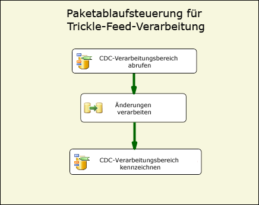
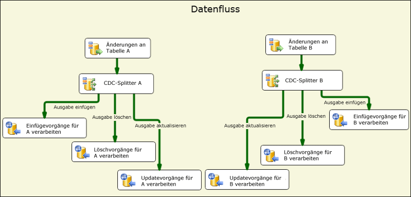
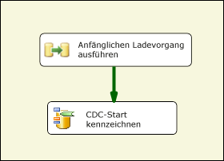
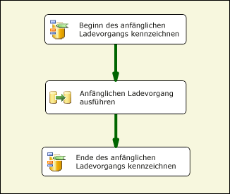
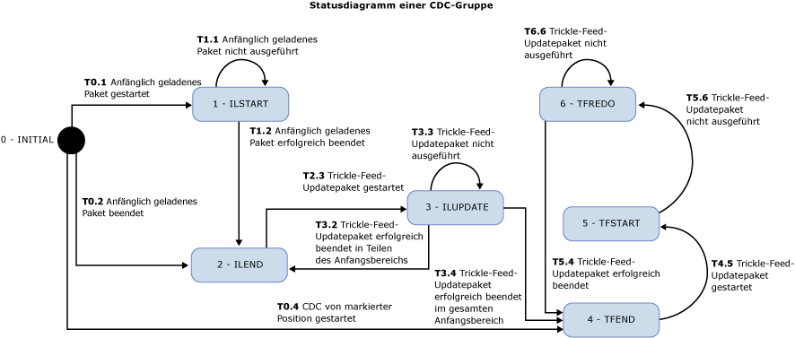

# CDC-Flusskomponenten
  Die Change Data Capture-Komponenten von Attunity für Microsoft [!INCLUDE[ssISCurrent](../../includes/ssiscurrent-md.md)] unterstützen SSIS-Entwickler bei der Verwendung von CDC und reduzieren die Komplexität von CDC-Paketen.  
  
 Die SSIS-CDC-Komponenten können mit der CDC-Funktion von [!INCLUDE[ssCurrent](../../includes/sscurrent-md.md)] verwendet werden, wenn die Quelltabellen entweder derselben [!INCLUDE[ssCurrent](../../includes/sscurrent-md.md)]-Datenbank oder einer Oracle-Datenbank entsprechen (bei Verwendung des Oracle CDC Service für [!INCLUDE[ssCurrent](../../includes/sscurrent-md.md)]). Partitionierte Tabellen werden unterstützt.  
  
 Zu den Komponenten zählen Steuerungs- und Datenflusskomponenten, die das Lesen und Verarbeiten von Änderungsdaten in SSIS-Paketen vereinfachen. Die Komponenten können der Komponentenbibliothek in Microsoft [!INCLUDE[ssCurrent](../../includes/sscurrent-md.md)] hinzugefügt werden, werden aber separat installiert.  
  
 Folgende Change Data Capture-Komponenten von Attunity sind verfügbar:  
  
 **CDC-Ablaufsteuerungskomponente:**  
  
 [CDC-Steuerungstask](../../integration-services/control-flow/cdc-control-task.md)  
  
 **CDC-Datenflusskomponenten:**  
  
 [CDC-Quelle](../../integration-services/data-flow/cdc-source.md)  
  
 [CDC-Splitter](../../integration-services/data-flow/cdc-splitter.md)  
  
## Installation  
 In diesem Abschnitt werden die Installationsverfahren für die CDC-Komponenten für Microsoft [!INCLUDE[ssISCurrent](../../includes/ssiscurrent-md.md)] beschrieben.  
  
 Die CDC-Komponenten für SSIS werden mit Microsoft® Change Data Capture Designer und Service für Oracle von Attunity für Microsoft SQL Server® 2016 in einem Paket bereitgestellt. Dieser Download ist Teil des SQL Server 2016 Feature Pack. Laden Sie die Komponenten des Feature Packs von der [SQL Server 2016 Feature Pack](http://go.microsoft.com/fwlink/?LinkId=746297)-Webseite herunter.  
  
### Versionsunterstützung  
 Die folgenden Microsoft [!INCLUDE[ssNoVersion](../../includes/ssnoversion-md.md)]-Produkte werden von den CDC-Komponenten für SSIS unterstützt:  
  
-   Microsoft [!INCLUDE[ssCurrent](../../includes/sscurrent-md.md)]  
  
-   Microsoft [!INCLUDE[ssBIDevStudio](../../includes/ssbidevstudio-md.md)] für Visual Studio 2015  
  
 Die folgenden Versionen werden auf den angegebenen Betriebssystemen und Plattformen unterstützt:  
  
-   Windows Vista mit Service Pack 2  
  
-   Windows 7  
  
-   Windows 10  
  
-   Windows Server 2008 mit Service Pack 2  
  
-   Windows Server 2008 R2  
  
-   Windows Server 2012  
  
### Ausführen des Installationsprogramms  
 Stellen Sie vor dem Ausführen des Installations-Assistenten sicher, dass [!INCLUDE[ssCurrent](../../includes/sscurrent-md.md)][!INCLUDE[ssBIDevStudio](../../includes/ssbidevstudio-md.md)] geschlossen ist. Folgen Sie anschließend den Anweisungen im Installations-Assistenten.  
  
### Neustarten von SSIS  
 Nachdem Sie die CDC-Komponenten installiert haben, müssen Sie den SSIS-Dienst neu starten, um sicherzustellen, dass die Komponenten beim Entwickeln von Paketen in SQL [!INCLUDE[ssBIDevStudio](../../includes/ssbidevstudio-md.md)] ordnungsgemäß funktionieren.  
  
 Nach der Installation der Komponenten wird eine Meldung angezeigt. Klicken Sie auf **Ja**, wenn eine Aufforderung angezeigt wird.  
  
### Deinstallieren der Microsoft-CDC-Komponenten  
 Die CDC-Quelle, der CDC-Splitter und der CDC-Steuerungstask werden mithilfe des Deinstallations-Assistenten deinstalliert. Überprüfen Sie vor dem Deinstallieren der Komponenten Folgendes:  
  
 Wenn Sie [!INCLUDE[ssCurrent](../../includes/sscurrent-md.md)][!INCLUDE[ssBIDevStudio](../../includes/ssbidevstudio-md.md)] zur Paketentwicklung verwenden, muss [!INCLUDE[ssBIDevStudio](../../includes/ssbidevstudio-md.md)] vor dem Ausführen des Deinstallations-Assistenten geschlossen werden.  
  
## Vorteile  
 Die CDC-Komponenten für [!INCLUDE[ssCurrent](../../includes/sscurrent-md.md)][!INCLUDE[ssISnoversion](../../includes/ssisnoversion-md.md)] ermöglichen SSIS-Entwicklern das mühelose Erstellen von SSIS-Paketen, die Änderungsdaten verarbeiten. Diese Komponenten erleichtern SSIS-Entwicklern die Verwendung von CDC und reduzieren die Komplexität von CDC-Paketen.  
  
 Die SSIS-CDC-Komponenten werden verwendet, um die Änderungsdaten in einer Form bereitzustellen, in der sie einfach zur Replikation, zum Laden eines Data Warehouse, Aktualisieren langsam veränderlicher Dimensionen für OLAP, Überwachen von Änderungen oder für weitere mögliche Zwecke verarbeitet werden können. Die Art der weiteren Verarbeitung wird vom SSIS-Entwickler bestimmt.  
  
 Die SSIS-CDC-Komponenten sind zur Verwendung mit der CDC-Funktion von [!INCLUDE[ssCurrent](../../includes/sscurrent-md.md)] mit Änderungstabellen konzipiert, die sich in derselben [!INCLUDE[ssCurrent](../../includes/sscurrent-md.md)]-Datenbank befinden.  
  
## Erste Schritte mit den Change Data Capture-Komponenten  
 Ein typisches CDC-Paket verarbeitet Änderungen an einer Gruppe von Tabellen. Die unten stehende Abbildung zeigt den grundlegenden Ablaufsteuerungsteil dieses CDC-Pakettyps. Das Paket wird als Trickle-Feed-Verarbeitungspaket bezeichnet.  
  
   
  
 Diese [!INCLUDE[ssCurrent](../../includes/sscurrent-md.md)][!INCLUDE[ssISnoversion](../../includes/ssisnoversion-md.md)]-Ablaufsteuerung enthält zwei CDC-Steuerungstasks und den Datenflusstask. Der erste Task mit dem Namen **Get CDC Processing Range** legt den LSN-Bereich für die Änderungen fest, die im Datenflusstask mit dem Namen **Process Changes** verarbeitet werden. Dieser Bereich wird auf Grundlage dessen festgelegt, was während der letzten Paketausführung verarbeitet und in einem permanenten Speicher gespeichert wurde.  
  
 Weitere Informationen zur Verwendung der CDC-Steuerungstasks finden Sie unter [CDC-Steuerungstask](../../integration-services/control-flow/cdc-control-task.md) und [CDC-Steuerungstask-Editor](../../integration-services/control-flow/cdc-control-task-editor.md).  
  
 Die folgende Abbildung zeigt den Datenfluss für die **Änderungsverarbeitung** und veranschaulicht, wie Änderungen verarbeitet werden.  
  
   
  
 Die folgenden Schritte werden in der Abbildung dargestellt:  
  
-   **Änderungen für Tabelle X** ist eine CDC-Quelle, die Änderungen an Tabelle X in dem von der übergeordneten Ablaufsteuerung bestimmten CDC-Verarbeitungsbereich liest.  
  
-   **CDC-Splitter X** wird verwendet, um die Änderungen in Einfügungen, Löschungen und Updates zu teilen. In diesem Szenario wird davon ausgegangen, dass die CDC-Quelle zum Erzeugen von Nettoänderungen konfiguriert ist, sodass andere Änderungstypen parallel verarbeitet werden können.  
  
-   Die spezifischen Änderungen werden dann downstream weiter verarbeitet. In dieser Abbildung werden die Änderungen in Tabellen mit mehreren ODBC-Zielen eingefügt, in der Realität kann die Verarbeitung jedoch anders aussehen.  
  
 Weitere Informationen zur CDC-Quelle finden Sie unter:  
  
 [CDC-Quelle](../../integration-services/data-flow/cdc-source.md)  
  
 [Quellen-Editor für CDC &#40;Seite „Verbindungs-Manager“&#41;](../../integration-services/data-flow/cdc-source-editor-connection-manager-page.md)  
  
 [Quellen-Editor für CDC &#40;Seite „Spalten“&#41;](../../integration-services/data-flow/cdc-source-editor-columns-page.md)  
  
 [Quellen-Editor für CDC &#40;Seite „Fehlerausgabe“&#41;](../../integration-services/data-flow/cdc-source-editor-error-output-page.md)  
  
 Weitere Informationen zum CDC-Splitter finden Sie unter:  
  
 [CDC-Splitter](../../integration-services/data-flow/cdc-splitter.md)  
  
 Eines der grundlegenden Probleme, das beim Erstellen von CDC-Paketen berücksichtigt werden muss, ist die Art und Weise, wie die Änderungsverarbeitung mit dem anfänglichen Ladevorgang (oder der anfänglichen Verarbeitung) der Daten interagiert.  
  
 Die CDC-Komponenten unterstützen drei unterschiedliche Szenarien für den anfänglichen Ladevorgang und die anfängliche Änderungsverarbeitung:  
  
-   Für den anfänglichen Ladevorgang wird eine Datenbankmomentaufnahme verwendet. In diesem Fall beginnt die Änderungsverarbeitung bei der LSN des Momentaufnahmeereignisses.  
  
-   Anfängliches Laden aus einer inaktiven Datenbank. In diesem Fall werden während des anfänglichen Ladevorgangs keine Änderungen vorgenommen. Daher wird die aktuelle LSN an einem Punkt während des Ladevorgangs abgefragt, und die Verarbeitung beginnt bei dieser LSN.  
  
-   Anfängliches Laden aus einer aktiven Datenbank. In diesem Fall werden während des anfänglichen Ladevorgangs Änderungen an der Datenbank vorgenommen, und es gibt keine spezifische LSN, bei der die Änderungsverarbeitung gestartet werden kann. Der Entwickler des anfänglich geladenen Pakets kann die aktuelle LSN der Quelldatenbank vor und nach dem anfänglichen Laden abfragen. In diesem Fall ist beim Verarbeiten von Änderungen, die parallel zum anfänglichen Ladevorgang vorgenommen werden, Vorsicht geboten, da einige der verarbeiteten Änderungen bereits im anfänglichen Ladevorgang vorhanden waren (eine Insert-Änderung kann z. B. mit einem Fehler aufgrund doppelter Schlüssel fehlschlagen, da die eingefügte Zeile beim anfänglichen Ladeprozess gelesen wurde).  
  
 Die folgende Abbildung zeigt ein SSIS-Paket, das die ersten zwei Szenarien unterstützt:  
  
   
  
 Die folgende Abbildung zeigt ein SSIS-Paket, das das dritte Szenario unterstützt:  
  
   
  
 Nach dem anfänglich geladenen Paket wird ein Trickle-Feed-Updatepaket nach einem Zeitplan wiederholt ausgeführt, um Änderungen zu verarbeiten, sobald sie verfügbar werden.  
  
 Das Übergeben des Status der CDC-Verarbeitung vom anfänglich geladenen Paket an das Trickle-Feed-Paket und zwischen anderen Tasks innerhalb jedes Pakets erfolgt mithilfe einer speziellen SSIS-Paketzeichenfolgenvariable. Der Wert dieser Variable wird als CDC-Status bezeichnet und gibt den aktuellen Status der CDC-Verarbeitung für die Tabellengruppen wieder, die vom anfänglich geladenen Paket und vom Trickle-Feed-Paket behandelt werden.  
  
 Der Wert der CDC-Statusvariable muss in einem permanenten Speicher verwaltet werden. Er sollte vor dem Start der CDC-Verarbeitung gelesen und mit dem aktuellen Status gespeichert werden, nachdem die Verarbeitung abgeschlossen wurde. Das Laden und Speichern des CDC-Status kann vom SSIS-Entwickler ausgeführt werden, die CDC-Steuerungskomponente bietet jedoch die Möglichkeit, diesen Task zu automatisieren, indem der CDC-Statuswert in einer Datenbanktabelle verwaltet wird.  
  
## Überlegungen zur Sicherheit  
 In diesem Abschnitt werden einige Sicherheitsüberlegungen im Zusammenhang mit der Verwendung der CDC-Komponenten in SSIS erläutert.  
  
### Autorisierung des Zugriffs auf Änderungsdaten  
 Trickle-Feed-Updatepakete erfordern Zugriff auf die CDC-Funktionen von [!INCLUDE[ssCurrent](../../includes/sscurrent-md.md)]. Dieser Zugriff wird standardmäßig Mitgliedern der festen Datenbankrolle **db_owner** gewährt. Da **db_owner** eine Rolle mit umfassenden Berechtigungen ist, wird empfohlen, jeder Aufzeichnungsinstanz bei ihrer Definition in [!INCLUDE[ssCurrent](../../includes/sscurrent-md.md)] eine Gatingsicherheitsrolle zuzuordnen, die es dem SSIS-CDC-Paket ermöglicht, die Änderungen von einem Benutzer mit sehr viel geringeren Berechtigungen verarbeiten zu lassen.  
  
### Zugriff auf die aktuelle LSN der CDC-Datenbank  
 Die CDC-Steuerungstaskvorgänge zum Markieren der Start-LSN für die Änderungsverarbeitung müssen in der Lage sein, die aktuelle LSN der CDC-Datenbank zu finden. Zu diesem Zweck wird die **sp_replincrementlsn**-Prozedur der master-Datenbank verwendet. Die Ausführungsberechtigung für diese Prozedur muss dem Anmeldenamen zugewiesen werden, der zum Herstellen einer Verbindung mit der [!INCLUDE[ssCurrent](../../includes/sscurrent-md.md)] CDC-Datenbank verwendet wird.  
  
### Zugriff auf die CDC-Statustabelle  
 Die CDC-Statustabelle dient zum automatischen Beibehalten von CDC-Status, bei denen es erforderlich ist, dass sie von dem zum Herstellen einer Verbindung mit der [!INCLUDE[ssCurrent](../../includes/sscurrent-md.md)] CDC-Datenbank verwendeten Anmeldenamen aktualisiert werden können. Da diese Tabelle vom SSIS-Entwickler erstellt wird, kann der [!INCLUDE[ssCurrent](../../includes/sscurrent-md.md)]-Systemadministrator als ein Benutzer festgelegt werden, der zum Erstellen von [!INCLUDE[ssCurrent](../../includes/sscurrent-md.md)]-Datenbanken sowie zum Ausführen von administrativen Tasks und Wartungstasks autorisiert ist. Ein [!INCLUDE[ssCurrent](../../includes/sscurrent-md.md)]-Systemadministrator, der mit CDC-fähigen Datenbanken arbeitet, muss zudem über entsprechende Kenntnisse in der [!INCLUDE[ssCurrent](../../includes/sscurrent-md.md)] CDC-Technologie und -Implementierung verfügen.  
  
## Gruppieren von Tabellen für die CDC-Verarbeitung  
 Die Größe von Datenbankprojekten variiert zwischen einigen Tabellen und Tausenden von Tabellen. Beim Entwerfen der anfänglich geladenen Pakete und CDC-Pakete ist es von Vorteil, Tabellen in viel kleineren Gruppen zu gruppieren, um die Verwaltung zu vereinfachen und die Effizienz zu erhöhen. In diesem Abschnitt werden verschiedene Überlegungen im Zusammenhang mit der Sortierung von Tabellen in kleinen Gruppen erläutert. Die Tabellen in jedem Paket werden dabei anfänglich geladen und dann als Gruppe aktualisiert.  
  
 Die von CDC-Komponenten unterstützten CDC-Muster setzen voraus, dass diese Gruppierung bereits festgelegt ist. Jede Gruppe definiert einen separaten CDC-Kontext, der getrennt von anderen Gruppen verwaltet wird. Für jede Gruppe werden ein anfänglich geladenes Paket und ein Trickle-Feed-Updatepaket erstellt. Trickle-Feed-Updates werden auf Grundlage der für die Änderungsverarbeitung geltenden Einschränkungen (z. B. CPU- und EA-Verbrauch sowie Auswirkungen auf andere Systeme) und der gewünschten Latenz zur regelmäßigen Ausführung geplant.  
  
 Tabellen werden nach folgenden Gesichtspunkten gruppiert:  
  
1.  Entsprechend der Zieldatenbank. Alle Tabellen, die in unterschiedliche Zieldatenbanken geschrieben werden oder eine andere Verarbeitung durchlaufen, sollten verschiedenen CDC-Gruppen zugewiesen werden.  
  
2.  Tabellen, die mit referenziellen Integritätseinschränkungen zusammenhängen, sollten der gleichen Gruppe zugewiesen werden, um Probleme mit der referenziellen Integrität in der Zieldatenbank zu vermeiden.  
  
3.  Tabellen, bei denen eine höhere Latenz akzeptabel ist, können gruppiert werden, damit sie weniger häufig verarbeitet werden können und die Gesamtsystembelastung reduziert wird.  
  
4.  Tabellen mit einer höheren Änderungsrate sollten kleineren Gruppen zugewiesen werden, und Tabellen mit einer niedrigen Änderungsrate können in größeren Gruppen gruppiert werden.  
  
 Die folgenden zwei Pakete werden für jede CDC-Gruppe erstellt:  
  
-   Ein anfänglich geladenes Paket, das sämtliche Daten aus den Quelltabellen liest und auf die Zieltabellen anwendet.  
  
-   Ein Trickle-Feed-Updatepaket, das Änderungen an den Quelltabellen liest und die Änderungen auf die Zieltabellen anwendet. Dieses Paket sollte regelmäßig anhand eines Zeitplans ausgeführt werden.  
  
## CDC-Status  
 Jeder CDC-Gruppe ist ein Status zugeordnet, der durch eine Zeichenfolge mit einem bestimmten Format dargestellt wird. Weitere Informationen finden Sie unter [CDC-Steuerungstask](../../integration-services/control-flow/cdc-control-task.md). In der folgenden Tabelle sind die möglichen CDC-Statuswerte aufgeführt.  
  
|Status|Description|  
|-----------|-----------------|  
|0-(INITIAL)|Der Status, bevor alle Pakete in der aktuellen CDC-Gruppe ausgeführt werden. Dieser Status liegt auch vor, wenn der CDC-Status leer ist.   Weitere Informationen zu CDC-Steuerungstaskvorgängen finden Sie unter [CDC-Steuerungstask](../../integration-services/control-flow/cdc-control-task.md).|  
|1-ILSTART (Initial-Load-Started)|Der Status beim Start des anfänglich geladenen Pakets. Dieser Schritt erfolgt nach dem Aufruf des CDC-Steuerungstasks durch den **MarkInitialLoadStart**-Vorgang.   Weitere Informationen zu CDC-Steuerungstaskvorgängen finden Sie unter [CDC-Steuerungstask](../../integration-services/control-flow/cdc-control-task.md).|  
|2- ILEND (Initial-Load-Ended)|Der Status bei erfolgreicher Beendigung des anfänglich geladenen Pakets. Dieser Schritt erfolgt nach dem Aufruf des CDC-Steuerungstasks durch den MarkInitialLoadEnd-Vorgang.   Weitere Informationen zu CDC-Steuerungstaskvorgängen finden Sie unter [CDC-Steuerungstask](../../integration-services/control-flow/cdc-control-task.md).|  
|3-ILUPDATE (Initial Load Update)|Der Status nach der ersten Ausführung des Updatepakets nach dem anfänglichen Ladevorgang, während der anfängliche Verarbeitungsbereich noch verarbeitet wird. Dieser Schritt erfolgt nach dem Aufruf des CDC-Steuerungstasks durch den **GetProcessingRange**-Vorgang.   Wenn die **_$reprocessing**-Spalte verwendet wird, wird sie auf 1 festgelegt, um anzugeben, dass das Paket möglicherweise Zeilen erneut verarbeitet, die bereits im Ziel vorhanden sind.   Weitere Informationen zu CDC-Steuerungstaskvorgängen finden Sie unter [CDC-Steuerungstask](../../integration-services/control-flow/cdc-control-task.md).|  
|4-TFEND (Trickle-Feed-Update-Ended)|Der für reguläre CDC-Ausführungen erwartete Status. Er gibt an, dass die vorherige Ausführung erfolgreich abgeschlossen wurde und eine neue Ausführung mit einem neuen Verarbeitungsbereich gestartet werden kann.|  
|5-TFSTART (Trickle-Feed-Update-Started)|Der Status bei nachfolgenden Ausführungen des Updatepakets nach dem Aufruf des CDC-Steuerungstasks durch den **GetProcessingRange**-Vorgang.   Er gibt an, dass eine reguläre CDC-Ausführung gestartet, aber noch nicht einwandfrei beendet wurde (**MarkProcessedRange**).   Weitere Informationen zu CDC-Steuerungstaskvorgängen finden Sie unter [CDC-Steuerungstask](../../integration-services/control-flow/cdc-control-task.md).|  
|6-TFREDO (Reprocessing-Trickle-Feed-Updates)|Der Status bei einem **GetProcessingRange** -Vorgang, der nach TFSTART stattfindet. Er gibt an, dass die vorherige Ausführung nicht erfolgreich abgeschlossen wurde.   Wenn die __$reprocessing-Spalte verwendet wird, wird sie auf 1 festgelegt, um anzugeben, dass das Paket möglicherweise Zeilen erneut verarbeitet, die bereits im Ziel vorhanden sind.|  
|7-FEHLER|Die CDC-Gruppe befindet sich in einem Fehlerstatus.|  
  
 Die folgende Abbildung zeit das Statusdiagramm für die CDC-Komponenten. Ein Fehlerstatus liegt vor, wenn ein nicht erwarteter Status erreicht wird. Die erwarteten Status werden im folgenden Diagramm dargestellt, der Fehlerstatus jedoch nicht.  
  
 Wenn Sie am Ende eines anfänglich geladenen Pakets z. B. versuchen, den Status auf ILEND festzulegen, und der Status TFSTART lautet, befindet sich die CDC-Gruppe in einem Fehlerstatus, und das Trickle-Feed-Updatepaket wird nicht ausgeführt (das anfänglich geladene Paket wird ausgeführt).  
  
   
  
 Sobald das anfänglich geladene Paket erfolgreich ausgeführt wurde, wird das Trickle-Feed-Updatepaket nach einem zuvor festgelegten Zeitplan wiederholt ausgeführt, um Änderungen an den Quelltabellen zu verarbeiten. Jede Ausführung des Trickle-Feed-Updatepakets ist eine CDC-Ausführung.  
  
## In diesem Abschnitt  
  
-   [CDC-Quelle](../../integration-services/data-flow/cdc-source.md)  
  
-   [CDC-Splitter](../../integration-services/data-flow/cdc-splitter.md)  
  
## Verwandte Aufgaben  
  
-   [Weiterleiten des CDC-Datenstroms gemäß Änderungstyp](../../integration-services/data-flow/direct-the-cdc-stream-according-to-the-type-of-change.md)  
  
-   [Definieren einer Statusvariablen](../../integration-services/data-flow/define-a-state-variable.md)  
  
## Verwandte Inhalte  
  
-   Blogeintrag zu [CDC in SSIS für SQL Server 2012](http://www.mattmasson.com/2011/12/cdc-in-ssis-for-sql-server-2012-2/) auf mattmasson.com.  
  
-   Blogeintrag zum Einrichten des CDC-Diensts [CDC für Oracle in SQL Server 2012](http://go.microsoft.com/fwlink/?LinkId=247827) auf blogs.msdn.com.  
  
-   Technischer Artikel [Installieren von Microsoft SQL Server 2012 Change Data Capture für Oracle von Attunity](http://go.microsoft.com/fwlink/?LinkId=252958)auf social.technet.microsoft.com.  
  
-   Technischer Artikel zum [Troubleshoot Configuration Issues in Microsoft Change Data Capture for Oracle by Attunity](http://go.microsoft.com/fwlink/?LinkId=252960) (Behandeln von Konfigurationsfehlern in Microsoft Change Data Capture für Oracle von Attunity) auf social.technet.microsoft.com.  
  
-   Technischer Artikel [Behandeln von Fehlern bei CDC-Instanzen in Microsoft Change Data Capture für Oracle von Attunity](http://go.microsoft.com/fwlink/?LinkId=252961)auf social.technet.microsoft.com.  
  
-   Video [CDC für Oracle-Datenbanken mit SQL Server Integration Services 2012 (SQL Server Video)](http://technet.microsoft.com/sqlserver/jj218898) auf technet.microsoft.com.  
  
## Siehe auch  
 [CDC-Steuerungstask](../../integration-services/control-flow/cdc-control-task.md)  
  
  