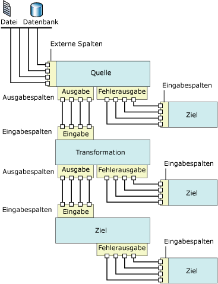

# Datenfluss
  [!INCLUDE[ssNoVersion](../../includes/ssnoversion-md.md)] [!INCLUDE[ssISnoversion](../../includes/ssisnoversion-md.md)] stellt drei verschiedene Arten von Datenflusskomponenten bereit: Quellen, Transformationen und Ziele. Quellen extrahieren Daten aus Datenspeichern, wie z. B. Tabellen und Sichten in relationalen Datenbanken, Dateien und [!INCLUDE[ssASnoversion](../../includes/ssasnoversion-md.md)] -Datenbanken. Mit Transformationen werden Daten geändert, zusammengefasst und bereinigt. Mit Zielen werden Daten in Datenspeicher geladen oder Datasets im Arbeitsspeicher erstellt.  
  
> [!NOTE]  
>  Wenn Sie benutzerdefinierte Anbieter verwenden, müssen Sie die Datei "ProviderDescriptors.xml" mit den Metadatenspaltenwerten aktualisieren.  
  
 Darüber hinaus stellt [!INCLUDE[ssISnoversion](../../includes/ssisnoversion-md.md)] Pfade bereit, mit denen die Ausgabe einer Komponente mit der Eingabe einer anderen Komponente verbunden werden. Pfade definieren die Reihenfolge von Komponenten und ermöglichen das Hinzufügen von Anmerkungen zum Datenfluss oder das Anzeigen der Quelle der Spalte.  
  
 Sie verbinden Datenflusskomponenten durch Verbinden der Ausgabe von Quellen und Zielen mit der Eingabe von Transformationen und Zielen. Beim Erstellen eines Datenflusses verbinden Sie in der Regel die zweite und nachfolgenden Komponenten, wenn Sie diese dem Datenfluss hinzufügen. Nachdem Sie die Komponente verbunden haben, können die Eingabespalten zum Konfigurieren der Komponente verwendet werden. Wenn keine Eingabespalten verfügbar sind, müssen Sie die Konfiguration der Komponente abschließen, nachdem sie mit dem Datenfluss verbunden wurde. Weitere Informationen finden Sie unter [Integration Services-Pfade](../../integration-services/data-flow/integration-services-paths.md) und [Verbinden von Komponenten mit Pfaden](../Topic/Connect%20Components%20with%20Paths.md).  
  
 Im folgenden Diagramm wird ein Datenfluss angezeigt, der eine Quelle, eine Transformation mit einer Eingabe und einer Ausgabe sowie ein Ziel aufweist. Dieses Diagramm enthält die Eingaben, Ausgaben und Fehlerausgaben sowie die Eingabespalten, Ausgabespalten und externen Spalten.  
  
   
  
## Datenflussimplementierung  
 Der erste Schritte beim Implementieren eines Datenflusstasks in einem Paket besteht darin, der Ablaufsteuerung eines Pakets einen Datenflusstask hinzuzufügen. Ein Paket kann mehrere Datenflusstasks mit jeweils einem eigenen Datenfluss einschließen. Wenn z. B. für ein Paket Datenflüsse in einer bestimmten Reihenfolge oder andere Tasks zwischen den Datenflüssen ausgeführt werden müssen, ist für jeden Datenfluss ein separater Datenflusstask erforderlich.  
  
 Wenn die Ablaufsteuerung einen Datenflusstask einschließt, können Sie mit dem Erstellen des Datenflusses beginnen, der von einem Paket verwendet wird. Weitere Informationen finden Sie unter [Data Flow (Task)](../../integration-services/control-flow/data-flow-task.md).  
  
 Das Erstellen eines Datenflusses umfasst folgende Schritte:  
  
-   Hinzufügen einer oder mehrerer Quellen, um Daten aus Dateien und Datenbanken zu extrahieren, und Hinzufügen von Verbindungs-Managern, um eine Verbindung mit den Quellen herzustellen.  
  
-   Hinzufügen der Transformationen, die die Unternehmensanforderungen des Pakets erfüllen. Ein Datenfluss ist nicht erforderlich, um Transformationen einzuschließen.  
  
     Manche Transformationen erfordern einen Verbindungs-Manager. Beispielsweise verwendet die Transformation für Suche einen Verbindungs-Manager, um eine Verbindung mit der Datenbank herzustellen, die die Suchdaten enthält.  
  
-   Verbinden von Datenflusskomponenten durch Verbinden der Ausgabe von Quellen und Transformationen mit der Eingabe von Transformationen und Zielen.  
  
-   Hinzufügen von einem oder mehreren Zielen, um Daten in Datenspeicher wie z. B. Dateien und Datenbanken zu laden, und das Hinzufügen von Verbindungs-Managern, um eine Verbindung mit den Datenquellen herzustellen.  
  
-   Konfigurieren von Fehlerausgaben für Komponenten, um Probleme zu behandeln.  
  
     Zur Laufzeit können Fehler auf Zeilenebene auftreten, wenn Datenflusskomponenten Daten konvertieren, eine Suche ausführen oder Ausdrücke auswerten. Beispielsweise kann eine Datenspalte mit einem Zeichenfolgenwert nicht in eine ganze Zahl konvertiert werden, oder ein Ausdruck versucht eine Division durch Null auszuführen. Beide Vorgänge führen zu Fehlern, und die fehlerhaften Zeilen können mithilfe eines Fehlerflusses separat verarbeitet werden. Weitere Informationen zum Verwenden von Fehlerflüssen im Paketdatenfluss finden Sie unter [Fehlerbehandlung in Daten](../../integration-services/data-flow/error-handling-in-data.md).  
  
-   Fügen Sie Anmerkungen hinzu, um den Datenfluss selbstdokumentierend zu gestalten. Weitere Informationen finden Sie unter [Verwenden von Anmerkungen in Paketen](../../integration-services/use-annotations-in-packages.md).  
  
> [!NOTE]  
>  Zum Erstellen eines neuen Pakets können Sie auch einen Assistenten verwenden, der Sie beim Konfigurieren der Verbindungs-Manager, Quellen und Ziele unterstützt. Weitere Informationen finden Sie unter [Create Packages in SQL Server Data Tools](../../integration-services/create-packages-in-sql-server-data-tools.md).  
  
 Wenn die Registerkarte **Datenfluss** aktiv ist, enthält die Toolbox die Quellen, Transformationen und Ziele, die Sie dem Datenfluss hinzufügen können.  
  
## Ausdrücke  
 Eine Reihe von Datenflusskomponenten – hierzu zählen Quellen, Transformationen und Ziele – unterstützen die Verwendung von Eigenschaftsausdrücken mit einigen ihrer Eigenschaften. Ein Eigenschaftsausdruck ist ein Ausdruck, der beim Laden des Pakets den Wert der Eigenschaft ersetzt. Zur Laufzeit verwendet das Paket die aktualisierten Eigenschaftswerte. Die Ausdrücke werden mithilfe der [!INCLUDE[ssISnoversion](../../includes/ssisnoversion-md.md)] -Ausdruckssyntax erstellt und können [!INCLUDE[ssISnoversion](../../includes/ssisnoversion-md.md)] -Funktionen, -Operatoren, -Bezeichner und -Variablen enthalten. Weitere Informationen finden Sie unter [Integration Services-Ausdrücke &#40;SSIS&#41;](../../integration-services/expressions/integration-services-ssis-expressions.md), [Integration Services-Ausdrücke &#40;SSIS&#41;](../../integration-services/expressions/integration-services-ssis-expressions.md) und [Verwenden von Eigenschaftsausdrücken in Paketen](../../integration-services/expressions/use-property-expressions-in-packages.md).  
  
 Wenn Sie in [!INCLUDE[ssBIDevStudioFull](../../includes/ssbidevstudiofull-md.md)]ein Paket erstellen, werden die Eigenschaften aller Datenflusskomponenten, die Eigenschaftsausdrücke unterstützen, im zugehörigen Datenflusstask verfügbar gemacht. Klicken Sie zum Hinzufügen, Ändern oder Entfernen von Eigenschaftsausdrücken der Datenflusskomponenten auf den Datenflusstask, und verwenden Sie dann das Eigenschaftenfenster oder den Editor für den Task, um Eigenschaftsausdrücke hinzuzufügen, zu ändern oder zu löschen. Die Eigenschaftsausdrücke für den Datenflusstask selbst werden vom Eigenschaftenfenster aus verwaltet.  
  
 Wenn der Datenfluss Komponenten enthält, die Ausdrücke verwenden, werden die Ausdrücke ebenfalls im Eigenschaftenfenster verfügbar gemacht. Wählen Sie zum Anzeigen von Ausdrücken den Datenflusstask aus, zu dem die betreffende Komponente gehört. Sie können Eigenschaften nach Kategorien oder alphabetisch sortiert anzeigen. Wenn Sie die kategorisierte Ansicht im Eigenschaftenfenster verwenden, werden alle Ausdrücke, die nicht von einer bestimmten Eigenschaft verwendet werden, in der Kategorie **Verschiedenes** aufgelistet. In der alphabetischen Sicht werden die Ausdrücke nach den Namen der Datenflusskomponenten sortiert aufgelistet.  
  
## Quellen  
 In [!INCLUDE[ssISnoversion](../../includes/ssisnoversion-md.md)]ist eine Quelle die Datenflusskomponente, mit der Daten aus verschiedenen externen Datenquellen für die anderen Komponenten im Datenfluss zur Verfügung gestellt werden. Sie können Daten aus Flatfiles, XML-Dateien, Microsoft Excel-Arbeitsmappen und Dateien, die Rohdaten enthalten, extrahieren. Darüber hinaus können Sie Daten durch das Zugreifen auf Tabellen und Sichten in Datenbanken und durch das Ausführen von Abfragen extrahieren.  
  
 Ein Datenfluss kann eine einzige Quelle oder mehrere Quellen einschließen.  
  
 Die Quelle für einen Datenfluss weist normalerweise eine reguläre Ausgabe auf. Die reguläre Ausgabe enthält Ausgabespalten. Diese Spalten fügt die Quelle dem Datenfluss hinzu.  
  
 Die reguläre Ausgabe verweist auf externe Spalten. Eine externe Spalte ist eine Spalte in der Quelle. Beispielsweise ist die **MadeFlag** -Spalte in der **Product** -Tabelle der **AdventureWorks** -Datenbank eine externe Spalte, die der regulären Ausgabe hinzugefügt werden kann. Metadaten für externe Spalten schließen Informationen wie den Namen, den Datentyp und die Länge der Quellspalte ein.  
  
 Eine Fehlerausgabe für eine Quelle enthält dieselben Spalten wie die reguläre Ausgabe sowie zwei zusätzliche Spalten mit Informationen zu Fehlern. Mit dem Objektmodell von [!INCLUDE[ssISnoversion](../../includes/ssisnoversion-md.md)] wird die Anzahl regulärer Ausgaben und Fehlerausgaben, die für Quellen zulässig sind, nicht eingeschränkt. Die meisten Quellen, die [!INCLUDE[ssISnoversion](../../includes/ssisnoversion-md.md)] enthält, mit Ausnahme der Skriptkomponente, weisen eine reguläre Ausgabe auf, und viele Quellen haben eine Fehlerausgabe. Benutzerdefinierte Quellen können codiert werden, um mehrere reguläre Ausgaben und Fehlerausgaben zu implementieren.  
  
 Alle Ausgabespalten sind als Eingabespalten für die nächste Datenflusskomponente im Datenfluss verfügbar.  
  
 Sie können auch benutzerdefinierte Quellen erstellen. Weitere Informationen finden Sie unter [Entwickeln einer benutzerdefinierten Datenflusskomponente](../../integration-services/extending-packages-custom-objects/data-flow/developing-a-custom-data-flow-component.md) und [Entwickeln bestimmter Arten von Datenflusskomponenten](../../integration-services/extending-packages-custom-objects-data-flow-types/developing-specific-types-of-data-flow-components.md).  
  
 Die folgenden Quellen verfügen über Eigenschaften, die mithilfe von Eigenschaftsausdrücken aktualisiert werden können:  
  
-   [ADO NET-Quelle](../../integration-services/data-flow/ado-net-source.md)  
  
-   [XML-Quelle](../../integration-services/data-flow/xml-source.md)  
  
### Quellen, die zum Download zur Verfügung stehen  
 In der folgenden Tabelle sind zusätzliche Quellen aufgeführt, die Sie von der [!INCLUDE[msCoName](../../includes/msconame-md.md)] -Website herunterladen können.  
  
|Quelle|Description|  
|------------|-----------------|  
|Oracle-Quelle|Die Oracle-Quelle ist die Quellkomponente von [!INCLUDE[msCoName](../../includes/msconame-md.md)] Connector für Oracle von Attunity. Der [!INCLUDE[msCoName](../../includes/msconame-md.md)] Connector für Oracle von Attunity umfasst auch einen Verbindungs-Manager und ein Ziel. Weitere Informationen finden Sie auf der Downloadseite [Microsoft Connectors für Oracle und Teradata von Attunity](http://go.microsoft.com/fwlink/?LinkId=789384).|  
|SAP BI-Quelle|Die SAP BI-Quelle ist die Quellkomponente des [!INCLUDE[msCoName](../../includes/msconame-md.md)] Connector für SAP BI. Der [!INCLUDE[msCoName](../../includes/msconame-md.md)] Connector für SAP BI enthält außerdem einen Verbindungsmanager und ein Ziel. Weitere Informationen finden Sie auf der Downloadseite [Microsoft SQL Server Feature Pack](http://go.microsoft.com/fwlink/?LinkID=746297).|  
|Teradata-Quelle|Die Teradata-Quelle ist die Quellkomponente des [!INCLUDE[msCoName](../../includes/msconame-md.md)] Connector für Teradata von Attunity. Der [!INCLUDE[msCoName](../../includes/msconame-md.md)] Connector für Teradata von Attunity umfasst auch einen Verbindungs-Manager und ein Ziel. Weitere Informationen finden Sie auf der Downloadseite [Microsoft Connectors für Oracle und Teradata von Attunity](http://go.microsoft.com/fwlink/?LinkId=789384).|  
  
 Wie Sie die Leistungsverbesserungen von [!INCLUDE[msCoName](../../includes/msconame-md.md)] Connector für Oracle von Attunity nutzen, wird unter [Performance of Microsoft Connector for Oracle by Attunity (SQL Server Video)](http://go.microsoft.com/fwlink/?LinkID=210369)(Leistung von Microsoft Connector für Oracle von Attunity) veranschaulicht.  
  
## Transformationen  
 Die Funktionalität von Transformationen variiert erheblich. Mit Transformationen können Aufgaben wie z. B. das Aktualisieren, Zusammenfassen, Bereinigen, Zusammenführen und Verteilen von Daten ausgeführt werden. Sie können Werte in Spalten ändern, Werte in Tabellen nachschlagen, Daten bereinigen und Spaltenwerte aggregieren.  
  
 Die Eingaben und Ausgaben einer Transformation definieren die Spalten von ein- und ausgehenden Daten. Abhängig vom Vorgang, der für die Daten ausgeführt wird, weisen manche Transformationen eine einzige Eingabe und mehrere Ausgaben auf, während andere Transformationen mehrere Eingaben und eine einzige Ausgabe aufweisen. Transformationen können außerdem Fehlerausgaben enthalten, mit denen Informationen zum aufgetretenen Fehler sowie die fehlerhaften Daten bereitgestellt werde; beispielsweise Zeichenfolgendaten, die nicht in einen integer-Datentyp konvertiert werden konnten. Mit dem Objektmodell von [!INCLUDE[ssISnoversion](../../includes/ssisnoversion-md.md)] wird die Anzahl von Eingaben, regulären Ausgaben und Fehlerausgaben, die Transformationen enthalten, nicht eingeschränkt. Sie können benutzerdefinierte Transformationen erstellen, die eine beliebige Kombination aus mehreren Eingaben, regulären Ausgaben und Fehlerausgaben implementieren.  
  
 Die Eingabe einer Transformation ist als mindestens eine Eingabespalte definiert. Manche [!INCLUDE[ssISnoversion](../../includes/ssisnoversion-md.md)] -Transformationen können auch auf externe Spalten als Eingabe verweisen. Beispielsweise enthält die Eingabe der Transformation für OLE DB-Befehl externe Spalten. Eine Ausgabespalte ist eine Spalte, die von der Transformation dem Datenfluss hinzugefügt wird. Reguläre Ausgaben und Fehlerausgaben enthalten Ausgabespalten. Diese Ausgabespalten dienen wiederum als Eingabespalten für die nächste Komponente im Datenfluss, entweder eine andere Transformation oder ein Ziel.  
  
 Die folgenden Transformationen verfügen über Eigenschaften, die mithilfe von Eigenschaftsausdrücken aktualisiert werden können:  
  
-   [Transformation für bedingtes Teilen](../../integration-services/data-flow/transformations/conditional-split-transformation.md)  
  
-   [Transformation für abgeleitete Spalten](../../integration-services/data-flow/transformations/derived-column-transformation.md)  
  
-   [Transformation für Fuzzygruppierung](../../integration-services/data-flow/transformations/fuzzy-grouping-transformation.md)  
  
-   [Transformation für Fuzzysuche](../../integration-services/data-flow/transformations/fuzzy-lookup-transformation.md)  
  
-   [Transformation für OLE DB-Befehl](../../integration-services/data-flow/transformations/ole-db-command-transformation.md)  
  
-   [Transformation für Prozentwert-Stichproben](../../integration-services/data-flow/transformations/percentage-sampling-transformation.md)  
  
-   [Transformation für Pivot](../../integration-services/data-flow/transformations/pivot-transformation.md)  
  
-   [Transformation für Zeilenstichproben](../../integration-services/data-flow/transformations/row-sampling-transformation.md)  
  
-   [Transformation zum Sortieren](../../integration-services/data-flow/transformations/sort-transformation.md)  
  
-   [Entpivotierungstransformation](../../integration-services/data-flow/transformations/unpivot-transformation.md)  
  
 Weitere Informationen finden Sie unter [Integration Services Transformations](../../integration-services/data-flow/transformations/integration-services-transformations.md).  
  
## Ziele  
 Ein Ziel ist die Datenflusskomponente, die die Daten von einem Datenfluss in einen spezifischen Datenspeicher schreibt, oder ein Dataset im Arbeitsspeicher erstellt. Sie können Daten in Flatfiles laden, analytische Objekte verarbeiten und für andere Prozesse Daten bereitstellen. Darüber hinaus können Sie Daten durch das Zugreifen auf Tabellen und Sichten in Datenbanken und durch das Ausführen von Abfragen laden.  
  
 Ein Datenfluss kann mehrere Ziele aufweisen, mit denen Daten in verschiedene Datenbereiche geladen werden.  
  
 Ein [!INCLUDE[ssISnoversion](../../includes/ssisnoversion-md.md)] -Ziel muss mindestens eine Eingabe aufweisen. Die Eingabe enthält Eingabespalten, die von einer anderen Datenflusskomponente stammen. Die Eingabespalten werden Spalten im Ziel zugeordnet.  
  
 Viele Ziele haben auch eine Fehlerausgabe. Die Fehlerausgabe für ein Ziel enthält Ausgabespalten, die in der Regel Informationen zu Fehlern enthalten, die beim Schreiben von Daten in den Zieldatenspeicher auftreten. Für Fehler gibt es viele verschiedene Ursachen. Beispielsweise könnte eine Spalte einen NULL-Wert enthalten, obwohl die Zielspalte nicht auf NULL festgelegt werden darf.  
  
 Mit dem Objektmodell von [!INCLUDE[ssISnoversion](../../includes/ssisnoversion-md.md)] wird die Anzahl regulärer Eingaben und Fehlerausgaben, die für Ziele zulässig sind, nicht eingeschränkt. Sie können benutzerdefinierte Ziele erstellen, die mehrere Eingaben und Fehlerausgaben implementieren.  
  
 Sie können auch benutzerdefinierte Ziele erstellen. Weitere Informationen finden Sie unter [Entwickeln einer benutzerdefinierten Datenflusskomponente](../../integration-services/extending-packages-custom-objects/data-flow/developing-a-custom-data-flow-component.md) und [Entwickeln bestimmter Arten von Datenflusskomponenten](../../integration-services/extending-packages-custom-objects-data-flow-types/developing-specific-types-of-data-flow-components.md).  
  
 Die folgenden Ziele verfügen über Eigenschaften, die mithilfe von Eigenschaftsausdrücken aktualisiert werden können:  
  
-   [Flatfileziel](../../integration-services/data-flow/flat-file-destination.md)  
  
-   [SQL Server Compact Edition-Ziel](../../integration-services/data-flow/sql-server-compact-edition-destination.md)  
  
### Ziele, die zum Herunterladen zur Verfügung stehen  
 In der folgenden Tabelle sind zusätzliche Ziele aufgeführt, die Sie von der [!INCLUDE[msCoName](../../includes/msconame-md.md)] -Website herunterladen können.  
  
|Quelle|Description|  
|------------|-----------------|  
|Oracle-Ziel|Das Oracle-Ziel ist die Zielkomponente von [!INCLUDE[msCoName](../../includes/msconame-md.md)] Connector für Oracle von Attunity. Der [!INCLUDE[msCoName](../../includes/msconame-md.md)] Connector für Oracle von Attunity enthält auch einen Verbindungs-Manager und eine Quelle. Weitere Informationen finden Sie auf der Downloadseite [Microsoft Connectors für Oracle und Teradata von Attunity](http://go.microsoft.com/fwlink/?LinkId=789384).|  
|SAP BI-Ziel|Das SAP BI-Ziel ist die Zielkomponente des [!INCLUDE[msCoName](../../includes/msconame-md.md)] Connectors für SAP BI. Der [!INCLUDE[msCoName](../../includes/msconame-md.md)] Connector für SAP BI enthält auch einen Verbindungsmanager und eine Quelle. Weitere Informationen finden Sie auf der Downloadseite [Microsoft SQL Server Feature Pack](http://go.microsoft.com/fwlink/?LinkID=746297).|  
|Teradata-Ziel|Das Teradata-Ziel ist die Zielkomponente des [!INCLUDE[msCoName](../../includes/msconame-md.md)] Connectors für Teradata von Attunity. Der [!INCLUDE[msCoName](../../includes/msconame-md.md)] Connector für Teradata von Attunity enthält auch einen Verbindungs-Manager und eine Quelle. Weitere Informationen finden Sie auf der Downloadseite [Microsoft Connectors für Oracle und Teradata von Attunity](http://go.microsoft.com/fwlink/?LinkId=789384).|  
  
 Wie Sie die Leistungsverbesserungen von [!INCLUDE[msCoName](../../includes/msconame-md.md)] Connector für Oracle von Attunity nutzen, wird unter [Performance of Microsoft Connector for Oracle by Attunity (SQL Server Video)](http://go.microsoft.com/fwlink/?LinkID=210369)(Leistung von Microsoft Connector für Oracle von Attunity) veranschaulicht.  
  
## Verbindungs-Manager  
 Viele Datenflusskomponenten stellen eine Verbindung mit Datenquellen her, und Sie müssen dem Paket die Verbindungs-Manager hinzufügen, die die Komponenten benötigen, damit die Komponente ordnungsgemäß konfiguriert werden kann. Sie können die Verbindungs-Manager beim Erstellen des Datenflusses hinzufügen, oder bevor Sie mit dem Erstellen des Datenflusses beginnen. Weitere Informationen finden Sie unter [Integration Services-Verbindungen &#40;SSIS&#41;](../../integration-services/connection-manager/integration-services-ssis-connections.md) und [Erstellen von Verbindungs-Managern](../Topic/Create%20Connection%20Managers.md).  
  
## Externe Metadaten  
 Wenn Sie einen Datenfluss in einem Paket mithilfe des [!INCLUDE[ssIS](../../includes/ssis-md.md)] -Designers erstellen, werden die Metadaten aus den Quellen und Zielen in die externen Spalten in Quellen und Zielen kopiert, die als Momentaufnahme des Schemas dienen. Wenn [!INCLUDE[ssISnoversion](../../includes/ssisnoversion-md.md)] das Paket überprüft, vergleicht der [!INCLUDE[ssIS](../../includes/ssis-md.md)] -Designer diese Momentaufnahme mit dem Schema der Quelle oder des Ziels und zeigt in Abhängigkeit von den Änderungen Fehler und Warnungen an.  
  
 Das [!INCLUDE[ssISnoversion](../../includes/ssisnoversion-md.md)] -Projekt stellt einen Offlinemodus bereit. Wenn Sie offline arbeiten, werden keine Verbindungen mit den Quellen oder Zielen hergestellt, die vom Paket verwendet werden, und die Metadaten von externen Spalten werden nicht aktualisiert.  
  
## Eingaben und Ausgaben  
 Quellen haben Ausgaben, Ziele haben Eingaben, und Transformationen haben Eingaben und Ausgaben. Darüber hinaus kann für viele Datenflusskomponenten die Verwendung einer Fehlerausgabe konfiguriert werden.  
  
### Eingaben  
 Ziele und Transformationen weisen Eingaben auf. Eine Eingabe enthält mindestens eine Eingabespalte, die auf externe Spalten verweisen kann, falls für die Datenflusskomponente die Verwendung externer Spalten konfiguriert wurde. Eingaben können so konfiguriert werden, dass sie den Datenfluss überwachen und steuern. Beispielsweise können Sie angeben, ob die Komponente bei einem Fehler abgebrochen, der Fehler ignoriert oder Fehlerzeilen an die Fehlerausgabe umgeleitet werden sollen. Darüber hinaus können Sie der Eingabe eine Beschreibung zuweisen oder den Eingabenamen aktualisieren. Im [!INCLUDE[ssIS](../../includes/ssis-md.md)] -Designer werden Eingaben im Dialogfeld **Erweiterter Editor** konfiguriert. Weitere Informationen zu **Erweiterter Editor** finden Sie unter [Integration Services User Interface](../../integration-services/integration-services-user-interface.md).  
  
### Ausgaben  
 Quellen und Transformationen weisen immer Ausgaben auf. Eine Ausgabe enthält mindestens eine Ausgabespalte, die auf externe Spalten verweisen kann, falls für die Datenflusskomponente die Verwendung externer Spalten konfiguriert wurde. Für Ausgaben kann konfiguriert werden, dass sie Informationen bereitstellen, die für die Downstreamverarbeitung von Daten hilfreich sind. Beispielsweise können Sie anzeigen, ob die Ausgabe sortiert werden soll. Außerdem können Sie für die Ausgabe eine Beschreibung bereitstellen oder den Ausgabenamen aktualisieren. Im [!INCLUDE[ssIS](../../includes/ssis-md.md)] -Designer werden Ausgaben im Dialogfeld **Erweiterter Editor** konfiguriert.  
  
### Fehlerausgaben  
 Quellen, Ziele und Transformationen können Fehlerausgaben aufweisen. Im Dialogfeld **Fehlerausgabe konfigurieren** können Sie angeben, wie die Datenflusskomponente auf Fehler in jeder Eingabe oder Spalte reagiert. Wenn zur Laufzeit ein Fehler auftritt oder Daten abgeschnitten werden und für die Datenflusskomponente die Umleitung von Zeilen konfiguriert ist, werden die fehlerhaften Datenzeilen an die Fehlerausgabe gesendet. Die Fehlerausgabe kann mit Transformationen verbunden werden, die zusätzliche Transformationen anwenden oder Daten an ein anderes Ziel weiterleiten. Standardmäßig enthält eine Fehlerausgabe die Ausgabespalten und zwei Fehlerspalten: **ErrorCode** und **ErrorColumn**. Die Ausgabespalten enthalten die Daten aus der fehlerhaften Zeile, **ErrorCode** stellt den Fehlercode bereit und **ErrorColumn** identifiziert die fehlerhafte Spalte.  
  
 Weitere Informationen finden Sie unter [Fehlerbehandlung in Daten](../../integration-services/data-flow/error-handling-in-data.md).  
  
### Spalten  
 Eingaben, Ausgaben und Fehlerausgaben sind Auflistungen von Spalten. Alle Spalten sind konfigurierbar, und je nach Spaltentyp – Eingabe, Ausgabe oder extern – stellt[!INCLUDE[ssISnoversion](../../includes/ssisnoversion-md.md)] unterschiedliche Eigenschaften für die jeweilige Spalte bereit. [!INCLUDE[ssISnoversion](../../includes/ssisnoversion-md.md)] stellt drei verschiedene Möglichkeiten zum Festlegen von Spalteneigenschaften bereit: programmgesteuert, durch die Verwendung komponentenspezifischer Dialogfelder oder durch die Verwendung des Dialogfelds **Erweiterter Editor**.  
  
## Pfade  
 Mit Pfaden werden Datenflusskomponenten verbunden. Im [!INCLUDE[ssIS](../../includes/ssis-md.md)] -Designer können Sie die Pfadeigenschaften anzeigen und ändern, die Ausgabemetadaten für den Ausgangspunkt des Pfads anzeigen sowie einem Pfad Daten-Viewer anfügen.  
  
 Weitere Informationen finden Sie unter [Integration Services Paths](../../integration-services/data-flow/integration-services-paths.md) und [Debugging Data Flow](../../integration-services/troubleshooting/debugging-data-flow.md).  
  
## Konfiguration von Datenflusskomponenten  
 Datenflusskomponenten können auf Komponentenebene konfiguriert werden; auf Eingabe-, Ausgabe- und Fehlerausgabeebene und auf Spaltenebene.  
  
-   Auf der Komponentenebene werden Eigenschaften festgelegt, die allen Komponenten gemein sind, sowie die benutzerdefinierten Eigenschaften der Komponente.  
  
-   Auf der Eingabe-, Ausgabe- und Fehlerausgabeebene legen Sie allgemeinen Eigenschaften von Eingaben, Ausgaben und der Fehlerausgabe fest. Falls die Komponente mehrere Ausgaben unterstützt, können Sie Ausgaben hinzufügen.  
  
-   Auf der Spaltenebene werden Eigenschaften, die für alle Komponenten identisch sind, und die benutzerdefinierten Eigenschaften, die von der Komponente für Spalten bereitgestellt werden, festgelegt. Falls die Komponente das Hinzufügen von Ausgabespalten unterstützt, können Sie Ausgaben Spalten hinzufügen.  
  
 Sie können Eigenschaften mit dem [!INCLUDE[ssIS](../../includes/ssis-md.md)] -Designer oder programmgesteuert festlegen. Im [!INCLUDE[ssIS](../../includes/ssis-md.md)] -Designer können Sie Elementeigenschaften mithilfe der benutzerdefinierten Dialogfelder für die verschiedenen Elementtypen oder mithilfe des Eigenschaftenfensters oder des Dialogfelds **Erweiterter Editor** festlegen.  
  
 Weitere Informationen zum Festlegen von Eigenschaften mit dem [!INCLUDE[ssIS](../../includes/ssis-md.md)] -Designer finden Sie unter [Festlegen der Eigenschaften einer Datenflusskomponente](../../integration-services/data-flow/set-the-properties-of-a-data-flow-component.md).  
  
## Verwandte Aufgaben  
 [Hinzufügen oder Löschen einer Komponente im Datenfluss](../../integration-services/data-flow/add-or-delete-a-component-in-a-data-flow.md)  
  
 [Verbinden von Komponenten in einem Datenfluss](../../integration-services/data-flow/connect-components-in-a-data-flow.md)  
  
## Verwandte Inhalte  
 Video [Performance of Microsoft Connector for Oracle by Attunity (SQL Server Video)](http://go.microsoft.com/fwlink/?LinkID=210369)(Leistung von Microsoft Connector für Oracle von Attunity) auf technet.microsoft.com.  
