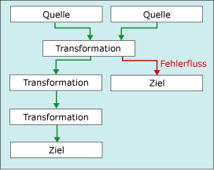

# <a name="error-handling-in-data"></a>Fehlerbehandlung in Daten
  Wenn eine Datenflusskomponente eine Transformation auf Spaltendaten anwendet, Daten aus Quellen extrahiert oder Daten in Ziele lädt, können Fehler auftreten. Fehler treten häufig aufgrund unerwarteter Datenwerte auf. Beispielsweise tritt bei einer Datenkonvertierung ein Fehler auf, weil eine Spalte eine Zeichenfolge anstelle einer Zahl enthält. Beim Einfügen in eine Datenbankspalte kann ein Fehler auftreten, weil die Daten einen date-Datentyp und die Spalte einen numeric-Datentyp aufweist. Ein Ausdruck kann nicht ausgewertet werden, weil ein Spaltenwert Null ist, wodurch sich eine ungültige mathematische Operation ergibt.  
  
 Fehler können in der Regel einer der folgenden Kategorien zugeordnet werden:  
  
-   Datenkonvertierungsfehler, die auftreten, wenn eine Konvertierung zum Verlust signifikanter Ziffern, zum Verlust insignifikanter Ziffern und zum Abschneiden von Zeichenfolgen führt. Datenkonvertierungsfehler treten außerdem auf, wenn die angeforderte Konvertierung nicht unterstützt wird.  
  
-   Fehler bei der Ausdrucksauswertung. Sie treten auf, wenn Ausdrücke, die zur Laufzeit ausgewertet werden, ungültige Vorgänge ausführen oder aufgrund fehlender oder falscher Datenwerte syntaktisch falsch sind.  
  
-   Suchfehler, die auftreten, wenn ein Suchvorgang keine Übereinstimmung in der Nachschlagetabelle findet.  
  
 Eine Liste der Fehler, Warnungen und anderen Meldungen in Integration Services finden Sie unter [Fehler- und Meldungsreferenz von Integration Services](../../integration-services/integration-services-error-and-message-reference.md).  
  
## <a name="use-error-outputs-to-capture-row-level-errors"></a>Verwenden von Fehlerausgaben zum Erfassen von Fehlern auf Zeilenebene  
 Viele Datenflusskomponenten unterstützen Fehlerausgaben, mit denen Sie steuern können, wie die Komponente Fehler auf Zeilenebene in ein- und ausgehenden Daten behandelt. Sie geben das Verhalten der Komponente an, wenn Daten abgeschnitten werden oder ein Fehler auftritt, indem Sie Optionen für einzelne Spalten in der Eingabe oder Ausgabe festlegen. Beispielsweise können Sie angeben, dass bei der Komponente ein Fehler auftritt, wenn die Daten für den Kundennamen abgeschnitten werden, dass aber Fehler in einer anderen Spalte, die weniger wichtige Daten enthält, ignoriert werden.  
  
 Die Fehlerausgabe kann mit der Eingabe einer anderen Transformation verbunden werden oder in ein anderes Ziel als die Nichtfehlerausgabe geladen werden. Beispielsweise kann die Fehlerausgabe mit einer Transformation für abgeleitete Spalten verbunden werden, die eine Zeichenfolge für eine leere Spalte bereitstellt.  
  
 Im folgenden Diagramm wird ein einfacher Datenfluss mit einer Fehlerausgabe dargestellt.  
  
   
  
 Weitere Informationen finden Sie unter [Datenfluss](../../integration-services/data-flow/data-flow.md) und [Integration Services-Pfade](../../integration-services/data-flow/integration-services-paths.md).  

## <a name="configure-error-output-dialog-box"></a>Konfigurieren Sie die Fehlerausgabe (Dialogfeld)
Mithilfe des Dialogfelds **Fehlerausgabe konfigurieren** können Sie die Fehlerbehandlungsoptionen für Datenflusstransformationen konfigurieren, die eine Fehlerausgabe unterstützen.  
  
 Weitere Informationen zum Arbeiten mit Fehlerausgaben finden Sie unter [Fehlerbehandlung in Daten](../../integration-services/data-flow/error-handling-in-data.md).  
  
### <a name="options"></a>enthalten  
 **Eingabe oder Ausgabe**  
 Zeigen Sie den Namen der Ausgabe an.  
  
 **Column**  
 Zeigen Sie die Ausgabespalten an, die Sie im Dialogfeld des Transformations-Editors ausgewählt haben.  
  
 **Fehler**  
 Geben Sie gegebenenfalls an, was bei Auftreten eines Fehlers geschehen soll: den Fehler ignorieren, die Zeile umleiten oder die Komponente mit einem Fehler abbrechen.  
  
 **Verwandte Themen:** [Fehlerbehandlung in Daten](../../integration-services/data-flow/error-handling-in-data.md)  
  
 **Abschneiden**  
 Geben Sie gegebenenfalls an, was bei Auftreten eines Abschneidens geschehen soll: den Fehler ignorieren, die Zeile umleiten oder die Komponente mit einem Fehler abbrechen.  
  
 **Verwandte Themen:** [Fehlerbehandlung in Daten](../../integration-services/data-flow/error-handling-in-data.md)  
  
 **Description**  
 Zeigt die Beschreibung des Vorgangs an.  
  
 **Diesen Wert für ausgewählte Zellen festlegen**  
 Gibt an, was im Falle eines Fehlers oder einer Kürzung mit den ausgewählten Zellen geschehen soll: den Fehler ignorieren, die Zeile umleiten oder die Komponente mit einem Fehler abbrechen.  
  
 **Anwenden**  
 Wendet die Fehlerbehandlungsoption auf die ausgewählten Zellen an.  
  
## <a name="errors-are-either-failures-or-truncations"></a>Fehler in Form von Fehlschlägen oder abgeschnittenen Daten  
 Fehler können zwei Kategorien zugeordnet werden: Fehler oder Abschneiden von Daten.  
  
 **Fehler**. Ein Fehler ist ein Hinweis auf ein eindeutiges Problem, und es wird ein NULL-Ergebnis generiert. Hierzu zählen Fehler bei der Datenkonvertierung oder bei der Ausdrucksauswertung. Beispielsweise wird ein Fehler verursacht, wenn eine Zeichenfolge, die Buchstaben enthält, in eine Zahl konvertiert wird. Datenkonvertierungen, Auswertungen von Ausdrücken sowie Zuweisungen von Ausdrucksergebnissen zu Variablen, Eigenschaften und Datenspalten erzeugen aufgrund von unzulässigen Umwandlungen und inkompatiblen Datentypen möglicherweise einen Fehler. Weitere Informationen finden Sie unter [Cast &#40;SSIS-Ausdruck&#41;](../../integration-services/expressions/cast-ssis-expression.md), [Integration Services-Datentypen in Ausdrücken](../../integration-services/expressions/integration-services-data-types-in-expressions.md) und [Integration Services-Datentypen](../../integration-services/data-flow/integration-services-data-types.md).  
  
 **Abschneiden**. Das Abschneiden von Daten ist nicht so schwerwiegend wie ein Fehler. Beim Abschneiden werden Ergebnisse generiert, die verwendbar oder sogar wünschenswert sind. Sie können das Abschneiden von Daten als Fehler oder als zulässige Bedingungen behandeln. Wenn Sie z. B. eine Zeichenfolge mit 15 Zeichen in eine Spalte einfügen, die nur eine Breite von einem Zeichen aufweist, können Sie festlegen, dass die Zeichenfolge abgeschnitten wird.  
  
## <a name="select-an-error-handling-option"></a>Auswählen einer Fehlerbehandlungsoption  
 Sie können konfigurieren, wie Quellen, Transformationen und Ziele Fehler und das Abschneiden von Daten behandeln. In der folgenden Tabelle werden diese Optionen beschrieben.  
  
|Option|Description|  
|------------|-----------------|  
|Fehler bei Komponente|Bei einem Fehler oder beim Abschneiden von Daten wird der Datenflusstask nicht ausgeführt. Dies ist die Standardoption für einen Fehler und das Abschneiden von Daten.|  
|Fehler ignorieren|Der Fehler oder das Abschneiden von Daten wird ignoriert, und die Datenzeile wird an die Ausgabe der Transformation oder Quelle weitergeleitet.|  
|Zeile umleiten|Der Fehler oder das Abschneiden der Datenzeile wird an die Fehlerausgabe der Quelle, der Transformation oder des Zieles umgeleitet.|  
  
## <a name="get-more-info-about-the-error"></a>Informationen über den Fehler  
 Neben den Datenspalten enthält die Fehlerausgabe die Spalten **ErrorCode** und **ErrorColumn** . Die **ErrorCode** -Spalte gibt den Fehler an, und die **ErrorColumn** -Spalte enthält den Herkunftsbezeichner der Fehlerspalte.  
  
 Unter einigen Umständen wird der Wert der **ErrorColumn** -Spalte auf 0 festgelegt. Dies ist der Fall, wenn sich die Fehlerbedingung nicht auf eine einzelne Spalte, sondern auf die gesamte Zeile auswirkt. Beispielsweise tritt dies ein, wenn bei einer Suche in der Transformation für die Suche ein Fehler auftritt.  
  
 Diese beiden numerischen Werte sind ohne die entsprechende Fehlerbeschreibung und den Spaltennamen nur von begrenztem Nutzen. Nachstehend sind einige Methoden aufgeführt, mithilfe derer Sie die Beschreibung und den Spaltennamen herausfinden können.  
  
-   Sie können sowohl die Fehlerbeschreibung als auch den Spaltennamen anzeigen, indem Sie einen Daten-Viewer an die Fehlerausgabe anfügen. Klicken Sie im SSIS-Designer mit der rechten Maustaste auf den roten Pfeil, der zu einer Fehlerausgabe führt, und wählen Sie **Daten-Viewer aktivieren**aus.  
  
-   Sie finden die Spaltennamen, indem Sie die Protokollierung aktivieren und das **DiagnosticEx** -Ereignis auswählen. Dieses Ereignis schreibt eine Spaltenzuordnung für den Datenfluss in das Protokoll. Anschließend können Sie den Namen der Spalte anhand ihres Bezeichners in dieser Spaltenzuordnung nachschlagen. Beachten Sie, dass Leerraum in der XML-Ausgabe beim **DiagnosticEx** -Ereignis nicht beibehalten wird, um die Größe des Protokolls zu verringern. Kopieren Sie das Protokoll in einen XML-Editor wie z.B. Visual Studio, der XML-Formatierung und Syntaxhervorhebung unterstützt, um die Lesbarkeit zu verbessern. Weitere Informationen zur Protokollierung finden Sie unter [Integration Services-Protokollierung &#40;SSIS&#41;](../../integration-services/performance/integration-services-ssis-logging.md).  
  
     Nachstehend finden Sie ein Beispiel der Spaltenzuordnung für den Datenfluss.  
  
    ```xml  
  
    \<DTS:PipelineColumnMap xmlns:DTS="www.microsoft.com/SqlServer/Dts">  
        \<DTS:Pipeline DTS:Path="\Package\Data Flow Task">  
            \<DTS:Column DTS:ID="11" DTS:IdentificationString="ADO NET Source.Outputs[ADO NET Source Output].Columns[Customer]"/>  
            \<DTS:Column DTS:ID="12" DTS:IdentificationString="ADO NET Source.Outputs[ADO NET Source Output].Columns[Product]"/>  
            \<DTS:Column DTS:ID="13" DTS:IdentificationString="ADO NET Source.Outputs[ADO NET Source Output].Columns[Price]"/>  
            \<DTS:Column DTS:ID="14" DTS:IdentificationString="ADO NET Source.Outputs[ADO NET Source Output].Columns[Timestamp]"/>  
            \<DTS:Column DTS:ID="20" DTS:IdentificationString="ADO NET Source.Outputs[ADO NET Source Error Output].Columns[Customer]"/>  
            \<DTS:Column DTS:ID="21" DTS:IdentificationString="ADO NET Source.Outputs[ADO NET Source Error Output].Columns[Product]"/>  
            \<DTS:Column DTS:ID="22" DTS:IdentificationString="ADO NET Source.Outputs[ADO NET Source Error Output].Columns[Price]"/>  
            \<DTS:Column DTS:ID="23" DTS:IdentificationString="ADO NET Source.Outputs[ADO NET Source Error Output].Columns[Timestamp]"/>  
            \<DTS:Column DTS:ID="24" DTS:IdentificationString="ADO NET Source.Outputs[ADO NET Source Error Output].Columns[ErrorCode]"/>  
            \<DTS:Column DTS:ID="25" DTS:IdentificationString="ADO NET Source.Outputs[ADO NET Source Error Output].Columns[ErrorColumn]"/>  
            \<DTS:Column DTS:ID="31" DTS:IdentificationString="Flat File Destination.Inputs[Flat File Destination Input].Columns[Customer]"/>  
            \<DTS:Column DTS:ID="32" DTS:IdentificationString="Flat File Destination.Inputs[Flat File Destination Input].Columns[Product]"/>  
            \<DTS:Column DTS:ID="33" DTS:IdentificationString="Flat File Destination.Inputs[Flat File Destination Input].Columns[Price]"/>  
            \<DTS:Column DTS:ID="34" DTS:IdentificationString="Flat File Destination.Inputs[Flat File Destination Input].Columns[Timestamp]"/>  
        \</DTS:Pipeline>  
    \</DTS:PipelineColumnMap>  
  
    ```  
  
-   Sie können darüber hinaus die Skriptkomponente nutzen, um die Fehlerbeschreibung und den Spaltennamen in die zusätzlichen Spalten der Fehlerausgabe mitaufzunehmen. Ein Beispiel finden Sie unter [Erweitern einer Fehlerausgabe mit der Skriptkomponente](../../integration-services/extending-packages-scripting-data-flow-script-component-examples/enhancing-an-error-output-with-the-script-component.md).  
  
    -   Schließen Sie die Fehlerbeschreibung in einer zusätzlichen Spalte ein, indem Sie für den Aufruf der <xref:Microsoft.SqlServer.Dts.Pipeline.Wrapper.IDTSComponentMetaData100.GetErrorDescription%2A> -Methode der <xref:Microsoft.SqlServer.Dts.Pipeline.Wrapper.IDTSComponentMetaData100> -Schnittstelle eine einzelne Zeile des Skripts verwenden.  
  
    -   Schließen Sie den Spaltennamen in einer zusätzlichen Spalte ein, indem Sie für den Aufruf der <xref:Microsoft.SqlServer.Dts.Pipeline.Wrapper.IDTSComponentMetaData100.GetIdentificationStringByID%2A> -Methode der <xref:Microsoft.SqlServer.Dts.Pipeline.Wrapper.IDTSComponentMetaData100> -Schnittstelle eine einzelne Zeile des Skripts verwenden.  
  
     Sie können die Skriptkomponente dem Fehlersegment des Datenflusses an einem beliebigen Ort unterhalb der Datenflusskomponenten hinzufügen, deren Fehler Sie erfassen möchten. In der Regel setzen Sie die Skriptkomponente unmittelbar bevor die Fehlerzeilen in ein Ziel geschrieben werden. Auf diese Weise sucht das Skript nur nach Beschreibungen für geschriebene Fehlerzeilen. Das Fehlersegment des Datenflusses korrigiert u.U. einige Fehler und schreibt diese Zeilen nicht in ein Fehlerziel.  

## <a name="see-also"></a>Siehe auch  
 [Datenfluss](../../integration-services/data-flow/data-flow.md)   
 [Transformieren von Daten mit Transformationen](../../integration-services/data-flow/transformations/transform-data-with-transformations.md)   
 [Verbinden von Komponenten mit Pfaden](http://msdn.microsoft.com/library/05633e4c-1370-4b05-802b-f36b07dd71c8)   
 [Datenflusstask](../../integration-services/control-flow/data-flow-task.md)   
 [Datenfluss](../../integration-services/data-flow/data-flow.md)  
  
  

