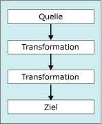

# Transformieren von Daten mit Transformationen
  [!INCLUDE[ssISnoversion](../../../includes/ssisnoversion-md.md)] schließt drei verschiedene Arten von Datenflusskomponenten ein: Quellen, Transformationen und Ziele.  
  
 Im folgenden Diagramm wird ein einfacher Datenfluss mit einer Quelle, zwei Transformationen und einem Ziel dargestellt.  
  
   
  
 [!INCLUDE[ssISnoversion](../../../includes/ssisnoversion-md.md)] -Transformationen stellen die folgende Funktionalität bereit:  
  
-   Teilen, Kopieren und Zusammenführen von Rowsets und Ausführen von Suchvorgängen.  
  
-   Aktualisieren von Spaltenwerten und Erstellen neuer Spalten durch Anwenden von Transformationen, wie z. B. das Ändern von Großbuchstaben in Kleinbuchstaben.  
  
-   Ausführen von Business Intelligence-Vorgängen, wie z. B. das Bereinigen von Daten, Text Mining oder das Ausführen von Data Mining-Vorhersageabfragen.  
  
-   Erstellen neuer Rowsets, die aus Aggregatwerten oder sortierten Werten, Stichprobendaten oder pivotierten bzw. entpivotierten Daten bestehen.  
  
-   Ausführen von Aufgaben, wie z. B. das Exportieren und Importieren von Daten, das Bereitstellen von Überwachungsinformationen sowie das Verwenden von langsam veränderlichen Dimensionen.  
  
 Weitere Informationen finden Sie unter [Integration Services Transformations](../../../integration-services/data-flow/transformations/integration-services-transformations.md).  
  
 Sie können auch benutzerdefinierte Transformationen erstellen. Weitere Informationen finden Sie unter [Entwickeln einer benutzerdefinierten Datenflusskomponente](../../../integration-services/extending-packages-custom-objects/data-flow/developing-a-custom-data-flow-component.md) und [Entwickeln bestimmter Arten von Datenflusskomponenten](../../../integration-services/extending-packages-custom-objects-data-flow-types/developing-specific-types-of-data-flow-components.md).  
  
 Nachdem Sie dem Datenfluss-Designer die Transformation hinzugefügt haben, jedoch bevor Sie die Transformation konfigurieren, verbinden Sie die Transformation mit dem Datenfluss. Hierzu verbinden Sie die Ausgabe einer anderen Transformation oder Quelle im Datenfluss mit der Eingabe dieser Transformation. Der Konnektor zwischen den beiden Datenflusskomponenten wird als Pfad bezeichnet. Weitere Informationen zum Verbinden von Komponenten und zum Verwenden von Pfaden finden Sie unter [Verbinden von Komponenten mit Pfaden](../Topic/Connect%20Components%20with%20Paths.md).  
  
### So fügen Sie einem Datenfluss eine Transformation hinzu  
  
-   [Hinzufügen oder Löschen einer Komponente im Datenfluss](../../../integration-services/data-flow/add-or-delete-a-component-in-a-data-flow.md)  
  
### So verbinden Sie eine Transformation mit einem Datenfluss  
  
-   [Verbinden von Komponenten in einem Datenfluss](../../../integration-services/data-flow/connect-components-in-a-data-flow.md)  
  
### So legen Sie die Eigenschaften einer Transformation fest  
  
-   [Festlegen der Eigenschaften einer Datenflusskomponente](../../../integration-services/data-flow/set-the-properties-of-a-data-flow-component.md)  
  
## Siehe auch  
 [Datenflusstask](../../../integration-services/control-flow/data-flow-task.md)   
 [Datenfluss](../../../integration-services/data-flow/data-flow.md)   
 [Verbinden von Komponenten mit Pfaden](../Topic/Connect%20Components%20with%20Paths.md)   
 [Fehlerbehandlung in Daten](../../../integration-services/data-flow/error-handling-in-data.md)   
 [Datenfluss](../../../integration-services/data-flow/data-flow.md)  
  
  