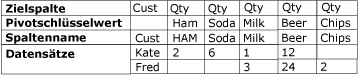
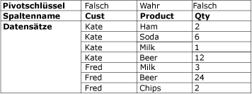

# Entpivotierungstransformation
  Die Transformation für UNPIVOT ändert ein nicht normalisiertes Dataset in eine stärker normalisierte Version, indem Werte aus mehreren Spalten in einem einzelnen Datensatz in mehrere Datensätze mit den gleichen Werten in einer einzigen Spalte erweitert werden. Angenommen, ein Dataset, das Kundennamen auflistet, weist eine Zeile pro Kunden auf, wobei die Produkte und die gekaufte Menge in Spalten in der Zeile angezeigt werden. Nachdem die Entpivotierungstransformation das Dataset normalisiert hat, enthält das Dataset eine andere Zeile für jedes Produkt, das der Kunde gekauft hat.  
  
 Im folgenden Diagramm wird ein Dataset vor dem Entpivotieren der Daten in der Product-Spalte dargestellt.  
  
   
  
 Im folgenden Diagramm wird ein Dataset nach dem Entpivotieren in der Product-Spalte dargestellt.  
  
   
  
 Unter einigen Umständen enthalten die Ergebnisse der Transformation für UNPIVOT möglicherweise Zeilen mit unerwarteten Werten. Wenn z.B. die im Diagramm gezeigten zu entpivotierenden Beispieldaten in allen Qty-Spalten für Fred NULL-Werte enthielten, würde die Ausgabe nur eine Zeile für Fred enthalten, nicht fünf. Die Qty-Spalte würde je nach dem Datentyp der Spalte entweder NULL oder 0 enthalten.  
  
## Konfiguration der Transformation für UNPIVOT  
 Die Transformation für UNPIVOT schließt die benutzerdefinierte Eigenschaft **PivotKeyValue** ein. Diese Eigenschaft kann beim Laden des Pakets mithilfe eines Eigenschaftsausdrucks aktualisiert werden. Weitere Informationen finden Sie unter [Integration Services-Ausdrücke &#40;SSIS&#41;](../../../integration-services/expressions/integration-services-ssis-expressions.md), [Verwenden von Eigenschaftsausdrücken in Paketen](../../../integration-services/expressions/use-property-expressions-in-packages.md) und [Benutzerdefinierte Eigenschaften von Transformationen](../../../integration-services/data-flow/transformations/transformation-custom-properties.md).  
  
 Diese Transformation weist je eine Eingabe und eine Ausgabe auf. Es ist keine Fehlerausgabe vorhanden.  
  
 Sie können Eigenschaften mit dem [!INCLUDE[ssIS](../../../includes/ssis-md.md)] -Designer oder programmgesteuert festlegen.  
  
 Klicken Sie auf eines der folgenden Themen, um weitere Informationen zu den Eigenschaften zu erhalten, die Sie im Dialogfeld **Erweiterter Editor** oder programmgesteuert festlegen können:  
  
-   [Allgemeine Eigenschaften](http://msdn.microsoft.com/library/51973502-5cc6-4125-9fce-e60fa1b7b796)  
  
-   [Benutzerdefinierte Eigenschaften von Transformationen](../../../integration-services/data-flow/transformations/transformation-custom-properties.md)  
  
 Informationen zum Festlegen der Eigenschaften finden Sie unter [Festlegen der Eigenschaften einer Datenflusskomponente](../../../integration-services/data-flow/set-the-properties-of-a-data-flow-component.md).  
  
## Editor zum Entpivotieren von Transformationen
  Mithilfe des Dialogfelds **Transformations-Editor für UNPIVOT** können Sie die in Zeilen neu anzuordnenden Spalten, die Datenspalte sowie die Ausgabespalte für den neuen pivotierten Wert angeben.  
  
> [!NOTE]  
>  In diesem Thema wird die Verwendung der Optionen auf der Grundlage des in [Entpivotierungstransformation](../../../integration-services/data-flow/transformations/unpivot-transformation.md) beschriebenen Entpivotierungsszenarios veranschaulicht.  
  
### enthalten  
 **Verfügbare Eingabespalten**  
 Geben Sie mithilfe der Kontrollkästchen die Spalten an, die in Zeilen neu angeordnet werden sollen.  
  
 **Name**  
 Zeigt den Namen der verfügbaren Eingabespalte an.  
  
 **Pass-Through**  
 Gibt an, ob die Spalte in die entpivotierte Ausgabe eingeschlossen werden soll.  
  
 **Eingabespalte**  
 Wählen Sie für jede Zeile eine Spalte aus der Liste der verfügbaren Eingabespalten aus. Ihre Auswahl wird entsprechend in der Auswahl der Kontrollkästchen in der **Verfügbare Eingabespalten** -Tabelle deutlich.  
  
 Im Entpivotierungsszenario, das in [Unpivot Transformation](../../../integration-services/data-flow/transformations/unpivot-transformation.md)beschrieben wird, sind als Eingabespalten die Spalten **Ham**, **Soda**, **Milk**, **Beer**und **Chips** verfügbar.  
  
 **Zielspalte**  
 Geben Sie einen Namen für die Datenspalte an.  
  
 Im Entpivotierungsszenario, das in [Entpivotierungstransformation](../../../integration-services/data-flow/transformations/unpivot-transformation.md)beschrieben wird, ist die Zielspalte die Mengenspalte (**Qty**).  
  
 **Pivotschlüsselwert**  
 Geben Sie einen Namen für den Pivotwert an. Standardmäßig wird der Name der Eingabespalte verwendet. Sie können jedoch auch einen beschreibenden Namen angeben, sofern dieser eindeutig ist.  
  
 Der Wert dieser Eigenschaft kann mithilfe eines Eigenschaftsausdrucks angegeben werden.  
  
 In dem in [Unpivot Transformation](../../../integration-services/data-flow/transformations/unpivot-transformation.md)beschriebenen Entpivotierungsszenario werden die pivotierten Werte in der neuen, durch die Option **Name der Pivotschlüsselwert-Spalte** angegebenen Product-Spalte als die Textwerte **Ham**, **Soda**, **Milk**, **Beer**und **Chips**angezeigt.  
  
 **Name der Pivotschlüsselwert-Spalte**  
 Geben Sie einen Namen für die Pivotwertspalte an. Standardwert ist "Pivotschlüsselwert"; Sie können jedoch einen eindeutigen, beschreibenden Namen auswählen.  
  
 In dem in [Unpivot Transformation](../../../integration-services/data-flow/transformations/unpivot-transformation.md)beschriebenen Entpivotierungsszenario lautete der Name der Pivotschlüsselwert-Spalte **Product** und bezieht sich auf die neue **Product** -Spalte, in die die Spalten **Ham**, **Soda**, **Milk**, **Beer**und **Chips** entpivotiert werden.  
  
## Siehe auch  
 [Fehler- und Meldungsreferenz von Integration Services](../../../integration-services/integration-services-error-and-message-reference.md)   
 [Transformation für Pivot](../../../integration-services/data-flow/transformations/pivot-transformation.md)  
  
  
