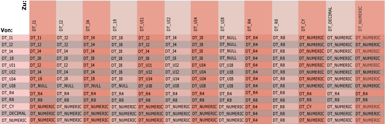

# Integration Services-Datentypen in Ausdrücken
  Die Ausdrucksauswertung verwendet [!INCLUDE[ssISnoversion](../../includes/ssisnoversion-md.md)] -Datentypen. Wenn Daten erstmals an einen Datenfluss in einem [!INCLUDE[ssISnoversion](../../includes/ssisnoversion-md.md)] -Paket weitergegeben werden, konvertiert das Datenflussmodul alle Spaltendaten in einen [!INCLUDE[ssISnoversion](../../includes/ssisnoversion-md.md)] -Datentyp, und die von einem Ausdruck verwendeten Spaltendaten weisen bereits einen [!INCLUDE[ssISnoversion](../../includes/ssisnoversion-md.md)] -Datentyp auf. Ausdrücke, die in den Transformationen für bedingtes Teilen und für abgeleitete Spalten verwendet werden, können auf Spalten verweisen, weil sie Teil eines Datenflusses mit Spaltendaten sind.  
  
## Variablen  
 In Ausdrücken können außerdem Variablen verwendet werden. Variablen weisen einen Variant-Datentyp auf, und die Ausdrucksauswertung konvertiert den Datentyp einer Variablen von einem Variant-Untertyp in einen [!INCLUDE[ssISnoversion](../../includes/ssisnoversion-md.md)] -Datentyp, bevor der Ausdruck ausgewertet wird. Für Variablen kann nur eine Teilmenge der [!INCLUDE[ssISnoversion](../../includes/ssisnoversion-md.md)] -Datentypen verwendet werden. Beispielsweise ist für eine Variable kein BLOB-Datentyp (Binary Large Object Block) zulässig.  
  
 Weitere Informationen zu [!INCLUDE[ssISnoversion](../../includes/ssisnoversion-md.md)] -Datentypen und zum Zuordnen von Variant-Datentypen zu [!INCLUDE[ssISnoversion](../../includes/ssisnoversion-md.md)] -Datentypen finden Sie unter [Integration Services-Datentypen](../../integration-services/data-flow/integration-services-data-types.md).  
  
## Literale  
 Darüber hinaus können Ausdrücke numerische und boolesche Literale sowie Zeichenfolgenliterale einschließen. Weitere Informationen zum Konvertieren von numerischen Literalen in numerische [!INCLUDE[ssISnoversion](../../includes/ssisnoversion-md.md)]-Datentypen finden Sie unter [Literale &#40;SSIS&#41;](../../integration-services/expressions/numeric-string-and-boolean-literals.md).  
  
## Zeichenfolgen  
 Sie können entweder DT_STR oder DT_WSTR als Rückgabetyp eines Ausdrucks verwenden. Innerhalb eines Ausdrucks wird jedoch nur DT_WSTR unterstützt. DT_STR-Werte werden in DT_WSTR-Werte konvertiert. Dieses Verhalten hat mehrere Implikationen für das Schreiben eines Ausdrucks.  
  
-   Verwenden Sie in einem Ausdruck NULL(DT_WSTR, ...) anstelle von NULL(DT_STR, ...). Weitere Informationen zu dieser Funktion finden Sie unter [NULL &#40;SSIS-Ausdruck&#41;](../../integration-services/expressions/null-ssis-expression.md).  
  
-   Innerhalb eines Ausdrucks können Sie nur die CAST-Funktion verwenden, um einen Wert im Stamm des Ausdrucks in den DT_STR-Datentyp umzuwandeln. Der Wert wird also umgewandelt, wenn Sie das endgültige Ergebnis des Ausdrucks zurückgeben. Verwenden Sie alternativ den DT_WSTR-Datentyp innerhalb eines Ausdrucks.  
  
 Betrachten Sie die Ausdrücke im folgenden Screenshot.  
  
   
  
1.  Der erste Ausdruck wird ohne Fehler ausgeführt, weil sich die NULL(DT_STR, ...)-Funktion auf Stammebene des Ausdrucks befindet.  
  
2.  Der zweite Ausdruck wird ohne Fehler ausgeführt, weil NULL(DT_WSTR, ...) verwendet wird.  
  
3.  Der dritte Ausdruck löst einen Fehler aus, weil innerhalb des Ausdrucks NULL(DT_STR, ...) verwendet wird.  
  
4.  Der vierte Ausdruck wird ohne Fehler ausgeführt, weil das Ergebnis von NULL(DT_STR, ...) innerhalb des Ausdrucks umgewandelt wird.  
  
     Die Ausdrucksauswertung verarbeitet diese Umwandlung auf intelligente Weise. Sie wandelt nicht in DT_STR, sondern in DT_WSTR um, da die Auswertung erkennt, dass der Vorgang nicht auf Stammebene des Ausdrucks ausgeführt wird.  
  
 Die folgenden Beispiele veranschaulichen die Auswirkungen der Umwandlung.  
  
   
  
1.  Im ersten Ausdruck wird die Umwandlung nicht auf Stammebene des Ausdrucks ausgeführt. Die Ausdrucksauswertung verarbeitet diese Umwandlung auf intelligente Weise und wandelt nicht in DT_STR, sondern in DT_WSTR um. Der Ausdruck gibt DT_WSTR zurück.  
  
2.  Im zweiten Ausdruck wird die Umwandlung auf Stammebene des Ausdrucks ausgeführt. Der Ausdruck gibt DT_STR zurück.  
  
## Implizite Datenkonvertierung  
 Bei einer impliziten Datentypkonvertierung konvertiert die Ausdrucksauswertung die Daten automatisch in einen anderen Datentyp. Beispielsweise wird beim Vergleich eines **smallint** -Datentyps mit einem **int**-Datentyp der **smallint** -Datentyp implizit in **int** konvertiert, bevor der Vergleich erfolgt.  
  
 Wenn die Argumente und Operanden nicht kompatible Datentypen aufweisen, kann die Ausdrucksauswertung keine implizite Datenkonvertierung ausführen. Zudem kann die Ausdrucksauswertung einen Wert nicht implizit in einen booleschen Wert konvertieren. Stattdessen müssen die Argumente und Operanden explizit mit dem Umwandlungsoperator konvertiert werden. Weitere Informationen finden Sie unter [Umwandlung &#40;SSIS-Ausdruck&#41;](../../integration-services/expressions/cast-ssis-expression.md).  
  
 Das folgende Diagramm zeigt den Ergebnistyp impliziter Konvertierungen von BINARY-Vorgängen. Am Schnittpunkt von Spalte und Zeile in dieser Tabelle finden Sie den Ergebnistyp einer binären Operation mit Operanden der Typen, die links (Von) und rechts (Zu) angegeben sind.  
  
   
  
 Die Schnittmenge eines integer-Werts mit Vorzeichen und eines integer-Werts ohne Vorzeichen ist ein integer-Wert, der potenziell größer als die beiden Argumente ist.  
  
 Anhand von Operatoren werden Zeichenfolgen, Datumsangaben, boolesche Werte und andere Datentypen miteinander verglichen. Bevor ein Operator zwei Werte vergleicht, führt die Ausdrucksauswertung bestimmte implizite Konvertierungen aus: Die Ausdrucksauswertung konvertiert Zeichenfolgenliterale stets in den DT_WSTR-Datentyp und boolesche Literale in den DT_BOOL-Datentyp. Alle in Anführungszeichen eingeschlossenen Werte werden von der Ausdrucksauswertung als Zeichenfolgen interpretiert. Numerische Literale werden in einen der numerischen [!INCLUDE[ssISnoversion](../../includes/ssisnoversion-md.md)] -Datentypen konvertiert.  
  
> [!NOTE]  
>  Boolesche Werte sind keine Zahlen, sondern logische Werte. Obwohl einige Umgebungen boolesche Werte als Zahlenwerte darstellen, werden Sie nicht als Zahlen gespeichert. Je nach Programmiersprache werden boolesche Werte als unterschiedliche Zahlenwerte dargestellt. Dies gilt auch für .NET Framework-Methoden.  
>   
>  Beispielsweise konvertieren die Konvertierungsfunktionen von Visual Basic den Wert **True** in den Zahlenwert -1. Die **System.Convert.ToInt32** -Methode von .NET Framework konvertiert **True** jedoch in den Zahlenwert +1. In der [!INCLUDE[ssISnoversion](../../includes/ssisnoversion-md.md)] -Ausdruckssprache wird der Wert **True** in den Zahlenwert -1 konvertiert.  
>   
>  Um Fehler oder unerwartete Ergebnisse zu vermeiden, sollten Sie keinen Code erstellen, der von bestimmten numerischen Werten für **True** und **False**abhängig ist. Nach Möglichkeit sollten bei booleschen Variablen nur die für sie vorgesehenen logischen Werte verwendet werden.  
  
 Weitere Informationen finden Sie in folgenden Themen:  
  
-   [== &#40;Gleich&#41; &#40;SSIS-Ausdruck&#41;](../../integration-services/expressions/equal-ssis-expression.md)  
  
-   [!= &#40;Ungleich&#41; &#40;SSIS-Ausdruck&#41;](../../integration-services/expressions/unequal-ssis-expression.md)  
  
-   [&#62; &#40;Größer als&#41; &#40;SSIS-Ausdruck&#41;](../../integration-services/expressions/greater-than-ssis-expression.md)  
  
-   [&#60; &#40;Kleiner als&#41; &#40;SSIS-Ausdruck&#41;](../../integration-services/expressions/less-than-ssis-expression.md)  
  
-   [&#62;= &#40;Größer oder gleich&#41; &#40;SSIS-Ausdruck&#41;](../../integration-services/expressions/greater-than-or-equal-to-ssis-expression.md)  
  
-   [&#60;= &#40;Kleiner oder gleich&#41; &#40;SSIS-Ausdruck&#41;](../../integration-services/expressions/less-than-or-equal-to-ssis-expression.md)  
  
 Eine Funktion mit einem einzelnen Argument gibt ein Ergebnis mit dem Datentyp des Arguments zurück, wobei folgende Ausnahmen gelten:  
  
-   DAY, MONTH und YEAR akzeptieren ein Datum und geben ein ganzzahliges Ergebnis (DT_I4) zurück.  
  
-   ISNULL akzeptiert einen Ausdruck eines beliebigen [!INCLUDE[ssIS](../../includes/ssis-md.md)] -Datentyps und gibt einen booleschen Datentyp (DT_BOOL) zurück.  
  
-   SQUARE und SQRT akzeptieren einen numerischen Ausdruck und geben ein nicht integrales numerisches (DT_R8) Ergebnis zurück.  
  
 Falls die Argumente vom gleichen Datentyp sind, gehört auch das Ergebnis zu diesem Datentyp. Die einzige Ausnahme ist das Ergebnis einer binären Operation für zwei Werte mit dem DT_DECIMAL-Datentyp. In diesem Fall wird ein Ergebnis mit dem DT_NUMERIC-Datentyp zurückgegeben.  
  
## Voraussetzungen für die Verwendung von Daten in Ausdrücken  
 Die Ausdrucksauswertung unterstützt alle [!INCLUDE[ssISnoversion](../../includes/ssisnoversion-md.md)] -Datentypen. Je nach Operation oder Funktion sind jedoch für die Operanden und Argumente bestimmte Datentypen erforderlich. Die Ausdrucksauswertung erzwingt die folgenden Datentypanforderungen für Daten, die in Ausdrücken verwendet werden:  
  
-   Operanden, die in **logischen** Operationen verwendet werden, müssen zu einem booleschen Wert ausgewertet werden. Beispiel: COLUMNA > 1&&COLUMNB < 2.  
  
-   Operanden, die in **mathematischen** Operationen verwendet werden, müssen zu einem numerischen Wert ausgewertet werden. Beispiel: 23.75 * 4.  
  
-   In Vergleichsoperationen, z. B. logischen und Gleichheitsoperationen, verwendete Operanden müssen zu kompatiblen Datentypen ausgewertet werden.  
  
     In einem der Ausdrücke im folgenden Beispiel wird z. B. der DT_DBTIMESTAMPOFFSET-Datentyp verwendet:  
  
     `(DT_DBTIMESTAMPOFFSET,3) "1999-10-11 20:34:52.123 -3:30" != (DT_DBDATE)"1999-10-12"`  
  
     Der Ausdruck `(DT_DBDATE)"1999-10-12"`wird in DT_DBTIMESTAMPOFFSET konvertiert. In diesem Beispiel wird zu TRUE ausgewertet, weil der konvertierte Ausdruck zu "1999-10-12 00:00:00.000 +00:00" wird, was nicht dem Wert des anderen Ausdrucks entspricht, der `(DT_DBTIMESTAMPOFFSET,3) "1999-10-11 20:34:52.123 -3:30"`lautet.  
  
-   Argumente, die an mathematische Funktionen übergeben werden, müssen zu einem numerischen Datentyp ausgewertet werden. Je nach Funktion oder Operation kann ein bestimmter numerischer Datentyp erforderlich sein. Beispielsweise erfordert die HEX-Funktion eine ganze Zahl mit oder ohne Vorzeichen.  
  
-   Argumente, die an Zeichenfolgenfunktionen übergeben werden, müssen zu einem Zeichendatentyp ausgewertet werden: DT_STR oder DT_WSTR. Beispiel: UPPER("flower"). Manche Zeichenfolgenfunktionen, wie z. B. SUBSTRING, erfordern zusätzliche ganzzahlige Argumente für die Startposition und die Länge der Zeichenfolge.  
  
-   Argumente, die an Datums- und Zeitfunktionen übergeben werden, müssen zu einem gültigen Datum ausgewertet werden. Beispielsweise DAY(GETDATE()). Manche Funktionen, wie z. B. DATEADD, erfordern ein zusätzliches ganzzahliges Argument für die Anzahl von Tagen, die von der Funktion zu einem Datum addiert werden.  
  
 Für Operationen, bei denen ein integer-Wert ohne Vorzeichen mit der Länge von 8 Byte und ein integer-Wert mit Vorzeichen kombiniert werden, ist zum Klären des Ergebnisformats eine explizite Umwandlung erforderlich. Weitere Informationen finden Sie unter [Umwandlung &#40;SSIS-Ausdruck&#41;](../../integration-services/expressions/cast-ssis-expression.md).  
  
 Die Ergebnisse vieler Operationen und Funktionen können vordefinierte Datentypen aufweisen. Dies kann der Datentyp des Arguments oder der Datentyp sein, in den die Ausdrucksauswertung das Ergebnis umwandelt. Beispielsweise ist das Ergebnis eines logischen OR-Operators (||) immer ein boolescher Wert, das Ergebnis der ABS-Funktion ist der numerische Datentyp des Arguments, und das Ergebnis einer Multiplikation ist der kleinste numerische Datentyp, der das Ergebnis ohne Verlust speichern kann. Weitere Informationen zu den Datentypen von Ergebnissen finden Sie unter [Operatoren &#40;SSIS-Ausdruck&#41;](../../integration-services/expressions/operators-ssis-expression.md) und [Funktionen &#40;SSIS-Ausdruck&#41;](../../integration-services/expressions/functions-ssis-expression.md).  
  
## Verwandte Aufgaben  
 [Verwenden eines Ausdrucks in einer Datenflusskomponente](http://msdn.microsoft.com/library/9181b998-d24a-41fb-bb3c-14eee34f910d)  
  
## Verwandte Inhalte  
  
-   Technischer Artikel, [SSIS Expression Cheat Sheet](http://go.microsoft.com/fwlink/?LinkId=746575), auf pragmaticworks.com  
  
-   Technischer Artikel, [SSIS Expression Examples](http://go.microsoft.com/fwlink/?LinkId=220761), auf social.technet.microsoft.com  
  
  
