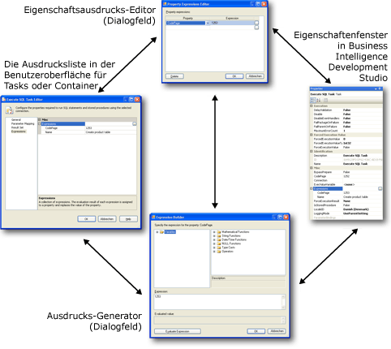

# Verwenden von Eigenschaftsausdrücken in Paketen
  Ein Eigenschaftsausdruck ist ein einer Eigenschaft zugewiesener Ausdruck, um das dynamische Aktualisieren der Eigenschaft zur Laufzeit zu ermöglichen. So kann ein Eigenschaftsausdruck z. B. die An-Zeile aktualisieren, die ein Task des Typs "Mail senden" verwendet, indem eine in einer Variablen gespeicherte E-Mail-Adresse eingefügt wird.  
  
 Ein Ausdruck kann einem Paket, einem Task, einer Foreach-Schleife, einer For-Schleife, einer Sequenz, einem Foreach-Enumerator, einem Ereignishandler, einer Paket- oder Projektebene, einem Verbindungs-Manager oder einem Protokollanbieter hinzugefügt werden. Jede beliebige Eigenschaft dieser Objekte vom Typ Lesen/Schreiben kann einen Eigenschaftsausdruck implementieren. [!INCLUDE[ssISnoversion](../../includes/ssisnoversion-md.md)] unterstützt auch die Verwendung von Eigenschaftsausdrücken in einigen benutzerdefinierten Eigenschaften von Datenflusskomponenten. Variablen und Rangfolgeneinschränkungen unterstützen keine Eigenschaftsausdrücke. Sie enthalten jedoch spezielle Eigenschaften, in denen Sie Ausdrücke verwenden können.  
  
 Eigenschaftsausdrücke können auf verschiedene Weise aktualisiert werden:  
  
-   Benutzerdefinierte Variablen können in Paketkonfigurationen eingeschlossen und dann aktualisiert werden, wenn das Paket bereitgestellt wird. Zur Laufzeit wird der Eigenschaftsausdruck anhand des aktualisierten Variablenwertes ausgewertet.  
  
-   Systemvariablen, die in Ausdrücken eingeschlossen sind, werden zur Laufzeit aktualisiert, was die Ergebnisse der Eigenschaftsauswertung verändert.  
  
-   Datums- und Zeitfunktionen werden zur Laufzeit ausgewertet und stellen die aktualisierten Werte für Eigenschaftsausdrücke bereit.  
  
-   Variablen in Ausdrücken können durch die Skripts aktualisiert werden, die vom Skripttask und der Skriptkomponente ausgeführt werden.  
  
 Die Ausdrücke werden mithilfe der [!INCLUDE[msCoName](../../includes/msconame-md.md)] [!INCLUDE[ssISnoversion](../../includes/ssisnoversion-md.md)] -Ausdruckssprache erstellt. Die Ausdrücke können Systemvariablen oder benutzerdefinierte Variablen verwenden sowie die Operatoren, Funktionen und Typumwandlungen, die von der Ausdruckssprache bereitgestellt werden.  
  
> [!NOTE]  
>  Die Namen von benutzerdefinierten und Systemvariablen unterscheiden nach Groß-/Kleinschreibung.  
  
 Weitere Informationen finden Sie unter [Integration Services-Ausdrücke &#40;SSIS&#41;](../../integration-services/expressions/integration-services-ssis-expressions.md).  
  
 Ein wichtiger Verwendungszweck von Eigenschaftsausdrücken ist das Anpassen von Konfigurationen für jede bereitgestellte Instanz eines Pakets. Damit wird es möglich, Paketeigenschaften dynamisch für unterschiedliche Umgebungen zu aktualisieren. So können Sie z. B. einen Eigenschaftsausdruck erstellen, der eine Variable zur Verbindungszeichenfolge eines Verbindungs-Managers hinzufügt, und dann die Variable aktualisieren, wenn das Paket bereitgestellt wird. Damit wird sichergestellt, dass die Verbindungszeichenfolge zur Laufzeit richtig ist. Paketkonfigurationen werden geladen, bevor die Eigenschaftsausdrücke ausgewertet werden.  
  
 Eine Eigenschaft kann jeweils nur einen Eigenschaftsausdruck verwenden, und ein Eigenschaftsausdruck kann nur für eine einzige Eigenschaft angewendet werden. Allerdings können Sie mehrere identische Eigenschaftsausdrücke erstellen und diese unterschiedlichen Eigenschaften zuordnen.  
  
 Einige Eigenschaften werden mithilfe von Enumeratorwerten festgelegt. Wenn Sie in einem Eigenschaftsausdruck auf das Enumeratorelement verweisen, müssen Sie den numerischen Wert verwenden, der dem Anzeigenamen des Enumeratorelements entspricht. Wenn beispielsweise ein Eigenschaftsausdruck die **LoggingMode** -Eigenschaft festlegt, die einen Wert der **DTSLoggingMode** -Enumeration verwendet, muss der Eigenschaftsausdruck anstelle der Anzeigenamen **Enabled**, **Disabled**oder **UseParentSetting**gleich 0, 1 oder 2 sein. Weitere Informationen finden Sie unter [Aufgezählte Konstanten in Eigenschaftsausdrücken](../../integration-services/expressions/enumerated-constants-in-property-expressions.md).  
  
## Benutzeroberfläche von Eigenschaftsausdrücken  
 [!INCLUDE[ssISnoversion](../../includes/ssisnoversion-md.md)] stellt eine Reihe von Tools zum Erstellen und Verwalten von Eigenschaftsausdrücken bereit.  
  
-   Die **Ausdrücke** -Seite, die sich in den benutzerdefinierten Editoren für Tasks befindet, den For-Schleifen-Container und die Foreach-Container. Mit der **Ausdrücke** -Seite können Sie Ausdrücke bearbeiten und eine Liste der Eigenschaftsausdrücke anzeigen, die ein Task, eine Foreach-Schleife oder eine For-Schleife verwendet.  
  
-   Das **Eigenschaften** -Fenster zum Bearbeiten von Ausdrücken und zum Anzeigen einer Liste der Eigenschaftsausdrücke, die von einem Paket oder von Paketobjekten verwendet werden.  
  
-   Das **Eigenschaftsausdrucks-Editor** -Dialogfeld zum Erstellen, Aktualisieren und Löschen von Eigenschaftsausdrücken.  
  
-   Das **Ausdrucks-Generator** -Dialogfeld zum Erstellen eines Ausdrucks mithilfe der grafischen Tools. Das **Ausdrucks-Generator** -Dialogfeld kann Ausdrücke zur Überprüfung durch Sie auswerten, ohne dass das Auswertungsergebnis zur Eigenschaft zugeordnet wird.  
  
 Im folgenden Diagramm werden die Benutzeroberflächen angezeigt, die Sie verwenden, um Eigenschaftsausdrücke hinzuzufügen, zu ändern oder zu entfernen.  
  
   
  
 Klicken Sie im **Eigenschaften** -Fenster und auf der **Ausdrücke** -Seite auf die Schaltfläche zum Durchsuchen **(…)** in der Sammlungsebene **Ausdrücke** , um das **Eigenschaftsausdruck-Editor** -Dialogfeld zu öffnen. Der Eigenschaftsausdruck-Editor ermöglicht das Zuordnen einer Eigenschaft zu einem Ausdruck und das Eingeben eines Eigenschaftsausdrucks. Wenn Sie die grafischen Ausdruckstools zum Erstellen und anschließend zum Überprüfen des Ausdrucks verwenden möchten, klicken Sie auf der Ausdrucksebene auf die Schaltfläche zum Durchsuchen **(…)** , um das **Ausdrucks-Generator** -Dialogfeld zu öffnen. Erstellen bzw. ändern Sie anschließend den Ausdruck, und überprüfen Sie ihn bei Bedarf.  
  
 Sie können das **Ausdrucks-Generator** -Dialogfeld auch aus dem **Eigenschaftsausdrucks-Editor** -Dialogfeld heraus öffnen.  
  
#### So arbeiten Sie mit Eigenschaftsausdrücken  
  
-   [Hinzufügen oder Ändern eines Eigenschaftsausdrucks](../../integration-services/expressions/add-or-change-a-property-expression.md)  
  
### Festlegen von Eigenschaftsausdrücken von Datenflusskomponenten  
 Wenn Sie in [!INCLUDE[ssBIDevStudioFull](../../includes/ssbidevstudiofull-md.md)]ein Paket erstellen, werden die Eigenschaften von Datenflusskomponenten, die Eigenschaftsausdrücke unterstützen, im zugehörigen Datenflusstask verfügbar gemacht. Klicken Sie mit der rechten Maustaste auf den Datenflusstask des Datenflusses, zu dem die Datenflusskomponenten gehören, und klicken Sie auf **Eigenschaften**, um die Eigenschaftsausdrücke von Datenflusskomponenten hinzuzufügen, zu ändern oder zu entfernen. Das Eigenschaftenfenster listet die Eigenschaften von Datenflusskomponenten auf, mit denen Eigenschaftsausdrücke verwendet werden können. Beispiel: Zum Erstellen oder Ändern eines Eigenschaftsausdrucks für die SamplingValue-Eigenschaft einer Transformation für Zeilenstichprobe in einem Datenfluss mit der Bezeichnung SampleCustomer klicken Sie mit der rechten Maustaste auf den Datenflusstask des Datenflusses, zu dem die Transformation für Zeilenstichprobe gehört, und klicken Sie auf **Eigenschaften**. Die SamplingValue-Eigenschaft wird im Eigenschaftenfenster aufgelistet und liegt im Format [SampleCustomer].[SamplingValue] vor.  
  
 Das Hinzufügen, Ändern und Entfernen von Eigenschaftsausdrücken für Datenflusskomponenten erfolgt im Eigenschaftenfenster auf dieselbe Weise wie für Eigenschaftsausdrücke anderer [!INCLUDE[ssISnoversion](../../includes/ssisnoversion-md.md)] -Objekttypen. Das Eigenschaftenfenster stellt auch den Zugriff auf die verschiedenen Dialogfelder und Ausdrucks-Generatoren bereit, die Sie verwenden können, um Eigenschaftsausdrücke von Datenflusskomponenten hinzuzufügen, zu ändern oder zu entfernen. Weitere Informationen zu den Eigenschaften von Datenflusskomponenten, die mithilfe von Eigenschaftsausdrücken aktualisiert werden können, finden Sie unter [Transformation Custom Properties](../../integration-services/data-flow/transformations/transformation-custom-properties.md).  
  
## Laden von Eigenschaftsausdrücken  
 Angaben und Steuerungen sind beim Laden von Eigenschaftsausdrücken nicht möglich. Die Eigenschaftsausdrücke werden beim Überprüfen des Pakets und der Paketobjekte ausgewertet und geladen. Die Überprüfung erfolgt beim Speichern des Pakets, beim Öffnen des Pakets im [!INCLUDE[ssIS](../../includes/ssis-md.md)] -Designer und beim Ausführen des Pakets.  
  
 Sie können daher die aktualisierten Werte der Paketobjekteigenschaften, die die Eigenschaftsausdrücke des [!INCLUDE[ssIS](../../includes/ssis-md.md)] -Designers verwenden, erst anzeigen, wenn Sie das Paket speichern, das Paket ausführen oder das Paket nach dem Hinzufügen der Eigenschaftsausdrücke erneut öffnen.  
  
 Die Eigenschaftsausdrücke, die anderen Objekttypen zugeordnet sind, wie z. B. Verbindungs-Manager, Protokollanbieter und Enumeratoren, werden ebenfalls geladen, wenn spezifische Methoden des jeweiligen Objekttyps aufgerufen werden. Beispielsweise werden die Eigenschaften der Verbindungs-Manager geladen, bevor in [!INCLUDE[ssISnoversion](../../includes/ssisnoversion-md.md)] eine Instanz der Verbindung erstellt wird.  
  
 Eigenschaftsausdrücke werden nach dem Laden der Paketkonfigurationen geladen. Beispielsweise werden Variablen zuerst durch ihre Konfigurationen aktualisiert, und anschließend werden die Eigenschaftsausdrücke, die die Variablen verwenden, ausgewertet und geladen. Das bedeutet, dass die Eigenschaftsausdrücke immer die Werte der Variablen verwenden, die durch Konfigurationen festgelegt wurden.  
  
> [!NOTE]  
>  Sie können die Option **Set** des Hilfsprogramms **dtexec** nicht verwenden, um einen Eigenschaftsausdruck aufzufüllen.  
  
 In der folgenden Tabelle finden Sie eine Auflistung von Situationen, in denen Eigenschaftsausdrücke von [!INCLUDE[ssISnoversion](../../includes/ssisnoversion-md.md)] ausgewertet und geladen werden.  
  
|Objekttyp|Laden und Auswerten|  
|-----------------|-----------------------|  
|Paket, Foreach-Schleife, For-Schleife, Sequenz, Tasks und Datenflusskomponenten|Nach dem Laden von Konfigurationen   Vor der Prüfung   Vor der Ausführung|  
|Verbindungs-Manager|Nach dem Laden von Konfigurationen   Vor der Prüfung   Vor der Ausführung   Vor dem Erstellen einer Verbindungsinstanz|  
|Protokollanbieter|Nach dem Laden von Konfigurationen   Vor der Prüfung   Vor der Ausführung   Vor dem Öffnen von Protokollen|  
|Foreach-Enumeratoren|Nach dem Laden von Konfigurationen   Vor der Prüfung   Vor der Ausführung   Vor jeder Enumeration der Schleife|  
  
## Verwenden von Eigenschaftsausdrücken in der Foreach-Schleife  
 Es ist häufig nützlich, einen Eigenschaftsausdruck zu implementieren, um den Wert der **ConnectionString** -Eigenschaft von Verbindungs-Managern festzulegen, die im Foreach-Schleifencontainer verwendet werden. Wenn der Enumerator bei jeder Iteration der Schleife seinen aktuellen Wert einer Variablen zuordnet, kann der Eigenschaftsausdruck den Wert dieser Variablen zum dynamischen Aktualisieren des Wertes der **ConnectionString** -Eigenschaft verwenden.  
  
 Wenn Sie Eigenschaftsausdrücke zusammen mit der **ConnectionString** -Eigenschaft von Dateiverbindungs-Managern oder von Verbindungs-Managern für mehrere Dateien, für Flatfiles oder für mehrere Flatfiles verwenden möchten, der in einer Foreach-Schleife verwendet wird, sind einige Faktoren zu beachten. Ein Paket kann so konfiguriert werden, dass mehrere ausführbare Dateien gleichzeitig ausgeführt werden, indem Sie die **MaxConcurrentExecutables** -Eigenschaft auf einen Wert größer als 1 bzw. auf den Wert -1 festlegen. Der Wert -1 lässt die maximale Anzahl gleichzeitig ausführbarer Dateien zu, die der Anzahl der Prozessoren plus zwei entspricht. Der Wert der **MaxConcurrentExecutables** -Eigenschaft sollte auf 1 festgelegt werden, um negative Auswirkungen einer parallelen Ausführung von ausführbaren Dateien zu vermeiden. Wenn die **MaxConcurrentExecutables** -Eigenschaft nicht auf 1 festgelegt ist, kann der Wert der **ConnectionString** -Eigenschaft nicht sichergestellt werden, und die Ergebnisse sind unvorhersehbar.  
  
 Stellen Sie sich z. B. eine Foreach-Schleife vor, die die im Ordner enthaltenen Dateien aufzählt, die Dateinamen abruft und anschließend einen Task 'SQL ausführen' verwendet, um die Dateinamen in eine Tabelle einzufügen. Wenn die **MaxConcurrentExecutables** -Eigenschaft nicht auf 1 festgelegt ist, können Schreibkonflikte auftreten, wenn zwei Instanzen des Tasks "SQL ausführen" versuchen, gleichzeitig in die Tabelle zu schreiben.  
  
## Beispiele für Eigenschaftsausdrücke  
 Die folgenden Beispielausdrücke veranschaulichen das Verwenden von Systemvariablen, Operatoren, Funktionen und Zeichenfolgenliteralen in Eigenschaftsausdrücken.  
  
### Eigenschaftsausdruck für die LoggingMode-Eigenschaft eines Pakets  
 Der folgende Eigenschaftsausdruck kann verwendet werden, um die LoggingMode-Eigenschaft eines Pakets festzulegen. Der Ausdruck verwendet die DAY- und GETDATE-Funktionen, um eine Ganzzahl abzurufen, die den datepart-Wert für den Tag eines Datums darstellt. Handelt es sich dabei um den 1. oder 15. Tag des Monats, ist die Protokollierung aktiviert. Andernfalls ist die Protokollierung deaktiviert. Der Wert 1 ist die entsprechende ganze Zahl der LoggingMode-Eigenschaft des **Enabled**-Enumeratorelements, und der Wert 2 ist die entsprechende ganze Zahl des **Disabled**-Elements. Sie müssen im Ausdruck den numerischen Wert anstelle des Enumeratorelementnamens verwenden.  
  
 `DAY((DT_DBTIMESTAMP)GETDATE())==1||DAY((DT_DBTIMESTAMP)GETDATE())==15?1:2`  
  
### Eigenschaftsausdruck für den Betreff einer E-Mail-Nachricht  
 Der folgende Eigenschaftsausdruck kann verwendet werden, um die Subject-Eigenschaft eines Tasks vom Typ „Mail senden“ festzulegen und einen sinnvollen E-Mail-Betreff bereitzustellen. Der Ausdruck verwendet eine Kombination aus Zeichenfolgenliteralen, Systemvariablen, Verkettungs- (+) und Umwandlungsoperatoren sowie aus den DATEDIFF- und GETDATE-Funktionen. Die Systemvariablen sind die Variablen `PackageName` und `StartTime` .  
  
 `"PExpression-->Package: (" + @[System::PackageName] + ") Started:"+  (DT_WSTR, 30) @[System::StartTime] + " Duration:"  +  (DT_WSTR,10) (DATEDIFF( "ss", @[System::StartTime] , GETDATE()  )) + " seconds"`  
  
 Wenn der Paketname EmailRowCountPP ist, es am 4. März 2005 (3/4/2005) ausgeführt wurde und die Dauer der Ausführung 9 Sekunden betrug, wird der Ausdruck in Form der folgenden Zeichenfolge ausgewertet:  
  
 PExpression-->Package: (EmailRowCountPP) Started:3/4/2005 11:06:18 AM Duration:9 seconds.  
  
### Eigenschaftsausdruck für die Nachricht einer E-Mail-Nachricht  
 Der folgende Eigenschaftsausdruck kann verwendet werden, um die MessageSource-Eigenschaft eines Tasks vom Typ „Mail senden“ festzulegen. Der Ausdruck verwendet eine Kombination aus Zeichenfolgenliteralen, benutzerdefinierten Variablen und dem Verkettungsoperator (+). Die benutzerdefinierten Variablen tragen die Namen `nasdaqrawrows`, `nyserawrows`und `amexrawrows`. Die Zeichenfolge "\n" steht für einen Wagenrücklauf.  
  
 `"Rows Processed: "  +   "\n" +"   NASDAQ: "  +   (dt_wstr,9)@[nasdaqrawrows]   + "\n" + "   NYSE: "  +  (dt_wstr,9)@[nyserawrows]  + "\n" + "   Amex: "  +  (dt_wstr,9)@[amexrawrows]`  
  
 Wenn `nasdaqrawrows` den Wert 7058 aufweist, `nyserawrows` den Wert 3528 und `amexrawrows` den Wert 1102, wird der Ausdruck in Form der folgenden Zeichenfolge ausgewertet:  
  
 Verarbeitete Zeilen:  
  
 NASDAQ: 7058  
  
 NYSE: 3528  
  
 AMEX: 1102  
  
### Eigenschaftsausdruck für die Executable-Eigenschaft eines Tasks vom Typ "Prozess ausführen"  
 Der folgende Eigenschaftsausdruck kann verwendet werden, um die Executable-Eigenschaft eines Tasks vom Typ „Prozess ausführen“ festzulegen. Der Ausdruck verwendet eine Kombination aus Zeichenfolgenliteralen, Operatoren und Funktionen. Der Ausdruck verwendet die Funktionen DATEPART und GETDATE sowie den Bedingungsoperator.  
  
 `DATEPART("weekday", GETDATE()) ==2?"notepad.exe":"mspaint.exe"`  
  
 Handelt es sich um den zweiten Tag der Woche, führt der Task Prozess ausführen Notepad.exe, ansonsten Mspaint.exe aus.  
  
### Eigenschaftsausdruck für die ConnectionString-Eigenschaft eines Verbindungs-Managers für Flatfiles  
 Der folgende Eigenschaftsausdruck kann verwendet werden, um die ConnectionString-Eigenschaft eines Verbindungs-Managers für Flatfiles festzulegen. Der Ausdruck verwendet eine einzige benutzerdefinierte Variable, `myfilenamefull`, die den Pfad zu einer Textdatei enthält.  
  
 `@[User::myfilenamefull]`  
  
> [!NOTE]  
>  Der Zugriff auf Eigenschaftsausdrücke für Verbindungs-Manager ist nur mithilfe des Eigenschaften-Fensters möglich. Um die Eigenschaften eines Verbindungs-Managers anzuzeigen, müssen Sie bei geöffnetem Eigenschaftenfenster im **Verbindungs-Manager** -Bereich des [!INCLUDE[ssIS](../../includes/ssis-md.md)] -Designers den Verbindungs-Manager auswählen oder mit der rechten Maustaste auf den Verbindungs-Manager klicken und **Eigenschaften**auswählen.  
  
### Eigenschaftsausdruck für die ConfigString-Eigenschaft eines Protokollanbieters für Textdateien  
 Der folgende Eigenschaftsausdruck kann verwendet werden, um die ConfigString-Eigenschaft eines Protokollanbieters für Textdateien festzulegen. Der Ausdruck verwendet eine einzelne benutzerdefinierte Variable, `varConfigString`, die den Namen des zu verwendenden Dateiverbindungs-Managers enthält. Der Dateiverbindungs-Manager gibt den Pfad der Textdatei an, in den Protokolleinträge geschrieben werden.  
  
 `@[User::varConfigString]`  
  
> [!NOTE]  
>  Der Zugriff auf Eigenschaftsausdrücke für Protokollanbieter ist nur über das Eigenschaftenfenster möglich. Um die Eigenschaften eines Protokollanbieters anzuzeigen, müssen Sie bei geöffnetem Eigenschaftenfenster auf der Registerkarte **Paket-Explorer** des [!INCLUDE[ssIS](../../includes/ssis-md.md)] -Designers den Protokollanbieter auswählen oder im Paket-Explorer mit der rechten Maustaste auf den Protokollanbieter klicken und auf **Eigenschaften**klicken.  
  
## Externe Ressourcen  
  
-   [Ausdrucks- und Konfigurationshervorhebung (CodePlex-Projekt)](http://go.microsoft.com/fwlink/?LinkId=146625)  
  
-   Technischer Artikel, [SSIS Expression Examples](http://go.microsoft.com/fwlink/?LinkId=220761), auf social.technet.microsoft.com  
  
## Siehe auch  
 [Verwenden von Variablen in Paketen](http://msdn.microsoft.com/library/7742e92d-46c5-4cc4-b9a3-45b688ddb787)  
  
  
