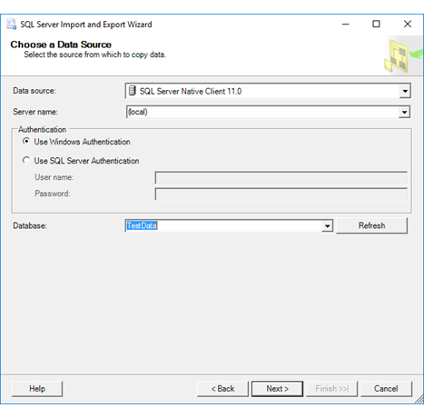
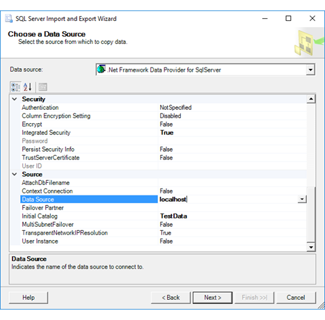
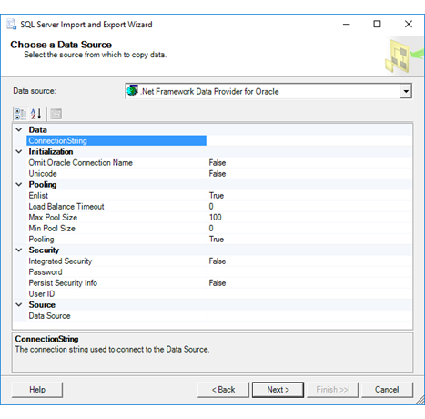
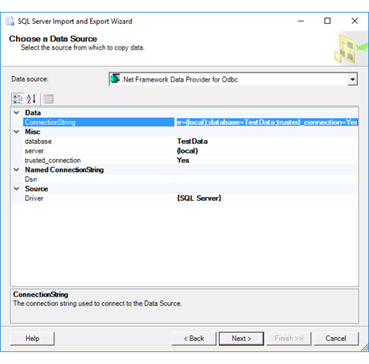
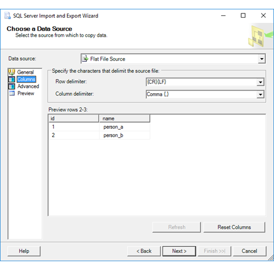
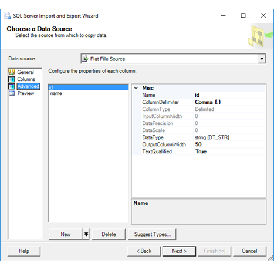
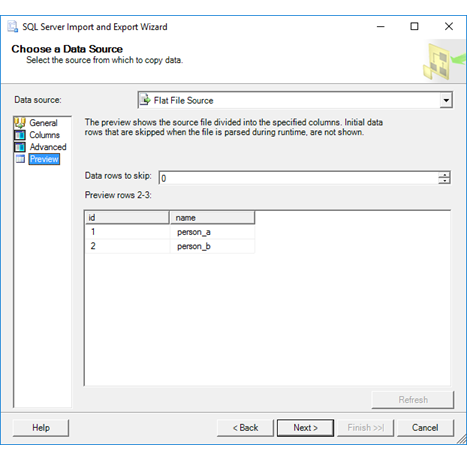
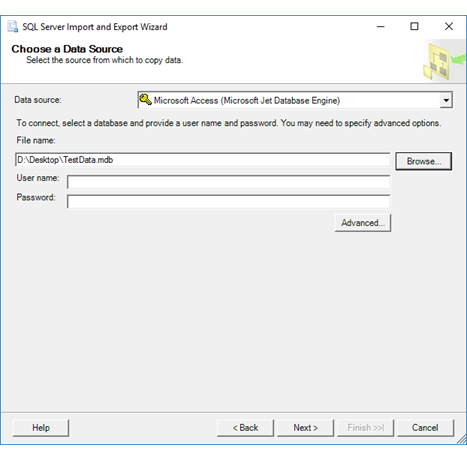

# Datenquelle ausw&#228;hlen (SQL Server-Import/Export-Assistent)
  Nach der Begrüßungsseite zeigt der [!INCLUDE[ssNoVersion](../../includes/ssnoversion-md.md)]-Import/Export-Assistent die Seite **Datenquelle auswählen** an. Auf dieser Seite geben Sie Informationen zur Quelle für Ihre Daten an und darüber, wie Sie eine Verbindung mit dieser herstellen.
  
Weitere Informationen zu Datenquellen, die Sie verwenden können, finden Sie unter [Welche Datenquellen und -ziele kann ich verwenden?](../../integration-services/import-export-data/import-and-export-data-with-the-sql-server-import-and-export-wizard.md#wizardSources)

## Screenshot der Seite „Datenquelle auswählen“ 
Der folgende Screenshot zeigt den oberen Teil der Seite **Datenquelle auswählen** im Assistenten, der sich nicht ändert.

## Auswählen einer Datenquelle
 **Datenquelle**  
Geben Sie die Datenquelle an, indem Sie einen Datenanbieter auswählen, der eine Verbindung mit der Quelle herstellen kann. In den meisten Fällen ergibt sich der Datenanbieter, den Sie benötigen, aus seinem Namen, da der Name des Datenanbieters den Namen des Quelle enthält, z. B. SQL Server, Oracle, Flatfiles, Excel und Access..

Die Liste der verfügbaren Anbieter in der Liste **Datenquelle** hängt von den auf Ihrem Computer installierten Anbietern ab. Es ist auch davon abhängig, ob Sie den 64-Bit- oder den 32-Bit-Assistenten ausführen.

Möglicherweise sind für die Datenquelle mehrere Anbieter verfügbar. In der Regel können Sie alle Anbieter auswählen, die für Ihre Quelle verwendet werden können. Sie können z.B. [!INCLUDE[ssNoVersion](../../includes/ssnoversion-md.md)] Native Client, den Microsoft OLE DB-Anbieter für SQL Server oder den .NET Framework-Datenanbieter für SQL Server verwenden, um eine Verbindung mit Microsoft [!INCLUDE[ssNoVersion](../../includes/ssnoversion-md.md)] herzustellen. 

In einigen Fällen müssen Sie zunächst einen generischen Datenanbieter auswählen. Wenn Sie beispielsweise über einen ODBC-Treiber für Ihre Datenquelle verfügen, wählen Sie den .NET Framework-Datenanbieter für ODBC aus.  
 
Für einige Datenquellen müssen Sie möglicherweise den Datenanbieter von Microsoft oder von einem Drittanbieter herunterladen. Weitere Informationen zu Datenquellen, die Sie verwenden können, finden Sie unter [Welche Datenquellen und -ziele kann ich verwenden?](Import%20and%20Export%20Data%20with%20the%20SQL%20Server%20Import%20and%20Export%20Wizard.md\#wizardSources)

## Nach dem Auswählen der Datenquelle
Nach der Auswahl einer Datenquelle stehen Ihnen auf der Seite **Datenquelle auswählen** verschiedene Optionen zur Verfügung, die vom Datenanbieter abhängig sind, den Sie auswählen.

In den folgenden Abschnitten werden die wichtigen Optionen für einige häufig verwendete Datenquellen aufgeführt. Nicht alle Quellen, die möglicherweise in der Dropdownliste **Datenquelle** verfügbar sind, werden hier aufgeführt. Weitere Informationen und Angaben zu anderen Anbietern finden Sie in den entsprechenden Dokumentationen zu den Anbietern. 
  
> [!TIP]  Wenn Ihre Datenquelle eine Verbindungszeichenfolge erfordert, finden Sie Beispiele dafür auf der Drittanbieterseite [The Connection Strings Reference](https://www.connectionstrings.com/) (Die Verbindungszeichenfolgen-Referenz).  

## Microsoft SQL Server 

### Herstellen einer Verbindung mit SQL Server mithilfe des SQL Server Native Clients oder des Microsoft OLE DB-Anbieters für SQL Server  

SQL Server Native Client und der Microsoft OLE DB-Anbieter für SQL Server bieten die gleichen Optionen. Der folgende Screenshot zeigt die Optionen für SQL Server Native Client als Beispiel.

 **Servername**  
 Geben Sie den Namen des Servers oder die IP-Adresse ein, der die Daten enthält, oder wählen Sie einen Server aus der Liste aus.  
  
> [!NOTE] Wenn Sie sich in einem Netzwerk mit mehreren Servern befinden, kann es einfacher sein, den Servernamen einzugeben. Wenn Sie auf die Dropdownliste klicken, dauert es möglicherweise einige Zeit, das Netzwerk nach allen verfügbaren Servern abzufragen, und Ihr Servername ist möglicherweise nicht in den Ergebnissen aufgelistet.

Um einen nicht standardmäßigen TCP-Port einzurichten, geben Sie ein Komma nach dem Servernamen oder der IP-Adresse ein, und geben Sie dann die Portnummer ein.
  
 **Windows-Authentifizierung verwenden**  
 Gibt an, ob der Assistent die [!INCLUDE[msCoName](../../includes/msconame-md.md)] Windows-Authentifizierung verwenden soll, um sich bei der Datenbank anzumelden. Im Sinne einer größeren Sicherheit wird die Windows-Authentifizierung empfohlen.  
  
 **SQL Server-Authentifizierung verwenden**  
 Gibt an, ob das Paket die [!INCLUDE[ssNoVersion](../../includes/ssnoversion-md.md)]-Authentifizierung verwenden soll, um sich bei der Datenbank anzumelden. Wenn Sie die [!INCLUDE[ssNoVersion](../../includes/ssnoversion-md.md)] -Authentifizierung verwenden, müssen Sie einen Benutzernamen und ein Kennwort angeben.  
  
 **Benutzername**  
 Geben Sie einen Benutzernamen für die Datenbankverbindung an, wenn Sie die [!INCLUDE[ssNoVersion](../../includes/ssnoversion-md.md)]-Authentifizierung verwenden.  
  
 **Kennwort**  
 Geben Sie das Kennwort für die Datenbankverbindung ein, wenn Sie die [!INCLUDE[ssNoVersion](../../includes/ssnoversion-md.md)]-Authentifizierung verwenden.  
  
 **Datenbank**  
 Wählen Sie eine Datenbank aus der Liste der Datenbanken für die angegebene Instanz von [!INCLUDE[ssNoVersion](../../includes/ssnoversion-md.md)] aus.  
  
 **Aktualisieren**  
 Klicken Sie auf **Aktualisieren**, um die Liste der verfügbaren Datenbanken zu aktualisieren.  
  
### Herstellen einer Verbindung mit SQL Server mithilfe des .NET Framework-Datenanbieters für SQL Server 

Auf dieser Seite wird eine gruppierte Liste von Optionen für den [!INCLUDE[dnprdnshort](../../includes/dnprdnshort-md.md)]-Datenanbieter für [!INCLUDE[ssNoVersion](../../includes/ssnoversion-md.md)] angezeigt. Hier werden die wichtigen Optionen aufgeführt. Die zusätzlichen Optionen, die beim Auswählen dieses Anbieters aufgeführt werden, sind in der Regel nicht erforderlich, um erfolgreich eine Verbindung mit der [!INCLUDE[ssNoVersion](../../includes/ssnoversion-md.md)]-Datenquelle herzustellen. 

Weitere Informationen finden Sie unter [.NET Framework Data Provider for SQL Server connection strings](https://www.connectionstrings.com/sqlconnection/) (.NET Framework-Datenanbieter für SQL Server-Verbindungszeichenfolgen).

  
 **Datenquelle**  
 Geben Sie den Namen des Servers oder die IP-Adresse ein, der die Daten enthält, oder wählen Sie einen Server aus der Liste aus.  
  
> [!NOTE] Wenn Sie sich in einem Netzwerk mit mehreren Servern befinden, kann es einfacher sein, den Servernamen einzugeben. Wenn Sie auf die Dropdownliste klicken, dauert es möglicherweise einige Zeit, das Netzwerk nach allen verfügbaren Servern abzufragen, und Ihr Servername ist möglicherweise nicht in den Ergebnissen aufgelistet.  
 
 Um einen nicht standardmäßigen TCP-Port einzurichten, geben Sie ein Komma nach dem Servernamen oder der IP-Adresse ein, und geben Sie dann die Portnummer ein.
 
 **Anfangskatalog**  
 Geben Sie den Namen der Quelldatenbank ein, oder wählen Sie in der Liste eine Datenbank aus.  
  
 **Integrierte Sicherheit**  
 Geben Sie **TRUE** an, um eine Verbindung mithilfe der integrierten Windows-Authentifizierung herzustellen, oder **FALSE**, um mithilfe der [!INCLUDE[ssNoVersion](../../includes/ssnoversion-md.md)]-Authentifizierung eine Verbindung herzustellen. Wenn Sie **FALSE** angeben, müssen Sie eine Benutzer-ID und ein Kennwort eingeben. Der Standardwert ist **False**.  
  
 **Benutzer-ID**  
 Geben Sie einen Benutzernamen für die Datenbankverbindung an, wenn Sie die [!INCLUDE[ssNoVersion](../../includes/ssnoversion-md.md)]-Authentifizierung verwenden.  
  
 **Kennwort**  
 Geben Sie das Kennwort für die Datenbankverbindung ein, wenn Sie die [!INCLUDE[ssNoVersion](../../includes/ssnoversion-md.md)]-Authentifizierung verwenden.  

## Oracle

Stellen Sie eine Verbindung mit Oracle her, indem Sie den .NET Framework-Datenanbieter für Oracle oder den Microsoft OLE DB-Anbieter für Oracle verwenden. Der .NET Framework-Datenanbieter für Oracle ist einfacher zu konfigurieren und wird im folgenden Screenshot dargestellt.

Weitere Informationen finden Sie unter [.NET Framework Data Provider for Oracle connection strings](https://www.connectionstrings.com/net-framework-data-provider-for-oracle/) (.NET Framework-Datenanbieter für Oracle-Verbindungszeichenfolgen) oder [Microsoft OLE DB Provider for Oracle connection strings](https://www.connectionstrings.com/microsoft-ole-db-provider-for-oracle-msdaora/) (Microsoft OLE DB-Anbieter für Oracle-Verbindungszeichenfolgen).

## ODBC-Datenquellen

Wählen Sie zum Laden von Daten aus einer beliebigen Quelle, die einen ODBC-Treiber bereitstellt, den .NET Framework-Datenanbieter für ODBC aus.

Lesen Sie die Dokumentation für den ODBC-Treiber, den Sie verwenden möchten, oder sehen Sie sich Beispiele unter [The Connection Strings Reference](https://www.connectionstrings.com/) (Die Verbindungszeichenfolgen-Referenz) an, um eine Verbindungszeichenfolge für eine ODBC-Datenquelle bereitzustellen. 

Der folgende Screenshot zeigt eine ODBC-Verbindung mit SQL Server als Beispiel. Folgende Verbindungszeichenfolge wird im Beispiel verwendet:

    Driver={SQL Server};Server=(local);Database=TestData;Trusted_Connection=Yes;

Nach der Eingabe der Verbindungszeichenfolge im Feld **ConnectionString**, analysiert der Assistent die Zeichenfolge und zeigt die einzelnen Eigenschaften und deren Werte im Abschnitt **Verschiedenes** der Liste an.

## Textdateien (Flatfiles)
 
 Es gibt mehrere Seiten mit Optionen für Flatfile-Datenquellen.
 
 ### Seite „Allgemein“
 Suchen Sie auf der Seite **Allgemein** nach der Datei, und wählen Sie sie aus. Überprüfen Sie dann die Einstellungen im Abschnitt **Format**.
 
   
   
Weitere Informationen zur Seite **Allgemein** finden Sie auf der folgenden Referenzseite zu Integration Services: [Verbindungs-Manager-Editor für Flatfiles &#40;Seite „Allgemein“&#41;](../../integration-services/connection-manager/flat-file-connection-manager-editor-general-page.md).  

### Seite „Spalten“

 Überprüfen Sie auf der Seite **Spalten** die Liste der Spalten und die Trennzeichen, die der Assistent identifiziert hat.
 
 
  
Weitere Informationen zur Seite **Spalten** finden Sie auf der folgenden Referenzseite zu Integration Services: [Verbindungs-Manager-Editor für Flatfiles &#40;Seite „Spalten“&#41;](../../integration-services/connection-manager/flat-file-connection-manager-editor-columns-page.md).

### Seite „Erweitert“

Auf der Seite **Erweitert** werden detaillierte Informationen zu jeder Spalte in der Datenquelle angezeigt, einschließlich Datentyp und Größe.

Beachten Sie im folgenden Screenshot, dass die **id**-Spalte anfänglich den Datentyp String hat.

Klicken Sie auf **Typen vorschlagen**, um das Dialogfeld **Spaltentypen vorschlagen** anzuzeigen. 

Klicken Sie nach Auswahl der Optionen im Dialogfeld **Spaltentypen vorschlagen** auf **OK**. Der Assistenten kann die Datentypen einiger importierter Spalten ändern.

Der folgende Screenshot zeigt, dass der Assistent erkannt hat, dass die **id**-Spalte in der Datenquelle eigentlich eine Zahl und keine Textzeichenfolge ist, und den Datentyp der Spalte von String in Integer geändert hat.

  
Weitere Informationen zur Seite **Erweitert** finden Sie auf der folgenden Referenzseite zu Integration Services: [Verbindungs-Manager-Editor für Flatfiles &#40;Seite „Erweitert“&#41;](../../integration-services/connection-manager/flat-file-connection-manager-editor-advanced-page.md).

### Seite „Vorschau“

Überprüfen Sie auf der Seite **Vorschau**, ob die Liste der Spalten und die Beispieldaten Ihren Erwartungen entsprechen.

Weitere Informationen zur Seite **Vorschau** finden Sie auf der folgenden Referenzseite zu Integration Services: [Verbindungs-Manager-Editor für Flatfiles &#40;Seite „Vorschau“&#41;](../../integration-services/connection-manager/flat-file-connection-manager-editor-preview-page.md).  
 
## Microsoft Excel

Der folgende Screenshot zeigt eine Beispielverbindung mit einer Microsoft Excel-Arbeitsmappe.

 
 
 **Excel-Dateipfad**  
 Geben Sie den Pfad und den Dateinamen für die Kalkulationstabelle an, aus der die Daten importiert werden sollen. Beispielsweise **C:\\MyData.xlsx** für eine Datei auf dem lokalen Computer oder **\\\\Sales\\Database\\Northwind.xlsx** für eine Datei auf einer Netzwerkfreigabe. Oder klicken Sie auf **Durchsuchen**.  
  
 **Durchsuchen**  
 Suchen Sie die Kalkulationstabelle mithilfe des Dialogfelds **Öffnen**.  

> [!NOTE] Der Assistent kann keine kennwortgeschützte Excel-Datei öffnen.

 **Excel-Version**  
 Wählen Sie die Excel-Version aus, die von der Quellarbeitsmappe verwendet wird.

Sie müssen möglicherweise zusätzliche Dateien herunterladen und installieren, um eine Verbindung mit der Excel-Version herzustellen, die Sie auswählen. Weitere Informationen finden Sie im Abschnitt [Benötigte Downloads für Excel und Access](Choose%20a%20Data%20Source%20\%28SQL%20Server%20Import%20and%20Export%20Wizard%29.md\#officeDownloads) auf dieser Seite.

Wenn ein Problem bei der Angabe einer Version auftritt – z.B. wenn Sie die Access 2016-Laufzeit nicht installieren können, da Sie Microsoft Office 365 installiert haben – versuchen Sie, eine andere Version anzugeben, z.B. eine frühere wie 2013 statt 2016.

**Erste Zeile enthält Spaltennamen**  
Geben Sie an, ob die erste Zeile der Quelldaten Spaltennamen enthält.
-   Wenn die Quelldaten keine Spaltennamen enthalten, Sie diese Option jedoch aktivieren, behandelt der Assistent die erste Zeile der Quelldaten wie Spaltennamen.
-   Wenn die Quelldaten Spaltennamen enthalten, Sie diese Option jedoch deaktivieren, behandelt der Assistent die erste Zeile mit den Spaltennamen wie eine Datenzeile.

Wenn die Quelldaten keine Spaltennamen aufweisen, verwendet der Assistent F1, F2 usw. intern als temporäre Spaltenüberschriften.

## Microsoft Access  

Der folgende Screenshot zeigt eine Beispielverbindung mit einer Microsoft Access-Datenbank.

 **Dateiname**  
 Geben Sie den Pfad und den Dateinamen für die Datenbankdatei an, aus der die Daten importiert werden sollen. Beispiel: **C:\MyData.mdb, \\\Sales\Database\Northwind.mdb**. Oder klicken Sie auf **Durchsuchen**.
 
 >   [!NOTE] Der Assistent kann nur eine Verbindung mit einer Access-Datenbank im MDB-Dateiformat herstellen.  
  
 **Durchsuchen**  
 Suchen Sie die Datenbankdatei mithilfe des Dialogfelds **Öffnen**.  
  
 **Benutzername**  
Wenn der Datenbank eine Informationsdatei für die Arbeitsgruppe zugeordnet ist, geben Sie einen gültigen Benutzernamen für die Datenbankverbindung an.  
  
 **Kennwort**  
Geben Sie das Kennwort des Benutzers für die Datenbankverbindung an, wenn der Datenbank eine Informationsdatei für die Arbeitsgruppe zugeordnet ist.
 
Wenn die Datenbank mit einem einzigen Kennwort für alle Benutzer gesichert ist, stellen Sie diesen Wert im Dialogfeld **Datenlinkeigenschaften** bereit. Klicken Sie auf **Erweitert**, um das Dialogfeld **Datenlinkeigenschaften** zu öffnen.  
  
 **Erweitert**  
Mithilfe des Dialogfelds **Datenlinkeigenschaften** geben Sie erweiterte Optionen an, z.B. das Datenbankkennwort oder eine nicht standardmäßige Informationsdatei für Arbeitsgruppen.  
  
## Benötigte Downloads für Excel und Access  
Sie müssen möglicherweise die Konnektivitätskomponenten für Microsoft Excel und Access-Datenquellen herunterladen, wenn diese nicht bereits installiert sind.

Spätere Versionen der Komponenten dienen zum Öffnen von Dateien, die in früheren Versionen der Programme erstellt wurden. In einigen Fällen können frühere Versionen der Komponenten auch Dateien öffnen, die von späteren Versionen der Programme erstellt wurden.  
  
Wenn der Computer über eine 32-Bit-Version von Office verfügt, müssen Sie die 32-Bit-Versionen der Komponenten installieren. Sie müssen auch sicherstellen, dass Sie den Assistenten (oder das Integration Services-Paket, das erstellt wird) im 32-Bit-Modus ausführen.  
|Microsoft Office-Version|Herunterladen|  
|------------------------------|--------------|  
|2007|[2007 Office System-Treiber: Datenkonnektivitätskomponenten](https://www.microsoft.com/download/details.aspx?id=23734)|  
|2010|[Microsoft Access 2010-Runtime](https://www.microsoft.com/download/details.aspx?id=10910)|  
|2013|[Microsoft Access 2013-Runtime](http://www.microsoft.com/download/details.aspx?id=39358)|  
|2016|[Microsoft Access 2016-Runtime](https://www.microsoft.com/download/details.aspx?id=50040)|  
 
 
## Azure Blob-Speicher  
Um die Azure-Blob-Quelle zu verwenden, müssen Sie das Azure-Feature Pack für SSIS installieren. Weitere Informationen finden Sie unter [Azure Feature Pack für Integration Services &#40;SSIS&#41;](../../integration-services/azure-feature-pack-for-integration-services-ssis.md).  

>   [!NOTE] Damit der Azure Storage-Verbindungs-Manager und die Komponenten, die ihn verwenden, einschließlich der BLOB-Quelle, sowohl Verbindungen mit allgemeinen Speicherkonten als auch Blob Storage-Konten herstellen können, müssen Sie [hier](https://www.microsoft.com/download/details.aspx?id=49492) die neueste Version von Azure Feature Pack herunterladen. Weitere Informationen zu diesen beiden Typen von Speicherkonten finden Sie unter [Einführung in Microsoft Azure Storage](https://azure.microsoft.com/en-us/documentation/articles/storage-introduction/#general-purpose-storage-accounts).

 **Azure-Konto verwenden**  
 Geben Sie an, ob ein Onlinekonto verwendet werden soll.
  
 **Speicherkontoname**  
 Geben Sie den Namen des Azure-Speicherkontos an.  
  
**Kontoschlüssel**  
Geben Sie den Schlüssel für das Azure-Speicherkonto an.  
  
 **HTTPS verwenden**  
 Geben Sie an, ob die Verbindung mit dem Speicherkonto über HTTP oder HTTPS hergestellt werden soll.  
  
 **Lokales Entwicklerkonto verwenden**  
 Geben Sie an, ob der Speicheremulator auf dem lokalen Computer verwendet werden soll.  
  
 **Blob-Containername**  
 Treffen Sie eine Auswahl aus der Liste der im angegebenen Speicherkonto verfügbaren Speichercontainer.  
  
 **Blob-Dateiformat**  
 Wählen Sie das Dateiformat „Text“ oder „Avro“ aus.  
  
 **Spaltentrennzeichen**  
 Wenn Sie das Format „Text“ ausgewählt haben, geben Sie das Spaltentrennzeichen an.  
  
 **Erste Zeile als Spaltennamen verwenden**  
 Geben Sie an, ob die erste Zeile der Daten Spaltennamen enthält.  
  
## Wie geht es weiter?  
 Nachdem Sie Informationen zur Quelle Ihrer Daten bereitgestellt haben und darüber, wie Sie eine Verbindung mit ihnen herstellen, wird als nächste Seite **Ziel auswählen** angezeigt. Auf dieser Seite geben Sie Informationen zum Ziel für Ihre Daten an und dazu, wie Sie eine Verbindung damit herstellen. Weitere Informationen finden Sie unter [Ziel auswählen](../../integration-services/import-export-data/choose-a-destination-sql-server-import-and-export-wizard.md).  
