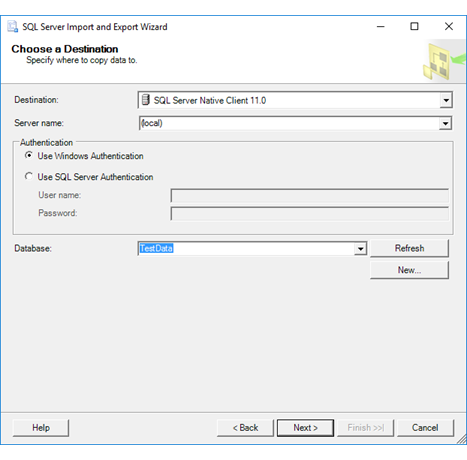
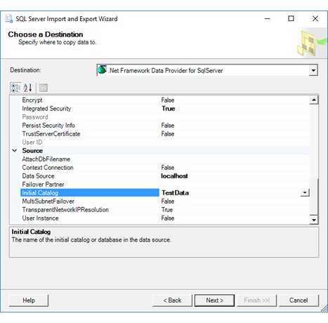
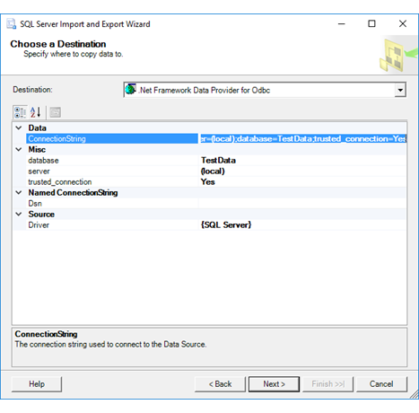
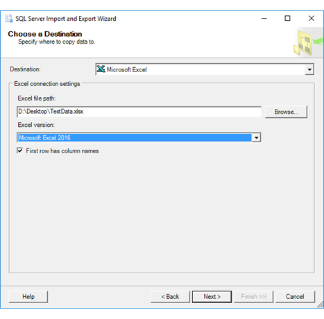
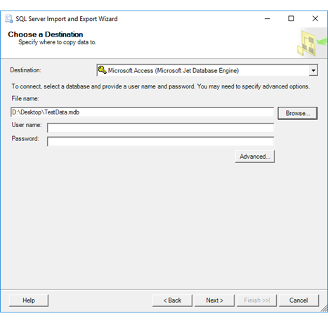
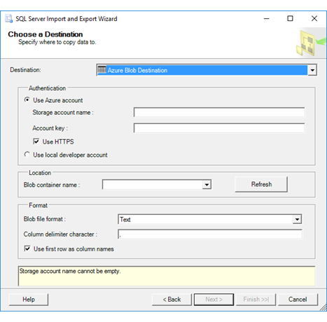

# Ziel ausw&#228;hlen (SQL Server-Import/Export-Assistent)
 Nachdem Sie Informationen zur Quelle Ihrer Daten bereitgestellt haben und darüber, wie Sie eine Verbindung mit ihnen herstellen, zeigt der [!INCLUDE[ssNoVersion](../../includes/ssnoversion-md.md)]-Import/Export-Assistent **Ziel auswählen** an. Auf dieser Seite geben Sie Informationen zum Ziel für Ihre Daten an und dazu, wie Sie eine Verbindung damit herstellen.
  
Weitere Informationen zu Datenzielen, die Sie verwenden können, finden Sie unter [Welche Datenquellen und Ziele kann ich verwenden?](Import%20and%20Export%20Data%20with%20the%20SQL%20Server%20Import%20and%20Export%20Wizard.md\#wizardSources). 

## Screenshot der Zielseite
Der folgende Screenshot zeigt den ersten Teil der Seite **Ziel auswählen** des Assistenten an.

## Ziel auswählen
 **Ziel**  
 Geben Sie das Ziel durch Auswählen eines Datenanbieters an, der Daten in das Ziel importieren kann. In den meisten Fällen ergibt sich der Datenanbieter, den Sie benötigen, aus seinem Namen, da der Name des Datenanbieters den Namen des Ziels enthält, z. B. SQL Server, Oracle, Flatfiles, Excel und Access.
 
Die Liste der verfügbaren Anbieter in der Liste **Ziel** hängt von den auf Ihrem Computer installierten Anbietern ab. Es ist auch davon abhängig, ob Sie den 64-Bit- oder den 32-Bit-Assistenten ausführen.

Möglicherweise sind für das Ziel mehrere Anbieter verfügbar. In der Regel können Sie alle Anbieter auswählen, die für Ihr Ziel verwendet werden können. Sie können z.B. [!INCLUDE[ssNoVersion](../../includes/ssnoversion-md.md)] Native Client, den .NET Framework-Datenanbieter für SQL Server oder den .Microsoft OLE DB-Anbieter für SQL Server verwenden, um eine Verbindung mit Microsoft [!INCLUDE[ssNoVersion](../../includes/ssnoversion-md.md)] herzustellen.
 
In einigen Fällen müssen Sie zunächst einen generischen Datenanbieter auswählen. Wenn Sie beispielsweise über einen ODBC-Treiber für Ihr Ziel verfügen, wählen Sie den .NET Framework-Datenanbieter für ODBC aus.

Für einige Ziele müssen Sie möglicherweise den Datenanbieter von Microsoft oder von einem Drittanbieter herunterladen. Weitere Informationen zu Datenzielen, die Sie verwenden können, finden Sie unter [Welche Datenquellen und Ziele kann ich verwenden?](Import%20and%20Export%20Data%20with%20the%20SQL%20Server%20Import%20and%20Export%20Wizard.md\#wizardSources).

## Nachdem Sie ein Ziel ausgewählt haben
Nach der Auswahl eines Ziels stehen Ihnen auf der Seite **Ziel auswählen** verschiedene Optionen zur Verfügung, die vom Datenanbieter abhängig sind, den Sie auswählen.

In den folgenden Abschnitten werden die wichtigen Optionen für einige häufig verwendete Ziele aufgeführt. Nicht alle Ziele, die in der Dropdownliste **Ziel** verfügbar sind, werden hier aufgeführt. Weitere Informationen und Angaben zu anderen Anbietern finden Sie in den entsprechenden Dokumentationen zu den Anbietern.

> [!TIP] Wenn Ihr Ziel eine Verbindungszeichenfolge erfordert, finden Sie Beispiele dafür auf der Drittanbieterseite – [The Connection Strings Reference](https://www.connectionstrings.com/) (Die Verbindungszeichenfolgen-Referenz).  

## Microsoft SQL Server 

Wenn Sie eine neue SQL Server-Datenbank als Ziel erstellen möchten, wählen Sie SQL Server Native Client oder den Microsoft OLE DB-Anbieter für SQL Server. Wenn Sie den .NET Framework-Datenanbieter für SQL Server auswählen, ist die Option zum erstellen einer neuen Datenbank nicht verfügbar.  

### Herstellen einer Verbindung zu SQL Server mit SQL Server Native Client oder dem Microsoft OLE DB-Anbieter für SQL Server  

SQL Server Native Client und der Microsoft OLE DB-Anbieter für SQL Server bieten die gleichen Optionen. Der folgende Screenshot zeigt die Optionen für SQL Server Native Client als Beispiel.

 **Servername**  
 Geben Sie den Namen oder die IP-Adresse des Zielservers ein, oder wählen Sie einen Server aus der Liste aus.  
  
> [!NOTE] Wenn Sie sich in einem Netzwerk mit mehreren Servern befinden, kann es einfacher sein, den Servernamen einzugeben. Wenn Sie auf die Dropdownliste klicken, dauert es möglicherweise einige Zeit, das Netzwerk nach allen verfügbaren Servern abzufragen, und Ihr Servername ist möglicherweise nicht in den Ergebnissen aufgelistet.  
 
 Um einen nicht standardmäßigen TCP-Port einzurichten, geben Sie ein Komma nach dem Servernamen oder der IP-Adresse ein, und geben Sie dann die Portnummer ein.
 
 **Windows-Authentifizierung verwenden**  
 Gibt an, ob der Assistent die [!INCLUDE[msCoName](../../includes/msconame-md.md)] Windows-Authentifizierung verwenden soll, um sich bei der Datenbank anzumelden. Die Windows-Authentifizierung wird empfohlen.  
  
 **SQL Server-Authentifizierung verwenden**  
 Gibt an, ob das Paket die [!INCLUDE[ssNoVersion](../../includes/ssnoversion-md.md)]-Authentifizierung verwenden soll, um sich bei der Datenbank anzumelden. Wenn Sie die [!INCLUDE[ssNoVersion](../../includes/ssnoversion-md.md)] -Authentifizierung verwenden, müssen Sie einen Benutzernamen und ein Kennwort angeben.  
  
 **Benutzername**  
 Geben Sie einen Benutzernamen für die Datenbankverbindung an, wenn Sie die [!INCLUDE[ssNoVersion](../../includes/ssnoversion-md.md)]-Authentifizierung verwenden.  
  
 **Kennwort**  
 Geben Sie das Kennwort für die Datenbankverbindung ein, wenn Sie die [!INCLUDE[ssNoVersion](../../includes/ssnoversion-md.md)]-Authentifizierung verwenden.  
  
 **Datenbank**  
 Wählen Sie eine Datenbank aus der Liste der Datenbanken für die angegebene Instanz von [!INCLUDE[ssNoVersion](../../includes/ssnoversion-md.md)] aus.  
  
 **Aktualisieren**  
 Klicken Sie auf **Aktualisieren**, um die Liste der verfügbaren Datenbanken zu aktualisieren.  
  
### Herstellen einer Verbindung zu SQL Server mit dem .NET Framework-Datenanbieter für SQL Server 

Auf dieser Seite wird eine gruppierte Liste von Optionen für den [!INCLUDE[dnprdnshort](../../includes/dnprdnshort-md.md)]-Datenanbieter für [!INCLUDE[ssNoVersion](../../includes/ssnoversion-md.md)] angezeigt. Hier werden die wichtigen Optionen aufgeführt. Die zusätzlichen Optionen, die beim Auswählen dieses Anbieters aufgeführt werden, sind nicht erforderlich, um erfolgreich eine Verbindung mit der [!INCLUDE[ssNoVersion](../../includes/ssnoversion-md.md)]-Zieldatenbank herzustellen. 

Weitere Informationen finden Sie unter [.NET Framework Data Provider for SQL Server connection strings](https://www.connectionstrings.com/sqlconnection/) (.NET Framework-Datenanbieter für SQL Server-Verbindungszeichenfolgen).

  
 **Ziel**  
 Geben Sie den Namen oder die IP-Adresse des Zielservers ein, oder wählen Sie einen Server aus der Liste aus.  
  
> [!NOTE] Wenn Sie sich in einem Netzwerk mit mehreren Servern befinden, kann es einfacher sein, den Servernamen einzugeben. Wenn Sie auf die Dropdownliste klicken, dauert es möglicherweise einige Zeit, das Netzwerk nach allen verfügbaren Servern abzufragen, und Ihr Servername ist möglicherweise nicht in den Ergebnissen aufgelistet.  
 
 Um einen nicht standardmäßigen TCP-Port einzurichten, geben Sie ein Komma nach dem Servernamen oder der IP-Adresse ein, und geben Sie dann die Portnummer ein.
 
 **Anfangskatalog**  
 Geben Sie den Namen der Zieldatenbank ein, oder wählen Sie eine Datenbank aus der Liste aus.  
  
 **Integrierte Sicherheit**  
 Geben Sie **TRUE** an, um eine Verbindung mithilfe der integrierten Windows-Authentifizierung herzustellen, oder **FALSE**, um mithilfe der [!INCLUDE[ssNoVersion](../../includes/ssnoversion-md.md)]-Authentifizierung eine Verbindung herzustellen. Wenn Sie **FALSE** angeben, müssen Sie eine Benutzer-ID und ein Kennwort eingeben. Der Standardwert ist **False**.  
  
 **Benutzer-ID**  
 Geben Sie einen Benutzernamen für die Datenbankverbindung an, wenn Sie die [!INCLUDE[ssNoVersion](../../includes/ssnoversion-md.md)]-Authentifizierung verwenden.  
  
 **Kennwort**  
 Geben Sie das Kennwort für die Datenbankverbindung ein, wenn Sie die [!INCLUDE[ssNoVersion](../../includes/ssnoversion-md.md)]-Authentifizierung verwenden.  

## Oracle

Stellen Sie eine Verbindung mit Oracle her, indem Sie den .NET Framework-Datenanbieter für Oracle oder den Microsoft OLE DB-Anbieter für Oracle verwenden. Der .NET Framework-Datenanbieter für Oracle ist einfacher zu konfigurieren und wird im folgenden Screenshot dargestellt.

Weitere Informationen finden Sie unter [.NET Framework Data Provider for Oracle connection strings](https://www.connectionstrings.com/net-framework-data-provider-for-oracle/) (.NET Framework-Datenanbieter für Oracle-Verbindungszeichenfolgen) oder [Microsoft OLE DB Provider for Oracle connection strings](https://www.connectionstrings.com/microsoft-ole-db-provider-for-oracle-msdaora/) (Microsoft OLE DB-Anbieter für Oracle-Verbindungszeichenfolgen).

## ODBC-Ziele

Wählen Sie zum Speichern von Daten in einem Ziel, das einen ODBC-Treiber bereitstellt, den .NET Framework-Datenanbieter für ODBC aus.

Lesen Sie die Dokumentation für den ODBC-Treiber, den Sie verwenden möchten, oder sehen Sie sich Beispiele unter [The Connection Strings Reference](https://www.connectionstrings.com/) (Die Verbindungszeichenfolgen-Referenz) an, um eine Verbindungszeichenfolge für ein ODBC-Ziel bereitzustellen. 

Der folgende Screenshot zeigt eine ODBC-Verbindung zu SQL Server als Beispiel. Folgende Verbindungszeichenfolge wird im Beispiel verwendet:

    Driver={SQL Server};Server=(local);Database=TestData;Trusted_Connection=Yes;

Nach der Eingabe der Verbindungszeichenfolge im Feld **ConnectionString**, analysiert der Assistent die Zeichenfolge und zeigt die einzelnen Eigenschaften und deren Werte im Abschnitt **Verschiedenes** der Liste an.

 ## Textdateien (Flatfiles)
 
  

**Dateiname**  
 Geben Sie den Pfad und den Dateinamen für die Datei an, in der die Daten gespeichert werden sollen. Klicken Sie alternativ auf **Durchsuchen**, um nach einer Datei zu suchen.  
  
 **Durchsuchen**  
 Suchen Sie nach einer Datei mithilfe des Dialogfelds **Öffnen**.  
  
 **Gebietsschema**  
 Geben Sie die Gebietsschema-ID (LCID) an, die die Sortierreihenfolge für Zeichen und das Datums- und Zeitformat definiert.  
  
 **Unicode**  
 Gibt an, ob Unicode verwendet werden soll. Wenn Sie Unicode verwenden, brauchen Sie keine Codepage anzugeben.  
  
 **Codepage**  
 Geben Sie die Codepage für die Sprache an, die Sie verwenden möchten.  
  
 **Format**  
 Gibt an, ob die Datei Formatierung mit Trennzeichen, fester Breite oder rechtem Flatterrand verwendet.  
  
|Wert|Description|  
|-----------|-----------------|  
|Mit Trennzeichen|Spalten werden mit einem Trennzeichen getrennt.|  
|Feste Breite|Spalten haben eine feste Breite.|  
|Rechter Flatterrand|Bei Dateien mit rechtem Flatterrand weisen alle Spalten mit Ausnahme der letzten eine feste Breite auf. Die letzte Spalte wird durch das Zeilentrennzeichen begrenzt.|  
  
 **Textqualifizierer**  
 Geben Sie die zu verwendenden Textqualifizierer ein. Sie können z. B. angeben, dass jede Textspalte in Anführungszeichen eingeschlossen werden soll.  
  
 **Spaltennamen in der ersten Datenzeile**  
 Gibt an, ob die Spaltennamen in der ersten Datenzeile angezeigt werden.  
 
 ## Microsoft Excel

>  **Video**: Eine häufige Verwendung des Assistenten ist das Exportieren von Daten nach Excel. Hier finden Sie ein vierminütiges YouTube-Video, das Ihnen den Ablauf mit klaren und einfachen Anweisungen erklärt. [Mithilfe des SQL Server-Import/Export-Assistenten nach Excel importieren](https://go.microsoft.com/fwlink/?linkid=829049) (Das Video verwendet [!INCLUDE[ssNoVersion_md](../../includes/ssnoversion-md.md)] 2012)

Der folgende Screenshot zeigt eine Beispielverbindung mit einer Microsoft Excel-Arbeitsmappe.

 
 
 **Excel-Dateipfad**  
 Geben Sie den Pfad und den Dateinamen für die Kalkulationstabelle an, zu der die Daten exportiert werden sollen. Beispielsweise **C:\\MyData.xlsx** für eine Datei auf dem lokalen Computer oder **\\\\Sales\\Database\\Northwind.xlsx** für eine Datei auf einer Netzwerkfreigabe. Oder klicken Sie auf **Durchsuchen**.   
  
 **Durchsuchen**  
 Suchen Sie die Kalkulationstabelle mithilfe des Dialogfelds **Öffnen**.  

> [!NOTE] Der Assistent kann keine kennwortgeschützte Excel-Datei öffnen.

 **Excel-Version**  
Wählen Sie die Version von Excel aus, die von der Zielarbeitsmappe verwendet wird.  

Sie müssen möglicherweise zusätzliche Dateien herunterladen und installieren, um eine Verbindung mit der Excel-Version herzustellen, die Sie auswählen. Weitere Informationen finden Sie im Abschnitt [Benötigte Downloads für Excel und Access](Choose%20a%20Data%20Source%20\%28SQL%20Server%20Import%20and%20Export%20Wizard%29.md\#officeDownloads) auf dieser Seite.

Wenn ein Problem bei der Angabe einer Version auftritt – z.B. wenn Sie Access 2016 Runtime nicht installieren können, da Sie über Microsoft Office 365 verfügen – versuchen Sie, eine andere Version anzugeben, auch eine frühere, z.B. 2013 statt 2016.

**Erste Zeile enthält Spaltennamen**  
Diese Option scheint keine Auswirkung für ein Excel-Ziel zu haben. Wenn das Ziel nicht über Spaltennamen verfügt, gibt der Treiber keine Spaltennamen aus, auch wenn diese Option aktiviert ist. Intern verwendet der Assistent F1, F2 usw. als temporäre Spaltenüberschriften.
 
## Microsoft Access  

Der folgende Screenshot zeigt eine Beispielverbindung zu einer Microsoft Access-Datenbank.

 **Dateiname**  
 Geben Sie den Pfad und den Dateinamen für die Datenbankdatei an, zu der die Daten exportiert werden sollen. Beispiel: **C:\MyData.mdb, \\\Sales\Database\Northwind.mdb**. Oder klicken Sie auf **Durchsuchen**.
 
 >   [!NOTE] Der Assistent kann nur eine Verbindung mit einer Access-Datenbank im MDB-Dateiformat herstellen.  
  
 **Durchsuchen**  
 Suchen Sie die Datenbankdatei mithilfe des Dialogfelds **Öffnen**.  
  
 **Benutzername**  
Wenn der Datenbank eine Informationsdatei für die Arbeitsgruppe zugeordnet ist, geben Sie einen gültigen Benutzernamen für die Datenbankverbindung an.  
  
 **Kennwort**  
Geben Sie das Kennwort des Benutzers für die Datenbankverbindung an, wenn der Datenbank eine Informationsdatei für die Arbeitsgruppe zugeordnet ist.

Wenn die Datenbank mit einem einzigen Kennwort für alle Benutzer gesichert ist, stellen Sie diesen Wert im Dialogfeld **Datenlinkeigenschaften** bereit. Klicken Sie auf **Erweitert**, um das Dialogfeld **Datenlinkeigenschaften** zu öffnen.    
  
 **Erweitert**  
Mithilfe des Dialogfelds **Datenlinkeigenschaften** geben Sie erweiterte Optionen an, z.B. das Datenbankkennwort oder eine nicht standardmäßige Informationsdatei für Arbeitsgruppen.  
  
## Benötigte Downloads für Excel und Access  
Sie müssen möglicherweise die Konnektivitätskomponenten für Microsoft Excel und Access-Datenquellen herunterladen, wenn diese nicht bereits installiert sind.

Spätere Versionen der Komponenten dienen zum Öffnen von Dateien, die in früheren Versionen des Programms erstellt wurden. Spätere Versionen der Komponenten dienen zum Öffnen von Dateien, die in früheren Versionen der Programme erstellt wurden.  
  
Wenn der Computer über eine 32-Bit-Version von Office verfügt, müssen Sie die 32-Bit-Versionen der Komponenten installieren. Sie müssen auch sicherstellen, dass Sie den Assistenten (oder das Integration Services-Paket, das erstellt wird) im 32-Bit-Modus ausführen. 
 |Microsoft Office-Version|Herunterladen|  
|------------------------------|--------------|  
|2007|[2007 Office System-Treiber: Datenkonnektivitätskomponenten](https://www.microsoft.com/download/details.aspx?id=23734)|  
|2010|[Microsoft Access 2010-Runtime](https://www.microsoft.com/download/details.aspx?id=10910)|  
|2013|[Microsoft Access 2013-Runtime](http://www.microsoft.com/download/details.aspx?id=39358)|  
|2016|[Microsoft Access 2016-Runtime](https://www.microsoft.com/download/details.aspx?id=50040)|  
 
## Azure Blob-Speicher  
Um das Azure-BLOB-Ziel zu verwenden, müssen Sie das Azure-Feature Pack für SSIS installieren. Weitere Informationen finden Sie unter [Azure Feature Pack für Integration Services &#40;SSIS&#41;](../../integration-services/azure-feature-pack-for-integration-services-ssis.md).  

>   [!NOTE] Um sicherzustellen, dass der Azure Storage-Verbindungs-Manager und die Komponenten, die ihn verwenden, einschließlich des Blob-Ziels, sowohl Verbindungen mit allgemeinen Speicherkonten als auch Blobspeicherkonten herstellen können, stellen Sie sicher, dass Sie die neueste Version von Azure Feature Pack [hier](https://www.microsoft.com/download/details.aspx?id=49492) herunterladen. Weitere Informationen zu diesen beiden Typen von Speicherkonten finden Sie unter [Einführung in Microsoft Azure Storage](https://azure.microsoft.com/en-us/documentation/articles/storage-introduction/#general-purpose-storage-accounts).

**Azure-Konto verwenden**  
Geben Sie an, ob ein Onlinekonto verwendet werden soll.

 **Speicherkontoname**  
 Geben Sie den Namen des Azure-Speicherkontos an.  
  
 **Kontoschlüssel**  
 Geben Sie den Schlüssel für das Azure-Speicherkonto an.  
  
 **HTTPS verwenden**  
 Geben Sie an, ob die Verbindung mit dem Speicherkonto über HTTP oder HTTPS hergestellt werden soll.  
  
 **Lokales Entwicklerkonto verwenden**  
 Geben Sie an, ob der Speicheremulator auf dem lokalen Computer verwendet werden soll.  
  
 **Blob-Containername**  
 Treffen Sie eine Auswahl aus der Liste der im angegebenen Speicherkonto verfügbaren Speichercontainer.  
  
 **Blob-Dateiformat**  
 Wählen Sie das Dateiformat „Text“ oder „Avro“ aus.  
  
 **Spaltentrennzeichen**  
 Wenn Sie das Format „Text“ ausgewählt haben, geben Sie das Spaltentrennzeichen an.  
  
 **Erste Zeile als Spaltennamen verwenden**  
 Geben Sie an, ob die erste Zeile der Daten Spaltennamen enthält.  

## Wie geht es weiter?  
 Nachdem Sie Informationen zum Ziel Ihrer Daten und darüber, wie Sie eine Verbindung mit ihnen herstellen, bereitgestellt haben, rufen Sie die Seite **Tabelle kopieren oder Datenbank abfragen (SQL Server-Import/Export-Assistent)** auf. Auf dieser Seite geben Sie an, ob eine gesamte Tabelle oder nur bestimmte Zeilen kopiert werden sollen. Weitere Informationen finden Sie unter [Tabelle kopieren oder Datenbank abfragen (SQL Server-Import/Export-Assistent)](../../integration-services/import-export-data/specify-table-copy-or-query-sql-server-import-and-export-wizard.md).  
