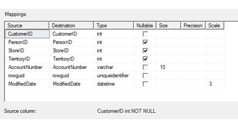

# Spaltenzuordnungen (SQL Server-Import/Export-Assistent)
  Nachdem Sie die zu kopierenden vorhandenen Tabellen und Ansichten ausgewählt oder die von Ihnen angegebene Abfrage überprüft und danach auf **Zuordnungen bearbeiten** geklickt haben, wird im [!INCLUDE[ssNoVersion](../../includes/ssnoversion-md.md)]-Import/Export-Assistent das Dialogfeld **Spaltenzuordnungen** angezeigt. Auf dieser Seite können Sie die Zielspalten für die zu kopierenden Daten angeben und konfigurieren.  
 
## Screenshot der Seite „Spaltenzuordnungen“ 
 Der folgende Screenshot zeigt das Dialogfeld **Spaltenzuordnungen** des Assistenten. 
 
 In diesem Beispiel erstellt der Assistent eine neue Zieltabelle, weil **Zieltabelle erstellen** ausgewählt ist. Standardmäßig hat jede Spalte in der neuen Zieltabelle den gleichen Namen, Datentyp und die gleichen Eigenschaften wie die zugehörige Quellspalte. 
  
   
  
## Bestätigen der Quelle und des Ziels  
 **Quelle**  
 Identifiziert die ausgewählte Quelltabelle, -sicht oder -abfrage.  
  
 **Ziel**  
 Identifiziert die ausgewählte Zieltabelle oder -sicht  

## Erstellen einer neuen Zieltabelle
 **Create destination table/file** (Zieltabelle/-datei erstellen)  
 Erstellen Sie die Zieltabelle, falls diese noch nicht vorhanden ist.    
  
 **SQL bearbeiten**  
Klicken Sie auf **SQL bearbeiten**, um das Dialogfeld **SQL-Anweisung CREATE TABLE** zu öffnen. Verwenden Sie die Standardanweisung CREATE TABLE, oder passen Sie sie an Ihre Anforderungen an. Wenn Sie diese Anweisung manuell ändern, müssen Sie sicherstellen, dass die Liste der Spaltenzuordnungen die Änderung erkennt. Weitere Informationen finden Sie unter [SQL-Anweisung CREATE TABLE](../../integration-services/import-export-data/create-table-sql-statement-sql-server-import-and-export-wizard.md).  
  
 > [!TIP] Wenn Sie auf der Seite **Quelltabellen und -sichten auswählen** eine neue Zieltabelle angegeben, wird die Option **Zieltabelle erstellen** automatisch ausgewählt, und die Schaltfläche **SQL bearbeiten** wird aktiviert. Wenn Sie andernfalls die Zieltabelle erstellen möchten, müssen Sie zurück zur Seite **Quelltabellen und -sichten auswählen** wechseln und dort den Namen einer **neuen** Tabelle in der **Ziel**-Spalte eingeben.
>
> Wenn die Option **Zieltabelle erstellen** und die Schaltfläche **SQL bearbeiten** auf der Seite **Spaltenzuordnungen** deaktiviert sind, wechseln Sie zurück zur Seite **Quelltabellen und -sichten auswählen** und geben den Namen einer **neuen** Tabelle in der **Ziel**-Spalte ein. Nachdem Sie eine oder mehrere neue Zieltabellen angegeben und auf **Weiter** geklickt haben, wird die Option **Zieltabelle erstellen** automatisch ausgewählt, und die Schaltfläche **SQL bearbeiten** wird auf der Seite **Spaltenzuordnungen** aktiviert. Wählen Sie **SQL bearbeiten** aus, um das Dialogfeld **SQL-Anweisung CREATE TABLE** anzuzeigen.  

## Angeben von Optionen für vorhandene Daten im Ziel
 **Delete rows in destination table/file** (Zeilen in Zieltabelle/-datei löschen)  
 Geben Sie an, ob die Daten aus einer vorhandenen Tabelle gelöscht werden sollen, bevor neue Daten geladen werden.  
  
 **Append rows to destination table/file** (Zeilen an Zieltabelle/-datei anfügen)  
 Geben Sie an, ob die neuen Daten an die in der Tabelle bereits enthaltenen Daten angefügt werden sollen.  
  
 **Zieltabelle löschen und erneut erstellen**  
 Wählen Sie diese Option aus, um die Zieltabelle zu überschreiben. Diese Option ist nur verfügbar, wenn Sie den Assistenten verwenden, um die Zieltabelle zu erstellen. Die Zieltabelle wird nur gelöscht und erneut erstellt, wenn Sie das vom Assistenten erstellte Paket speichern und anschließend erneut ausführen. Dabei handelt es sich um eine praktische Option, wenn Sie Ihre Einstellungen mehr als einmal testen möchten.
  
 **IDENTITY_INSERT aktivieren**  
 Wählen Sie diese Option aus, damit vorhandene IDENTITY-Werte in den Quelldaten in eine IDENTITY-Spalte in der Zieltabelle eingefügt werden können. In der Standardeinstellung ist dies für die Identity-Zielspalte nicht zulässig.  
  
> [!TIP] Wenn Ihre vorhandenen Primärschlüssel in einer Identity-Spalte, einer automatisch nummerierten Spalte oder einem Äquivalent enthalten sind, müssen Sie diese Option auswählen, um die vorhandenen Primärschlüsselwerte beizubehalten.  Andernfalls weist die Identity-Zielspalte in der Regel neue Werte zu.  

## Überprüfen von Spaltenzuordnungen und Zieldatentypen 
 **Zuordnungen**  
 Zeigt an wie jede Spalte in der Datenquelle einer Spalte im Ziel zugeordnet wird.
 
 Wählen Sie in der **Ziel**-Spalte **ignore** für die Spalten aus, die Sie nicht kopieren möchten. Sie müssen nicht alle Spalten in einer Tabelle kopieren.  
 
 
  
 Die Liste **Zuordnungen** enthält die folgenden Spalten.  
  
-    **Quelle**  
     Zeigen Sie jede Quellspalte, für die Sie bei Bedarf Konvertierungseinstellungen angeben können.  
  
-   **Ziel**  
    Zeigen Sie die zugeordnete Zielspalte an, oder wählen Sie eine andere Spalte aus.
    
    Geben Sie an, ob eine Spalte während des Kopiervorgangs ignoriert werden soll. Sie können nur eine Teilmenge von Spalten kopieren, indem Sie in dieser Spalte **ignore** für Spalten auswählen, die ausgelassen werden sollen. Bevor Sie Spalten zuordnen, müssen Sie alle Spalten ignorieren, die nicht zugeordnet werden.  
  
-   **Typ**  
    Zeigen Sie den Datentyp für die Zielspalte an, oder wählen Sie einen anderen Datentyp aus.
  
-   **NULL zulassen**  
    Geben Sie an, ob die Zielspalte NULL-Werte zulässt.  
  
-   **Größe**  
    Geben Sie ggf. die Anzahl der Zeichen in der Zielspalte an.  
  
-    **Genauigkeit**  
    Geben Sie ggf. die Genauigkeit der numerischen Daten in der Zielspalte über die Anzahl von Stellen an.  
  
 -   **Dezimalstellen**  
    Geben Sie ggf. die Dezimalstellen der numerischen Daten in der Zielspalte an.  
  
## Wie geht es weiter?  
 Nachdem Sie Zielspalten für die zu kopierenden Daten angegeben und konfiguriert und auf **OK** geklickt haben, leitet Sie das Dialogfeld **Spaltenzuordnungen** zurück zur Seite **Quelltabellen und -sichten auswählen** oder zur Seite **Flatfileziel konfigurieren**. Weitere Informationen finden Sie unter [Quelltabellen und -sichten auswählen](../../integration-services/import-export-data/select-source-tables-and-views-sql-server-import-and-export-wizard.md) oder [Flatfileziel konfigurieren](../../integration-services/import-export-data/configure-flat-file-destination-sql-server-import-and-export-wizard.md).  
  
 Wenn Sie eine Zuordnung festgelegt haben, die nicht erfolgreich in die Liste **Zuordnungen** übernommen werden kann, leitet Sie das Dialogfeld **Spaltenzuordnungen** zur Seite **Datentypzuordnung überprüfen** um. Auf dieser Seite können Sie die Warnungen überprüfen, Konvertierungsoptionen angeben und außerdem festlegen, wie Fehler behandelt werden sollen. Weitere Informationen finden Sie unter [Datentypzuordnung überprüfen](../../integration-services/import-export-data/review-data-type-mapping-sql-server-import-and-export-wizard.md).  
 
 ## Siehe auch
[Zuordnung von Datentypen mit dem SQL Server-Import/Export-Assistenten](../../integration-services/import-export-data/data-type-mapping-in-the-sql-server-import-and-export-wizard.md)
