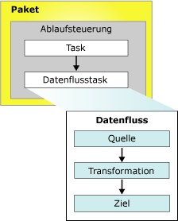

# Integration Services-Pakete (SSIS)
  Bei einem Paket handelt es sich um eine organisierte Auflistung von Verbindungen, Ablaufsteuerungselementen, Datenflusselementen, Ereignishandlern, Variablen, Parametern und Konfigurationen, die Sie entweder mit den grafischen Designtools von [!INCLUDE[ssNoVersion](../includes/ssnoversion-md.md)] [!INCLUDE[ssISnoversion](../includes/ssisnoversion-md.md)] oder programmgesteuert erstellen.  Sie speichern dann das fertige Paket in [!INCLUDE[ssNoVersion](../includes/ssnoversion-md.md)], dem [!INCLUDE[ssIS](../includes/ssis-md.md)] -Paketspeicher oder im Dateisystem, oder Sie können das ssISnoversion-Projekt auf dem Server [!INCLUDE[ssIS](../includes/ssis-md.md)] bereitstellen. Das Paket ist jene Arbeitseinheit, die abgerufen, ausgeführt und gespeichert wird.  
  
 Wenn Sie ein Paket erstellen, ist es zunächst ein leeres Objekt ohne Funktionalität. Um einem Paket Funktionalität hinzuzufügen, fügen Sie ihm eine Ablaufsteuerung und optional mindestens einen Datenfluss hinzu.  
  
 Das folgende Diagramm zeigt ein einfaches Paket, das eine Ablaufsteuerung mit einem Datenflusstask enthält, der wiederum einen Datenfluss enthält.  
  
   
  
 Nachdem Sie das Basispaket erstellt haben, können Sie erweiterte Funktionen hinzufügen, wie z. B. Protokollierung und Variablen, um die Funktionalität des Pakets zu erweitern. Weitere Informationen finden Sie im Abschnitt zu Objekten, die die Paketfunktionalität erweitern.  
  
 Das fertige Paket kann anschließend konfiguriert werden. Legen Sie dazu Eigenschaften auf Paketebene fest, die die Sicherheit implementieren, das erneute Starten von Paketen an Prüfpunkten ermöglichen oder Transaktionen in den Paket-Workflow integrieren. Weitere Informationen finden Sie im Abschnitt zu Eigenschaften, die erweiterte Funktionen unterstützen.  
  
## Inhalt eines Pakets  
 **Tasks und Container (Ablaufsteuerung).** Eine Ablaufsteuerung besteht aus Tasks und Containern, die beim Ausführen des Pakets ausgeführt werden. Um die Reihenfolge zu steuern oder die Bedingungen zum Ausführen des nächsten Tasks oder Containers in der Paketablaufsteuerung zu definieren, verbinden Sie mithilfe von Rangfolgeneinschränkungen die Tasks und Container in einem Paket. Eine Teilmenge der Tasks und Container kann auch gruppiert und wiederholt als eine Einheit innerhalb der Paketablaufsteuerung ausgeführt werden. Weitere Informationen finden Sie unter [Control Flow](../integration-services/control-flow/control-flow.md).  
  
 **Datenquellen und Ziele (Datenfluss).** Ein Datenfluss besteht aus den Quellen und Zielen zum Extrahieren und Laden von Daten, den Transformationen zum Ändern und Erweitern von Daten sowie den Pfaden zum Verlinken von Quellen, Transformationen und Zielen. Bevor Sie einem Paket einen Datenfluss hinzufügen können, muss die Paketablaufsteuerung einen Datenflusstask einschließen. Der Datenflusstask ist die ausführbare Datei im [!INCLUDE[ssIS](../includes/ssis-md.md)] -Paket, das den Datenfluss erstellt, anordnet und ausführt. Eine separate Instanz des Datenflussmoduls wird für jeden Datenflusstask in einem Paket geöffnet. Weitere Informationen finden Sie unter [Data Flow Task](../integration-services/control-flow/data-flow-task.md) und [Data Flow](../integration-services/data-flow/data-flow.md).  
  
 **Verbindungs-Manager (Verbindungen).** Ein Paket schließt in der Regel mindestens einen Verbindungs-Manager ein. Ein Verbindungs-Manager ist ein Link zwischen einem Paket und einer Datenquelle, die die Verbindungszeichenfolge für den Zugriff auf die Daten definiert, die von den Tasks, Transformationen und Ereignishandlern im Paket verwendet wird. [!INCLUDE[ssISnoversion](../includes/ssisnoversion-md.md)] schließt Verbindungstypen für Datenquellen ein, wie z. B. Text- und XML-Dateien, relationale Datenbanken und [!INCLUDE[ssASnoversion](../includes/ssasnoversion-md.md)] -Datenbanken und -Projekte. Weitere Informationen finden Sie unter [Integration Services-Verbindungen &#40;SSIS&#41;](../integration-services/connection-manager/integration-services-ssis-connections.md).  
  
## Objekte, die die Paketfunktionalität erweitern  
 Pakete können zusätzliche Objekte einschließen, die erweiterte Funktionen bereitstellen oder vorhandene Funktionalität erweitern, wie z. B. Ereignishandler, Konfigurationen, Protokollierung und Variablen.  
  
### Ereignishandler  
 Ein Ereignishandler ist ein Workflow, der als Reaktion auf die Ereignisse ausgeführt wird, die von einem Paket, einem Task oder Container ausgelöst werden. Beispielsweise können Sie mit einem Ereignishandler den Speicherplatz überprüfen, wenn ein Ereignis vor der Ausführung oder ein Fehler auftritt, und eine E-Mail-Nachricht senden, um dem Administrator den verfügbaren Speicherplatz oder Fehlerinformationen zu melden. Ein Ereignishandler ist wie ein Paket aufgebaut, mit einer Ablaufsteuerung und optionalen Datenflüssen. Ereignishandler können einzelnen Tasks oder Containern im Paket hinzugefügt werden. Weitere Informationen finden Sie unter [Integration Services-Ereignishandler &#40;SSIS&#41;](../integration-services/integration-services-ssis-event-handlers.md).  
  
### Konfigurationen  
 Eine Konfiguration enthält Paare aus einer Eigenschaft und einem Wert, die die Eigenschaften des Pakets und der zugehörigen Tasks, Containers, Variablen, Verbindungen und Ereignishandler beschreiben, wenn das Paket ausgeführt wird. Mithilfe von Konfigurationen können Eigenschaften aktualisiert werden, ohne das Paket zu ändern. Wenn das Paket ausgeführt wird, werden die Konfigurationsinformationen geladen und die Eigenschaftswerte aktualisiert. Beispielsweise kann mit einer Konfiguration die Verbindungszeichenfolge der Verbindung aktualisiert werden.  
  
 Die Konfiguration wird gespeichert und mit dem Paket bereitgestellt, wenn das Paket auf einem anderen Computer installiert wird. Die Konfigurationswerte können aktualisiert werden, wenn das Paket installiert wird, damit das Paket in einer anderen Umgebung unterstützt wird. Weitere Informationen finden Sie unter [Erstellen von Paketkonfigurationen](../integration-services/packages/create-package-configurations.md).  
  
### Protokollierung und Protokollanbieter  
 Bei einem Protokoll handelt es sich um eine Auflistung von Informationen zu dem Paket, die beim Ausführen des Pakets gesammelt werden. Beispielsweise kann ein Protokoll die Start- und Beendigungszeit für die Ausführung eines Pakets bereitstellen. Ein Protokollanbieter definiert den Zieltyp und das Format, der bzw. das vom Paket und dessen Containern und Tasks zum Protokollieren von Laufzeitinformationen verwendet werden kann. Die Protokolle sind einem Paket zugeordnet, aber die Tasks und Container im Paket können Informationen in einem beliebigen Paketprotokoll protokollieren. [!INCLUDE[ssISnoversion](../includes/ssisnoversion-md.md)] enthält eine Reihe von integrierten Protokollanbietern für die Protokollierung. Beispielsweise enthält [!INCLUDE[ssISnoversion](../includes/ssisnoversion-md.md)] Protokollanbieter für [!INCLUDE[ssNoVersion](../includes/ssnoversion-md.md)] und Textdateien. Darüber hinaus können Sie benutzerdefinierte Protokollanbieter erstellen und zur Protokollierung verwenden. Weitere Informationen finden Sie unter [Integration Services-Protokollierung &#40;SSIS&#41;](../integration-services/performance/integration-services-ssis-logging.md).  
  
### Variablen  
 [!INCLUDE[ssISnoversion](../includes/ssisnoversion-md.md)] unterstützt Systemvariablen und benutzerdefinierte Variablen. Die Systemvariablen stellen nützliche Informationen zu Paketobjekten zur Laufzeit bereit, und mit benutzerdefinierten Variablen werden benutzerdefinierte Szenarios in Paketen unterstützt. Beiden Arten von Variablen können in Ausdrücken, Skripts und Konfigurationen verwendet werden.  
  
 Die Variablen auf Paketebene schließen die vordefinierten Systemvariablen ein, die für ein Paket verfügbar sind, und die benutzerdefinierten Variablen für den Paketbereich. Weitere Informationen finden Sie unter [Integration Services-Variablen (SSIS)](../integration-services/integration-services-ssis-variables.md).  
 
### Parameter  
 [!INCLUDE[ssISnoversion](../includes/ssisnoversion-md.md)] -Parametern können Sie Eigenschaften in Paketen zur Zeit der Paketausführung Werte zuweisen. Sie können *Projektparameter* auf Projektebene und *Paketparameter* auf Paketebene erstellen. Projektparameter werden verwendet, um jegliche externen Eingaben bereitzustellen, die das Projekt für ein oder mehrere Pakete im Projekt empfängt. Mit Paketparametern können Sie die Paketausführung ändern, ohne das Paket bearbeiten und erneut bereitstellen zu müssen. Weitere Informationen finden Sie unter [Integration Services-Parameter (SSIS)](../integration-services/integration-services-ssis-package-and-project-parameters.md).  
 
## Paketeigenschaften, die erweiterte Funktionen unterstützen  
 Das Paketobjekt kann so konfiguriert werden, dass Funktionen, wie z. B. das erneute Starten des Pakets an Prüfpunkten, das Signieren des Pakets mit einem digitalen Zertifikat, das Festlegen der Paketschutzebene und das Sicherstellen der Datenintegrität, mithilfe von Transaktionen unterstützt werden.  
  
### Erneutes Starten von Paketen  
 Das Paket schließt Prüfpunkteigenschaften ein, mit denen Sie das Paket neu starten können, wenn bei Tasks ein Fehler auftritt. Wenn z. B. ein Paket zwei Datenflusstasks aufweist, die zwei verschiedene Tabellen aktualisieren, und beim zweiten Task ein Fehler auftritt, kann das Paket erneut ausgeführt werden, ohne den ersten Datenflusstask zu wiederholen. Das erneute Starten eines Pakets kann bei zeitaufwändigen Paketen Zeit sparen. Neustart bedeutet, dass nicht das gesamte Paket erneut ausgeführt werden muss, sondern nur ab dem fehlerhaften Task. Weitere Informationen finden Sie unter [Restart Packages by Using Checkpoints](../integration-services/packages/restart-packages-by-using-checkpoints.md).  
  
### Sichern von Paketen  
 Ein Paket kann mit einer digitalen Signatur signiert und mit einem Kennwort oder Benutzerschlüssel verschlüsselt werden. Mit einer digitalen Signatur wird die Quelle des Pakets authentifiziert. Sie müssen jedoch auch [!INCLUDE[ssISnoversion](../includes/ssisnoversion-md.md)] konfigurieren, um die digitale Signatur zu überprüfen, wenn das Paket lädt. Weitere Informationen finden Sie unter [Identifizieren der Quelle von Paketen mit digitalen Signaturen](../integration-services/security/identify-the-source-of-packages-with-digital-signatures.md) und [Zugriffssteuerung für vertrauliche Daten in Paketen](../integration-services/security/access-control-for-sensitive-data-in-packages.md).  
  
### Unterstützen von Transaktionen  
 Durch das Festlegen eines Transaktionsattributs für ein Paket können Tasks, Container und Joins im Paket an der Transaktion teilnehmen. Transaktionsattribute stellen sicher, dass das Paket und die zugehörigen Elemente als eine Einheit erfolgreich ausgeführt werden bzw. einen Fehler erzeugen. Pakete können auch andere Pakete ausführen und andere Pakete für Transaktionen registrieren, damit Sie mehrere Pakete als eine einzelne Arbeitseinheit ausführen können. Weitere Informationen finden Sie unter [Integration Services-Transaktionen](../integration-services/integration-services-transactions.md).  
  
## Verfügbare benutzerdefinierte Protokolleinträge für Pakete  
 In der folgenden Tabelle werden die benutzerdefinierten Protokolleinträge für Pakete aufgelistet. Weitere Informationen finden Sie unter [Integration Services-Protokollierung &#40;SSIS&#41;](../integration-services/performance/integration-services-ssis-logging.md).  
  
|Protokolleintrag|Description|  
|---------------|-----------------|  
|**PackageStart**|Zeigt den Beginn der Paketausführung an.   Hinweis: Dieser Protokolleintrag wird automatisch in das Protokoll geschrieben. Dieser Eintrag kann nicht ausgeschlossen werden.|  
|**PackageEnd**|Zeigt den Abschluss der Paketausführung an.   Hinweis: Dieser Protokolleintrag wird automatisch in das Protokoll geschrieben. Dieser Eintrag kann nicht ausgeschlossen werden.|  
|**Diagnostic**|Enthält Informationen zur Systemkonfiguration, die sich auf die Paketausführung auswirken, wie z. B. die Anzahl ausführbarer Dateien, die gleichzeitig ausgeführt werden können.|  
  
## Festlegen der Eigenschaften eines Pakets  
 Eigenschaften können Sie im Fenster **Eigenschaften** von [!INCLUDE[ssBIDevStudioFull](../includes/ssbidevstudiofull-md.md)] oder programmgesteuert festlegen.  
  
 Informationen zum Festlegen dieser Eigenschaften mit [!INCLUDE[ssBIDevStudioFull](../includes/ssbidevstudiofull-md.md)]finden Sie unter [Festlegen von Paketeigenschaften](../integration-services/set-package-properties.md).  
  
 Weitere Informationen zum programmgesteuerten Festlegen dieser Eigenschaften finden Sie unter <xref:Microsoft.SqlServer.Dts.Runtime.Package>.  

## Wiederverwenden eines vorhandenen Pakets als Vorlage  
 Pakete werden häufig als Vorlagen zum Erstellen von Paketen verwendet, die gemeinsam eine Basisfunktionalität verwenden. Sie können das Basispaket erstellen und dann kopieren. Sie haben auch die Möglichkeit, das Paket als Vorlage festzulegen. Ein Paket, mit dem beispielsweise Dateien heruntergeladen und kopiert und dann die Daten extrahiert werden, kann die Tasks FTP und Dateisystem in einer Foreach-Schleife beinhalten, mit der Dateien in einem Ordner aufgezählt werden. Ebenso kann das Paket Verbindungs-Manager für Flatfiles für den Zugriff auf die Daten sowie Flatfilequellen zum Extrahieren der Daten beinhalten. Das Ziel der Daten variiert. Nach dem Kopieren aus dem Basispaket wird das Ziel jedem neuen Paket hinzugefügt. Sie können auch Pakete erstellen und diese als Vorlagen für die neuen Pakete verwenden, die Sie einem [!INCLUDE[ssISnoversion](../includes/ssisnoversion-md.md)] -Projekt hinzufügen. Weitere Informationen finden Sie unter [Create Packages in SQL Server Data Tools](../integration-services/create-packages-in-sql-server-data-tools.md).  
  
 Wenn ein Paket zum ersten Mal erstellt wird, entweder programmgesteuert oder mithilfe des SSIS-Designers, wird ein GUID (Globally Unique Indentifier) der **ID** -Eigenschaft und ein Name der **Name** -Eigenschaft hinzugefügt. Beim Erstellen eines neuen Pakets durch Kopieren eines vorhandenen Pakets oder mithilfe eines Vorlagenpakets werden Name und GUID ebenfalls kopiert. Dies kann problematisch werden, wenn Sie die Protokollierung verwenden, da der GUID und Name des Pakets in die Protokolle geschrieben werden, um das Paket zu identifizieren, zu dem die protokollierten Informationen gehören. Sie sollten daher den Namen und GUID der neuen Pakete aktualisieren, um diese von jenen Paketen zu unterscheiden, von denen sie kopiert wurden, und um in den Protokolldaten eine Unterscheidung untereinander zu ermöglichen.  
  
 Zum Ändern der Paket-GUID müssen Sie in **im Eigenschaftenfenster in der** ID [!INCLUDE[ssBIDevStudioFull](../includes/ssbidevstudiofull-md.md)]-Eigenschaft eine GUID neu generieren. Zum Ändern des Paketnamens können Sie im Eigenschaftenfenster den Wert der **Name** -Eigenschaft aktualisieren. Sie können auch die **dtutil** -Eingabeaufforderung verwenden oder die GUID und Namen programmgesteuert aktualisieren. Weitere Informationen finden Sie unter [Festlegen von Paketeigenschaften](../integration-services/set-package-properties.md) und [dtutil (Hilfsprogramm)](../integration-services/dtutil-utility.md).  
  
## Related Tasks  
 [!INCLUDE[ssISnoversion](../includes/ssisnoversion-md.md)] schließt neben dem [!INCLUDE[ssIS](../includes/ssis-md.md)] -Objektmodell zum Erstellen von Paketen zwei grafische Tools ein, den [!INCLUDE[ssNoVersion](../includes/ssnoversion-md.md)] -Designer und den [!INCLUDE[ssIS](../includes/ssis-md.md)] -Import/Export-Assistenten. Weitere Informationen finden Sie in den folgenden Themen:  
  
-   [Importieren und Exportieren von Daten mit dem SQL Server-Import/Export-Assistenten](../integration-services/import-export-data/import-and-export-data-with-the-sql-server-import-and-export-wizard.md)  
  
-   [Erstellen von Paketen in SQL Server-Datentools](../integration-services/create-packages-in-sql-server-data-tools.md)  
  
-   Weitere Informationen finden Sie unter [Programmgesteuertes Erstellen von Paketen](../integration-services/building-packages-programmatically/building-packages-programmatically.md) im Entwicklerhandbuch. 
  
  
