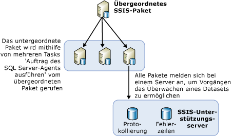

# Lastenausgleich von Paketen auf Remoteservern mithilfe des SQL Server-Agents
  Müssen viele Pakete ausgeführt werden, ist es praktisch, hierfür andere verfügbare Server zu verwenden. Diese Methode, bei der zum Ausführen von Paketen andere Server verwendet werden, während die Steuerung der Pakete über ein übergeordnetes Paket erfolgt, wird als Lastenausgleich bezeichnet. In [!INCLUDE[ssNoVersion](../../includes/ssnoversion-md.md)] [!INCLUDE[ssISnoversion](../../includes/ssisnoversion-md.md)]wird der Lastenausgleich manuell ausgeführt, wobei die Struktur des Verfahrens von den Besitzern der Pakete festgelegt werden muss. Dabei wird der Lastenausgleich nicht automatisch von den Servern ausgeführt. Des Weiteren müssen die auf den Remoteservern ausgeführten Pakete vollständige Pakete sein. Einzelne Tasks anderer Pakete sind dabei nicht zulässig.  
  
 Der Lastenausgleich ist in den folgenden Szenarien nützlich:  
  
-   Die Pakete können alle gleichzeitig ausgeführt werden.  
  
-   Die Pakete sind umfangreich, und wenn sie nacheinander ausgeführt werden, kann es sein, dass die Ausführung länger dauert als die zulässige Verarbeitungszeit.  
  
 Administratoren und Architekten können bestimmen, ob das Verwenden zusätzlicher Server zum Verarbeiten zur Verbesserung der Prozesse beiträgt.  
  
## Abbildung des Lastenausgleichs  
 Im folgenden Diagramm wird ein übergeordnetes Paket auf einem Server angezeigt. Das übergeordnete Paket enthält mehrere Tasks Auftrag des SQL Server-Agents ausführen. Mit jedem Task des übergeordneten Pakets wird ein SQL Server-Agent auf einem Remoteserver aufgerufen. Diese Remoteserver enthalten SQL Server-Agent-Aufträge, die einen Schritt für den Aufruf eines Pakets auf diesem Server beinhalten.  
  
   
  
 Die in dieser Architektur für den Lastenausgleich erforderlichen Schritte stellen keine neuen Konzepte dar. Der Lastenausgleich wird nämlich erreicht, indem vorhandene Konzepte und allgemeine SSIS-Objekte auf neue Art und Weise verwendet werden.  
  
## Ausführen von Paketen auf einer Remoteinstanz mithilfe des SQL Server-Agents  
 In der Basisarchitektur für die Remoteausführung von Paketen befindet sich auf der SQL Server-Instanz ein zentrales Paket, mit dem andere Remotepakete gesteuert werden. Im Diagramm wird dieses zentrale Paket, das so genannte übergeordnete SSIS-Paket, angezeigt. Die Instanz, in der sich dieses übergeordnete Paket befindet, steuert die Ausführung von SQL Server-Agent-Aufträgen, mit denen die untergeordneten Pakete ausgeführt werden. Dabei werden die untergeordneten Pakete nicht nach einem festen Zeitplan ausgeführt, der vom SQL Server-Agent auf dem Remoteserver gesteuert wird. Die untergeordneten Pakete werden stattdessen beim Aufruf über das übergeordnete Paket vom SQL Server-Agent gestartet und auf derselben SQL Server-Instanz ausgeführt, auf der sich der SQL Server-Agent befindet.  
  
 Bevor Sie mit dem SQL Server-Agent ein Remotepaket ausführen können, müssen Sie das übergeordnete Paket und die untergeordneten Pakete konfigurieren und die zum Steuern der untergeordneten Pakete verwendeten SQL Server-Agent-Aufträge festlegen. In den folgenden Abschnitten werden weitere Informationen zum Erstellen, Konfigurieren, Ausführen und Verwalten von auf Remoteservern ausgeführten Paketen bereitgestellt. Dieser Prozess beinhaltet die folgenden Schritte:  
  
-   Erstellen und Installieren der untergeordneten Pakete auf Remoteservern.  
  
-   Erstellen der SQL Server-Agent-Aufträge auf Remoteinstanzen, mit denen die Pakete ausgeführt werden.  
  
-   Erstellen des übergeordneten Pakets.  
  
-   Festlegen des Protokollierungsszenarios für die untergeordneten Pakete.  
  
## Implementierung von untergeordneten Paketen
  Wenn Sie mithilfe von [!INCLUDE[ssISnoversion](../../includes/ssisnoversion-md.md)]den Lastenausgleich implementieren, werden die untergeordneten Pakete auf anderen Servern installiert, um die verfügbare CPU bzw. die Serverzeit zu nutzen. Für das Erstellen und Ausführen der untergeordneten Pakete sind die folgenden Schritte erforderlich:  
  
-   Entwerfen der untergeordneten Pakete.  
  
-   Verschieben der Pakete auf den Remoteserver.  
  
-   Erstellen eines Auftrags des SQL Server-Agents auf dem Remoteserver, der einen Schritt zum Ausführen des untergeordneten Pakets enthält.  
  
-   Testen und Debuggen des Auftrags des SQL Server-Agents und der untergeordneten Pakete.  
  
 Beim Entwerfen der untergeordneten Pakete sind die Entwurfsmöglichkeiten unbegrenzt. Dabei können Sie jede beliebige Funktionalität verwenden. Beim Zugriff des Pakets auf die Daten müssen Sie jedoch sicherstellen, dass der Server, mit dem das Paket ausgeführt wird, auf die Daten zugreifen kann.  
  
 Um das übergeordnete Paket zu identifizieren, das untergeordnete Pakete ausführt, klicken Sie in [!INCLUDE[ssBIDevStudioFull](../../includes/ssbidevstudiofull-md.md)] mit der rechten Maustaste auf das Paket in Projektmappen-Explorer, und klicken Sie dann auf **Einstiegspunktpaket**.  
  
 Nach dem Entwerfen der untergeordneten Pakete werden diese im nächsten Schritt auf den Remoteservern bereitgestellt.  
  
### Verschieben des untergeordneten Pakets auf die Remoteinstanz  
 Es gibt mehrere Möglichkeiten zum Verschieben von Paketen auf andere Server. Es werden die folgenden zwei Methoden vorgeschlagen:  
  
-   Exportieren von Paketen mithilfe von [!INCLUDE[ssManStudioFull](../../includes/ssmanstudiofull-md.md)].  
  
-   Bereitstellen von Paketen durch Erstellen eines Bereitstellungshilfsprogramms für das Projekt, in dem die bereitzustellenden Pakete enthalten sind, und anschließendes Ausführen des Paketinstallations-Assistenten zum Installieren der Pakete im Dateisystem bzw. in einer Instanz von [!INCLUDE[ssNoVersion](../../includes/ssnoversion-md.md)]. Weitere Informationen finden Sie unter [Legacy-Paketbereitstellung &#40;SSIS&#41;](../../integration-services/packages/legacy-package-deployment-ssis.md).  
  
 Sie müssen die Bereitstellung für jeden zu verwendenden Remoteserver wiederholen.  
  
### Erstellen der Aufträge des SQL Server-Agents  
 Nach dem Bereitstellen der untergeordneten Pakete auf verschiedenen Servern müssen Sie auf jedem Server, auf dem ein untergeordnetes Paket enthalten ist, einen Auftrag des SQL Server-Agents erstellen. Der Auftrag des SQL Server-Agents enthält einen Schritt zum Ausführen der untergeordneten Pakete beim Aufruf des Agentauftrags. Die Aufträge des SQL Server-Agents sind keine geplanten Aufträge. Sie führen die untergeordneten Pakete nur dann aus, wenn Sie vom übergeordneten Paket aufgerufen werden. Die Benachrichtigung über den Erfolg oder Misserfolg des Auftrags an das übergeordnete Paket spiegelt den Erfolg oder Misserfolg des Auftrags des SQL Server-Agents wider und gibt an, ob der Auftrag erfolgreich aufgerufen wurde. Die Benachrichtigung beinhaltet jedoch nicht den Erfolg oder Misserfolg des untergeordneten Pakets bzw. eine Benachrichtigung, ob das Paket ausgeführt wurde.  
  
### Debuggen der Aufträge des SQL Server-Agents und der untergeordneten Pakete  
 Sie können die Aufträge des SQL Server-Agents und ihre untergeordneten Pakete testen, indem Sie eine der folgenden Methoden verwenden:  
  
-   Ausführen der einzelnen untergeordneten Pakete im SSIS-Designer, indem Sie im Menü **Debuggen** / **Starten ohne Debugging**.  
  
-   Ausführen der einzelnen Aufträge des SQL Server-Agents auf dem Remotecomputer mithilfe von [!INCLUDE[ssManStudioFull](../../includes/ssmanstudiofull-md.md)], um sicherzustellen, dass die Pakete ausgeführt werden.  
  
 Weitere Informationen zur Fehlerbehebung bei der Ausführung von Paketen in [!INCLUDE[ssNoVersion](../../includes/ssnoversion-md.md)] -Agent-Aufträgen finden Sie unter [SSIS-Paket wird nicht ausgeführt, wenn das SSIS-Paket von einem SQL Server-Agent-Auftrag abgerufen wird](http://support.microsoft.com/kb/918760) in der [!INCLUDE[msCoName](../../includes/msconame-md.md)] Knowledge Base für Support.  
  
 Vom SQL Server-Agent wird der Subsystemzugriff für einen Proxy überprüft und der Zugriff auf den Proxy jedes Mal gewährt, wenn der Auftragsschritt ausgeführt wird.  
  
 Sie können einen Proxy in [!INCLUDE[ssManStudioFull](../../includes/ssmanstudiofull-md.md)]erstellen.  

## Implementierung des übergeordneten Pakets
  Beim Lastenausgleich von SSIS-Paketen über verschiedene Server ist der nächste Schritt das Erstellen des übergeordneten Pakets, nachdem die untergeordneten Pakete erstellt, bereitgestellt und für ihre Ausführung Remoteaufträge des SQL Server-Agents erstellt wurden. Das übergeordnete Paket enthält dann mehrere Tasks Auftrag des SQL Server-Agents ausführen, wobei die einzelnen Tasks jeweils einen Auftrag des SQL Server-Agents zum Ausführen eines der untergeordneten Pakete aufrufen. Die im übergeordneten Paket enthaltenen Tasks Auftrag des SQL Server-Agents ausführen führen wiederum die verschiedenen Aufträge des SQL Server-Agents aus. Jeder einzelne Task des übergeordneten Pakets enthält Informationen, z. B. über das Herstellen einer Verbindung zum Remoteserver sowie über den auf diesem Server auszuführenden Auftrag. Weitere Informationen finden Sie unter [Execute SQL Server Agent Job Task](../../integration-services/control-flow/execute-sql-server-agent-job-task.md).  
  
 Um das übergeordnete Paket zu identifizieren, das untergeordnete Pakete ausführt, klicken Sie in [!INCLUDE[ssBIDevStudioFull](../../includes/ssbidevstudiofull-md.md)] mit der rechten Maustaste auf das Paket in Projektmappen-Explorer, und klicken Sie dann auf **Einstiegspunktpaket**.  
  
### Auflisten untergeordneter Pakete  
 Wenn Sie ein Projekt, das ein übergeordnetes Paket und untergeordnete Pakete enthält, über den [!INCLUDE[ssISnoversion](../../includes/ssisnoversion-md.md)] -Server bereitstellen, können Sie eine Liste der untergeordneten Pakete anzeigen lassen, die von den übergeordneten Paketen ausgeführt werden. Wenn Sie das übergeordnete Paket ausführen, wird automatisch für das übergeordnete Paket ein Bericht **Übersicht** in [!INCLUDE[ssManStudioFull](../../includes/ssmanstudiofull-md.md)]erstellt. Der Bericht führt die untergeordneten Pakete auf, die vom Task "Paket ausführen" ausgeführt wurden, der sich im übergeordneten Paket befindet. Dies wird im folgenden Bild gezeigt.  
  
   
  
 Weitere Informationen zum Zugreifen auf den Bericht **Übersicht** finden Sie unter [Reports for the Integration Services Server](../../integration-services/performance/monitor-running-packages-and-other-operations.md#reports).  
  
### Rangfolgeneinschränkungen im übergeordneten Paket  
 Wenn Sie im übergeordneten Paket zwischen den Tasks "Task 'Auftrag des SQL Server-Agents ausführen'" Rangfolgeneinschränkungen erstellen, steuern diese nur die Startzeit der Aufträge des SQL Server-Agents auf den Remoteservern. Rangfolgeneinschränkungen können keine Informationen bezüglich des Erfolgs oder Misserfolgs der untergeordneten Pakete empfangen, die in den Schritten der Aufträge des SQL Server-Agents ausgeführt werden.  
  
 Das bedeutet, dass der Erfolg oder Misserfolg eines untergeordneten Pakets nicht an das übergeordnete Paket weitergegeben wird, da die einzige Funktion des Tasks Auftrag des SQL Server-Agents ausführen im übergeordneten Paket darin besteht, den Auftrag des SQL Server-Agents für die Ausführung des untergeordneten Pakets anzufordern. Nach dem erfolgreichen Aufruf des Auftrags des SQL Server-Agents empfängt das übergeordnete Paket das Ergebnis <xref:Microsoft.SqlServer.Dts.Runtime.DTSExecResult.Success>.  
  
 Der Misserfolg dieses Szenarios bedeutet nur, dass beim Remoteaufruf des Tasks Auftrag des SQL Server-Agents ein Fehler aufgetreten ist. Dies kann z. B. vorkommen, wenn der Remoteserver ausgefallen ist und der Agent nicht antwortet. Allerdings kann das übergeordnete Paket seinen Task erfolgreich abschließen, solange der Agent ausgelöst wird.  
  
> [!NOTE]  
>  Sie können den Task „SQL ausführen“ verwenden, in dem die Transact-SQL-Anweisung **sp_start_job N'package_name'** enthalten ist. Weitere Informationen finden Sie unter [sp_start_job &#40;Transact-SQL&#41;](../../relational-databases/system-stored-procedures/sp-start-job-transact-sql.md).  
  
### Debugging-Umgebung  
 Verwenden Sie beim Testen des übergeordneten Pakets die Umgebung des Designers zum Debuggen, indem Sie im Menü Debuggen auf Debuggen starten klicken oder F5 drücken. Alternativ können Sie das Eingabeaufforderungs-Hilfsprogramm **dtexec**verwenden. Weitere Informationen finden Sie unter [dtexec Utility](../../integration-services/packages/dtexec-utility.md).  

## Protokollierung für Pakete auf Remoteservern, für die ein Lastenausgleich ausgeführt wurde
  Für einen Administrator ist es einfacher, die Protokolle aller untergeordneten Pakete, die auf verschiedenen Servern ausgeführt werden, zu verwalten, wenn alle untergeordneten Pakete denselben Protokollanbieter verwenden und in dasselbe Ziel schreiben. Eine Möglichkeit zum Erstellen einer allgemeinen Protokolldatei für alle untergeordneten Pakete besteht darin, die untergeordneten Pakete für die Protokollierung ihrer Ereignisse in einem SQL Server-Protokollanbieter zu konfigurieren. Sie können alle Pakete für die Verwendung derselben Datenbank, desselben Servers und derselben Server-Instanz konfigurieren.  
  
 Zum Anzeigen der Protokolldateien muss sich der Administrator lediglich bei einem einzigen Server anmelden, um die Protokolldateien aller untergeordneten Pakete anzuzeigen.  
  
 Informationen zum Ermöglichen der Protokollierung in einem Paket finden Sie unter [Integration Services-Protokollierung (SSIS)](../../integration-services/performance/integration-services-ssis-logging.md).  

## Verwandte Aufgaben  
 [Aufträge des SQL Server-Agents für Pakete](../../integration-services/packages/sql-server-agent-jobs-for-packages.md)  
  
  
