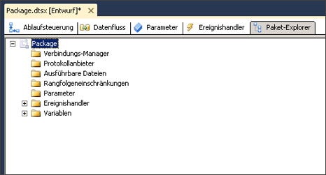

# Anzeigen von Paketobjekten
  Im [!INCLUDE[ssIS](../includes/ssis-md.md)] -Designer stellt die Registerkarte **Paket-Explorer** eine Explorer-Sicht des Pakets bereit. Diese Sicht gibt die Containerhierarchie der [!INCLUDE[ssISnoversion](../includes/ssisnoversion-md.md)] -Architektur wieder. Der Paketcontainer befindet sich ganz oben in der Hierarchie, und Sie erweitern das Paket, um die Verbindungen, ausführbaren Dateien, Ereignishandler, Protokollanbieter, Rangfolgeneinschränkungen und Variablen im Paket anzuzeigen.  
  
 Die ausführbaren Dateien, also die Container und Tasks im Paket, können Ereignishandler, Rangfolgeneinschränkungen und Variablen einschließen. [!INCLUDE[ssISnoversion](../includes/ssisnoversion-md.md)] unterstützt eine geschachtelte Hierarchie von Containern, und der For-Schleifencontainer, der Foreach-Schleifencontainer und der Sequenzcontainer können andere ausführbare Dateien einschließen.  
  
 Falls ein Paket einen Datenfluss enthält, wird im **Paket-Explorer** der Datenflusstask aufgelistet, und er enthält den Ordner **Komponenten** , in dem die Datenflusskomponenten aufgelistet werden.  
  
 Auf der Registerkarte **Paket-Explorer** können Sie Objekte in einem Paket löschen und auf das Fenster **Eigenschaften** zugreifen, um Objekteigenschaften anzuzeigen.  
  
 Das folgende Diagramm zeigt eine Strukturansicht eines einfachen Pakets.  
  
   
  
## Anzeigen der Paketstruktur und des Paketinhalts  
  
1.  Öffnen Sie in [!INCLUDE[ssBIDevStudioFull](../includes/ssbidevstudiofull-md.md)]das [!INCLUDE[ssISnoversion](../includes/ssisnoversion-md.md)] -Projekt mit dem Paket, das Sie im Bereich **Paket-Explorer**anzeigen möchten.  
  
2.  Klicken Sie auf die Registerkarte **Paket-Explorer** .  
  
3.  Um den Inhalt der Ordner **Variablen**, **Rangfolgeneinschränkungen**, **Ereignishandler**, **Verbindungs-Manager**, **Protokollanbieter**oder **Ausführbare Dateien** anzuzeigen, erweitern Sie den entsprechenden Ordner.  
  
4.  Erweitern Sie in Abhängigkeit von der Paketstruktur Ordner der nächsten Ebene.  
  
## Anzeigen der Eigenschaften eines Paketobjekts
  
-   Klicken Sie mit der rechten Maustaste auf ein Objekt, und klicken Sie auf **Eigenschaften** , um das Fenster **Eigenschaften** zu öffnen.  
  
## Löschen eines Objekts in einem Paket  
  
-   Klicken Sie mit der rechten Maustaste auf ein Objekt, und klicken Sie anschließend auf **Löschen**. 
 
## Weitere Informationen finden Sie unter  
 [Integration Services-Tasks](../integration-services/control-flow/integration-services-tasks.md)   
 [Integration Services-Container](../integration-services/control-flow/integration-services-containers.md)   
 [Rangfolgeneinschränkungen](../integration-services/control-flow/precedence-constraints.md)   
 [Integration Services-Variablen &#40;SSIS&#41;](../integration-services/integration-services-ssis-variables.md)   
 [Integration Services-Ereignishandler &#40;SSIS&#41;](../integration-services/integration-services-ssis-event-handlers.md)   
 [Integration Services-Protokollierung &#40;SSIS&#41;](../integration-services/performance/integration-services-ssis-logging.md)  
  
  
