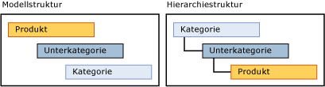

# Abgeleitete Hierarchien (Master Data Services)

[!INCLUDE[appliesto-ss-xxxx-xxxx-xxx-md-winonly](../includes/appliesto-ss-xxxx-xxxx-xxx-md-winonly.md)]

  Eine von [!INCLUDE[ssMDSshort](../includes/ssmdsshort-md.md)] abgeleitete Hierarchie wird von den domänenbasierten Attributbeziehungen abgeleitet, die zwischen Entitäten in einem Modell bereits vorhanden sind.  
  
 Sie können eine abgeleitete Hierarchie erstellen, um eine der vorhandenen domänenbasierten Attributbeziehungen im Modell hervorzuheben.  
  
## Blattelemente gruppieren andere Blattelemente  
 In einer abgeleiteten Hierarchie werden die Blattelemente von einer Entität verwendet, um die Blattelemente einer anderen Entität zu gruppieren. Eine abgeleitete Hierarchie basiert auf der Beziehung zwischen diesen Entitäten. Eine explizite Hierarchie basiert hingegen nur auf Elementen von einer einzelnen Entität und wird auf jede Weise strukturiert, die Sie angeben.  
  
 Sie können die Struktur einer abgeleiteten Hierarchie ändern, ohne dass sich dies auf die zugrunde liegenden Daten auswirkt. Solange die Beziehungen im Modell vorhanden sind, wirkt sich das Löschen einer abgeleiteten Hierarchie nicht auf die Masterdaten aus.  
  
## Explizite Hierarchien im Vergleich zu abgeleiteten Hierarchien  
 In der folgenden Tabelle werden einige der Unterschiede zwischen expliziten und abgeleiteten Hierarchien gezeigt.  
  
> [!NOTE]  
>  Explizite Hierarchien sind in dieser Version von [!INCLUDE[ssMDSshort](../includes/ssmdsshort-md.md)]veraltet.  
  
|Explizite Hierarchien|Abgeleitete Hierarchien|  
|--------------------------|-------------------------|  
|Struktur wird vom Benutzer definiert|Struktur wird von den Beziehungen zwischen domänenbasierten Attributen abgeleitet|  
|Enthält Elemente aus einer einzigen Entität|Enthält Elemente aus mehreren Entitäten|  
|Verwendet konsolidierte Elemente, um andere Elemente zu gruppieren|Verwendet Blattelemente von einer Entität, um Blattelemente von einer anderen Entität zu gruppieren|  
  
## Erstellen einer Variablentiefenhierarchie  
 Es gibt zwei Möglichkeiten, eine empfohlene Variablentiefenhierarchie zu erstellen:  
  
-   Wenn alle Ebenen dieselben Attribute haben sollen, erstellen Sie eine einzelne Entität und anschließend mithilfe eines domänenbasierten Attributs, das auf dieser Entität basiert, eine rekursive Hierarchie für diese Entität.  
  
-   Wenn Sie eine Gruppe von Attributen für die Blattelemente und einen anderen Satz von Attributen in den oberen Ebenen benötigen, erstellen Sie zwei Entitäten für eine abgeleitete Hierarchie. Für die Blattentität verwenden Sie ein domänenbasiertes Attribut, das auf der übergeordneten Entität basiert. Für die übergeordnete Entität verwenden Sie ein domänenbasiertes Attribut, das auf sich selbst basiert.  
  
## Beispiel für abgeleitete Hierarchie  
 Im folgenden Beispiel werden Blattelemente der Product-Entität nach Blattelementen der Subcategory-Entität gruppiert, die dann nach Blattelementen der Category-Entität gruppiert werden. Diese Hierarchie ist möglich, da die Product-Entität über ein domänenbasiertes Attribut mit dem Namen Unterkategorie verfügt, und die Subcategory-Entität verfügt über ein domänenbasiertes Attribut mit dem Namen Kategorie.  
  
 Die Hierarchiestruktur zeigt an, wie die Elemente gruppiert werden. Die Entität mit den meisten Elementen befindet sich am unteren Ende.  
  
   
  
 In einer abgeleiteten Hierarchie können Sie die Beziehung zwischen Product und Subcategory und anschließend zwischen Subcategory und Category hervorheben. Wenn Sie die Elemente in dieser Hierarchie anzeigen, enthält jede Ebene in der Struktur Elemente derselben Entität.  
  
   
  
 Bei diesem Hierarchietyp werden Sie daran gehindert, ein Element auf eine ungültige Ebene zu verschieben. Sie können z. B. das Road-650-Fahrrad von der Unterkategorie "Road Bikes" in eine andere Unterkategorie mit dem Namen "Mountain Bikes" verschieben. Es ist nicht möglich, "Road-650" direkt in eine Kategorie zu verschieben, z. B. "1 {Bikes}". Sobald Sie ein Element in der Hierarchiestruktur verschieben, ändert sich der Wert des domänenbasierten Attributs des Elements, um die Änderung anzuzeigen.  
  
## Hinweise  
 Alle Elemente in einer abgeleiteten Hierarchiestruktur sind nach Code sortiert. Die Sortierreihenfolge kann nicht geändert werden.  
  
 Wenn das domänenbasierte Attribut eines Elements leer ist und das Attribut für eine abgeleitete Hierarchie verwendet wird, dann wird das Element nicht in der Hierarchie angezeigt. Erstellen Sie Geschäftsregeln, um Attribute zu erhalten, die aufgefüllt werden müssen. Weitere Informationen finden Sie unter [Erfordern von Attributwerten &#40;Master Data Services&#41;](../master-data-services/require-attribute-values-master-data-services.md).  
  
## Related Tasks  
  
|Taskbeschreibung|Thema|  
|----------------------|-----------|  
|Erstellen Sie eine neue abgeleitete Hierarchie.|[Erstellen einer abgeleiteten Hierarchie &#40;Master Data Services&#41;](../master-data-services/create-a-derived-hierarchy-master-data-services.md)|  
|Blenden Sie Ebenen in einer vorhandenen abgeleiteten Hierarchie aus, oder löschen Sie Ebenen.|[Ausblenden oder Löschen von Ebenen in einer abgeleiteten Hierarchie &#40;Master Data Services&#41;](../master-data-services/hide-or-delete-levels-in-a-derived-hierarchy-master-data-services.md)|  
|Ändern Sie den Namen einer vorhandenen abgeleiteten Hierarchie.|[Ändern des Namens einer abgeleiteten Hierarchie &#40;Master Data Services&#41;](../master-data-services/change-a-derived-hierarchy-name-master-data-services.md)|  
|Löschen Sie eine vorhandene abgeleitete Hierarchie.|[Löschen einer abgeleiteten Hierarchie &#40;Master Data Services&#41;](../master-data-services/delete-a-derived-hierarchy-master-data-services.md)|  
  
## Verwandte Inhalte  
  
-   [Domänenbasierte Attribute &#40;Master Data Services&#41;](../master-data-services/domain-based-attributes-master-data-services.md)  
  
-   [Explizite Hierarchien &#40;Master Data Services&#41;](../master-data-services/explicit-hierarchies-master-data-services.md)  
  
-   [Rekursive Hierarchien &#40;Master Data Services&#41;](../master-data-services/recursive-hierarchies-master-data-services.md)  
  
-   [Abgeleitete Hierarchien mit expliziten Abschlüssen &#40;Master Data Services&#41;](../master-data-services/derived-hierarchies-with-explicit-caps-master-data-services.md)  
  
-   [Anzeigen von m:n-Beziehungen in abgeleiteten Hierarchien &#40;Master Data Services&#41;](../master-data-services/show-many-to-many-relationships-in-derived-hierarchies-master-data-services.md)  
  
-   [Sammlungen &#40;Master Data Services&#41;](../master-data-services/collections-master-data-services.md)  
  
  
