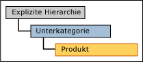
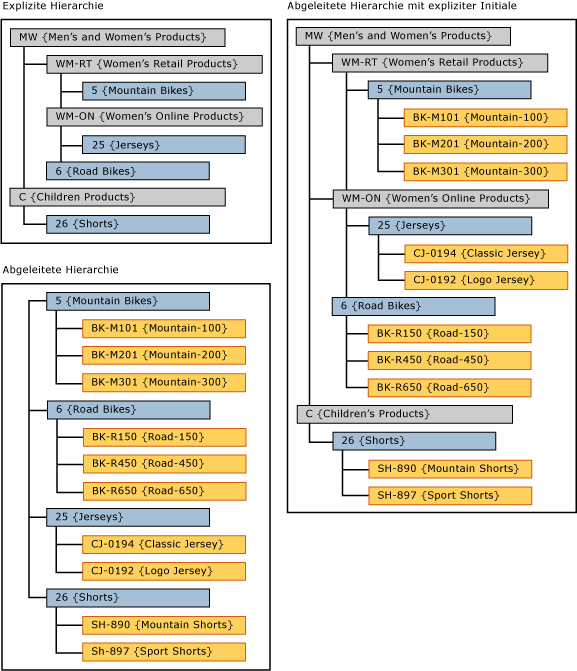

# Abgeleitete Hierarchien mit expliziten Abschl&#252;ssen (Master Data Services)
  Wenn in [!INCLUDE[ssMDSshort](../includes/ssmdsshort-md.md)]die Ebenen aus einer expliziten Hierarchie als oberste Ebenen einer abgeleiteten Hierarchie verwendet werden, wird dies als abgeleitete Hierarchie mit explizitem Abschluss bezeichnet.  
  
 Die explizite Hierarchie muss auf der gleichen Entität wie die Entität am oberen Ende der abgeleiteten Hierarchie basieren.  
  
 In der [!INCLUDE[ssMDSmdm](../includes/ssmdsmdm-md.md)]-Benutzeroberfläche erstellen Sie diesen Hierarchietyp durch Ziehen einer expliziten Hierarchie in die oberste Ebene einer abgeleiteten Hierarchie.  
  
   
  
## Beispiel für eine abgeleitete Hierarchie mit explizitem Abschluss  
 In diesem Beispiel stammen die Elemente in der expliziten Hierarchie aus der Entität Subcategory. In der abgeleiteten Hierarchie stammen die Elemente der obersten Ebene auch aus der Entität Unterkategorie.  
  
   
  
 Durch die Verwendung der expliziten Hierarchie am oberen Rand einer abgeleiteten Hierarchie wird die abgeleitete Hierarchie unregelmäßig.  
  
## Regeln  
  
-   Sie können nicht mehr als eine explizite Hierarchie in einer abgeleiteten Hierarchie mit explizitem Abschluss haben.  
  
-   Sie können die gleiche explizite Hierarchie als Abschluss für mehrere abgeleitete Hierarchien verwenden.  
  
-   Sie können keine Hierarchieelementberechtigungen an abgeleitete Hierarchien mit expliziten Abschlüssen zuweisen. Wenn Sie der expliziten Hierarchie oder der abgeleiteten Hierarchie einzeln Berechtigungen zuweisen, wirken sich die Berechtigungen auf beide Hierarchien aus.  
  
## Verwandte Aufgaben  
  
|Taskbeschreibung|Thema|  
|----------------------|-----------|  
|Erstellen Sie eine abgeleitete Hierarchie.|[Erstellen einer abgeleiteten Hierarchie &#40;Master Data Services&#41;](../master-data-services/create-a-derived-hierarchy-master-data-services.md)|  
|Erstellen Sie eine explizite Hierarchie.|[Erstellen einer expliziten Hierarchie &#40;Master Data Services&#41;](../master-data-services/create-an-explicit-hierarchy-master-data-services.md)|  
|Löschen Sie eine vorhandene abgeleitete Hierarchie.|[Löschen einer abgeleiteten Hierarchie &#40;Master Data Services&#41;](../master-data-services/delete-a-derived-hierarchy-master-data-services.md)|  
|||  
  
## Verwandte Inhalte  
  
-   [Abgeleitete Hierarchien &#40;Master Data Services&#41;](../master-data-services/derived-hierarchies-master-data-services.md)  
  
-   [Explizite Hierarchien &#40;Master Data Services&#41;](../master-data-services/explicit-hierarchies-master-data-services.md)  
  
  