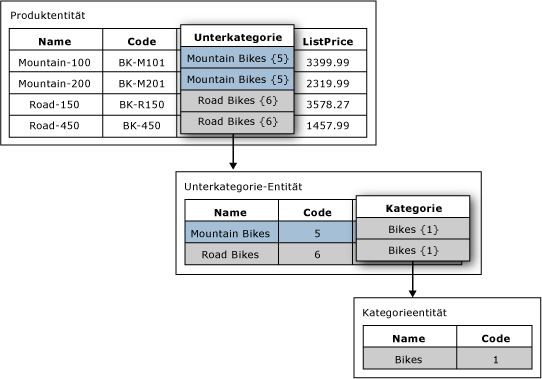

# Domänenbasierte Attribute (Master Data Services)
  In [!INCLUDE[ssMDSshort](../includes/ssmdsshort-md.md)]ist ein domänenbasiertes Attribut ein Attribut mit Werten, die mit Elementen aus einer anderen Entität aufgefüllt werden. Stellen Sie sich ein domänenbasiertes Attribut als eingeschränkte Liste vor. Domänenbasierte Attribute verhindern, dass Benutzer Attributwerte eingeben, die nicht gültig sind. Um einen Attributwert auszuwählen, muss der Benutzer aus einer Liste auswählen.  
  
## Beispiel für ein domänenbasiertes Attribut  
 Im folgenden Bild verfügt die Produktentität über das domänenbasierte Attribut namens "Subcategory". Das Subcategory-Attribut wird mit Werten aus der Subcategory-Entität aufgefüllt.  
  
 Die Entität Subcategory hat ein domänenbasiertes Attribut mit Namen Category. Das Category-Attribut wird mit Werten aus der Category-Entität aufgefüllt.  
  
   
  
## Dieselbe Entität für mehrere domänenbasierte Attribute verwenden  
 Sie können die gleiche Entität als domänenbasiertes Attribut mehrerer Entitäten verwenden. Sie können z. B. eine Entität mit dem Namen "YesNoIndicator" mit den folgenden Elementen erstellen: Yes, No und Maybe. Anschließend erstellen Sie ein domänenbasiertes Attribut mit dem Namen "InStock" und verwenden die "YesNoIndicator"-Entität als Quelle. Außerdem können Sie ein weiteres domänenbasiertes Attribut mit dem Namen "Approved" erstellen und die "YesNoIndicator"-Entität als Quelle verwenden. Jedes Mal, wenn Benutzer aus einer Liste von Elementen der "YesNoIndicator"-Entität auswählen sollen, können Sie die Entität als domänenbasiertes Attribut verwenden.  
  
## Domänenbasierte Attribute bilden abgeleitete Hierarchien  
 Domänenbasierte Attributbeziehungen sind die Grundlage für abgeleitete Hierarchien. Weitere Informationen finden Sie unter [Abgeleitete Hierarchien &#40;Master Data Services&#41;](../master-data-services/derived-hierarchies-master-data-services.md).  
  
## Verwandte Aufgaben  
  
|Taskbeschreibung|Thema|  
|----------------------|-----------|  
|Erstellen Sie ein neues domänenbasiertes Attribut, für das eine vorhandene Entität als Quelle fungiert.|[Erstellen eines domänenbasierten Attributs &#40;Master Data Services&#41;](../master-data-services/create-a-domain-based-attribute-master-data-services.md)|  
|Erstellen Sie eine neue Entität.|[Erstellen einer Entität &#40;Master Data Services&#41;](../master-data-services/create-an-entity-master-data-services.md)|  
  
## Verwandte Inhalte  
  
-   [Abgeleitete Hierarchien &#40;Master Data Services&#41;](../master-data-services/derived-hierarchies-master-data-services.md)  
  
-   [Attribute &#40;Master Data Services&#41;](../master-data-services/attributes-master-data-services.md)  
  
-   [Entitäten &#40;Master Data Services&#41;](../master-data-services/entities-master-data-services.md)  
  
  
