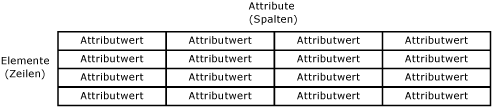
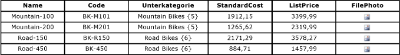
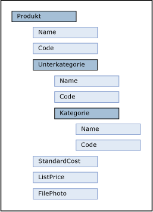

# Entitäten (Master Data Services)
  Entitäten sind Objekte, die in [!INCLUDE[ssMDSshort](../includes/ssmdsshort-md.md)] -Modellen enthalten sind. Jede Entität enthält Elemente, bei denen es sich um die Zeilen von Masterdaten handelt, die Sie verwalten.  
  
## Wie viele Entitäten sind angemessen?  
 Modelle können so viele Entitäten enthalten, wie Sie verwalten möchten. In jeder Entität sollte ähnliche Daten gruppiert werden. Sie können z. B. eine Entität für alle Ihre Unternehmenskonten, oder eine Entität für die Masterliste Ihrer Mitarbeiter erstellen.  
  
 Normalerweise verfügt ein Unternehmen über eine oder mehrere zentrale Entitäten, auf die von anderen Objekten im Modell verwiesen wird. In einem Produktmodell können Sie z. B. über eine zentrale Entität mit dem Namen "Product" sowie Entitäten mit den Namen "Subcategory" und "Category", die auf die Produkt-Entität verweisen, verfügen. Sie müssen jedoch nicht über eine zentrale Entität verfügen. Je nach Ihren Anforderungen könnten Sie über mehrere Entitäten von gleicher Wichtigkeit verfügen.  
  
## Zusammenhang zwischen Entitäten und anderen Modellobjekten  
 Sie können sich eine Entität als Tabelle vorstellen, die Masterdaten enthält und in der die Zeilen Elemente und die Spalten Attribute darstellen.  
  
   
  
 Sie füllen die Entität mit einer Liste von Masterdaten auf, die Sie verwalten möchten.  
  
 Entitäten können zum Erstellen abgeleiteter Hierarchien, d. h. ebenenbasierter Hierarchien basierend auf mehreren Entitäten, verwendet werden. Weitere Informationen finden Sie unter [Abgeleitete Hierarchien &#40;Master Data Services&#41;](../master-data-services/derived-hierarchies-master-data-services.md).  
  
 Entitäten kann es auch ermöglicht werden, explizite Hierarchien (unregelmäßige Strukturen basierend auf einer einzelnen Entität) und Auflistungen (einmalige Kombinationen der Teilmengen von Elementen) zu enthalten. Weitere Informationen finden Sie unter [Explizite Hierarchien &#40;Master Data Services&#41;](../master-data-services/explicit-hierarchies-master-data-services.md) und [Sammlungen &#40;Master Data Services&#41;](../master-data-services/collections-master-data-services.md).  
  
## Verwenden von Entitäten als eingeschränkte Listen  
 Wenn Benutzer den Elementen in einer Entität Attribute zuweisen, können Sie sie aus einer eingeschränkten Liste von Werten auswählen lassen. Verwenden Sie hierzu eine Entität, um die Liste der Werte für das Attribut aufzufüllen. In diesem Fall wird sie als domänenbasiertes Attribut bezeichnet. Weitere Informationen finden Sie unter [Domänenbasierte Attribute &#40;Master Data Services&#41;](../master-data-services/domain-based-attributes-master-data-services.md).  
  
## Basisentitäten  
 Beim Navigieren von Objekten im Modell ist eine Basisentität ein Ausgangspunkt für Benutzer. Eine Basisentität bestimmt das Layout des Bildschirms, wenn ein Benutzer den Funktionsbereich **Explorer** öffnet und in der Menüleiste auf **Explorer** klickt. Um eine Entität als Basisentität anzugeben, navigieren Sie zum Funktionsbereich **Systemverwaltung** . Ziehen Sie die Entität auf der Seite **Modellansicht** von der Strukturansicht rechts auf den Modellnamen in der Strukturansicht links.  
  
## Entitätssicherheit  
 Sie können Benutzern Berechtigungen für eine Entität geben, die verwandte Modellobjekte einschließt. Weitere Informationen finden Sie unter [Entitätsberechtigungen &#40;Master Data Services&#41;](../master-data-services/entity-permissions-master-data-services.md).  
  
## Beispiele für Entitäten  
 Das folgende Beispiel zeigt eine Entität, die über folgende Attribute verfügt: Name, Code, Subcategory, StandardCost, ListPrice und FilePhoto. Diese Attribute beschreiben die Elemente. Jedes Element wird durch eine einzelne Zeile mit Attributwerten dargestellt.  
  
   
  
 Im folgenden Beispiel stellt die Entität "Product" die zentrale Entität dar. Die Entität Subcategory ist ein domänenbasiertes Attribut der Entität Product. Die Entität Category ist ein domänenbasiertes Attribut der Entität Subcategory. StandardCost und ListPrice sind Freiformattribute der Produkt-Entität, und FilePhoto ist ein Dateiattribut der Produkt-Entität.  
  
   
  
> [!NOTE]  
>  Dieses Beispiel basiert auf der [!INCLUDE[ssMDSmdm](../includes/ssmdsmdm-md.md)] -Benutzeroberfläche. Die hierarchische Baumstruktur zeigt Beziehungen zwischen Entitäten und domänenbasierten Attributen an. Ihr Zweck besteht darin, die Beziehungen und nicht den Wichtigkeitsgrad darzustellen.  
  
## Verwandte Aufgaben  
  
|Taskbeschreibung|Thema|  
|----------------------|-----------|  
|Erstellen Sie eine neue Entität.|[Erstellen einer Entität &#40;Master Data Services&#41;](../master-data-services/create-an-entity-master-data-services.md)|  
|Ändern Sie den Namen einer vorhandenen Entität.|[Bearbeiten einer Entität &#40;Master Data Services&#41;](../master-data-services/edit-an-entity-master-data-services.md)|  
|Löschen Sie eine vorhandene Entität.|[Löschen einer Entität &#40;Master Data Services&#41;](../master-data-services/delete-an-entity-master-data-services.md)|  
|Weisen Sie Entitäten Berechtigungen zu.|[Zuweisen von Berechtigungen für Modellobjekte &#40;Master Data Services&#41;](../master-data-services/assign-model-object-permissions-master-data-services.md)|  
  
## Verwandte Inhalte  
  
-   [Modelle &#40;Master Data Services&#41;](../master-data-services/models-master-data-services.md)  
  
-   [Elemente &#40;Master Data Services&#41;](../master-data-services/members-master-data-services.md)  
  
-   [Attribute &#40;Master Data Services&#41;](../master-data-services/attributes-master-data-services.md)  
  
  

