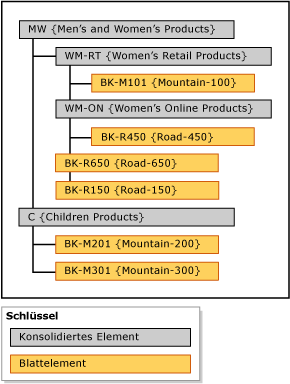

# Explizite Hierarchien (Master Data Services)
  In [!INCLUDE[ssMDSshort](../includes/ssmdsshort-md.md)]werden in expliziten Hierarchien Elemente aus einer einzelnen Entität auf eine von Ihnen angegebene Weise organisiert. Die Struktur kann unregelmäßig sein, und im Gegensatz zu abgeleiteten Hierarchien beruhen explizite Hierarchien nicht auf domänenbasierten Attributbeziehungen.  
  
> [!NOTE]  
>  Die explizite Hierarchie ist veraltet.  
  
## Konsolidierte Elemente gruppieren andere Elemente  
 Eine explizite Hierarchie verwendet konsolidierte Elemente, die Sie für die Gruppierung anderer Elemente erstellt haben. Diese konsolidierten Elemente gehören immer nur zu einer expliziten Hierarchie. Eine explizite Hierarchie schließt zudem alle Blattelemente der zugehörigen Entität ein.  
  
 Eine explizite Hierarchie kann unregelmäßig sein; das bedeutet, dass die Hierarchie gleichzeitig auf unterschiedlichen Ebenen enden kann. Jedes konsolidierte Element kann eine unbegrenzte Anzahl untergeordneter konsolidierter Elemente und Blattelemente oder überhaupt keine untergeordneten Elemente aufweisen. Die Blattelemente können sich unter einem einzelnen konsolidierten Element oder unter mehreren Ebenen konsolidierter Elemente befinden.  
  
> [!NOTE]  
>  Bevor Sie eine explizite Hierarchie erstellen können, muss die Entität für explizite Hierarchien aktiviert werden.  
  
## Typen expliziter Hierarchien  
 Es gibt zwei Typen von expliziten Hierarchien: erforderliche und nicht erforderliche Hierarchien.  
  
### Verbindliche explizite Hierarchie  
 Eine verbindliche explizite Hierarchie ist eine Hierarchie, in der alle Blattelemente in der Hierarchiestruktur enthalten sein müssen. Alle Elemente werden standardmäßig auf der Stammebene der Struktur angelegt. Sie können die Elemente bei Bedarf neu anordnen.  
  
### Nicht verbindliche explizite Hierarchie  
 Eine nicht verbindliche explizite Hierarchie ist eine Hierarchie, in der alle Blattelemente in einem vom System erstellten Knoten namens **Nicht verwendet** enthalten sind. Sie können Elemente von diesem Knoten aus verschieben, wenn Sie sie benötigen. Der übrigen Elemente verbleiben im Knoten **Nicht verwendet** .  
  
 Wenn Sie nicht verbindliche explizite Hierarchien verwenden, entsprechen möglicherweise für diese Hierarchie ausgeführte Berichts- oder Analyseaufgaben nicht den Berichts- und Analyseaufgaben in verbindlichen Hierarchien.  
  
## Regeln  
 Die folgenden Regeln gelten für explizite Hierarchien (sowohl verbindliche als auch nicht verbindliche).  
  
-   Jedes Blattelement kann nur einmal in die Hierarchie aufgenommen werden.  
  
-   Alle konsolidierten Elemente müssen in eine Hierarchie aufgenommen werden.  
  
-   Konsolidierte Elemente dürfen in maximal einer expliziten Hierarchie enthalten sein.  
  
-   Konsolidierte Elemente in der Hierarchiestruktur müssen keine untergeordneten Blattelemente haben.  
  
-   Wenn Sie eine explizite Hierarchie löschen, werden alle in der Hierarchie verwendeten konsolidierten Elemente gelöscht.  
  
-   Wenn Sie ein konsolidiertes Element löschen, das in einer expliziten Hierarchie enthalten war, werden alle von diesem konsolidierten Element gruppierten Blattelemente auf die Stammebene verschoben.  
  
## Explizite Hierarchien im Vergleich zu abgeleiteten Hierarchien  
 In der folgenden Tabelle werden einige der Unterschiede zwischen expliziten und abgeleiteten Hierarchien gezeigt.  
  
|Explizite Hierarchien|Abgeleitete Hierarchien|  
|--------------------------|-------------------------|  
|Struktur wird vom Benutzer definiert|Struktur wird von den Beziehungen zwischen domänenbasierten Attributen abgeleitet|  
|Enthält Elemente aus einer einzigen Entität|Enthält Elemente aus mehreren Entitäten|  
|Verwendet konsolidierte Elemente, um andere Elemente zu gruppieren|Verwendet Blattelemente von einer Entität, um Blattelemente von einer anderen Entität zu gruppieren|  
|Kann unregelmäßig sein|Enthält immer eine konsistente Anzahl an Ebenen|  
  
## Beispiel einer expliziten Hierarchie  
 Im folgenden Beispiel enthält die Product-Entität die folgenden Blattelemente: BK-M101 {Berg-100}, BK-M201 {Mountain-200}, BK-M301 {Berg-300}, BK-R150 {Straße-150}, BK-R450 {Straße-450} und BK-R650 {Straße-650}.  
  
 Um diese Blattelemente an bestimmten Konsolidierungspunkten zusammenzufassen, können Sie konsolidierte Elemente in der Product-Entität erstellen. Fügen Sie die konsolidierten Elemente auf den Ebenen der Hierarchiestruktur ein, auf denen Sie die Blattelemente zusammenfassen möchten. Es gibt keine Einschränkung hinsichtlich der Einfügung konsolidierter Elemente. Jedes Element (Blattelement oder konsolidiertes Element) darf jedoch nur einmal verwendet werden.  
  
   
  
 Konsolidierte Elemente können zum Gruppieren von Elementen auf beliebigen Ebenen verwendet werden. Konsolidierte Elemente und Blattelemente werden in der von Ihnen festgelegten Reihenfolge sortiert.  
  
## Related Tasks  
  
|Taskbeschreibung|Thema|  
|----------------------|-----------|  
|Erstellen Sie eine neue explizite Hierarchie.|[Erstellen einer expliziten Hierarchie &#40;Master Data Services&#41;](../master-data-services/create-an-explicit-hierarchy-master-data-services.md)|  
|Ändern Sie den Namen einer vorhandenen expliziten Hierarchie.|[Ändern des Namens einer expliziten Hierarchie &#40;Master Data Services&#41;](../master-data-services/change-an-explicit-hierarchy-name-master-data-services.md)|  
|Löschen Sie eine vorhandene explizite Hierarchie.|[Löschen einer expliziten Hierarchie &#40;Master Data Services&#41;](../master-data-services/delete-an-explicit-hierarchy-master-data-services.md)|  
|||  
  
## Verwandte Inhalte  
  
-   [Abgeleitete Hierarchien &#40;Master Data Services&#41;](../master-data-services/derived-hierarchies-master-data-services.md)  
  
-   [Sammlungen &#40;Master Data Services&#41;](../master-data-services/collections-master-data-services.md)  
  
  
