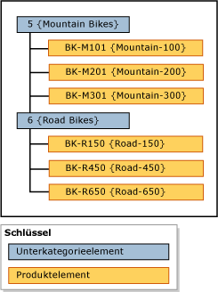

# Hierarchien (Master Data Services)
  In [!INCLUDE[ssMDSshort](../includes/ssmdsshort-md.md)]ist eine Hierarchie eine Baumstruktur, die Sie für folgende Zwecke verwenden können:  
  
-   Gruppieren ähnlicher Elemente zu organisatorischen Zwecken  
  
-   Konsolidieren und Zusammenfassen von Elementen zu Berichts- und Analysezwecken  
  
## Inhalt von Hierarchien  
 Jede Hierarchie enthält Elemente aus einer oder mehreren Entitäten. Wenn ein Element hinzugefügt, geändert oder gelöscht wird, werden alle Hierarchien aktualisiert. Dadurch wird sichergestellt, dass die Daten in allen Hierarchien exakt sind. Mit Hierarchien wird zudem sichergestellt, dass jedes Element genau einmal gezählt wird.  
  
 Wenn Sie eine Gruppierung einer Teilmenge von Elementen erstellen möchten, erwägen Sie die Verwendung einer Auflistung. Weitere Informationen finden Sie unter [Collections &#40;Master Data Services&#41;](../master-data-services/collections-master-data-services.md).  
  
## Arten von Hierarchien  
 Sie können mehrere Hierarchien erstellen, um Elemente auf verschiedene Weisen anzuzeigen und zu organisieren. Sie können Folgendes erstellen:  
  
-   Unregelmäßige Hierarchien für eine einzelne Entität, als explizite Hierarchien bezeichnet. Weitere Informationen finden Sie unter [Explicit Hierarchies &#40;Master Data Services&#41;](../master-data-services/explicit-hierarchies-master-data-services.md).  
  
-   Ebenenbasierte Hierarchien für mehrere Entitäten auf der Grundlage der vorhandenen Beziehungen zwischen Entitäten und deren Attributen, als abgeleitete Hierarchie bezeichnet. Weitere Informationen finden Sie unter [Derived Hierarchies &#40;Master Data Services&#41;](../master-data-services/derived-hierarchies-master-data-services.md).  
  
> [!NOTE]  
>  Alle Elemente in einer Hierarchie müssen demselben Modell angehören.  
  
## Hierarchien sind keine Taxonomien  
 Eine Hierarchie unterscheidet sich von einer Taxonomie. In einer Taxonomie werden Elemente nach mehreren Attributen gleichzeitig organisiert, während Elemente in einer Hierarchie jeweils nach einem Attribut organisiert werden. Eine Taxonomie kann das gleiche Element mehrfach enthalten, während eine Hierarchie ein Element nur einmal enthalten darf.  
  
 Beispielsweise kann das gleiche Fahrrad zweimal in eine Taxonomie aufgenommen werden, einmal, weil es rot ist, und ein weiteres Mal, weil es eine 38er Größe hat. In einer Hierarchie ist das Fahrrad nur einmal enthalten. Sie müssen also festlegen, ob es mit Bezug zu seiner Farbe oder Größe angezeigt werden soll.  
  
## Hierarchiebeispiel  
 Im folgenden Beispiel werden Produktelemente nach Unterkategorieelementen gruppiert.  
  
   
  
## Verwandte Aufgaben  
  
|Taskbeschreibung|Thema|  
|----------------------|-----------|  
|Erstellen Sie explizite Hierarchie.|[Erstellen Sie eine explizite Hierarchie &#40; Master Data Services &#41;](../master-data-services/create-an-explicit-hierarchy-master-data-services.md)|  
|Erstellen Sie eine abgeleitete Hierarchie.|[Erstellen Sie eine abgeleitete Hierarchie &#40; Master Data Services &#41;](../master-data-services/create-a-derived-hierarchy-master-data-services.md)|  
|Blenden Sie Ebenen in einer vorhandenen abgeleiteten Hierarchie aus, oder löschen Sie Ebenen.|[Ausblenden oder Löschen von Ebenen in einer abgeleiteten Hierarchie &#40; Master Data Services &#41;](../master-data-services/hide-or-delete-levels-in-a-derived-hierarchy-master-data-services.md)|  
  
## Verwandte Inhalte  
  
-   [Explizite Hierarchien &#40; Master Data Services &#41;](../master-data-services/explicit-hierarchies-master-data-services.md)  
  
-   [Abgeleitete Hierarchien &#40; Master Data Services &#41;](../master-data-services/derived-hierarchies-master-data-services.md)  
  
-   [Rekursive Hierarchien &#40; Master Data Services &#41;](../master-data-services/recursive-hierarchies-master-data-services.md)  
  
-   [Abgeleitete Hierarchien mit expliziten Abschlüssen &#40; Master Data Services &#41;](../master-data-services/derived-hierarchies-with-explicit-caps-master-data-services.md)  
  
-   [Schemaauflistungen &#40; Master Data Services &#41;](../master-data-services/collections-master-data-services.md)  
  
  

